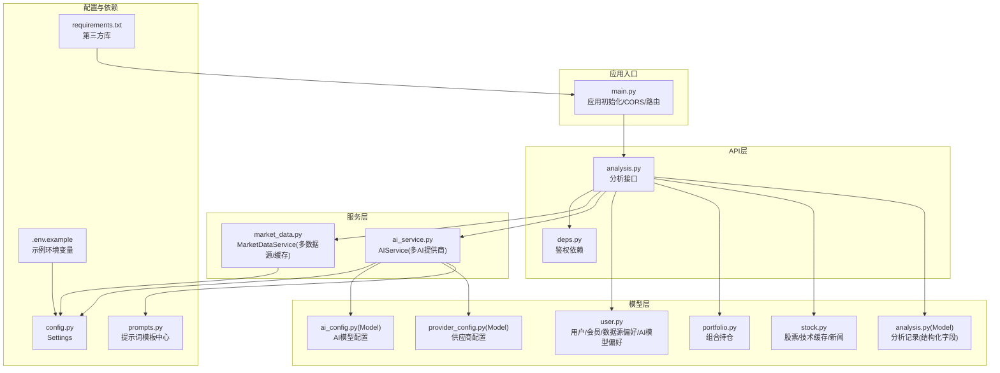
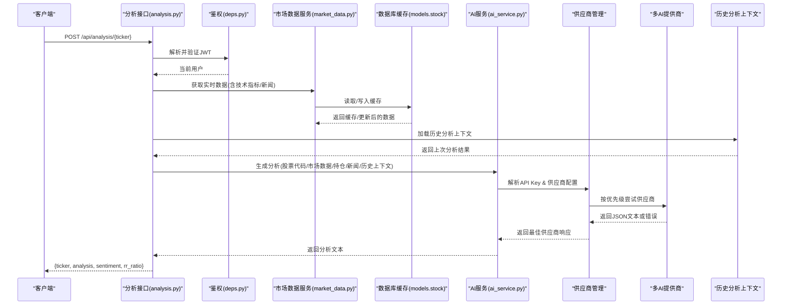
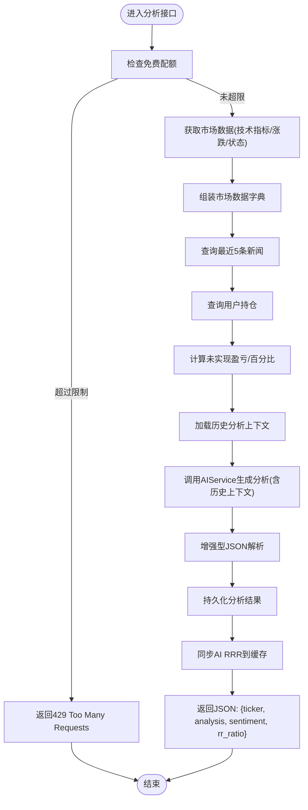
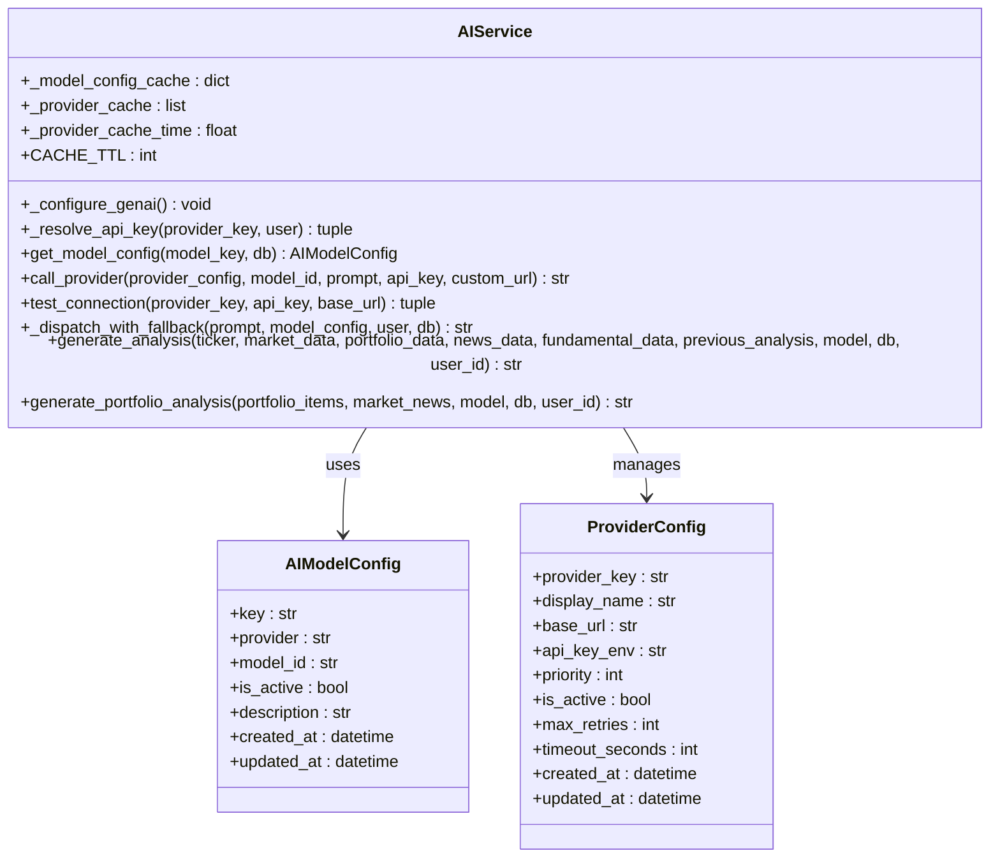
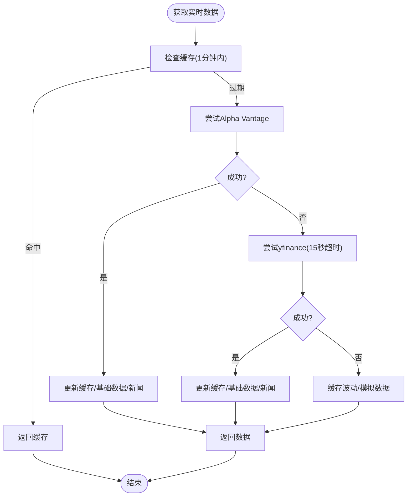
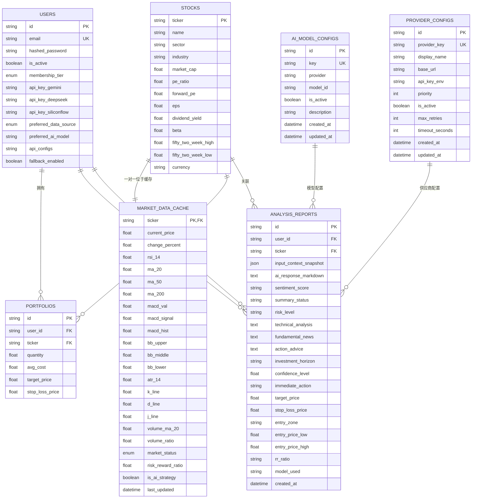
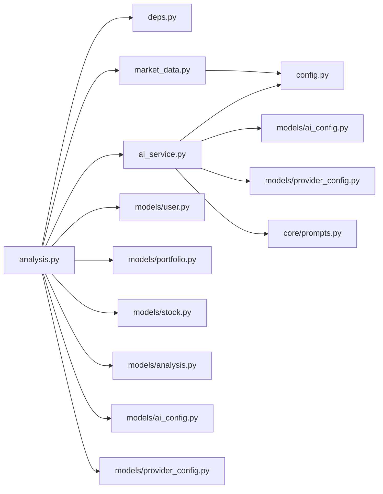

# AI智能分析服务

<cite>
**本文档引用的文件**
- [backend/app/main.py](file://backend/app/main.py)
- [backend/app/api/v1/endpoints/analysis.py](file://backend/app/api/v1/endpoints/analysis.py)
- [backend/app/api/deps.py](file://backend/app/api/deps.py)
- [backend/app/services/ai_service.py](file://backend/app/services/ai_service.py)
- [backend/app/services/market_data.py](file://backend/app/services/market_data.py)
- [backend/app/core/config.py](file://backend/app/core/config.py)
- [backend/app/core/prompts.py](file://backend/app/core/prompts.py)
- [backend/app/models/analysis.py](file://backend/app/models/analysis.py)
- [backend/app/models/stock.py](file://backend/app/models/stock.py)
- [backend/app/models/portfolio.py](file://backend/app/models/portfolio.py)
- [backend/app/models/user.py](file://backend/app/models/user.py)
- [backend/app/models/ai_config.py](file://backend/app/models/ai_config.py)
- [backend/app/models/provider_config.py](file://backend/app/models/provider_config.py)
- [backend/app/utils/ai_response_parser.py](file://backend/app/utils/ai_response_parser.py)
- [backend/requirements.txt](file://backend/requirements.txt)
- [.env.example](file://.env.example)
- [backend/scripts/test_batch_collection.py](file://backend/scripts/test_batch_collection.py)
- [backend/migrations/versions/33f174f249a3_add_structured_analysis_fields.py](file://backend/migrations/versions/33f174f249a3_add_structured_analysis_fields.py)
- [backend/migrations/versions/f3fe98d72c73_add_horizon_and_confidence.py](file://backend/migrations/versions/f3fe98d72c73_add_horizon_and_confidence.py)
- [backend/migrations/versions/15c8d26963f4_add_structured_action_fields.py](file://backend/migrations/versions/15c8d26963f4_add_structured_action_fields.py)
- [backend/migrations/versions/0675c6d039e6_create_ai_model_config_table.py](file://backend/migrations/versions/0675c6d039e6_create_ai_model_config_table.py)
- [backend/migrations/versions/ab4e342e4749_create_provider_configs_v4.py](file://backend/migrations/versions/ab4e342e4749_create_provider_configs_v4.py)
- [frontend/app/settings/page.tsx](file://frontend/app/settings/page.tsx)
- [backend/tests/test_byok_dispatch.py](file://backend/tests/test_byok_dispatch.py)
</cite>

## 更新摘要
**变更内容**
- AI服务已重构为多提供商系统，支持Gemini、SiliconFlow、DeepSeek等多家AI提供商
- 引入集中式供应商配置管理，支持动态API密钥解析和故障转移
- 新增提示词模板中心，实现提示工程的集中化管理
- 增强了BYOK（Bring Your Own Key）支持，用户可自定义供应商配置
- 完善了AI模型配置表，支持多模型动态切换和缓存机制
- 新增供应商配置模型，支持优先级排序和超时控制

## 目录
1. [简介](#简介)
2. [项目结构](#项目结构)
3. [核心组件](#核心组件)
4. [架构总览](#架构总览)
5. [详细组件分析](#详细组件分析)
6. [依赖分析](#依赖分析)
7. [性能考虑](#性能考虑)
8. [故障排查指南](#故障排查指南)
9. [结论](#结论)
10. [附录](#附录)

## 简介
本项目为"AI智能分析服务"，围绕美股股票提供一体化的智能分析能力。系统通过FastAPI提供REST接口，后端集成了多AI提供商（Gemini、DeepSeek、Qwen、SiliconFlow等）进行自然语言分析，结合技术面与消息面数据，输出中文JSON格式的投资建议。系统的核心创新在于AI分析指令的优化，强调基于最新数据的适应性调整而非僵化的策略一致性，显著提升了AI决策的灵活性和准确性。

**全新重构**：系统现已重构为多提供商架构，引入集中式供应商配置管理、动态API密钥解析和工厂模式设计，支持用户自定义供应商配置和故障转移机制。通过提示词模板中心实现提示工程的标准化管理，增强系统的可扩展性和维护性。

## 项目结构
后端采用分层架构：
- 应用入口与路由：FastAPI应用、CORS中间件、路由注册
- API层：鉴权依赖、分析接口
- 服务层：AI服务（多AI提供商支持）、市场数据服务（多数据源+缓存）
- 模型层：数据库实体（用户、股票、技术缓存、分析记录、组合、AI模型配置、供应商配置）
- 配置层：环境变量与密钥管理
- 工具脚本：批量数据采集测试
- 提示管理：集中式提示词模板管理

**图表来源**
- [backend/app/main.py:1-38](file://backend/app/main.py#L1-L38)
- [backend/app/api/v1/endpoints/analysis.py:1-745](file://backend/app/api/v1/endpoints/analysis.py#L1-L745)
- [backend/app/api/deps.py:1-44](file://backend/app/api/deps.py#L1-L44)
- [backend/app/services/ai_service.py:1-254](file://backend/app/services/ai_service.py#L1-L254)
- [backend/app/services/market_data.py:1-370](file://backend/app/services/market_data.py#L1-L370)
- [backend/app/core/config.py:1-36](file://backend/app/core/config.py#L1-L36)
- [backend/app/core/prompts.py:1-192](file://backend/app/core/prompts.py#L1-L192)
- [backend/app/models/user.py:1-80](file://backend/app/models/user.py#L1-L80)
- [backend/app/models/portfolio.py:1-26](file://backend/app/models/portfolio.py#L1-L26)
- [backend/app/models/stock.py:1-85](file://backend/app/models/stock.py#L1-L85)
- [backend/app/models/analysis.py:1-63](file://backend/app/models/analysis.py#L1-L63)
- [backend/app/models/ai_config.py:1-20](file://backend/app/models/ai_config.py#L1-L20)
- [backend/app/models/provider_config.py:1-48](file://backend/app/models/provider_config.py#L1-L48)
- [backend/requirements.txt:1-75](file://backend/requirements.txt#L1-L75)
- [.env.example:1-9](file://.env.example#L1-L9)

## 核心组件
- 应用入口与路由
  - 初始化FastAPI应用，启用CORS，注册认证、用户、组合、分析路由
- 鉴权依赖
  - 基于OAuth2 Bearer Token，校验JWT并解析用户
- 分析接口
  - 校验SaaS配额（免费用户每日限制），拉取市场数据、新闻、用户持仓，调用AI服务生成分析
  - **新增**：历史分析上下文集成，支持基于最新数据的适应性调整
- AI服务（多AI提供商）
  - **重构**：引入多提供商架构，支持Gemini、SiliconFlow、DeepSeek等多家供应商
  - **新增**：集中式供应商配置管理，支持动态API密钥解析和故障转移
  - **新增**：BYOK（Bring Your Own Key）支持，用户可自定义供应商配置
  - **新增**：AI模型配置缓存机制，提高响应速度
  - **新增**：供应商优先级排序和超时控制
- 市场数据服务
  - 多数据源优先策略（Alpha Vantage优先，yfinance备选），缓存技术指标，回退模拟数据
- 数据模型
  - 用户、股票、技术缓存、新闻、组合、分析记录、AI模型配置、**新增**：供应商配置

**章节来源**
- [backend/app/main.py:1-38](file://backend/app/main.py#L1-L38)
- [backend/app/api/deps.py:17-44](file://backend/app/api/deps.py#L17-L44)
- [backend/app/api/v1/endpoints/analysis.py:241-599](file://backend/app/api/v1/endpoints/analysis.py#L241-L599)
- [backend/app/services/ai_service.py:22-254](file://backend/app/services/ai_service.py#L22-L254)
- [backend/app/services/market_data.py:14-170](file://backend/app/services/market_data.py#L14-L170)
- [backend/app/models/user.py:29-80](file://backend/app/models/user.py#L29-L80)
- [backend/app/models/stock.py:13-85](file://backend/app/models/stock.py#L13-L85)
- [backend/app/models/portfolio.py:7-26](file://backend/app/models/portfolio.py#L7-L26)
- [backend/app/models/analysis.py:12-63](file://backend/app/models/analysis.py#L12-L63)
- [backend/app/models/ai_config.py:6-20](file://backend/app/models/ai_config.py#L6-L20)
- [backend/app/models/provider_config.py:12-48](file://backend/app/models/provider_config.py#L12-L48)

## 架构总览
系统采用"API网关层 → 业务编排层 → 服务层 → 数据层"的分层设计。分析流程从API入口开始，经鉴权与配额校验，拉取市场数据与上下文，再调用AI服务生成分析结果，最终返回JSON。**核心重构**：AI服务现在采用多提供商架构，通过集中式供应商配置实现动态API密钥解析和故障转移，显著提升了系统的可扩展性和可靠性。

**图表来源**
- [backend/app/api/v1/endpoints/analysis.py:241-599](file://backend/app/api/v1/endpoints/analysis.py#L241-L599)
- [backend/app/api/deps.py:17-44](file://backend/app/api/deps.py#L17-L44)
- [backend/app/services/market_data.py:14-170](file://backend/app/services/market_data.py#L14-L170)
- [backend/app/models/stock.py:33-67](file://backend/app/models/stock.py#L33-L67)
- [backend/app/services/ai_service.py:161-211](file://backend/app/services/ai_service.py#L161-L211)

## 详细组件分析

### 组件A：分析接口（analysis.py）
- 功能职责
  - 配额校验（免费用户每日上限）
  - 拉取市场数据（技术指标、涨跌幅、状态）
  - 拉取新闻上下文（最近5条）
  - 获取用户持仓（成本、数量、未实现盈亏）
  - **新增**：加载历史分析上下文，支持适应性调整
  - 调用AI服务生成分析
  - 返回标准化JSON
- 关键流程
  - 读取用户偏好数据源（Alpha Vantage优先）
  - 组装市场数据字典
  - 组装新闻列表
  - 计算未实现盈亏与百分比
  - **新增**：查询并加载历史分析报告作为上下文
  - 调用AIService生成分析
- 错误与降级
  - 市场数据对象缺失时使用默认值
  - 配额超限返回429
  - AI异常时返回错误提示
  - **新增**：历史数据解析失败时的降级处理

**图表来源**
- [backend/app/api/v1/endpoints/analysis.py:241-599](file://backend/app/api/v1/endpoints/analysis.py#L241-L599)

**章节来源**
- [backend/app/api/v1/endpoints/analysis.py:241-599](file://backend/app/api/v1/endpoints/analysis.py#L241-L599)

### 组件B：AI服务（ai_service.py）- 重构版
- 功能职责
  - **重构**：多提供商架构支持（Gemini、SiliconFlow、DeepSeek等）
  - **新增**：集中式供应商配置管理
  - **新增**：动态API密钥解析（BYOK支持）
  - **新增**：供应商优先级排序和故障转移
  - **新增**：AI模型配置缓存机制
  - 构建中文提示词（技术面、消息面、持仓背景、历史上下文）
  - 调用AI模型生成内容，强制JSON响应
  - 异常降级：JSON模式失败时回退普通文本
- 提示工程要点
  - 明确角色（资深美股投资顾问）
  - **新增**：历史上下文集成，支持适应性调整而非僵化策略
  - 结构化任务与输出约束（JSON字段）
  - 上下文拼接（技术指标、新闻、持仓、历史分析）
- 错误处理
  - 缺少Key时返回模拟Markdown提示
  - 两次调用均失败时返回错误摘要
  - **新增**：供应商故障转移机制

**图表来源**
- [backend/app/services/ai_service.py:22-254](file://backend/app/services/ai_service.py#L22-L254)
- [backend/app/models/ai_config.py:6-20](file://backend/app/models/ai_config.py#L6-L20)
- [backend/app/models/provider_config.py:12-48](file://backend/app/models/provider_config.py#L12-L48)

**章节来源**
- [backend/app/services/ai_service.py:22-254](file://backend/app/services/ai_service.py#L22-L254)
- [backend/app/models/ai_config.py:6-20](file://backend/app/models/ai_config.py#L6-L20)
- [backend/app/models/provider_config.py:12-48](file://backend/app/models/provider_config.py#L12-L48)

### 组件C：供应商配置管理
- 功能职责
  - **新增**：集中式供应商配置管理
  - **新增**：供应商优先级排序（数字越小优先级越高）
  - **新增**：动态API基地址支持
  - **新增**：超时控制和最大重试次数配置
  - **新增**：启用/禁用状态管理
- 配置项
  - provider_key：供应商唯一标识（如"siliconflow"、"gemini"）
  - display_name：显示名称（如"SiliconFlow"、"Gemini"）
  - base_url：API基地址（支持动态修改）
  - api_key_env：对应环境变量名
  - priority：故障转移优先级
  - is_active：是否启用
  - max_retries：最大重试次数
  - timeout_seconds：请求超时时间

**章节来源**
- [backend/app/models/provider_config.py:12-48](file://backend/app/models/provider_config.py#L12-L48)
- [backend/migrations/versions/ab4e342e4749_create_provider_configs_v4.py:24-49](file://backend/migrations/versions/ab4e342e4749_create_provider_configs_v4.py#L24-L49)

### 组件D：提示词模板中心（prompts.py）
- 功能职责
  - **新增**：集中式提示词模板管理
  - **新增**：合规性免责声明标准化
  - **新增**：个股分析模板（STOCK_ANALYSIS_PROMPT_TEMPLATE）
  - **新增**：投资组合分析模板（PORTFOLIO_ANALYSIS_PROMPT_TEMPLATE）
  - **新增**：构建函数（build_stock_analysis_prompt、build_portfolio_analysis_prompt）
- 模板特点
  - **新增**：历史分析上下文集成
  - **新增**：合规性声明标准化
  - **新增**：多维度数据分析框架
  - **新增**：严格JSON输出格式要求
  - **新增**：思维过程和情景标签字段

**章节来源**
- [backend/app/core/prompts.py:1-192](file://backend/app/core/prompts.py#L1-L192)

### 组件E：AI响应解析器（ai_response_parser.py）
- 功能职责
  - **新增**：统一的AI响应JSON提取与清洗逻辑
  - **新增**：错误前缀检测和降级处理
  - **新增**：正则提取和Markdown包装移除
  - **新增**：组合分析专用解析器
- 解析策略
  - **新增**：错误检测（Error前缀）
  - **新增**：正则提取最外层{}块
  - **新增**：控制字符清洗
  - **新增**：Markdown代码块包装移除
  - **新增**：降级字典模板

**章节来源**
- [backend/app/utils/ai_response_parser.py:1-125](file://backend/app/utils/ai_response_parser.py#L1-L125)

### 组件F：市场数据服务（market_data.py）
- 功能职责
  - 多数据源优先策略：Alpha Vantage优先，yfinance备选
  - 缓存机制：1分钟内命中缓存，避免重复抓取
  - 技术指标计算：RSI、MACD、布林带、KDJ、ATR、成交量相关
  - 新闻入库：SQLite去重插入
  - 回退策略：缓存+模拟数据
- 性能优化
  - 异步执行外部请求
  - 超时控制与指数退避
  - 批量更新与事务提交
- 错误处理
  - 429限流时指数退避
  - 失败回退至缓存或模拟数据

**图表来源**
- [backend/app/services/market_data.py:14-170](file://backend/app/services/market_data.py#L14-L170)

**章节来源**
- [backend/app/services/market_data.py:14-170](file://backend/app/services/market_data.py#L14-L170)

### 组件G：数据模型（models）
- 用户（user.py）
  - 会员等级、加密存储的API Key、首选数据源、**新增**：首选AI模型
  - **新增**：BYOK支持（api_configs字段）
  - **新增**：故障转移开关（fallback_enabled）
- 组合（portfolio.py）
  - 持仓数量、平均成本、目标价/止损价
- 股票与缓存（stock.py）
  - 股票基本信息与技术指标缓存表
  - 市场状态枚举
- 分析记录（analysis.py）
  - 输入快照JSON、AI输出Markdown、情感评分、模型标识、创建时间
  - **新增**：结构化分析字段，包括技术分析、基本面新闻、操作建议、风险等级、投资期限、置信度、交易指令、价格关键点、盈亏比
- AI模型配置（ai_config.py）
  - **新增**：AI模型配置表，支持动态模型管理
  - **新增**：模型键、提供商、模型ID、激活状态、描述
- 供应商配置（provider_config.py）
  - **新增**：供应商配置表，支持多提供商管理
  - **新增**：供应商键、显示名、基地址、环境变量、优先级、激活状态、重试次数、超时时间

**图表来源**
- [backend/app/models/user.py:29-80](file://backend/app/models/user.py#L29-L80)
- [backend/app/models/portfolio.py:7-26](file://backend/app/models/portfolio.py#L7-L26)
- [backend/app/models/stock.py:13-85](file://backend/app/models/stock.py#L13-L85)
- [backend/app/models/analysis.py:12-63](file://backend/app/models/analysis.py#L12-L63)
- [backend/app/models/ai_config.py:6-20](file://backend/app/models/ai_config.py#L6-L20)
- [backend/app/models/provider_config.py:12-48](file://backend/app/models/provider_config.py#L12-L48)

**章节来源**
- [backend/app/models/user.py:29-80](file://backend/app/models/user.py#L29-L80)
- [backend/app/models/portfolio.py:7-26](file://backend/app/models/portfolio.py#L7-L26)
- [backend/app/models/stock.py:13-85](file://backend/app/models/stock.py#L13-L85)
- [backend/app/models/analysis.py:12-63](file://backend/app/models/analysis.py#L12-L63)
- [backend/app/models/ai_config.py:6-20](file://backend/app/models/ai_config.py#L6-L20)
- [backend/app/models/provider_config.py:12-48](file://backend/app/models/provider_config.py#L12-L48)

### 组件H：配置与依赖（config.py, requirements.txt, .env.example）
- 配置项
  - 数据库URL、JWT密钥与算法、过期时间
  - **新增**：多提供商API Key支持（Gemini、DeepSeek、SiliconFlow）
  - HTTP代理
- 依赖
  - FastAPI、SQLAlchemy、google-generativeai、yfinance、pandas、requests等
- 环境变量
  - 示例文件包含数据库、各提供商Key、Secret Key与前端地址

**章节来源**
- [backend/app/core/config.py:4-36](file://backend/app/core/config.py#L4-L36)
- [backend/requirements.txt:1-75](file://backend/requirements.txt#L1-L75)
- [.env.example:1-9](file://.env.example#L1-L9)

### 组件I：批量分析与性能测试（test_batch_collection.py）
- 目的
  - 批量抓取历史最久的缓存项，验证多数据源与缓存更新
- 行为
  - 查询MarketDataCache最旧10条，逐个更新并打印基本面与技术指标
  - 控制并发节奏，避免触发限流

**章节来源**
- [backend/scripts/test_batch_collection.py:16-85](file://backend/scripts/test_batch_collection.py#L16-L85)

### 组件J：BYOK测试（test_byok_dispatch.py）
- 功能测试
  - **新增**：用户自定义API配置解析测试
  - **新增**：系统级API Key回退测试
  - **新增**：故障转移禁用测试
  - **新增**：连接测试功能
- 测试场景
  - 用户提供自定义供应商配置时的解析
  - 用户未配置时的系统级Key回退
  - 用户禁用故障转移时的行为
  - 供应商连接性测试

**章节来源**
- [backend/tests/test_byok_dispatch.py:1-99](file://backend/tests/test_byok_dispatch.py#L1-L99)

## 依赖分析
- 组件耦合
  - 分析接口依赖鉴权、市场数据、AI服务、模型层（用户、组合、股票、分析记录、AI模型配置、供应商配置）
  - AI服务依赖配置与多AI提供商SDK、**新增**：AI模型配置表、供应商配置表、提示词模板中心
  - 市场数据服务依赖yfinance/Alpha Vantage与数据库缓存
- 外部依赖
  - Google Generative AI、yfinance、requests、SQLAlchemy、pandas
- 可能的循环依赖
  - 未见模块间循环导入

**图表来源**
- [backend/app/api/v1/endpoints/analysis.py:1-745](file://backend/app/api/v1/endpoints/analysis.py#L1-L745)
- [backend/app/api/deps.py:1-44](file://backend/app/api/deps.py#L1-L44)
- [backend/app/services/ai_service.py:1-254](file://backend/app/services/ai_service.py#L1-L254)
- [backend/app/services/market_data.py:1-370](file://backend/app/services/market_data.py#L1-L370)
- [backend/app/core/config.py:1-36](file://backend/app/core/config.py#L1-L36)
- [backend/app/core/prompts.py:1-192](file://backend/app/core/prompts.py#L1-L192)
- [backend/app/models/user.py:1-80](file://backend/app/models/user.py#L1-L80)
- [backend/app/models/portfolio.py:1-26](file://backend/app/models/portfolio.py#L1-L26)
- [backend/app/models/stock.py:1-85](file://backend/app/models/stock.py#L1-L85)
- [backend/app/models/analysis.py:1-63](file://backend/app/models/analysis.py#L1-L63)
- [backend/app/models/ai_config.py:1-20](file://backend/app/models/ai_config.py#L1-L20)
- [backend/app/models/provider_config.py:1-48](file://backend/app/models/provider_config.py#L1-L48)

## 性能考虑
- 缓存策略
  - 市场数据缓存1分钟，减少外部API压力
  - 基础数据按需更新，避免频繁写入
  - **新增**：AI模型配置缓存5分钟，提高多模型切换性能
  - **新增**：供应商配置缓存10分钟，减少数据库查询
- 并发与超时
  - 异步执行外部请求，设置yfinance超时
  - 指数退避应对429限流
  - **新增**：供应商超时控制和最大重试次数
- 批量处理
  - 提供批量采集脚本，控制请求节奏
- 输出与序列化
  - AI返回JSON字符串，前端统一解析
- 建议
  - 对热点股票增加更短缓存窗口
  - 引入Redis缓存提升并发性能
  - 增加异步队列处理分析请求

## 故障排查指南
- 常见问题
  - Gemini API Key缺失：AI返回模拟提示
  - 免费配额超限：返回429，引导用户配置自有Key
  - yfinance限流：自动指数退避，必要时切换Alpha Vantage
  - Alpha Vantage配额耗尽：抛出明确异常，回退缓存或模拟
  - **新增**：AI模型配置错误：检查AI_MODEL_CONFIGS表配置
  - **新增**：供应商配置错误：检查PROVIDER_CONFIGS表配置
  - **新增**：BYOK配置解析失败：检查用户api_configs字段
- 定位步骤
  - 检查.env配置与密钥
  - 查看日志与异常堆栈
  - 核对数据库缓存与技术指标
  - 使用批量脚本验证数据采集链路
  - **新增**：检查AI模型配置表和历史分析上下文
  - **新增**：验证供应商配置和API Key解析
- 降级策略
  - 缓存数据波动更新
  - 模拟合理范围内的价格与涨跌幅
  - 回退到yfinance或Alpha Vantage备选源
  - **新增**：模型配置回退到默认DeepSeek V3
  - **新增**：供应商故障转移机制

**章节来源**
- [backend/app/services/ai_service.py:58-92](file://backend/app/services/ai_service.py#L58-L92)
- [backend/app/api/v1/endpoints/analysis.py:256-275](file://backend/app/api/v1/endpoints/analysis.py#L256-L275)
- [backend/app/services/market_data.py:29-86](file://backend/app/services/market_data.py#L29-L86)
- [backend/tests/test_byok_dispatch.py:1-99](file://backend/tests/test_byok_dispatch.py#L1-L99)

## 结论
本系统以多AI提供商为核心，结合多数据源与缓存机制，实现了稳定高效的股票智能分析能力。**核心重构**在于AI服务架构的全面升级，引入多提供商系统、集中式供应商配置管理和BYOK支持，显著提升了系统的可扩展性、可靠性和用户体验。

通过集中式提示词模板管理，确保了提示工程的标准化和可维护性。AI模型配置缓存和供应商配置缓存机制大幅提升了响应性能。故障转移机制和超时控制确保了服务的高可用性。

**新增功能亮点**：
- 多提供商架构支持（Gemini、SiliconFlow、DeepSeek等）
- BYOK支持，用户可自定义供应商配置
- 集中式供应商配置管理
- 提示词模板中心化管理
- AI模型配置缓存机制
- 供应商故障转移和超时控制

未来可在缓存、队列、监控与更多AI模型扩展方面持续演进。

## 附录

### JSON格式化输出规范与数据结构设计
- 输出结构
  - 字段：股票代码、分析文本、情感倾向、**新增**：盈亏比（RRR）、模型使用
- AI输出约束
  - 中文提示词，强制JSON响应
  - JSON字段：技术面分析、消息面解读、操作建议、**新增**：历史分析上下文
- 存储建议
  - 分析记录表保存输入快照与AI输出Markdown，便于审计与复现
  - **新增**：支持历史分析上下文的完整存储

**章节来源**
- [backend/app/api/v1/endpoints/analysis.py:507-509](file://backend/app/api/v1/endpoints/analysis.py#L507-L509)
- [backend/app/services/ai_service.py:214-253](file://backend/app/services/ai_service.py#L214-L253)
- [backend/app/models/analysis.py:12-63](file://backend/app/models/analysis.py#L12-L63)

### AI提示工程最佳实践
- 角色设定清晰（资深美股顾问）
- 上下文完备（技术面、消息面、持仓背景、**新增**：历史分析上下文）
- 任务拆解明确（综合分析、消息影响、操作建议）
- **新增**：适应性调整原则
  - 基于最新数据微调或不调整策略
  - 市场形势发生重大改变时明确指出改变原因
  - 保持策略一致性的同时允许灵活调整
- 输出格式约束（JSON字段清单）
- 语言与风格（中文、简洁、可执行）
- **新增**：提示词模板标准化管理

**章节来源**
- [backend/app/services/ai_service.py:214-253](file://backend/app/services/ai_service.py#L214-L253)
- [backend/app/core/prompts.py:14-93](file://backend/app/core/prompts.py#L14-L93)

### 多股票批量分析与性能优化
- 批量采集脚本
  - 选取最旧缓存项，逐个更新并打印关键指标
  - 控制请求间隔，降低限流风险
- 性能优化方向
  - 缓存窗口与失效策略
  - 异步并发与超时控制
  - 备选数据源与回退策略
  - **新增**：AI模型配置缓存机制
  - **新增**：供应商配置缓存机制

**章节来源**
- [backend/scripts/test_batch_collection.py:16-85](file://backend/scripts/test_batch_collection.py#L16-L85)
- [backend/app/services/market_data.py:29-86](file://backend/app/services/market_data.py#L29-L86)
- [backend/app/services/ai_service.py:28-56](file://backend/app/services/ai_service.py#L28-L56)

### 错误处理与降级策略
- Gemini异常
  - JSON模式失败时回退普通文本
  - 最终失败返回错误摘要
- 配额与鉴权
  - 429限流与凭据无效时的明确错误
- 数据源异常
  - Alpha Vantage/429限流、yfinance超时与失败回退
- **新增**：AI模型配置异常
  - 数据库连接失败时使用硬编码回退配置
  - 默认回退到DeepSeek V3模型
- **新增**：供应商配置异常
  - 供应商不可用时的故障转移
  - API Key解析失败时的回退机制

**章节来源**
- [backend/app/services/ai_service.py:161-211](file://backend/app/services/ai_service.py#L161-L211)
- [backend/app/api/v1/endpoints/analysis.py:486-501](file://backend/app/api/v1/endpoints/analysis.py#L486-L501)
- [backend/app/services/market_data.py:303-318](file://backend/app/services/market_data.py#L303-L318)
- [backend/tests/test_byok_dispatch.py:1-99](file://backend/tests/test_byok_dispatch.py#L1-L99)

### 可扩展性设计（支持其他AI模型）
- 接口抽象
  - AIService作为适配层，便于替换不同模型
  - **新增**：多模型动态配置管理
  - **新增**：供应商配置抽象
- 配置与密钥
  - Settings集中管理多模型密钥
  - **新增**：AIModelConfig表管理模型配置
  - **新增**：ProviderConfig表管理供应商配置
- 提示词与输出
  - 保持提示词结构与JSON输出约定，降低迁移成本
  - **新增**：提示词模板中心化管理
  - **新增**：模型配置缓存机制，提高切换性能
- **新增**：BYOK支持
  - 用户可自定义供应商配置
  - 支持自定义API基地址
  - 动态API Key解析

**章节来源**
- [backend/app/services/ai_service.py:58-92](file://backend/app/services/ai_service.py#L58-L92)
- [backend/app/core/config.py:14-23](file://backend/app/core/config.py#L14-L23)
- [backend/app/models/ai_config.py:6-20](file://backend/app/models/ai_config.py#L6-L20)
- [backend/app/models/provider_config.py:12-48](file://backend/app/models/provider_config.py#L12-L48)
- [frontend/app/settings/page.tsx:300-318](file://frontend/app/settings/page.tsx#L300-L318)

### 调试工具与性能监控方案
- 调试工具
  - 批量采集脚本验证数据链路
  - 日志记录与异常捕获
  - **新增**：AI提示词日志记录
  - **新增**：BYOK配置测试工具
- 性能监控
  - 请求耗时与成功率统计
  - 缓存命中率与外部API延迟
  - **新增**：AI模型配置缓存命中率
  - **新增**：供应商配置缓存命中率
  - **新增**：故障转移成功率
  - 建议引入APM与指标面板

**章节来源**
- [backend/scripts/test_batch_collection.py:16-85](file://backend/scripts/test_batch_collection.py#L16-L85)
- [backend/app/services/market_data.py:303-318](file://backend/app/services/market_data.py#L303-L318)
- [backend/app/services/ai_service.py:253-254](file://backend/app/services/ai_service.py#L253-L254)
- [backend/tests/test_byok_dispatch.py:87-99](file://backend/tests/test_byok_dispatch.py#L87-L99)

### 历史分析上下文集成机制
- **核心功能**：加载用户最近一次分析报告作为历史上下文
- **应用场景**：
  - 基于最新数据微调或不调整策略
  - 市场形势发生重大改变时明确指出改变原因
  - 保持策略一致性的同时允许灵活调整
- **实现细节**：
  - 查询最近分析报告的时间戳和关键指标
  - 计算时间差并格式化显示
  - 将历史上下文注入AI提示词
  - 支持首次分析的特殊处理

**章节来源**
- [backend/app/api/v1/endpoints/analysis.py:448-484](file://backend/app/api/v1/endpoints/analysis.py#L448-L484)
- [backend/app/services/ai_service.py:161-211](file://backend/app/services/ai_service.py#L161-L211)

### AnalysisReport模型结构化字段详解
- **新增结构化字段**
  - summary_status：模型给出的短评（如："空中加油中"）
  - risk_level：风险等级（LOW/MEDIUM/HIGH）
  - technical_analysis：技术面分析
  - fundamental_news：基本面新闻解读
  - action_advice：具体文字版操作建议
  - investment_horizon：投资期限（短期/中期/长期）
  - confidence_level：AI对该结论的信心指数
  - immediate_action：交易指令（BUY/HOLD/SELL）
  - target_price：止盈位
  - stop_loss_price：止损位
  - entry_zone：建议建仓区间
  - entry_price_low：入场下限
  - entry_price_high：入场上限
  - rr_ratio：盈亏比文本（如"1:3"）
- **字段用途**
  - 驱动前端可视化组件的颜色和中轴线位置
  - 决定前端卡片的主色调
  - 自动更新到实时行情缓存表并在图表上画出横线
  - 体现该笔交易的性价比

**章节来源**
- [backend/app/models/analysis.py:29-58](file://backend/app/models/analysis.py#L29-L58)
- [backend/migrations/versions/33f174f249a3_add_structured_analysis_fields.py:21-29](file://backend/migrations/versions/33f174f249a3_add_structured_analysis_fields.py#L21-L29)
- [backend/migrations/versions/f3fe98d72c73_add_horizon_and_confidence.py:21-26](file://backend/migrations/versions/f3fe98d72c73_add_horizon_and_confidence.py#L21-L26)
- [backend/migrations/versions/15c8d26963f4_add_structured_action_fields.py:21-27](file://backend/migrations/versions/15c8d26963f4_add_structured_action_fields.py#L21-L27)

### 多AI提供商支持与模型配置管理
- **支持的AI提供商**
  - Gemini：Google Gemini 1.5 Flash
  - DeepSeek：DeepSeek V3、DeepSeek R1
  - Qwen：Qwen 2.5 72B、Qwen 3 VL Thinking
  - SiliconFlow：支持多种模型的统一接口
- **模型配置管理**
  - AIModelConfig表管理所有可用模型
  - 支持模型激活/停用
  - 提供描述信息和创建/更新时间
  - 用户可设置首选AI模型
- **动态切换机制**
  - 实时查询模型配置
  - 缓存模型配置5分钟
  - 支持回退到默认模型
- **供应商配置管理**
  - ProviderConfig表管理供应商信息
  - 支持优先级排序和故障转移
  - 动态API基地址支持
  - 超时控制和重试机制

**章节来源**
- [backend/app/models/ai_config.py:6-20](file://backend/app/models/ai_config.py#L6-L20)
- [backend/app/models/provider_config.py:12-48](file://backend/app/models/provider_config.py#L12-L48)
- [backend/migrations/versions/0675c6d039e6_create_ai_model_config_table.py:55-82](file://backend/migrations/versions/0675c6d039e6_create_ai_model_config_table.py#L55-L82)
- [backend/migrations/versions/ab4e342e4749_create_provider_configs_v4.py:24-49](file://backend/migrations/versions/ab4e342e4749_create_provider_configs_v4.py#L24-L49)

### BYOK（Bring Your Own Key）支持机制
- **核心功能**：用户可自定义供应商配置和API Key
- **配置结构**
  - api_configs字段存储JSON格式的供应商配置
  - 支持自定义base_url和API Key
  - 动态解析用户提供的配置
- **解析流程**
  - 优先使用用户提供的API Key
  - 支持自定义供应商基地址
  - 系统级Key作为回退方案
- **应用场景**
  - 用户使用自建代理或特殊供应商
  - 多账户管理不同供应商
  - 企业级部署的私有化配置

**章节来源**
- [backend/app/models/user.py:62-66](file://backend/app/models/user.py#L62-L66)
- [backend/app/services/ai_service.py:58-92](file://backend/app/services/ai_service.py#L58-L92)
- [backend/tests/test_byok_dispatch.py:11-35](file://backend/tests/test_byok_dispatch.py#L11-L35)

### 审计追踪功能
- **历史分析上下文**
  - AnalysisReport模型保存input_context_snapshot
  - 记录AI诊断时的具体行情数据
  - 支持溯源AI是否看走了眼
  - 方便用户查看历史报告时快速排序
- **模型使用追踪**
  - 记录使用的AI模型标识
  - 支持多模型对比分析
  - 便于性能评估和模型选择
- **数据完整性保证**
  - 所有分析结果持久化存储
  - 支持历史数据的盈亏比补全
  - 提供完整的审计线索
- **新增**：供应商使用追踪
  - 记录使用的供应商和配置
  - 支持供应商性能对比
  - 便于故障排查和优化

**章节来源**
- [backend/app/models/analysis.py:24-25](file://backend/app/models/analysis.py#L24-L25)
- [backend/app/api/v1/endpoints/analysis.py:524-567](file://backend/app/api/v1/endpoints/analysis.py#L524-L567)
- [backend/app/api/v1/endpoints/analysis.py:568-599](file://backend/app/api/v1/endpoints/analysis.py#L568-L599)

### 提示词模板中心化管理
- **功能概述**
  - 将巨型Prompt从服务代码中解耦
  - 便于策略迭代与版本管理
  - 标准化合规性声明
- **模板类型**
  - 个股分析模板（STOCK_ANALYSIS_PROMPT_TEMPLATE）
  - 投资组合分析模板（PORTFOLIO_ANALYSIS_PROMPT_TEMPLATE）
  - 构建函数（build_stock_analysis_prompt、build_portfolio_analysis_prompt）
- **管理优势**
  - 提示词版本控制
  - 统一的合规性标准
  - 灵活的模板继承和扩展
  - 便于测试和验证

**章节来源**
- [backend/app/core/prompts.py:1-192](file://backend/app/core/prompts.py#L1-L192)

### 前端配置界面支持
- **用户模型选择**
  - 支持多种AI模型选择（Gemini、DeepSeek、Qwen等）
  - SiliconFlow模型使用系统管理的API Key
  - Gemini模型需要用户自备Key
- **配置界面特性**
  - 下拉菜单选择首选分析模型
  - 显示各模型的简要说明
  - 支持用户偏好设置
- **用户体验**
  - 简化多提供商配置流程
  - 提供清晰的使用说明
  - 支持不同用户的使用习惯

**章节来源**
- [frontend/app/settings/page.tsx:300-318](file://frontend/app/settings/page.tsx#L300-L318)
- [backend/app/models/user.py:19-25](file://backend/app/models/user.py#L19-L25)