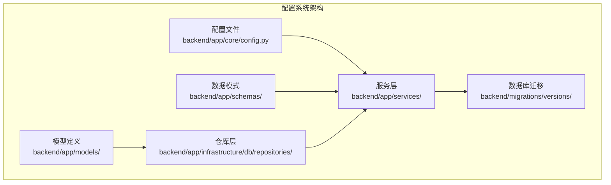
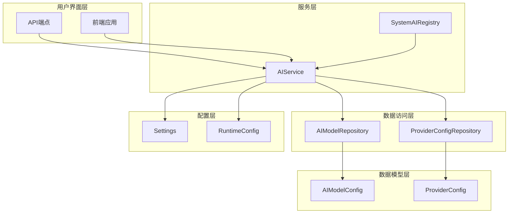
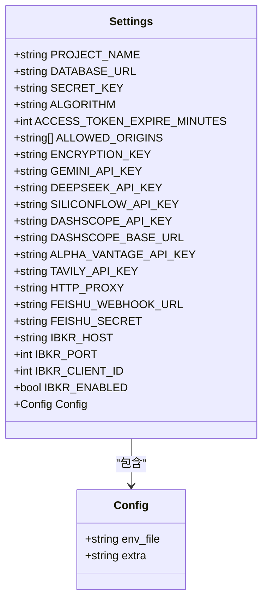
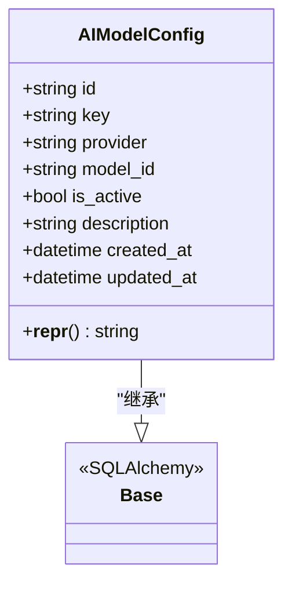
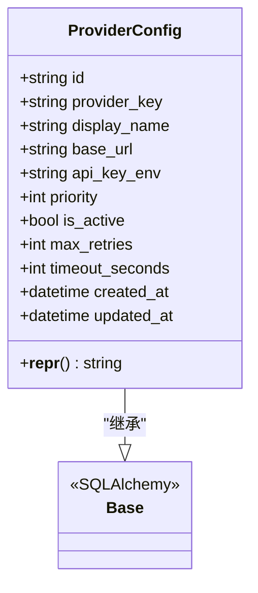
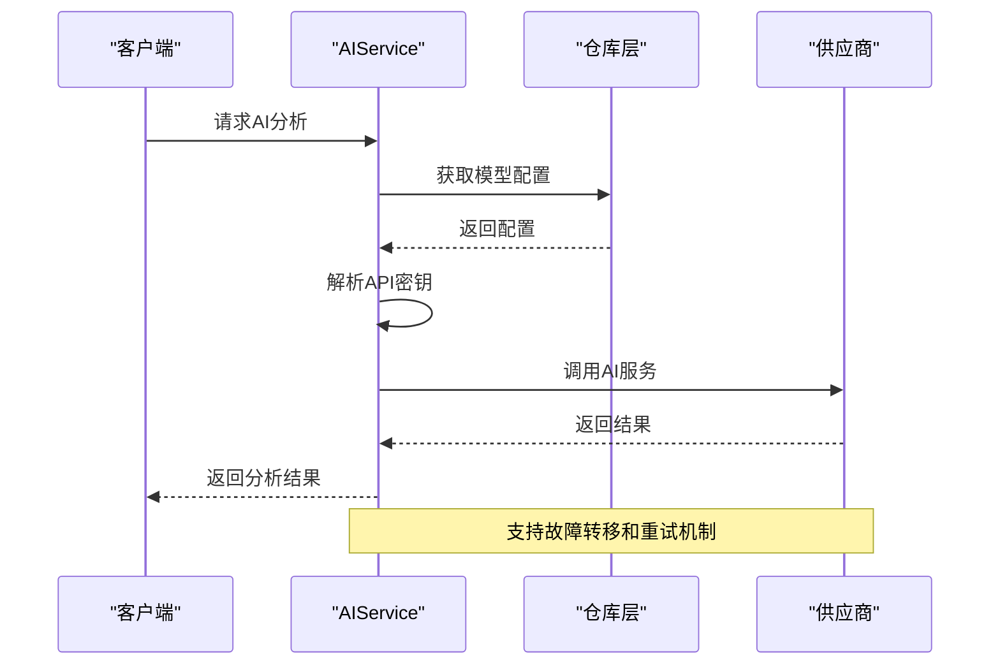
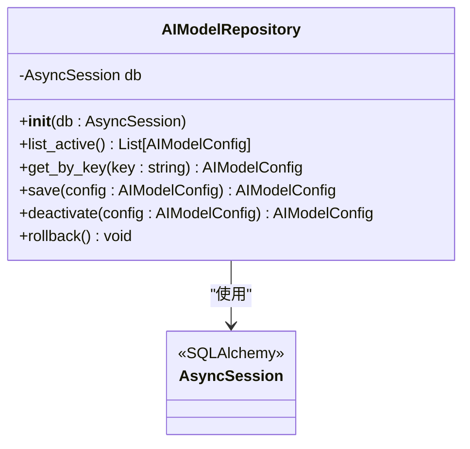
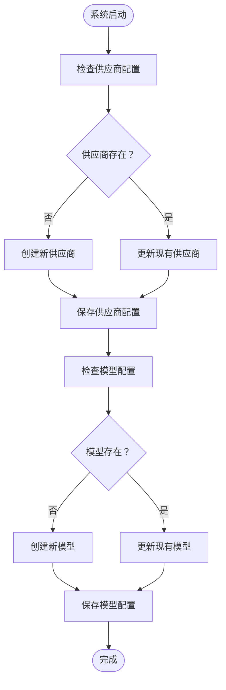
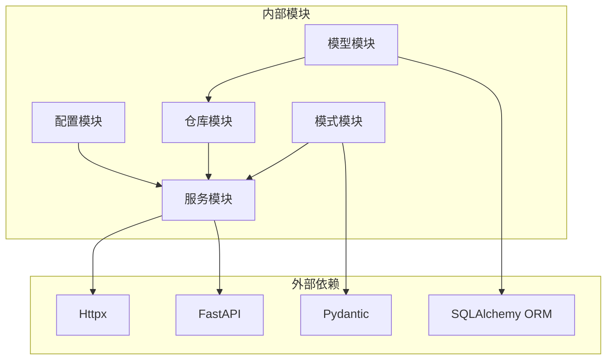

# AI模型运行时配置

<cite>
**本文档引用的文件**
- [backend/app/core/config.py](file://backend/app/core/config.py)
- [backend/app/models/ai_config.py](file://backend/app/models/ai_config.py)
- [backend/app/models/provider_config.py](file://backend/app/models/provider_config.py)
- [backend/app/schemas/ai_config.py](file://backend/app/schemas/ai_config.py)
- [backend/app/infrastructure/db/repositories/ai_model_repository.py](file://backend/app/infrastructure/db/repositories/ai_model_repository.py)
- [backend/app/infrastructure/db/repositories/provider_config_repository.py](file://backend/app/infrastructure/db/repositories/provider_config_repository.py)
- [backend/app/services/system_ai_registry.py](file://backend/app/services/system_ai_registry.py)
- [backend/app/services/ai_service.py](file://backend/app/services/ai_service.py)
- [backend/migrations/versions/0675c6d039e6_create_ai_model_config_table.py](file://backend/migrations/versions/0675c6d039e6_create_ai_model_config_table.py)
</cite>

## 目录
1. [简介](#简介)
2. [项目结构](#项目结构)
3. [核心组件](#核心组件)
4. [架构概览](#架构概览)
5. [详细组件分析](#详细组件分析)
6. [依赖关系分析](#依赖关系分析)
7. [性能考虑](#性能考虑)
8. [故障排除指南](#故障排除指南)
9. [结论](#结论)

## 简介

本文件详细介绍了AI股票顾问项目中的AI模型运行时配置系统。该系统提供了灵活的AI模型配置管理、供应商配置、故障转移机制以及用户自定义模型支持。系统采用分层架构设计，通过ORM模型、仓库模式、服务层和API端点实现了完整的AI模型配置生命周期管理。

## 项目结构

AI模型运行时配置系统主要分布在以下目录结构中：

**图表来源**
- [backend/app/core/config.py:1-38](file://backend/app/core/config.py#L1-L38)
- [backend/app/models/ai_config.py:1-21](file://backend/app/models/ai_config.py#L1-L21)
- [backend/app/services/ai_service.py:1-555](file://backend/app/services/ai_service.py#L1-L555)

**章节来源**
- [backend/app/core/config.py:1-38](file://backend/app/core/config.py#L1-L38)
- [backend/app/models/ai_config.py:1-21](file://backend/app/models/ai_config.py#L1-L21)
- [backend/app/schemas/ai_config.py:1-16](file://backend/app/schemas/ai_config.py#L1-L16)

## 核心组件

### 配置管理系统

系统采用Pydantic设置类管理所有配置参数，包括数据库连接、安全设置、API密钥和供应商配置。

### AI模型配置

AI模型配置系统通过SQLAlchemy ORM模型管理可运行的AI模型，支持多种供应商和模型类型。

### 供应商配置

供应商配置系统管理AI服务供应商的注册信息，支持动态URL切换和故障转移优先级排序。

### 运行时配置

运行时配置系统提供解耦的Pydantic模型，用于在不同层级间传递配置信息。

**章节来源**
- [backend/app/models/ai_config.py:6-21](file://backend/app/models/ai_config.py#L6-L21)
- [backend/app/models/provider_config.py:12-48](file://backend/app/models/provider_config.py#L12-L48)
- [backend/app/schemas/ai_config.py:4-16](file://backend/app/schemas/ai_config.py#L4-L16)

## 架构概览

AI模型运行时配置系统采用分层架构设计，实现了配置管理、数据持久化、业务逻辑和服务接口的分离。

**图表来源**
- [backend/app/services/ai_service.py:31-555](file://backend/app/services/ai_service.py#L31-L555)
- [backend/app/services/system_ai_registry.py:14-56](file://backend/app/services/system_ai_registry.py#L14-L56)
- [backend/app/infrastructure/db/repositories/ai_model_repository.py:7-38](file://backend/app/infrastructure/db/repositories/ai_model_repository.py#L7-L38)

## 详细组件分析

### Settings配置类

Settings类是整个系统的配置中心，管理所有运行时配置参数。

**图表来源**
- [backend/app/core/config.py:4-38](file://backend/app/core/config.py#L4-L38)

**章节来源**
- [backend/app/core/config.py:4-38](file://backend/app/core/config.py#L4-L38)

### AIModelConfig模型

AIModelConfig模型定义了AI模型的数据库结构和行为。

**图表来源**
- [backend/app/models/ai_config.py:6-21](file://backend/app/models/ai_config.py#L6-L21)

**章节来源**
- [backend/app/models/ai_config.py:6-21](file://backend/app/models/ai_config.py#L6-L21)

### ProviderConfig模型

ProviderConfig模型管理AI供应商的配置信息。

**图表来源**
- [backend/app/models/provider_config.py:12-48](file://backend/app/models/provider_config.py#L12-L48)

**章节来源**
- [backend/app/models/provider_config.py:12-48](file://backend/app/models/provider_config.py#L12-L48)

### AIService核心服务

AIService是AI模型运行时配置的核心服务，负责模型选择、供应商分发和故障转移。

**图表来源**
- [backend/app/services/ai_service.py:421-486](file://backend/app/services/ai_service.py#L421-L486)

**章节来源**
- [backend/app/services/ai_service.py:31-555](file://backend/app/services/ai_service.py#L31-L555)

### AIModelRepository仓库

AIModelRepository提供AI模型配置的数据库操作功能。

**图表来源**
- [backend/app/infrastructure/db/repositories/ai_model_repository.py:7-38](file://backend/app/infrastructure/db/repositories/ai_model_repository.py#L7-L38)

**章节来源**
- [backend/app/infrastructure/db/repositories/ai_model_repository.py:7-38](file://backend/app/infrastructure/db/repositories/ai_model_repository.py#L7-L38)

### SystemAIRegistry系统注册

SystemAIRegistry负责维护系统内置的AI模型配置。

**图表来源**
- [backend/app/services/system_ai_registry.py:14-56](file://backend/app/services/system_ai_registry.py#L14-L56)

**章节来源**
- [backend/app/services/system_ai_registry.py:14-56](file://backend/app/services/system_ai_registry.py#L14-L56)

## 依赖关系分析

AI模型运行时配置系统展现了清晰的依赖层次结构，各组件间保持低耦合高内聚的设计原则。

**图表来源**
- [backend/app/services/ai_service.py:1-555](file://backend/app/services/ai_service.py#L1-L555)
- [backend/app/core/config.py:1-38](file://backend/app/core/config.py#L1-L38)

**章节来源**
- [backend/app/services/ai_service.py:1-555](file://backend/app/services/ai_service.py#L1-L555)
- [backend/app/core/config.py:1-38](file://backend/app/core/config.py#L1-L38)

## 性能考虑

AI模型运行时配置系统在设计时充分考虑了性能优化：

### 缓存策略
- 模型配置缓存：5分钟TTL，减少数据库查询频率
- 供应商配置缓存：10分钟TTL，避免频繁读取配置
- 内存缓存：避免ORM对象在会话关闭后失效的问题

### 异步处理
- 全面使用async/await模式
- 并发控制：信号量限制同时请求数量
- 异常处理：优雅的错误恢复机制

### 资源管理
- 连接池管理：Httpx异步客户端自动管理连接
- 超时控制：最小300秒超时确保推理模型稳定
- 代理支持：HTTP_PROXY环境变量支持企业网络环境

## 故障排除指南

### 常见配置问题

**API密钥配置错误**
- 检查.env文件中的API密钥设置
- 验证用户凭据表中的加密密钥
- 确认供应商配置的base_url正确性

**模型配置问题**
- 验证AIModelConfig表中的记录完整性
- 检查模型键值是否正确映射
- 确认供应商与模型的兼容性

**供应商连接问题**
- 使用test_connection方法验证供应商可用性
- 检查网络代理设置
- 验证防火墙和端口访问权限

**章节来源**
- [backend/app/services/ai_service.py:351-397](file://backend/app/services/ai_service.py#L351-L397)
- [backend/app/services/ai_service.py:143-203](file://backend/app/services/ai_service.py#L143-L203)

### 调试技巧

1. **启用详细日志**：查看ai_calls.log获取完整的请求和响应信息
2. **检查缓存状态**：监控模型配置缓存的有效性
3. **验证数据库连接**：确认AIModelConfig和ProviderConfig表的访问权限
4. **测试供应商连通性**：使用test_connection方法快速定位问题

## 结论

AI模型运行时配置系统通过精心设计的分层架构和完善的配置管理机制，为AI股票顾问项目提供了灵活、可靠且高性能的AI模型配置解决方案。系统支持多供应商、多模型的动态配置，具备完善的故障转移和错误处理机制，能够满足复杂金融场景下的AI服务需求。

该系统的主要优势包括：
- **灵活性**：支持多种AI供应商和模型的动态配置
- **可靠性**：内置故障转移和重试机制
- **可扩展性**：模块化设计便于功能扩展
- **安全性**：API密钥加密存储和传输
- **可观测性**：完整的日志记录和性能监控

通过本文档的详细分析，开发者可以更好地理解和使用AI模型运行时配置系统，为构建更强大的AI驱动金融应用奠定坚实基础。