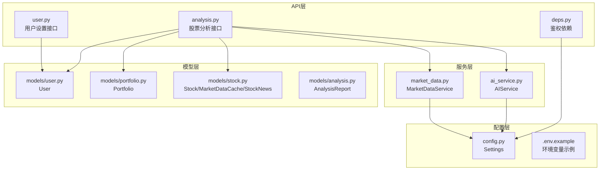
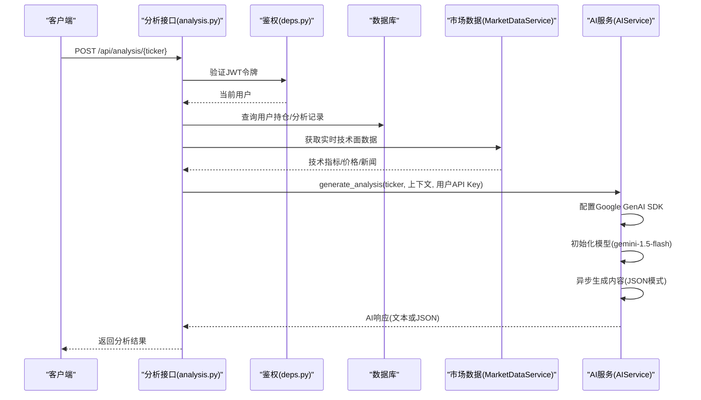
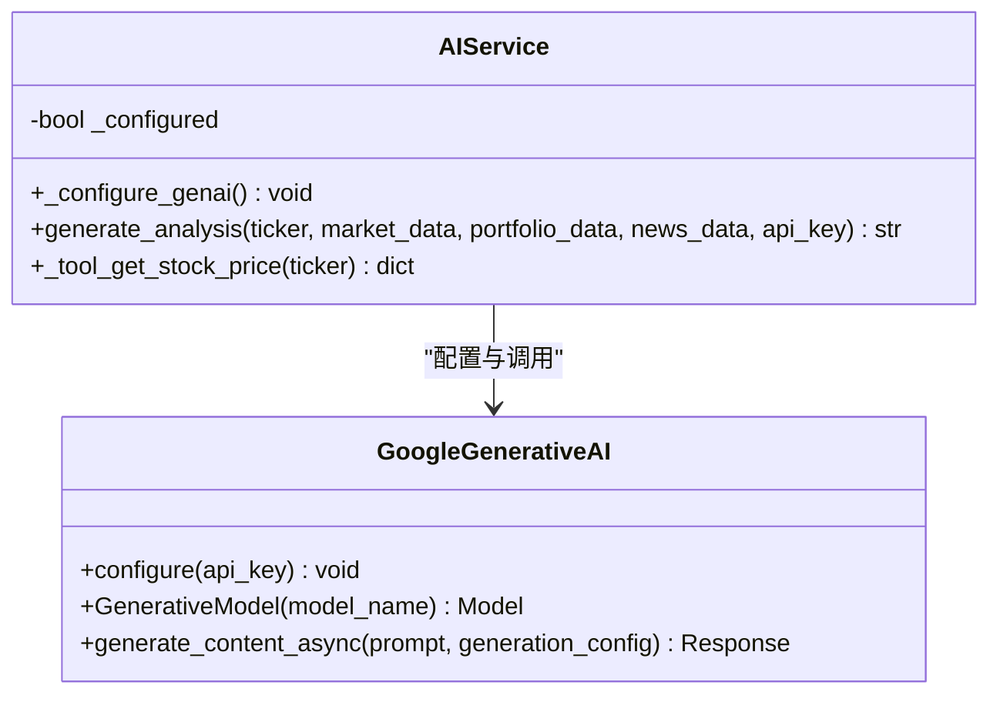
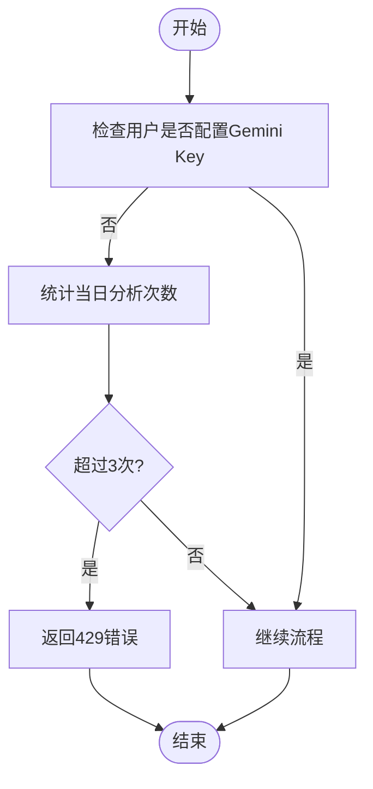
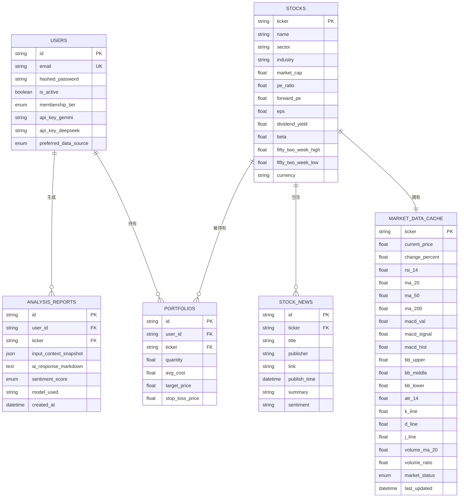
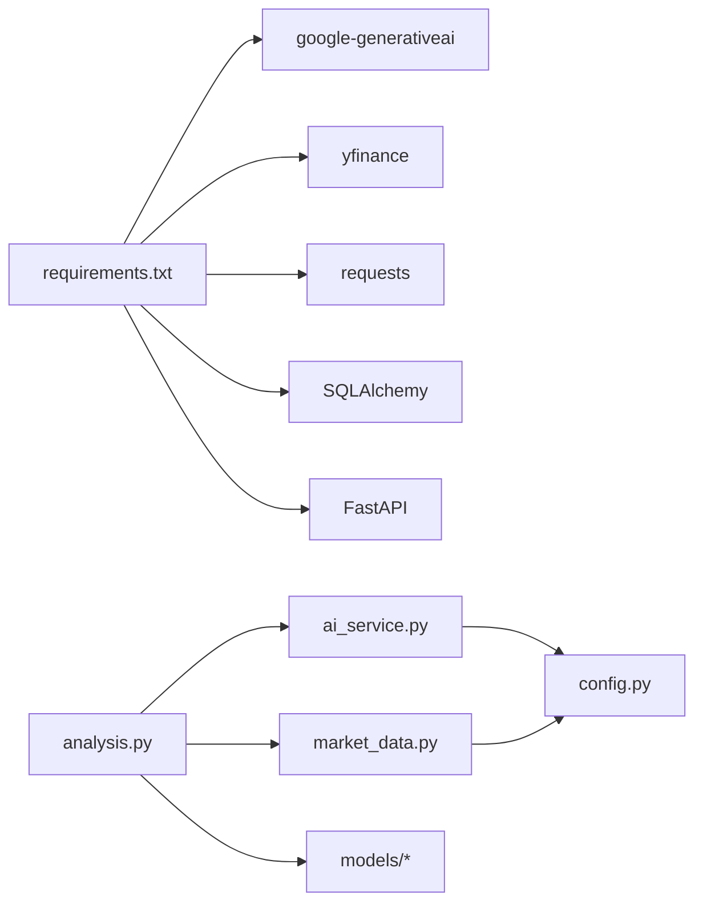

# Gemini AI集成

<cite>
**本文档引用的文件**
- [ai_service.py](file://backend/app/services/ai_service.py)
- [config.py](file://backend/app/core/config.py)
- [.env.example](file://.env.example)
- [analysis.py](file://backend/app/api/analysis.py)
- [deps.py](file://backend/app/api/deps.py)
- [market_data.py](file://backend/app/services/market_data.py)
- [requirements.txt](file://backend/requirements.txt)
- [user.py](file://backend/app/api/user.py)
- [user_settings.py](file://backend/app/schemas/user_settings.py)
- [analysis.py](file://backend/app/models/analysis.py)
- [user.py](file://backend/app/models/user.py)
- [portfolio.py](file://backend/app/models/portfolio.py)
- [stock.py](file://backend/app/models/stock.py)
</cite>

## 目录
1. [简介](#简介)
2. [项目结构](#项目结构)
3. [核心组件](#核心组件)
4. [架构总览](#架构总览)
5. [详细组件分析](#详细组件分析)
6. [依赖关系分析](#依赖关系分析)
7. [性能考虑](#性能考虑)
8. [故障排查指南](#故障排查指南)
9. [结论](#结论)
10. [附录](#附录)

## 简介
本文件面向Gemini AI集成的完整技术文档，聚焦于Google Generative AI SDK的配置与初始化流程、API密钥管理与认证机制、AIService类的设计模式与单例策略、AI模型选择与版本管理（gemini-1.5-flash）、异步调用与并发处理、错误处理与降级策略、配置最佳实践（环境变量与安全存储），以及调试技巧与性能优化建议。文档同时结合后端FastAPI接口与前端设置页面，提供端到端的实现视图。

## 项目结构
后端采用分层架构：
- API层：负责路由、鉴权、业务编排与限流控制
- 服务层：封装AI服务、市场数据服务等业务能力
- 模型层：数据库实体定义与关系映射
- 配置层：统一读取环境变量与应用配置

图表来源
- [analysis.py](file://backend/app/api/analysis.py#L1-L124)
- [user.py](file://backend/app/api/user.py#L1-L48)
- [deps.py](file://backend/app/api/deps.py#L1-L44)
- [ai_service.py](file://backend/app/services/ai_service.py#L1-L112)
- [market_data.py](file://backend/app/services/market_data.py#L1-L370)
- [config.py](file://backend/app/core/config.py#L1-L24)
- [.env.example](file://.env.example#L1-L9)

章节来源
- [analysis.py](file://backend/app/api/analysis.py#L1-L124)
- [user.py](file://backend/app/api/user.py#L1-L48)
- [deps.py](file://backend/app/api/deps.py#L1-L44)
- [ai_service.py](file://backend/app/services/ai_service.py#L1-L112)
- [market_data.py](file://backend/app/services/market_data.py#L1-L370)
- [config.py](file://backend/app/core/config.py#L1-L24)
- [.env.example](file://.env.example#L1-L9)

## 核心组件
- AIService：封装Google Generative AI SDK的配置、模型初始化与内容生成，支持异步调用与JSON响应模式，内置降级策略。
- MarketDataService：负责市场数据获取与缓存，支持Alpha Vantage与yfinance双源回退，具备指数平滑与超时控制。
- Analysis API：整合用户鉴权、市场数据、新闻与持仓上下文，调用AIService生成中文投资建议。
- 用户设置API：允许用户在个人设置中保存Gemini API Key，用于个性化额度与免配额限制。
- 配置系统：通过Pydantic Settings读取.env文件，集中管理外部API密钥与代理设置。

章节来源
- [ai_service.py](file://backend/app/services/ai_service.py#L1-L112)
- [market_data.py](file://backend/app/services/market_data.py#L1-L370)
- [analysis.py](file://backend/app/api/analysis.py#L1-L124)
- [user.py](file://backend/app/api/user.py#L1-L48)
- [config.py](file://backend/app/core/config.py#L1-L24)

## 架构总览
下图展示从API入口到AI服务与数据源的整体调用链路，包括鉴权、上下文准备、数据获取与AI生成的顺序流程。

图表来源
- [analysis.py](file://backend/app/api/analysis.py#L13-L124)
- [deps.py](file://backend/app/api/deps.py#L17-L44)
- [market_data.py](file://backend/app/services/market_data.py#L14-L170)
- [ai_service.py](file://backend/app/services/ai_service.py#L43-L112)

## 详细组件分析

### AIService类设计与单例策略
- 单例与延迟配置：类内部维护一个已配置标记，首次使用时才进行SDK配置；同时提供静态方法以支持直接传入API Key的即时调用。
- 模型初始化：显式使用完整模型路径以确保稳定性，避免版本漂移。
- 异步生成：使用异步接口生成内容，并支持JSON响应模式，便于后续解析。
- 降级策略：当JSON模式失败时自动回退到普通文本模式；若仍失败，返回可读的错误信息。
- 工具函数：内置工具函数用于获取股票实时价格与技术指标，便于与LLM交互。

图表来源
- [ai_service.py](file://backend/app/services/ai_service.py#L8-L112)

章节来源
- [ai_service.py](file://backend/app/services/ai_service.py#L1-L112)

### 配置与初始化流程（Google Generative AI SDK）
- 环境变量加载：通过Settings类从.env文件读取GEMINI_API_KEY等配置项。
- SDK配置：在AIService中按需调用SDK配置函数，确保仅在需要时进行配置。
- 模型选择：明确指定gemini-1.5-flash模型，保证一致性与稳定性。
- 代理支持：MarketDataService在获取外部数据时支持HTTP_PROXY环境变量，间接提升网络稳定性。

章节来源
- [config.py](file://backend/app/core/config.py#L1-L24)
- [ai_service.py](file://backend/app/services/ai_service.py#L11-L16)
- [market_data.py](file://backend/app/services/market_data.py#L189-L191)

### 认证与API密钥管理
- 鉴权：使用OAuth2密码流与JWT解码验证用户身份，依赖SECRET_KEY与算法常量。
- 用户设置：用户可在个人设置中保存自己的Gemini API Key，用于个性化额度与免配额限制。
- 免费用户配额：若用户未配置自定义Key，系统按日统计分析次数并限制为3次/天。

图表来源
- [analysis.py](file://backend/app/api/analysis.py#L27-L50)
- [user.py](file://backend/app/api/user.py#L22-L47)

章节来源
- [deps.py](file://backend/app/api/deps.py#L17-L44)
- [user.py](file://backend/app/api/user.py#L1-L48)
- [analysis.py](file://backend/app/api/analysis.py#L27-L50)

### AI模型选择与版本管理（gemini-1.5-flash）
- 模型名称：显式使用完整模型路径，避免版本漂移带来的行为变化。
- 中文提示工程：Prompt采用中文，包含技术面、消息面与用户持仓背景，要求返回JSON结构。
- JSON模式：通过generation_config指定响应类型为JSON，增强结构化输出的可靠性。
- 降级策略：若JSON模式失败，自动回退到普通文本模式，确保可用性。

章节来源
- [ai_service.py](file://backend/app/services/ai_service.py#L54-L112)

### 异步调用与并发处理
- 异步生成：AIService使用异步接口生成内容，降低阻塞风险。
- 并发回退：MarketDataService在获取外部数据时，针对不同数据源采用异步执行器与超时控制，避免阻塞事件循环。
- 事件循环：通过获取当前事件循环并在线程池中执行阻塞IO，平衡异步与同步调用。

章节来源
- [ai_service.py](file://backend/app/services/ai_service.py#L97-L111)
- [market_data.py](file://backend/app/services/market_data.py#L26-L47)

### 错误处理与降级策略
- Gemini错误：捕获异常并记录日志，优先尝试JSON模式，失败后再回退到普通文本模式。
- 外部数据源错误：MarketDataService对yfinance与Alpha Vantage分别处理429与超时，采用指数退避与重试。
- 缓存降级：若外部数据源均不可用，使用缓存数据进行微幅波动更新，或生成半真实模拟数据作为后备。
- 限流与配额：免费用户每日最多3次分析，超过则返回429错误。

章节来源
- [ai_service.py](file://backend/app/services/ai_service.py#L103-L112)
- [market_data.py](file://backend/app/services/market_data.py#L303-L318)
- [analysis.py](file://backend/app/api/analysis.py#L46-L50)

### 数据模型与上下文构建
- 用户模型：包含会员等级、Gemini/DeepSeek密钥字段与偏好数据源。
- 持仓模型：记录用户持有股票的成本、数量与未实现盈亏，用于个性化建议。
- 股票与技术指标：缓存当前价格、涨跌幅与多种技术指标，供AI分析使用。
- 分析报告：记录输入快照、AI响应、情感评分与模型标识，便于审计与复现。

图表来源
- [user.py](file://backend/app/models/user.py#L15-L31)
- [portfolio.py](file://backend/app/models/portfolio.py#L7-L26)
- [stock.py](file://backend/app/models/stock.py#L13-L85)
- [analysis.py](file://backend/app/models/analysis.py#L12-L25)

章节来源
- [user.py](file://backend/app/models/user.py#L1-L31)
- [portfolio.py](file://backend/app/models/portfolio.py#L1-L26)
- [stock.py](file://backend/app/models/stock.py#L1-L85)
- [analysis.py](file://backend/app/models/analysis.py#L1-L25)

## 依赖关系分析
- 外部依赖：Google Generative AI SDK、yfinance、Alpha Vantage、SQLAlchemy、FastAPI等。
- 内部依赖：API层依赖服务层与模型层；服务层依赖配置层；AI服务依赖市场数据服务与配置。

图表来源
- [requirements.txt](file://backend/requirements.txt#L20-L25)
- [analysis.py](file://backend/app/api/analysis.py#L1-L124)
- [ai_service.py](file://backend/app/services/ai_service.py#L1-L112)
- [market_data.py](file://backend/app/services/market_data.py#L1-L370)
- [config.py](file://backend/app/core/config.py#L1-L24)

章节来源
- [requirements.txt](file://backend/requirements.txt#L1-L75)
- [analysis.py](file://backend/app/api/analysis.py#L1-L124)
- [ai_service.py](file://backend/app/services/ai_service.py#L1-L112)
- [market_data.py](file://backend/app/services/market_data.py#L1-L370)
- [config.py](file://backend/app/core/config.py#L1-L24)

## 性能考虑
- 异步与线程池：在MarketDataService中使用线程池执行阻塞IO，避免阻塞事件循环，提高吞吐。
- 缓存策略：技术指标与价格数据缓存1分钟，减少重复计算与外部调用。
- 超时与重试：对外部API设置合理超时与指数退避，提升稳定性。
- 模型选择：固定使用gemini-1.5-flash，避免版本切换导致的性能波动。
- 日志与监控：在关键节点记录错误与耗时，便于定位瓶颈。

章节来源
- [market_data.py](file://backend/app/services/market_data.py#L26-L47)
- [market_data.py](file://backend/app/services/market_data.py#L173-L318)
- [ai_service.py](file://backend/app/services/ai_service.py#L54-L112)

## 故障排查指南
- Gemini API Key缺失：若未配置Key，AI服务将返回模拟结果或错误提示；请在用户设置中添加Key。
- 429限流：免费用户达到每日上限；建议配置自定义Key或等待次日。
- 外部数据源失败：检查Alpha Vantage与yfinance的可用性与配额；确认HTTP_PROXY配置正确。
- JSON模式失败：AI服务会自动回退到文本模式；若仍失败，请查看日志中的错误详情。
- 鉴权失败：确认JWT令牌有效且未过期，检查SECRET_KEY与算法配置。

章节来源
- [ai_service.py](file://backend/app/services/ai_service.py#L47-L48)
- [analysis.py](file://backend/app/api/analysis.py#L46-L50)
- [market_data.py](file://backend/app/services/market_data.py#L303-L318)
- [deps.py](file://backend/app/api/deps.py#L21-L33)

## 结论
本集成方案通过清晰的分层架构与严格的配置管理，实现了Gemini AI在投资分析场景下的稳定应用。AIService采用显式模型路径与异步生成，配合多级降级策略，确保在API限制与网络异常情况下仍能提供可用的分析结果。结合用户设置与限流机制，既满足免费用户的使用需求，又为付费用户提供更灵活的额度与更好的体验。

## 附录

### 配置最佳实践
- 环境变量管理：在.env文件中集中配置GEMINI_API_KEY、HTTP_PROXY等敏感信息，避免硬编码。
- 安全存储：生产环境中建议使用加密存储或平台提供的密钥管理服务，避免明文泄露。
- 版本锁定：在requirements.txt中锁定关键依赖版本，确保部署一致性。
- 代理与网络：合理配置HTTP_PROXY以提升外网访问稳定性，注意代理的可用性与安全性。

章节来源
- [.env.example](file://.env.example#L1-L9)
- [config.py](file://backend/app/core/config.py#L1-L24)
- [requirements.txt](file://backend/requirements.txt#L1-L75)

### 调试技巧
- 开启日志：在AIService中记录Gemini调用错误，便于快速定位问题。
- 限流与配额：通过分析报告表与用户设置接口，监控使用情况与配额状态。
- 数据源回退：优先使用yfinance，必要时回退到Alpha Vantage或缓存数据，逐步排除问题来源。
- 前端设置：通过设置页面验证Key是否成功保存与生效。

章节来源
- [ai_service.py](file://backend/app/services/ai_service.py#L103-L112)
- [user.py](file://backend/app/api/user.py#L22-L47)
- [analysis.py](file://backend/app/api/analysis.py#L1-L124)