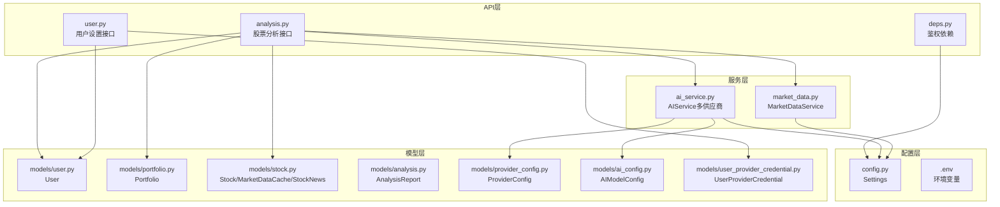
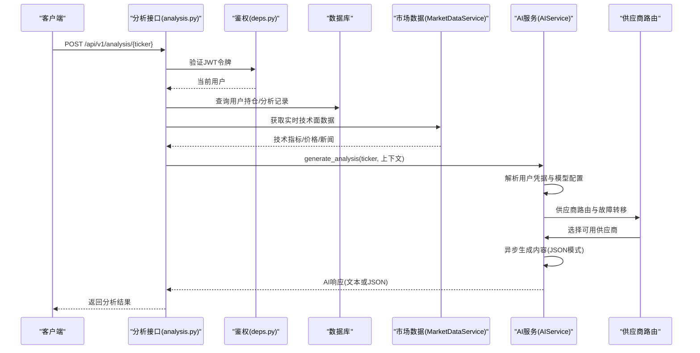
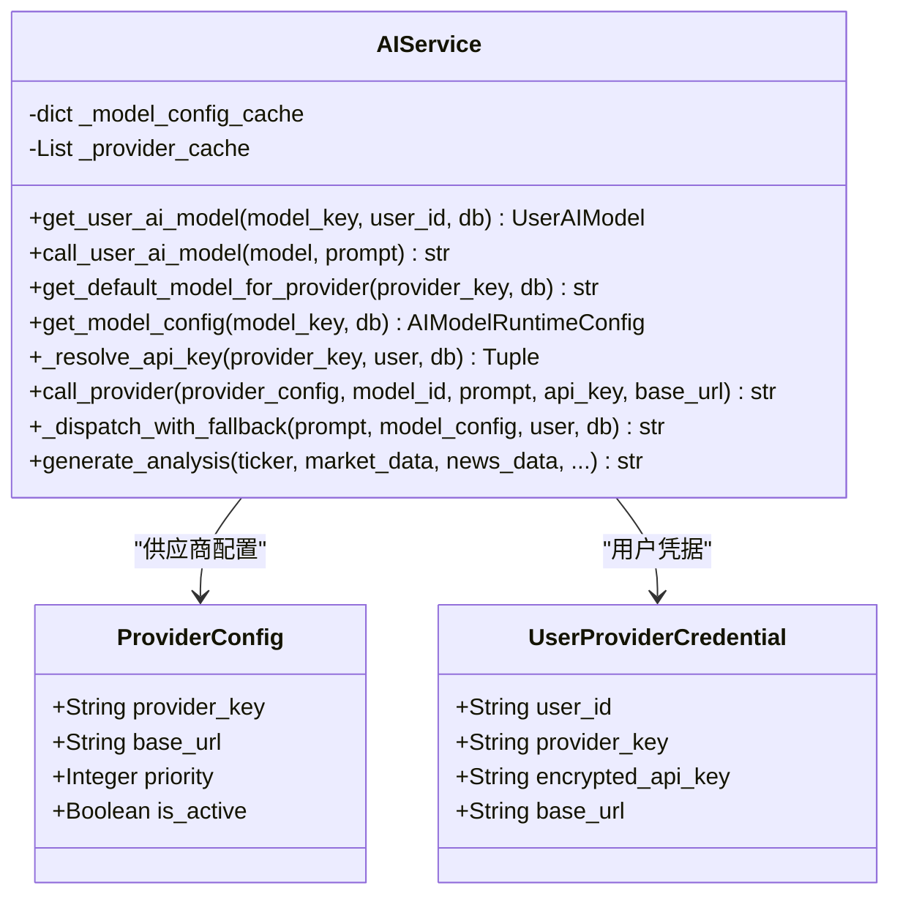
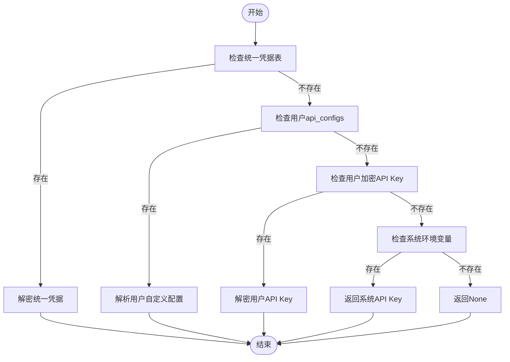
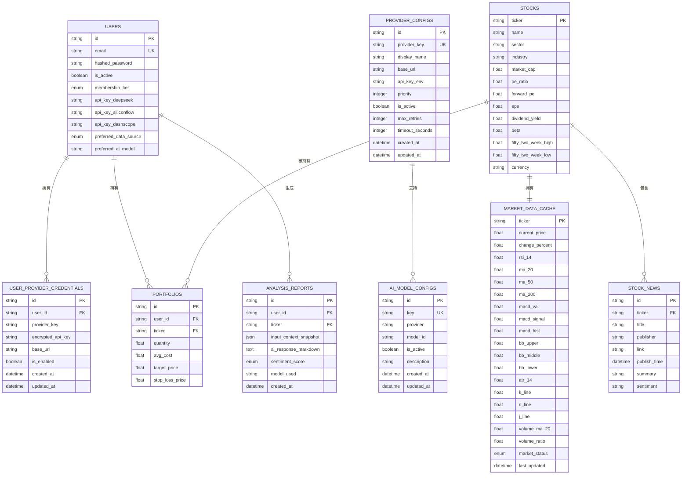
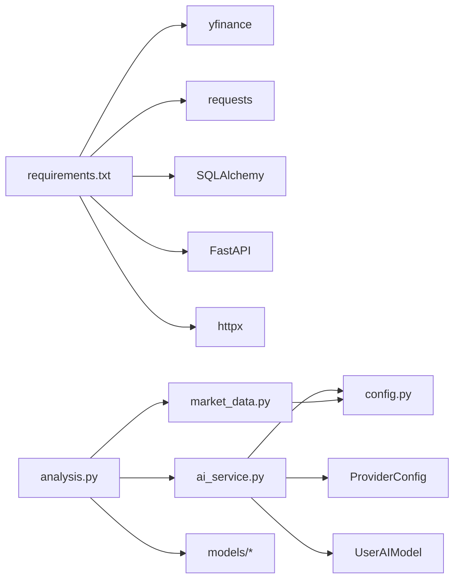

# Gemini AI集成

<cite>
**本文档引用的文件**
- [ai_service.py](file://backend/app/services/ai_service.py)
- [config.py](file://backend/app/core/config.py)
- [.env](file://.env)
- [analysis.py](file://backend/app/api/v1/endpoints/analysis.py)
- [deps.py](file://backend/app/api/deps.py)
- [market_data.py](file://backend/app/services/market_data.py)
- [requirements.txt](file://backend/requirements.txt)
- [user.py](file://backend/app/api/v1/endpoints/user.py)
- [user_settings.py](file://backend/app/schemas/user_settings.py)
- [analysis.py](file://backend/app/models/analysis.py)
- [user.py](file://backend/app/models/user.py)
- [portfolio.py](file://backend/app/models/portfolio.py)
- [stock.py](file://backend/app/models/stock.py)
- [provider_config.py](file://backend/app/models/provider_config.py)
- [user_provider_credential.py](file://backend/app/models/user_provider_credential.py)
- [ai_config.py](file://backend/app/models/ai_config.py)
- [provider_config_repository.py](file://backend/app/infrastructure/db/repositories/provider_config_repository.py)
- [0675c6d039e6_create_ai_model_config_table.py](file://backend/migrations/versions/0675c6d039e6_create_ai_model_config_table.py)
- [ab4e342e4749_create_provider_configs_v4.py](file://backend/migrations/versions/ab4e342e4749_create_provider_configs_v4.py)
- [api.ts](file://frontend/features/user/api.ts)
- [page.tsx](file://frontend/app/settings/page.tsx)
</cite>

## 更新摘要
**所做更改**
- 移除了所有Google Gemini相关的配置和依赖
- 更新了AI提供商架构，从单一Gemini集成转变为多供应商支持架构
- 新增了多AI提供商配置和动态路由机制
- 更新了用户设置界面以支持新的AI模型管理
- 移除了Gemini特定的API密钥管理和认证逻辑

## 目录
1. [简介](#简介)
2. [项目结构](#项目结构)
3. [核心组件](#核心组件)
4. [架构总览](#架构总览)
5. [详细组件分析](#详细组件分析)
6. [依赖关系分析](#依赖关系分析)
7. [性能考虑](#性能考虑)
8. [故障排查指南](#故障排查指南)
9. [结论](#结论)
10. [附录](#附录)

## 简介
本文件面向当前的AI提供商架构集成技术文档，聚焦于多供应商AI服务的配置与初始化流程、API密钥管理与认证机制、AIService类的设计模式与动态路由策略、AI模型选择与版本管理、异步调用与并发处理、错误处理与降级策略、配置最佳实践（环境变量与安全存储），以及调试技巧与性能优化建议。文档同时结合后端FastAPI接口与前端设置页面，提供端到端的实现视图。

**更新** 本版本反映了从单一Google Gemini集成向多供应商AI架构的重大转变，包括新的供应商配置系统、动态模型路由和统一的凭据管理机制。

## 项目结构
后端采用分层架构，现已演进为多供应商支持架构：
- API层：负责路由、鉴权、业务编排与限流控制
- 服务层：封装AI服务、市场数据服务等业务能力，支持多供应商路由
- 模型层：数据库实体定义与关系映射，支持供应商和模型配置
- 配置层：统一读取环境变量与应用配置

**图表来源**
- [analysis.py:1-124](file://backend/app/api/v1/endpoints/analysis.py#L1-L124)
- [user.py:1-48](file://backend/app/api/v1/endpoints/user.py#L1-L48)
- [deps.py:1-44](file://backend/app/api/deps.py#L1-L44)
- [ai_service.py:1-555](file://backend/app/services/ai_service.py#L1-L555)
- [market_data.py:1-370](file://backend/app/services/market_data.py#L1-L370)
- [config.py:1-38](file://backend/app/core/config.py#L1-L38)
- [provider_config.py:1-48](file://backend/app/models/provider_config.py#L1-L48)
- [ai_config.py:1-20](file://backend/app/models/ai_config.py#L1-L20)
- [user_provider_credential.py:1-23](file://backend/app/models/user_provider_credential.py#L1-L23)
- [.env:1-5](file://.env#L1-L5)

**章节来源**
- [analysis.py:1-124](file://backend/app/api/v1/endpoints/analysis.py#L1-L124)
- [user.py:1-48](file://backend/app/api/v1/endpoints/user.py#L1-L48)
- [deps.py:1-44](file://backend/app/api/deps.py#L1-L44)
- [ai_service.py:1-555](file://backend/app/services/ai_service.py#L1-L555)
- [market_data.py:1-370](file://backend/app/services/market_data.py#L1-L370)
- [config.py:1-38](file://backend/app/core/config.py#L1-L38)
- [provider_config.py:1-48](file://backend/app/models/provider_config.py#L1-L48)
- [ai_config.py:1-20](file://backend/app/models/ai_config.py#L1-L20)
- [user_provider_credential.py:1-23](file://backend/app/models/user_provider_credential.py#L1-L23)
- [.env:1-5](file://.env#L1-L5)

## 核心组件
- AIService：封装多供应商AI服务的配置、模型初始化与内容生成，支持异步调用与JSON响应模式，内置供应商路由与降级策略。
- MarketDataService：负责市场数据获取与缓存，支持Alpha Vantage与yfinance双源回退，具备指数平滑与超时控制。
- Analysis API：整合用户鉴权、市场数据、新闻与持仓上下文，调用AIService生成中文投资建议。
- 用户设置API：允许用户在个人设置中保存多个AI提供商的API Key，支持统一凭据管理和模型配置。
- 配置系统：通过Pydantic Settings读取.env文件，集中管理外部API密钥与代理设置，支持动态供应商配置。

**更新** 核心组件已从单一Gemini集成扩展为多供应商支持，包括供应商配置表、用户凭据表和动态路由机制。

**章节来源**
- [ai_service.py:1-555](file://backend/app/services/ai_service.py#L1-L555)
- [market_data.py:1-370](file://backend/app/services/market_data.py#L1-L370)
- [analysis.py:1-124](file://backend/app/api/v1/endpoints/analysis.py#L1-L124)
- [user.py:1-48](file://backend/app/api/v1/endpoints/user.py#L1-L48)
- [config.py:1-38](file://backend/app/core/config.py#L1-L38)

## 架构总览
下图展示从API入口到多供应商AI服务与数据源的整体调用链路，包括鉴权、上下文准备、供应商路由与AI生成的顺序流程。

**图表来源**
- [analysis.py:13-124](file://backend/app/api/v1/endpoints/analysis.py#L13-L124)
- [deps.py:17-44](file://backend/app/api/deps.py#L17-L44)
- [market_data.py:14-170](file://backend/app/services/market_data.py#L14-L170)
- [ai_service.py:488-524](file://backend/app/services/ai_service.py#L488-L524)

## 详细组件分析

### AIService类设计与多供应商路由策略
- 多供应商支持：类内部维护供应商缓存和模型配置缓存，支持动态供应商发现与故障转移。
- 动态路由：根据模型配置和用户设置，智能选择合适的AI供应商和模型。
- 统一凭据解析：支持用户级加密API Key、系统级环境变量和统一凭据表的多级优先级解析。
- 异步生成：使用异步接口生成内容，并支持JSON响应模式，便于后续解析。
- 降级策略：当JSON模式失败时自动回退到普通文本模式；若仍失败，返回可读的错误信息。

**图表来源**
- [ai_service.py:31-555](file://backend/app/services/ai_service.py#L31-L555)
- [provider_config.py:12-48](file://backend/app/models/provider_config.py#L12-L48)
- [user_provider_credential.py:9-23](file://backend/app/models/user_provider_credential.py#L9-L23)

**章节来源**
- [ai_service.py:1-555](file://backend/app/services/ai_service.py#L1-L555)

### 配置与初始化流程（多供应商架构）
- 环境变量加载：通过Settings类从.env文件读取DEEPSEEK_API_KEY、SILICONFLOW_API_KEY等配置项。
- 供应商配置：通过ProviderConfig表管理多个AI供应商的配置，支持动态URL切换和优先级排序。
- 模型配置：通过AIModelConfig表管理内置和用户自定义模型配置。
- 统一凭据管理：通过UserProviderCredential表支持用户级API Key加密存储和统一管理。

**更新** 配置系统已从单一Gemini配置扩展为多供应商架构，支持动态供应商发现和故障转移。

**章节来源**
- [config.py:1-38](file://backend/app/core/config.py#L1-L38)
- [provider_config.py:1-48](file://backend/app/models/provider_config.py#L1-L48)
- [ai_config.py:1-20](file://backend/app/models/ai_config.py#L1-L20)
- [user_provider_credential.py:1-23](file://backend/app/models/user_provider_credential.py#L1-L23)

### 认证与API密钥管理
- 鉴权：使用OAuth2密码流与JWT解码验证用户身份，依赖SECRET_KEY与算法常量。
- 多级凭据解析：支持用户级加密API Key、系统级环境变量和统一凭据表的优先级解析。
- 统一凭据管理：用户可在个人设置中保存多个AI提供商的API Key，支持启用/禁用和自定义Base URL。
- 加密存储：所有API Key通过加密算法安全存储，支持运行时解密使用。

**图表来源**
- [ai_service.py:143-202](file://backend/app/services/ai_service.py#L143-L202)
- [user.py:117-187](file://backend/app/api/v1/endpoints/user.py#L117-L187)

**章节来源**
- [deps.py:17-44](file://backend/app/api/deps.py#L17-L44)
- [user.py:117-187](file://backend/app/api/v1/endpoints/user.py#L117-L187)
- [ai_service.py:143-202](file://backend/app/services/ai_service.py#L143-L202)

### AI模型选择与版本管理
- 动态模型配置：通过AIModelConfig表管理内置和用户自定义模型，支持不同供应商的模型ID。
- 默认模型选择：根据不同供应商提供默认模型，支持用户自定义覆盖。
- 模型缓存：实现模型配置缓存机制，减少数据库查询开销。
- 兜底回退：当找不到特定模型时，提供合理的默认模型回退策略。

**更新** 模型管理已从单一Gemini模型扩展为多供应商多模型架构，支持动态配置和缓存优化。

**章节来源**
- [ai_service.py:83-141](file://backend/app/services/ai_service.py#L83-L141)
- [ai_config.py:1-20](file://backend/app/models/ai_config.py#L1-L20)

### 异步调用与并发处理
- 异步生成：AIService使用异步接口生成内容，降低阻塞风险。
- 并发回退：MarketDataService在获取外部数据时，针对不同数据源采用异步执行器与超时控制，避免阻塞事件循环。
- 供应商缓存：AIService缓存供应商配置和模型配置，减少重复查询和网络请求。
- 事件循环：通过获取当前事件循环并在线程池中执行阻塞IO，平衡异步与同步调用。

**更新** 并发处理已扩展到多供应商架构，包括供应商配置缓存和动态路由优化。

**章节来源**
- [ai_service.py:32-36](file://backend/app/services/ai_service.py#L32-L36)
- [ai_service.py:421-486](file://backend/app/services/ai_service.py#L421-L486)
- [market_data.py:26-47](file://backend/app/services/market_data.py#L26-L47)

### 错误处理与降级策略
- 供应商故障转移：当某个供应商不可用时，自动尝试下一个优先级的供应商。
- JSON模式降级：当供应商返回JSON格式错误时，自动回退到普通文本模式。
- 超时处理：为不同供应商设置合理的超时时间，避免长时间阻塞。
- 错误日志：详细的错误日志记录，包括HTTP状态码、响应时间和错误详情。

**更新** 错误处理机制已扩展为多供应商架构，包括供应商级别的故障转移和统一的错误处理策略。

**章节来源**
- [ai_service.py:284-324](file://backend/app/services/ai_service.py#L284-L324)
- [ai_service.py:421-486](file://backend/app/services/ai_service.py#L421-L486)
- [market_data.py:303-318](file://backend/app/services/market_data.py#L303-L318)

### 数据模型与上下文构建
- 用户模型：包含会员等级、多个AI提供商密钥字段与偏好数据源。
- 供应商配置模型：管理AI供应商的注册信息，支持动态URL切换和故障转移优先级排序。
- AI模型配置模型：管理内置和用户自定义AI模型的配置信息。
- 用户供应商凭据模型：支持用户级API Key加密存储和统一管理。
- 持仓模型：记录用户持有股票的成本、数量与未实现盈亏，用于个性化建议。
- 股票与技术指标：缓存当前价格、涨跌幅与多种技术指标，供AI分析使用。
- 分析报告：记录输入快照、AI响应、情感评分与模型标识，便于审计与复现。

**图表来源**
- [user.py:15-31](file://backend/app/models/user.py#L15-L31)
- [provider_config.py:12-48](file://backend/app/models/provider_config.py#L12-L48)
- [ai_config.py:6-20](file://backend/app/models/ai_config.py#L6-L20)
- [user_provider_credential.py:9-23](file://backend/app/models/user_provider_credential.py#L9-L23)
- [portfolio.py:7-26](file://backend/app/models/portfolio.py#L7-L26)
- [stock.py:13-85](file://backend/app/models/stock.py#L13-L85)
- [analysis.py:12-25](file://backend/app/models/analysis.py#L12-L25)

**章节来源**
- [user.py:1-31](file://backend/app/models/user.py#L1-L31)
- [provider_config.py:1-48](file://backend/app/models/provider_config.py#L1-L48)
- [ai_config.py:1-20](file://backend/app/models/ai_config.py#L1-L20)
- [user_provider_credential.py:1-23](file://backend/app/models/user_provider_credential.py#L1-L23)
- [portfolio.py:1-26](file://backend/app/models/portfolio.py#L1-L26)
- [stock.py:1-85](file://backend/app/models/stock.py#L1-L85)
- [analysis.py:1-25](file://backend/app/models/analysis.py#L1-L25)

## 依赖关系分析
- 外部依赖：yfinance、requests、SQLAlchemy、FastAPI、httpx等。
- 内部依赖：API层依赖服务层与模型层；服务层依赖配置层；AI服务依赖市场数据服务与配置。

**更新** 依赖关系已简化，移除了Google Generative AI SDK依赖，新增了多供应商架构所需的数据库模型和路由逻辑。

**图表来源**
- [requirements.txt:1-77](file://backend/requirements.txt#L1-L77)
- [analysis.py:1-124](file://backend/app/api/v1/endpoints/analysis.py#L1-L124)
- [ai_service.py:1-555](file://backend/app/services/ai_service.py#L1-L555)
- [market_data.py:1-370](file://backend/app/services/market_data.py#L1-L370)
- [config.py:1-38](file://backend/app/core/config.py#L1-L38)

**章节来源**
- [requirements.txt:1-77](file://backend/requirements.txt#L1-L77)
- [analysis.py:1-124](file://backend/app/api/v1/endpoints/analysis.py#L1-L124)
- [ai_service.py:1-555](file://backend/app/services/ai_service.py#L1-L555)
- [market_data.py:1-370](file://backend/app/services/market_data.py#L1-L370)
- [config.py:1-38](file://backend/app/core/config.py#L1-L38)

## 性能考虑
- 异步与线程池：在MarketDataService中使用线程池执行阻塞IO，避免阻塞事件循环，提高吞吐。
- 缓存策略：供应商配置和模型配置缓存10分钟，减少重复查询与网络请求。
- 超时与重试：对外部API设置合理超时与指数退避，提升稳定性。
- 动态路由：智能供应商选择和故障转移，避免单点故障。
- 日志与监控：在关键节点记录错误与耗时，便于定位瓶颈。

**更新** 性能优化已扩展到多供应商架构，包括供应商缓存、动态路由和统一凭据解析优化。

**章节来源**
- [market_data.py:26-47](file://backend/app/services/market_data.py#L26-L47)
- [market_data.py:173-318](file://backend/app/services/market_data.py#L173-L318)
- [ai_service.py:32-36](file://backend/app/services/ai_service.py#L32-L36)
- [ai_service.py:421-486](file://backend/app/services/ai_service.py#L421-L486)

## 故障排查指南
- 供应商配置错误：检查ProviderConfig表中的供应商配置是否正确，包括base_url和priority设置。
- API Key缺失：检查UserProviderCredential表中的用户凭据是否正确配置，或系统环境变量是否设置。
- 模型配置错误：检查AIModelConfig表中的模型配置是否正确，特别是provider和model_id字段。
- 连接测试失败：使用/test-connection接口测试AI连接，查看详细的错误信息。
- 供应商故障：检查供应商的is_active状态和max_retries配置，确认是否存在网络问题。
- 统一凭据管理：通过用户设置界面管理多个AI提供商的API Key，支持启用/禁用和自定义Base URL。

**更新** 故障排查指南已扩展为多供应商架构，包括供应商配置、凭据管理和连接测试的详细步骤。

**章节来源**
- [ai_service.py:351-397](file://backend/app/services/ai_service.py#L351-L397)
- [user.py:189-247](file://backend/app/api/v1/endpoints/user.py#L189-L247)
- [provider_config.py:12-48](file://backend/app/models/provider_config.py#L12-L48)
- [user_provider_credential.py:9-23](file://backend/app/models/user_provider_credential.py#L9-L23)

## 结论
本集成方案通过清晰的多供应商分层架构与严格的配置管理，实现了现代AI服务在投资分析场景下的稳定应用。AIService采用动态供应商路由与异步生成，配合多级降级策略，确保在供应商故障与网络异常情况下仍能提供可用的分析结果。结合统一凭据管理和动态模型配置，既满足多供应商支持的需求，又为用户提供了灵活的AI服务配置选项。

**更新** 本版本反映了从单一Gemini集成向多供应商AI架构的重大升级，提供了更好的可扩展性和可靠性。

## 附录

### 配置最佳实践
- 环境变量管理：在.env文件中集中配置DEEPSEEK_API_KEY、SILICONFLOW_API_KEY等敏感信息，避免硬编码。
- 安全存储：生产环境中建议使用加密存储或平台提供的密钥管理服务，避免明文泄露。
- 供应商配置：通过ProviderConfig表管理多个AI供应商的配置，支持动态URL切换和优先级排序。
- 统一凭据管理：通过UserProviderCredential表支持用户级API Key加密存储和统一管理。
- 版本锁定：在requirements.txt中锁定关键依赖版本，确保部署一致性。
- 代理与网络：合理配置HTTP_PROXY以提升外网访问稳定性，注意代理的可用性与安全性。

**更新** 配置最佳实践已扩展为多供应商架构，包括供应商配置和统一凭据管理的最佳实践。

**章节来源**
- [.env:1-5](file://.env#L1-L5)
- [config.py:1-38](file://backend/app/core/config.py#L1-L38)
- [provider_config.py:12-48](file://backend/app/models/provider_config.py#L12-L48)
- [user_provider_credential.py:9-23](file://backend/app/models/user_provider_credential.py#L9-L23)
- [requirements.txt:1-77](file://backend/requirements.txt#L1-L77)

### 调试技巧
- 开启日志：在AIService中记录AI调用错误，便于快速定位问题，包括供应商选择和模型配置。
- 连接测试：通过/test-connection接口测试AI连接，查看详细的错误信息和响应时间。
- 供应商监控：通过ProviderConfig表监控各供应商的状态和性能指标。
- 模型测试：通过AI模型管理界面测试不同供应商和模型的连接性。
- 前端调试：通过设置页面验证多个AI提供商的Key是否成功保存与生效。
- 错误追踪：查看详细的错误日志，包括HTTP状态码、响应时间和错误详情。

**更新** 调试技巧已扩展为多供应商架构，包括供应商监控和统一凭据管理的调试方法。

**章节来源**
- [ai_service.py:214-324](file://backend/app/services/ai_service.py#L214-L324)
- [user.py:189-247](file://backend/app/api/v1/endpoints/user.py#L189-L247)
- [provider_config.py:12-48](file://backend/app/models/provider_config.py#L12-L48)
- [api.ts:49-60](file://frontend/features/user/api.ts#L49-L60)
- [page.tsx:73-827](file://frontend/app/settings/page.tsx#L73-L827)