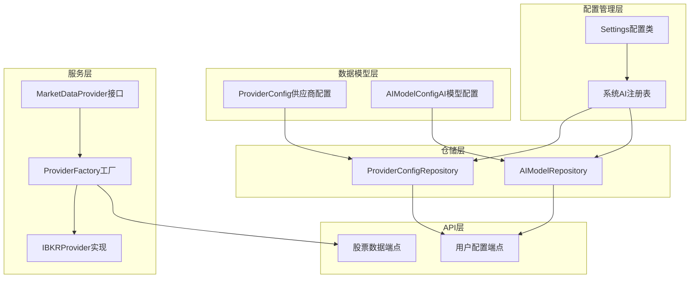
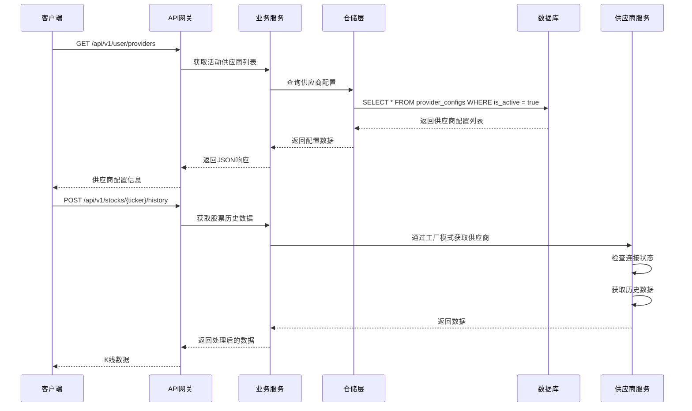
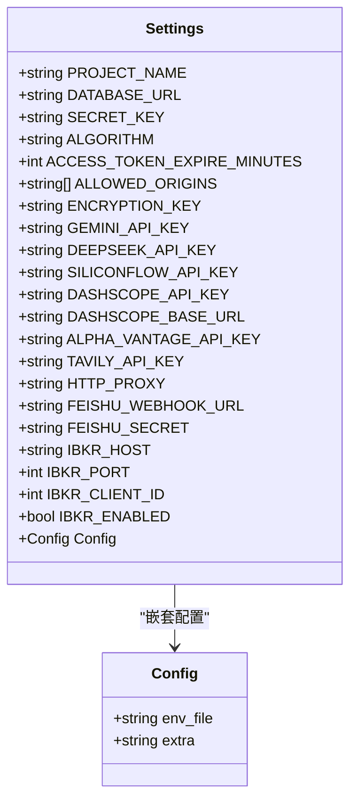
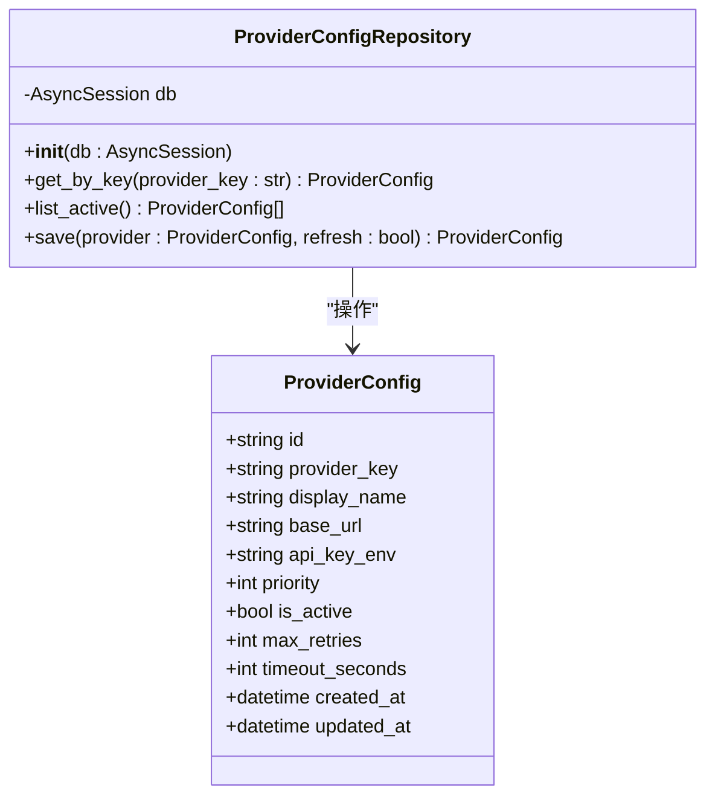
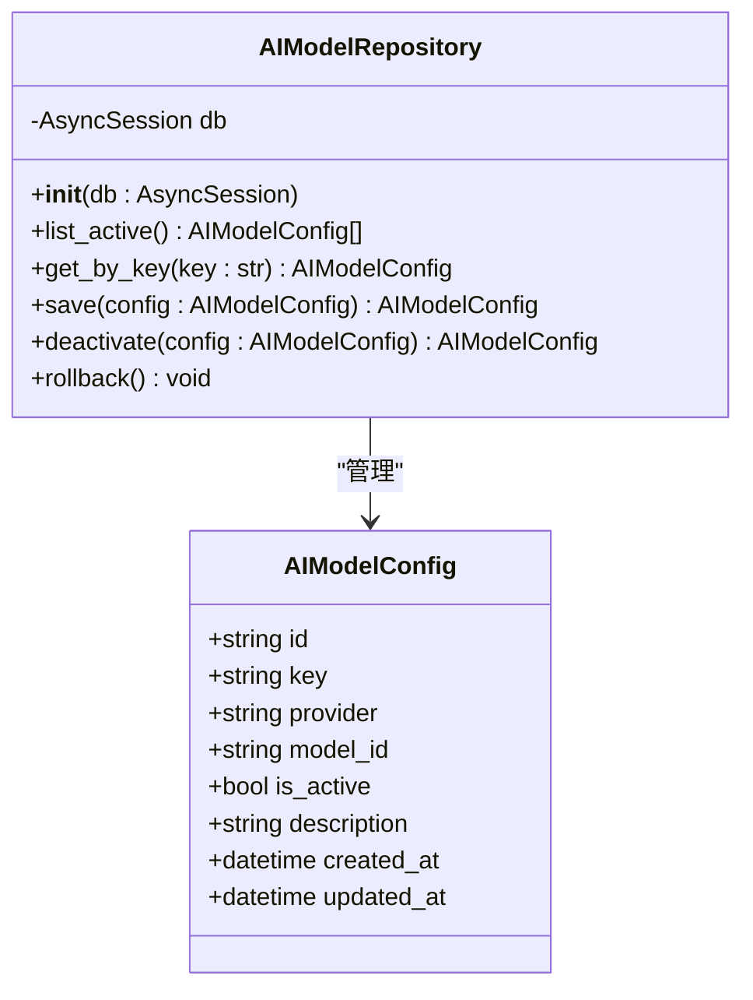
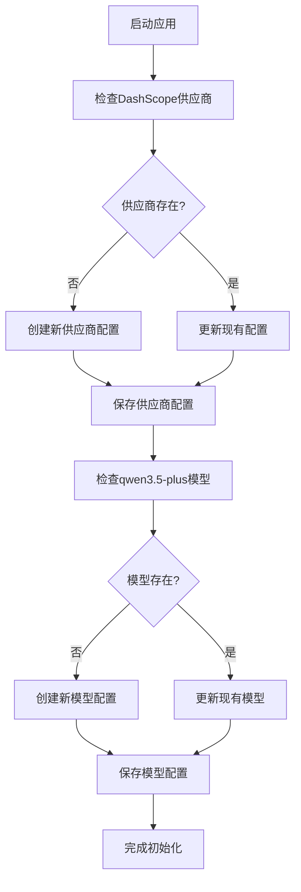
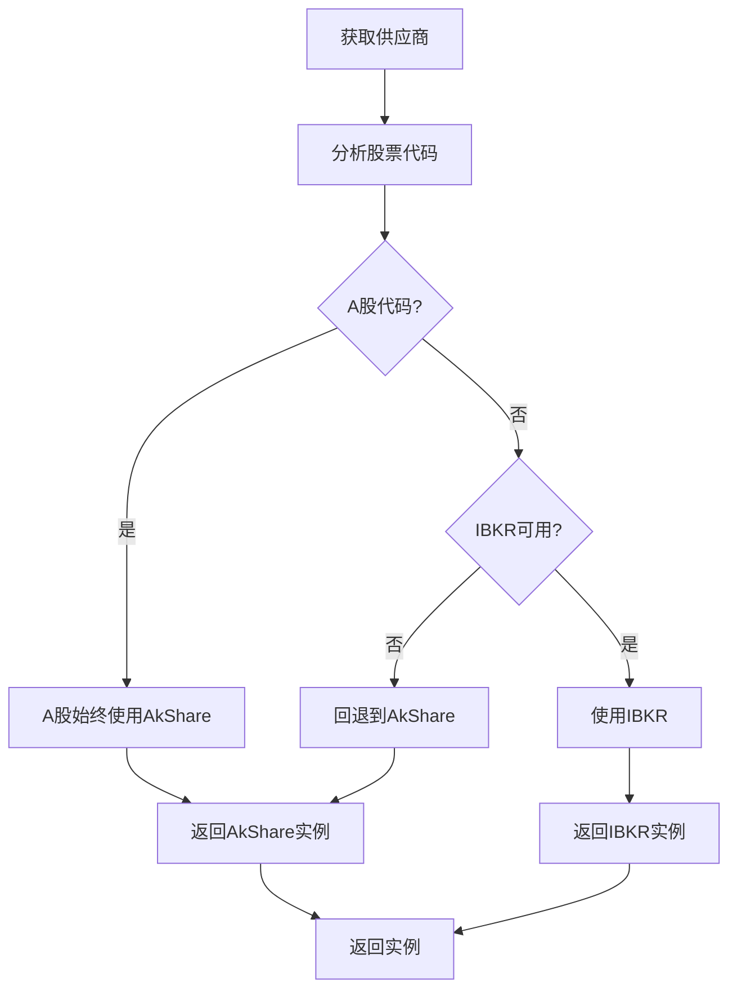
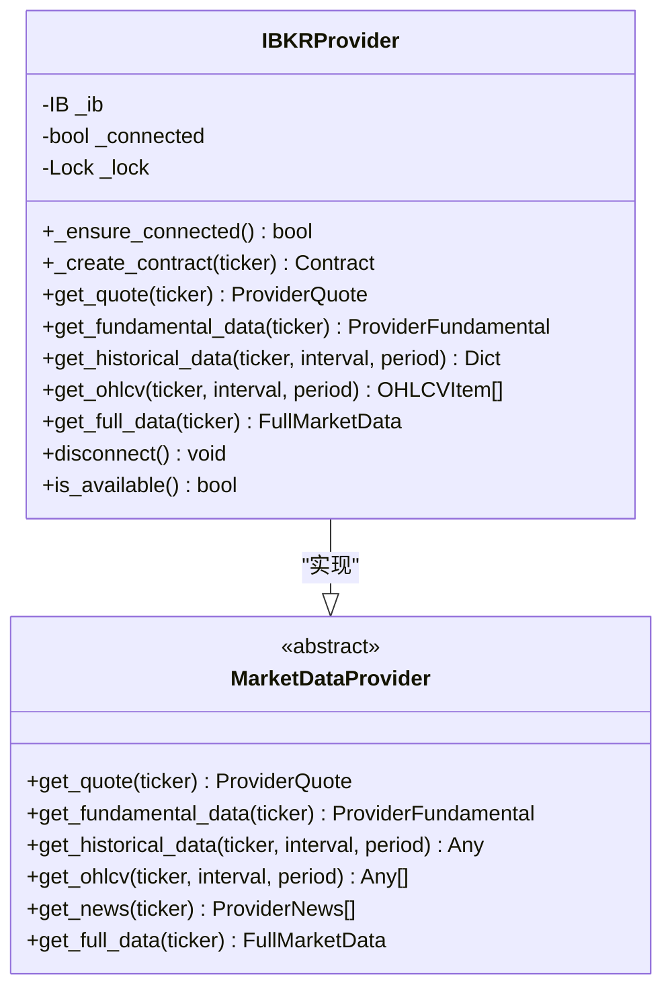
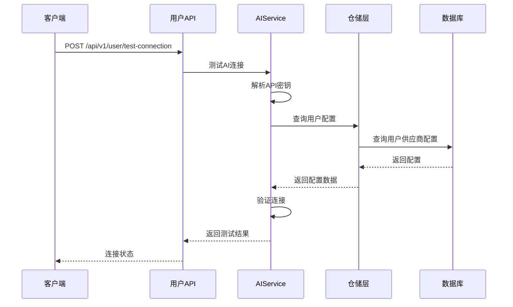
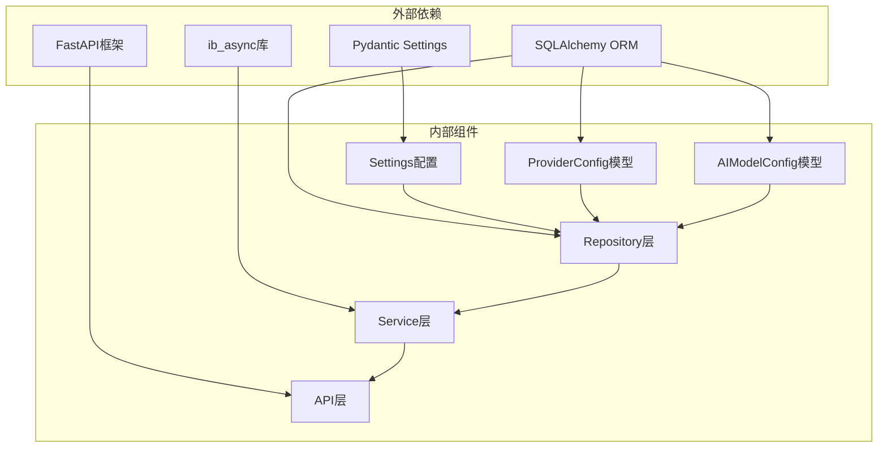

# 供应商运行时配置

<cite>
**本文档引用的文件**
- [backend/app/core/config.py](file://backend/app/core/config.py)
- [backend/app/models/provider_config.py](file://backend/app/models/provider_config.py)
- [backend/app/infrastructure/db/repositories/provider_config_repository.py](file://backend/app/infrastructure/db/repositories/provider_config_repository.py)
- [backend/app/models/ai_config.py](file://backend/app/models/ai_config.py)
- [backend/app/infrastructure/db/repositories/ai_model_repository.py](file://backend/app/infrastructure/db/repositories/ai_model_repository.py)
- [backend/app/services/system_ai_registry.py](file://backend/app/services/system_ai_registry.py)
- [backend/app/services/market_providers/factory.py](file://backend/app/services/market_providers/factory.py)
- [backend/app/services/market_providers/base.py](file://backend/app/services/market_providers/base.py)
- [backend/app/services/market_providers/ibkr.py](file://backend/app/services/market_providers/ibkr.py)
- [backend/app/api/v1/endpoints/user.py](file://backend/app/api/v1/endpoints/user.py)
- [backend/app/api/v1/endpoints/stock.py](file://backend/app/api/v1/endpoints/stock.py)
- [backend/app/main.py](file://backend/app/main.py)
</cite>

## 目录
1. [简介](#简介)
2. [项目结构](#项目结构)
3. [核心组件](#核心组件)
4. [架构概览](#架构概览)
5. [详细组件分析](#详细组件分析)
6. [依赖关系分析](#依赖关系分析)
7. [性能考虑](#性能考虑)
8. [故障排除指南](#故障排除指南)
9. [结论](#结论)

## 简介

本项目是一个AI智能投资顾问系统，采用多供应商架构设计，支持多种AI模型和数据提供商的动态配置。供应商运行时配置是整个系统的核心基础设施，负责管理AI供应商配置、数据提供商配置以及用户级别的API密钥管理。

系统通过配置驱动的方式实现了高度灵活的供应商管理机制，支持：
- 动态AI供应商配置（支持DashScope、SiliconFlow、Gemini等）
- 多数据提供商故障转移机制
- 用户级API密钥加密存储
- 运行时配置热更新
- 统一的供应商注册表管理

## 项目结构

项目采用分层架构设计，供应商配置相关的核心文件分布如下：

**图表来源**
- [backend/app/core/config.py:1-38](file://backend/app/core/config.py#L1-L38)
- [backend/app/models/provider_config.py:1-48](file://backend/app/models/provider_config.py#L1-L48)
- [backend/app/models/ai_config.py:1-21](file://backend/app/models/ai_config.py#L1-L21)

**章节来源**
- [backend/app/core/config.py:1-38](file://backend/app/core/config.py#L1-L38)
- [backend/app/models/provider_config.py:1-48](file://backend/app/models/provider_config.py#L1-L48)
- [backend/app/models/ai_config.py:1-21](file://backend/app/models/ai_config.py#L1-L21)

## 核心组件

### 配置管理系统

系统使用Pydantic的BaseSettings类来管理运行时配置，支持环境变量注入和类型安全的配置访问。

**主要配置项：**
- **安全配置**：SECRET_KEY、ALGORITHM、ACCESS_TOKEN_EXPIRE_MINUTES
- **API密钥配置**：GEMINI_API_KEY、DEEPSEEK_API_KEY、SILICONFLOW_API_KEY等
- **IBKR连接配置**：IBKR_HOST、IBKR_PORT、IBKR_CLIENT_ID、IBKR_ENABLED
- **网络配置**：HTTP_PROXY、FEISHU_WEBHOOK_URL、FEISHU_SECRET

### 供应商配置模型

供应商配置采用关系型数据库设计，支持动态URL切换和故障转移优先级排序。

**核心字段：**
- `provider_key`：供应商唯一标识符
- `display_name`：显示名称
- `base_url`：API基础URL
- `api_key_env`：对应的环境变量名
- `priority`：故障转移优先级
- `is_active`：是否启用
- `max_retries`：最大重试次数
- `timeout_seconds`：请求超时时间

### AI模型配置

AI模型配置支持用户自定义和系统内置两种模式，提供灵活的模型管理机制。

**配置特性：**
- 支持用户自定义AI模型
- 系统内置公共模型管理
- 加密API密钥存储
- 模型激活状态控制

**章节来源**
- [backend/app/core/config.py:1-38](file://backend/app/core/config.py#L1-L38)
- [backend/app/models/provider_config.py:12-48](file://backend/app/models/provider_config.py#L12-L48)
- [backend/app/models/ai_config.py:6-21](file://backend/app/models/ai_config.py#L6-L21)

## 架构概览

系统采用分层架构设计，供应商配置贯穿整个应用栈：

**图表来源**
- [backend/app/api/v1/endpoints/user.py:382-399](file://backend/app/api/v1/endpoints/user.py#L382-L399)
- [backend/app/api/v1/endpoints/stock.py:124-154](file://backend/app/api/v1/endpoints/stock.py#L124-L154)
- [backend/app/services/market_providers/factory.py:18-37](file://backend/app/services/market_providers/factory.py#L18-L37)

系统架构的关键特点：

1. **配置驱动**：所有供应商配置通过Settings类集中管理
2. **工厂模式**：MarketDataProvider接口通过ProviderFactory实现动态供应商选择
3. **仓储模式**：Repository层提供数据访问抽象
4. **分层设计**：清晰的业务逻辑分离

## 详细组件分析

### 设置管理器（Settings）

Settings类是整个系统的配置中心，使用Pydantic的BaseSettings实现类型安全的配置管理。

**图表来源**
- [backend/app/core/config.py:4-35](file://backend/app/core/config.py#L4-L35)

**章节来源**
- [backend/app/core/config.py:4-38](file://backend/app/core/config.py#L4-L38)

### 供应商配置仓库

ProviderConfigRepository提供供应商配置的CRUD操作，支持按键查询和活动供应商列表获取。

**图表来源**
- [backend/app/infrastructure/db/repositories/provider_config_repository.py:7-32](file://backend/app/infrastructure/db/repositories/provider_config_repository.py#L7-L32)
- [backend/app/models/provider_config.py:12-48](file://backend/app/models/provider_config.py#L12-L48)

**章节来源**
- [backend/app/infrastructure/db/repositories/provider_config_repository.py:7-32](file://backend/app/infrastructure/db/repositories/provider_config_repository.py#L7-L32)

### AI模型仓库

AIModelRepository管理AI模型配置，支持用户自定义模型和系统内置模型的统一管理。

**图表来源**
- [backend/app/infrastructure/db/repositories/ai_model_repository.py:7-38](file://backend/app/infrastructure/db/repositories/ai_model_repository.py#L7-L38)
- [backend/app/models/ai_config.py:6-21](file://backend/app/models/ai_config.py#L6-L21)

**章节来源**
- [backend/app/infrastructure/db/repositories/ai_model_repository.py:7-38](file://backend/app/infrastructure/db/repositories/ai_model_repository.py#L7-L38)

### 系统AI注册表

ensure_system_ai_registry函数负责确保系统内置AI供应商和模型的正确配置。

**图表来源**
- [backend/app/services/system_ai_registry.py:14-56](file://backend/app/services/system_ai_registry.py#L14-L56)

**章节来源**
- [backend/app/services/system_ai_registry.py:14-56](file://backend/app/services/system_ai_registry.py#L14-L56)

### 供应商工厂模式

ProviderFactory实现供应商的动态选择和单例管理，支持A股和美股的不同处理逻辑。

**图表来源**
- [backend/app/services/market_providers/factory.py:18-64](file://backend/app/services/market_providers/factory.py#L18-L64)

**章节来源**
- [backend/app/services/market_providers/factory.py:18-64](file://backend/app/services/market_providers/factory.py#L18-L64)

### IBKR供应商实现

IBKRProvider实现Interactive Brokers的数据获取功能，提供完整的异步连接管理和错误处理。

**图表来源**
- [backend/app/services/market_providers/ibkr.py:34-571](file://backend/app/services/market_providers/ibkr.py#L34-L571)
- [backend/app/services/market_providers/base.py:9-51](file://backend/app/services/market_providers/base.py#L9-L51)

**章节来源**
- [backend/app/services/market_providers/ibkr.py:34-571](file://backend/app/services/market_providers/ibkr.py#L34-L571)

### 用户配置API

用户配置端点提供供应商配置的CRUD操作，支持API密钥的加密存储和测试连接功能。

**图表来源**
- [backend/app/api/v1/endpoints/user.py:189-247](file://backend/app/api/v1/endpoints/user.py#L189-L247)

**章节来源**
- [backend/app/api/v1/endpoints/user.py:189-247](file://backend/app/api/v1/endpoints/user.py#L189-L247)

## 依赖关系分析

系统采用松耦合的设计，各组件之间的依赖关系清晰明确：

**图表来源**
- [backend/app/core/config.py:1-3](file://backend/app/core/config.py#L1-L3)
- [backend/app/models/provider_config.py:6-9](file://backend/app/models/provider_config.py#L6-L9)
- [backend/app/models/ai_config.py:1-4](file://backend/app/models/ai_config.py#L1-L4)

**章节来源**
- [backend/app/core/config.py:1-38](file://backend/app/core/config.py#L1-L38)
- [backend/app/models/provider_config.py:1-48](file://backend/app/models/provider_config.py#L1-L48)
- [backend/app/models/ai_config.py:1-21](file://backend/app/models/ai_config.py#L1-L21)

## 性能考虑

供应商运行时配置系统在设计时充分考虑了性能优化：

### 连接池管理
- IBKRProvider使用异步锁防止并发连接
- 单例模式避免重复创建实例
- 连接超时控制（5秒）防止阻塞

### 缓存策略
- ProviderFactory使用类变量缓存实例
- 数据获取采用批量处理和并行计算
- 技术指标计算复用现有引擎

### 错误处理
- 超时异常捕获和降级处理
- 连接失败的快速失败机制
- 容错返回空数组而非抛出异常

## 故障排除指南

### 常见问题诊断

**IBKR连接问题：**
1. 检查IBKR_ENABLED配置是否为True
2. 验证TWS/IB Gateway是否正常运行
3. 确认端口配置正确（7497为Paper Trading）
4. 检查防火墙设置

**API密钥问题：**
1. 确认.env文件中正确的API密钥
2. 验证加密密钥配置
3. 检查用户级别API密钥存储

**供应商配置问题：**
1. 验证provider_key唯一性
2. 检查base_url格式正确性
3. 确认priority排序逻辑

**章节来源**
- [backend/app/services/market_providers/ibkr.py:60-109](file://backend/app/services/market_providers/ibkr.py#L60-L109)
- [backend/app/api/v1/endpoints/user.py:189-247](file://backend/app/api/v1/endpoints/user.py#L189-L247)

## 结论

供应商运行时配置系统通过精心设计的架构实现了高度灵活和可靠的供应商管理机制。系统的主要优势包括：

1. **配置驱动**：通过Settings类实现统一的配置管理
2. **动态选择**：工厂模式支持供应商的动态选择和切换
3. **故障转移**：多供应商架构提供可靠的故障转移机制
4. **安全存储**：API密钥的加密存储保护敏感信息
5. **性能优化**：连接池管理和缓存策略提升系统性能

该系统为AI股票顾问平台提供了坚实的基础设施，支持未来扩展新的供应商和服务，满足不同用户的需求。