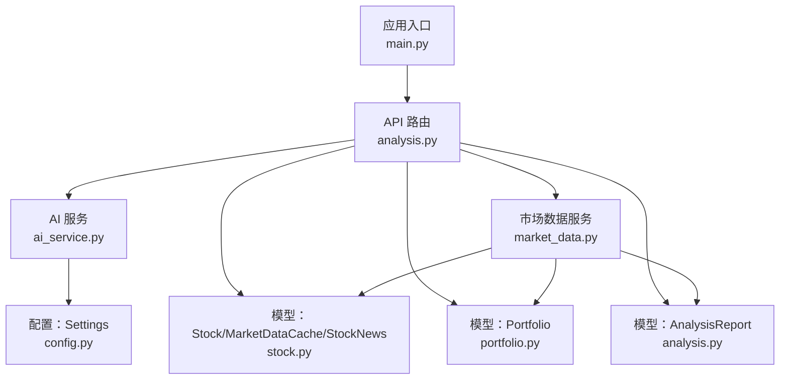
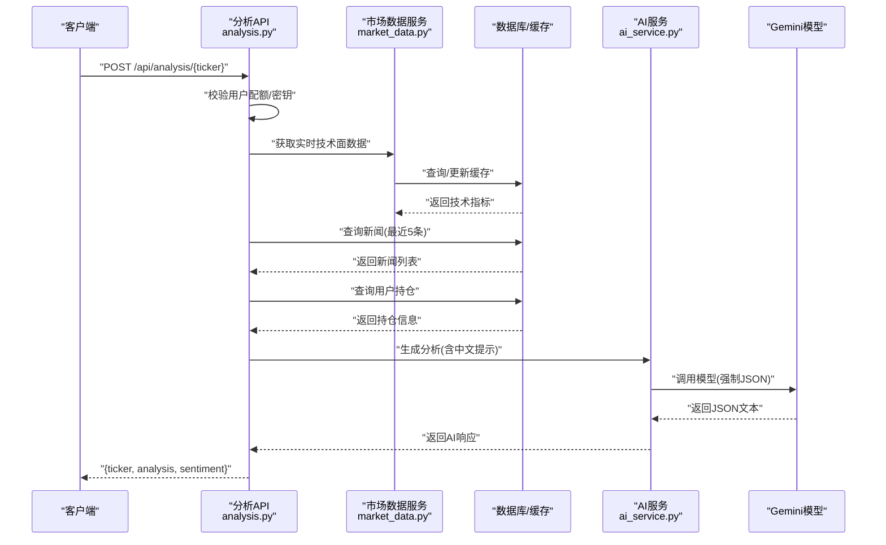
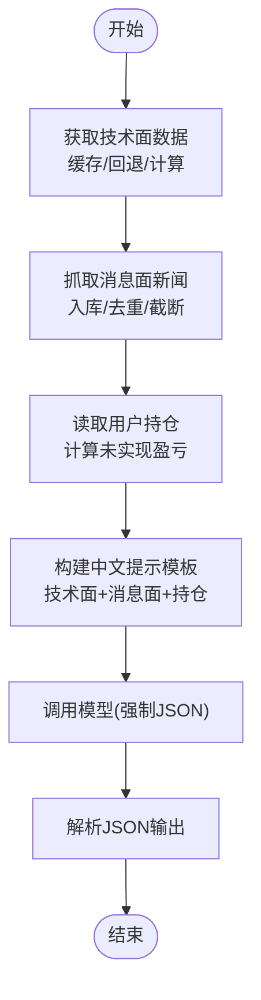
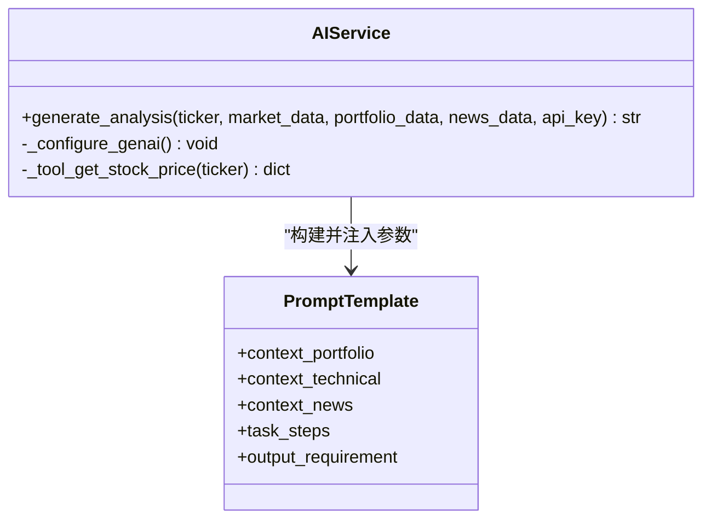
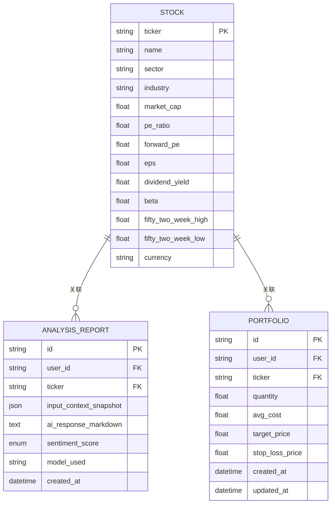
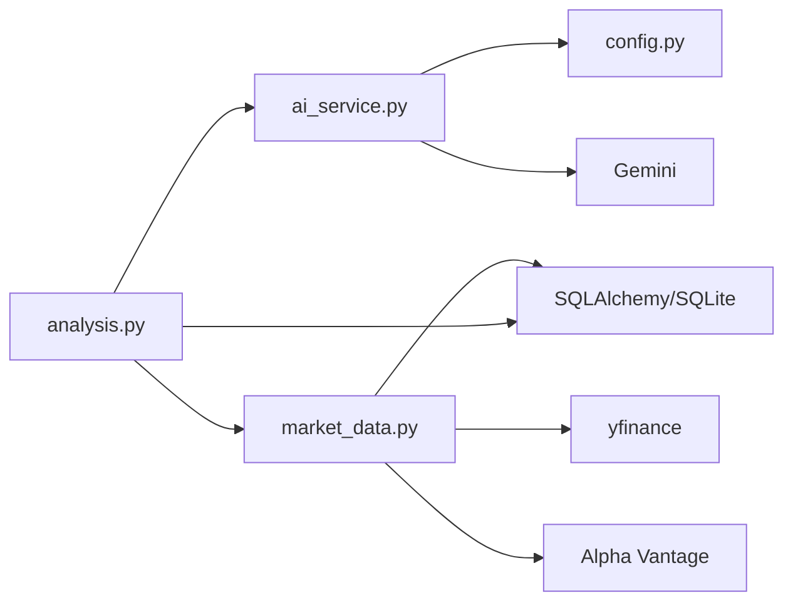

# 分析算法与提示工程

<cite>
**本文引用的文件**
- [backend/app/api/analysis.py](file://backend/app/api/analysis.py)
- [backend/app/services/ai_service.py](file://backend/app/services/ai_service.py)
- [backend/app/services/market_data.py](file://backend/app/services/market_data.py)
- [backend/app/models/stock.py](file://backend/app/models/stock.py)
- [backend/app/models/portfolio.py](file://backend/app/models/portfolio.py)
- [backend/app/models/analysis.py](file://backend/app/models/analysis.py)
- [backend/app/schemas/user_settings.py](file://backend/app/schemas/user_settings.py)
- [backend/app/core/config.py](file://backend/app/core/config.py)
- [backend/app/main.py](file://backend/app/main.py)
- [backend/migrations/versions/48d7355e90d6_add_more_technical_indicators.py](file://backend/migrations/versions/48d7355e90d6_add_more_technical_indicators.py)
- [backend/migrations/versions/90eb8cc09d0d_add_stock_news_table.py](file://backend/migrations/versions/90eb8cc09d0d_add_stock_news_table.py)
- [README.md](file://README.md)
</cite>

## 目录
1. [引言](#引言)
2. [项目结构](#项目结构)
3. [核心组件](#核心组件)
4. [架构总览](#架构总览)
5. [详细组件分析](#详细组件分析)
6. [依赖分析](#依赖分析)
7. [性能考虑](#性能考虑)
8. [故障排查指南](#故障排查指南)
9. [结论](#结论)
10. [附录](#附录)

## 引言
本文件围绕“分析算法与提示工程”的主题，系统性梳理后端AI分析服务的算法设计、提示工程实践、多模态数据融合策略、JSON输出规范、以及可扩展的批量分析与质量控制方案。目标读者既包括开发者也包括产品经理与运营人员，力求以循序渐进的方式呈现从数据采集、特征工程、提示设计到输出治理的完整链路。

## 项目结构
后端采用FastAPI框架，按职责划分为API路由、服务层、模型与数据库迁移、配置与入口模块。与分析算法直接相关的关键模块包括：
- API层：对外暴露分析接口，负责权限校验、上下文拼装与结果封装
- 服务层：AI服务负责提示工程与模型调用；市场数据服务负责技术面与消息面数据的采集与缓存
- 模型层：定义技术指标、新闻、持仓、分析报告等数据结构
- 配置层：统一管理外部API密钥与代理设置

图表来源
- [backend/app/api/analysis.py](file://backend/app/api/analysis.py#L1-L124)
- [backend/app/services/ai_service.py](file://backend/app/services/ai_service.py#L1-L112)
- [backend/app/services/market_data.py](file://backend/app/services/market_data.py#L1-L370)
- [backend/app/models/stock.py](file://backend/app/models/stock.py#L1-L85)
- [backend/app/models/portfolio.py](file://backend/app/models/portfolio.py#L1-L26)
- [backend/app/models/analysis.py](file://backend/app/models/analysis.py#L1-L25)
- [backend/app/core/config.py](file://backend/app/core/config.py#L1-L24)
- [backend/app/main.py](file://backend/app/main.py#L1-L38)

章节来源
- [backend/app/main.py](file://backend/app/main.py#L1-L38)
- [README.md](file://README.md#L1-L50)

## 核心组件
- 分析API：完成用户权限与配额校验、拉取市场数据、抓取新闻、读取用户持仓、调用AI服务并返回结果
- 市场数据服务：优先从首选数据源获取实时行情与技术指标，支持回退与缓存；同时维护新闻入库
- AI服务：构建中文提示模板，调用Gemini模型，强制JSON输出，失败时回退为普通文本
- 数据模型：定义技术指标字段、新闻表、持仓表、分析报告表，支撑算法与提示工程的数据输入
- 配额与配置：通过用户设置与环境变量控制API密钥与代理，实现SaaS配额与跨域访问

章节来源
- [backend/app/api/analysis.py](file://backend/app/api/analysis.py#L13-L123)
- [backend/app/services/market_data.py](file://backend/app/services/market_data.py#L13-L170)
- [backend/app/services/ai_service.py](file://backend/app/services/ai_service.py#L42-L111)
- [backend/app/models/stock.py](file://backend/app/models/stock.py#L33-L85)
- [backend/app/models/portfolio.py](file://backend/app/models/portfolio.py#L7-L26)
- [backend/app/models/analysis.py](file://backend/app/models/analysis.py#L12-L25)
- [backend/app/schemas/user_settings.py](file://backend/app/schemas/user_settings.py#L4-L16)
- [backend/app/core/config.py](file://backend/app/core/config.py#L14-L17)

## 架构总览
下图展示一次“单股票分析”的端到端流程：权限校验 → 技术面与消息面数据获取 → 持仓上下文拼装 → 提示工程与模型调用 → 结果返回。

图表来源
- [backend/app/api/analysis.py](file://backend/app/api/analysis.py#L13-L123)
- [backend/app/services/market_data.py](file://backend/app/services/market_data.py#L13-L170)
- [backend/app/services/ai_service.py](file://backend/app/services/ai_service.py#L42-L111)

## 详细组件分析

### 算法设计与数据融合
- 技术面数据融合
  - 服务端计算并缓存常用技术指标：移动平均线、MACD、布林带、RSI、ATR、KDJ、成交量均值与量比等
  - 通过缓存减少重复计算与外部调用开销，提升响应速度
- 消息面分析
  - 从第三方数据源抓取新闻，入库去重，供分析时作为上下文输入
  - 仅取最近若干条，避免上下文过长导致模型注意力分散
- 持仓个性化上下文
  - 若用户持有该股票，结合成本价、数量、未实现盈亏等，使建议更具针对性
- 权重分配与融合策略
  - 当前实现未显式配置权重；建议在提示工程中通过“任务步骤”与“要求”引导模型对技术面与消息面进行综合判断，必要时可在提示中增加“优先级”或“权重比例”说明，以约束模型输出

图表来源
- [backend/app/services/market_data.py](file://backend/app/services/market_data.py#L13-L170)
- [backend/app/api/analysis.py](file://backend/app/api/analysis.py#L52-L117)
- [backend/app/models/stock.py](file://backend/app/models/stock.py#L33-L85)
- [backend/app/models/portfolio.py](file://backend/app/models/portfolio.py#L7-L26)

章节来源
- [backend/app/services/market_data.py](file://backend/app/services/market_data.py#L13-L170)
- [backend/app/models/stock.py](file://backend/app/models/stock.py#L33-L85)
- [backend/app/models/portfolio.py](file://backend/app/models/portfolio.py#L7-L26)
- [backend/app/api/analysis.py](file://backend/app/api/analysis.py#L52-L117)

### 提示工程设计原则
- 中文提示模板
  - 全程使用中文，便于模型稳定输出中文内容
  - 采用清晰的标题层级与结构化段落，降低歧义
- 参数化设计
  - 将“股票代码、技术指标、新闻列表、持仓信息”作为占位参数注入提示
  - 通过固定的任务步骤与要求，约束模型输出结构
- 输出约束
  - 强制JSON模式，要求模型严格遵循预设字段结构，避免Markdown代码块包裹
  - 失败时回退为普通文本，保证可用性

图表来源
- [backend/app/services/ai_service.py](file://backend/app/services/ai_service.py#L42-L111)

章节来源
- [backend/app/services/ai_service.py](file://backend/app/services/ai_service.py#L42-L111)

### 多模态数据输入处理
- 技术指标
  - 价格、涨跌幅、RSI、MA系列、MACD、布林带、ATR、KDJ、成交量相关指标
  - 通过缓存与回退机制保障稳定性与一致性
- 市场数据
  - 支持首选数据源与备用数据源切换，超时与限流具备指数回退与容错
- 新闻信息
  - 从第三方数据源抓取并入库，按时间倒序取最近若干条，避免重复
- 持仓上下文
  - 计算未实现盈亏与盈亏百分比，作为个性化建议依据

章节来源
- [backend/app/services/market_data.py](file://backend/app/services/market_data.py#L13-L170)
- [backend/app/models/stock.py](file://backend/app/models/stock.py#L33-L85)
- [backend/app/models/portfolio.py](file://backend/app/models/portfolio.py#L7-L26)

### JSON输出格式规范与数据结构设计
- 输出结构
  - 字段：技术面分析、消息面解读、操作建议
  - 返回类型：字符串（JSON文本），不含Markdown代码块
- 存储结构
  - 分析报告模型包含输入快照、AI响应Markdown、情感评分、模型标识与创建时间
  - 为未来扩展情感评分与模型版本追踪提供基础

图表来源
- [backend/app/models/analysis.py](file://backend/app/models/analysis.py#L12-L25)
- [backend/app/models/stock.py](file://backend/app/models/stock.py#L13-L31)
- [backend/app/models/portfolio.py](file://backend/app/models/portfolio.py#L7-L26)

章节来源
- [backend/app/models/analysis.py](file://backend/app/models/analysis.py#L12-L25)
- [backend/app/models/stock.py](file://backend/app/models/stock.py#L13-L31)
- [backend/app/models/portfolio.py](file://backend/app/models/portfolio.py#L7-L26)

### 批量分析的实现策略与性能优化
- 批量扫描策略
  - 可基于“早报”场景，对关注池中的多只股票进行批量分析
  - 建议引入队列与并发控制，避免触发外部数据源限流
- 性能优化
  - 缓存命中优先：1分钟内复用缓存，减少外部调用
  - 限流与回退：针对第三方API的429与超时采用指数回退
  - 输出约束：强制JSON模式，减少后处理开销
  - 前端分页与懒加载：避免一次性渲染过多卡片

章节来源
- [backend/app/services/market_data.py](file://backend/app/services/market_data.py#L13-L170)
- [backend/app/api/analysis.py](file://backend/app/api/analysis.py#L27-L50)

### 提示模板版本管理与迭代策略
- 版本化建议
  - 在提示模板中加入版本号与变更摘要，便于追踪与回滚
  - 通过配置项或环境变量切换不同版本的提示模板
- 迭代策略
  - A/B测试：对同一任务的不同提示版本进行对比实验
  - 质量指标：准确率、一致性、可解释性、用户满意度
  - 回归与灰度：小范围灰度发布，逐步扩大流量

章节来源
- [backend/app/services/ai_service.py](file://backend/app/services/ai_service.py#L57-L94)

### 算法效果评估与质量控制
- 质量控制
  - 输出合规：强制JSON模式，失败回退为普通文本
  - 日志记录：捕获模型异常并记录错误日志
  - 情感评分：预留枚举类型，未来可从AI响应中解析情感倾向
- 效果评估
  - 建议建立人工标注的基准集，评估建议的准确性与一致性
  - 对比不同数据源与模型版本的效果差异，持续优化

章节来源
- [backend/app/services/ai_service.py](file://backend/app/services/ai_service.py#L103-L111)
- [backend/app/models/analysis.py](file://backend/app/models/analysis.py#L7-L11)

## 依赖分析
- 组件耦合
  - API层依赖服务层与模型层；服务层依赖配置与外部API；模型层依赖数据库
- 外部依赖
  - Gemini模型、yfinance、Alpha Vantage、SQLite缓存
- 潜在风险
  - 外部API限流与网络抖动；缓存一致性；提示模板变更带来的输出不一致

图表来源
- [backend/app/api/analysis.py](file://backend/app/api/analysis.py#L1-L124)
- [backend/app/services/ai_service.py](file://backend/app/services/ai_service.py#L1-L112)
- [backend/app/services/market_data.py](file://backend/app/services/market_data.py#L1-L370)
- [backend/app/core/config.py](file://backend/app/core/config.py#L1-L24)

章节来源
- [backend/app/api/analysis.py](file://backend/app/api/analysis.py#L1-L124)
- [backend/app/services/ai_service.py](file://backend/app/services/ai_service.py#L1-L112)
- [backend/app/services/market_data.py](file://backend/app/services/market_data.py#L1-L370)
- [backend/app/core/config.py](file://backend/app/core/config.py#L1-L24)

## 性能考虑
- 缓存策略：1分钟内复用缓存，减少重复计算与外部调用
- 超时与重试：对第三方API设置合理超时与指数回退
- 并发与限流：批量分析时引入队列与并发上限，避免触发限流
- 输出约束：强制JSON模式，减少后处理与解析成本

章节来源
- [backend/app/services/market_data.py](file://backend/app/services/market_data.py#L13-L170)
- [backend/app/api/analysis.py](file://backend/app/api/analysis.py#L27-L50)

## 故障排查指南
- Gemini API密钥缺失
  - 现象：返回模拟文本或错误提示
  - 处理：在用户设置中配置密钥，或使用自有密钥绕过免费配额限制
- 外部API限流/超时
  - 现象：yfinance返回429或超时
  - 处理：启用指数回退与重试，必要时切换数据源
- JSON输出失败
  - 现象：模型未严格遵循JSON格式
  - 处理：回退为普通文本模式，记录日志并上报

章节来源
- [backend/app/services/ai_service.py](file://backend/app/services/ai_service.py#L47-L51)
- [backend/app/services/ai_service.py](file://backend/app/services/ai_service.py#L103-L111)
- [backend/app/services/market_data.py](file://backend/app/services/market_data.py#L303-L318)

## 结论
本项目在提示工程与算法层面实现了较为完整的闭环：以中文提示模板为核心，融合技术面与消息面数据，并结合用户持仓提供个性化建议；通过缓存与回退策略保障性能与稳定性；通过JSON输出约束与日志记录实现质量控制。建议后续重点推进批量分析能力、提示模板版本化管理与效果评估体系，以支撑SaaS化与商业化演进。

## 附录
- 数据库迁移
  - 新增布林带、ATR、KDJ与成交量相关指标列
  - 新增股票新闻表，支持去重与索引
- 快速启动
  - 后端与前端分别提供一键启动脚本与安装说明

章节来源
- [backend/migrations/versions/48d7355e90d6_add_more_technical_indicators.py](file://backend/migrations/versions/48d7355e90d6_add_more_technical_indicators.py#L21-L32)
- [backend/migrations/versions/90eb8cc09d0d_add_stock_news_table.py](file://backend/migrations/versions/90eb8cc09d0d_add_stock_news_table.py#L21-L37)
- [README.md](file://README.md#L5-L44)