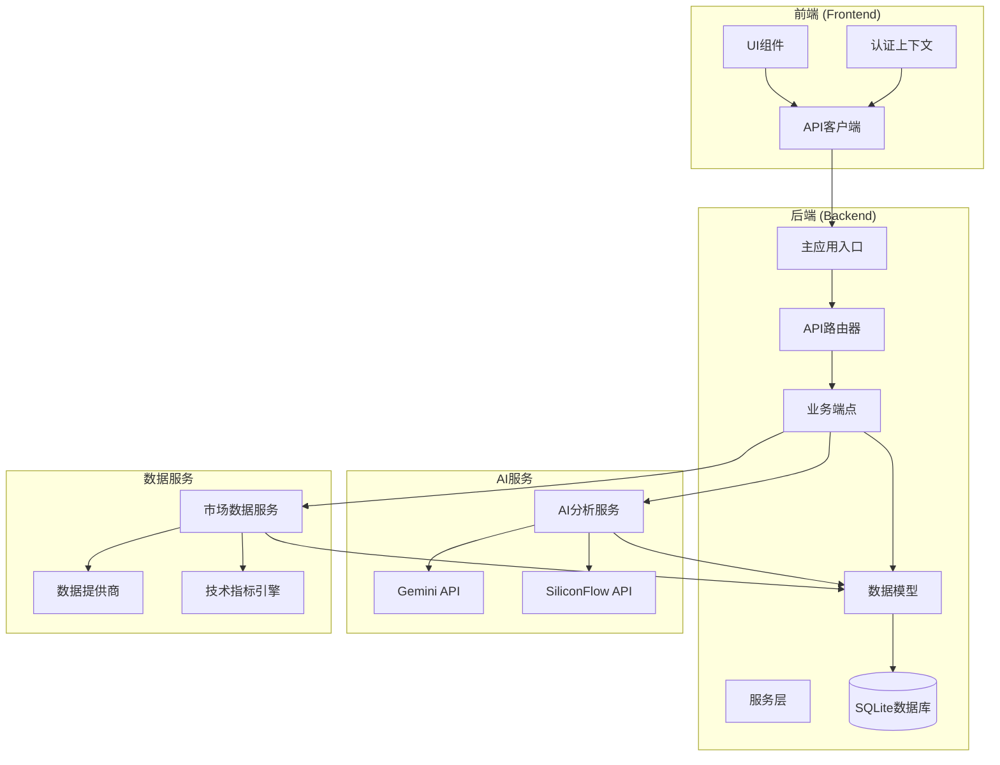
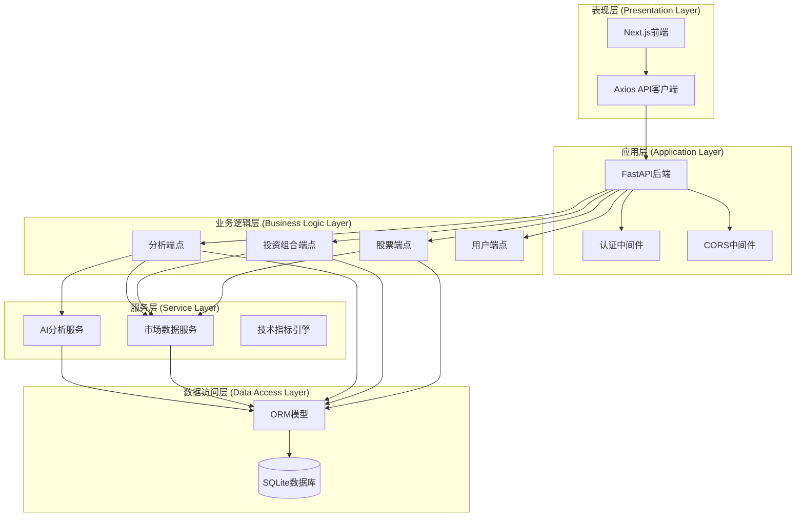
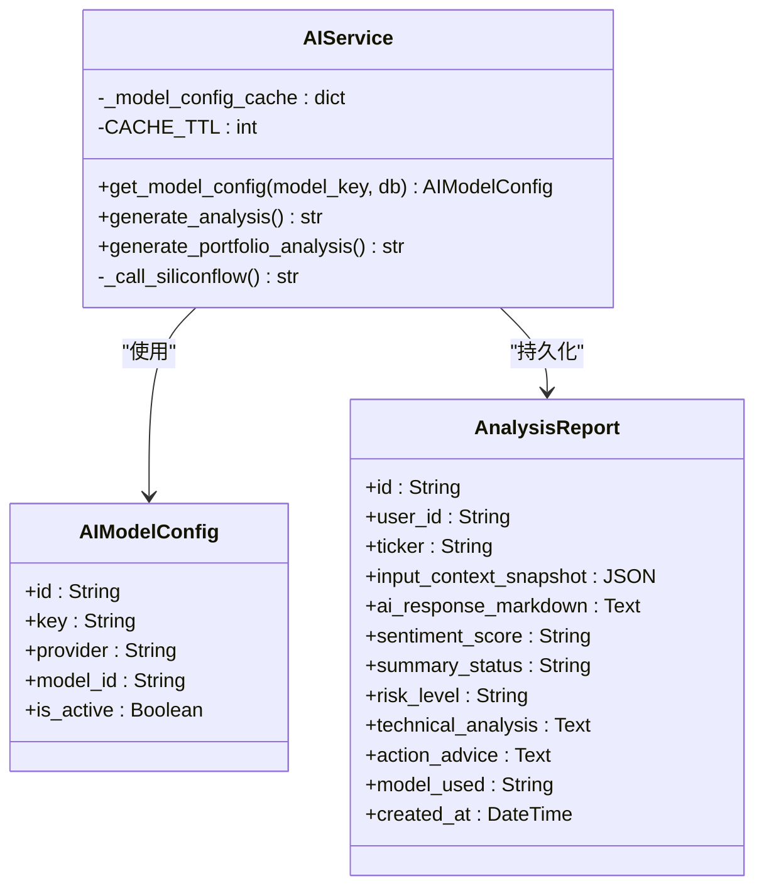
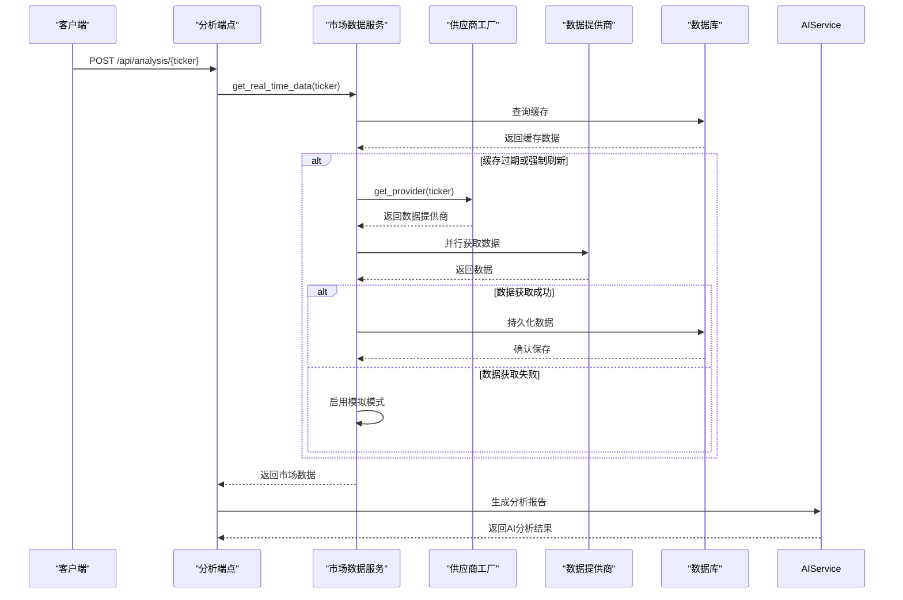
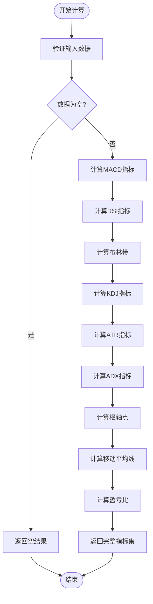
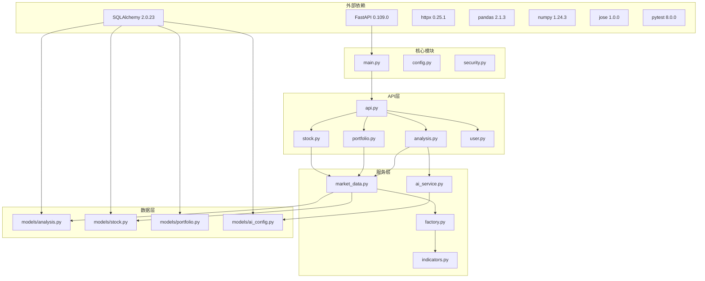

# 增强的AI分析服务

<cite>
**本文档引用的文件**
- [README.md](file://README.md)
- [backend/app/main.py](file://backend/app/main.py)
- [backend/app/api/v1/api.py](file://backend/app/api/v1/api.py)
- [backend/app/api/v1/endpoints/analysis.py](file://backend/app/api/v1/endpoints/analysis.py)
- [backend/app/services/ai_service.py](file://backend/app/services/ai_service.py)
- [backend/app/services/market_data.py](file://backend/app/services/market_data.py)
- [backend/app/services/market_providers/factory.py](file://backend/app/services/market_providers/factory.py)
- [backend/app/services/indicators.py](file://backend/app/services/indicators.py)
- [backend/app/models/analysis.py](file://backend/app/models/analysis.py)
- [backend/app/models/stock.py](file://backend/app/models/stock.py)
- [backend/app/models/portfolio.py](file://backend/app/models/portfolio.py)
- [backend/app/models/ai_config.py](file://backend/app/models/ai_config.py)
- [backend/app/schemas/analysis.py](file://backend/app/schemas/analysis.py)
- [backend/app/core/config.py](file://backend/app/core/config.py)
- [frontend/lib/api.ts](file://frontend/lib/api.ts)
- [frontend/context/AuthContext.tsx](file://frontend/context/AuthContext.tsx)
- [backend/tests/test_indicators.py](file://backend/tests/test_indicators.py)
- [backend/tests/test_api.py](file://backend/tests/test_api.py)
</cite>

## 更新摘要
**变更内容**
- AI分析服务重大增强：历史分析上下文集成、位置规模指导和AI提示模板优化
- 技术指标引擎代码优化：风险回报率计算简化和测试基础设施现代化
- 新增AI历史分析上下文功能，支持策略一致性检查
- 优化风险回报率计算逻辑，提供多级回退机制
- 增强测试覆盖率，引入PyTest框架和更完善的单元测试

## 目录
1. [简介](#简介)
2. [项目结构](#项目结构)
3. [核心组件](#核心组件)
4. [架构概览](#架构概览)
5. [详细组件分析](#详细组件分析)
6. [依赖关系分析](#依赖关系分析)
7. [性能考虑](#性能考虑)
8. [故障排除指南](#故障排除指南)
9. [结论](#结论)

## 简介

增强的AI分析服务是一个基于FastAPI构建的智能投资顾问平台，集成了多源市场数据、技术分析指标和大型语言模型（LLM）分析能力。该系统旨在为投资者提供数据驱动的投资决策支持，通过AI技术面分析、基本面分析和个性化投资建议，帮助用户做出更明智的投资选择。

**主要更新**：
- **历史分析上下文集成**：AI分析现在能够参考之前的分析结果，确保策略的一致性和连续性
- **位置规模指导**：提供基于技术位点的建仓区间和止损止盈建议，支持精确的仓位管理
- **风险回报率优化**：简化了风险回报率计算逻辑，提供多级回退机制
- **测试基础设施现代化**：引入PyTest框架，提供更完善的单元测试和集成测试

系统支持多种AI模型提供商（Gemini、SiliconFlow、DeepSeek、Qwen），具备强大的数据缓存机制、异常处理能力和安全的API设计。前端采用Next.js框架，提供了直观易用的投资分析界面。

## 项目结构

该项目采用前后端分离的架构设计，后端使用Python FastAPI框架，前端使用TypeScript Next.js框架。

**图表来源**
- [backend/app/main.py](file://backend/app/main.py#L1-L129)
- [backend/app/api/v1/api.py](file://backend/app/api/v1/api.py#L1-L25)
- [frontend/lib/api.ts](file://frontend/lib/api.ts#L1-L205)

**章节来源**
- [README.md](file://README.md#L45-L60)
- [backend/app/main.py](file://backend/app/main.py#L1-L129)
- [backend/app/api/v1/api.py](file://backend/app/api/v1/api.py#L1-L25)

## 核心组件

### AI分析服务 (AIService)

AI分析服务是系统的核心组件，负责与多个LLM提供商交互，生成专业的投资分析报告。该服务具备以下关键特性：

- **多模型支持**：支持Gemini、SiliconFlow、DeepSeek、Qwen等多种AI模型
- **动态配置管理**：通过数据库配置表管理模型参数和API密钥
- **智能缓存机制**：实现内存缓存和数据库缓存的两级缓存策略
- **结构化输出**：确保AI输出符合JSON规范，便于前端解析
- **历史分析上下文**：集成之前的分析结果，确保策略一致性

**更新**：新增历史分析上下文功能，AI分析现在能够参考之前的分析结果，提供连续性的投资建议。

### 市场数据服务 (MarketDataService)

市场数据服务负责协调多个数据源，提供实时的市场数据和历史数据。其主要功能包括：

- **多源数据抓取**：支持YFinance、AkShare、AlphaVantage等多个数据提供商
- **并行数据获取**：使用asyncio实现并行数据抓取，提升响应速度
- **智能缓存策略**：1分钟缓存过期时间，平衡数据新鲜度和API限制
- **故障转移机制**：当主要数据源不可用时自动切换到备用数据源
- **风险回报率同步**：将AI分析的风险回报率同步到市场缓存中

### 技术指标引擎 (TechnicalIndicators)

技术指标引擎提供基于Pandas的高效技术指标计算，支持：

- **MACD指标**：计算MACD线、信号线和柱状图
- **RSI指标**：计算相对强弱指数
- **布林带**：计算上轨、中轨和下轨
- **KDJ指标**：计算KDJ随机指标
- **ATR和ADX**：计算平均真实波幅和趋势强度
- **风险回报率计算**：提供多级回退的简化计算逻辑

**更新**：优化了风险回报率计算逻辑，提供更可靠的多级回退机制，确保在不同市场条件下都能提供准确的风险评估。

**章节来源**
- [backend/app/services/ai_service.py](file://backend/app/services/ai_service.py#L1-L390)
- [backend/app/services/market_data.py](file://backend/app/services/market_data.py#L1-L266)
- [backend/app/services/indicators.py](file://backend/app/services/indicators.py#L1-L192)

## 架构概览

系统采用分层架构设计，确保各组件职责清晰、耦合度低。

**图表来源**
- [backend/app/main.py](file://backend/app/main.py#L27-L129)
- [backend/app/api/v1/endpoints/analysis.py](file://backend/app/api/v1/endpoints/analysis.py#L1-L665)
- [frontend/lib/api.ts](file://frontend/lib/api.ts#L1-L205)

## 详细组件分析

### AI分析服务架构

AI分析服务采用工厂模式和策略模式相结合的设计，实现了高度灵活的AI模型管理。

**图表来源**
- [backend/app/services/ai_service.py](file://backend/app/services/ai_service.py#L23-L76)
- [backend/app/models/ai_config.py](file://backend/app/models/ai_config.py#L6-L21)
- [backend/app/models/analysis.py](file://backend/app/models/analysis.py#L12-L42)

### 市场数据服务流程

市场数据服务实现了复杂的数据获取和缓存机制，确保系统的高性能和可靠性。

**图表来源**
- [backend/app/api/v1/endpoints/analysis.py](file://backend/app/api/v1/endpoints/analysis.py#L200-L600)
- [backend/app/services/market_data.py](file://backend/app/services/market_data.py#L18-L115)

### 技术指标计算流程

技术指标引擎提供了全面的技术分析能力，支持多种常用技术指标的计算。

**更新**：优化了风险回报率计算逻辑，提供多级回退机制：
1. 首选枢轴点阻力位和支撑位计算
2. 备选布林带上下轨计算
3. 最终移动平均线±2ATR计算

**图表来源**
- [backend/app/services/indicators.py](file://backend/app/services/indicators.py#L45-L192)

**章节来源**
- [backend/app/services/ai_service.py](file://backend/app/services/ai_service.py#L136-L286)
- [backend/app/services/market_data.py](file://backend/app/services/market_data.py#L18-L58)
- [backend/app/services/indicators.py](file://backend/app/services/indicators.py#L7-L192)

## 依赖关系分析

系统采用了清晰的依赖层次结构，确保模块间的松耦合和高内聚。

**更新**：新增PyTest测试框架依赖，提供更完善的测试基础设施。

**图表来源**
- [backend/app/main.py](file://backend/app/main.py#L1-L129)
- [backend/app/api/v1/api.py](file://backend/app/api/v1/api.py#L1-L25)
- [backend/app/services/ai_service.py](file://backend/app/services/ai_service.py#L1-L17)

**章节来源**
- [backend/app/core/config.py](file://backend/app/core/config.py#L1-L28)
- [backend/app/models/analysis.py](file://backend/app/models/analysis.py#L1-L42)
- [backend/app/models/stock.py](file://backend/app/models/stock.py#L1-L105)

## 性能考虑

系统在设计时充分考虑了性能优化，采用了多种策略来提升响应速度和资源利用率：

### 缓存策略
- **内存缓存**：AI模型配置采用5分钟TTL的内存缓存，减少数据库查询压力
- **数据库缓存**：市场数据采用1分钟缓存策略，平衡数据新鲜度和API限制
- **智能降级**：当网络异常时启用模拟模式，确保系统可用性

### 并行处理
- **异步IO**：使用asyncio实现并行数据抓取，显著提升响应速度
- **批量操作**：支持批量数据处理，减少数据库往返次数
- **资源池管理**：合理管理HTTP连接和数据库连接池

### 优化建议
- 考虑实现Redis缓存层，进一步提升缓存性能
- 优化数据库索引策略，特别是查询频繁的字段
- 实现数据预加载机制，减少首次访问延迟

**更新**：新增风险回报率缓存优化，AI分析生成的风险回报率会同步到市场缓存中，避免重复计算。

## 故障排除指南

### 常见问题及解决方案

#### AI模型配置问题
**症状**：AI分析接口返回错误信息
**原因**：AI模型配置缺失或API密钥配置错误
**解决方案**：
1. 检查AI模型配置表中是否存在对应的模型配置
2. 验证API密钥是否正确配置
3. 确认模型提供商的API服务正常运行

#### 数据获取失败
**症状**：股票数据无法获取或显示异常
**原因**：数据提供商API限制或网络问题
**解决方案**：
1. 检查数据提供商的API限制和配额
2. 验证网络连接和代理设置
3. 查看系统日志中的错误信息
4. 考虑切换到备用数据提供商

#### 性能问题
**症状**：API响应缓慢或超时
**原因**：缓存未命中或数据库查询性能问题
**解决方案**：
1. 检查缓存配置和TTL设置
2. 优化数据库查询语句和索引
3. 考虑增加服务器资源或实施负载均衡

#### 风险回报率计算异常
**症状**：风险回报率显示为None或计算错误
**原因**：技术指标数据不完整或计算逻辑异常
**解决方案**：
1. 检查技术指标计算结果，确保数据完整性
2. 验证风险回报率计算逻辑的输入参数
3. 查看多级回退机制是否正常工作
4. 确认AI分析生成的风险回报率是否正确同步

**章节来源**
- [backend/app/services/ai_service.py](file://backend/app/services/ai_service.py#L64-L76)
- [backend/app/services/market_data.py](file://backend/app/services/market_data.py#L237-L266)
- [backend/app/api/v1/endpoints/analysis.py](file://backend/app/api/v1/endpoints/analysis.py#L214-L238)

## 结论

增强的AI分析服务是一个功能完整、架构清晰的智能投资顾问平台。系统通过集成多源数据、技术分析和AI模型，为投资者提供了全面的投资决策支持。

### 主要优势
- **多模型支持**：灵活的AI模型管理，支持多种主流LLM提供商
- **高性能架构**：采用缓存策略和并行处理，确保良好的用户体验
- **可靠的数据服务**：多数据源备份和故障转移机制
- **安全的API设计**：完善的认证授权和异常处理机制
- **历史分析上下文**：AI分析具备策略一致性检查能力
- **优化的风险回报率**：提供多级回退的可靠计算机制
- **现代化测试基础设施**：PyTest框架提供完善的测试覆盖

### 技术亮点
- 分层架构设计，职责清晰，易于维护和扩展
- 智能缓存机制，有效平衡数据新鲜度和性能
- 完善的错误处理和降级策略，提升系统稳定性
- 标准化的API设计，便于前端集成和第三方扩展
- 多级风险回报率计算，适应不同市场条件
- 历史分析上下文集成，确保策略连续性

### 测试现代化
- 引入PyTest框架，提供更完善的单元测试
- 增强技术指标计算的测试覆盖率
- 改进API端点的测试基础设施
- 提供更可靠的集成测试环境

该系统为投资者提供了一个强大而可靠的技术分析工具，通过AI技术的应用，帮助用户做出更加明智的投资决策。随着功能的不断完善和技术的持续优化，该平台有望成为智能投顾领域的优秀解决方案。