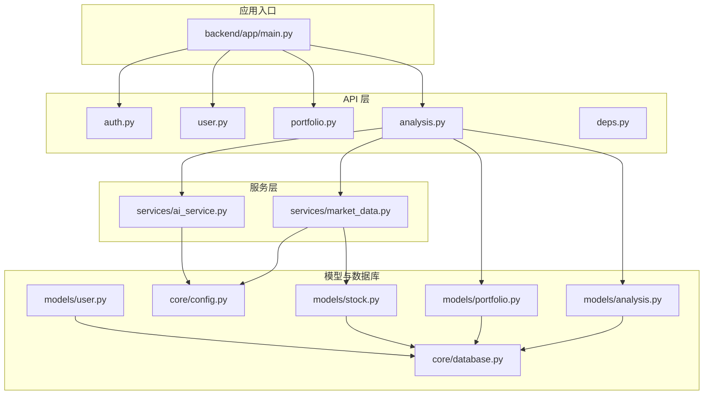
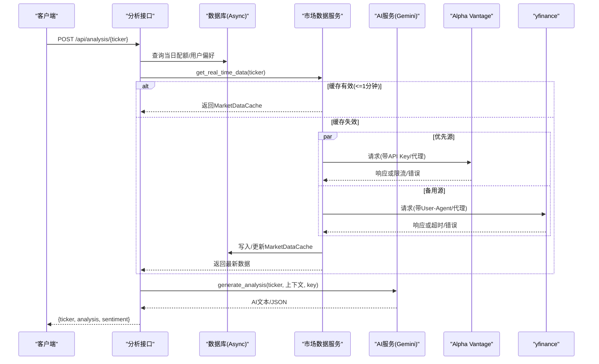
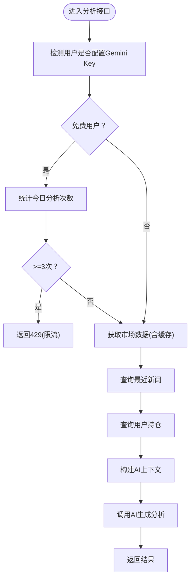
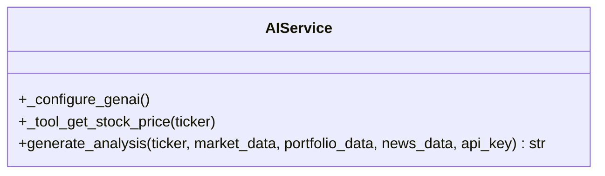
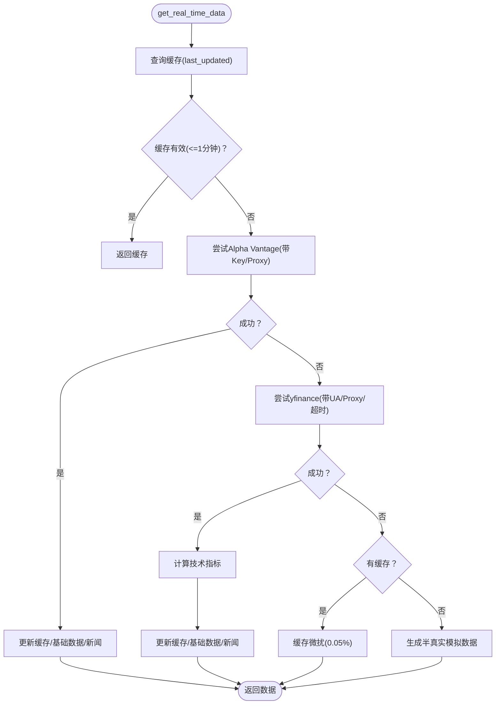
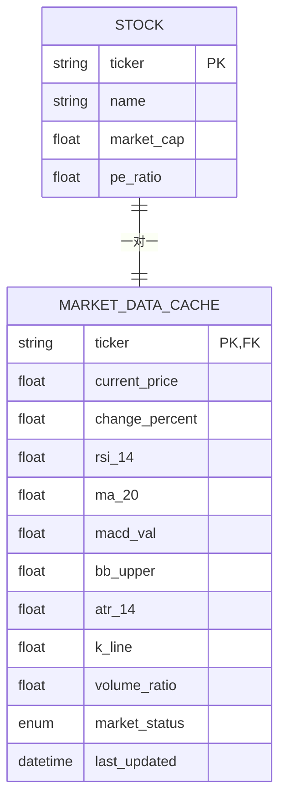
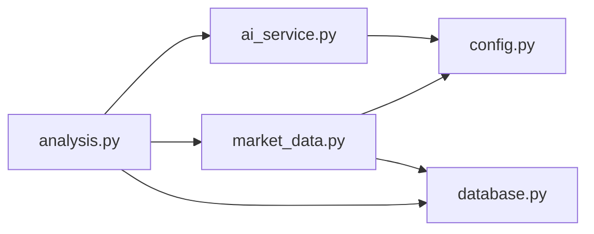

# 性能优化与监控

<cite>
**本文引用的文件**
- [backend/app/main.py](file://backend/app/main.py)
- [backend/app/api/analysis.py](file://backend/app/api/analysis.py)
- [backend/app/services/ai_service.py](file://backend/app/services/ai_service.py)
- [backend/app/services/market_data.py](file://backend/app/services/market_data.py)
- [backend/app/core/config.py](file://backend/app/core/config.py)
- [backend/app/core/database.py](file://backend/app/core/database.py)
- [backend/app/api/deps.py](file://backend/app/api/deps.py)
- [backend/app/models/analysis.py](file://backend/app/models/analysis.py)
- [backend/app/models/stock.py](file://backend/app/models/stock.py)
- [backend/app/models/portfolio.py](file://backend/app/models/portfolio.py)
- [backend/app/models/user.py](file://backend/app/models/user.py)
- [doc/Database Schema & Data Flow Specification.md](file://doc/Database Schema & Data Flow Specification.md)
- [doc/tech_stack.md](file://doc/tech_stack.md)
- [backend/scripts/test_batch_collection.py](file://backend/scripts/test_batch_collection.py)
- [backend/requirements.txt](file://backend/requirements.txt)
</cite>

## 目录
1. [简介](#简介)
2. [项目结构](#项目结构)
3. [核心组件](#核心组件)
4. [架构总览](#架构总览)
5. [详细组件分析](#详细组件分析)
6. [依赖分析](#依赖分析)
7. [性能考量](#性能考量)
8. [故障排查指南](#故障排查指南)
9. [结论](#结论)
10. [附录](#附录)

## 简介
本文件聚焦于AI股票顾问后端的性能优化与监控实践，围绕以下主题展开：
- 性能瓶颈识别与优化策略：API调用频率控制、响应时间优化、并发与资源管理、内存与GC策略、缓存机制设计与实现。
- 监控指标设计：API调用统计、错误率监控、性能指标（延迟、吞吐、资源占用）。
- 性能测试与基准策略：批量采集测试脚本与流程。
- 故障诊断工具与调试技巧：日志、超时与重试、降级与回退。
- 可扩展性与负载均衡：异步数据库、外部API限流与回退、缓存与后台任务。

## 项目结构
后端采用FastAPI + SQLAlchemy AsyncIO + Alembic的现代异步架构，核心模块包括：
- 应用入口与路由：应用启动、CORS、健康检查、路由注册。
- API层：认证、用户、组合、分析接口。
- 服务层：AI服务（Gemini）、市场数据服务（yfinance/Alpha Vantage）。
- 模型与数据库：用户、股票、市场缓存、分析报告、组合等。
- 配置与数据库引擎：环境变量、数据库连接池与会话管理。
- 文档与脚本：数据库模式与数据流说明、批量采集测试脚本。

图表来源
- [backend/app/main.py](file://backend/app/main.py#L1-L38)
- [backend/app/api/analysis.py](file://backend/app/api/analysis.py#L1-L124)
- [backend/app/services/ai_service.py](file://backend/app/services/ai_service.py#L1-L112)
- [backend/app/services/market_data.py](file://backend/app/services/market_data.py#L1-L370)
- [backend/app/core/config.py](file://backend/app/core/config.py#L1-L25)
- [backend/app/core/database.py](file://backend/app/core/database.py#L1-L24)
- [backend/app/models/stock.py](file://backend/app/models/stock.py#L1-L85)
- [backend/app/models/user.py](file://backend/app/models/user.py#L1-L31)
- [backend/app/models/portfolio.py](file://backend/app/models/portfolio.py#L1-L26)
- [backend/app/models/analysis.py](file://backend/app/models/analysis.py#L1-L25)

章节来源
- [backend/app/main.py](file://backend/app/main.py#L1-L38)
- [doc/tech_stack.md](file://doc/tech_stack.md#L31-L51)

## 核心组件
- 应用入口与路由：注册分析、认证、用户、组合路由；健康检查端点；CORS配置。
- 分析接口：每日配额控制（免费用户）、市场数据聚合、新闻与持仓上下文、AI生成分析、返回结构化结果。
- AI服务：Gemini客户端初始化、提示工程、异步生成、错误回退。
- 市场数据服务：缓存读写、多源回退（Alpha Vantage优先、yfinance备选）、指数计算与新闻入库、异常与限流处理。
- 数据模型与缓存：MarketDataCache用于1分钟内复用；AnalysisReport用于配额统计与历史记录。
- 配置与数据库：异步引擎、会话工厂、环境变量加载。

章节来源
- [backend/app/api/analysis.py](file://backend/app/api/analysis.py#L13-L124)
- [backend/app/services/ai_service.py](file://backend/app/services/ai_service.py#L43-L112)
- [backend/app/services/market_data.py](file://backend/app/services/market_data.py#L15-L170)
- [backend/app/models/stock.py](file://backend/app/models/stock.py#L33-L67)
- [backend/app/models/analysis.py](file://backend/app/models/analysis.py#L12-L25)
- [backend/app/core/config.py](file://backend/app/core/config.py#L1-L25)
- [backend/app/core/database.py](file://backend/app/core/database.py#L1-L24)

## 架构总览
系统以FastAPI作为入口，通过异步数据库访问与外部金融数据API协作，完成“市场数据缓存 + 上下文聚合 + AI分析”的完整链路。分析接口在进入AI生成前进行配额检查与缓存命中判定，从而降低外部API与LLM调用频率。

图表来源
- [backend/app/api/analysis.py](file://backend/app/api/analysis.py#L13-L124)
- [backend/app/services/market_data.py](file://backend/app/services/market_data.py#L15-L170)
- [backend/app/services/ai_service.py](file://backend/app/services/ai_service.py#L43-L112)
- [backend/app/core/database.py](file://backend/app/core/database.py#L21-L24)

## 详细组件分析

### 分析接口与配额控制
- 功能要点
  - 免费用户每日最多3次分析请求；超过触发限流错误。
  - 聚合市场数据、新闻、用户持仓，形成上下文。
  - 调用AI服务生成分析文本，返回结构化结果。
- 性能影响
  - 频繁的数据库查询与外部API调用可能成为瓶颈；缓存与回退策略显著降低延迟。
  - 配额控制避免滥用，保护上游服务与成本。

图表来源
- [backend/app/api/analysis.py](file://backend/app/api/analysis.py#L13-L124)

章节来源
- [backend/app/api/analysis.py](file://backend/app/api/analysis.py#L13-L124)
- [doc/Database Schema & Data Flow Specification.md](file://doc/Database Schema & Data Flow Specification.md#L62-L74)

### AI服务与提示工程
- 功能要点
  - 初始化Gemini客户端（支持用户自有Key或全局Key）。
  - 异步生成内容，优先JSON模式，失败回退纯文本。
  - 错误日志记录，便于定位问题。
- 性能影响
  - 异步生成减少阻塞；JSON模式有助于前端解析与一致性。
  - 失败回退保证可用性，但可能增加响应时间。

图表来源
- [backend/app/services/ai_service.py](file://backend/app/services/ai_service.py#L8-L112)

章节来源
- [backend/app/services/ai_service.py](file://backend/app/services/ai_service.py#L43-L112)

### 市场数据服务与缓存
- 功能要点
  - 缓存命中：若缓存存在且小于1分钟，直接返回。
  - 多源回退：优先Alpha Vantage，失败再尝试yfinance；均失败则模拟数据或使用缓存微扰。
  - 指标计算：在yfinance侧基于历史数据计算RSI、MACD、布林带、KDJ、ATR、量能比等。
  - 新闻入库：SQLite Upsert去重，避免重复写入。
  - 限流与重试：yfinance遇到429按指数退避+抖动等待。
- 性能影响
  - 缓存显著降低外部API与LLM调用频率。
  - 指标计算在服务端完成，减少前端复杂度。
  - 代理与User-Agent设置提升稳定性。

图表来源
- [backend/app/services/market_data.py](file://backend/app/services/market_data.py#L15-L170)

章节来源
- [backend/app/services/market_data.py](file://backend/app/services/market_data.py#L15-L170)
- [doc/Database Schema & Data Flow Specification.md](file://doc/Database Schema & Data Flow Specification.md#L48-L61)

### 数据模型与缓存表
- MarketDataCache
  - 关键字段：价格、涨跌幅、RSI、MA系列、MACD系列、布林带、ATR、KDJ、量能指标、市场状态、最后更新时间。
  - 设计目的：1分钟内复用，避免频繁外部API调用。
- AnalysisReport
  - 记录用户分析历史，用于配额统计与展示。
- Stock/StockNews
  - 基础信息与新闻实体，支撑上下文丰富度。

图表来源
- [backend/app/models/stock.py](file://backend/app/models/stock.py#L13-L67)

章节来源
- [backend/app/models/stock.py](file://backend/app/models/stock.py#L33-L67)
- [backend/app/models/analysis.py](file://backend/app/models/analysis.py#L12-L25)
- [doc/Database Schema & Data Flow Specification.md](file://doc/Database Schema & Data Flow Specification.md#L48-L74)

### 并发处理与资源管理
- 异步数据库：使用SQLAlchemy AsyncIO引擎与AsyncSession，避免阻塞。
- 外部API并发：使用线程池执行器在协程中安全地运行阻塞调用（如yfinance），并通过超时控制防止长时间阻塞。
- 后台任务：新增组合时，若缓存不完整，立即创建后台任务拉取完整数据，不阻塞主流程。
- 连接与会话：数据库会话按需创建与释放，避免长事务与连接泄漏。

章节来源
- [backend/app/core/database.py](file://backend/app/core/database.py#L1-L24)
- [backend/app/services/market_data.py](file://backend/app/services/market_data.py#L25-L57)
- [backend/app/api/portfolio.py](file://backend/app/api/portfolio.py#L273-L279)

### 内存使用优化与垃圾回收策略
- 减少中间对象：在市场数据聚合阶段，仅保留必要字段，避免大对象跨层传递。
- 控制指标计算窗口：仅在需要时计算RSI、MACD、布林带等，避免重复计算。
- 事件循环与线程池：合理设置线程池大小，避免过多并发导致上下文切换开销。
- 日志与调试：使用轻量日志，避免在高频路径打印大量结构化数据。

章节来源
- [backend/app/services/market_data.py](file://backend/app/services/market_data.py#L237-L291)
- [backend/app/services/ai_service.py](file://backend/app/services/ai_service.py#L5-L6)

### 缓存机制设计与实现
- 结果缓存（MarketDataCache）
  - 1分钟有效期，命中即返回，未命中才发起外部请求。
  - 更新时同时写入技术指标与新闻，确保上下文完整性。
- 配置缓存（用户偏好）
  - 用户偏好数据（如首选数据源、API Key）来自数据库与环境变量，可在服务启动时加载并缓存。
- 结果缓存（AnalysisReport）
  - 用于配额统计与历史展示，索引created_at支持高效统计。

章节来源
- [backend/app/services/market_data.py](file://backend/app/services/market_data.py#L16-L24)
- [backend/app/models/analysis.py](file://backend/app/models/analysis.py#L19-L24)
- [doc/Database Schema & Data Flow Specification.md](file://doc/Database Schema & Data Flow Specification.md#L48-L74)

### 监控指标设计
- API调用统计
  - 分析接口调用次数、按用户/按日期统计，配合AnalysisReport表的created_at索引。
- 错误率监控
  - Gemini调用失败、外部API限流/超时、yfinance 429等。
- 性能指标
  - 响应时间分布（p50/p95/p99）、外部API延迟、数据库查询耗时、AI生成耗时。
- 资源监控
  - CPU/内存/GC统计、数据库连接数、并发请求数。

章节来源
- [backend/app/services/ai_service.py](file://backend/app/services/ai_service.py#L103-L111)
- [backend/app/services/market_data.py](file://backend/app/services/market_data.py#L305-L318)
- [backend/app/models/analysis.py](file://backend/app/models/analysis.py#L24-L24)

### 性能测试与基准策略
- 批量采集测试
  - 定位最老的N条缓存记录，批量触发yfinance拉取，评估整体吞吐与延迟。
  - 支持从Portfolio中推导待采集标的，避免空库场景。
- 基准策略
  - 固定样本集（如常驻自选股），在不同缓存命中率下测量响应时间。
  - 对比启用/禁用缓存、不同限流参数下的表现。

章节来源
- [backend/scripts/test_batch_collection.py](file://backend/scripts/test_batch_collection.py#L16-L43)

## 依赖分析
- 组件耦合
  - 分析接口依赖市场数据服务与AI服务，耦合度适中，职责清晰。
  - 市场数据服务依赖外部API与数据库，需注意限流与降级。
- 外部依赖
  - Google Generative AI、yfinance、requests、SQLAlchemy AsyncIO、Uvicorn。
- 循环依赖
  - 未见明显循环导入；模型与服务分层明确。

图表来源
- [backend/app/api/analysis.py](file://backend/app/api/analysis.py#L1-L124)
- [backend/app/services/ai_service.py](file://backend/app/services/ai_service.py#L1-L112)
- [backend/app/services/market_data.py](file://backend/app/services/market_data.py#L1-L370)
- [backend/app/core/database.py](file://backend/app/core/database.py#L1-L24)
- [backend/app/core/config.py](file://backend/app/core/config.py#L1-L25)

章节来源
- [backend/requirements.txt](file://backend/requirements.txt#L1-L75)

## 性能考量
- API调用频率控制
  - 免费用户每日上限3次，配合缓存减少外部调用。
  - 市场数据缓存1分钟，显著降低重复请求。
- 响应时间优化
  - 异步数据库与线程池执行器；外部API超时与限流处理。
  - 提示工程与模型选择（gemini-1.5-flash）兼顾速度与质量。
- 并发与资源管理
  - AsyncSession按需创建；后台任务拉取完整数据，避免阻塞。
- 内存与GC
  - 控制中间对象生命周期；避免在热路径上构造大对象。
- 缓存策略
  - 结果缓存与配置缓存双管齐下；缓存失效策略与回退机制完善。

## 故障排查指南
- 常见问题
  - Gemini API Key缺失：AI服务返回模拟结果并记录警告。
  - 外部API限流/超时：yfinance按指数退避；Alpha Vantage返回限流提示。
  - 数据库连接异常：检查异步引擎配置与连接池参数。
- 调试技巧
  - 在分析接口与市场数据服务中加入轻量日志，定位瓶颈。
  - 使用批量采集脚本验证缓存与指标计算链路。
  - 在开发环境开启数据库echo，观察SQL执行情况。

章节来源
- [backend/app/services/ai_service.py](file://backend/app/services/ai_service.py#L17-L18)
- [backend/app/services/market_data.py](file://backend/app/services/market_data.py#L305-L318)
- [backend/app/core/database.py](file://backend/app/core/database.py#L7-L8)
- [backend/scripts/test_batch_collection.py](file://backend/scripts/test_batch_collection.py#L16-L43)

## 结论
本项目通过“缓存优先、多源回退、异步并发、限流与降级”等策略，在保证用户体验的同时有效控制了外部API与LLM调用成本。建议在生产环境中进一步引入指标埋点、分布式追踪与自动扩缩容能力，以支撑更高并发与更复杂的分析场景。

## 附录
- 技术栈概览：FastAPI、SQLAlchemy AsyncIO、Uvicorn、Google Generative AI、yfinance、pandas。
- 开发与部署：建议使用异步数据库、进程化部署（多个uvicorn worker）与反向代理（Nginx/Traefik）实现负载均衡。

章节来源
- [doc/tech_stack.md](file://doc/tech_stack.md#L31-L51)