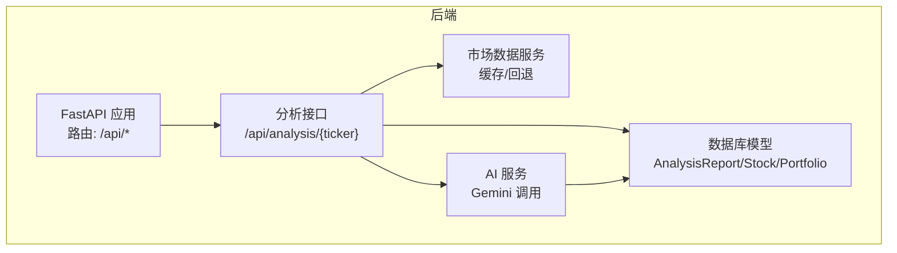
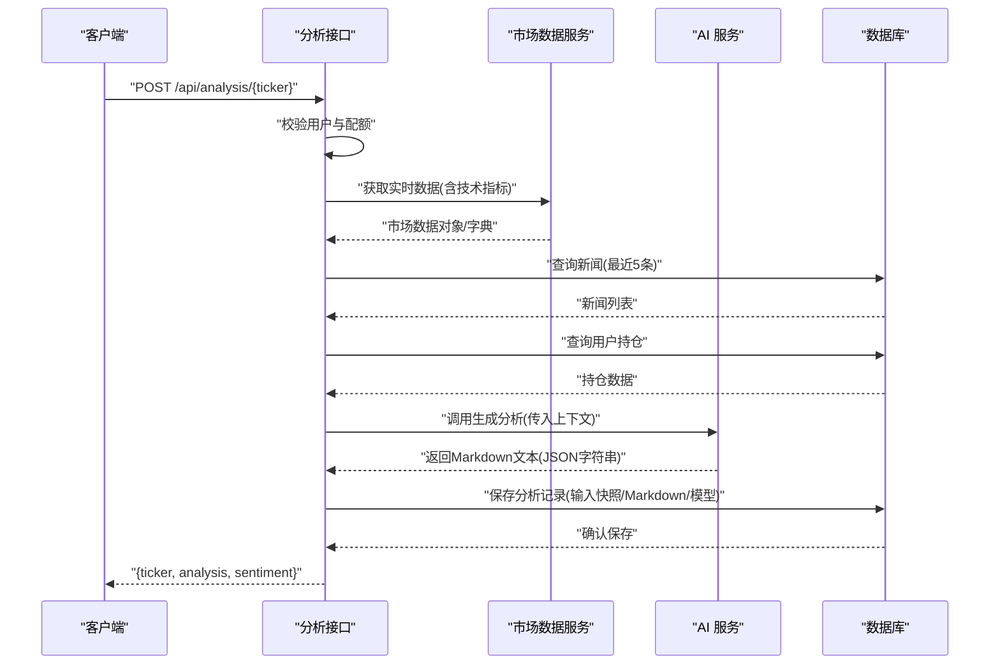
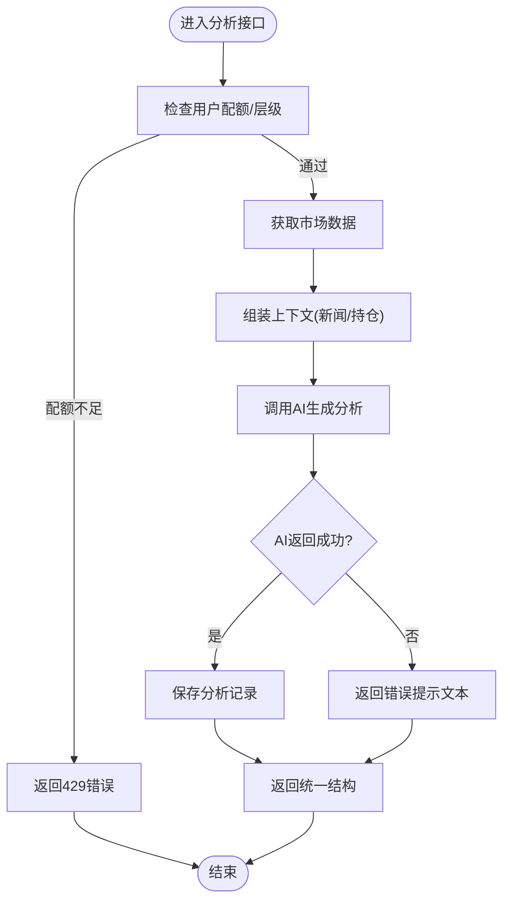
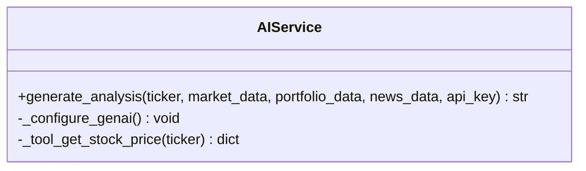
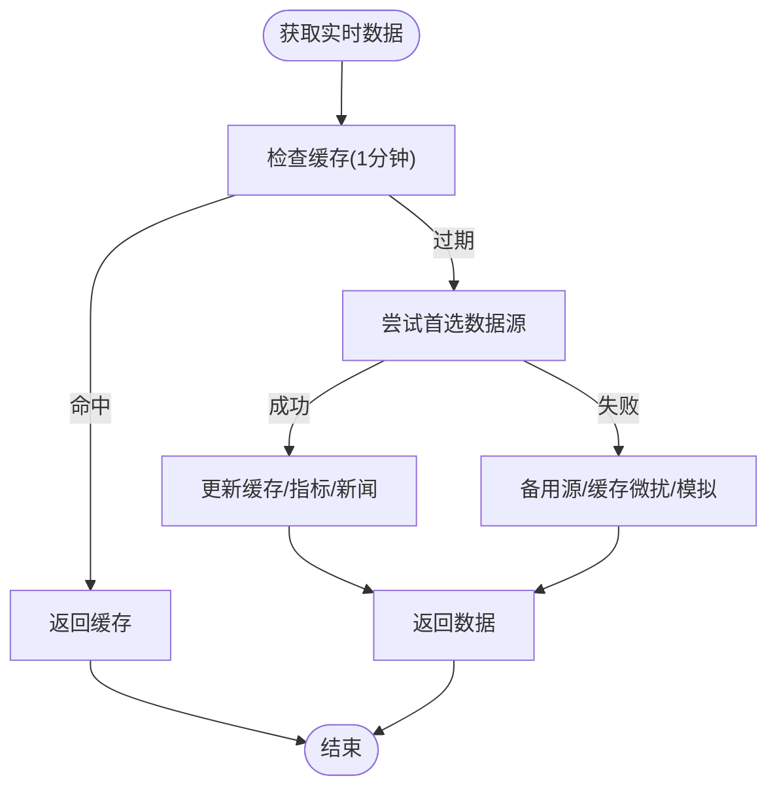
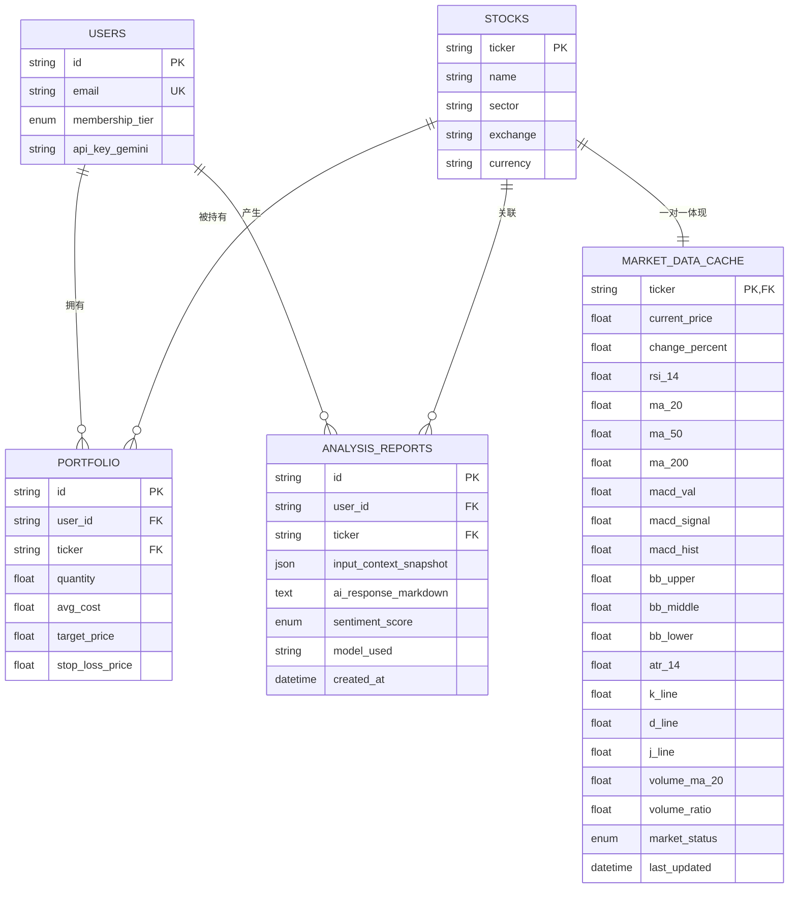
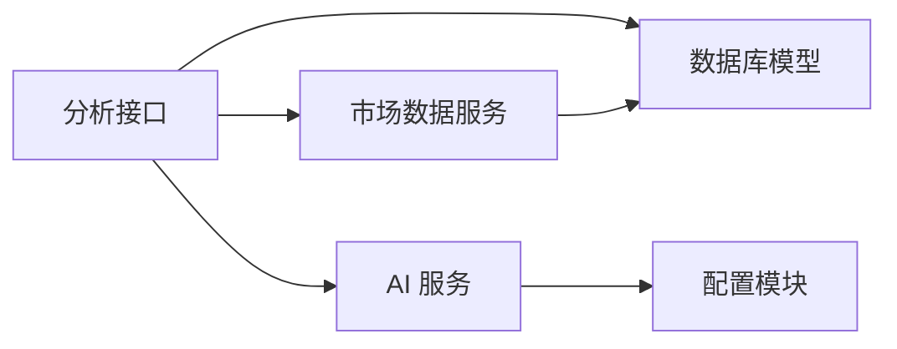

# 报告生成与输出

<cite>
**本文引用的文件**
- [backend/app/main.py](file://backend/app/main.py)
- [backend/app/api/analysis.py](file://backend/app/api/analysis.py)
- [backend/app/api/user.py](file://backend/app/api/user.py)
- [backend/app/api/deps.py](file://backend/app/api/deps.py)
- [backend/app/services/ai_service.py](file://backend/app/services/ai_service.py)
- [backend/app/services/market_data.py](file://backend/app/services/market_data.py)
- [backend/app/models/analysis.py](file://backend/app/models/analysis.py)
- [backend/app/models/stock.py](file://backend/app/models/stock.py)
- [backend/app/models/portfolio.py](file://backend/app/models/portfolio.py)
- [backend/app/models/user.py](file://backend/app/models/user.py)
- [backend/app/core/config.py](file://backend/app/core/config.py)
- [doc/PRD.md](file://doc/PRD.md)
- [doc/Database Schema & Data Flow Specification.md](file://doc/Database Schema & Data Flow Specification.md)
</cite>

## 目录
1. [简介](#简介)
2. [项目结构](#项目结构)
3. [核心组件](#核心组件)
4. [架构总览](#架构总览)
5. [详细组件分析](#详细组件分析)
6. [依赖分析](#依赖分析)
7. [性能考量](#性能考量)
8. [故障排查指南](#故障排查指南)
9. [结论](#结论)
10. [附录](#附录)

## 简介
本文件聚焦于“报告生成与输出”能力，系统化阐述AI分析结果的结构化输出格式（JSON与Markdown）、报告字段设计（technical_analysis、fundamental_news、action_advice等）、输出验证与数据完整性检查、错误处理与异常策略、报告缓存与性能优化、前端展示接口与数据格式规范，以及输出质量控制与一致性保障措施。内容以后端FastAPI服务为核心，结合数据库模型与外部数据源，确保读者能够准确理解并实施该能力。

## 项目结构
后端采用FastAPI框架，路由集中在/api目录，核心业务逻辑位于服务层（AI与市场数据），数据模型定义在models目录，配置与安全在core目录。分析接口负责组装上下文、调用AI服务并返回结构化结果；AI服务负责与Gemini交互并返回Markdown文本；市场数据服务负责缓存与回退策略；数据库模型定义了分析记录、股票与缓存、用户与持仓等实体。

图表来源
- [backend/app/main.py](file://backend/app/main.py#L24-L29)
- [backend/app/api/analysis.py](file://backend/app/api/analysis.py#L13-L124)
- [backend/app/services/ai_service.py](file://backend/app/services/ai_service.py#L43-L112)
- [backend/app/services/market_data.py](file://backend/app/services/market_data.py#L15-L170)
- [backend/app/models/analysis.py](file://backend/app/models/analysis.py#L12-L25)
- [backend/app/models/stock.py](file://backend/app/models/stock.py#L13-L85)
- [backend/app/models/portfolio.py](file://backend/app/models/portfolio.py#L7-L26)

章节来源
- [backend/app/main.py](file://backend/app/main.py#L1-L38)
- [backend/app/api/analysis.py](file://backend/app/api/analysis.py#L1-L124)
- [doc/PRD.md](file://doc/PRD.md#L65-L79)

## 核心组件
- 分析接口：负责权限校验、上下文组装（市场数据、新闻、持仓）、调用AI服务并返回统一响应结构。
- AI服务：封装Gemini调用，强制JSON模式输出，失败时回退为纯文本，具备错误日志与降级策略。
- 市场数据服务：实现1分钟缓存、多数据源回退（yfinance/AlphaVantage）、技术指标计算与新闻入库。
- 数据模型：AnalysisReport记录输入快照、Markdown输出、情感评分与模型标识；Stock/MarketDataCache/StockNews支撑行情与新闻；Portfolio支撑用户持仓上下文。
- 用户与配额：用户模型包含API Key与偏好数据源；分析接口按用户层级进行使用次数限制。

章节来源
- [backend/app/api/analysis.py](file://backend/app/api/analysis.py#L13-L124)
- [backend/app/services/ai_service.py](file://backend/app/services/ai_service.py#L43-L112)
- [backend/app/services/market_data.py](file://backend/app/services/market_data.py#L15-L170)
- [backend/app/models/analysis.py](file://backend/app/models/analysis.py#L12-L25)
- [backend/app/models/stock.py](file://backend/app/models/stock.py#L13-L85)
- [backend/app/models/portfolio.py](file://backend/app/models/portfolio.py#L7-L26)
- [backend/app/models/user.py](file://backend/app/models/user.py#L15-L31)

## 架构总览
下图展示了从客户端发起分析请求到返回结构化报告的完整流程，包括权限校验、上下文准备、AI生成与持久化。

图表来源
- [backend/app/api/analysis.py](file://backend/app/api/analysis.py#L13-L124)
- [backend/app/services/market_data.py](file://backend/app/services/market_data.py#L15-L170)
- [backend/app/services/ai_service.py](file://backend/app/services/ai_service.py#L43-L112)
- [backend/app/models/analysis.py](file://backend/app/models/analysis.py#L12-L25)

## 详细组件分析

### 分析接口（/api/analysis/{ticker}）
职责与流程
- 权限与配额：若用户未配置Gemini Key，按“免费用户”每日3次限制统计并拦截超额请求。
- 上下文准备：调用市场数据服务获取实时价格与技术指标；查询股票新闻；查询用户持仓并计算未实现盈亏。
- AI生成：将上下文传入AI服务，接收结构化JSON字符串（由AI服务强制返回）。
- 返回结构：统一返回包含股票代码、分析结果（Markdown文本）、情感倾向占位字段的对象。

字段设计与用途
- ticker：请求的股票代码。
- analysis：AI返回的Markdown文本（内部为JSON字符串，前端渲染时再解析）。
- sentiment：占位字段，当前固定为“NEUTRAL”，后续可从AI响应中解析情感评分。

错误处理
- 配额不足：返回429与明确提示。
- 市场数据回退：当对象不可序列化时，使用默认/回退数据继续流程。
- AI异常：捕获异常并回退为错误提示文本。

图表来源
- [backend/app/api/analysis.py](file://backend/app/api/analysis.py#L13-L124)
- [backend/app/models/analysis.py](file://backend/app/models/analysis.py#L12-L25)

章节来源
- [backend/app/api/analysis.py](file://backend/app/api/analysis.py#L13-L124)

### AI服务（结构化输出与错误回退）
职责与流程
- 关键选择：优先使用用户提供的Gemini Key；若为空则返回“模拟”Markdown文本提示。
- 模型配置：使用指定模型名称，开启JSON模式输出，要求AI严格返回JSON结构。
- 错误回退：若JSON模式失败，回退为普通文本生成；最终失败则返回错误提示。

输出格式
- JSON结构：AI服务在提示词中要求严格返回包含以下键的JSON字符串（不含Markdown代码块标记）：
  - technical_analysis：技术面深度总结。
  - fundamental_news：消息面解读。
  - action_advice：具体操作建议与风控点。
- Markdown文本：AI直接返回Markdown文本（内部为JSON字符串），前端可直接渲染。

错误处理
- Gemini API异常：记录日志并尝试回退；最终失败返回错误提示。

图表来源
- [backend/app/services/ai_service.py](file://backend/app/services/ai_service.py#L8-L112)

章节来源
- [backend/app/services/ai_service.py](file://backend/app/services/ai_service.py#L43-L112)

### 市场数据服务（缓存与回退）
职责与流程
- 缓存策略：1分钟内命中缓存，避免频繁外部调用。
- 多源回退：优先首选数据源，失败则回退至备用源；若仍失败，使用缓存微扰或半真实模拟数据。
- 技术指标：基于历史数据计算RSI、MACD、布林带、KDJ、ATR、量能等指标并写入缓存。
- 新闻入库：从yfinance抓取最新新闻并去重入库。

图表来源
- [backend/app/services/market_data.py](file://backend/app/services/market_data.py#L15-L170)

章节来源
- [backend/app/services/market_data.py](file://backend/app/services/market_data.py#L15-L170)

### 数据模型（分析记录与上下文）
- AnalysisReport：记录每次分析的输入快照（JSON）、AI输出Markdown、情感评分、模型标识与创建时间，用于展示与配额统计。
- Stock/MarketDataCache：标准化股票基础信息与行情缓存，支撑技术指标与新闻。
- StockNews：股票相关新闻，用于消息面上下文。
- Portfolio：用户持仓，用于个性化建议。

图表来源
- [backend/app/models/analysis.py](file://backend/app/models/analysis.py#L12-L25)
- [backend/app/models/stock.py](file://backend/app/models/stock.py#L13-L85)
- [backend/app/models/portfolio.py](file://backend/app/models/portfolio.py#L7-L26)
- [backend/app/models/user.py](file://backend/app/models/user.py#L15-L31)

章节来源
- [backend/app/models/analysis.py](file://backend/app/models/analysis.py#L12-L25)
- [backend/app/models/stock.py](file://backend/app/models/stock.py#L13-L85)
- [backend/app/models/portfolio.py](file://backend/app/models/portfolio.py#L7-L26)
- [backend/app/models/user.py](file://backend/app/models/user.py#L15-L31)

### 用户与配额（API Key与使用限制）
- 用户模型：包含会员层级、Gemini/DeepSeek API Key、偏好数据源等。
- 配额策略：免费用户每日最多3次分析；Pro用户无此限制。
- 设置接口：提供获取与更新用户设置（含API Key与偏好数据源）。

章节来源
- [backend/app/models/user.py](file://backend/app/models/user.py#L15-L31)
- [backend/app/api/user.py](file://backend/app/api/user.py#L11-L48)
- [backend/app/api/analysis.py](file://backend/app/api/analysis.py#L27-L50)

## 依赖分析
- 分析接口依赖：市场数据服务（获取技术指标与新闻）、AI服务（生成分析）、数据库（查询新闻、持仓、保存分析记录）。
- AI服务依赖：配置模块（读取默认Key）、Gemini SDK、日志。
- 市场数据服务依赖：yfinance/AlphaVantage、数据库缓存与新闻表。
- 数据模型之间存在外键关系，确保分析记录与股票、用户、持仓的一致性。

图表来源
- [backend/app/api/analysis.py](file://backend/app/api/analysis.py#L1-L124)
- [backend/app/services/ai_service.py](file://backend/app/services/ai_service.py#L1-L112)
- [backend/app/services/market_data.py](file://backend/app/services/market_data.py#L1-L370)
- [backend/app/core/config.py](file://backend/app/core/config.py#L1-L24)

章节来源
- [backend/app/api/analysis.py](file://backend/app/api/analysis.py#L1-L124)
- [backend/app/services/ai_service.py](file://backend/app/services/ai_service.py#L1-L112)
- [backend/app/services/market_data.py](file://backend/app/services/market_data.py#L1-L370)
- [backend/app/core/config.py](file://backend/app/core/config.py#L1-L24)

## 性能考量
- 缓存策略：市场数据缓存1分钟，减少对外部API的压力与限流风险，提升响应速度。
- 回退机制：多源回退与缓存微扰，保证在外部数据源不稳定时仍能提供可用数据。
- 异步与并发：FastAPI异步特性与外部调用的超时控制，避免阻塞。
- 配额与成本控制：免费用户每日配额限制，引导用户使用自有Key以降低Token消耗。

章节来源
- [backend/app/services/market_data.py](file://backend/app/services/market_data.py#L15-L170)
- [backend/app/api/analysis.py](file://backend/app/api/analysis.py#L27-L50)

## 故障排查指南
常见问题与处理
- 配额不足（429）：检查用户层级与当日使用次数，提示用户添加自有API Key以解除限制。
- AI生成失败：查看日志中的Gemini错误信息；确认JSON模式是否被AI正确遵循；必要时回退为普通文本生成。
- 市场数据拉取失败：检查首选数据源可用性与代理设置；确认回退路径（备用源/缓存/模拟）是否生效。
- 数据库异常：检查AnalysisReport/MarketDataCache/StockNews等表的约束与索引；确认外键关系。

章节来源
- [backend/app/api/analysis.py](file://backend/app/api/analysis.py#L27-L50)
- [backend/app/services/ai_service.py](file://backend/app/services/ai_service.py#L103-L112)
- [backend/app/services/market_data.py](file://backend/app/services/market_data.py#L29-L86)

## 结论
本方案通过“结构化输出 + 缓存回退 + 配额控制 + 错误回退”的组合，实现了稳定、可扩展的报告生成与输出能力。AI服务强制JSON输出并回退为Markdown文本，满足前端渲染与质量控制需求；市场数据服务的缓存与回退策略有效提升性能与鲁棒性；数据库模型清晰地记录了输入快照与输出文本，便于审计与复现。建议后续在前端增加对AI响应的二次校验与可视化增强，进一步提升用户体验与一致性。

## 附录

### 报告字段设计与含义
- technical_analysis：技术面深度总结，包含对收盘价与均线/布林带关系的解读。
- fundamental_news：消息面解读，将最近新闻与公司基本面结合。
- action_advice：给用户的具体操作建议及风控点。

章节来源
- [backend/app/services/ai_service.py](file://backend/app/services/ai_service.py#L88-L94)

### 输出验证与数据完整性检查
- 结构化输出：AI服务要求严格返回JSON结构，前端渲染前可进行键存在性与类型检查。
- 输入快照：AnalysisReport记录input_context_snapshot，便于复核与审计。
- 情感评分：预留sentiment_score字段，可从AI响应中解析并持久化。

章节来源
- [backend/app/services/ai_service.py](file://backend/app/services/ai_service.py#L88-L94)
- [backend/app/models/analysis.py](file://backend/app/models/analysis.py#L19-L22)

### 错误处理与异常策略
- 配额限制：免费用户超过每日上限返回429。
- AI异常：记录日志并回退为错误提示文本。
- 市场数据异常：多源回退与缓存微扰，保证系统可用性。

章节来源
- [backend/app/api/analysis.py](file://backend/app/api/analysis.py#L27-L50)
- [backend/app/services/ai_service.py](file://backend/app/services/ai_service.py#L103-L112)
- [backend/app/services/market_data.py](file://backend/app/services/market_data.py#L58-L86)

### 报告缓存机制与性能优化
- 市场数据缓存：1分钟内命中缓存，减少外部API调用。
- 回退策略：备用数据源与模拟数据，提升稳定性。
- 异步与超时：外部调用设置超时，避免阻塞。

章节来源
- [backend/app/services/market_data.py](file://backend/app/services/market_data.py#L15-L170)

### 前端展示接口与数据格式规范
- 接口：POST /api/analysis/{ticker}
- 请求体：无需显式参数（上下文由后端组装）。
- 响应体：
  - ticker：股票代码
  - analysis：Markdown文本（内部为JSON字符串）
  - sentiment：占位字段（当前为“NEUTRAL”）

章节来源
- [backend/app/api/analysis.py](file://backend/app/api/analysis.py#L13-L124)
- [backend/app/main.py](file://backend/app/main.py#L24-L29)

### 输出质量控制与一致性保证
- Prompt工程：明确要求AI返回JSON结构，减少格式漂移。
- 日志与回退：异常时记录日志并回退为可读文本，保证输出可用性。
- 数据模型：统一记录输入快照与输出文本，便于一致性审计与复现。

章节来源
- [backend/app/services/ai_service.py](file://backend/app/services/ai_service.py#L57-L101)
- [backend/app/models/analysis.py](file://backend/app/models/analysis.py#L19-L21)