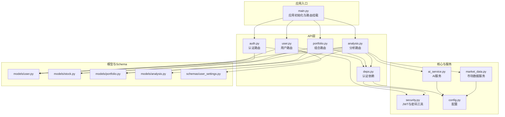
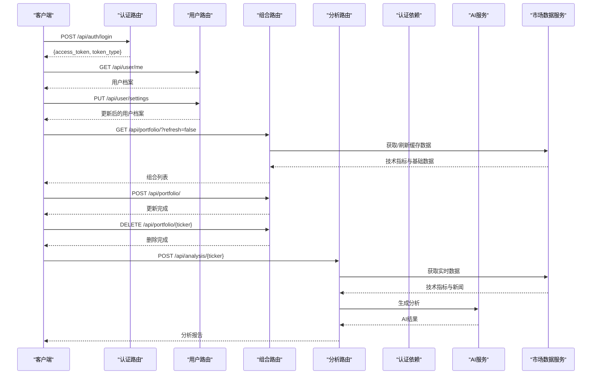

# API参考文档

<cite>
**本文档引用的文件**
- [backend/app/main.py](file://backend/app/main.py)
- [backend/app/api/auth.py](file://backend/app/api/auth.py)
- [backend/app/api/user.py](file://backend/app/api/user.py)
- [backend/app/api/portfolio.py](file://backend/app/api/portfolio.py)
- [backend/app/api/analysis.py](file://backend/app/api/analysis.py)
- [backend/app/api/deps.py](file://backend/app/api/deps.py)
- [backend/app/core/security.py](file://backend/app/core/security.py)
- [backend/app/core/config.py](file://backend/app/core/config.py)
- [backend/app/models/user.py](file://backend/app/models/user.py)
- [backend/app/models/stock.py](file://backend/app/models/stock.py)
- [backend/app/models/portfolio.py](file://backend/app/models/portfolio.py)
- [backend/app/models/analysis.py](file://backend/app/models/analysis.py)
- [backend/app/schemas/user_settings.py](file://backend/app/schemas/user_settings.py)
- [backend/app/services/ai_service.py](file://backend/app/services/ai_service.py)
- [backend/app/services/market_data.py](file://backend/app/services/market_data.py)
- [README.md](file://README.md)
</cite>

## 目录
1. [简介](#简介)
2. [项目结构](#项目结构)
3. [核心组件](#核心组件)
4. [架构总览](#架构总览)
5. [详细组件分析](#详细组件分析)
6. [依赖关系分析](#依赖关系分析)
7. [性能考虑](#性能考虑)
8. [故障排除指南](#故障排除指南)
9. [结论](#结论)
10. [附录](#附录)

## 简介
本文件为“AI智能投资顾问”项目的API参考文档，覆盖所有RESTful端点的HTTP方法、URL模式、请求/响应模型、认证方式、参数规范、错误码与异常处理策略、速率限制与配额管理、SDK使用示例与客户端集成指南、测试策略与质量保障措施、性能基准与最佳实践建议。系统采用FastAPI构建，支持JWT令牌认证，提供用户管理、组合管理、股票搜索与实时数据、AI分析等能力。

## 项目结构
后端以模块化方式组织，按功能域划分API路由：
- 认证模块：用户登录与注册
- 用户模块：个人信息与设置
- 组合模块：股票组合查询、新增、删除
- 分析模块：基于AI的个股分析
- 核心模块：安全、配置、数据库
- 服务模块：AI服务、市场数据服务
- 模型与Schema：数据库实体与请求/响应模型



图表来源
- [backend/app/main.py](file://backend/app/main.py#L24-L29)
- [backend/app/api/auth.py](file://backend/app/api/auth.py#L1-L88)
- [backend/app/api/user.py](file://backend/app/api/user.py#L1-L48)
- [backend/app/api/portfolio.py](file://backend/app/api/portfolio.py#L1-L297)
- [backend/app/api/analysis.py](file://backend/app/api/analysis.py#L1-L124)
- [backend/app/api/deps.py](file://backend/app/api/deps.py#L1-L44)
- [backend/app/core/security.py](file://backend/app/core/security.py#L1-L26)
- [backend/app/core/config.py](file://backend/app/core/config.py#L1-L24)
- [backend/app/models/user.py](file://backend/app/models/user.py#L1-L31)
- [backend/app/models/stock.py](file://backend/app/models/stock.py#L1-L85)
- [backend/app/models/portfolio.py](file://backend/app/models/portfolio.py#L1-L26)
- [backend/app/models/analysis.py](file://backend/app/models/analysis.py#L1-L25)
- [backend/app/schemas/user_settings.py](file://backend/app/schemas/user_settings.py#L1-L16)
- [backend/app/services/ai_service.py](file://backend/app/services/ai_service.py#L1-L112)
- [backend/app/services/market_data.py](file://backend/app/services/market_data.py#L1-L370)

章节来源
- [backend/app/main.py](file://backend/app/main.py#L1-L38)
- [README.md](file://README.md#L1-L50)

## 核心组件
- 应用入口与路由挂载：在应用启动时注册认证、用户、组合、分析四个模块的路由前缀与标签。
- 认证与授权：基于OAuth2密码流与JWT，通过依赖注入获取当前用户。
- 数据模型：用户、股票、市场数据缓存、组合、分析报告等。
- 服务层：AI服务负责调用Gemini模型生成分析；市场数据服务负责从外部源抓取并缓存技术指标与新闻。
- 配置与安全：密钥、算法、访问令牌有效期、代理等。

章节来源
- [backend/app/main.py](file://backend/app/main.py#L24-L29)
- [backend/app/api/deps.py](file://backend/app/api/deps.py#L13-L44)
- [backend/app/core/security.py](file://backend/app/core/security.py#L1-L26)
- [backend/app/core/config.py](file://backend/app/core/config.py#L1-L24)

## 架构总览
系统采用分层架构：
- 表现层：FastAPI路由与Pydantic模型
- 业务层：各模块的业务逻辑（组合管理、分析流程）
- 服务层：AI与市场数据服务
- 数据层：SQLAlchemy异步ORM与SQLite



图表来源
- [backend/app/api/auth.py](file://backend/app/api/auth.py#L24-L87)
- [backend/app/api/user.py](file://backend/app/api/user.py#L11-L47)
- [backend/app/api/portfolio.py](file://backend/app/api/portfolio.py#L143-L296)
- [backend/app/api/analysis.py](file://backend/app/api/analysis.py#L13-L123)
- [backend/app/api/deps.py](file://backend/app/api/deps.py#L17-L43)
- [backend/app/services/ai_service.py](file://backend/app/services/ai_service.py#L43-L111)
- [backend/app/services/market_data.py](file://backend/app/services/market_data.py#L14-L170)

## 详细组件分析

### 认证模块（/api/auth）
- 登录接口
  - 方法与路径：POST /api/auth/login
  - 认证方式：OAuth2密码流（用户名为邮箱，密码为明文）
  - 请求体：OAuth2PasswordRequestForm（username, password）
  - 成功响应：Token（access_token, token_type）
  - 错误：400（凭据错误）
- 注册接口
  - 方法与路径：POST /api/auth/register
  - 请求体：UserCreate（email, password）
  - 成功响应：Token（注册即自动登录）
  - 错误：400（邮箱已存在）

参数规范
- UserCreate
  - email：字符串，必填，邮箱格式
  - password：字符串，必填，最小长度约束由后端密码哈希策略决定
- OAuth2PasswordRequestForm
  - username：字符串，必填（邮箱）
  - password：字符串，必填

认证与权限
- 使用OAuth2密码流，令牌类型为bearer
- 令牌由HS256算法签名，有效期可在配置中设置

错误码与异常
- 400：登录凭据无效或注册邮箱重复
- 401：未携带有效令牌（由依赖注入抛出）

章节来源
- [backend/app/api/auth.py](file://backend/app/api/auth.py#L24-L87)
- [backend/app/core/security.py](file://backend/app/core/security.py#L11-L19)
- [backend/app/core/config.py](file://backend/app/core/config.py#L8-L11)

### 用户模块（/api/user）
- 获取当前用户信息
  - 方法与路径：GET /api/user/me
  - 成功响应：UserProfile（id, email, membership_tier, has_gemini_key, has_deepseek_key, preferred_data_source）
- 更新用户设置
  - 方法与路径：PUT /api/user/settings
  - 请求体：UserSettingsUpdate（可选字段：api_key_gemini, api_key_deepseek, preferred_data_source）
  - 成功响应：UserProfile
  - 错误：400（请求体校验失败）

参数规范
- UserProfile
  - id：字符串
  - email：字符串
  - membership_tier：枚举（FREE/PRO）
  - has_gemini_key：布尔
  - has_deepseek_key：布尔
  - preferred_data_source：字符串（枚举值：ALPHA_VANTAGE/YFINANCE）
- UserSettingsUpdate
  - api_key_gemini：字符串（可选）
  - api_key_deepseek：字符串（可选）
  - preferred_data_source：字符串（可选，枚举值之一）

章节来源
- [backend/app/api/user.py](file://backend/app/api/user.py#L11-L47)
- [backend/app/schemas/user_settings.py](file://backend/app/schemas/user_settings.py#L4-L16)
- [backend/app/models/user.py](file://backend/app/models/user.py#L7-L13)

### 组合模块（/api/portfolio）
- 搜索股票
  - 方法与路径：GET /api/portfolio/search
  - 查询参数：
    - query：字符串，可选，默认空
    - remote：布尔，可选，默认false
  - 成功响应：SearchResult数组（ticker, name）
  - 说明：本地搜索优先；当remote=true且未找到精确匹配且长度<=10时，尝试远程快速检查并写入缓存
- 获取组合
  - 方法与路径：GET /api/portfolio/
  - 查询参数：
    - refresh：布尔，可选，默认false
  - 成功响应：PortfolioItem数组（包含基础与技术指标字段）
  - 说明：支持刷新以更新缓存数据
- 新增组合项
  - 方法与路径：POST /api/portfolio/
  - 请求体：PortfolioCreate（ticker, quantity, avg_cost）
  - 成功响应：{"message": "Portfolio updated"}
  - 说明：若缓存缺失技术指标，后台异步拉取
- 删除组合项
  - 方法与路径：DELETE /api/portfolio/{ticker}
  - 成功响应：{"message": "Item deleted"}
  - 错误：404（未找到）

PortfolioItem字段（节选）
- 基础财务：sector, industry, market_cap, pe_ratio, forward_pe, eps, dividend_yield, beta, 52周最高/最低
- 技术指标：rsi_14, ma_20, ma_50, ma_200, macd_val, macd_signal, macd_hist, bb_upper, bb_middle, bb_lower, atr_14, k_line, d_line, j_line, volume_ma_20, volume_ratio, change_percent
- 其他：ticker, quantity, avg_cost, current_price, market_value, unrealized_pl, pl_percent, last_updated

参数规范
- PortfolioCreate
  - ticker：字符串，必填
  - quantity：数值，必填
  - avg_cost：数值，必填
- SearchResult
  - ticker：字符串
  - name：字符串

章节来源
- [backend/app/api/portfolio.py](file://backend/app/api/portfolio.py#L68-L140)
- [backend/app/api/portfolio.py](file://backend/app/api/portfolio.py#L143-L224)
- [backend/app/api/portfolio.py](file://backend/app/api/portfolio.py#L231-L271)
- [backend/app/api/portfolio.py](file://backend/app/api/portfolio.py#L281-L296)
- [backend/app/models/stock.py](file://backend/app/models/stock.py#L13-L67)

### 分析模块（/api/analysis）
- 股票分析
  - 方法与路径：POST /api/analysis/{ticker}
  - 路径参数：ticker（股票代码）
  - 成功响应：{"ticker": "...", "analysis": "...", "sentiment": "NEUTRAL"}
  - 业务流程：
    1) 若用户未配置Gemini Key，检查当日分析次数（免费用户限制3次/天），超限返回429
    2) 获取实时市场数据（价格、涨跌幅、技术指标）
    3) 获取相关新闻（最多5条）
    4) 获取用户持仓（用于个性化建议）
    5) 调用AI服务生成分析报告
  - 错误：429（免费用户配额超限）、404（用户不存在，依赖注入抛出）

配额与速率限制
- 免费用户：每日最多3次分析
- 外部API：yfinance在429时进行指数退避重试
- 缓存：1分钟内命中缓存，避免重复抓取

章节来源
- [backend/app/api/analysis.py](file://backend/app/api/analysis.py#L13-L123)
- [backend/app/models/analysis.py](file://backend/app/models/analysis.py#L12-L24)
- [backend/app/services/market_data.py](file://backend/app/services/market_data.py#L14-L170)

### 认证依赖与安全
- OAuth2密码流令牌端点：/api/auth/login
- 当前用户依赖：从JWT载荷解析用户ID，查询数据库获取用户对象
- 密码哈希与验证：bcrypt
- JWT签名算法：HS256
- 令牌有效期：配置项ACCESS_TOKEN_EXPIRE_MINUTES

章节来源
- [backend/app/api/deps.py](file://backend/app/api/deps.py#L13-L43)
- [backend/app/core/security.py](file://backend/app/core/security.py#L21-L25)
- [backend/app/core/config.py](file://backend/app/core/config.py#L8-L11)

## 依赖关系分析
- 路由到服务：分析路由依赖市场数据服务与AI服务；组合路由依赖市场数据缓存；用户与认证路由依赖数据库与安全模块。
- 数据模型：组合与股票、市场数据缓存之间存在外键关系；分析报告关联用户与股票。
- 配置：外部API密钥（Gemini、Alpha Vantage、代理）集中于配置模块。

```mermaid
classDiagram
class User {
+string id
+string email
+MembershipTier membership_tier
+string api_key_gemini
+string api_key_deepseek
+MarketDataSource preferred_data_source
}
class Stock {
+string ticker
+string name
+float market_cap
+float pe_ratio
+float beta
}
class MarketDataCache {
+string ticker
+float current_price
+float rsi_14
+float ma_20
+float bb_upper
+float volume_ratio
+MarketStatus market_status
}
class Portfolio {
+string id
+string user_id
+string ticker
+float quantity
+float avg_cost
}
class AnalysisReport {
+string id
+string user_id
+string ticker
+datetime created_at
}
User ||--o{ Portfolio : "拥有多个"
Stock ||--|| MarketDataCache : "一对一"
Stock ||--o{ Portfolio : "被持有"
User ||--o{ AnalysisReport : "产生报告"
```

图表来源
- [backend/app/models/user.py](file://backend/app/models/user.py#L15-L30)
- [backend/app/models/stock.py](file://backend/app/models/stock.py#L13-L67)
- [backend/app/models/portfolio.py](file://backend/app/models/portfolio.py#L7-L25)
- [backend/app/models/analysis.py](file://backend/app/models/analysis.py#L12-L24)

章节来源
- [backend/app/models/user.py](file://backend/app/models/user.py#L1-L31)
- [backend/app/models/stock.py](file://backend/app/models/stock.py#L1-L85)
- [backend/app/models/portfolio.py](file://backend/app/models/portfolio.py#L1-L26)
- [backend/app/models/analysis.py](file://backend/app/models/analysis.py#L1-L25)

## 性能考虑
- 缓存策略：市场数据缓存1分钟内命中，减少外部API调用；组合刷新时批量更新并延迟避免并发问题。
- 异步与并发：使用异步数据库会话与事件循环执行外部调用；后台任务异步拉取技术指标。
- 外部API退避：yfinance在429时进行指数退避与抖动，降低触发限流概率。
- 数据聚合：组合视图通过一次联表查询聚合缓存与基础数据，减少往返。
- 代理支持：可通过配置设置HTTP_PROXY，改善网络受限环境下的访问稳定性。

章节来源
- [backend/app/api/portfolio.py](file://backend/app/api/portfolio.py#L162-L174)
- [backend/app/services/market_data.py](file://backend/app/services/market_data.py#L22-L23)
- [backend/app/services/market_data.py](file://backend/app/services/market_data.py#L305-L316)
- [backend/app/api/portfolio.py](file://backend/app/api/portfolio.py#L268-L269)

## 故障排除指南
常见错误与处理
- 400（登录失败）：检查邮箱与密码是否正确；确认用户已存在。
- 400（注册失败）：检查邮箱是否已被占用。
- 401/403（认证失败）：确认携带有效的Bearer令牌；检查令牌是否过期。
- 404（用户不存在）：确认用户ID有效。
- 404（组合项不存在）：确认股票代码与用户绑定关系。
- 429（分析配额超限）：免费用户当日已达上限；建议在设置中添加个人Gemini Key以解除限制。
- 外部API错误（yfinance/Alpha Vantage）：检查代理配置与API密钥；观察日志中的退避提示。

章节来源
- [backend/app/api/auth.py](file://backend/app/api/auth.py#L38-L43)
- [backend/app/api/auth.py](file://backend/app/api/auth.py#L67-L71)
- [backend/app/api/deps.py](file://backend/app/api/deps.py#L28-L41)
- [backend/app/api/portfolio.py](file://backend/app/api/portfolio.py#L291-L292)
- [backend/app/api/analysis.py](file://backend/app/api/analysis.py#L46-L50)
- [backend/app/services/market_data.py](file://backend/app/services/market_data.py#L305-L316)

## 结论
本API围绕“用户—组合—市场数据—AI分析”的主链路设计，具备完善的认证授权、缓存与退避策略、配额管理与错误处理。通过清晰的模块划分与依赖注入，系统易于扩展与维护。建议在生产环境中启用更严格的CORS策略与HTTPS，同时为免费用户提供明确的升级路径与配额提示。

## 附录

### API端点一览与示例

- 认证
  - POST /api/auth/login
    - 请求：OAuth2PasswordRequestForm（username: 邮箱, password: 密码）
    - 成功：{"access_token": "...", "token_type": "bearer"}
    - 错误：400
  - POST /api/auth/register
    - 请求：{"email": "...", "password": "..."}
    - 成功：{"access_token": "...", "token_type": "bearer"}
    - 错误：400（邮箱已存在）

- 用户
  - GET /api/user/me
    - 成功：UserProfile
  - PUT /api/user/settings
    - 请求：{"api_key_gemini": "...", "api_key_deepseek": "...", "preferred_data_source": "ALPHA_VANTAGE|YFINANCE"}
    - 成功：UserProfile

- 组合
  - GET /api/portfolio/search?query=&remote=false
    - 成功：[{"ticker": "...", "name": "..."}]
  - GET /api/portfolio/?refresh=false
    - 成功：[PortfolioItem...]
  - POST /api/portfolio/
    - 请求：{"ticker": "...", "quantity": 数值, "avg_cost": 数值}
    - 成功：{"message": "Portfolio updated"}
  - DELETE /api/portfolio/{ticker}
    - 成功：{"message": "Item deleted"}

- 分析
  - POST /api/analysis/{ticker}
    - 成功：{"ticker": "...", "analysis": "...", "sentiment": "NEUTRAL"}
    - 错误：429（免费用户超限）、404（用户不存在）

章节来源
- [backend/app/api/auth.py](file://backend/app/api/auth.py#L24-L87)
- [backend/app/api/user.py](file://backend/app/api/user.py#L11-L47)
- [backend/app/api/portfolio.py](file://backend/app/api/portfolio.py#L68-L140)
- [backend/app/api/portfolio.py](file://backend/app/api/portfolio.py#L143-L296)
- [backend/app/api/analysis.py](file://backend/app/api/analysis.py#L13-L123)

### SDK使用示例与客户端集成指南
- 客户端集成步骤
  1) 登录获取access_token
  2) 在后续请求头中携带Authorization: Bearer {access_token}
  3) 调用用户设置更新接口配置首选数据源与API Key
  4) 使用组合接口管理持仓，必要时设置refresh=true强制刷新
  5) 调用分析接口获取AI建议
- 注意事项
  - 保持令牌有效期；过期需重新登录
  - 免费用户建议在设置中添加Gemini Key以解除每日配额限制
  - 网络受限时可配置HTTP_PROXY

章节来源
- [backend/app/api/deps.py](file://backend/app/api/deps.py#L13-L15)
- [backend/app/api/user.py](file://backend/app/api/user.py#L22-L47)
- [backend/app/api/analysis.py](file://backend/app/api/analysis.py#L27-L50)

### 测试策略与质量保证
- 单元测试：针对服务层（AI服务、市场数据服务）与路由逻辑编写单元测试，覆盖正常与异常分支。
- 集成测试：模拟外部API响应与数据库事务，验证端到端流程（登录→设置→组合→分析）。
- 性能测试：对组合刷新与分析接口进行压力测试，评估缓存命中率与外部API退避效果。
- 文档驱动：通过FastAPI自动生成交互式文档（/docs），便于手动验证与自动化测试对接。

### API版本控制与向后兼容性
- 版本策略：当前未显式实现版本号前缀；建议在路由前缀增加/v1以支持多版本并行。
- 向后兼容：新增字段采用可选策略（如UserSettingsUpdate），不破坏现有客户端；删除字段需提供迁移脚本与兼容层。

### 速率限制与配额管理
- 免费用户：每日最多3次分析
- 外部API：yfinance在429时自动退避重试
- 建议：为付费用户提供更高配额或独立配额池

章节来源
- [backend/app/api/analysis.py](file://backend/app/api/analysis.py#L27-L50)
- [backend/app/services/market_data.py](file://backend/app/services/market_data.py#L305-L316)