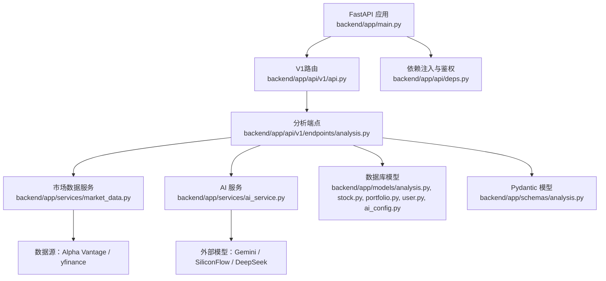
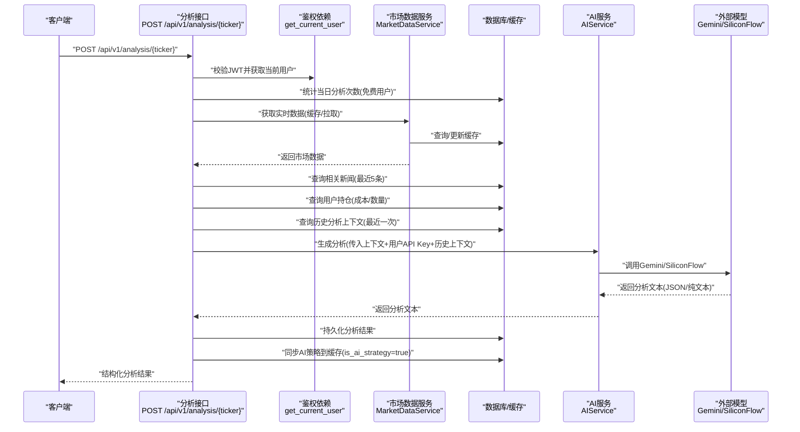
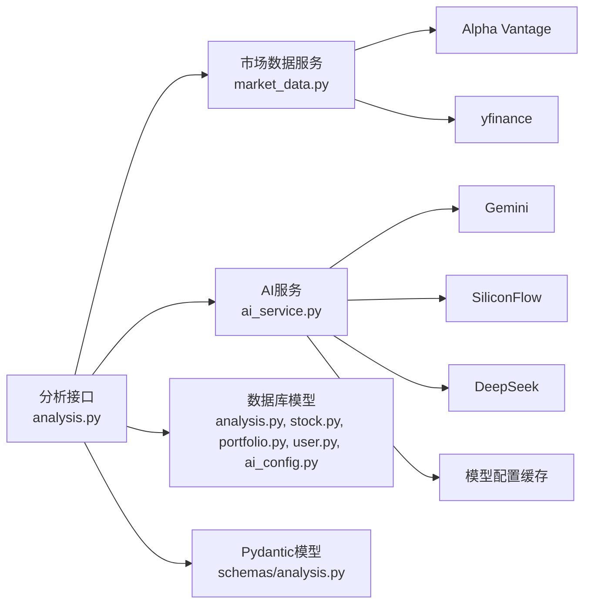
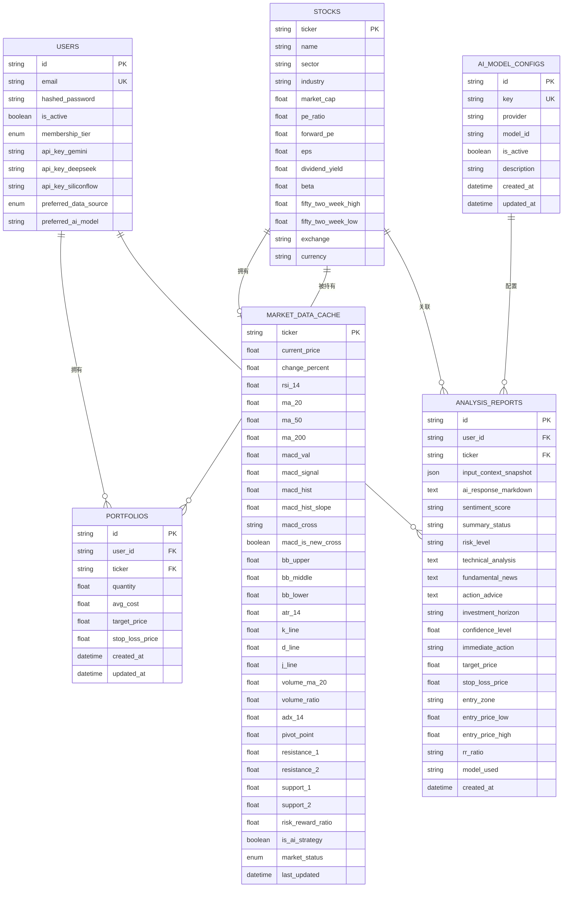

# 分析API

<cite>
**本文档引用的文件**
- [backend/app/main.py](file://backend/app/main.py)
- [backend/app/api/v1/api.py](file://backend/app/api/v1/api.py)
- [backend/app/api/v1/endpoints/analysis.py](file://backend/app/api/v1/endpoints/analysis.py)
- [backend/app/api/deps.py](file://backend/app/api/deps.py)
- [backend/app/services/ai_service.py](file://backend/app/services/ai_service.py)
- [backend/app/services/market_data.py](file://backend/app/services/market_data.py)
- [backend/app/models/analysis.py](file://backend/app/models/analysis.py)
- [backend/app/models/stock.py](file://backend/app/models/stock.py)
- [backend/app/models/portfolio.py](file://backend/app/models/portfolio.py)
- [backend/app/models/user.py](file://backend/app/models/user.py)
- [backend/app/models/ai_config.py](file://backend/app/models/ai_config.py)
- [backend/app/schemas/analysis.py](file://backend/app/schemas/analysis.py)
- [backend/app/core/config.py](file://backend/app/core/config.py)
- [backend/app/core/security.py](file://backend/app/core/security.py)
- [backend/app/application/analysis/analyze_stock.py](file://backend/app/application/analysis/analyze_stock.py)
- [backend/app/application/analysis/analyze_portfolio.py](file://backend/app/application/analysis/analyze_portfolio.py)
- [backend/app/application/analysis/query_analysis.py](file://backend/app/application/analysis/query_analysis.py)
- [backend/app/utils/ai_response_parser.py](file://backend/app/utils/ai_response_parser.py)
- [frontend/features/analysis/api.ts](file://frontend/features/analysis/api.ts)
- [frontend/features/dashboard/hooks/useDashboardPortfolioTabData.ts](file://frontend/features/dashboard/hooks/useDashboardPortfolioTabData.ts)
- [frontend/features/dashboard/components/PortfolioTabContainer.tsx](file://frontend/features/dashboard/components/PortfolioTabContainer.tsx)
- [backend/core/prompts.py](file://backend/core/prompts.py)
- [backend/migrations/versions/33f174f249a3_add_structured_analysis_fields.py](file://backend/migrations/versions/33f174f249a3_add_structured_analysis_fields.py)
- [backend/migrations/versions/731ab4ae1248_add_is_ai_strategy_to_marketdatacache.py](file://backend/migrations/versions/731ab4ae1248_add_is_ai_strategy_to_marketdatacache.py)
- [backend/migrations/versions/0675c6d039e6_create_ai_model_config_table.py](file://backend/migrations/versions/0675c6d039e6_create_ai_model_config_table.py)
- [backend/migrations/versions/f3fe98d72c73_add_horizon_and_confidence.py](file://backend/migrations/versions/f3fe98d72c73_add_horizon_and_confidence.py)
</cite>

## 更新摘要
**变更内容**
- 重构分析API架构，采用V1端点架构替代旧版本
- 保留并完善投资组合健康分析功能
- 增强AI输出解析和兜底机制
- 支持多AI模型（Gemini、SiliconFlow等）
- 改进结构化数据分析存储
- 优化并发处理和缓存策略
- **新增** 增强的历史分析上下文功能
- **新增** 数据库查询优化和模型配置缓存
- **新增** API端点改进和并行新闻获取
- **新增** AI策略标记和缓存同步机制

## 目录
1. [简介](#简介)
2. [项目结构](#项目结构)
3. [核心组件](#核心组件)
4. [架构总览](#架构总览)
5. [详细组件分析](#详细组件分析)
6. [依赖分析](#依赖分析)
7. [性能考虑](#性能考虑)
8. [故障排查指南](#故障排查指南)
9. [结论](#结论)
10. [附录](#附录)

## 简介
本文件为"AI分析服务"中"股票分析接口"的权威参考文档。内容覆盖：
- 接口定义与调用流程
- 请求参数与响应格式
- 数据来源与上下文拼装规则
- 分析延迟与并发限制策略
- 结果可信度与质量评估
- 多场景示例与最佳实践
- 与外部AI服务的集成与错误处理
- 性能优化与缓存策略

**更新** 新架构采用V1端点架构，提供增强的投资组合分析功能和更好的API组织结构。新增历史分析上下文功能、数据库查询优化和AI策略标记机制。

## 项目结构
后端采用FastAPI应用，路由按版本和功能模块划分。分析接口位于V1版本的分析端点；市场数据由MarketDataService提供，AI分析由AIService调用外部模型完成。

**图表来源**
- [backend/app/main.py:114-117](file://backend/app/main.py#L114-L117)
- [backend/app/api/v1/api.py:1-25](file://backend/app/api/v1/api.py#L1-L25)
- [backend/app/api/v1/endpoints/analysis.py:1-70](file://backend/app/api/v1/endpoints/analysis.py#L1-L70)
- [backend/app/services/market_data.py:1-266](file://backend/app/services/market_data.py#L1-L266)
- [backend/app/services/ai_service.py:1-390](file://backend/app/services/ai_service.py#L1-L390)
- [backend/app/models/analysis.py:1-42](file://backend/app/models/analysis.py#L1-L42)
- [backend/app/models/stock.py:1-105](file://backend/app/models/stock.py#L1-L105)
- [backend/app/models/portfolio.py:1-32](file://backend/app/models/portfolio.py#L1-L32)
- [backend/app/models/user.py:1-41](file://backend/app/models/user.py#L1-L41)
- [backend/app/models/ai_config.py:1-21](file://backend/app/models/ai_config.py#L1-L21)
- [backend/app/schemas/analysis.py:1-62](file://backend/app/schemas/analysis.py#L1-L62)

**章节来源**
- [backend/app/main.py:1-170](file://backend/app/main.py#L1-L170)
- [backend/app/api/v1/api.py:1-33](file://backend/app/api/v1/api.py#L1-L33)

## 核心组件
- **分析接口**：接收股票代码，组装市场数据、新闻、用户持仓上下文，调用AI生成分析报告并返回。
- **投资组合分析**：提供全量持仓健康分析，支持多模型选择和增强的RAG上下文。
- **市场数据服务**：优先从缓存读取，若过期或缺失则拉取Alpha Vantage或yfinance的数据，计算并缓存技术指标。
- **AI服务**：基于多种模型（Gemini、SiliconFlow、DeepSeek）生成中文分析报告，支持JSON输出模式与降级文本模式。
- **鉴权与限流**：通过JWT验证用户身份；免费用户按日限制分析次数；外部数据源存在速率限制与重试。
- **模型配置缓存**：AIService使用内存缓存机制，5分钟TTL，减少数据库查询频率。
- **AI策略标记**：MarketDataCache新增is_ai_strategy字段，防止AI生成的策略被通用算法覆盖。

**更新** 新架构提供了更强大的投资组合分析功能，支持多模型配置和增强的上下文注入，以及历史分析上下文的智能利用。

**章节来源**
- [backend/app/api/v1/endpoints/analysis.py:44-70](file://backend/app/api/v1/endpoints/analysis.py#L44-L70)
- [backend/app/services/market_data.py:13-170](file://backend/app/services/market_data.py#L13-L170)
- [backend/app/services/ai_service.py:23-390](file://backend/app/services/ai_service.py#L23-L390)
- [backend/app/api/deps.py:17-45](file://backend/app/api/deps.py#L17-L45)

## 架构总览
下图展示一次"触发AI分析"的端到端流程：

**图表来源**
- [backend/app/api/v1/endpoints/analysis.py:44-70](file://backend/app/api/v1/endpoints/analysis.py#L44-L70)
- [backend/app/api/deps.py:17-45](file://backend/app/api/deps.py#L17-L45)
- [backend/app/services/market_data.py:13-170](file://backend/app/services/market_data.py#L13-L170)
- [backend/app/services/ai_service.py:135-286](file://backend/app/services/ai_service.py#L135-L286)

## 详细组件分析

### 接口定义与调用流程
- **路径**：/api/v1/analysis/{ticker}
- **方法**：POST
- **认证**：需要有效JWT（OAuth2 Bearer）
- **功能**：为指定股票生成AI分析报告，返回结构化JSON格式的分析内容

**新增** 投资组合分析接口：
- **路径**：/api/v1/analysis/portfolio
- **方法**：POST
- **功能**：生成全量持仓健康分析报告

请求参数
- **路径参数**
  - ticker: 股票代码（必填）
- **查询参数**
  - force: 是否强制刷新缓存（可选，默认False）
- **请求体**（投资组合分析）
  - 无

响应字段
- **股票分析响应**：
  - ticker: 股票代码
  - analysis: AI生成的完整分析文本
  - sentiment_score: 情感评分（0-100）
  - summary_status: 简要状态描述
  - risk_level: 风险等级（低/中/高）
  - technical_analysis: 技术面分析
  - fundamental_news: 基础面/消息面解读
  - action_advice: 操作建议
  - investment_horizon: 投资期限
  - confidence_level: AI信心指数（0-100）
  - immediate_action: 即时行动建议
  - target_price: 目标价格
  - stop_loss_price: 止损价格
  - entry_zone: 建仓区间
  - entry_price_low: 建仓区间下限
  - entry_price_high: 建仓区间上限
  - rr_ratio: 盈亏比
  - is_cached: 是否来自缓存
  - model_used: 使用的模型
  - created_at: 创建时间

- **投资组合分析响应**：
  - health_score: 组合健康评分（0-100）
  - risk_level: 风险等级
  - summary: 简要总结
  - diversification_analysis: 分散度分析
  - strategic_advice: 战略建议
  - top_risks: 主要风险点
  - top_opportunities: 主要机会点
  - detailed_report: 详细报告
  - model_used: 使用的模型
  - created_at: 创建时间

**更新** 新架构提供了更丰富的响应字段，支持结构化数据分析和投资组合全景扫描，新增历史分析上下文的智能利用。

**章节来源**
- [backend/app/api/v1/endpoints/analysis.py:44-70](file://backend/app/api/v1/endpoints/analysis.py#L44-L70)
- [backend/app/schemas/analysis.py:5-62](file://backend/app/schemas/analysis.py#L5-L62)

### 请求上下文拼装规则
接口在生成分析前会收集以下上下文并传入AI服务：
- **市场数据**（来自缓存或实时拉取）
  - 当前价格、涨跌幅
  - 技术指标：RSI(14)、MA(20/50/200)、MACD、布林带、KDJ、ATR、成交量相关指标
  - 市场状态、ADX、枢轴位
- **新闻上下文**（最近5条）
  - 标题、发布媒体、发布时间
- **用户持仓上下文**（若持有该股票）
  - 平均成本、数量、未实现盈亏、盈亏百分比
- **基础面数据**（可选）
  - 行业/板块、市值、PE比率、Beta等
- **历史分析上下文**（可选）
  - 上次分析的时间、评分、建议等
  - **新增**：自动计算时间差并格式化显示

**新增** 投资组合分析的上下文：
- **持仓明细**：总市值、权重、盈亏状态
- **市场新闻背景**：宏观市场和重点持仓新闻
- **RAG增强**：并行获取宏观和重点持仓新闻

**章节来源**
- [backend/app/api/v1/endpoints/analysis.py:44-70](file://backend/app/api/v1/endpoints/analysis.py#L44-L70)
- [backend/app/services/market_data.py:13-170](file://backend/app/services/market_data.py#L13-L170)
- [backend/app/models/stock.py:14-105](file://backend/app/models/stock.py#L14-L105)
- [backend/app/models/portfolio.py:9-32](file://backend/app/models/portfolio.py#L9-L32)

### AI服务与外部模型集成
- **模型支持**：Gemini 1.5 Flash、SiliconFlow、DeepSeek、Qwen系列
- **配置管理**：支持动态模型配置缓存，5分钟TTL
- **输出格式**：严格返回JSON结构的中文分析文本
- **错误处理**：当JSON模式失败时自动降级为普通文本模式；异常时返回错误提示
- **多模型切换**：用户可配置首选AI模型，支持Gemini和SiliconFlow双API Key

**更新** 新架构支持多模型配置和动态模型ID解析，提供更好的模型管理和降级机制，新增模型配置缓存机制。

**章节来源**
- [backend/app/services/ai_service.py:23-390](file://backend/app/services/ai_service.py#L23-L390)
- [backend/app/core/config.py:13-18](file://backend/app/core/config.py#L13-L18)

### 数据来源与缓存策略
- **缓存命中**：若缓存存在且小于1分钟，则直接返回缓存
- **数据源优先级**：可配置首选数据源（Alpha Vantage或yfinance），若首选失败则回退至另一源
- **指标计算**：若yfinance可用，会计算RSI、ATR、MACD、布林带、KDJ、量能等指标
- **新闻同步**：仅yfinance支持新闻抓取，写入数据库避免重复
- **回退与模拟**：若所有数据源失败，使用历史缓存进行小幅波动回退，或生成半真实模拟数据
- **缓存同步**：AI生成的盈亏比自动同步到市场数据缓存

**更新** 新架构增强了缓存同步机制，AI生成的策略会锁定到缓存中，防止被通用算法覆盖，新增is_ai_strategy字段标记AI策略。

**章节来源**
- [backend/app/services/market_data.py:13-170](file://backend/app/services/market_data.py#L13-L170)
- [backend/app/api/v1/endpoints/analysis.py:541-577](file://backend/app/api/v1/endpoints/analysis.py#L541-L577)

### 鉴权与并发限制
- **鉴权**：通过OAuth2 Bearer令牌校验，解码JWT获取用户ID并加载用户信息
- **免费用户限制**：若用户未配置个人Gemini Key，则按日统计分析次数，超过3次返回429
- **外部API限流**：yfinance在429时采用指数退避重试；Alpha Vantage达到配额时抛出异常
- **并发**：分析接口内部串行执行各步骤；MarketDataService在刷新缓存时对SQLite顺序更新以避免并发问题
- **模型配置缓存**：AIService使用内存缓存减少数据库查询频率

**更新** 新架构增加了模型配置缓存机制，提高API响应速度，新增AI策略标记防止缓存被覆盖。

**章节来源**
- [backend/app/api/v1/endpoints/analysis.py:213-237](file://backend/app/api/v1/endpoints/analysis.py#L213-L237)
- [backend/app/api/deps.py:17-45](file://backend/app/api/deps.py#L17-L45)
- [backend/app/services/ai_service.py:24-77](file://backend/app/services/ai_service.py#L24-L77)

### 响应格式与JSON解析规则
- **返回结构**：包含ticker、analysis、sentiment_score等丰富字段
- **analysis字段**：为AI生成的完整文本，包含技术面分析、消息面解读、操作建议
- **结构化字段**：支持JSON模式输出，包含情感评分、风险等级、目标价格等
- **解析增强**：支持多种JSON格式解析，包括Markdown包装和异常格式
- **兜底机制**：解析失败时自动降级，确保不返回空响应
- **历史数据补全**：对历史报告自动补全缺失的数值字段

**更新** 新架构提供了更严格的JSON解析和更强的兜底机制，确保响应的完整性，新增历史数据自动补全功能。

**章节来源**
- [backend/app/api/v1/endpoints/analysis.py:445-484](file://backend/app/api/v1/endpoints/analysis.py#L445-L484)
- [backend/app/services/ai_service.py:135-286](file://backend/app/services/ai_service.py#L135-L286)

### 分析质量评估与可信度说明
- **可信度来源**：
  - 实时技术指标：由MarketDataService计算，具备一定时效性
  - 新闻上下文：来自yfinance新闻，有助于短期情绪与事件驱动分析
  - 个性化建议：结合用户持仓成本，提供更贴近其风险偏好的建议
  - **新增**：历史分析上下文：利用上次分析结果，保持策略一致性
- **局限性**：
  - AI输出为通用模型生成，不构成投资建议
  - 免费用户受每日次数限制，且可能使用服务端Key，存在隐私与稳定性考量
  - 外部数据源存在限流与不可用风险，必要时依赖缓存或模拟数据
  - 解析失败时的降级处理可能影响部分字段的准确性

**更新** 新架构通过历史上下文和多模型支持提升了分析质量，新增AI策略标记确保分析结果的稳定性。

**章节来源**
- [backend/app/services/ai_service.py:135-286](file://backend/app/services/ai_service.py#L135-L286)
- [backend/app/api/v1/endpoints/analysis.py:213-237](file://backend/app/api/v1/endpoints/analysis.py#L213-L237)

### 多场景示例与最佳实践
- **场景一**：首次分析某股票
  - 建议先添加到自选股/组合，以便接口能获取到持仓上下文
  - 若缓存缺失，接口会触发后台数据拉取，稍后再查可获得更丰富的技术指标
- **场景二**：免费用户额度耗尽
  - 在用户设置中绑定个人Gemini Key，即可解除每日限制
- **场景三**：外部数据源不稳定
  - 可切换用户偏好数据源（Alpha Vantage或yfinance），或等待缓存过期后重试
- **场景四**：投资组合分析
  - 使用投资组合分析接口获取全景扫描报告
  - 支持多模型选择和增强的新闻上下文
  - **新增**：并行获取宏观和重点持仓新闻，提升响应速度
- **最佳实践**：
  - 前端轮询时控制频率，避免频繁触发分析
  - 对analysis文本进行本地缓存，减少重复请求
  - 在用户设置中开启"首选数据源"，提升成功率
  - 利用历史上下文功能保持策略一致性
  - **新增**：利用AI策略标记确保分析结果的稳定性

**更新** 新增投资组合分析的最佳实践和多模型使用建议，以及AI策略标记的使用说明。

**章节来源**
- [backend/app/api/v1/endpoints/analysis.py:64-184](file://backend/app/api/v1/endpoints/analysis.py#L64-L184)
- [backend/app/models/user.py:22-41](file://backend/app/models/user.py#L22-L41)
- [backend/app/services/market_data.py:49-56](file://backend/app/services/market_data.py#L49-L56)

### 与外部AI服务的集成方式与错误处理
- **集成方式**：
  - AIService通过genai配置API Key并调用模型生成内容
  - 支持JSON模式输出，失败时自动降级为普通文本
  - 动态模型配置管理，支持多种供应商
- **错误处理**：
  - Gemini调用异常：记录日志并返回错误提示
  - 数据源异常：Alpha Vantage达到配额或网络错误时抛出异常；yfinance遇到429时指数退避重试
  - 降级策略：若无API Key，返回模拟分析提示
  - 模型配置失败：使用内置回退配置保证系统运行

**更新** 新架构提供了更完善的错误处理和模型配置管理机制，新增模型配置缓存和AI策略标记功能。

**章节来源**
- [backend/app/services/ai_service.py:78-133](file://backend/app/services/ai_service.py#L78-L133)
- [backend/app/services/market_data.py:303-318](file://backend/app/services/market_data.py#L303-L318)

## 依赖分析
- **组件耦合**
  - 分析接口依赖鉴权、市场数据服务、数据库模型与AI服务
  - 市场数据服务依赖数据库缓存与外部数据源
  - AI服务依赖配置与外部模型，支持多供应商
- **关键依赖链**
  - /api/v1/analysis → MarketDataService → 数据库缓存/外部数据源
  - /api/v1/analysis → AIService → Gemini/SiliconFlow/DeepSeek
  - /api/v1/analysis → 用户/组合模型 → 上下文拼装
  - /api/v1/analysis → Pydantic模型 → 响应格式化

**图表来源**
- [backend/app/api/v1/endpoints/analysis.py:1-70](file://backend/app/api/v1/endpoints/analysis.py#L1-L70)
- [backend/app/services/market_data.py:1-266](file://backend/app/services/market_data.py#L1-L266)
- [backend/app/services/ai_service.py:1-390](file://backend/app/services/ai_service.py#L1-L390)
- [backend/app/models/analysis.py:1-42](file://backend/app/models/analysis.py#L1-L42)
- [backend/app/models/stock.py:1-105](file://backend/app/models/stock.py#L1-L105)
- [backend/app/models/portfolio.py:1-32](file://backend/app/models/portfolio.py#L1-L32)
- [backend/app/models/user.py:1-41](file://backend/app/models/user.py#L1-L41)
- [backend/app/models/ai_config.py:1-21](file://backend/app/models/ai_config.py#L1-L21)
- [backend/app/schemas/analysis.py:1-62](file://backend/app/schemas/analysis.py#L1-L62)

## 性能考虑
- **缓存策略**
  - 市场数据缓存1分钟，减少重复拉取
  - 新闻按UUID去重插入，避免重复抓取
  - 模型配置缓存5分钟，减少数据库查询
- **数据源选择**
  - 可配置首选数据源，失败时自动回退
  - yfinance在刷新时增加小延迟，降低429概率
  - 投资组合分析使用并行新闻获取
- **前端优化**
  - 对analysis文本进行本地缓存，避免重复请求
  - 控制轮询频率，合并多次请求
  - 利用is_cached字段判断缓存有效性
- **后端优化**
  - SQLite顺序更新缓存，避免并发冲突
  - 异步执行外部API调用，提高吞吐
  - 模型配置缓存机制提升响应速度
  - **新增**：AI策略标记防止缓存被覆盖

**更新** 新架构引入了模型配置缓存和并行新闻获取等性能优化措施，新增AI策略标记确保分析结果的稳定性。

**章节来源**
- [backend/app/services/market_data.py:16-56](file://backend/app/services/market_data.py#L16-L56)
- [backend/app/services/ai_service.py:24-77](file://backend/app/services/ai_service.py#L24-L77)
- [backend/app/api/v1/endpoints/analysis.py:92-106](file://backend/app/api/v1/endpoints/analysis.py#L92-L106)

## 故障排查指南
- **429 Too Many Requests**
  - 现象：外部数据源限流或AI服务调用失败
  - 处理：等待指数退避后重试；切换数据源；或在用户设置中绑定个人API Key
- **无API Key**
  - 现象：analysis返回模拟提示或降级文本
  - 处理：在用户设置中填写Gemini Key；或升级会员
- **数据为空或不完整**
  - 现象：缓存缺失或数据源失败
  - 处理：等待缓存过期；检查代理配置；确认股票代码正确
- **鉴权失败**
  - 现象：403 Forbidden
  - 处理：重新登录获取有效JWT；检查密钥与算法配置
- **AI解析失败**
  - 现象：响应中某些字段为空
  - 处理：检查AI输出格式；确认模型配置正确；查看日志获取详细错误
- **模型配置错误**
  - 现象：AI服务调用失败
  - 处理：检查模型配置表；确认API Key有效；查看回退机制日志
- **AI策略被覆盖**
  - 现象：AI生成的策略被通用算法覆盖
  - 处理：检查is_ai_strategy标记；确认缓存同步正常

**更新** 新增了AI解析失败和模型配置错误的故障排查指南，以及AI策略被覆盖的故障排查。

**章节来源**
- [backend/app/api/v1/endpoints/analysis.py:213-237](file://backend/app/api/v1/endpoints/analysis.py#L213-L237)
- [backend/app/services/market_data.py:303-318](file://backend/app/services/market_data.py#L303-L318)
- [backend/app/services/ai_service.py:30-77](file://backend/app/services/ai_service.py#L30-L77)
- [backend/app/api/deps.py:28-45](file://backend/app/api/deps.py#L28-L45)

## 结论
本分析接口通过"上下文拼装 + 多数据源 + 多模型 + AI模型"的组合，为用户提供个性化的中文分析报告。新架构设计兼顾了实时性、稳定性与可扩展性：缓存与回退策略降低外部依赖风险；免费用户限制与个人Key绑定平衡成本与体验；多模型支持和增强的上下文注入提升了分析质量；前后端协同可进一步优化性能与用户体验。

**更新** 新架构通过V1端点架构、投资组合分析、多模型支持和增强的错误处理机制，显著提升了系统的功能性和可靠性。新增的历史分析上下文功能、数据库查询优化和AI策略标记机制进一步增强了系统的智能化水平和稳定性。

## 附录

### API定义与示例

**股票分析接口**
- **端点**
  - 方法：POST
  - 路径：/api/v1/analysis/{ticker}
  - 认证：Bearer JWT
- **查询参数**
  - force: 是否强制刷新缓存（可选，默认False）
- **请求体**
  - 无
- **响应体**
  - 字段：
    - ticker: 股票代码
    - analysis: 完整分析文本
    - sentiment_score: 情感评分（0-100）
    - summary_status: 简要状态描述
    - risk_level: 风险等级
    - technical_analysis: 技术面分析
    - fundamental_news: 基础面/消息面解读
    - action_advice: 操作建议
    - investment_horizon: 投资期限
    - confidence_level: AI信心指数（0-100）
    - immediate_action: 即时行动建议
    - target_price: 目标价格
    - stop_loss_price: 止损价格
    - entry_zone: 建仓区间
    - entry_price_low: 建仓区间下限
    - entry_price_high: 建仓区间上限
    - rr_ratio: 盈亏比
    - is_cached: 是否来自缓存
    - model_used: 使用的模型
    - created_at: 创建时间

**投资组合分析接口**
- **端点**
  - 方法：POST
  - 路径：/api/v1/analysis/portfolio
  - 认证：Bearer JWT
- **请求体**
  - 无
- **响应体**
  - 字段：
    - health_score: 组合健康评分（0-100）
    - risk_level: 风险等级
    - summary: 简要总结
    - diversification_analysis: 分散度分析
    - strategic_advice: 战略建议
    - top_risks: 主要风险点
    - top_opportunities: 主要机会点
    - detailed_report: 详细报告
    - model_used: 使用的模型
    - created_at: 创建时间

**更新** 新增了投资组合分析接口的完整定义和响应格式，以及历史分析上下文功能的说明。

**章节来源**
- [backend/app/api/v1/endpoints/analysis.py:44-70](file://backend/app/api/v1/endpoints/analysis.py#L44-L70)
- [backend/app/schemas/analysis.py:5-62](file://backend/app/schemas/analysis.py#L5-L62)

### 配置项与环境变量
- **数据库连接**：DATABASE_URL
- **Gemini API Key**：GEMINI_API_KEY
- **SiliconFlow API Key**：SILICONFLOW_API_KEY
- **DeepSeek API Key**：DEEPSEEK_API_KEY
- **加密Key**：ENCRYPTION_KEY
- **密钥算法**：ALGORITHM（默认HS256）
- **访问令牌有效期**：ACCESS_TOKEN_EXPIRE_MINUTES（默认24小时）
- **HTTP代理**：HTTP_PROXY
- **模型配置缓存TTL**：5分钟

**更新** 新增了多模型供应商的API Key配置和模型配置缓存TTL设置，以及AI策略标记的相关配置。

**章节来源**
- [backend/app/core/config.py:4-24](file://backend/app/core/config.py#L4-L24)
- [backend/app/core/security.py:31-39](file://backend/app/core/security.py#L31-L39)
- [backend/app/services/ai_service.py:24-29](file://backend/app/services/ai_service.py#L24-L29)

### 数据模型关系

**图表来源**
- [backend/app/models/user.py:22-41](file://backend/app/models/user.py#L22-L41)
- [backend/app/models/stock.py:14-105](file://backend/app/models/stock.py#L14-L105)
- [backend/app/models/portfolio.py:9-32](file://backend/app/models/portfolio.py#L9-L32)
- [backend/app/models/analysis.py:12-42](file://backend/app/models/analysis.py#L12-L42)
- [backend/app/models/ai_config.py:6-21](file://backend/app/models/ai_config.py#L6-L21)

**更新** 新增了多模型API Key字段、AI策略标记字段和AI模型配置表，以及相关的数据模型关系。