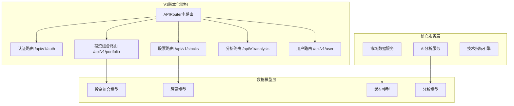
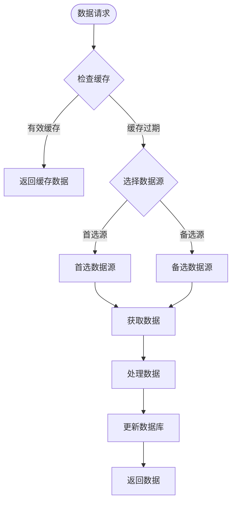
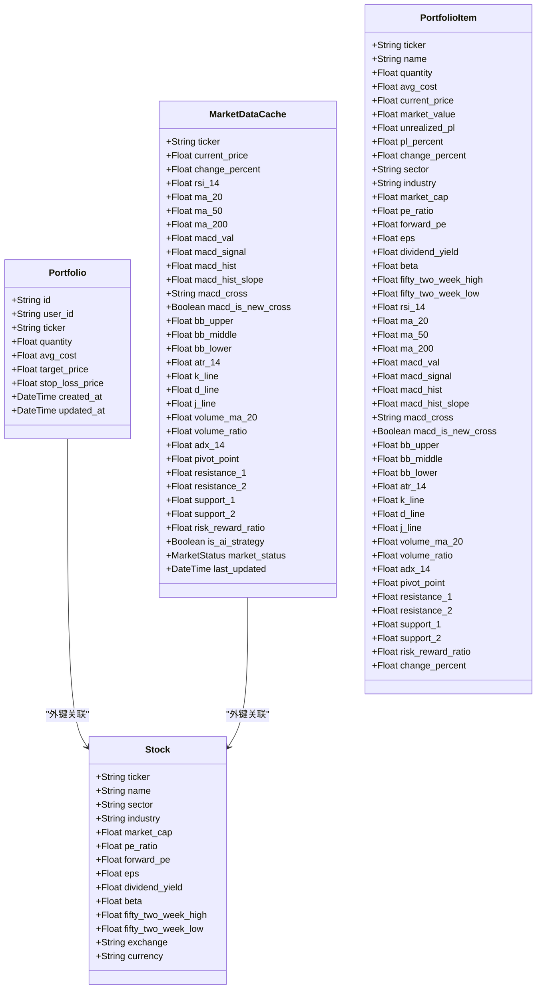
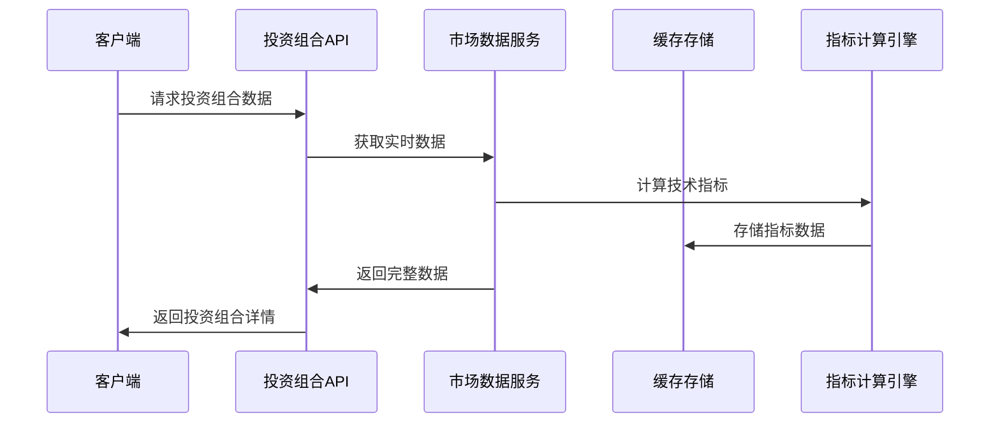
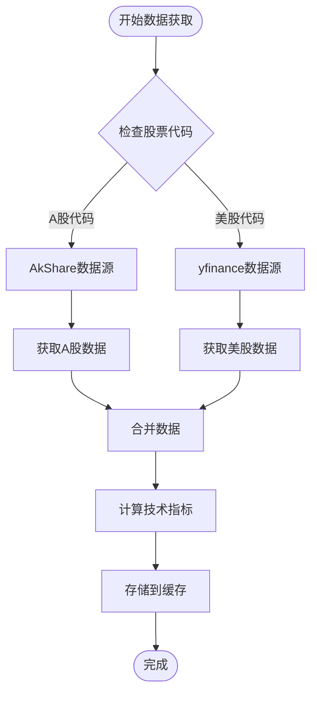
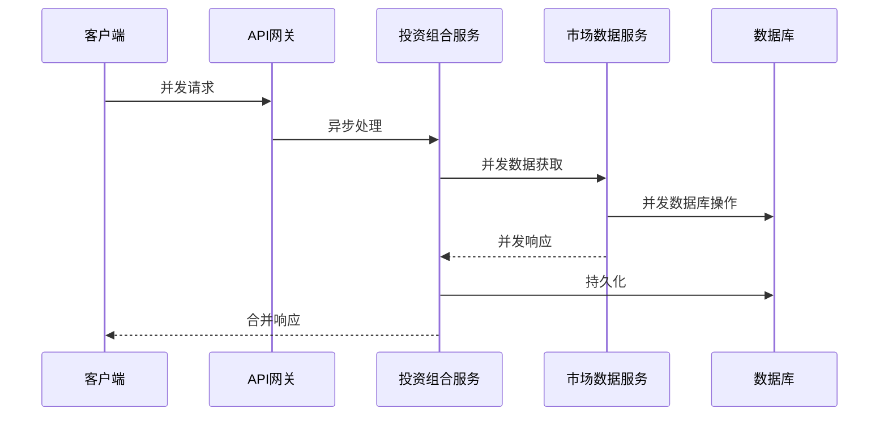
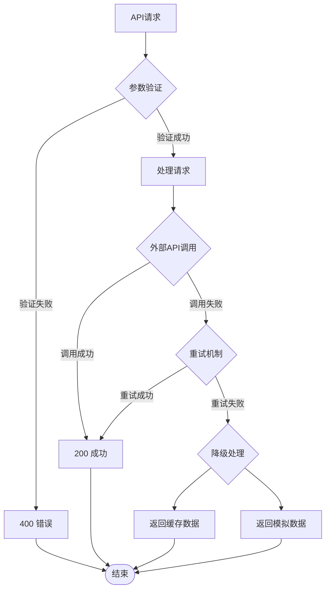

# 投资组合API

<cite>
**本文档引用的文件**
- [backend/app/api/v1/endpoints/portfolio.py](file://backend/app/api/v1/endpoints/portfolio.py)
- [backend/app/api/v1/endpoints/stock.py](file://backend/app/api/v1/endpoints/stock.py)
- [backend/app/api/v1/endpoints/analysis.py](file://backend/app/api/v1/endpoints/analysis.py)
- [backend/app/api/v1/endpoints/user.py](file://backend/app/api/v1/endpoints/user.py)
- [backend/app/api/v1/endpoints/auth.py](file://backend/app/api/v1/endpoints/auth.py)
- [backend/app/api/v1/api.py](file://backend/app/api/v1/api.py)
- [backend/app/schemas/portfolio.py](file://backend/app/schemas/portfolio.py)
- [backend/app/models/portfolio.py](file://backend/app/models/portfolio.py)
- [backend/app/models/stock.py](file://backend/app/models/stock.py)
- [backend/app/services/market_data.py](file://backend/app/services/market_data.py)
- [backend/app/api/deps.py](file://backend/app/api/deps.py)
- [backend/app/core/database.py](file://backend/app/core/database.py)
- [backend/app/core/config.py](file://backend/app/core/config.py)
- [backend/app/models/user.py](file://backend/app/models/user.py)
- [README.md](file://README.md)
</cite>

## 更新摘要
**所做更改**
- 完全重构投资组合API架构，从旧版单文件端点迁移到V1版本化架构
- 新增完整的V1端点模块化结构，包含分析、认证、用户、股票等子模块
- 扩展投资组合功能，新增汇总统计、新闻获取、手动刷新等高级特性
- 增强技术指标支持，包括ADX、枢轴点、支撑阻力位等高级分析指标
- 优化数据模型和Schema定义，提供更丰富的投资组合分析维度
- 改进市场数据服务，支持更灵活的数据源选择和缓存策略

## 目录
1. [简介](#简介)
2. [架构变更概览](#架构变更概览)
3. [V1端点架构](#v1端点架构)
4. [核心功能模块](#核心功能模块)
5. [数据模型与Schema](#数据模型与schema)
6. [技术指标体系](#技术指标体系)
7. [市场数据服务](#市场数据服务)
8. [API端点详解](#api端点详解)
9. [性能优化策略](#性能优化策略)
10. [错误处理与故障排除](#错误处理与故障排除)
11. [集成与扩展](#集成与扩展)
12. [结论](#结论)

## 简介

投资组合API是AI智能投资顾问平台的核心组件，基于全新的V1版本化架构构建。该API提供完整的投资组合管理功能，支持用户创建、读取、更新和删除投资组合项，集成了实时股价获取、缓存机制、技术指标计算和AI分析功能。

**重大架构变更**：从旧版本的单文件端点架构完全重构为模块化的V1版本化架构，提供更强大的投资组合分析和管理功能。

本API主要面向个人投资者，提供以下核心功能：
- 投资组合项的完整CRUD操作
- 实时股价获取和智能缓存管理
- 丰富的技术指标计算和分析
- 股票搜索和发现功能
- 收益计算和风险评估
- AI驱动的投资组合分析
- 新闻资讯集成
- 用户偏好设置管理

## 架构变更概览

系统从单一的portfolio.py文件演进为完整的V1版本化架构，采用模块化设计原则：



**图表来源**
- [backend/app/api/v1/api.py](file://backend/app/api/v1/api.py#L1-L25)
- [backend/app/api/v1/endpoints/portfolio.py](file://backend/app/api/v1/endpoints/portfolio.py#L1-L403)

**章节来源**
- [backend/app/api/v1/api.py](file://backend/app/api/v1/api.py#L1-L25)
- [README.md](file://README.md#L48-L49)

## V1端点架构

### 模块化设计原则

V1架构采用RESTful版本化设计，每个业务领域都有独立的路由模块：

```mermaid
graph LR
subgraph "认证模块"
AuthLogin[POST /api/v1/auth/login]
AuthRegister[POST /api/v1/auth/register]
end
subgraph "投资组合模块"
PortfolioSearch[GET /api/v1/portfolio/search]
PortfolioSummary[GET /api/v1/portfolio/summary]
PortfolioList[GET /api/v1/portfolio/]
PortfolioAdd[POST /api/v1/portfolio/]
PortfolioDelete[DELETE /api/v1/portfolio/{ticker}]
PortfolioRefresh[POST /api/v1/portfolio/{ticker}/refresh]
PortfolioNews[GET /api/v1/portfolio/{ticker}/news]
end
subgraph "股票模块"
StockHistory[GET /api/v1/stocks/{ticker}/history]
StockRefreshAll[POST /api/v1/stocks/refresh_all]
end
subgraph "分析模块"
AnalysisPortfolio[POST /api/v1/analysis/portfolio]
AnalysisStock[POST /api/v1/analysis/{ticker}]
AnalysisGet[GET /api/v1/analysis/{ticker}]
end
subgraph "用户模块"
UserMe[GET /api/v1/user/me]
UserPassword[PUT /api/v1/user/password]
UserSettings[PUT /api/v1/user/settings]
end
```

**图表来源**
- [backend/app/api/v1/endpoints/portfolio.py](file://backend/app/api/v1/endpoints/portfolio.py#L22-L403)
- [backend/app/api/v1/endpoints/stock.py](file://backend/app/api/v1/endpoints/stock.py#L46-L121)
- [backend/app/api/v1/endpoints/analysis.py](file://backend/app/api/v1/endpoints/analysis.py#L64-L664)
- [backend/app/api/v1/endpoints/user.py](file://backend/app/api/v1/endpoints/user.py#L12-L75)
- [backend/app/api/v1/endpoints/auth.py](file://backend/app/api/v1/endpoints/auth.py#L24-L88)

### 版本化路由管理

```python
# V1版本路由配置
api_router = APIRouter()

# 认证模块
api_router.include_router(auth.router, prefix="/auth", tags=["auth"])

# 投资组合模块
api_router.include_router(portfolio.router, prefix="/portfolio", tags=["portfolio"])

# 股票市场模块
api_router.include_router(stock.router, prefix="/stocks", tags=["stocks"])

# AI分析模块
api_router.include_router(analysis.router, prefix="/analysis", tags=["analysis"])

# 用户与设置模块
api_router.include_router(user.router, prefix="/user", tags=["user"])
```

**章节来源**
- [backend/app/api/v1/api.py](file://backend/app/api/v1/api.py#L1-L25)

## 核心功能模块

### 投资组合管理模块

#### 核心功能特性
- **智能搜索**：支持本地数据库搜索和远程API实时搜索
- **汇总统计**：提供投资组合总市值、未实现盈亏、行业分布等综合统计
- **实时刷新**：支持批量和单个股票的强制刷新机制
- **新闻集成**：获取相关股票的最新新闻资讯
- **后台任务**：异步数据获取，避免阻塞响应

#### 技术指标增强
新增丰富的技术分析指标支持：
- **趋势分析**：MA20、MA50、MA200、ADX14
- **动量指标**：RSI14、MACD系列、KDJ指标
- **波动率分析**：ATR14、布林带通道
- **支撑阻力**：枢轴点、R1/R2、S1/S2
- **风险收益**：盈亏比(Reward/Risk Ratio)

**章节来源**
- [backend/app/api/v1/endpoints/portfolio.py](file://backend/app/api/v1/endpoints/portfolio.py#L79-L157)
- [backend/app/models/stock.py](file://backend/app/models/stock.py#L44-L80)

### 市场数据服务

#### 多数据源支持


**图表来源**
- [backend/app/services/market_data.py](file://backend/app/services/market_data.py#L18-L58)

#### 缓存策略优化
- **智能缓存**：1分钟缓存周期，避免API限流
- **故障转移**：多数据源自动切换
- **模拟模式**：网络异常时的数据模拟
- **增量同步**：新闻数据的去重和增量更新

**章节来源**
- [backend/app/services/market_data.py](file://backend/app/services/market_data.py#L18-L266)

## 数据模型与Schema

### 投资组合数据模型



**图表来源**
- [backend/app/models/portfolio.py](file://backend/app/models/portfolio.py#L9-L32)
- [backend/app/models/stock.py](file://backend/app/models/stock.py#L15-L105)
- [backend/app/schemas/portfolio.py](file://backend/app/schemas/portfolio.py#L18-L71)

### Schema定义优化

#### PortfolioItem增强Schema
新增全面的投资组合分析维度：
- **基本面指标**：Sector、Industry、MarketCap、PE、EPS等
- **技术指标**：RSI、MACD、布林带、ATR等
- **高级分析**：ADX趋势强度、枢轴点支撑阻力位
- **风险收益**：盈亏比、波动率分析

**章节来源**
- [backend/app/schemas/portfolio.py](file://backend/app/schemas/portfolio.py#L18-L71)
- [backend/app/models/stock.py](file://backend/app/models/stock.py#L44-L80)

## 技术指标体系

### 指标分类与应用

#### 趋势分析指标
- **移动平均线**：MA20、MA50、MA200用于趋势判断
- **ADX指标**：14日趋势强度分析，判断趋势强弱
- **MACD系列**：包括MACD值、信号线、柱状图和斜率分析

#### 动量与超买超卖指标
- **RSI指标**：14日相对强弱指数，判断超买超卖状态
- **KDJ指标**：随机指标，结合超买超卖分析
- **布林带**：价格通道分析，结合波动率判断

#### 风险管理指标
- **ATR指标**：平均真实波幅，衡量价格波动性
- **支撑阻力位**：枢轴点计算的支撑和阻力位置
- **盈亏比**：风险收益比率，指导投资决策

### 指标计算与存储



**图表来源**
- [backend/app/services/market_data.py](file://backend/app/services/market_data.py#L118-L235)

**章节来源**
- [backend/app/services/market_data.py](file://backend/app/services/market_data.py#L166-L208)
- [backend/app/models/stock.py](file://backend/app/models/stock.py#L44-L80)

## 市场数据服务

### 数据获取策略

#### 多源数据获取


**图表来源**
- [backend/app/services/market_data.py](file://backend/app/services/market_data.py#L60-L115)

#### 缓存管理策略
- **智能缓存**：1分钟缓存周期，平衡实时性和API限制
- **故障转移**：多数据源自动切换，确保数据可用性
- **增量更新**：新闻数据去重，避免重复存储
- **模拟模式**：网络异常时的降级处理

**章节来源**
- [backend/app/services/market_data.py](file://backend/app/services/market_data.py#L18-L58)
- [backend/app/services/market_data.py](file://backend/app/services/market_data.py#L237-L266)

## API端点详解

### 投资组合核心端点

#### 搜索股票接口
**端点**：`GET /api/v1/portfolio/search`
**功能**：支持本地数据库搜索和远程API实时搜索
**参数**：
- `query`：搜索关键词（可选）
- `remote`：是否启用远程搜索（布尔值，默认false）

**实现特性**：
- 本地模糊匹配搜索
- 远程搜索回退机制
- 自动创建股票记录和缓存条目

#### 投资组合汇总接口
**端点**：`GET /api/v1/portfolio/summary`
**功能**：获取投资组合的综合统计信息
**返回字段**：
- 总市值、总未实现盈亏、总盈亏百分比
- 当日盈亏变化、行业分布权重
- 详细持仓列表和风险指标

#### 手动刷新接口
**端点**：`POST /api/v1/portfolio/{ticker}/refresh`
**功能**：针对单个股票进行强制刷新
**参数**：
- `ticker`：股票代码（路径参数）
**响应**：包含最新价格、涨跌幅和更新时间

#### 新闻获取接口
**端点**：`GET /api/v1/portfolio/{ticker}/news`
**功能**：获取指定股票的最新新闻资讯
**参数**：
- `ticker`：股票代码（路径参数）
**响应**：最多20条最新新闻，包含标题、发布者、发布时间等

**章节来源**
- [backend/app/api/v1/endpoints/portfolio.py](file://backend/app/api/v1/endpoints/portfolio.py#L22-L75)
- [backend/app/api/v1/endpoints/portfolio.py](file://backend/app/api/v1/endpoints/portfolio.py#L79-L157)
- [backend/app/api/v1/endpoints/portfolio.py](file://backend/app/api/v1/endpoints/portfolio.py#L346-L403)

### 股票数据端点

#### 历史数据接口
**端点**：`GET /api/v1/stocks/{ticker}/history`
**功能**：获取股票历史数据用于K线图展示
**参数**：
- `ticker`：股票代码（路径参数）
- `period`：数据期间（默认1年）
- `interval`：数据间隔（默认1天）

#### 批量刷新接口
**端点**：`POST /api/v1/stocks/refresh_all`
**功能**：强制刷新当前用户所有持仓股票数据
**实现特性**：
- 并发处理，限制最大并发数
- 错误处理和统计信息
- 支持进度跟踪和失败重试

**章节来源**
- [backend/app/api/v1/endpoints/stock.py](file://backend/app/api/v1/endpoints/stock.py#L46-L75)
- [backend/app/api/v1/endpoints/stock.py](file://backend/app/api/v1/endpoints/stock.py#L76-L121)

### AI分析端点

#### 投资组合分析
**端点**：`POST /api/v1/analysis/portfolio`
**功能**：基于AI的全量持仓健康分析
**实现特性**：
- 聚合投资组合数据和市场新闻
- AI模型生成健康评分和战略建议
- 支持多种AI模型选择

#### 股票深度分析
**端点**：`POST /api/v1/analysis/{ticker}`
**功能**：单支股票的AI深度分析
**参数**：
- `ticker`：股票代码（路径参数）
- `force`：是否强制刷新数据（布尔值，默认false）

**章节来源**
- [backend/app/api/v1/endpoints/analysis.py](file://backend/app/api/v1/endpoints/analysis.py#L64-L184)
- [backend/app/api/v1/endpoints/analysis.py](file://backend/app/api/v1/endpoints/analysis.py#L198-L664)

## 性能优化策略

### 并发处理优化

#### 异步并发架构


**图表来源**
- [backend/app/api/v1/endpoints/portfolio.py](file://backend/app/api/v1/endpoints/portfolio.py#L187-L200)

### 缓存策略优化

#### 智能缓存管理
- **1分钟缓存周期**：平衡实时性和API限制
- **失效检测**：基于最后更新时间的缓存失效
- **预热机制**：启动时预加载常用股票数据
- **内存缓存**：热点数据的内存缓存加速

### 数据库优化

#### SQLite连接池优化
```python
# SQLite稳定性优化配置
engine = create_async_engine(
    settings.DATABASE_URL,
    echo=False,
    pool_pre_ping=True,          # 连接有效性验证
    pool_size=5,                 # 最大连接数
    max_overflow=0,              # 不允许溢出连接
    pool_recycle=300,            # 连接回收时间
    connect_args={
        "check_same_thread": False,
        "timeout": 30,           # 等待锁释放时间
    }
)
```

**章节来源**
- [backend/app/core/database.py](file://backend/app/core/database.py#L11-L22)
- [backend/app/api/v1/endpoints/portfolio.py](file://backend/app/api/v1/endpoints/portfolio.py#L187-L200)

## 错误处理与故障排除

### 错误处理策略

#### 统一错误响应


**图表来源**
- [backend/app/services/market_data.py](file://backend/app/services/market_data.py#L237-L266)

### 常见错误场景

#### 401 未授权
**原因**：JWT令牌无效或过期
**解决方案**：重新登录获取新令牌

#### 404 资源不存在
**原因**：投资组合项或股票代码不存在
**解决方案**：检查输入参数和数据同步状态

#### 429 请求过多
**原因**：API调用频率超过限制
**解决方案**：增加请求间隔，使用缓存数据

#### 500 服务器内部错误
**原因**：数据库连接异常或数据处理错误
**解决方案**：检查数据库连接和日志信息

**章节来源**
- [backend/app/services/market_data.py](file://backend/app/services/market_data.py#L237-L266)

## 集成与扩展

### 数据源集成

#### 多数据源支持
- **yfinance**：美股数据获取
- **AkShare**：A股数据获取
- **Alpha Vantage**：全球市场数据
- **Tavily**：AI新闻搜索

#### 数据源选择策略
```python
# 智能数据源选择
if re.match(r'^\d{6}$', ticker):
    # 6位数字通常是A股代码
    source = "AKSHARE"
else:
    # 其他情况使用yfinance
    source = "YFINANCE"
```

**章节来源**
- [backend/app/api/v1/endpoints/portfolio.py](file://backend/app/api/v1/endpoints/portfolio.py#L309-L323)

### AI分析集成

#### 多模型支持
- **Gemini**：Google AI模型
- **SiliconFlow**：国产AI模型
- **Qwen系列**：通义千问系列模型

#### 分析能力扩展
- **投资组合健康分析**
- **个股深度分析**
- **市场新闻整合**
- **个性化建议生成**

### 用户偏好管理

#### 设置选项
- **数据源偏好**：用户偏好的市场数据源
- **AI模型选择**：用户偏好的AI分析模型
- **API密钥管理**：第三方服务API密钥
- **会员等级**：不同级别的功能权限

**章节来源**
- [backend/app/api/v1/endpoints/user.py](file://backend/app/api/v1/endpoints/user.py#L41-L75)

## 结论

V1版本的投资组合API架构代表了系统架构的重大升级，提供了更加完善和强大的投资组合管理功能：

### 主要改进

#### 架构层面
- **模块化设计**：清晰的功能分区和职责分离
- **版本化管理**：支持API向后兼容性
- **异步处理**：提升系统响应性能
- **缓存优化**：智能缓存策略提升用户体验

#### 功能层面
- **增强分析**：丰富的技术指标和AI分析能力
- **实时数据**：多数据源支持和智能刷新机制
- **新闻集成**：市场资讯的实时获取和分析
- **风险控制**：完善的风控指标和预警机制

#### 开发体验
- **清晰的API设计**：RESTful风格和一致的命名规范
- **完善的文档**：Swagger UI自动生成API文档
- **灵活的扩展**：易于添加新的数据源和分析功能
- **健壮的错误处理**：全面的错误处理和故障恢复机制

### 未来发展方向

1. **AI能力增强**：集成更多AI模型和分析算法
2. **移动端支持**：开发移动端应用和API
3. **社交功能**：添加投资组合分享和社区功能
4. **自动化交易**：集成自动化交易功能
5. **多语言支持**：国际化和本地化支持

该V1架构为构建专业级投资组合管理系统奠定了坚实基础，通过持续的优化和扩展，能够满足不断增长的投资需求和市场变化。