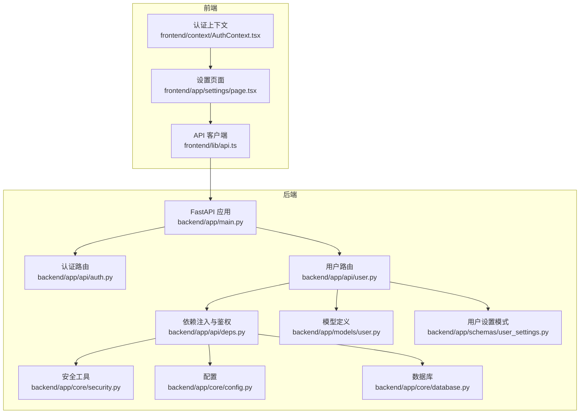
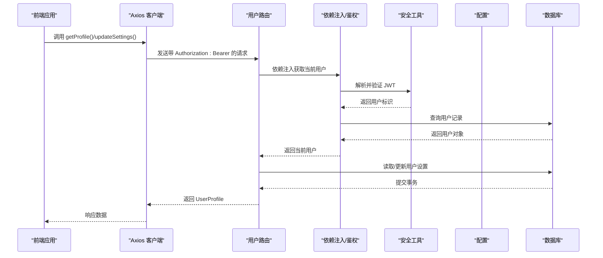
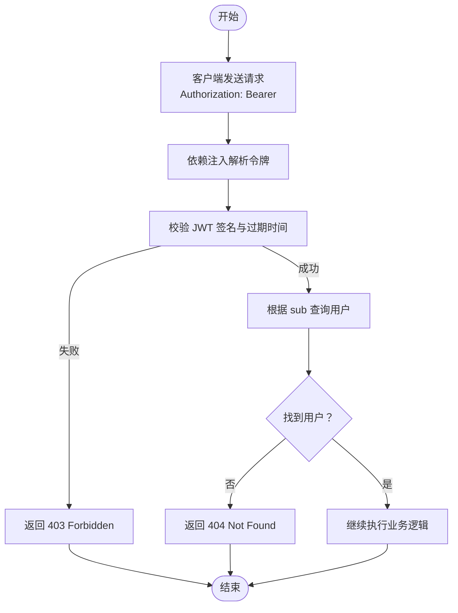
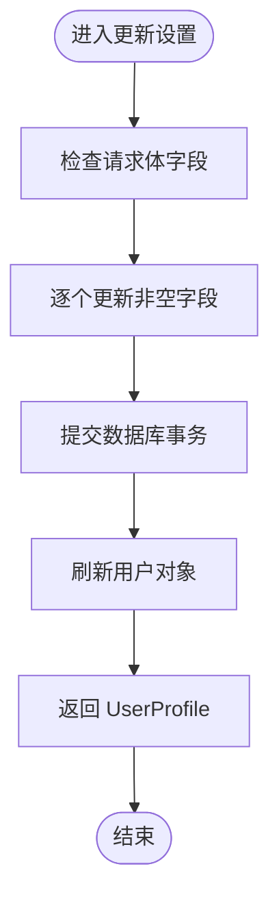
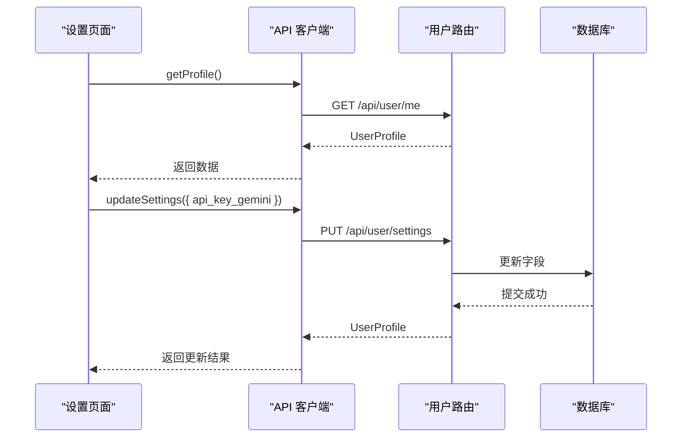
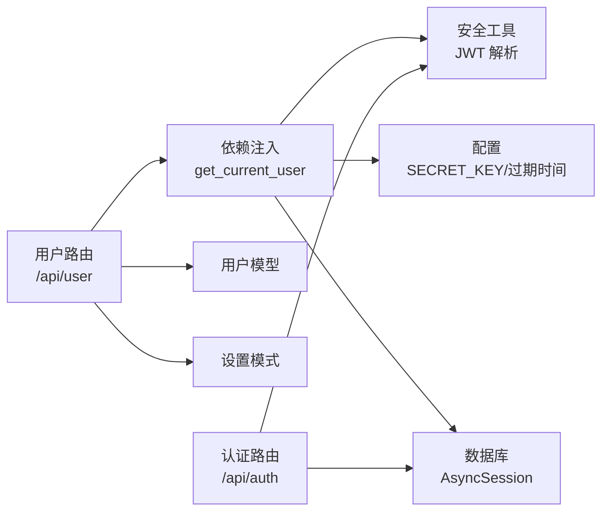

# 用户API

<cite>
**本文引用的文件**
- [backend/app/main.py](file://backend/app/main.py)
- [backend/app/api/user.py](file://backend/app/api/user.py)
- [backend/app/api/auth.py](file://backend/app/api/auth.py)
- [backend/app/api/deps.py](file://backend/app/api/deps.py)
- [backend/app/schemas/user_settings.py](file://backend/app/schemas/user_settings.py)
- [backend/app/models/user.py](file://backend/app/models/user.py)
- [backend/app/core/security.py](file://backend/app/core/security.py)
- [backend/app/core/config.py](file://backend/app/core/config.py)
- [backend/app/core/database.py](file://backend/app/core/database.py)
- [frontend/lib/api.ts](file://frontend/lib/api.ts)
- [frontend/app/settings/page.tsx](file://frontend/app/settings/page.tsx)
- [frontend/context/AuthContext.tsx](file://frontend/context/AuthContext.tsx)
- [README.md](file://README.md)
</cite>

## 目录
1. [简介](#简介)
2. [项目结构](#项目结构)
3. [核心组件](#核心组件)
4. [架构总览](#架构总览)
5. [详细组件分析](#详细组件分析)
6. [依赖关系分析](#依赖关系分析)
7. [性能考虑](#性能考虑)
8. [故障排除指南](#故障排除指南)
9. [结论](#结论)
10. [附录](#附录)

## 简介
本文件为“用户管理API端点”的详细参考文档，覆盖用户设置相关接口的完整规范，包括：
- 获取当前用户配置（个人资料与设置概览）
- 更新用户设置（API密钥与数据源偏好）

内容涵盖：
- 请求与响应的数据结构定义
- 权限控制与身份验证要求
- 错误处理策略
- 前端集成示例与最佳实践
- 常见问题与解决方案

## 项目结构
后端采用 FastAPI 构建，路由按功能模块划分；前端使用 Next.js，并通过 Axios 封装统一的 API 客户端。用户相关接口位于后端的用户模块，认证与授权由依赖注入的 OAuth2 密码流与 JWT 实现。

图表来源
- [backend/app/main.py](file://backend/app/main.py#L24-L29)
- [backend/app/api/user.py](file://backend/app/api/user.py#L1-L48)
- [backend/app/api/auth.py](file://backend/app/api/auth.py#L1-L88)
- [backend/app/api/deps.py](file://backend/app/api/deps.py#L13-L44)
- [backend/app/core/security.py](file://backend/app/core/security.py#L1-L26)
- [backend/app/core/config.py](file://backend/app/core/config.py#L1-L24)
- [backend/app/core/database.py](file://backend/app/core/database.py#L1-L24)
- [backend/app/models/user.py](file://backend/app/models/user.py#L1-L31)
- [backend/app/schemas/user_settings.py](file://backend/app/schemas/user_settings.py#L1-L16)
- [frontend/lib/api.ts](file://frontend/lib/api.ts#L1-L130)
- [frontend/app/settings/page.tsx](file://frontend/app/settings/page.tsx#L1-L173)
- [frontend/context/AuthContext.tsx](file://frontend/context/AuthContext.tsx#L1-L60)

章节来源
- [backend/app/main.py](file://backend/app/main.py#L24-L29)
- [README.md](file://README.md#L45-L50)

## 核心组件
- 用户路由：提供“获取当前用户信息”和“更新用户设置”的端点。
- 认证与依赖：通过 OAuth2 密码流与 JWT 进行身份验证，依赖注入获取当前用户。
- 数据模型：用户实体包含会员等级、API 密钥与数据源偏好等字段。
- 前端 API 客户端：封装基础 URL、拦截器注入 Bearer Token，并导出 getProfile 与 updateSettings 方法。

章节来源
- [backend/app/api/user.py](file://backend/app/api/user.py#L11-L47)
- [backend/app/api/deps.py](file://backend/app/api/deps.py#L13-L44)
- [backend/app/models/user.py](file://backend/app/models/user.py#L15-L31)
- [frontend/lib/api.ts](file://frontend/lib/api.ts#L104-L127)

## 架构总览
用户设置相关流程如下：
- 前端在请求头中携带 Bearer Token
- 后端通过依赖注入解析并验证 JWT，获取当前用户
- 读取用户信息或更新用户设置（仅允许更新部分字段）
- 返回标准化的用户资料模型

图表来源
- [frontend/lib/api.ts](file://frontend/lib/api.ts#L10-L18)
- [backend/app/api/user.py](file://backend/app/api/user.py#L11-L47)
- [backend/app/api/deps.py](file://backend/app/api/deps.py#L17-L43)
- [backend/app/core/security.py](file://backend/app/core/security.py#L11-L19)
- [backend/app/core/config.py](file://backend/app/core/config.py#L8-L11)
- [backend/app/core/database.py](file://backend/app/core/database.py#L21-L23)

## 详细组件分析

### 接口总览
- 获取当前用户信息
  - 方法：GET
  - 路径：/api/user/me
  - 认证：需要 Bearer Token
  - 响应：UserProfile
- 更新用户设置
  - 方法：PUT
  - 路径：/api/user/settings
  - 认证：需要 Bearer Token
  - 请求体：UserSettingsUpdate
  - 响应：UserProfile

章节来源
- [backend/app/api/user.py](file://backend/app/api/user.py#L11-L47)
- [backend/app/main.py](file://backend/app/main.py#L26-L29)

### 数据模型与字段定义

#### UserProfile（响应模型）
- 字段
  - id: 字符串（用户唯一标识）
  - email: 字符串（用户邮箱）
  - membership_tier: 字符串（枚举值：FREE/PRO）
  - has_gemini_key: 布尔值（是否配置了 Gemini API Key）
  - has_deepseek_key: 布尔值（是否配置了 DeepSeek API Key）
  - preferred_data_source: 字符串（枚举值：ALPHA_VANTAGE/YFINANCE）

章节来源
- [backend/app/schemas/user_settings.py](file://backend/app/schemas/user_settings.py#L9-L16)
- [backend/app/models/user.py](file://backend/app/models/user.py#L7-L14)

#### UserSettingsUpdate（请求模型）
- 字段
  - api_key_gemini: 可选字符串（Gemini API Key）
  - api_key_deepseek: 可选字符串（DeepSeek API Key）
  - preferred_data_source: 可选字符串（数据源偏好：ALPHA_VANTAGE 或 YFINANCE）

章节来源
- [backend/app/schemas/user_settings.py](file://backend/app/schemas/user_settings.py#L4-L7)
- [backend/app/models/user.py](file://backend/app/models/user.py#L11-L13)

#### 用户模型（数据库映射）
- 关键字段
  - id: 主键
  - email: 唯一索引
  - hashed_password: 密码哈希
  - is_active: 是否激活
  - membership_tier: 会员等级（枚举）
  - api_key_gemini: 可选字符串（存储位置：数据库列）
  - api_key_deepseek: 可选字符串（存储位置：数据库列）
  - preferred_data_source: 数据源偏好（枚举）
  - created_at/last_login: 时间戳

章节来源
- [backend/app/models/user.py](file://backend/app/models/user.py#L15-L31)

### 权限控制与身份验证
- 认证方式：OAuth2 密码流 + JWT
- 令牌来源：POST /api/auth/login
- 令牌类型：Bearer
- 令牌有效期：配置项 ACCESS_TOKEN_EXPIRE_MINUTES（默认约 24 小时）
- 依赖注入：OAuth2PasswordBearer 指向 /api/auth/login
- 当前用户解析：从 JWT 中提取 sub（用户 ID），查询数据库获取用户对象

图表来源
- [backend/app/api/deps.py](file://backend/app/api/deps.py#L17-L43)
- [backend/app/core/security.py](file://backend/app/core/security.py#L11-L19)
- [backend/app/core/config.py](file://backend/app/core/config.py#L8-L11)

章节来源
- [backend/app/api/auth.py](file://backend/app/api/auth.py#L24-L50)
- [backend/app/api/deps.py](file://backend/app/api/deps.py#L13-L43)
- [backend/app/core/security.py](file://backend/app/core/security.py#L1-L26)
- [backend/app/core/config.py](file://backend/app/core/config.py#L8-L11)

### 获取当前用户信息（GET /api/user/me）
- 功能：返回当前用户的基本信息与设置概览
- 响应字段：UserProfile
- 特性：仅返回公开信息，不包含敏感字段

章节来源
- [backend/app/api/user.py](file://backend/app/api/user.py#L11-L20)
- [backend/app/schemas/user_settings.py](file://backend/app/schemas/user_settings.py#L9-L16)

### 更新用户设置（PUT /api/user/settings）
- 功能：更新用户设置（可选择性更新多个字段）
- 请求体：UserSettingsUpdate
- 支持的更新字段：
  - api_key_gemini：更新 Gemini API Key
  - api_key_deepseek：更新 DeepSeek API Key
  - preferred_data_source：更新数据源偏好
- 响应：UserProfile（更新后的完整信息）

图表来源
- [backend/app/api/user.py](file://backend/app/api/user.py#L22-L47)
- [backend/app/schemas/user_settings.py](file://backend/app/schemas/user_settings.py#L4-L7)

章节来源
- [backend/app/api/user.py](file://backend/app/api/user.py#L22-L47)

### 前端集成与最佳实践
- Axios 客户端
  - 基础 URL：NEXT_PUBLIC_API_URL（默认 http://127.0.0.1:8000）
  - 请求拦截器：自动注入 Authorization: Bearer <token>
  - 导出方法：getProfile()、updateSettings(settings)
- 设置页面
  - 加载用户信息：首次渲染时调用 getProfile()
  - 更新设置：调用 updateSettings({ api_key_gemini })
  - 状态反馈：成功/失败消息提示
  - 数据源切换：调用 updateSettings({ preferred_data_source })
- 认证上下文
  - 登录：保存 token 到 localStorage 并重定向
  - 登出：移除 token 并重定向到登录页

图表来源
- [frontend/lib/api.ts](file://frontend/lib/api.ts#L104-L127)
- [frontend/app/settings/page.tsx](file://frontend/app/settings/page.tsx#L27-L58)
- [backend/app/api/user.py](file://backend/app/api/user.py#L11-L47)

章节来源
- [frontend/lib/api.ts](file://frontend/lib/api.ts#L1-L130)
- [frontend/app/settings/page.tsx](file://frontend/app/settings/page.tsx#L1-L173)
- [frontend/context/AuthContext.tsx](file://frontend/context/AuthContext.tsx#L1-L60)

## 依赖关系分析
- 路由挂载
  - /api/auth：认证相关
  - /api/user：用户设置相关
  - /api/portfolio、/api/analysis：其他功能模块
- 依赖链
  - 用户路由依赖：当前用户解析（依赖注入）、数据库会话、用户模型、设置模式
  - 鉴权依赖：OAuth2PasswordBearer、JWT 解析、密码哈希工具
  - 配置依赖：SECRET_KEY、ACCESS_TOKEN_EXPIRE_MINUTES、数据库连接

图表来源
- [backend/app/main.py](file://backend/app/main.py#L24-L29)
- [backend/app/api/user.py](file://backend/app/api/user.py#L1-L9)
- [backend/app/api/deps.py](file://backend/app/api/deps.py#L13-L43)
- [backend/app/core/security.py](file://backend/app/core/security.py#L1-L26)
- [backend/app/core/config.py](file://backend/app/core/config.py#L8-L11)
- [backend/app/core/database.py](file://backend/app/core/database.py#L21-L23)

章节来源
- [backend/app/main.py](file://backend/app/main.py#L24-L29)
- [backend/app/api/user.py](file://backend/app/api/user.py#L1-L9)
- [backend/app/api/deps.py](file://backend/app/api/deps.py#L13-L43)

## 性能考虑
- 异步数据库访问：使用 SQLAlchemy 异步引擎，减少阻塞
- 事务提交与刷新：更新设置后立即刷新用户对象，避免缓存不一致
- 前端请求拦截：统一注入 Token，减少重复代码
- 最佳实践
  - 在前端对必填字段进行简单校验（如非空判断）
  - 对敏感字段（API Key）使用受控输入（如密码框）
  - 批量更新时尽量合并请求，减少往返次数

[本节为通用指导，无需特定文件来源]

## 故障排除指南
- 401/403 未授权
  - 检查本地是否保存有效 Token（localStorage）
  - 确认请求头中包含 Authorization: Bearer <token>
  - 确认 Token 未过期（默认约 24 小时）
- 404 用户不存在
  - Token 对应的用户在数据库中被删除或不存在
  - 建议重新登录以获取新 Token
- 400 请求参数无效
  - 确认请求体字段类型正确（例如 preferred_data_source 必须为 ALPHA_VANTAGE 或 YFINANCE）
- 500 服务器内部错误
  - 检查后端日志与数据库连接配置
  - 确认数据库表结构与模型一致
- 前端常见问题
  - Token 未注入：确认 Axios 拦截器已启用
  - 跨域问题：确认后端 CORS 配置允许前端域名
  - 环境变量：NEXT_PUBLIC_API_URL 是否指向正确的后端地址

章节来源
- [frontend/lib/api.ts](file://frontend/lib/api.ts#L10-L18)
- [backend/app/api/deps.py](file://backend/app/api/deps.py#L28-L43)
- [backend/app/core/config.py](file://backend/app/core/config.py#L8-L11)
- [backend/app/core/database.py](file://backend/app/core/database.py#L5-L9)

## 结论
用户设置 API 提供了简洁而强大的能力，支持用户查看与更新关键配置（API Key 与数据源偏好）。通过 JWT 驱动的身份验证与严格的依赖注入机制，确保了安全性与一致性。前端通过统一的 API 客户端与状态管理，提供了良好的用户体验。建议在生产环境中进一步强化：
- Token 刷新与续期策略
- API Key 的加密存储与传输
- 更细粒度的权限控制与审计日志

[本节为总结，无需特定文件来源]

## 附录

### 请求与响应示例（路径引用）
- 获取当前用户信息
  - 请求：GET /api/user/me
  - 成功响应：UserProfile
  - 参考：[backend/app/api/user.py](file://backend/app/api/user.py#L11-L20)
- 更新用户设置
  - 请求：PUT /api/user/settings
  - 请求体：UserSettingsUpdate
  - 成功响应：UserProfile
  - 参考：[backend/app/api/user.py](file://backend/app/api/user.py#L22-L47)

### 前端调用示例（路径引用）
- 获取用户信息
  - 调用：getProfile()
  - 参考：[frontend/lib/api.ts](file://frontend/lib/api.ts#L119-L122)
- 更新设置
  - 调用：updateSettings({ api_key_gemini })
  - 参考：[frontend/lib/api.ts](file://frontend/lib/api.ts#L124-L127)
- 设置页面交互
  - 参考：[frontend/app/settings/page.tsx](file://frontend/app/settings/page.tsx#L27-L69)

### 认证与配置要点（路径引用）
- 登录获取 Token
  - 参考：[backend/app/api/auth.py](file://backend/app/api/auth.py#L24-L50)
- 依赖注入与鉴权
  - 参考：[backend/app/api/deps.py](file://backend/app/api/deps.py#L17-L43)
- 配置项
  - 参考：[backend/app/core/config.py](file://backend/app/core/config.py#L8-L11)