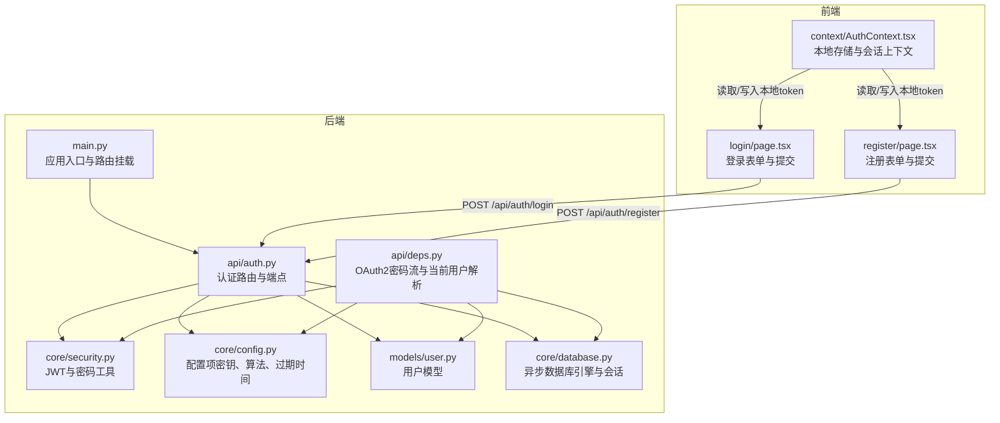
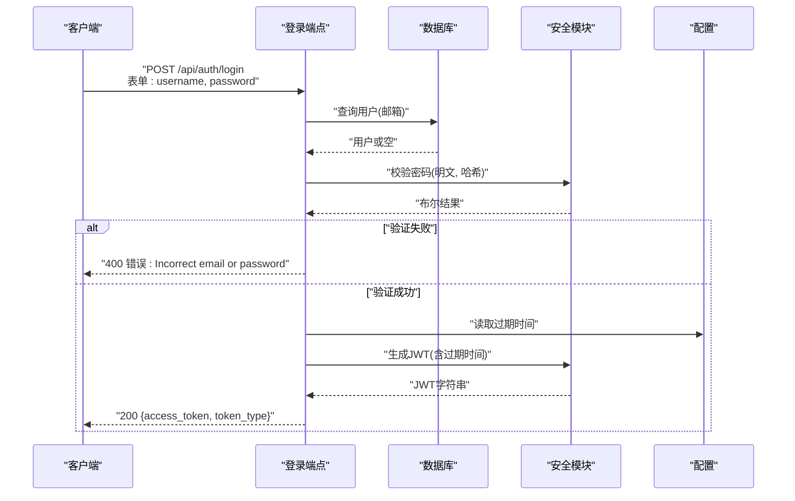
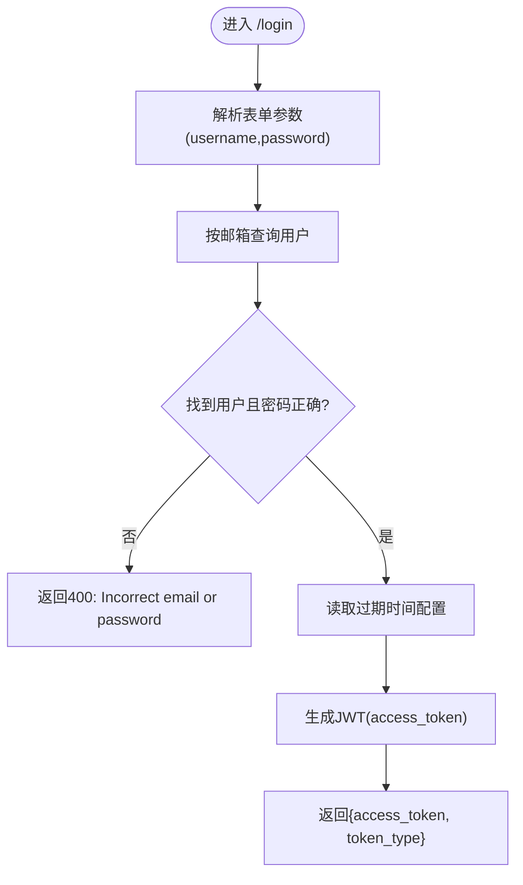
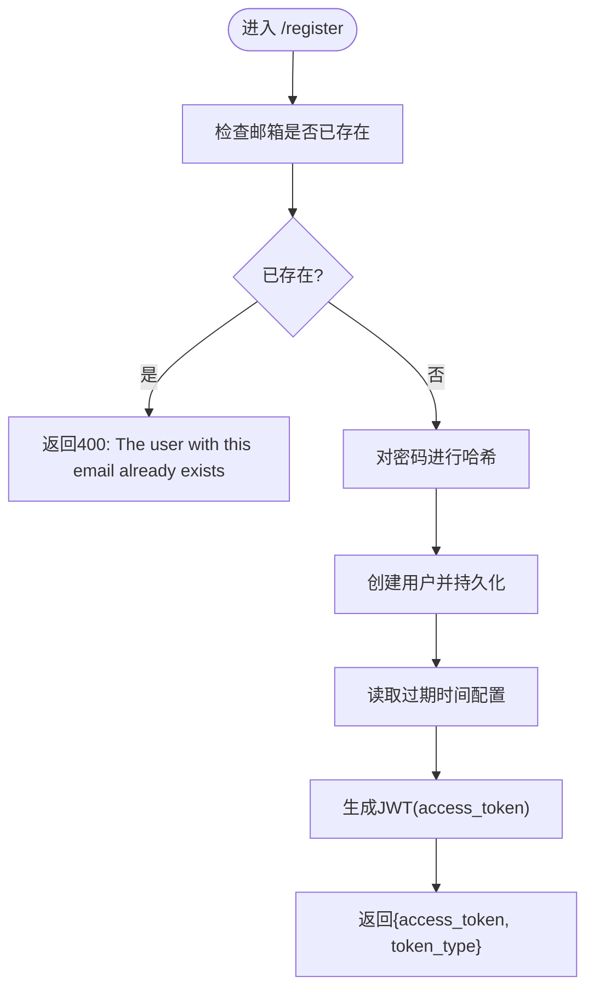
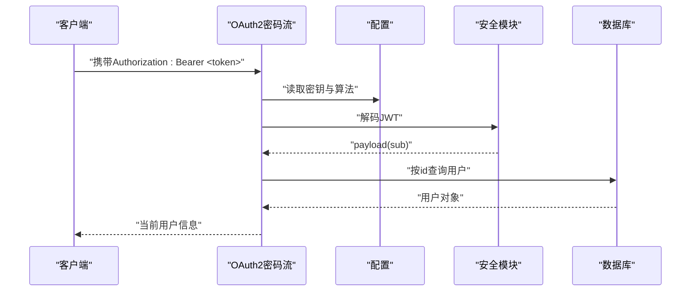
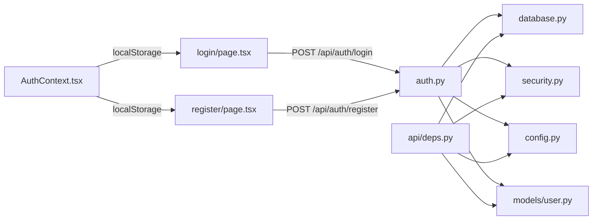

# 认证API

<cite>
**本文引用的文件**
- [backend/app/api/auth.py](file://backend/app/api/auth.py)
- [backend/app/main.py](file://backend/app/main.py)
- [backend/app/core/security.py](file://backend/app/core/security.py)
- [backend/app/core/config.py](file://backend/app/core/config.py)
- [backend/app/models/user.py](file://backend/app/models/user.py)
- [backend/app/api/deps.py](file://backend/app/api/deps.py)
- [backend/app/core/database.py](file://backend/app/core/database.py)
- [frontend/app/login/page.tsx](file://frontend/app/login/page.tsx)
- [frontend/app/register/page.tsx](file://frontend/app/register/page.tsx)
- [frontend/context/AuthContext.tsx](file://frontend/context/AuthContext.tsx)
- [.env.example](file://.env.example)
</cite>

## 目录
1. [简介](#简介)
2. [项目结构](#项目结构)
3. [核心组件](#核心组件)
4. [架构总览](#架构总览)
5. [详细组件分析](#详细组件分析)
6. [依赖关系分析](#依赖关系分析)
7. [性能与安全考虑](#性能与安全考虑)
8. [故障排查指南](#故障排查指南)
9. [结论](#结论)
10. [附录：API规范与示例](#附录api规范与示例)

## 简介
本文件为认证API端点的权威参考文档，覆盖登录（/api/auth/login）与注册（/api/auth/register）两个端点的完整规范。系统采用OAuth2密码流（OAuth2 Password Flow），使用JWT作为访问令牌，支持邮箱与密码的验证、令牌过期时间控制以及统一的错误处理机制。文档同时提供curl示例、前端SDK集成要点与安全最佳实践，帮助开发者快速、安全地完成集成。

## 项目结构
认证相关代码主要位于后端FastAPI应用中，前端Next.js应用通过Axios发起请求并与本地存储交互完成会话管理。

图表来源
- [backend/app/main.py](file://backend/app/main.py#L24-L29)
- [backend/app/api/auth.py](file://backend/app/api/auth.py#L1-L88)
- [backend/app/core/security.py](file://backend/app/core/security.py#L1-L26)
- [backend/app/core/config.py](file://backend/app/core/config.py#L1-L24)
- [backend/app/models/user.py](file://backend/app/models/user.py#L1-L31)
- [backend/app/api/deps.py](file://backend/app/api/deps.py#L1-L44)
- [backend/app/core/database.py](file://backend/app/core/database.py#L1-L24)
- [frontend/app/login/page.tsx](file://frontend/app/login/page.tsx#L19-L42)
- [frontend/app/register/page.tsx](file://frontend/app/register/page.tsx#L19-L37)
- [frontend/context/AuthContext.tsx](file://frontend/context/AuthContext.tsx#L15-L50)

章节来源
- [backend/app/main.py](file://backend/app/main.py#L24-L29)
- [backend/app/api/auth.py](file://backend/app/api/auth.py#L1-L88)
- [frontend/app/login/page.tsx](file://frontend/app/login/page.tsx#L19-L42)
- [frontend/app/register/page.tsx](file://frontend/app/register/page.tsx#L19-L37)
- [frontend/context/AuthContext.tsx](file://frontend/context/AuthContext.tsx#L15-L50)

## 核心组件
- 认证路由与端点：定义登录与注册两个端点，返回标准JWT访问令牌与token类型。
- 安全工具：提供JWT签名、解码、密码哈希与校验。
- 配置：集中管理密钥、算法与令牌过期时间等安全参数。
- 数据模型：用户实体包含邮箱、哈希密码等字段。
- 依赖注入：OAuth2密码流与当前用户解析，用于后续受保护资源的鉴权。
- 前端集成：登录/注册页面通过Axios调用后端，使用本地存储保存令牌。

章节来源
- [backend/app/api/auth.py](file://backend/app/api/auth.py#L24-L87)
- [backend/app/core/security.py](file://backend/app/core/security.py#L11-L25)
- [backend/app/core/config.py](file://backend/app/core/config.py#L8-L11)
- [backend/app/models/user.py](file://backend/app/models/user.py#L15-L31)
- [backend/app/api/deps.py](file://backend/app/api/deps.py#L13-L43)
- [frontend/app/login/page.tsx](file://frontend/app/login/page.tsx#L24-L33)
- [frontend/app/register/page.tsx](file://frontend/app/register/page.tsx#L24-L28)

## 架构总览
认证流程遵循OAuth2密码流，客户端以表单形式提交用户名（邮箱）与密码，服务端验证后签发JWT访问令牌；后续受保护资源通过Authorization头携带该令牌进行访问。

图表来源
- [backend/app/api/auth.py](file://backend/app/api/auth.py#L24-L50)
- [backend/app/core/security.py](file://backend/app/core/security.py#L11-L19)
- [backend/app/core/config.py](file://backend/app/core/config.py#L11)
- [backend/app/models/user.py](file://backend/app/models/user.py#L19-L20)

## 详细组件分析

### 登录端点 /api/auth/login
- 方法与路径：POST /api/auth/login
- 身份验证方式：OAuth2密码流（OAuth2PasswordRequestForm）
- 请求体：
  - username: 邮箱（字符串，必填）
  - password: 密码（字符串，必填）
- 成功响应：
  - access_token: JWT访问令牌（字符串）
  - token_type: 固定值“bearer”（字符串）
- 失败响应：
  - 400：用户名或密码不正确
- 实现要点：
  - 使用OAuth2PasswordRequestForm自动解析表单数据
  - 通过邮箱查询用户，再对密码进行哈希校验
  - 根据配置计算令牌过期时间并签发JWT

图表来源
- [backend/app/api/auth.py](file://backend/app/api/auth.py#L24-L50)
- [backend/app/core/config.py](file://backend/app/core/config.py#L11)
- [backend/app/core/security.py](file://backend/app/core/security.py#L11-L19)

章节来源
- [backend/app/api/auth.py](file://backend/app/api/auth.py#L24-L50)
- [backend/app/core/security.py](file://backend/app/core/security.py#L11-L19)
- [backend/app/core/config.py](file://backend/app/core/config.py#L11)

### 注册端点 /api/auth/register
- 方法与路径：POST /api/auth/register
- 身份验证方式：无（开放注册）
- 请求体：
  - email: 邮箱（字符串，必填，需符合Email格式）
  - password: 密码（字符串，必填）
- 成功响应：
  - access_token: JWT访问令牌（字符串）
  - token_type: 固定值“bearer”（字符串）
- 失败响应：
  - 400：邮箱已存在
- 实现要点：
  - 检查邮箱是否已存在
  - 对密码进行哈希处理并创建用户
  - 注册成功后立即签发JWT，实现自动登录

图表来源
- [backend/app/api/auth.py](file://backend/app/api/auth.py#L52-L87)
- [backend/app/core/config.py](file://backend/app/core/config.py#L11)
- [backend/app/core/security.py](file://backend/app/core/security.py#L24-L25)
- [backend/app/models/user.py](file://backend/app/models/user.py#L19-L20)

章节来源
- [backend/app/api/auth.py](file://backend/app/api/auth.py#L52-L87)
- [backend/app/core/security.py](file://backend/app/core/security.py#L24-L25)
- [backend/app/models/user.py](file://backend/app/models/user.py#L19-L20)

### 受保护资源的OAuth2密码流
- OAuth2密码流配置：
  - tokenUrl: /api/auth/login
  - 令牌类型：bearer
- 当前用户解析：
  - 从Authorization头提取JWT
  - 使用配置中的密钥与算法进行解码
  - 从payload中提取用户标识并查询数据库

图表来源
- [backend/app/api/deps.py](file://backend/app/api/deps.py#L13-L43)
- [backend/app/core/config.py](file://backend/app/core/config.py#L9-L11)
- [backend/app/core/security.py](file://backend/app/core/security.py#L3)
- [backend/app/models/user.py](file://backend/app/models/user.py#L18)

章节来源
- [backend/app/api/deps.py](file://backend/app/api/deps.py#L13-L43)
- [backend/app/core/config.py](file://backend/app/core/config.py#L9-L11)
- [backend/app/core/security.py](file://backend/app/core/security.py#L3)

## 依赖关系分析
- 认证端点依赖：
  - 数据库会话：异步SQLAlchemy会话
  - 安全模块：密码哈希与JWT生成/校验
  - 配置模块：密钥、算法、过期时间
  - 用户模型：邮箱唯一性与哈希密码字段
- 前端依赖：
  - Axios：向后端发送HTTP请求
  - 本地存储：保存JWT令牌
  - Next.js路由：跳转到主页或登录页

图表来源
- [backend/app/api/auth.py](file://backend/app/api/auth.py#L1-L88)
- [backend/app/core/database.py](file://backend/app/core/database.py#L1-L24)
- [backend/app/core/security.py](file://backend/app/core/security.py#L1-L26)
- [backend/app/core/config.py](file://backend/app/core/config.py#L1-L24)
- [backend/app/models/user.py](file://backend/app/models/user.py#L1-L31)
- [backend/app/api/deps.py](file://backend/app/api/deps.py#L1-L44)
- [frontend/app/login/page.tsx](file://frontend/app/login/page.tsx#L24-L33)
- [frontend/app/register/page.tsx](file://frontend/app/register/page.tsx#L24-L28)
- [frontend/context/AuthContext.tsx](file://frontend/context/AuthContext.tsx#L15-L50)

章节来源
- [backend/app/api/auth.py](file://backend/app/api/auth.py#L1-L88)
- [backend/app/core/database.py](file://backend/app/core/database.py#L1-L24)
- [backend/app/core/security.py](file://backend/app/core/security.py#L1-L26)
- [backend/app/core/config.py](file://backend/app/core/config.py#L1-L24)
- [backend/app/models/user.py](file://backend/app/models/user.py#L1-L31)
- [backend/app/api/deps.py](file://backend/app/api/deps.py#L1-L44)
- [frontend/app/login/page.tsx](file://frontend/app/login/page.tsx#L24-L33)
- [frontend/app/register/page.tsx](file://frontend/app/register/page.tsx#L24-L28)
- [frontend/context/AuthContext.tsx](file://frontend/context/AuthContext.tsx#L15-L50)

## 性能与安全考虑
- 令牌过期时间：默认24小时（可通过配置调整）。建议在生产环境设置更短的过期时间，并结合刷新策略。
- 密钥与算法：使用HS256算法与密钥，建议在生产环境使用强随机密钥并定期轮换。
- 密码存储：使用bcrypt哈希，确保不可逆存储。
- CORS：开发环境允许特定来源，生产环境应限制为具体域名。
- 前端存储：令牌保存在本地存储中，建议配合HttpOnly Cookie与安全的同源策略，避免XSS风险。
- 错误处理：登录失败返回400，注册失败返回400，便于前端提示与重试。

[本节为通用指导，无需列出章节来源]

## 故障排查指南
- 登录返回400：检查邮箱与密码是否匹配，确认用户已存在且密码哈希一致。
- 注册返回400：检查邮箱是否已被占用，确认请求体格式正确。
- 令牌无效：确认Authorization头格式为“Bearer <token>”，密钥与算法与后端一致。
- CORS跨域：确认前端与后端的CORS配置允许当前来源。
- 数据库连接：确认DATABASE_URL配置正确，SQLite或PostgreSQL驱动可用。

章节来源
- [backend/app/api/auth.py](file://backend/app/api/auth.py#L38-L43)
- [backend/app/api/auth.py](file://backend/app/api/auth.py#L67-L71)
- [backend/app/api/deps.py](file://backend/app/api/deps.py#L21-L33)
- [backend/app/main.py](file://backend/app/main.py#L9-L22)
- [backend/app/core/database.py](file://backend/app/core/database.py#L5-L9)

## 结论
本认证API基于OAuth2密码流与JWT，提供了简洁可靠的登录与注册能力。通过明确的请求/响应规范、统一的错误处理与可配置的安全参数，开发者可以快速完成集成。建议在生产环境中强化密钥管理、缩短令牌有效期并引入刷新策略与更严格的前端安全措施。

[本节为总结，无需列出章节来源]

## 附录：API规范与示例

### 端点概览
- 登录
  - 方法：POST
  - 路径：/api/auth/login
  - 身份验证：OAuth2密码流
  - 请求体：username（邮箱）、password（密码）
  - 响应：access_token（JWT）、token_type（固定为bearer）
  - 错误：400（用户名或密码不正确）

- 注册
  - 方法：POST
  - 路径：/api/auth/register
  - 身份验证：无
  - 请求体：email（邮箱）、password（密码）
  - 响应：access_token（JWT）、token_type（固定为bearer）
  - 错误：400（邮箱已存在）

章节来源
- [backend/app/api/auth.py](file://backend/app/api/auth.py#L24-L50)
- [backend/app/api/auth.py](file://backend/app/api/auth.py#L52-L87)

### 请求参数与验证规则
- 邮箱（email）
  - 类型：字符串
  - 规则：符合Email格式
  - 来源：注册请求体；登录时作为username传入
- 密码（password）
  - 类型：字符串
  - 规则：任意非空字符串（建议最小长度与复杂度约束）
  - 存储：后端以哈希形式保存

章节来源
- [backend/app/api/auth.py](file://backend/app/api/auth.py#L16-L18)
- [backend/app/models/user.py](file://backend/app/models/user.py#L19-L20)

### 响应模式
- 成功响应
  - access_token: JWT字符串
  - token_type: "bearer"
- 失败响应
  - 400：错误详情（字符串）

章节来源
- [backend/app/api/auth.py](file://backend/app/api/auth.py#L20-L22)
- [backend/app/api/auth.py](file://backend/app/api/auth.py#L40-L43)
- [backend/app/api/auth.py](file://backend/app/api/auth.py#L68-L71)

### curl 示例
- 登录
  - curl -X POST http://127.0.0.1:8000/api/auth/login -H "Content-Type: application/x-www-form-urlencoded" -d "username=<邮箱>&password=<密码>"
- 注册
  - curl -X POST http://127.0.0.1:8000/api/auth/register -H "Content-Type: application/json" -d '{"email":"<邮箱>","password":"<密码>"}'

章节来源
- [frontend/app/login/page.tsx](file://frontend/app/login/page.tsx#L24-L33)
- [frontend/app/register/page.tsx](file://frontend/app/register/page.tsx#L24-L28)

### SDK集成要点（前端）
- Axios请求
  - 登录：使用URL编码表单提交username与password
  - 注册：使用JSON体提交email与password
- 令牌存储
  - 将access_token存入本地存储，后续请求在Authorization头中携带“Bearer <token>”
- 路由跳转
  - 登录成功后跳转至首页；登出后跳转至登录页

章节来源
- [frontend/app/login/page.tsx](file://frontend/app/login/page.tsx#L24-L33)
- [frontend/app/register/page.tsx](file://frontend/app/register/page.tsx#L24-L28)
- [frontend/context/AuthContext.tsx](file://frontend/context/AuthContext.tsx#L27-L37)

### 令牌过期时间与刷新策略
- 过期时间
  - 默认：24小时（可通过配置调整）
- 刷新策略
  - 当前实现未提供刷新端点。建议引入短期访问令牌与长期刷新令牌的双令牌方案，并在访问令牌即将过期时自动刷新。

章节来源
- [backend/app/core/config.py](file://backend/app/core/config.py#L11)
- [backend/app/core/security.py](file://backend/app/core/security.py#L11-L19)

### 安全最佳实践
- 密钥管理
  - 使用强随机密钥并定期轮换
  - 在生产环境禁用默认密钥
- 传输安全
  - 强制HTTPS，避免明文传输
- 前端安全
  - 优先使用HttpOnly Cookie存储令牌
  - 启用CSP与SameSite策略，降低XSS与CSRF风险
- 日志与监控
  - 记录认证事件与异常，但避免泄露敏感信息

章节来源
- [backend/app/core/config.py](file://backend/app/core/config.py#L9-L11)
- [backend/app/main.py](file://backend/app/main.py#L9-L22)
- [frontend/context/AuthContext.tsx](file://frontend/context/AuthContext.tsx#L27-L37)