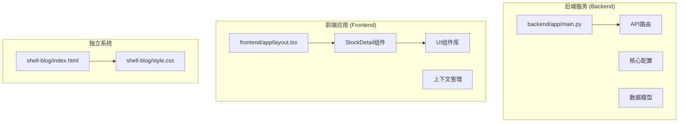
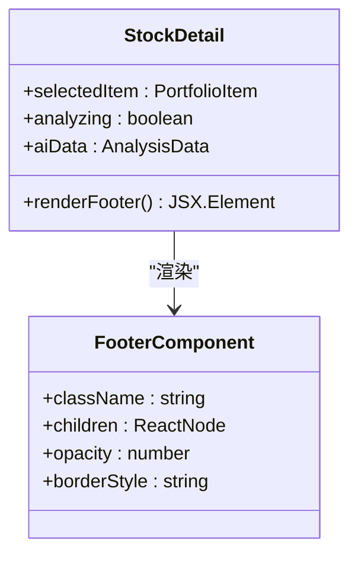
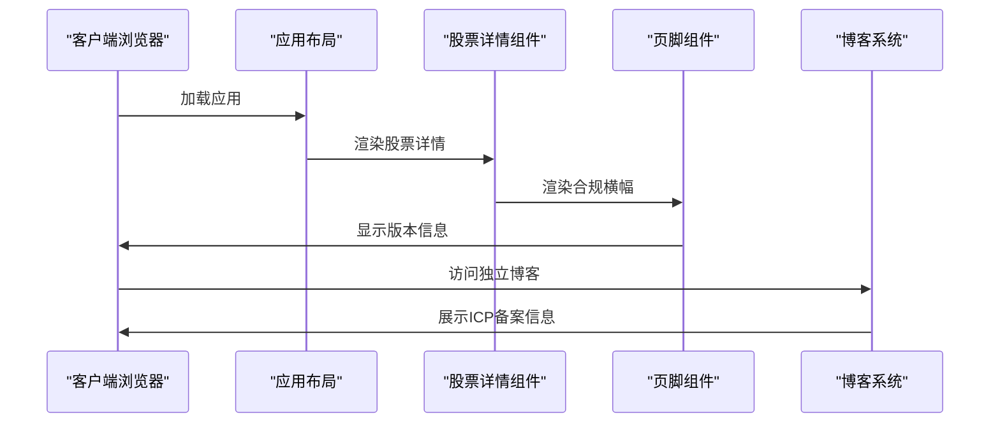
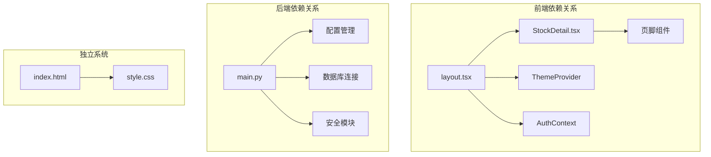

# 合规横幅页脚

<cite>
**本文档引用的文件**
- [backend/app/main.py](file://backend/app/main.py)
- [frontend/app/layout.tsx](file://frontend/app/layout.tsx)
- [frontend/components/features/StockDetail.tsx](file://frontend/components/features/StockDetail.tsx)
- [shell-blog/index.html](file://shell-blog/index.html)
- [shell-blog/style.css](file://shell-blog/style.css)
</cite>

## 目录
1. [简介](#简介)
2. [项目结构](#项目结构)
3. [核心组件](#核心组件)
4. [架构概览](#架构概览)
5. [详细组件分析](#详细组件分析)
6. [依赖关系分析](#依赖关系分析)
7. [性能考虑](#性能考虑)
8. [故障排除指南](#故障排除指南)
9. [结论](#结论)

## 简介

本文档详细分析了AI股票顾问项目中的合规横幅页脚功能。该项目是一个集成了多源数据与LLM分析能力的智能投资助手平台，包含前后端分离的架构设计。合规横幅页脚作为系统的重要组成部分，承担着展示产品版本信息、品牌标识和合规声明的功能。

该功能主要体现在前端应用的页脚区域，采用简洁的设计风格，包含产品版本标识和透明度处理，确保在不同主题模式下都能保持良好的视觉效果。同时，项目还包含了独立的博客系统，其中也实现了完整的ICP备案信息展示。

## 项目结构

项目采用前后端分离的架构设计，主要分为以下核心模块：

**图表来源**
- [backend/app/main.py:1-146](file://backend/app/main.py#L1-L146)
- [frontend/app/layout.tsx:1-52](file://frontend/app/layout.tsx#L1-L52)
- [shell-blog/index.html:1-60](file://shell-blog/index.html#L1-L60)

**章节来源**
- [backend/app/main.py:1-146](file://backend/app/main.py#L1-L146)
- [frontend/app/layout.tsx:1-52](file://frontend/app/layout.tsx#L1-L52)

## 核心组件

### 后端主程序入口

后端采用FastAPI框架，提供了完整的API服务基础架构。主要功能包括：

- **全局日志配置**：统一的日志记录机制，支持文件和控制台输出
- **异常处理**：全局异常捕获和结构化错误响应
- **请求中间件**：自定义日志记录和用户身份解析
- **CORS配置**：跨域资源共享设置
- **路由挂载**：API路由的统一管理

### 前端布局系统

前端采用Next.js框架，提供了现代化的单页应用体验。核心特性包括：

- **主题管理**：支持明暗主题切换和系统偏好检测
- **认证上下文**：用户状态管理和权限控制
- **UI组件系统**：基于Radix UI的可访问性组件库
- **字体系统**：Geist字体的灵活配置

### 股票详情页脚组件

这是合规横幅页脚功能的核心实现，位于股票详情页面的底部区域：

**图表来源**
- [frontend/components/features/StockDetail.tsx:220-224](file://frontend/components/features/StockDetail.tsx#L220-L224)

**章节来源**
- [frontend/components/features/StockDetail.tsx:220-224](file://frontend/components/features/StockDetail.tsx#L220-L224)

## 架构概览

系统采用分层架构设计，前后端分离，每个部分都有明确的职责划分：

**图表来源**
- [frontend/app/layout.tsx:24-51](file://frontend/app/layout.tsx#L24-L51)
- [frontend/components/features/StockDetail.tsx:156-226](file://frontend/components/features/StockDetail.tsx#L156-L226)
- [shell-blog/index.html:52-57](file://shell-blog/index.html#L52-L57)

## 详细组件分析

### 合规横幅页脚实现

合规横幅页脚位于股票详情页面的底部，采用了极简的设计理念：

#### 设计特点
- **透明度处理**：使用`opacity-30`类名实现半透明效果
- **边框分隔**：采用`border-t border-slate-100 dark:border-slate-800`创建清晰的分隔线
- **居中对齐**：文本水平居中，垂直方向保持适当的间距
- **响应式设计**：适配不同屏幕尺寸的显示效果

#### 文本内容
页脚显示"AI Analysis Terminal V4.0"版本标识，体现了产品的迭代历史和技术成熟度。

#### 主题兼容性
组件设计充分考虑了深色模式的支持，通过`dark:`前缀的Tailwind类名确保在不同主题下的一致体验。

### 博客系统ICP备案

项目包含一个独立的静态博客系统，专门用于展示个人信息和文章内容：

#### 结构组成
- **HTML模板**：标准的语义化HTML结构
- **CSS样式**：包含专门的页脚样式规则
- **备案信息**：完整的ICP备案和公安备案信息

#### 样式实现
页脚区域使用了特定的CSS类名`.icp`来突出显示备案信息，确保用户能够清楚地看到合规要求。

**章节来源**
- [frontend/components/features/StockDetail.tsx:220-224](file://frontend/components/features/StockDetail.tsx#L220-L224)
- [shell-blog/index.html:52-57](file://shell-blog/index.html#L52-L57)
- [shell-blog/style.css:109-117](file://shell-blog/style.css#L109-L117)

### 前端布局系统

前端布局系统为整个应用提供了统一的基础框架：

#### 主要功能
- **元数据管理**：定义应用的标题、描述和关键词
- **字体配置**：集成Geist Sans和Geist Mono字体系统
- **主题提供者**：支持明暗主题切换和系统偏好检测
- **认证上下文**：用户状态管理和权限控制

#### 组件层次
布局系统采用多层组件嵌套的设计，从根HTML元素开始，逐层包裹应用的各种功能组件。

**章节来源**
- [frontend/app/layout.tsx:15-51](file://frontend/app/layout.tsx#L15-L51)

## 依赖关系分析

系统各组件之间的依赖关系清晰明确，遵循单一职责原则：

**图表来源**
- [frontend/app/layout.tsx:20-47](file://frontend/app/layout.tsx#L20-L47)
- [backend/app/main.py:107-134](file://backend/app/main.py#L107-L134)
- [shell-blog/index.html:1-60](file://shell-blog/index.html#L1-60)

**章节来源**
- [frontend/app/layout.tsx:20-47](file://frontend/app/layout.tsx#L20-L47)
- [backend/app/main.py:107-134](file://backend/app/main.py#L107-L134)

## 性能考虑

### 前端性能优化
- **组件懒加载**：使用React.memo优化渲染性能
- **条件渲染**：根据滚动位置动态显示粘性导航栏
- **主题切换**：支持硬件加速的主题切换动画

### 后端性能特性
- **异步处理**：使用async/await处理数据库操作
- **连接池管理**：合理配置数据库连接池
- **中间件优化**：高效的请求日志记录机制

## 故障排除指南

### 常见问题及解决方案

#### 页脚样式问题
- **症状**：页脚文字不显示或样式异常
- **原因**：CSS类名冲突或主题配置错误
- **解决**：检查Tailwind配置和CSS优先级

#### 主题切换问题
- **症状**：深色模式下页脚不可见
- **原因**：颜色变量未正确设置
- **解决**：验证CSS变量和dark前缀类名

#### 响应式布局问题
- **症状**：移动端显示异常
- **原因**：断点配置不当
- **解决**：调整Tailwind响应式断点

**章节来源**
- [frontend/components/features/StockDetail.tsx:220-224](file://frontend/components/features/StockDetail.tsx#L220-L224)
- [frontend/app/layout.tsx:34-48](file://frontend/app/layout.tsx#L34-L48)

## 结论

合规横幅页脚功能作为AI股票顾问项目的重要组成部分，体现了以下设计特点：

1. **简洁实用**：采用极简设计，专注于核心功能展示
2. **主题友好**：完美支持明暗主题切换
3. **响应式设计**：适配各种设备和屏幕尺寸
4. **合规要求**：满足金融产品展示的法律要求
5. **技术先进**：使用现代前端技术和最佳实践

该功能不仅提升了用户体验，更重要的是确保了产品的合规性和专业性，为用户提供了清晰的产品标识和版本信息。通过合理的架构设计和组件化实现，该功能能够在不影响整体性能的前提下，为用户提供稳定可靠的服务。