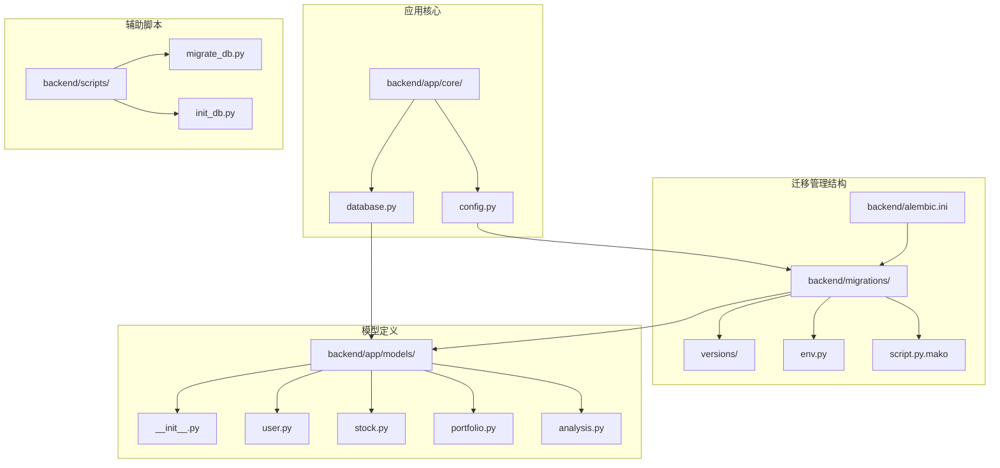
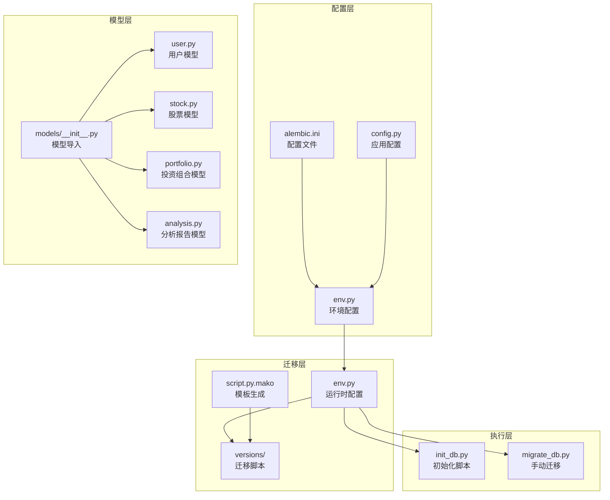
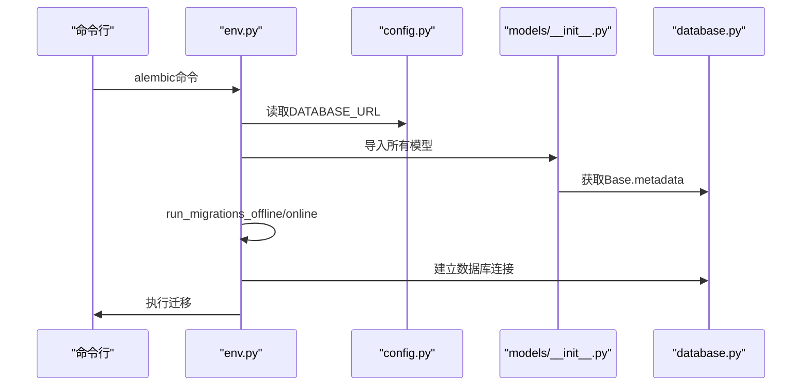
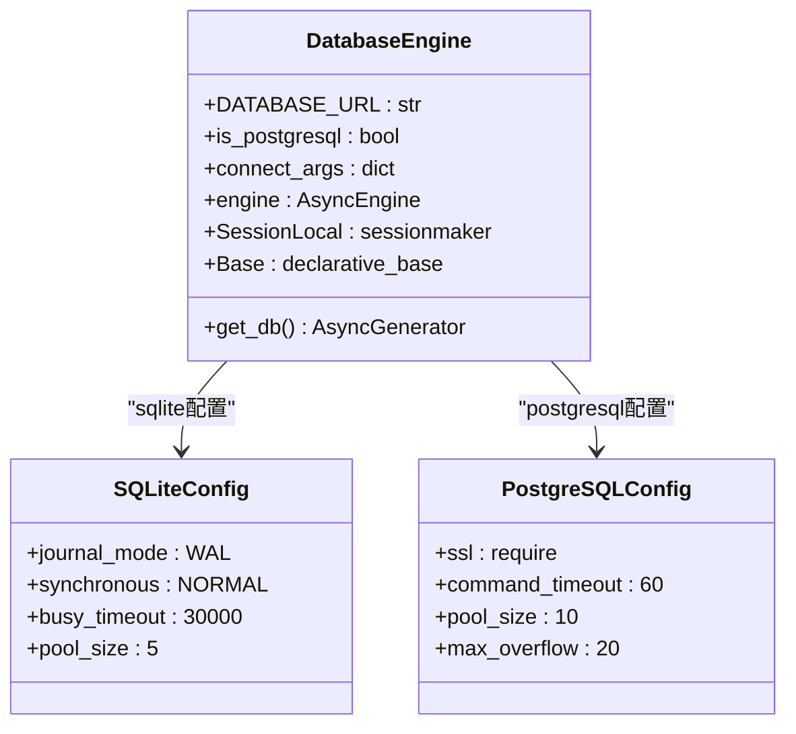
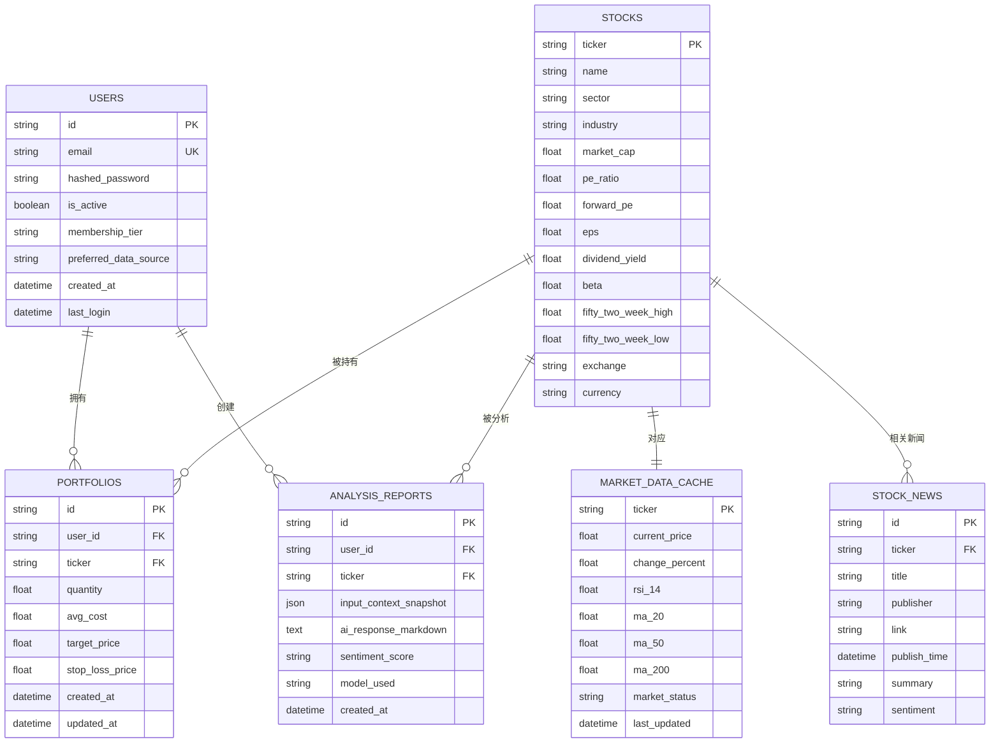
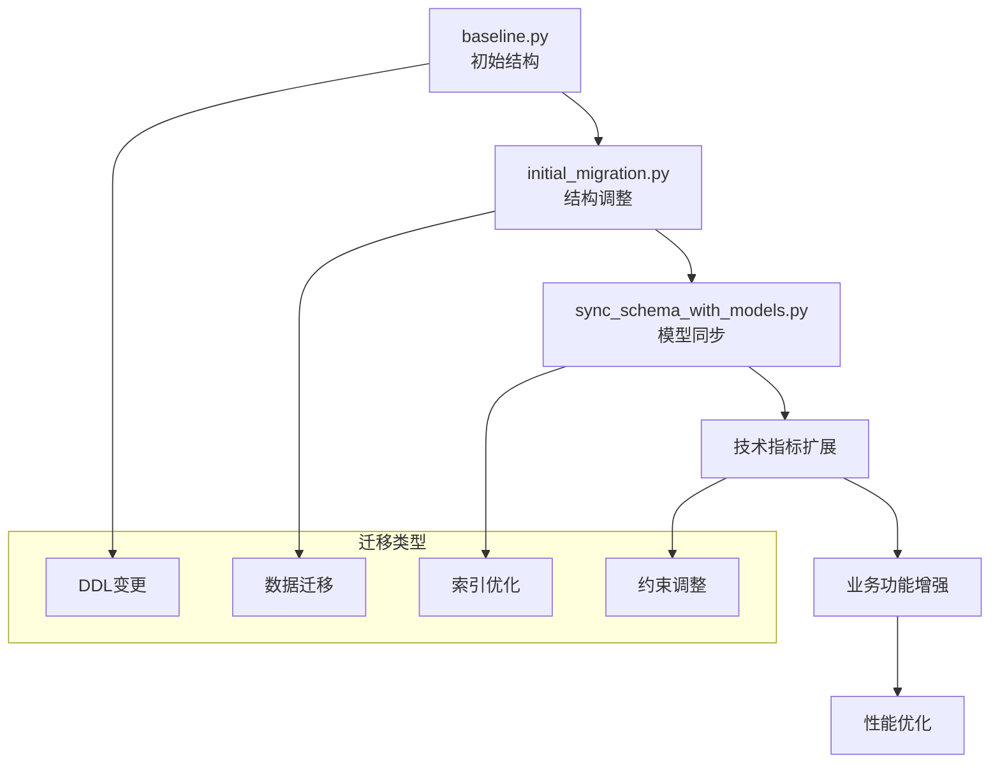
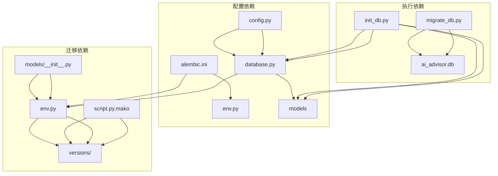

# 数据库迁移管理

<cite>
**本文档引用的文件**
- [backend/migrations/env.py](file://backend/migrations/env.py)
- [backend/alembic.ini](file://backend/alembic.ini)
- [backend/migrations/script.py.mako](file://backend/migrations/script.py.mako)
- [backend/app/core/database.py](file://backend/app/core/database.py)
- [backend/app/core/config.py](file://backend/app/core/config.py)
- [backend/app/models/__init__.py](file://backend/app/models/__init__.py)
- [backend/scripts/migrate_db.py](file://backend/scripts/migrate_db.py)
- [backend/scripts/init_db.py](file://backend/scripts/init_db.py)
- [backend/migrations/versions/35a834f440ba_baseline.py](file://backend/migrations/versions/35a834f440ba_baseline.py)
- [backend/migrations/versions/052e88ccdfbf_sync_schema_with_models.py](file://backend/migrations/versions/052e88ccdfbf_sync_schema_with_models.py)
- [backend/migrations/versions/261c72d24d12_initial_migration.py](file://backend/migrations/versions/261c72d24d12_initial_migration.py)
- [backend/app/models/user.py](file://backend/app/models/user.py)
- [backend/app/models/stock.py](file://backend/app/models/stock.py)
- [backend/app/models/portfolio.py](file://backend/app/models/portfolio.py)
- [backend/app/models/analysis.py](file://backend/app/models/analysis.py)
</cite>

## 目录
1. [简介](#简介)
2. [项目结构](#项目结构)
3. [核心组件](#核心组件)
4. [架构概览](#架构概览)
5. [详细组件分析](#详细组件分析)
6. [依赖关系分析](#依赖关系分析)
7. [性能考虑](#性能考虑)
8. [故障排除指南](#故障排除指南)
9. [结论](#结论)

## 简介

本项目采用Alembic作为数据库迁移管理工具，结合SQLAlchemy ORM实现数据库版本控制。系统支持SQLite和PostgreSQL两种数据库后端，具备完整的迁移脚本生成、执行和回滚机制。通过结构化的迁移文件组织，实现了从初始数据库结构到复杂业务表的演进管理。

## 项目结构

项目采用分层架构设计，数据库迁移相关文件主要分布在以下目录：

**图表来源**
- [backend/migrations/env.py](file://backend/migrations/env.py#L1-L86)
- [backend/alembic.ini](file://backend/alembic.ini#L1-L148)
- [backend/app/core/database.py](file://backend/app/core/database.py#L1-L69)

**章节来源**
- [backend/migrations/env.py](file://backend/migrations/env.py#L1-L86)
- [backend/alembic.ini](file://backend/alembic.ini#L1-L148)
- [backend/app/core/database.py](file://backend/app/core/database.py#L1-L69)

## 核心组件

### Alembic配置管理

系统使用Alembic作为主要的数据库迁移框架，配置文件位于`alembic.ini`中，支持多种数据库后端的配置管理。

### 数据库引擎配置

`database.py`文件定义了异步数据库引擎配置，支持SQLite和PostgreSQL两种数据库类型，并针对不同数据库进行了优化配置。

### 模型定义系统

应用模型通过SQLAlchemy ORM定义，包括用户、股票、投资组合、分析报告等核心业务实体，每个模型都定义了完整的字段结构和关系映射。

**章节来源**
- [backend/app/core/database.py](file://backend/app/core/database.py#L1-L69)
- [backend/app/core/config.py](file://backend/app/core/config.py#L1-L28)
- [backend/app/models/__init__.py](file://backend/app/models/__init__.py#L1-L6)

## 架构概览

系统采用三层架构设计，实现了数据库迁移的完整生命周期管理：

**图表来源**
- [backend/alembic.ini](file://backend/alembic.ini#L1-L148)
- [backend/migrations/env.py](file://backend/migrations/env.py#L1-L86)
- [backend/app/models/__init__.py](file://backend/app/models/__init__.py#L1-L6)

## 详细组件分析

### 迁移环境配置

迁移环境配置文件`env.py`负责协调数据库连接、模型元数据管理和迁移执行流程。

**图表来源**
- [backend/migrations/env.py](file://backend/migrations/env.py#L1-L86)
- [backend/app/core/config.py](file://backend/app/core/config.py#L1-L28)
- [backend/app/models/__init__.py](file://backend/app/models/__init__.py#L1-L6)

**章节来源**
- [backend/migrations/env.py](file://backend/migrations/env.py#L1-L86)

### 数据库引擎配置

数据库引擎配置针对不同数据库类型提供了专门的优化参数：

**图表来源**
- [backend/app/core/database.py](file://backend/app/core/database.py#L1-L69)

**章节来源**
- [backend/app/core/database.py](file://backend/app/core/database.py#L1-L69)

### 模型关系设计

系统的核心数据模型通过外键关系建立了清晰的业务关联：

**图表来源**
- [backend/app/models/user.py](file://backend/app/models/user.py#L1-L64)
- [backend/app/models/stock.py](file://backend/app/models/stock.py#L1-L116)
- [backend/app/models/portfolio.py](file://backend/app/models/portfolio.py#L1-L33)
- [backend/app/models/analysis.py](file://backend/app/models/analysis.py#L1-L66)

**章节来源**
- [backend/app/models/user.py](file://backend/app/models/user.py#L1-L64)
- [backend/app/models/stock.py](file://backend/app/models/stock.py#L1-L116)
- [backend/app/models/portfolio.py](file://backend/app/models/portfolio.py#L1-L33)
- [backend/app/models/analysis.py](file://backend/app/models/analysis.py#L1-L66)

### 迁移脚本演进

系统通过一系列迁移脚本实现了数据库结构的逐步演进：

**图表来源**
- [backend/migrations/versions/35a834f440ba_baseline.py](file://backend/migrations/versions/35a834f440ba_baseline.py#L1-L128)
- [backend/migrations/versions/261c72d24d12_initial_migration.py](file://backend/migrations/versions/261c72d24d12_initial_migration.py#L1-L37)
- [backend/migrations/versions/052e88ccdfbf_sync_schema_with_models.py](file://backend/migrations/versions/052e88ccdfbf_sync_schema_with_models.py#L1-L115)

**章节来源**
- [backend/migrations/versions/35a834f440ba_baseline.py](file://backend/migrations/versions/35a834f440ba_baseline.py#L1-L128)
- [backend/migrations/versions/261c72d24d12_initial_migration.py](file://backend/migrations/versions/261c72d24d12_initial_migration.py#L1-L37)
- [backend/migrations/versions/052e88ccdfbf_sync_schema_with_models.py](file://backend/migrations/versions/052e88ccdfbf_sync_schema_with_models.py#L1-L115)

## 依赖关系分析

系统各组件之间的依赖关系如下：

**图表来源**
- [backend/alembic.ini](file://backend/alembic.ini#L1-L148)
- [backend/migrations/env.py](file://backend/migrations/env.py#L1-L86)
- [backend/app/core/config.py](file://backend/app/core/config.py#L1-L28)
- [backend/app/core/database.py](file://backend/app/core/database.py#L1-L69)

**章节来源**
- [backend/alembic.ini](file://backend/alembic.ini#L1-L148)
- [backend/migrations/env.py](file://backend/migrations/env.py#L1-L86)
- [backend/app/core/database.py](file://backend/app/core/database.py#L1-L69)

## 性能考虑

系统在数据库性能方面采用了多项优化策略：

### SQLite优化
- 启用WAL模式提升并发性能
- 调整同步级别和超时设置
- 优化连接池配置

### PostgreSQL优化
- 针对Neon服务的SSL强制要求
- 调整连接池大小和溢出配置
- 设置命令超时时间

### 迁移性能
- 使用批量操作减少迁移时间
- 优化索引创建顺序
- 合理的数据类型选择

## 故障排除指南

### 常见问题及解决方案

1. **数据库连接失败**
   - 检查DATABASE_URL配置
   - 验证数据库服务状态
   - 确认网络连接可用

2. **迁移执行失败**
   - 查看详细的错误日志
   - 检查模型定义完整性
   - 验证数据库权限设置

3. **数据迁移异常**
   - 确认数据类型兼容性
   - 检查外键约束关系
   - 验证索引完整性

**章节来源**
- [backend/migrations/env.py](file://backend/migrations/env.py#L1-L86)
- [backend/app/core/database.py](file://backend/app/core/database.py#L1-L69)

## 结论

本项目的数据库迁移管理系统具有以下特点：

1. **完整的生命周期管理**：从初始建模到持续演进的完整流程
2. **多数据库支持**：灵活适配SQLite和PostgreSQL的不同需求
3. **结构化组织**：通过版本化脚本实现可追溯的变更管理
4. **性能优化**：针对不同数据库类型的专门优化配置
5. **可靠性保障**：完善的错误处理和回滚机制

系统通过标准化的迁移流程和严格的版本控制，确保了数据库结构演进的可控性和安全性，为AI股票顾问应用的长期发展奠定了坚实的基础设施基础。