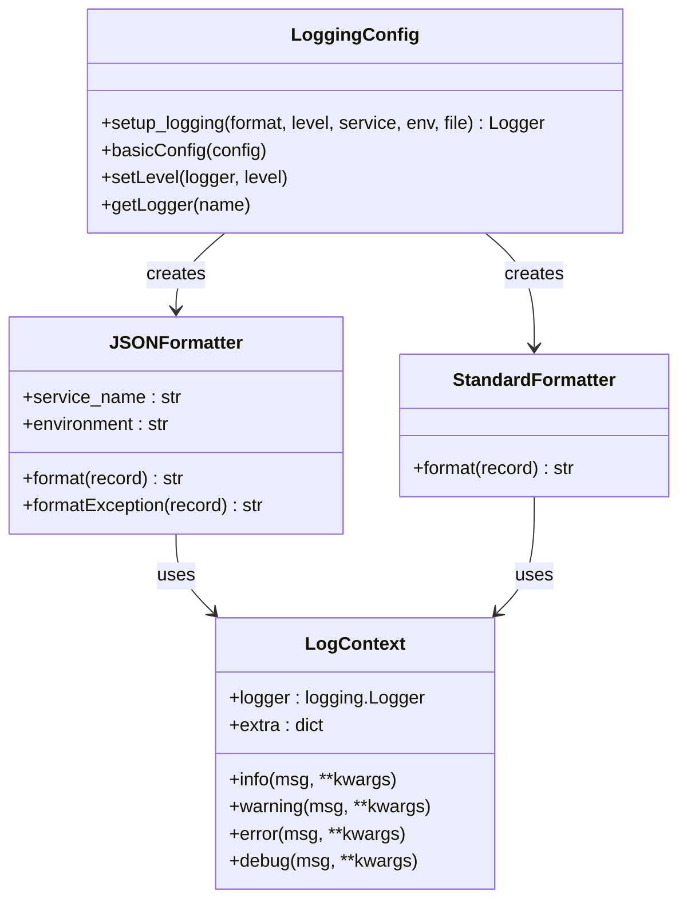
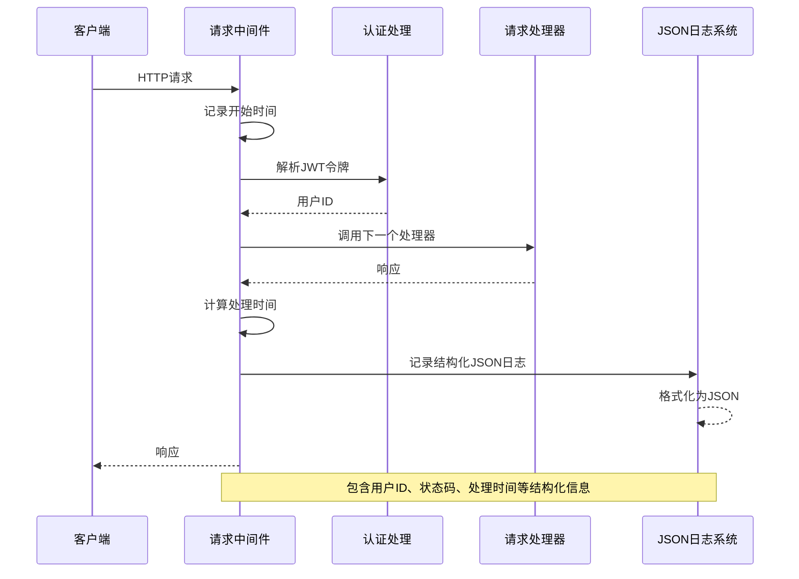
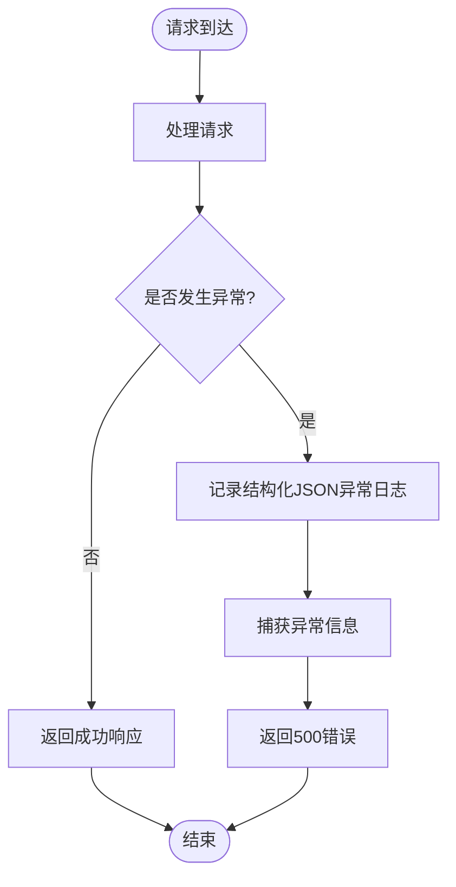
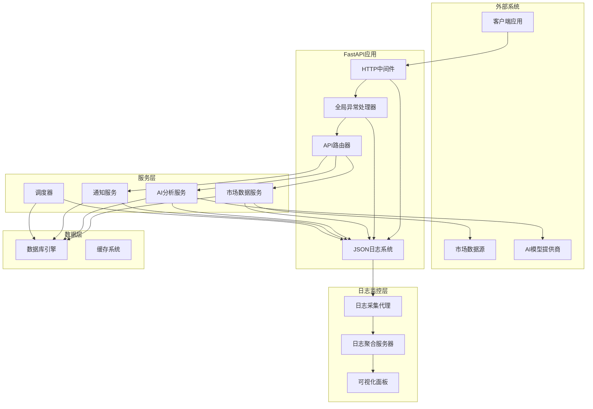
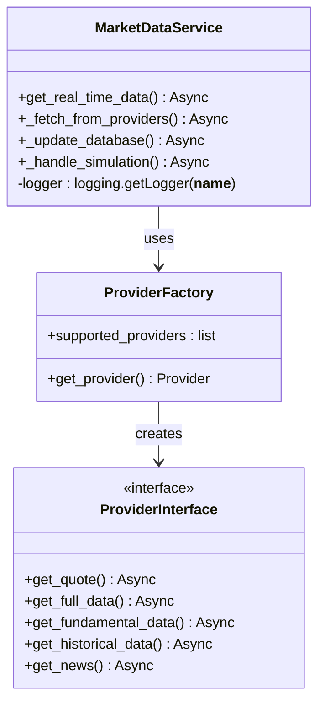
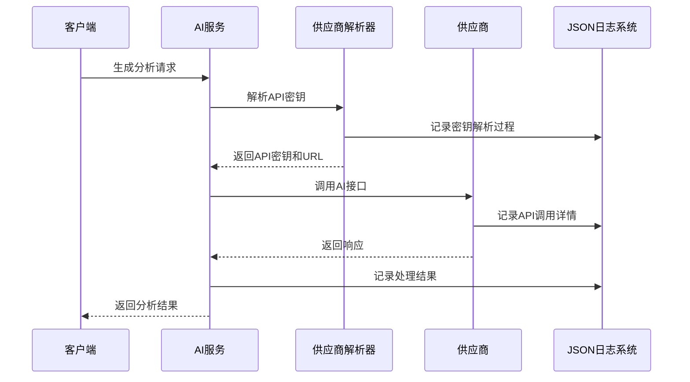
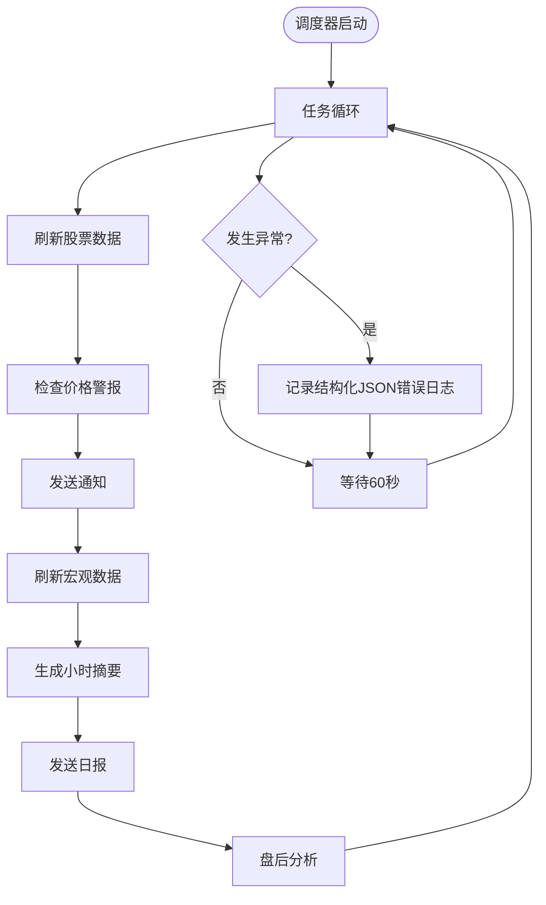
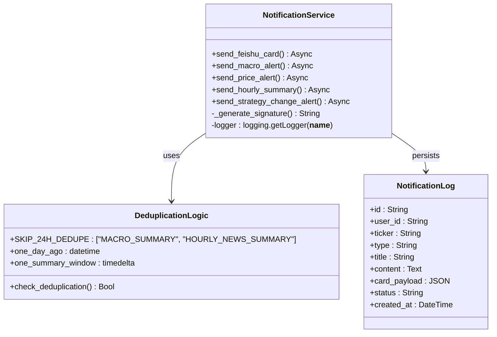
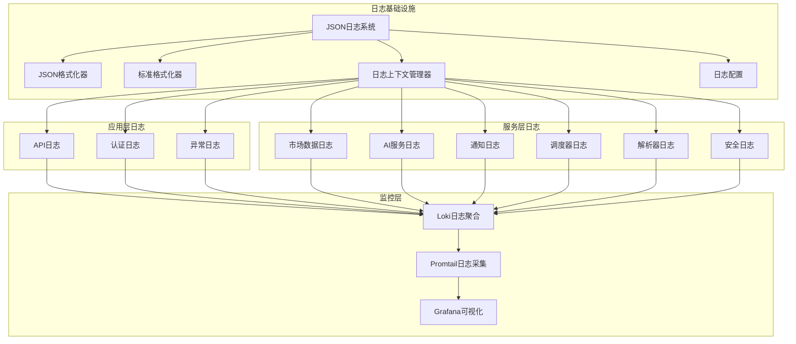

# 调试日志增强

<cite>
**本文档引用的文件**
- [backend/app/main.py](file://backend/app/main.py)
- [backend/app/utils/json_logger.py](file://backend/app/utils/json_logger.py)
- [backend/app/core/config.py](file://backend/app/core/config.py)
- [backend/app/core/database.py](file://backend/app/core/database.py)
- [backend/app/api/v1/api.py](file://backend/app/api/v1/api.py)
- [backend/app/api/deps.py](file://backend/app/api/deps.py)
- [backend/app/services/market_data.py](file://backend/app/services/market_data.py)
- [backend/app/services/ai_service.py](file://backend/app/services/ai_service.py)
- [backend/app/services/scheduler.py](file://backend/app/services/scheduler.py)
- [backend/app/services/notification_service.py](file://backend/app/services/notification_service.py)
- [backend/app/utils/ai_response_parser.py](file://backend/app/utils/ai_response_parser.py)
- [backend/app/core/security.py](file://backend/app/core/security.py)
- [backend/app/models/notification.py](file://backend/app/models/notification.py)
- [backend/app/models/user.py](file://backend/app/models/user.py)
- [monitoring/loki/loki-config.yaml](file://monitoring/loki/loki-config.yaml)
- [monitoring/promtail/promtail-config.yaml](file://monitoring/promtail/promtail-config.yaml)
- [monitoring/grafana/provisioning/datasources/datasources.yaml](file://monitoring/grafana/provisioning/datasources/datasources.yaml)
- [docker-compose.yml](file://docker-compose.yml)
</cite>

## 更新摘要
**所做更改**
- 新增了结构化JSON日志系统的完整实现
- 集成了Loki日志聚合和Grafana可视化监控
- 更新了日志格式化器和日志上下文管理器
- 增强了异常处理和调试能力
- 添加了完整的日志监控基础设施

## 目录
1. [简介](#简介)
2. [项目结构](#项目结构)
3. [核心组件](#核心组件)
4. [架构概览](#架构概览)
5. [详细组件分析](#详细组件分析)
6. [依赖关系分析](#依赖关系分析)
7. [性能考虑](#性能考虑)
8. [故障排除指南](#故障排除指南)
9. [结论](#结论)

## 简介

本文档详细分析了AI股票顾问项目中的结构化JSON日志增强功能。该项目是一个基于FastAPI的智能投资助手，集成了多源数据和LLM分析能力。本文档重点分析了系统的日志配置、中间件日志记录、异常处理机制以及各个服务模块的日志实现。

**更新** 系统现已集成了全新的结构化JSON日志系统，提供更好的调试和监控能力。该系统采用Loki日志聚合、Promtail日志采集和Grafana可视化监控的完整解决方案，支持实时日志分析、异常检测和性能监控。

系统采用多层次的日志记录策略，包括全局HTTP请求日志、服务层详细日志、异常捕获日志和后台任务监控日志。这种设计确保了系统在开发和生产环境中都能提供充分的调试信息和运行状态监控。

## 项目结构

项目采用典型的三层架构设计，分为后端API层、服务层和数据层：

```mermaid
graph TB
subgraph "API层"
Main[main.py<br/>主应用入口]
APIRouter[api.py<br/>路由管理]
Dependencies[deps.py<br/>依赖注入]
end
subgraph "服务层"
MarketData[market_data.py<br/>市场数据服务]
AIService[ai_service.py<br/>AI分析服务]
Scheduler[scheduler.py<br/>调度器]
Notification[notification_service.py<br/>通知服务]
end
subgraph "核心层"
Config[config.py<br/>配置管理]
Database[database.py<br/>数据库连接]
Security[security.py<br/>安全工具]
Parser[ai_response_parser.py<br/>AI响应解析]
JSONLogger[json_logger.py<br/>JSON日志系统]
end
subgraph "数据模型层"
UserModel[user.py<br/>用户模型]
NotificationModel[notification.py<br/>通知模型]
end
subgraph "日志监控层"
Loki[loki-config.yaml<br/>日志聚合]
Promtail[promtail-config.yaml<br/>日志采集]
Grafana[datasources.yaml<br/>可视化监控]
end
Main --> APIRouter
APIRouter --> MarketData
APIRouter --> AIService
APIRouter --> Scheduler
APIRouter --> Notification
MarketData --> Database
AIService --> Database
Scheduler --> Database
Notification --> Database
Main --> Config
Main --> Database
Main --> Security
AIService --> Parser
Main --> JSONLogger
JSONLogger --> Loki
Loki --> Promtail
Promtail --> Grafana
```

**图表来源**
- [backend/app/main.py:1-170](file://backend/app/main.py#L1-L170)
- [backend/app/api/v1/api.py:1-33](file://backend/app/api/v1/api.py#L1-L33)
- [backend/app/utils/json_logger.py:1-203](file://backend/app/utils/json_logger.py#L1-L203)
- [monitoring/loki/loki-config.yaml:1-63](file://monitoring/loki/loki-config.yaml#L1-L63)
- [monitoring/promtail/promtail-config.yaml:1-142](file://monitoring/promtail/promtail-config.yaml#L1-L142)
- [monitoring/grafana/provisioning/datasources/datasources.yaml:1-21](file://monitoring/grafana/provisioning/datasources/datasources.yaml#L1-L21)

**章节来源**
- [backend/app/main.py:1-170](file://backend/app/main.py#L1-L170)
- [backend/app/api/v1/api.py:1-33](file://backend/app/api/v1/api.py#L1-L33)
- [backend/app/utils/json_logger.py:1-203](file://backend/app/utils/json_logger.py#L1-L203)

## 核心组件

### 结构化JSON日志系统

系统在主应用入口处配置了全局结构化JSON日志系统，采用统一的JSON格式输出：

**图表来源**
- [backend/app/utils/json_logger.py:11-203](file://backend/app/utils/json_logger.py#L11-L203)

JSON日志格式化器支持以下字段：
- **基础字段**：timestamp、level、logger、message、service、environment
- **位置信息**：file、line、function
- **请求上下文**：request_id、user_id、duration_ms、status_code
- **HTTP信息**：method、path
- **异常信息**：error_type、stack_trace、exception、exception_type

### HTTP请求中间件

自定义HTTP中间件实现了完整的请求生命周期日志记录：

**图表来源**
- [backend/app/main.py:58-112](file://backend/app/main.py#L58-L112)

### 全局异常处理器

系统实现了统一的异常处理机制，确保所有未捕获异常都被记录并返回友好的错误信息：

**图表来源**
- [backend/app/main.py:37-54](file://backend/app/main.py#L37-L54)

**章节来源**
- [backend/app/utils/json_logger.py:11-203](file://backend/app/utils/json_logger.py#L11-L203)
- [backend/app/main.py:17-112](file://backend/app/main.py#L17-L112)

## 架构概览

系统采用事件驱动的异步架构，结合Loki日志聚合和Promtail日志采集的完整监控体系：

**图表来源**
- [backend/app/main.py:21-112](file://backend/app/main.py#L21-L112)
- [backend/app/services/scheduler.py:189-200](file://backend/app/services/scheduler.py#L189-L200)
- [monitoring/loki/loki-config.yaml:1-63](file://monitoring/loki/loki-config.yaml#L1-L63)
- [monitoring/promtail/promtail-config.yaml:1-142](file://monitoring/promtail/promtail-config.yaml#L1-L142)

## 详细组件分析

### 市场数据服务日志

市场数据服务实现了详细的日志记录，包括数据获取、缓存检查、异常处理等各个环节：

**图表来源**
- [backend/app/services/market_data.py:17-100](file://backend/app/services/market_data.py#L17-L100)

市场数据服务的关键日志记录点：

1. **缓存检查日志**：记录缓存命中情况和数据完整性检查
2. **数据获取日志**：跟踪不同数据源的获取过程和成功率
3. **异常处理日志**：记录各种异常情况和故障转移过程
4. **数据库更新日志**：记录数据持久化过程和性能指标

### AI服务日志

AI服务实现了复杂的日志记录机制，包括API密钥解析、供应商切换、连接测试等功能：

**图表来源**
- [backend/app/services/ai_service.py:132-200](file://backend/app/services/ai_service.py#L132-L200)

AI服务的关键日志特性：

1. **供应商切换日志**：记录供应商故障转移过程
2. **API调用日志**：详细记录每个供应商的调用结果
3. **配置解析日志**：跟踪用户配置和系统配置的合并过程
4. **连接测试日志**：记录供应商连接状态验证

### 调度器日志

调度器实现了全面的任务执行监控，包括定时任务、异常处理和性能统计：

**图表来源**
- [backend/app/services/scheduler.py:189-200](file://backend/app/services/scheduler.py#L189-L200)

调度器的关键日志记录：

1. **任务执行日志**：记录每个定时任务的开始、结束和结果
2. **异常恢复日志**：记录异常发生和自动恢复过程
3. **性能监控日志**：记录任务执行时间和资源使用情况
4. **业务逻辑日志**：记录重要的业务决策和状态变化

### 通知服务日志

通知服务实现了智能的去重机制和详细的发送日志：

**图表来源**
- [backend/app/services/notification_service.py:14-200](file://backend/app/services/notification_service.py#L14-L200)

通知服务的日志特点：

1. **智能去重日志**：记录去重检查的结果和策略
2. **发送状态日志**：详细记录每次通知的发送状态和结果
3. **签名验证日志**：记录飞书Webhook的安全验证过程
4. **数据库操作日志**：记录通知历史的持久化过程

**章节来源**
- [backend/app/services/market_data.py:17-100](file://backend/app/services/market_data.py#L17-L100)
- [backend/app/services/ai_service.py:132-200](file://backend/app/services/ai_service.py#L132-L200)
- [backend/app/services/scheduler.py:189-200](file://backend/app/services/scheduler.py#L189-L200)
- [backend/app/services/notification_service.py:14-200](file://backend/app/services/notification_service.py#L14-L200)

## 依赖关系分析

系统日志组件之间的依赖关系如下：

**图表来源**
- [backend/app/utils/json_logger.py:11-203](file://backend/app/utils/json_logger.py#L11-L203)
- [backend/app/main.py:21-27](file://backend/app/main.py#L21-L27)
- [monitoring/loki/loki-config.yaml:1-63](file://monitoring/loki/loki-config.yaml#L1-L63)
- [monitoring/promtail/promtail-config.yaml:1-142](file://monitoring/promtail/promtail-config.yaml#L1-L142)

**章节来源**
- [backend/app/utils/json_logger.py:11-203](file://backend/app/utils/json_logger.py#L11-L203)
- [backend/app/main.py:21-27](file://backend/app/main.py#L21-L27)

## 性能考虑

系统在日志记录方面采用了多项性能优化措施：

1. **异步日志记录**：所有日志操作都是异步的，避免阻塞主线程
2. **结构化日志格式**：使用统一的JSON格式，便于日志分析和检索
3. **条件日志记录**：根据日志级别和上下文决定是否记录详细信息
4. **日志级别控制**：合理设置不同模块的日志级别，平衡信息量和性能
5. **批量日志处理**：对于高频日志事件，采用批量处理减少I/O开销
6. **日志轮转**：配置文件大小限制和轮转策略，避免磁盘空间占用过多
7. **第三方库降噪**：降低SQLAlchemy、HTTPX等第三方库的日志级别

## 故障排除指南

### 日志系统故障排除

1. **日志格式异常**
   - 检查JSON格式化器配置
   - 验证日志字段映射关系
   - 确认环境变量设置正确

2. **日志采集失败**
   - 检查Promtail服务状态
   - 验证日志文件路径配置
   - 确认Loki服务可用性

3. **日志聚合问题**
   - 检查Loki索引配置
   - 验证日志标签匹配规则
   - 确认查询语法正确

### 监控系统故障排除

1. **Grafana仪表板空白**
   - 检查Loki数据源配置
   - 验证查询语句和标签过滤
   - 确认时间范围设置正确

2. **日志延迟**
   - 检查Promtail管道配置
   - 验证日志文件权限
   - 确认网络连接正常

3. **性能问题**
   - 优化日志级别设置
   - 检查磁盘空间和I/O性能
   - 调整日志轮转策略

### 调试技巧

1. **使用结构化日志**：在开发环境中使用DEBUG级别获取详细信息
2. **关联ID追踪**：为每个请求分配唯一ID，便于跨模块追踪
3. **时间戳分析**：利用精确的时间戳分析系统性能瓶颈
4. **异常堆栈分析**：通过完整的异常堆栈定位问题根源
5. **日志聚合查询**：使用Grafana查询语言进行复杂日志分析

**更新** 系统已完全集成结构化JSON日志系统，提供更好的调试和监控能力。新系统支持实时日志分析、异常检测和性能监控，为开发者提供了强大的调试工具。

**章节来源**
- [backend/app/main.py:37-54](file://backend/app/main.py#L37-L54)
- [backend/app/utils/json_logger.py:111-166](file://backend/app/utils/json_logger.py#L111-L166)
- [monitoring/promtail/promtail-config.yaml:54-78](file://monitoring/promtail/promtail-config.yaml#L54-L78)

## 结论

AI股票顾问项目的结构化JSON日志增强功能已完全集成，采用Loki日志聚合、Promtail日志采集和Grafana可视化监控的完整解决方案。通过多层次的日志记录策略、完善的异常处理机制和智能化的监控告警，系统能够在复杂的数据处理和AI分析场景中提供充分的可观测性和可维护性。

该系统的日志设计具有以下优势：

1. **结构化输出**：统一的JSON格式便于自动化处理和分析
2. **完整监控**：从API入口到数据持久化的全流程日志覆盖
3. **智能分析**：支持实时日志聚合、异常检测和性能监控
4. **可视化展示**：Grafana仪表板提供直观的日志分析界面
5. **可扩展性**：模块化的日志架构支持未来功能扩展

这些日志增强功能为系统的稳定运行和持续改进提供了坚实的基础，也为开发者提供了强大的调试和监控工具。新的日志系统显著提升了系统的可观测性和可维护性，为AI股票顾问项目的长期发展奠定了良好的技术基础。