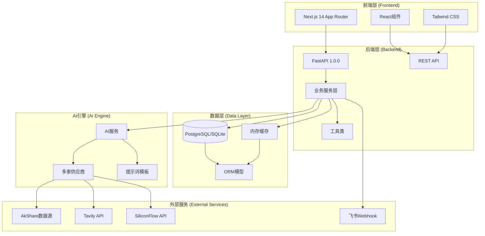
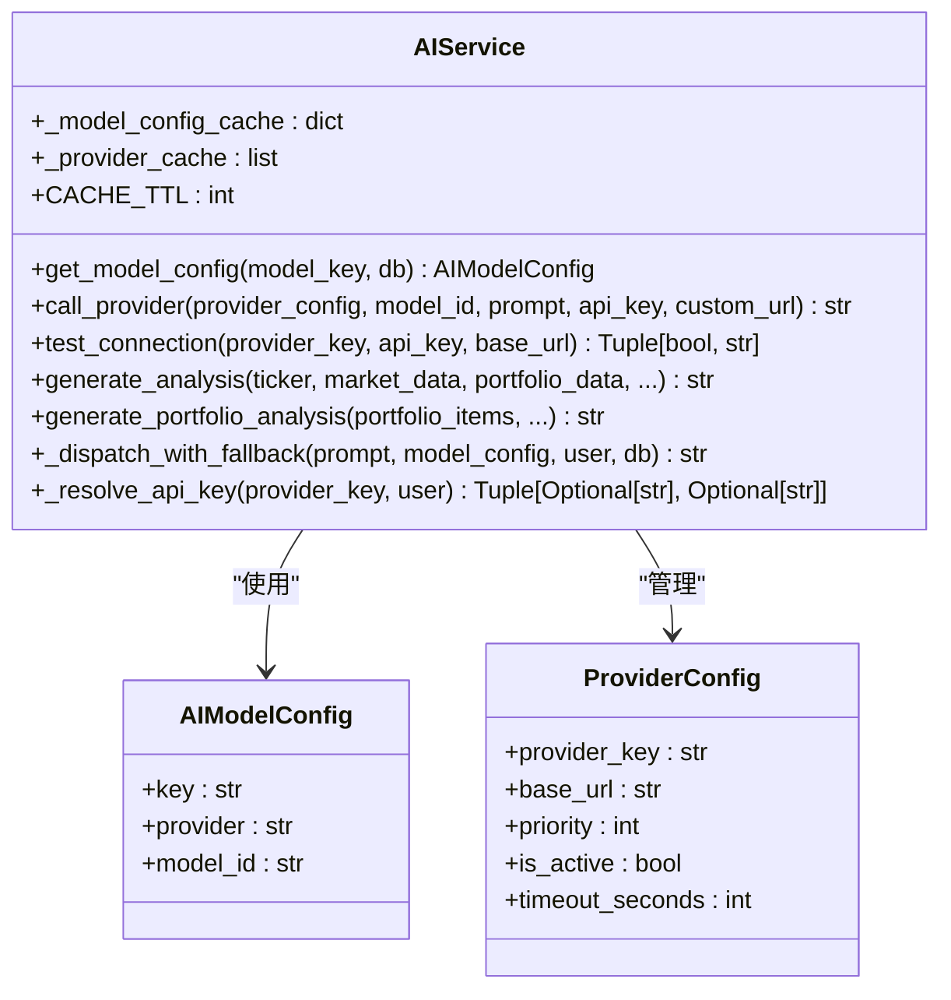
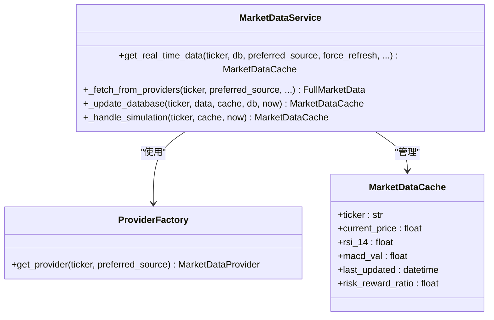
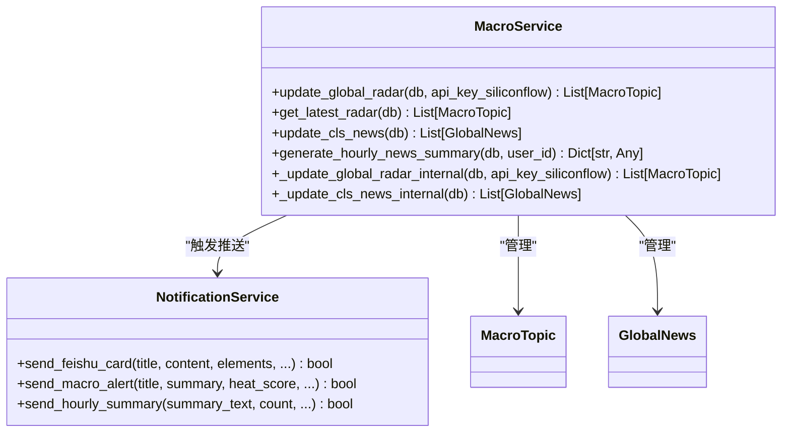
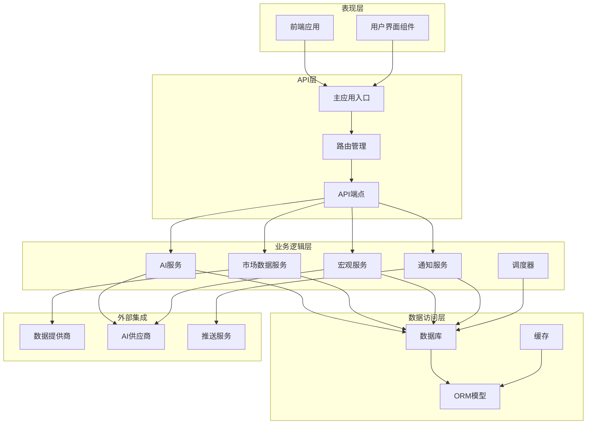
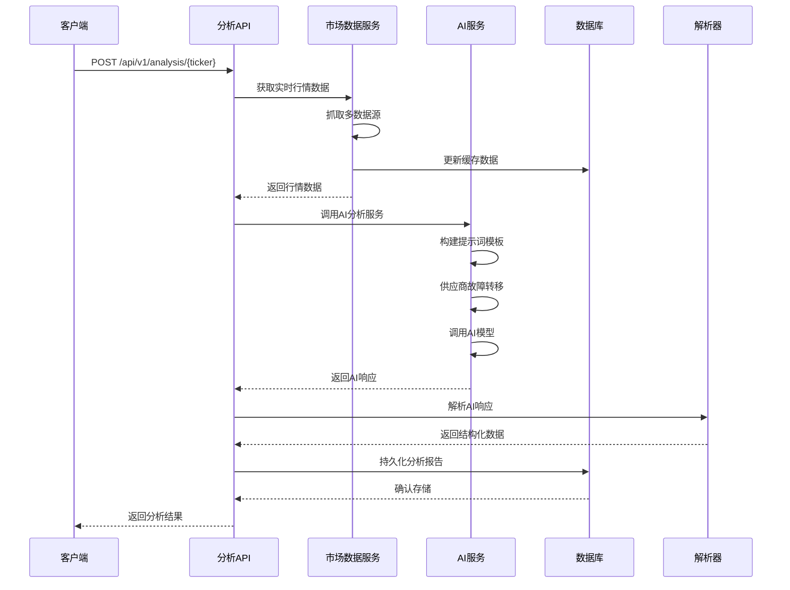
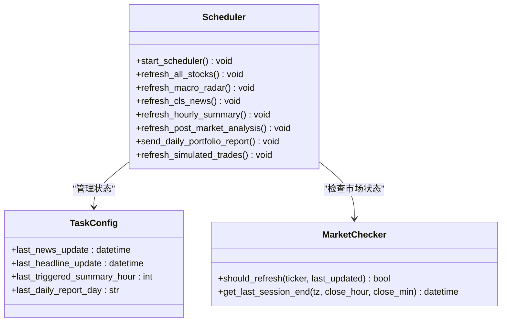
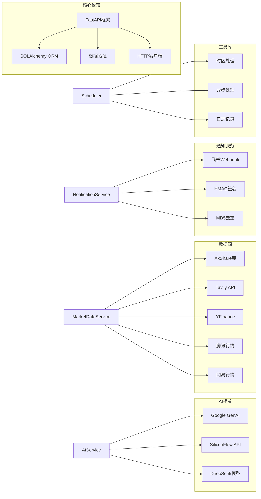

# 增强型AI分析服务

<cite>
**本文档引用的文件**
- [README.md](file://README.md)
- [backend/app/main.py](file://backend/app/main.py)
- [backend/app/api/v1/api.py](file://backend/app/api/v1/api.py)
- [backend/app/core/config.py](file://backend/app/core/config.py)
- [backend/app/services/ai_service.py](file://backend/app/services/ai_service.py)
- [backend/app/core/prompts.py](file://backend/app/core/prompts.py)
- [backend/app/models/analysis.py](file://backend/app/models/analysis.py)
- [backend/app/api/v1/endpoints/analysis.py](file://backend/app/api/v1/endpoints/analysis.py)
- [backend/app/services/macro_service.py](file://backend/app/services/macro_service.py)
- [backend/app/services/notification_service.py](file://backend/app/services/notification_service.py)
- [backend/app/services/scheduler.py](file://backend/app/services/scheduler.py)
- [backend/app/services/market_data.py](file://backend/app/services/market_data.py)
- [backend/app/models/macro.py](file://backend/app/models/macro.py)
- [backend/app/models/user.py](file://backend/app/models/user.py)
- [backend/app/utils/ai_response_parser.py](file://backend/app/utils/ai_response_parser.py)
</cite>

## 目录
1. [项目概述](#项目概述)
2. [系统架构](#系统架构)
3. [核心组件](#核心组件)
4. [架构概览](#架构概览)
5. [详细组件分析](#详细组件分析)
6. [依赖关系分析](#依赖关系分析)
7. [性能考虑](#性能考虑)
8. [故障排除指南](#故障排除指南)
9. [结论](#结论)

## 项目概述

增强型AI分析服务是一个工业级AI量化决策辅助系统，基于Next.js 14与FastAPI构建，深度整合DeepSeek研判模型与国内避墙数据源。该系统专为中国大陆用户提供优化的数据抓取和可视化体验。

### 核心特性

**精准量化可视化 (Trade Axis)**
- 决策价位锚定坐标系：摒弃常规等分刻度，采用核心价位驱动的非线性坐标轴
- 视觉冲突规避：自动处理重合价位的渲染逻辑，确保决策点100%视觉对齐

**全球宏观热点雷达 (Macro Radar)**
- 5小时自动巡检：定时全网扫描影响市场的宏观事件、地缘政治风险及货币政策转向
- 高可用推送体系：飞书BOT集成、断网/额度降级、智能去重

**大陆环境深度优化**
- 零代理数据抓取：深度利用AkShare避开yfinance等海外网络依赖
- 混合行情引擎：美股采用腾讯/新浪行情镜像，A股采用东财/网易镜像
- 全栈时区管理：支持从数据库底层到前端UI的统一时区偏移配置

**机构级AI研判逻辑**
- DeepSeek-R1驱动：使用SiliconFlow高速接口进行深度逻辑推演
- 盈亏比强制校验：系统自动计算目标盈利空间与潜在止损空间的比例

**可解释性AI (Explainable AI)**
- 端到端逻辑溯源：AI在输出研判结论时，强制对齐具体的指标数据
- 交互式验证：用户点击结论中的引用标签，前端自动滚动并高亮闪烁对应的技术指标卡片

**AI信号复盘系统 (The Truth Tracker)**
- 真实胜率追踪：自动记录历史AI信号及其发布时的时价
- 实时P&L统计：根据当前市价动态计算每一笔建议的"预期盈亏"

## 系统架构

**图表来源**
- [backend/app/main.py:27-31](file://backend/app/main.py#L27-L31)
- [backend/app/api/v1/api.py:1-33](file://backend/app/api/v1/api.py#L1-L33)
- [backend/app/services/ai_service.py:22-56](file://backend/app/services/ai_service.py#L22-L56)

## 核心组件

### AI服务层 (AIService)

AI服务层是整个系统的核心，负责统一管理多个AI供应商的调用和故障转移机制。

**图表来源**
- [backend/app/services/ai_service.py:22-254](file://backend/app/services/ai_service.py#L22-L254)

### 数据服务层 (MarketDataService)

数据服务层负责从多个外部数据源获取实时行情数据，支持多种数据源的故障转移。

**图表来源**
- [backend/app/services/market_data.py:19-407](file://backend/app/services/market_data.py#L19-L407)

### 宏观服务层 (MacroService)

宏观服务层负责全球宏观事件的监控和分析，提供宏观雷达和新闻推送功能。

**图表来源**
- [backend/app/services/macro_service.py:21-442](file://backend/app/services/macro_service.py#L21-L442)

**章节来源**
- [backend/app/services/ai_service.py:22-254](file://backend/app/services/ai_service.py#L22-L254)
- [backend/app/services/market_data.py:19-407](file://backend/app/services/market_data.py#L19-L407)
- [backend/app/services/macro_service.py:21-442](file://backend/app/services/macro_service.py#L21-L442)

## 架构概览

系统采用分层架构设计，确保各层职责清晰、松耦合：

**图表来源**
- [backend/app/main.py:1-146](file://backend/app/main.py#L1-L146)
- [backend/app/api/v1/api.py:1-33](file://backend/app/api/v1/api.py#L1-L33)

## 详细组件分析

### AI分析工作流

AI分析工作流展示了从用户请求到AI分析再到结果存储的完整流程：

**图表来源**
- [backend/app/api/v1/endpoints/analysis.py:241-626](file://backend/app/api/v1/endpoints/analysis.py#L241-L626)
- [backend/app/services/ai_service.py:213-254](file://backend/app/services/ai_service.py#L213-L254)

### 宏观雷达更新流程

宏观雷达更新流程展示了系统如何自动监控全球宏观事件并推送相关信息：

**图表来源**
- [backend/app/services/macro_service.py:23-236](file://backend/app/services/macro_service.py#L23-L236)

### 调度器核心功能

调度器负责系统后台任务的协调和执行：

**图表来源**
- [backend/app/services/scheduler.py:566-643](file://backend/app/services/scheduler.py#L566-L643)

**章节来源**
- [backend/app/api/v1/endpoints/analysis.py:241-745](file://backend/app/api/v1/endpoints/analysis.py#L241-L745)
- [backend/app/services/macro_service.py:23-442](file://backend/app/services/macro_service.py#L23-L442)
- [backend/app/services/scheduler.py:1-643](file://backend/app/services/scheduler.py#L1-L643)

## 依赖关系分析

系统采用模块化设计，各组件之间通过清晰的接口进行通信：

**图表来源**
- [backend/app/core/config.py:1-36](file://backend/app/core/config.py#L1-L36)
- [backend/app/services/ai_service.py:1-12](file://backend/app/services/ai_service.py#L1-L12)

**章节来源**
- [backend/app/core/config.py:1-36](file://backend/app/core/config.py#L1-L36)
- [backend/app/services/ai_service.py:1-12](file://backend/app/services/ai_service.py#L1-L12)

## 性能考虑

### 缓存策略

系统实现了多层次的缓存机制来提升性能：

1. **模型配置缓存**：AI模型配置缓存5分钟，减少数据库查询
2. **供应商配置缓存**：供应商列表缓存10分钟，支持动态更新
3. **市场数据缓存**：行情数据缓存1分钟，支持价格模式和完整模式
4. **响应解析缓存**：解析器结果缓存，避免重复解析

### 异步处理

系统广泛采用异步编程模式：

- **并发抓取**：多个数据源并行抓取，使用信号量控制并发度
- **异步通知**：飞书推送使用异步客户端，避免阻塞主线程
- **后台任务**：定时任务使用独立协程，不影响主服务响应

### 数据库优化

- **批量操作**：新闻数据批量插入，减少数据库往返
- **原子操作**：使用PostgreSQL的ON CONFLICT DO UPDATE减少查询次数
- **索引优化**：关键查询字段建立索引，如用户邮箱、股票代码等

## 故障排除指南

### 常见问题及解决方案

**AI服务连接失败**
- 检查API密钥配置是否正确
- 验证供应商可用性，查看供应商列表
- 检查网络连接和防火墙设置

**数据抓取超时**
- 检查数据源可用性（AkShare、Tavily等）
- 调整超时参数和重试机制
- 查看API配额限制

**推送通知失败**
- 验证飞书Webhook URL配置
- 检查签名密钥设置
- 查看通知日志了解具体错误

**性能问题**
- 检查数据库连接池配置
- 监控CPU和内存使用情况
- 优化查询语句和索引

**章节来源**
- [backend/app/services/ai_service.py:140-159](file://backend/app/services/ai_service.py#L140-L159)
- [backend/app/services/notification_service.py:19-127](file://backend/app/services/notification_service.py#L19-L127)

## 结论

增强型AI分析服务是一个功能完整、架构清晰的工业级AI量化决策系统。系统通过模块化设计实现了高度的可扩展性和可维护性，同时提供了丰富的AI分析功能和用户体验。

### 主要优势

1. **多供应商架构**：支持多家AI供应商，提供故障转移和负载均衡
2. **数据源多样化**：整合国内外多个数据源，确保数据质量和稳定性
3. **可解释性AI**：提供完整的分析逻辑溯源，增强用户信任度
4. **自动化程度高**：完善的调度系统，支持定时任务和实时监控
5. **用户体验优秀**：直观的可视化界面和丰富的通知功能

### 技术亮点

- **异步架构**：全面采用异步编程，提升系统吞吐量
- **缓存策略**：多层次缓存机制，优化响应时间和资源使用
- **监控告警**：完善的日志记录和错误处理机制
- **安全设计**：API密钥加密存储和传输，确保数据安全

该系统为用户提供了一个强大而可靠的AI分析平台，能够有效辅助投资决策，提升投资效率和成功率。