# 增强型AI分析服务

<cite>
**本文档引用的文件**
- [README.md](file://README.md)
- [backend/app/main.py](file://backend/app/main.py)
- [backend/app/api/v1/api.py](file://backend/app/api/v1/api.py)
- [backend/app/core/config.py](file://backend/app/core/config.py)
- [backend/app/services/ai_service.py](file://backend/app/services/ai_service.py)
- [backend/app/core/prompts.py](file://backend/app/core/prompts.py)
- [backend/app/models/analysis.py](file://backend/app/models/analysis.py)
- [backend/app/api/v1/endpoints/analysis.py](file://backend/app/api/v1/endpoints/analysis.py)
- [backend/app/application/analysis/analyze_stock.py](file://backend/app/application/analysis/analyze_stock.py)
- [backend/app/application/analysis/analyze_portfolio.py](file://backend/app/application/analysis/analyze_portfolio.py)
- [backend/app/application/analysis/helpers.py](file://backend/app/application/analysis/helpers.py)
- [backend/app/application/analysis/mappers.py](file://backend/app/application/analysis/mappers.py)
- [backend/app/application/analysis/query_analysis.py](file://backend/app/application/analysis/query_analysis.py)
- [backend/app/application/portfolio/query_portfolio.py](file://backend/app/application/portfolio/query_portfolio.py)
- [backend/app/infrastructure/db/repositories/analysis_repository.py](file://backend/app/infrastructure/db/repositories/analysis_repository.py)
- [backend/app/infrastructure/db/repositories/portfolio_repository.py](file://backend/app/infrastructure/db/repositories/portfolio_repository.py)
- [backend/app/schemas/analysis.py](file://backend/app/schemas/analysis.py)
- [backend/app/services/macro_service.py](file://backend/app/services/macro_service.py)
- [backend/app/services/notification_service.py](file://backend/app/services/notification_service.py)
- [backend/app/services/scheduler.py](file://backend/app/services/scheduler.py)
- [backend/app/services/market_data.py](file://backend/app/services/market_data.py)
- [backend/app/services/market_data_fetcher.py](file://backend/app/services/market_data_fetcher.py)
- [backend/app/services/market_providers/ibkr.py](file://backend/app/services/market_providers/ibkr.py)
- [backend/app/models/macro.py](file://backend/app/models/macro.py)
- [backend/app/models/user.py](file://backend/app/models/user.py)
- [backend/app/utils/ai_response_parser.py](file://backend/app/utils/ai_response_parser.py)
- [backend/app/utils/json_logger.py](file://backend/app/utils/json_logger.py)
- [frontend/features/dashboard/hooks/useDashboardStockDetailData.ts](file://frontend/features/dashboard/hooks/useDashboardStockDetailData.ts)
- [frontend/features/macro/api.ts](file://frontend/features/macro/api.ts)
- [frontend/shared/api/client.ts](file://frontend/shared/api/client.ts)
- [scripts/start.sh](file://scripts/start.sh)
</cite>

## 更新摘要
**变更内容**
- 新增并行数据获取架构，支持多数据源并行抓取和处理
- 改进宏观分析服务，增强AI分析能力和性能监控
- 新增结构化JSON日志系统，提供完整的性能监控能力
- 优化前端并行加载机制，提升用户体验
- 增强AI响应解析和错误处理机制

## 目录
1. [项目概述](#项目概述)
2. [系统架构](#系统架构)
3. [核心组件](#核心组件)
4. [架构概览](#架构概览)
5. [详细组件分析](#详细组件分析)
6. [分析应用层架构](#分析应用层架构)
7. [并行数据获取架构](#并行数据获取架构)
8. [性能监控系统](#性能监控系统)
9. [依赖关系分析](#依赖关系分析)
10. [性能考虑](#性能考虑)
11. [故障排除指南](#故障排除指南)
12. [结论](#结论)

## 项目概述

增强型AI分析服务是一个工业级AI量化决策辅助系统，基于Next.js 14与FastAPI构建，深度整合DeepSeek研判模型与国内避墙数据源。该系统专为中国大陆用户提供优化的数据抓取和可视化体验。

### 核心特性

**精准量化可视化 (Trade Axis)**
- 决策价位锚定坐标系：摒弃常规等分刻度，采用核心价位驱动的非线性坐标轴
- 视觉冲突规避：自动处理重合价位的渲染逻辑，确保决策点100%视觉对齐

**全球宏观热点雷达 (Macro Radar)**
- 5小时自动巡检：定时全网扫描影响市场的宏观事件、地缘政治风险及货币政策转向
- 高可用推送体系：飞书BOT集成、断网/额度降级、智能去重

**大陆环境深度优化**
- 零代理数据抓取：深度利用AkShare避开yfinance等海外网络依赖
- 混合行情引擎：美股采用腾讯/新浪行情镜像，A股采用东财/网易镜像
- 全栈时区管理：支持从数据库底层到前端UI的统一时区偏移配置

**机构级AI研判逻辑**
- DeepSeek-R1驱动：使用SiliconFlow高速接口进行深度逻辑推演
- 盈亏比强制校验：系统自动计算目标盈利空间与潜在止损空间的比例

**可解释性AI (Explainable AI)**
- 端到端逻辑溯源：AI在输出研判结论时，强制对齐具体的指标数据
- 交互式验证：用户点击结论中的引用标签，前端自动滚动并高亮闪烁对应的技术指标卡片

**AI信号复盘系统 (The Truth Tracker)**
- 真实胜率追踪：自动记录历史AI信号及其发布时的时价
- 实时P&L统计：根据当前市价动态计算每一笔建议的"预期盈亏"

## 系统架构

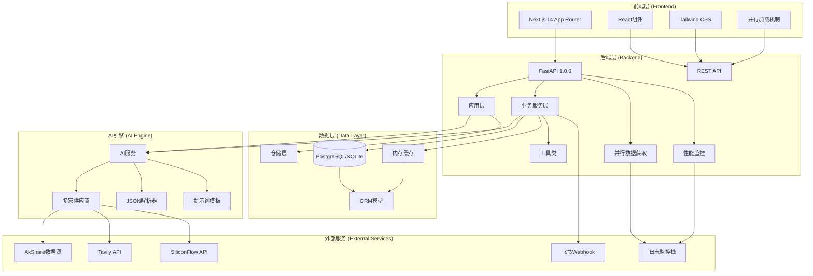

**图表来源**
- [backend/app/main.py:27-31](file://backend/app/main.py#L27-L31)
- [backend/app/api/v1/api.py:1-33](file://backend/app/api/v1/api.py#L1-L33)
- [backend/app/services/ai_service.py:22-56](file://backend/app/services/ai_service.py#L22-L56)
- [backend/app/utils/json_logger.py:11-80](file://backend/app/utils/json_logger.py#L11-L80)

## 核心组件

### AI服务层 (AIService)

AI服务层是整个系统的核心，负责统一管理多个AI供应商的调用和故障转移机制。

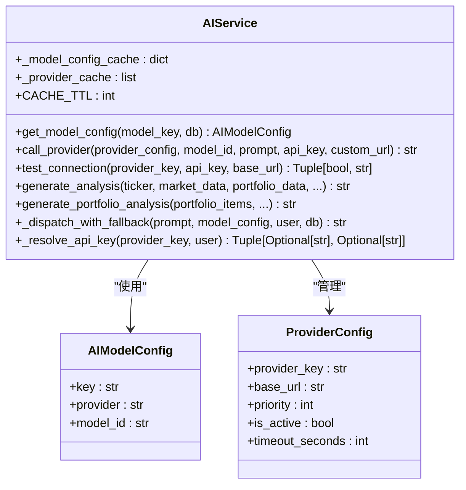

**图表来源**
- [backend/app/services/ai_service.py:22-254](file://backend/app/services/ai_service.py#L22-L254)

### 数据服务层 (MarketDataService)

数据服务层负责从多个外部数据源获取实时行情数据，支持多种数据源的故障转移。

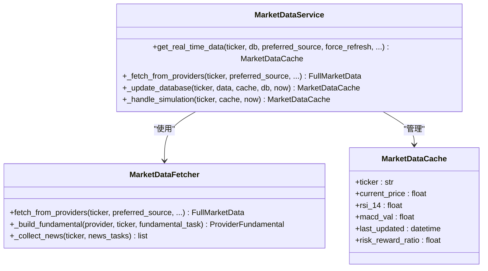

**图表来源**
- [backend/app/services/market_data.py:19-407](file://backend/app/services/market_data.py#L19-L407)
- [backend/app/services/market_data_fetcher.py:12-165](file://backend/app/services/market_data_fetcher.py#L12-L165)

### 宏观服务层 (MacroService)

宏观服务层负责全球宏观事件的监控和分析，提供宏观雷达和新闻推送功能。

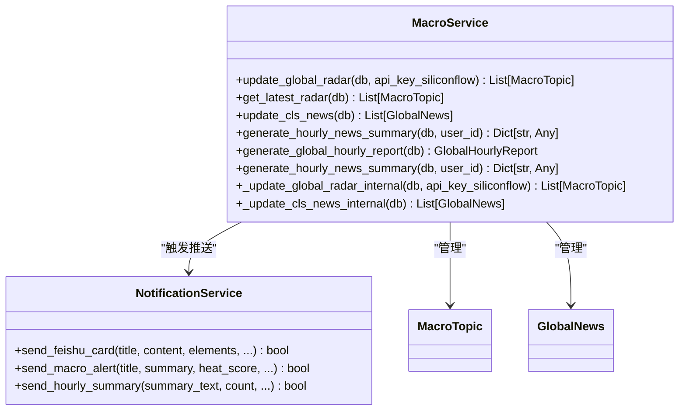

**图表来源**
- [backend/app/services/macro_service.py:21-442](file://backend/app/services/macro_service.py#L21-L442)

**章节来源**
- [backend/app/services/ai_service.py:22-254](file://backend/app/services/ai_service.py#L22-L254)
- [backend/app/services/market_data.py:19-407](file://backend/app/services/market_data.py#L19-L407)
- [backend/app/services/macro_service.py:21-442](file://backend/app/services/macro_service.py#L21-L442)

## 架构概览

系统采用分层架构设计，确保各层职责清晰、松耦合：

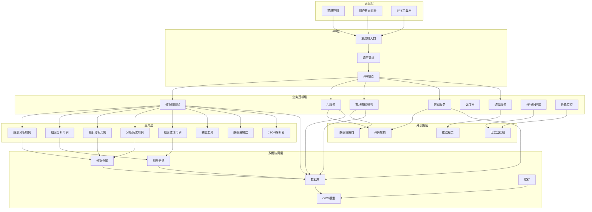

**图表来源**
- [backend/app/main.py:1-146](file://backend/app/main.py#L1-L146)
- [backend/app/api/v1/api.py:1-33](file://backend/app/api/v1/api.py#L1-L33)

## 详细组件分析

### AI分析工作流

AI分析工作流展示了从用户请求到AI分析再到结果存储的完整流程：

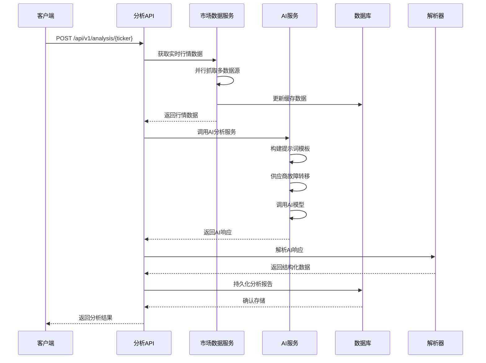

**图表来源**
- [backend/app/api/v1/endpoints/analysis.py:241-626](file://backend/app/api/v1/endpoints/analysis.py#L241-L626)
- [backend/app/services/ai_service.py:213-254](file://backend/app/services/ai_service.py#L213-L254)

### 宏观雷达更新流程

宏观雷达更新流程展示了系统如何自动监控全球宏观事件并推送相关信息：

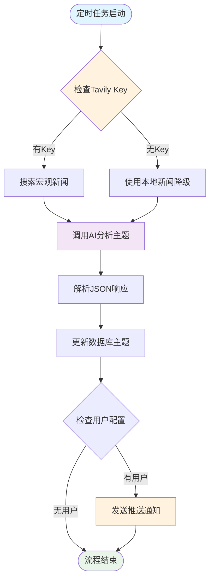

**图表来源**
- [backend/app/services/macro_service.py:23-236](file://backend/app/services/macro_service.py#L23-L236)

### 调度器核心功能

调度器负责系统后台任务的协调和执行：

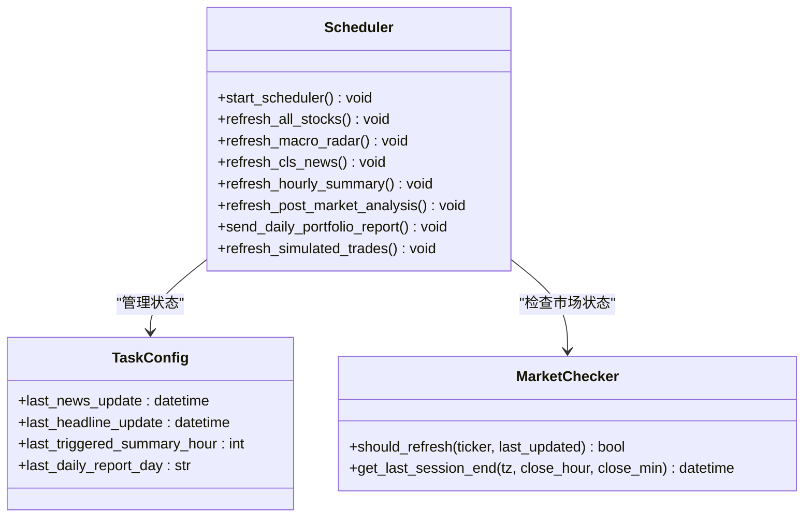

**图表来源**
- [backend/app/services/scheduler.py:566-643](file://backend/app/services/scheduler.py#L566-L643)

**章节来源**
- [backend/app/api/v1/endpoints/analysis.py:241-745](file://backend/app/api/v1/endpoints/analysis.py#L241-L745)
- [backend/app/services/macro_service.py:23-442](file://backend/app/services/macro_service.py#L23-L442)
- [backend/app/services/scheduler.py:1-643](file://backend/app/services/scheduler.py#L1-L643)

## 分析应用层架构

### 分析用例层

分析应用层是新增的核心架构，负责封装具体的业务用例和工作流程：

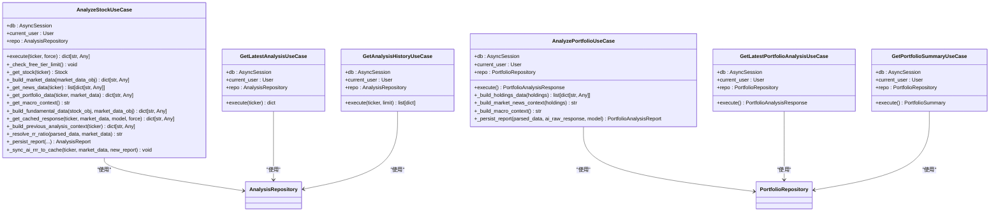

**图表来源**
- [backend/app/application/analysis/analyze_stock.py:28-404](file://backend/app/application/analysis/analyze_stock.py#L28-L404)
- [backend/app/application/analysis/analyze_portfolio.py:23-178](file://backend/app/application/analysis/analyze_portfolio.py#L23-L178)
- [backend/app/application/analysis/query_analysis.py:17-57](file://backend/app/application/analysis/query_analysis.py#L17-L57)
- [backend/app/application/portfolio/query_portfolio.py:16-62](file://backend/app/application/portfolio/query_portfolio.py#L16-L62)

### 分析数据模型

分析应用层引入了专门的数据模型来支持结构化的分析结果存储：

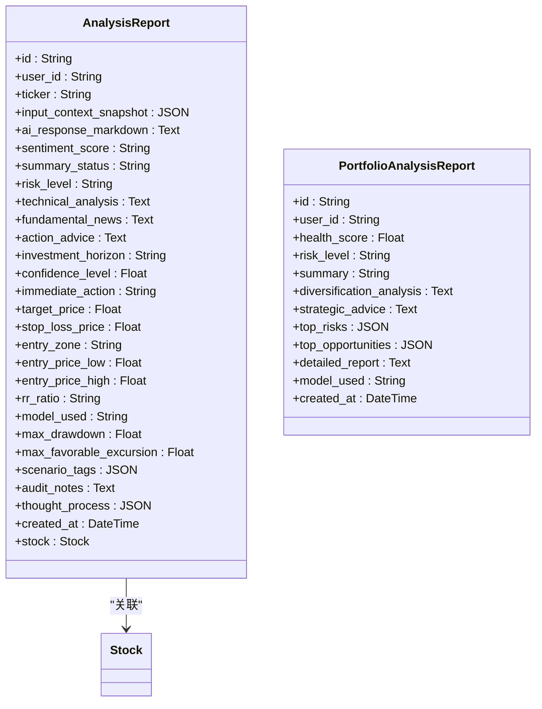

**图表来源**
- [backend/app/models/analysis.py:17-92](file://backend/app/models/analysis.py#L17-L92)

### 分析辅助工具

分析应用层包含多个辅助模块来支持数据处理和转换：

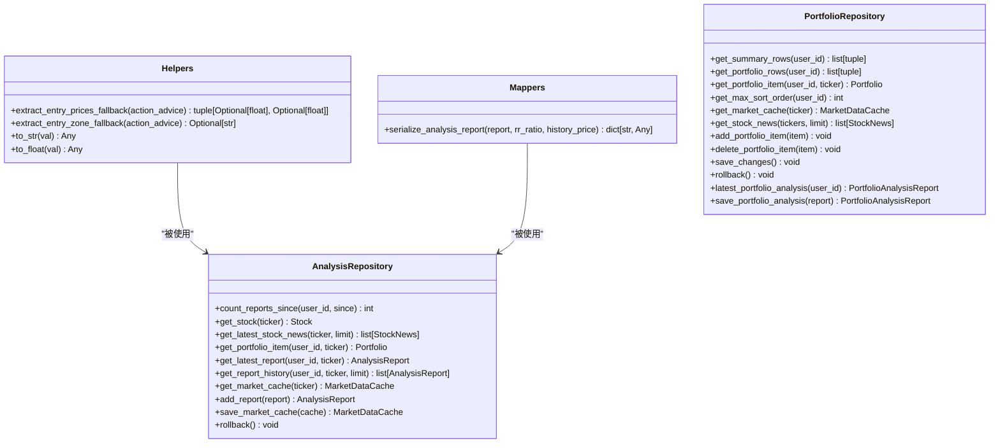

**图表来源**
- [backend/app/application/analysis/helpers.py:4-54](file://backend/app/application/analysis/helpers.py#L4-L54)
- [backend/app/application/analysis/mappers.py:12-51](file://backend/app/application/analysis/mappers.py#L12-L51)
- [backend/app/infrastructure/db/repositories/analysis_repository.py:12-80](file://backend/app/infrastructure/db/repositories/analysis_repository.py#L12-L80)
- [backend/app/infrastructure/db/repositories/portfolio_repository.py:9-91](file://backend/app/infrastructure/db/repositories/portfolio_repository.py#L9-L91)

**章节来源**
- [backend/app/application/analysis/analyze_stock.py:28-404](file://backend/app/application/analysis/analyze_stock.py#L28-L404)
- [backend/app/application/analysis/analyze_portfolio.py:23-178](file://backend/app/application/analysis/analyze_portfolio.py#L23-L178)
- [backend/app/application/analysis/query_analysis.py:17-57](file://backend/app/application/analysis/query_analysis.py#L17-L57)
- [backend/app/application/analysis/helpers.py:4-54](file://backend/app/application/analysis/helpers.py#L4-L54)
- [backend/app/application/analysis/mappers.py:12-51](file://backend/app/application/analysis/mappers.py#L12-L51)
- [backend/app/infrastructure/db/repositories/analysis_repository.py:12-80](file://backend/app/infrastructure/db/repositories/analysis_repository.py#L12-L80)
- [backend/app/infrastructure/db/repositories/portfolio_repository.py:9-91](file://backend/app/infrastructure/db/repositories/portfolio_repository.py#L9-L91)

## 并行数据获取架构

### 并行数据获取机制

系统实现了全面的并行数据获取架构，显著提升了数据获取效率：

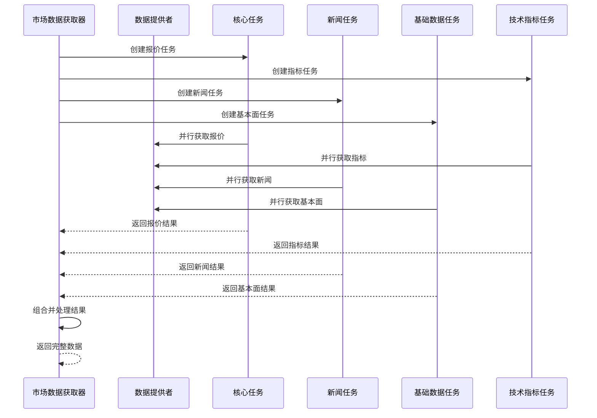

**图表来源**
- [backend/app/services/market_data_fetcher.py:35-94](file://backend/app/services/market_data_fetcher.py#L35-L94)
- [backend/app/services/market_providers/ibkr.py:503-540](file://backend/app/services/market_providers/ibkr.py#L503-L540)

### 并行处理优化

系统在多个层面实现了并行处理优化：

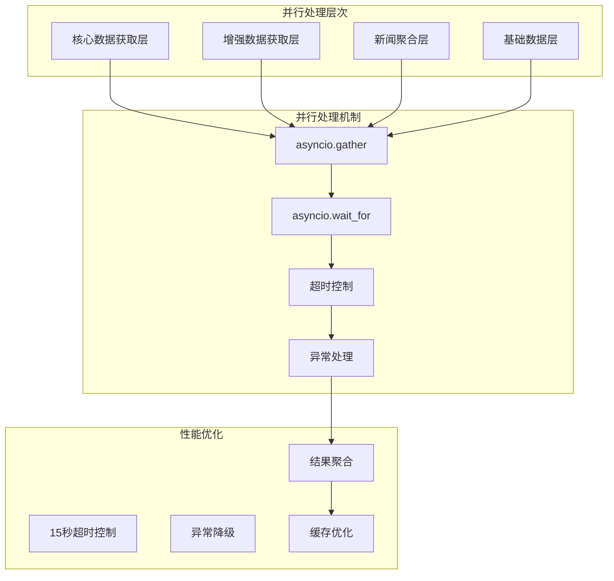

**图表来源**
- [backend/app/services/market_data_fetcher.py:59-74](file://backend/app/services/market_data_fetcher.py#L59-L74)
- [backend/app/services/market_data_fetcher.py:134-138](file://backend/app/services/market_data_fetcher.py#L134-L138)

**章节来源**
- [backend/app/services/market_data_fetcher.py:12-165](file://backend/app/services/market_data_fetcher.py#L12-L165)
- [backend/app/services/market_providers/ibkr.py:503-540](file://backend/app/services/market_providers/ibkr.py#L503-L540)

## 性能监控系统

### 结构化JSON日志系统

系统实现了完整的结构化JSON日志监控系统，提供详细的性能监控能力：

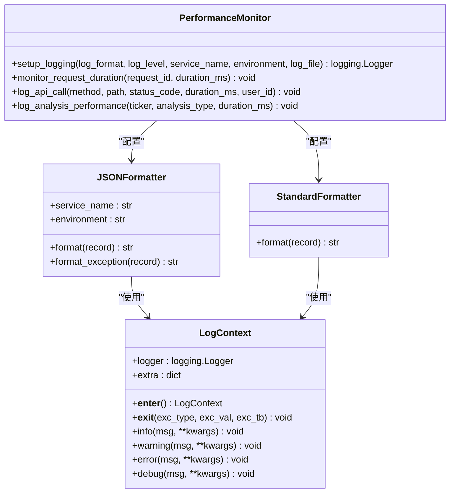

**图表来源**
- [backend/app/utils/json_logger.py:11-203](file://backend/app/utils/json_logger.py#L11-L203)

### 性能监控指标

系统监控以下关键性能指标：

1. **API调用性能**：请求处理时间、状态码分布、用户行为跟踪
2. **AI分析性能**：模型调用耗时、供应商响应时间、故障转移统计
3. **数据获取性能**：并行抓取耗时、超时率、成功率统计
4. **系统资源监控**：内存使用、CPU负载、数据库连接数

### 日志结构化

系统输出标准化的JSON日志格式：

```json
{
  "timestamp": "2024-01-15T10:30:45.123456Z",
  "level": "INFO",
  "logger": "api_logger",
  "message": "Request completed",
  "request_id": "abc-123",
  "user_id": "user-456",
  "duration_ms": 45.67,
  "status_code": 200,
  "method": "GET",
  "path": "/api/v1/portfolio",
  "service": "ai-stock-advisor",
  "environment": "production",
  "file": "api.py",
  "line": 123,
  "function": "handle_request"
}
```

**章节来源**
- [backend/app/utils/json_logger.py:11-203](file://backend/app/utils/json_logger.py#L11-L203)

## 依赖关系分析

系统采用模块化设计，各组件之间通过清晰的接口进行通信：

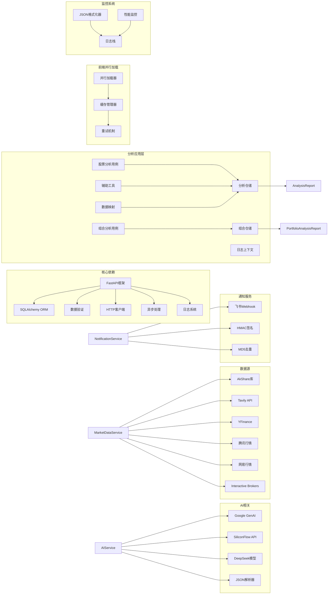

**图表来源**
- [backend/app/core/config.py:1-36](file://backend/app/core/config.py#L1-L36)
- [backend/app/services/ai_service.py:1-12](file://backend/app/services/ai_service.py#L1-L12)

**章节来源**
- [backend/app/core/config.py:1-36](file://backend/app/core/config.py#L1-L36)
- [backend/app/services/ai_service.py:1-12](file://backend/app/services/ai_service.py#L1-L12)

## 性能考虑

### 缓存策略

系统实现了多层次的缓存机制来提升性能：

1. **模型配置缓存**：AI模型配置缓存5分钟，减少数据库查询
2. **供应商配置缓存**：供应商列表缓存10分钟，支持动态更新
3. **市场数据缓存**：行情数据缓存1分钟，支持价格模式和完整模式
4. **响应解析缓存**：解析器结果缓存，避免重复解析
5. **分析结果缓存**：分析报告缓存，支持快速响应和历史查询

### 异步处理

系统广泛采用异步编程模式：

- **并发抓取**：多个数据源并行抓取，使用信号量控制并发度
- **异步通知**：飞书推送使用异步客户端，避免阻塞主线程
- **后台任务**：定时任务使用独立协程，不影响主服务响应
- **并行分析**：投资组合中的多个标的并行分析，提升整体性能

### 数据库优化

- **批量操作**：新闻数据批量插入，减少数据库往返
- **原子操作**：使用PostgreSQL的ON CONFLICT DO UPDATE减少查询次数
- **索引优化**：关键查询字段建立索引，如用户邮箱、股票代码等
- **分析报告索引**：分析报告按用户ID和创建时间建立复合索引

### 分析应用层优化

- **并发限制**：分析用例使用信号量控制并发，避免过度消耗资源
- **缓存优先**：优先返回缓存的分析结果，减少AI调用次数
- **增量更新**：只更新必要的字段，避免全量更新
- **错误恢复**：分析失败时自动回滚，保证数据一致性

### 前端并行加载优化

- **Promise.all并行请求**：前端同时发起多个API请求，提升加载速度
- **缓存策略**：10分钟缓存策略，平衡数据新鲜度和性能
- **错误处理**：优雅的错误处理和重试机制
- **用户体验**：加载状态管理和防抖处理

### 性能监控优化

- **结构化日志**：完整的请求追踪和性能指标收集
- **异常监控**：自动捕获和上报系统异常
- **资源监控**：实时监控系统资源使用情况
- **性能告警**：基于阈值的性能告警机制

**章节来源**
- [frontend/features/dashboard/hooks/useDashboardStockDetailData.ts:61-76](file://frontend/features/dashboard/hooks/useDashboardStockDetailData.ts#L61-L76)
- [backend/app/utils/json_logger.py:111-166](file://backend/app/utils/json_logger.py#L111-L166)

## 故障排除指南

### 常见问题及解决方案

**AI服务连接失败**
- 检查API密钥配置是否正确
- 验证供应商可用性，查看供应商列表
- 检查网络连接和防火墙设置

**数据抓取超时**
- 检查数据源可用性（AkShare、Tavily等）
- 调整超时参数和重试机制
- 查看API配额限制

**推送通知失败**
- 验证飞书Webhook URL配置
- 检查签名密钥设置
- 查看通知日志了解具体错误

**分析结果异常**
- 检查AI模型配置和可用性
- 验证输入数据的完整性和准确性
- 查看分析日志和错误信息

**性能问题**
- 检查数据库连接池配置
- 监控CPU和内存使用情况
- 优化查询语句和索引
- 调整并发限制参数

**并行处理问题**
- 检查异步任务的超时设置
- 验证异常处理机制
- 监控并行任务的执行状态

**日志监控问题**
- 检查日志格式配置
- 验证日志输出路径
- 确认日志轮转设置

**章节来源**
- [backend/app/services/ai_service.py:140-159](file://backend/app/services/ai_service.py#L140-L159)
- [backend/app/services/notification_service.py:19-127](file://backend/app/services/notification_service.py#L19-L127)

## 结论

增强型AI分析服务是一个功能完整、架构清晰的工业级AI量化决策系统。系统通过模块化设计实现了高度的可扩展性和可维护性，同时提供了丰富的AI分析功能和用户体验。

### 主要优势

1. **多供应商架构**：支持多家AI供应商，提供故障转移和负载均衡
2. **数据源多样化**：整合国内外多个数据源，确保数据质量和稳定性
3. **可解释性AI**：提供完整的分析逻辑溯源，增强用户信任度
4. **自动化程度高**：完善的调度系统，支持定时任务和实时监控
5. **用户体验优秀**：直观的可视化界面和丰富的通知功能
6. **分析应用层**：新增的专业分析架构，提供更强大的分析能力
7. **投资组合分析**：支持多资产组合的综合分析和风险管理
8. **历史数据分析**：完整的分析历史记录和回测功能
9. **并行数据获取**：全面的并行处理架构，显著提升数据获取效率
10. **性能监控系统**：完整的结构化日志监控，提供详细的性能洞察

### 技术亮点

- **异步架构**：全面采用异步编程，提升系统吞吐量
- **缓存策略**：多层次缓存机制，优化响应时间和资源使用
- **监控告警**：完善的日志记录和错误处理机制
- **安全设计**：API密钥加密存储和传输，确保数据安全
- **分析用例层**：专业的分析业务逻辑封装，提升代码可维护性
- **数据模型设计**：结构化的分析数据存储，支持复杂的分析需求
- **并行处理**：全面的并行数据获取架构，提升系统整体性能
- **性能监控**：完整的结构化日志系统，提供实时性能洞察

该系统为用户提供了一个强大而可靠的AI分析平台，能够有效辅助投资决策，提升投资效率和成功率。通过持续的性能优化和监控改进，系统能够适应不断增长的用户需求和数据规模。