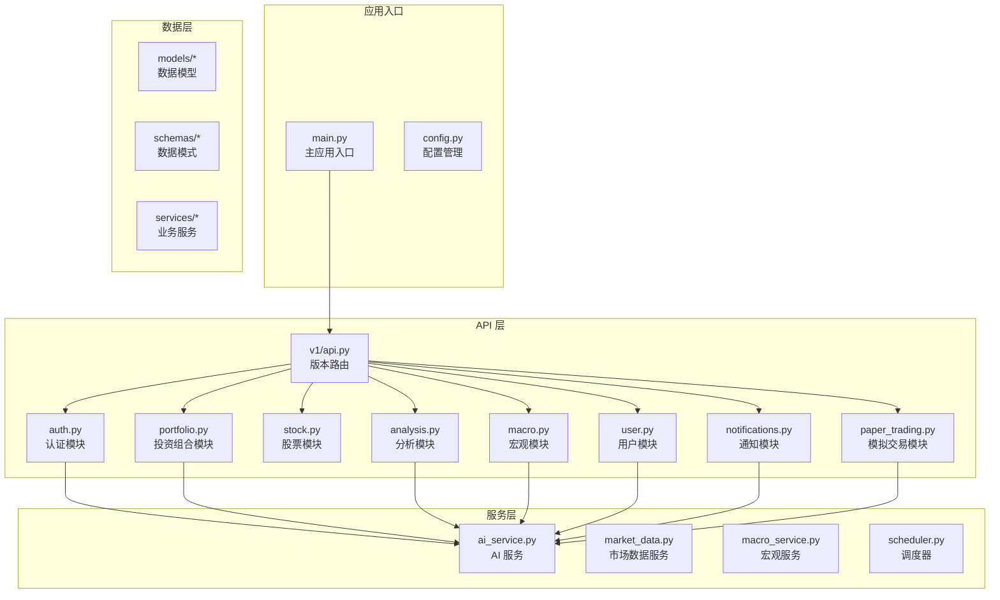
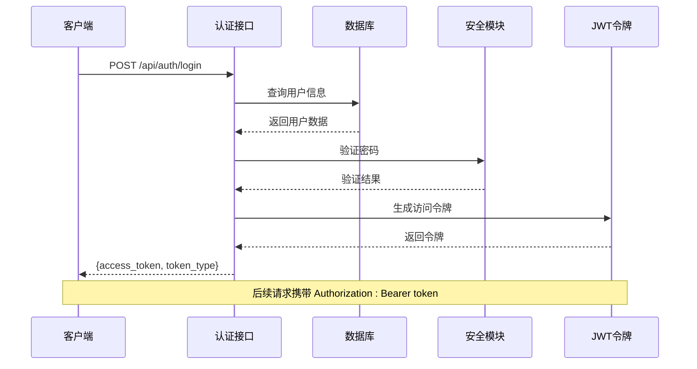
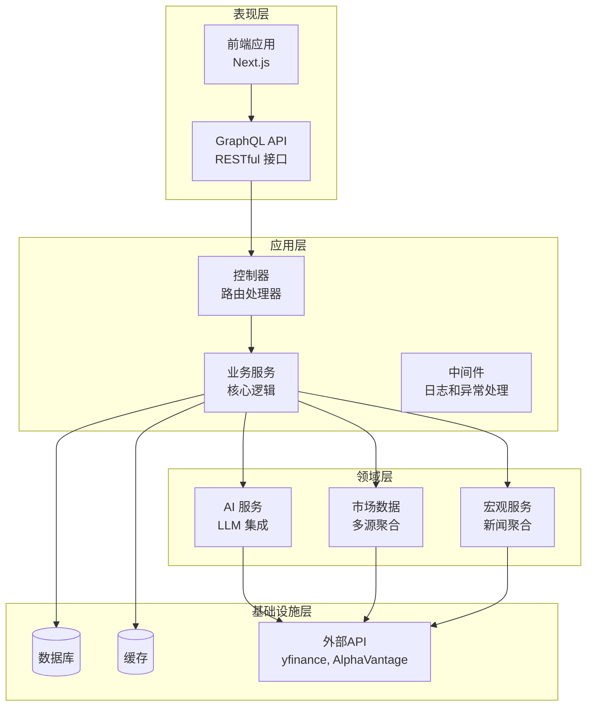
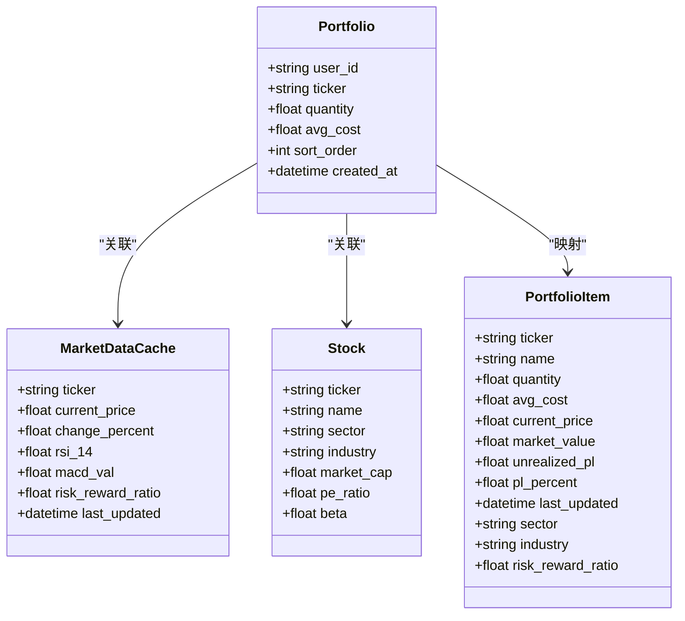
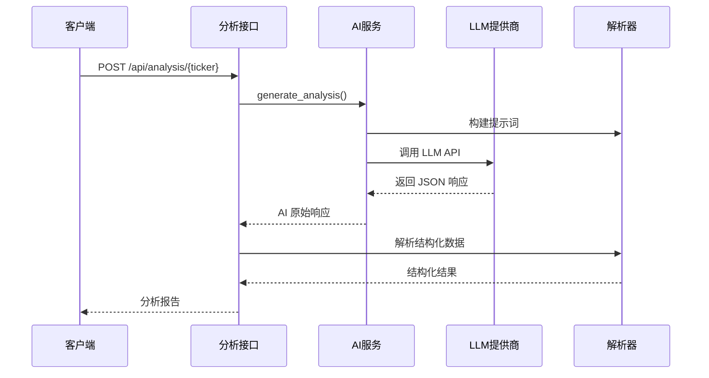
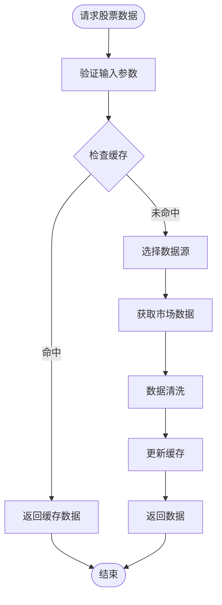
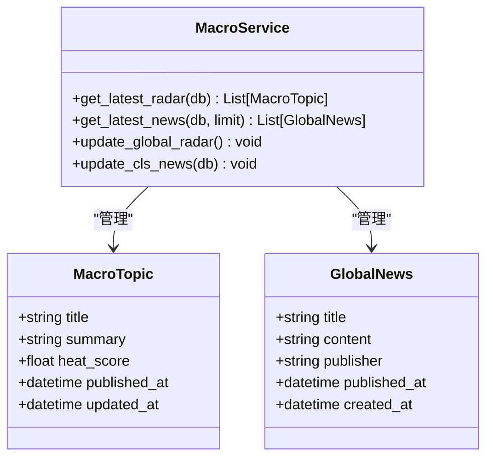
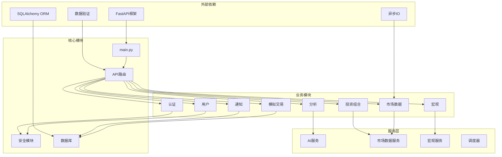
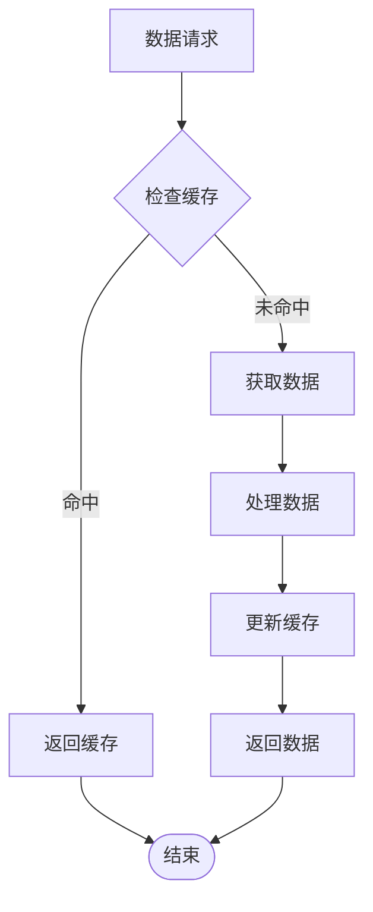

# GraphQL API 文档

<cite>
**本文档引用的文件**
- [backend/app/main.py](file://backend/app/main.py)
- [backend/app/api/v1/api.py](file://backend/app/api/v1/api.py)
- [backend/app/api/v1/endpoints/auth.py](file://backend/app/api/v1/endpoints/auth.py)
- [backend/app/api/v1/endpoints/portfolio.py](file://backend/app/api/v1/endpoints/portfolio.py)
- [backend/app/api/v1/endpoints/stock.py](file://backend/app/api/v1/endpoints/stock.py)
- [backend/app/api/v1/endpoints/analysis.py](file://backend/app/api/v1/endpoints/analysis.py)
- [backend/app/api/v1/endpoints/macro.py](file://backend/app/api/v1/endpoints/macro.py)
- [backend/app/api/v1/endpoints/user.py](file://backend/app/api/v1/endpoints/user.py)
- [backend/app/api/v1/endpoints/notifications.py](file://backend/app/api/v1/endpoints/notifications.py)
- [backend/app/api/v1/endpoints/paper_trading.py](file://backend/app/api/v1/endpoints/paper_trading.py)
- [backend/app/api/deps.py](file://backend/app/api/deps.py)
- [backend/app/core/security.py](file://backend/app/core/security.py)
- [backend/app/services/ai_service.py](file://backend/app/services/ai_service.py)
- [backend/app/schemas/analysis.py](file://backend/app/schemas/analysis.py)
</cite>

## 目录
1. [简介](#简介)
2. [项目结构](#项目结构)
3. [核心组件](#核心组件)
4. [架构概览](#架构概览)
5. [详细组件分析](#详细组件分析)
6. [依赖关系分析](#依赖关系分析)
7. [性能考虑](#性能考虑)
8. [故障排除指南](#故障排除指南)
9. [结论](#结论)

## 简介

这是一个基于 FastAPI 构建的 AI 股票顾问 GraphQL API 服务。该系统集成了多源市场数据、AI 分析能力和实时通知功能，为用户提供智能化的投资决策支持。

**章节来源**
- [backend/app/main.py:1-146](file://backend/app/main.py#L1-L146)

## 项目结构

项目采用模块化设计，按照功能层次组织：

**图表来源**
- [backend/app/main.py:115-139](file://backend/app/main.py#L115-L139)
- [backend/app/api/v1/api.py:1-33](file://backend/app/api/v1/api.py#L1-L33)

**章节来源**
- [backend/app/main.py:1-146](file://backend/app/main.py#L1-L146)
- [backend/app/api/v1/api.py:1-33](file://backend/app/api/v1/api.py#L1-L33)

## 核心组件

### API 路由系统

系统采用 FastAPI 的模块化路由设计，每个业务模块都有独立的路由处理器：

- **认证模块** (`/api/auth`)：处理用户登录、注册和令牌管理
- **投资组合模块** (`/api/portfolio`)：管理用户自选股和持仓
- **股票模块** (`/api/stocks`)：提供股票历史数据和实时行情
- **分析模块** (`/api/analysis`)：AI 驱动的股票和技术分析
- **宏观模块** (`/api/macro`)：全球宏观市场雷达和新闻
- **用户模块** (`/api/user`)：用户设置和个人信息管理
- **通知模块** (`/api/notifications`)：飞书推送历史记录
- **模拟交易模块** (`/api/paper-trading`)：纸面交易功能

### 安全认证机制

系统实现了完整的 JWT 认证流程：

**图表来源**
- [backend/app/api/v1/endpoints/auth.py:24-50](file://backend/app/api/v1/endpoints/auth.py#L24-L50)
- [backend/app/api/deps.py:17-44](file://backend/app/api/deps.py#L17-L44)

**章节来源**
- [backend/app/api/v1/endpoints/auth.py:1-88](file://backend/app/api/v1/endpoints/auth.py#L1-L88)
- [backend/app/api/deps.py:1-45](file://backend/app/api/deps.py#L1-L45)

## 架构概览

系统采用分层架构设计，确保关注点分离和可维护性：

**图表来源**
- [backend/app/main.py:27-47](file://backend/app/main.py#L27-L47)
- [backend/app/services/ai_service.py:22-254](file://backend/app/services/ai_service.py#L22-L254)

## 详细组件分析

### 投资组合管理系统

投资组合模块提供了完整的持仓管理功能：

**图表来源**
- [backend/app/api/v1/endpoints/portfolio.py:159-284](file://backend/app/api/v1/endpoints/portfolio.py#L159-L284)

#### 核心功能特性

1. **智能搜索**：支持本地数据库搜索和远程 API 实时搜索
2. **实时刷新**：并发控制的批量数据刷新机制
3. **风险评估**：内置盈亏比计算和行业分布分析
4. **后台任务**：异步数据补全和缓存更新

**章节来源**
- [backend/app/api/v1/endpoints/portfolio.py:1-513](file://backend/app/api/v1/endpoints/portfolio.py#L1-L513)

### AI 分析引擎

AI 分析模块集成了多个 LLM 提供商，提供智能化的投资建议：

**图表来源**
- [backend/app/api/v1/endpoints/analysis.py:241-626](file://backend/app/api/v1/endpoints/analysis.py#L241-L626)
- [backend/app/services/ai_service.py:214-235](file://backend/app/services/ai_service.py#L214-L235)

#### AI 服务特性

1. **多提供商支持**：Gemini、SiliconFlow、DeepSeek 等
2. **故障转移**：自动切换备用提供商
3. **缓存优化**：智能缓存策略减少 API 调用
4. **结构化解析**：统一的 JSON 解析器

**章节来源**
- [backend/app/api/v1/endpoints/analysis.py:1-745](file://backend/app/api/v1/endpoints/analysis.py#L1-L745)
- [backend/app/services/ai_service.py:1-254](file://backend/app/services/ai_service.py#L1-L254)

### 市场数据服务

股票模块提供了全面的市场数据获取和处理能力：

**图表来源**
- [backend/app/api/v1/endpoints/stock.py:42-122](file://backend/app/api/v1/endpoints/stock.py#L42-L122)

#### 数据处理流程

1. **多源数据聚合**：自动识别股票类型并选择合适的数据源
2. **实时数据刷新**：支持批量和单个股票的并发刷新
3. **数据质量保证**：数值清洗和异常处理
4. **缓存策略**：智能缓存减少重复请求

**章节来源**
- [backend/app/api/v1/endpoints/stock.py:1-123](file://backend/app/api/v1/endpoints/stock.py#L1-L123)

### 宏观市场雷达

宏观模块提供了全球市场的实时监控和分析：

**图表来源**
- [backend/app/api/v1/endpoints/macro.py:15-79](file://backend/app/api/v1/endpoints/macro.py#L15-L79)

**章节来源**
- [backend/app/api/v1/endpoints/macro.py:1-79](file://backend/app/api/v1/endpoints/macro.py#L1-L79)

## 依赖关系分析

系统采用了清晰的依赖注入和模块化设计：

**图表来源**
- [backend/app/main.py:1-146](file://backend/app/main.py#L1-L146)
- [backend/app/api/v1/api.py:1-33](file://backend/app/api/v1/api.py#L1-L33)

**章节来源**
- [backend/app/main.py:1-146](file://backend/app/main.py#L1-L146)
- [backend/app/api/v1/api.py:1-33](file://backend/app/api/v1/api.py#L1-L33)

## 性能考虑

### 并发控制和限流

系统实现了多层次的并发控制机制：

1. **信号量控制**：投资组合刷新使用 `asyncio.Semaphore(3)` 限制并发
2. **批量处理**：支持最多 5 个并发的全量股票刷新
3. **异步任务**：后台任务使用 `asyncio.gather()` 并行执行

### 缓存策略

### 错误处理和恢复

系统具备完善的错误处理机制：

1. **全局异常捕获**：`global_exception_handler` 捕获所有未处理异常
2. **中间件保护**：HTTP 中间件确保请求处理的稳定性
3. **降级策略**：API 调用失败时的回退机制
4. **重试逻辑**：供应商故障时的自动切换

**章节来源**
- [backend/app/main.py:33-47](file://backend/app/main.py#L33-L47)
- [backend/app/api/v1/endpoints/portfolio.py:189-211](file://backend/app/api/v1/endpoints/portfolio.py#L189-L211)

## 故障排除指南

### 常见问题诊断

#### 认证相关问题

1. **JWT 令牌验证失败**
   - 检查 `SECRET_KEY` 配置
   - 验证令牌格式是否正确
   - 确认用户账户状态

2. **API 密钥解密失败**
   - 检查 `ENCRYPTION_KEY` 设置
   - 验证密钥格式和长度
   - 确认数据库中存储的加密数据

#### 数据获取问题

1. **股票数据获取失败**
   - 检查网络连接和代理设置
   - 验证股票代码格式
   - 确认数据源可用性

2. **AI 分析服务不可用**
   - 检查 LLM 提供商 API 密钥
   - 验证网络连接
   - 查看供应商故障转移日志

#### 性能问题

1. **响应时间过长**
   - 检查数据库连接池配置
   - 监控并发请求数量
   - 优化查询语句和索引

2. **内存使用过高**
   - 检查缓存配置和 TTL 设置
   - 监控异步任务队列
   - 优化数据序列化

**章节来源**
- [backend/app/core/security.py:13-30](file://backend/app/core/security.py#L13-L30)
- [backend/app/api/v1/endpoints/analysis.py:160-168](file://backend/app/api/v1/endpoints/analysis.py#L160-L168)

## 结论

该 GraphQL API 服务展现了现代 Web 应用的最佳实践：

### 主要优势

1. **模块化设计**：清晰的分层架构和职责分离
2. **安全性**：完整的认证授权和数据加密机制
3. **可扩展性**：插件化的服务架构和供应商支持
4. **可靠性**：完善的错误处理和故障转移机制
5. **性能优化**：智能缓存和并发控制策略

### 技术亮点

- **AI 集成**：多提供商 LLM 支持和智能解析
- **实时数据**：多源市场数据聚合和缓存策略
- **智能分析**：基于技术指标和基本面的综合分析
- **用户体验**：流畅的异步处理和快速响应

该系统为 AI 驱动的投资顾问应用提供了坚实的技术基础，具备良好的扩展性和维护性。