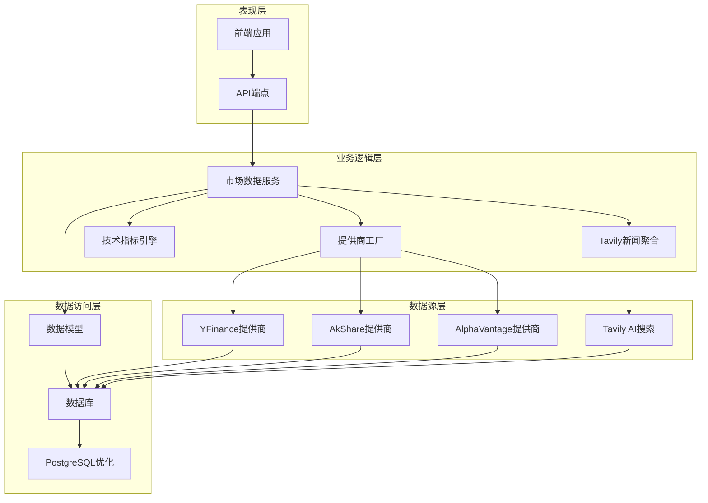
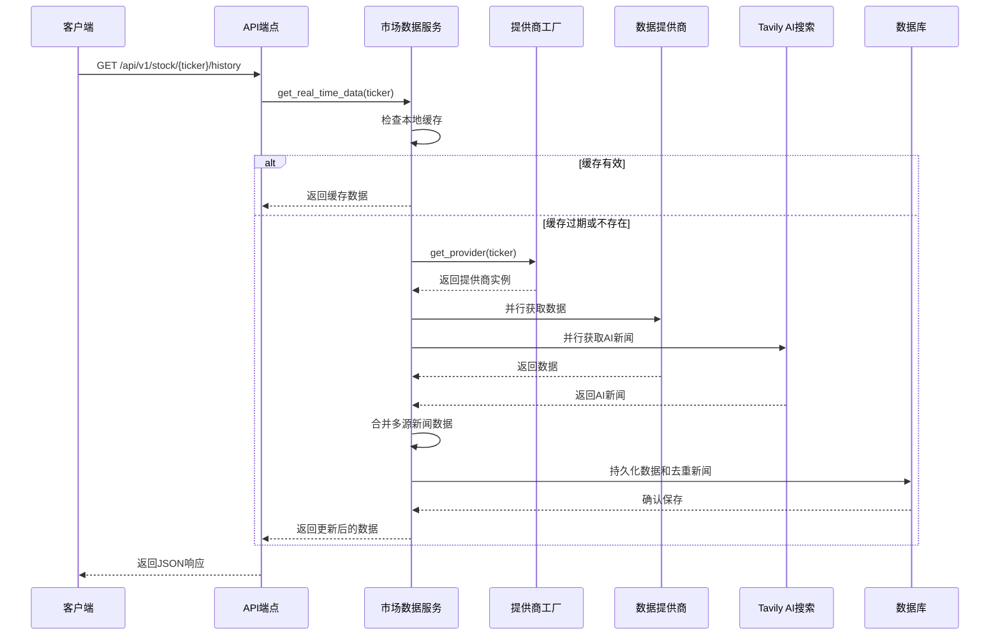
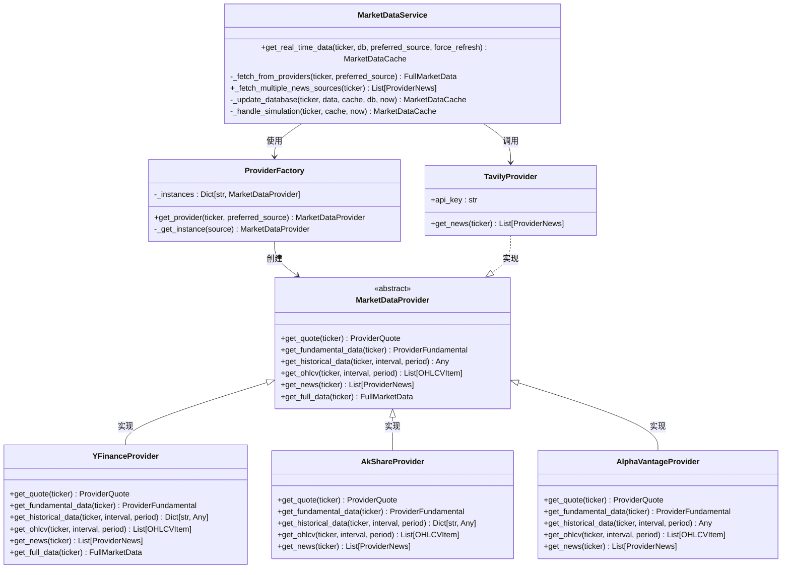
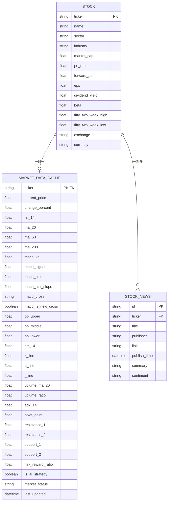
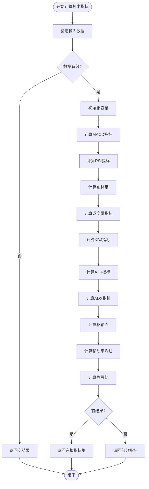
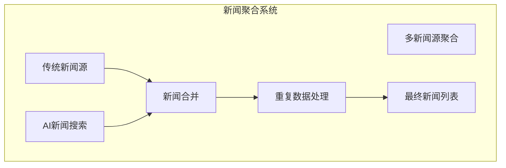
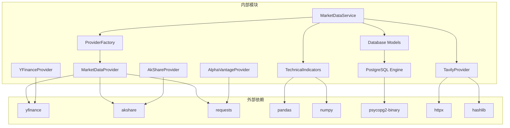

# 市场数据处理

<cite>
**本文档引用的文件**
- [backend/app/services/market_data.py](file://backend/app/services/market_data.py)
- [backend/app/schemas/market_data.py](file://backend/app/schemas/market_data.py)
- [backend/app/services/market_providers/base.py](file://backend/app/services/market_providers/base.py)
- [backend/app/services/market_providers/factory.py](file://backend/app/services/market_providers/factory.py)
- [backend/app/services/market_providers/yfinance.py](file://backend/app/services/market_providers/yfinance.py)
- [backend/app/services/market_providers/akshare.py](file://backend/app/services/market_providers/akshare.py)
- [backend/app/services/market_providers/alpha_vantage.py](file://backend/app/services/market_providers/alpha_vantage.py)
- [backend/app/services/market_providers/tavily.py](file://backend/app/services/market_providers/tavily.py)
- [backend/app/services/indicators.py](file://backend/app/services/indicators.py)
- [backend/app/models/stock.py](file://backend/app/models/stock.py)
- [backend/app/api/v1/endpoints/stock.py](file://backend/app/api/v1/endpoints/stock.py)
- [backend/app/core/config.py](file://backend/app/core/config.py)
- [backend/app/core/database.py](file://backend/app/core/database.py)
- [backend/app/main.py](file://backend/app/main.py)
- [backend/tests/test_market_data.py](file://backend/tests/test_market_data.py)
- [backend/scripts/migrate_to_neon.py](file://backend/scripts/migrate_to_neon.py)
- [migrate.load](file://migrate.load)
- [backend/migrations/versions/90eb8cc09d0d_add_stock_news_table.py](file://backend/migrations/versions/90eb8cc09d0d_add_stock_news_table.py)
- [backend/migrations/versions/ea09323a6286_add_unique_constraint_to_stock_news_.py](file://backend/migrations/versions/ea09323a6286_add_unique_constraint_to_stock_news_.py)
</cite>

## 更新摘要
**变更内容**
- 新增多新闻源聚合功能，支持传统数据源和AI新闻搜索服务
- 改进缓存系统，增强错误处理和模拟模式
- 实现重复数据处理机制，使用MD5哈希确保新闻数据去重
- 新增StockNews表和数据库迁移支持
- 优化新闻数据插入性能和一致性

## 目录
1. [简介](#简介)
2. [项目结构](#项目结构)
3. [核心组件](#核心组件)
4. [架构概览](#架构概览)
5. [详细组件分析](#详细组件分析)
6. [多新闻源聚合系统](#多新闻源聚合系统)
7. [改进的缓存机制](#改进的缓存机制)
8. [重复数据处理机制](#重复数据处理机制)
9. [数据库结构优化](#数据库结构优化)
10. [PostgreSQL特定优化](#postgresql特定优化)
11. [依赖关系分析](#依赖关系分析)
12. [性能考虑](#性能考虑)
13. [故障排除指南](#故障排除指南)
14. [结论](#结论)

## 简介

AI股票顾问项目的市场数据处理系统是一个高度模块化的异步数据获取和处理框架。该系统支持多数据源、多市场（美股/A股）、并行数据抓取、智能缓存机制和故障转移功能。

**更新** 系统现已全面支持多新闻源聚合功能，包括传统数据提供商和AI新闻搜索服务Tavily的集成，实现了智能新闻数据去重和优化的缓存系统，为用户提供更丰富、准确的市场信息。

系统的核心目标是为前端提供实时的股票市场数据，包括价格信息、技术指标、基本面数据和相关新闻，同时确保在各种网络条件下的稳定性和可靠性。

## 项目结构

该项目采用分层架构设计，主要分为以下几个层次：



**图表来源**
- [backend/app/services/market_data.py](file://backend/app/services/market_data.py#L17-L58)
- [backend/app/services/market_providers/factory.py](file://backend/app/services/market_providers/factory.py#L11-L34)
- [backend/app/core/database.py](file://backend/app/core/database.py#L8-L34)

**章节来源**
- [backend/app/services/market_data.py](file://backend/app/services/market_data.py#L1-L300)
- [backend/app/services/market_providers/base.py](file://backend/app/services/market_providers/base.py#L1-L51)

## 核心组件

### 市场数据服务 (MarketDataService)

市场数据服务是整个系统的核心协调器，负责管理数据获取流程、缓存策略和错误处理。

**主要职责：**
- 协调多个数据源的并行获取，包括传统提供商和AI新闻聚合
- 实现智能缓存机制（1分钟缓存窗口）
- 处理故障转移和模拟模式
- 持久化数据到数据库，包括多源新闻数据
- 维护Stock和MarketDataCache模型的一致性

**关键特性：**
- 异步并发处理，使用asyncio.gather优化IO等待
- 15秒超时保护，防止单个数据源阻塞
- 多级故障转移策略
- 支持强制刷新和缓存绕过
- **新增** 多新闻源聚合功能，支持传统和AI新闻源
- **新增** 基于MD5哈希的重复数据处理机制

### 数据提供商抽象层

系统实现了标准的工厂模式和抽象工厂模式，支持多种数据源的动态切换。

**支持的数据源：**
- **YFinanceProvider**: 雅虎财经数据源，支持美股和A股格式转换
- **AkShareProvider**: 东方财富数据源，专为A股优化
- **AlphaVantageProvider**: Alpha Vantage API数据源
- **TavilyProvider**: AI新闻搜索服务，提供高质量金融新闻聚合

**章节来源**
- [backend/app/services/market_data.py](file://backend/app/services/market_data.py#L17-L58)
- [backend/app/services/market_providers/base.py](file://backend/app/services/market_providers/base.py#L9-L51)

## 架构概览

系统采用分层架构，每层都有明确的职责分离：



**图表来源**
- [backend/app/services/market_data.py](file://backend/app/services/market_data.py#L19-L58)
- [backend/app/api/v1/endpoints/stock.py](file://backend/app/api/v1/endpoints/stock.py#L46-L75)

## 详细组件分析

### 市场数据服务类图



**图表来源**
- [backend/app/services/market_data.py](file://backend/app/services/market_data.py#L17-L300)
- [backend/app/services/market_providers/base.py](file://backend/app/services/market_providers/base.py#L9-L51)
- [backend/app/services/market_providers/yfinance.py](file://backend/app/services/market_providers/yfinance.py#L20-L286)
- [backend/app/services/market_providers/akshare.py](file://backend/app/services/market_providers/akshare.py#L40-L480)
- [backend/app/services/market_providers/alpha_vantage.py](file://backend/app/services/market_providers/alpha_vantage.py#L14-L78)
- [backend/app/services/market_providers/tavily.py](file://backend/app/services/market_providers/tavily.py#L11-L72)

### 数据模型关系图



**图表来源**
- [backend/app/models/stock.py](file://backend/app/models/stock.py#L15-L116)

### 技术指标计算流程



**图表来源**
- [backend/app/services/indicators.py](file://backend/app/services/indicators.py#L45-L206)

**章节来源**
- [backend/app/services/market_data.py](file://backend/app/services/market_data.py#L118-L300)
- [backend/app/services/indicators.py](file://backend/app/services/indicators.py#L1-L206)

## 多新闻源聚合系统

### 新闻聚合架构

系统现在支持从多个新闻源获取和聚合数据，包括传统数据提供商和AI新闻搜索服务：



**核心功能：**
- **并行获取**：使用asyncio.gather并行从多个新闻源获取数据
- **动态配置**：根据API密钥存在与否动态启用/禁用新闻源
- **统一格式**：将不同来源的新闻转换为统一的ProviderNews格式
- **智能合并**：将来自多个源的新闻合并为单一列表

### Tavily AI新闻搜索

TavilyProvider提供了专业的AI新闻搜索能力：

**主要特性：**
- **专业搜索**：使用专门的新闻搜索深度（search_depth="news"）
- **高质量内容**：获取最新的商业和金融新闻
- **URL哈希**：使用URL的MD5哈希作为唯一ID
- **自动降级**：当API密钥缺失时自动禁用

**搜索配置：**
- 查询深度：news（专门的新闻搜索）
- 结果数量：最多5条新闻
- 包含内容：新闻正文，排除图片和答案
- 超时设置：10秒HTTP客户端超时

**章节来源**
- [backend/app/services/market_data.py](file://backend/app/services/market_data.py#L83-L134)
- [backend/app/services/market_providers/tavily.py](file://backend/app/services/market_providers/tavily.py#L22-L64)

## 改进的缓存机制

### 缓存策略优化

系统保持了原有的1分钟缓存窗口，但增强了错误处理和模拟模式：

**缓存检查逻辑：**
- 检查数据库中是否存在缓存记录
- 验证缓存时间是否在1分钟内
- 如果缓存有效，直接返回缓存数据
- 如果缓存过期或不存在，执行数据获取流程

**模拟模式增强：**
- **故障自动模拟**：在网络异常时生成微小波动的模拟数据
- **历史数据保留**：保留前序价格信息，避免完全空白
- **时间戳策略**：故意不更新last_updated，提示用户数据陈旧
- **初始化模拟**：首次运行时提供合理的默认值

**章节来源**
- [backend/app/services/market_data.py](file://backend/app/services/market_data.py#L20-L59)
- [backend/app/services/market_data.py](file://backend/app/services/market_data.py#L271-L299)

## 重复数据处理机制

### 基于MD5哈希的去重系统

系统实现了智能的重复数据处理机制，确保新闻数据不会重复插入：

**去重策略：**
- **复合ID生成**：使用(ticker + link)的MD5哈希作为新闻ID
- **单标的内去重**：同一股票内的重复新闻被忽略
- **跨股票允许重复**：相同链接的不同股票新闻仍会被保存
- **唯一约束**：数据库层面的唯一约束确保数据一致性

**ID生成逻辑：**
```python
# 使用 (Ticker + Link) 的组合 MD5 作为 ID，实现单标的内绝对去重
unique_id = hashlib.md5(f"{ticker}:{n.link}".encode()).hexdigest()
```

**数据库约束：**
- 唯一约束：(ticker, link)组合确保新闻链接的唯一性
- 外键约束：确保新闻与股票的正确关联
- 时间戳处理：Naive UTC转换确保PostgreSQL兼容性

**章节来源**
- [backend/app/services/market_data.py](file://backend/app/services/market_data.py#L235-L261)
- [backend/migrations/versions/ea09323a6286_add_unique_constraint_to_stock_news_.py](file://backend/migrations/versions/ea09323a6286_add_unique_constraint_to_stock_news_.py#L23)

## 数据库结构优化

### StockNews表设计

系统新增了专门的新闻表来存储和管理新闻数据：

**表结构特点：**
- **主键设计**：使用MD5哈希作为主键，确保全球唯一性
- **索引优化**：为ticker字段建立索引，优化查询性能
- **外键关联**：与Stock表建立外键关系，维护数据完整性
- **时间戳处理**：支持精确的时间戳存储和查询

**字段设计：**
- `id`: 主键，MD5哈希值
- `ticker`: 股票代码，外键关联
- `title`: 新闻标题，必填字段
- `publisher`: 发布媒体，可选字段
- `link`: 原文链接，必填字段
- `publish_time`: 发布时间，必填字段
- `summary`: AI总结摘要，可选字段
- `sentiment`: 情绪倾向，可选字段

**迁移支持：**
- **版本控制**：完整的Alembic迁移支持
- **向下兼容**：提供完整的降级方案
- **数据保护**：迁移过程中确保数据安全

**章节来源**
- [backend/app/models/stock.py](file://backend/app/models/stock.py#L102-L116)
- [backend/migrations/versions/90eb8cc09d0d_add_stock_news_table.py](file://backend/migrations/versions/90eb8cc09d0d_add_stock_news_table.py#L21-L31)

## PostgreSQL特定优化

### 连接池配置优化

系统针对PostgreSQL数据库进行了专门的连接池优化，以提升并发性能和稳定性：

**连接池参数配置：**
- **pool_size**: 10（PostgreSQL）vs 5（SQLite）- 增加连接池大小以支持更高并发
- **max_overflow**: 20（PostgreSQL）vs 0（SQLite）- 允许额外的溢出连接
- **pool_recycle**: 300秒 - 连接回收时间
- **pool_pre_ping**: True - 连接前检查，确保连接有效性

**SSL和超时配置：**
- **SSL强制要求**: PostgreSQL连接必须使用SSL加密
- **command_timeout**: 60秒 - SQL命令执行超时设置
- **busy_timeout**: 30000毫秒（SQLite）- SQLite连接等待超时

### 新闻数据插入优化

**ON CONFLICT DO NOTHING优化：**
系统使用PostgreSQL的ON CONFLICT DO NOTHING语法来避免重复插入新闻数据：

```python
news_stmt = insert(StockNews).values(
    id=n.id or unique_link_id,
    ticker=ticker,
    title=n.title or "无标题",
    publisher=n.publisher or "未知媒体",
    link=n.link,
    summary=n.summary,
    publish_time=p_time
).on_conflict_do_nothing()  # 已存在的新闻不再重复插入
```

**时间戳处理优化：**
为确保与PostgreSQL兼容，系统对时间戳进行Naive UTC转换：

```python
# 转换日期为 naive datetime 防止与 Postgres 不匹配
p_time = n.publish_time or now
if p_time.tzinfo:
    p_time = p_time.replace(tzinfo=None)
```

### 数据库迁移支持

系统提供了完整的PostgreSQL迁移支持，包括：

**类型转换和兼容性处理：**
- **布尔类型**: 自动转换SQLite布尔值到PostgreSQL布尔类型
- **时间戳类型**: 将SQLite DATETIME转换为PostgreSQL TIMESTAMPTZ
- **JSON类型**: 将SQLite TEXT转换为PostgreSQL JSONB
- **字符串类型**: 处理长度限制和字符集差异

**迁移脚本功能：**
- 批量数据迁移支持
- 错误处理和回退机制
- 数据完整性验证
- 支持Neon等云数据库服务

**章节来源**
- [backend/app/core/database.py](file://backend/app/core/database.py#L8-L34)
- [backend/app/services/market_data.py](file://backend/app/services/market_data.py#L223-L243)
- [backend/scripts/migrate_to_neon.py](file://backend/scripts/migrate_to_neon.py#L61-L84)
- [migrate.load](file://migrate.load#L1-L10)

## 依赖关系分析

系统采用松耦合的设计，通过接口和工厂模式实现模块间的解耦：



**图表来源**
- [backend/app/services/market_providers/factory.py](file://backend/app/services/market_providers/factory.py#L1-L51)
- [backend/app/services/market_data.py](file://backend/app/services/market_data.py#L1-L13)
- [backend/app/core/database.py](file://backend/app/core/database.py#L1-L5)

**章节来源**
- [backend/app/services/market_providers/factory.py](file://backend/app/services/market_providers/factory.py#L15-L50)
- [backend/app/core/database.py](file://backend/app/core/database.py#L1-L69)

## 性能考虑

### 缓存策略

系统实现了多层次的缓存机制来优化性能：

1. **本地缓存**: 1分钟缓存窗口，避免频繁的外部API调用
2. **内存缓存**: AkShare提供商使用类级内存缓存存储全市场快照
3. **数据库缓存**: 持久化存储最近的市场数据

### 并发优化

- 使用asyncio.gather实现并行数据获取
- 限制并发数量防止API限制
- 线程池隔离避免阻塞事件循环
- 15秒超时保护防止长时间阻塞

### 数据库优化

**SQLite优化：**
- WAL模式提高并发性能
- 连接池配置优化（pool_size=5, pool_pre_ping=True）
- 事务管理和错误恢复机制

**PostgreSQL优化：**
- **连接池优化**: pool_size=10, max_overflow=20
- **SSL强制**: 确保数据传输安全
- **命令超时**: 60秒超时保护
- **新闻插入优化**: ON CONFLICT DO NOTHING避免重复插入
- **时间戳处理**: Naive UTC转换确保兼容性
- **索引优化**: 为ticker字段建立索引提升查询性能

### 新闻聚合性能优化

**并行处理：**
- 使用asyncio.gather并行获取多个新闻源数据
- 动态新闻任务列表，根据可用API密钥调整
- 15秒超时保护，确保系统响应性

**去重优化：**
- MD5哈希计算在内存中完成
- 数据库唯一约束确保最终一致性
- 避免重复网络请求和存储操作

### 迁移性能优化

- 批量插入支持，减少网络往返
- 错误处理和回退机制
- 数据完整性验证
- 支持大规模数据迁移

## 故障排除指南

### 常见问题及解决方案

**1. 数据获取超时**
- 检查网络连接和代理设置
- 查看API密钥配置
- 调整超时参数

**2. 缓存数据陈旧**
- 使用force_refresh参数强制刷新
- 检查缓存时间配置
- 验证数据库连接

**3. 多数据源切换问题**
- 检查股票代码格式识别
- 验证提供商API密钥
- 查看日志输出定位问题

**4. PostgreSQL连接问题**
- 验证DATABASE_URL配置
- 检查SSL证书配置
- 确认连接池参数设置
- 查看连接超时设置

**5. 新闻数据重复问题**
- 确认ON CONFLICT DO NOTHING配置
- 检查新闻链接唯一性
- 验证时间戳转换逻辑
- 查看数据库唯一约束

**6. Tavily新闻搜索问题**
- 验证TAVILY_API_KEY配置
- 检查网络连接和API可用性
- 查看错误日志获取具体原因

**7. 多新闻源聚合问题**
- 确认各新闻源的可用性
- 检查并行动作的超时设置
- 验证新闻数据格式一致性

**章节来源**
- [backend/tests/test_market_data.py](file://backend/tests/test_market_data.py#L13-L27)
- [backend/app/core/database.py](file://backend/app/core/database.py#L18-L23)

## 结论

AI股票顾问项目的市场数据处理系统展现了现代金融数据处理的最佳实践。通过模块化设计、异步并发处理、智能缓存机制和多数据源冗余，系统能够在各种网络条件下提供稳定可靠的数据服务。

**更新** 系统现已全面支持多新闻源聚合功能，包括传统数据提供商和AI新闻搜索服务Tavily的集成，实现了智能新闻数据去重和优化的缓存系统，为用户提供更丰富、准确的市场信息。

系统的主要优势包括：
- **高可用性**: 多级故障转移和模拟模式确保服务连续性
- **高性能**: 并行处理和智能缓存优化响应时间
- **可扩展性**: 插件化的数据源架构支持新数据源接入
- **稳定性**: 完善的错误处理和监控机制
- **云原生支持**: PostgreSQL优化为云部署提供最佳性能
- **数据完整性**: 迁移工具确保数据从SQLite到PostgreSQL的平滑过渡
- **智能聚合**: 多新闻源聚合提供更全面的市场信息
- **去重保障**: 基于MD5哈希的重复数据处理机制
- **AI增强**: Tavily AI新闻搜索提供高质量的专业内容

该系统为后续的功能扩展（如AI分析、实时通知等）奠定了坚实的基础，是一个设计精良的企业级金融数据处理平台，特别适合云原生环境部署。