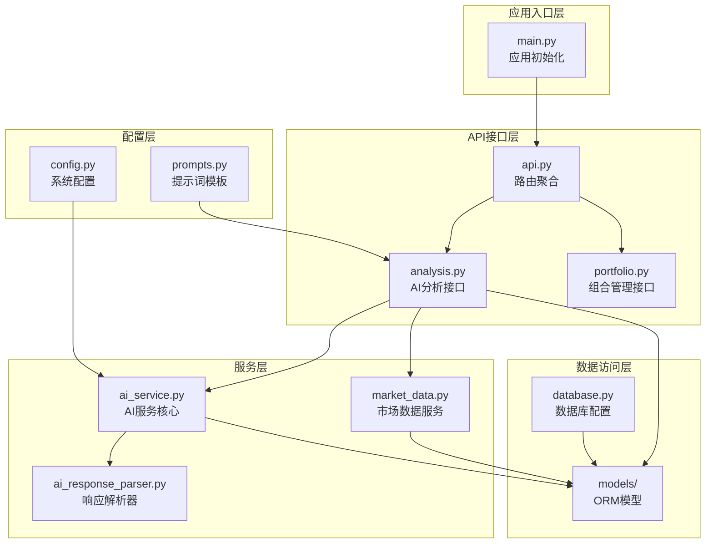
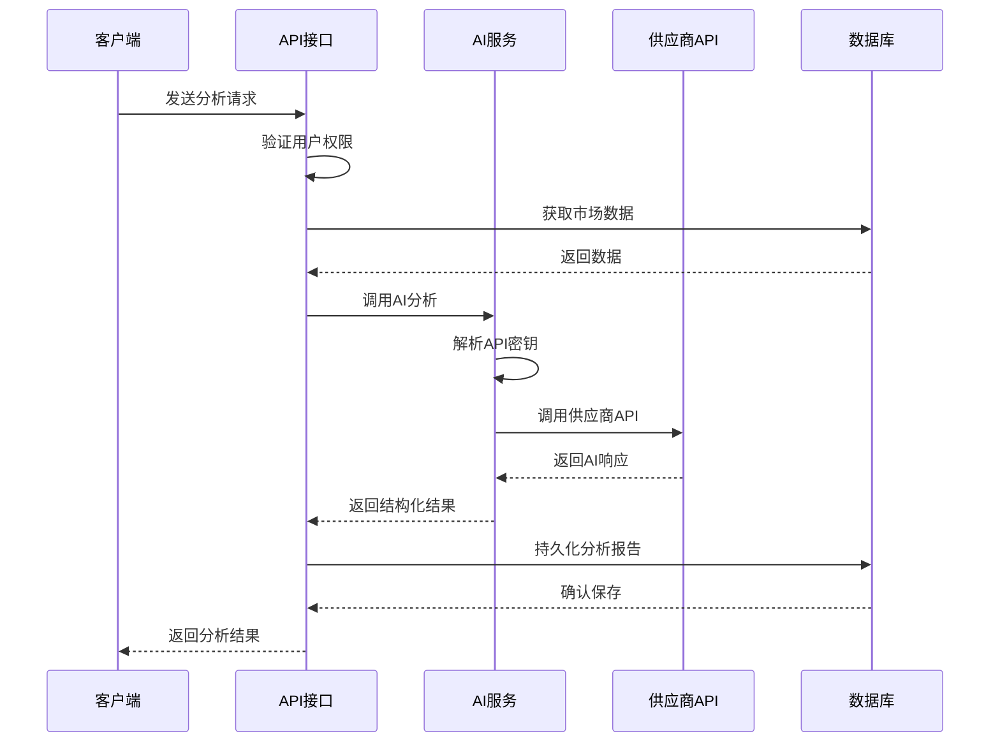
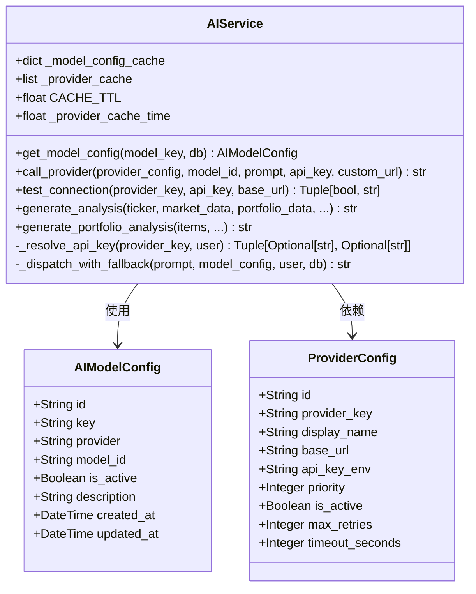
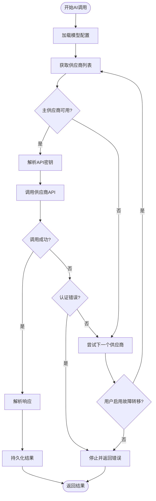
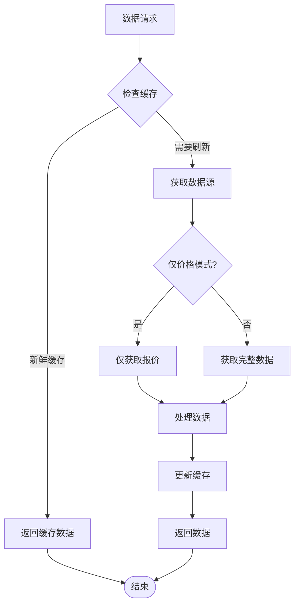
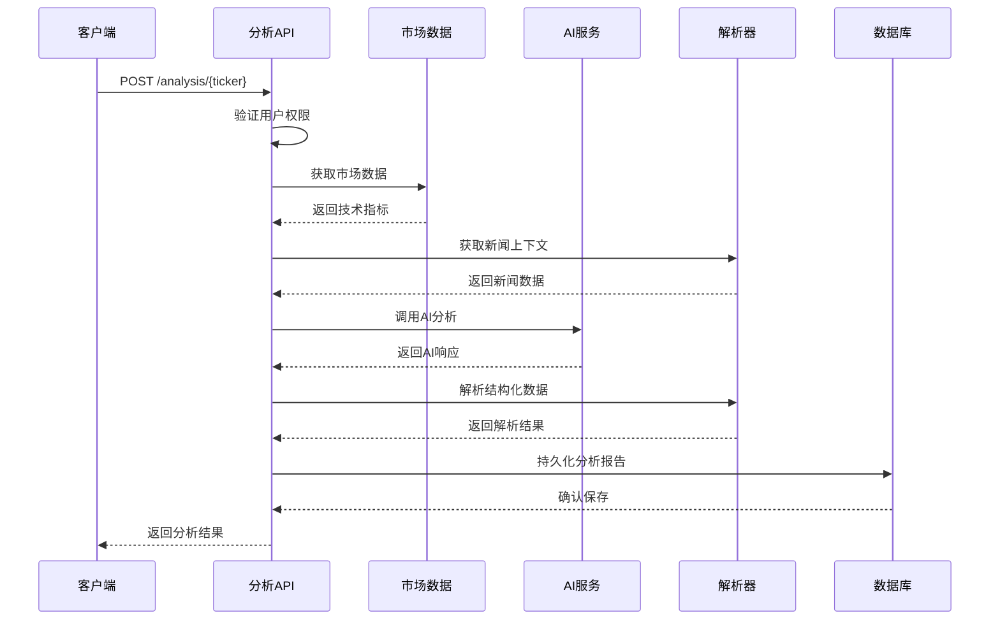
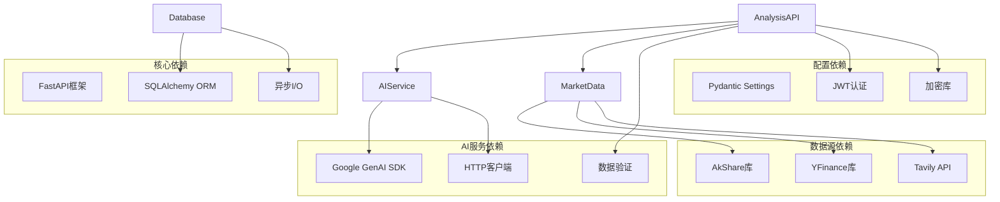
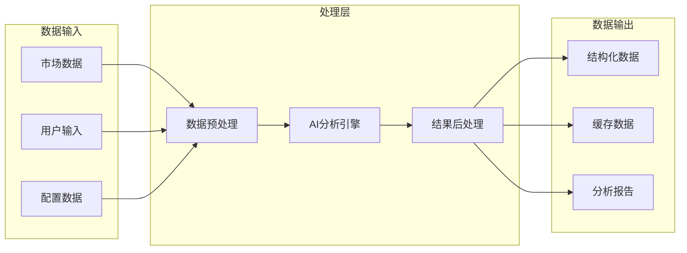

# 旧版AI服务架构

<cite>
**本文档引用的文件**
- [main.py](file://backend/app/main.py)
- [ai_service.py](file://backend/app/services/ai_service.py)
- [config.py](file://backend/app/core/config.py)
- [prompts.py](file://backend/app/core/prompts.py)
- [analysis.py](file://backend/app/api/v1/endpoints/analysis.py)
- [api.py](file://backend/app/api/v1/api.py)
- [ai_config.py](file://backend/app/models/ai_config.py)
- [provider_config.py](file://backend/app/models/provider_config.py)
- [analysis_model.py](file://backend/app/models/analysis.py)
- [market_data.py](file://backend/app/services/market_data.py)
- [database.py](file://backend/app/core/database.py)
- [ai_response_parser.py](file://backend/app/utils/ai_response_parser.py)
- [portfolio.py](file://backend/app/api/v1/endpoints/portfolio.py)
- [README.md](file://README.md)
</cite>

## 目录
1. [简介](#简介)
2. [项目结构](#项目结构)
3. [核心组件](#核心组件)
4. [架构总览](#架构总览)
5. [详细组件分析](#详细组件分析)
6. [依赖关系分析](#依赖关系分析)
7. [性能考虑](#性能考虑)
8. [故障排查指南](#故障排查指南)
9. [结论](#结论)

## 简介
本项目是一个工业级AI智能投资顾问后端系统，基于FastAPI构建，集成了多源市场数据与LLM分析能力。旧版AI服务架构围绕AI服务核心组件展开，实现了从数据采集、AI分析到结果持久化的完整闭环。

## 项目结构
后端采用分层架构设计，主要分为以下层次：
- 应用入口层：FastAPI应用初始化与中间件配置
- API接口层：按功能模块划分的路由控制器
- 服务层：核心业务逻辑，包括AI分析、市场数据、通知等服务
- 数据访问层：ORM模型与数据库操作
- 工具层：通用工具函数与解析器

**图表来源**
- [main.py:1-146](file://backend/app/main.py#L1-L146)
- [api.py:1-33](file://backend/app/api/v1/api.py#L1-L33)
- [ai_service.py:1-254](file://backend/app/services/ai_service.py#L1-L254)

**章节来源**
- [main.py:1-146](file://backend/app/main.py#L1-L146)
- [api.py:1-33](file://backend/app/api/v1/api.py#L1-L33)

## 核心组件
旧版AI服务架构包含以下核心组件：

### AIService（AI服务核心）
AIService是整个AI分析系统的核心，负责：
- 模型配置管理与缓存
- 供应商API密钥解析与动态URL切换
- 多供应商故障转移机制
- 统一的AI调用接口

### MarketDataService（市场数据服务）
负责从多个数据源获取实时市场数据，包括：
- 股票报价与技术指标
- 基本面数据与估值百分位
- 资金流向与新闻资讯
- 数据缓存与持久化

### Prompt模板系统
提供标准化的AI提示词模板，确保分析质量的一致性：
- 个股分析模板
- 组合分析模板
- 合规免责声明
- 结构化输出约束

### 数据模型层
包含完整的数据模型定义：
- AI模型配置模型
- 分析报告模型
- 供应商配置模型
- 市场数据缓存模型

**章节来源**
- [ai_service.py:22-254](file://backend/app/services/ai_service.py#L22-L254)
- [market_data.py:19-407](file://backend/app/services/market_data.py#L19-L407)
- [prompts.py:1-192](file://backend/app/core/prompts.py#L1-L192)
- [ai_config.py:1-21](file://backend/app/models/ai_config.py#L1-L21)
- [analysis_model.py:1-92](file://backend/app/models/analysis.py#L1-L92)

## 架构总览
旧版AI服务架构采用事件驱动的异步设计，实现了高并发与高可用：

**图表来源**
- [analysis.py:241-626](file://backend/app/api/v1/endpoints/analysis.py#L241-L626)
- [ai_service.py:161-212](file://backend/app/services/ai_service.py#L161-L212)

系统采用多供应商架构，支持故障转移和负载均衡：
- 主供应商：根据用户配置优先选择
- 备用供应商：在主供应商失败时自动切换
- 动态URL：支持自定义API基地址
- 超时控制：每供应商独立超时配置

**章节来源**
- [ai_service.py:161-212](file://backend/app/services/ai_service.py#L161-L212)
- [provider_config.py:12-48](file://backend/app/models/provider_config.py#L12-L48)

## 详细组件分析

### AI服务组件分析

#### AIService类结构

**图表来源**
- [ai_service.py:22-254](file://backend/app/services/ai_service.py#L22-L254)
- [ai_config.py:6-21](file://backend/app/models/ai_config.py#L6-L21)
- [provider_config.py:12-48](file://backend/app/models/provider_config.py#L12-L48)

#### AI调用流程

**图表来源**
- [ai_service.py:161-212](file://backend/app/services/ai_service.py#L161-L212)

**章节来源**
- [ai_service.py:22-254](file://backend/app/services/ai_service.py#L22-L254)

### 市场数据服务分析

#### 数据获取策略
MarketDataService采用智能缓存和故障转移策略：

**图表来源**
- [market_data.py:20-66](file://backend/app/services/market_data.py#L20-L66)

#### 数据源集成
系统支持多种数据源，包括：
- AkShare：国内A股数据
- YFinance：美股数据
- 财联社：新闻资讯
- Tavily：搜索支持

**章节来源**
- [market_data.py:67-227](file://backend/app/services/market_data.py#L67-L227)

### API接口层分析

#### 分析接口流程

**图表来源**
- [analysis.py:241-626](file://backend/app/api/v1/endpoints/analysis.py#L241-L626)

**章节来源**
- [analysis.py:241-626](file://backend/app/api/v1/endpoints/analysis.py#L241-L626)

## 依赖关系分析

### 组件依赖图

**图表来源**
- [ai_service.py:1-12](file://backend/app/services/ai_service.py#L1-L12)
- [analysis.py:1-25](file://backend/app/api/v1/endpoints/analysis.py#L1-L25)
- [database.py:1-69](file://backend/app/core/database.py#L1-L69)

### 数据流依赖
系统采用事件驱动的数据流架构：

**图表来源**
- [analysis.py:277-501](file://backend/app/api/v1/endpoints/analysis.py#L277-L501)
- [ai_response_parser.py:32-100](file://backend/app/utils/ai_response_parser.py#L32-L100)

**章节来源**
- [ai_service.py:1-254](file://backend/app/services/ai_service.py#L1-L254)
- [market_data.py:1-407](file://backend/app/services/market_data.py#L1-L407)

## 性能考虑
旧版AI服务架构在性能方面采用了多项优化措施：

### 缓存策略
- 模型配置缓存：5分钟TTL，减少数据库查询
- 供应商列表缓存：10分钟TTL，支持动态更新
- 市场数据缓存：1分钟TTL，支持价格模式优化

### 异步处理
- 全面采用async/await模式
- 并发任务限制：信号量控制最大并发数
- 超时控制：每供应商独立超时配置

### 数据库优化
- SQLite WAL模式：提升并发读写性能
- 连接池配置：PostgreSQL优化参数
- 原子操作：UPSERT减少查询次数

## 故障排查指南

### 常见问题诊断
1. **AI服务不可用**
   - 检查API密钥配置
   - 验证供应商连接性
   - 查看错误日志

2. **市场数据获取失败**
   - 检查数据源可用性
   - 验证网络连接
   - 查看缓存状态

3. **分析结果异常**
   - 检查提示词模板
   - 验证数据完整性
   - 查看解析器日志

### 调试工具
- 全局异常处理器：捕获未处理异常
- 请求日志：记录请求耗时和用户信息
- 详细错误追踪：包含堆栈信息

**章节来源**
- [main.py:33-47](file://backend/app/main.py#L33-L47)
- [ai_service.py:140-159](file://backend/app/services/ai_service.py#L140-L159)

## 结论
旧版AI服务架构展现了良好的工程实践，具有以下特点：

### 优势
- **模块化设计**：清晰的分层架构，职责分离明确
- **高可用性**：多供应商故障转移机制
- **性能优化**：全面的缓存策略和异步处理
- **扩展性强**：插件化的数据源和供应商支持

### 改进建议
- 增强监控告警机制
- 优化错误恢复策略
- 加强安全防护措施
- 完善测试覆盖

该架构为AI智能投资顾问系统提供了稳定可靠的技术基础，能够满足工业级应用的需求。