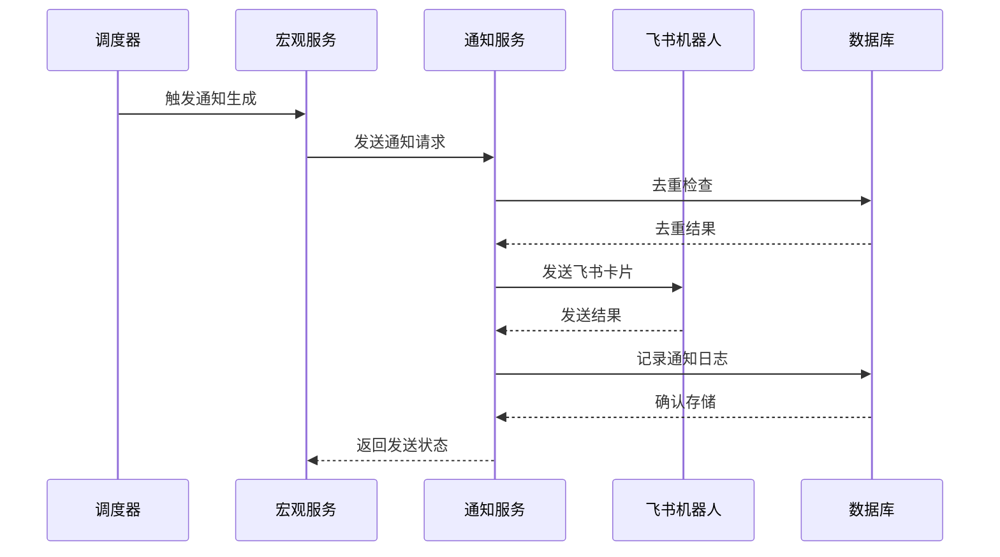
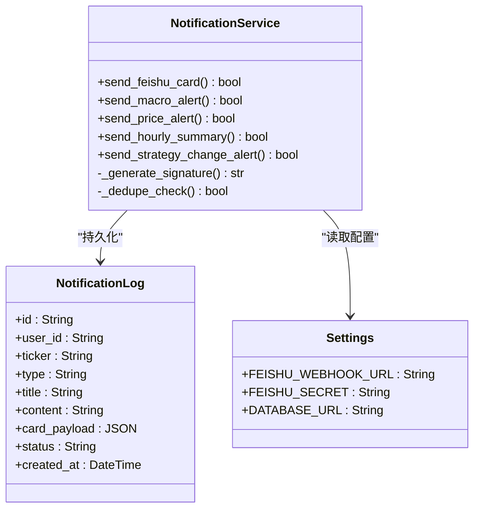
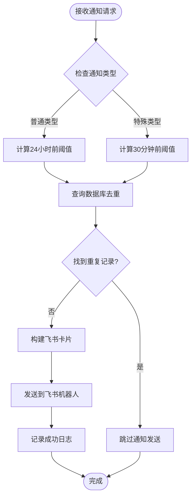
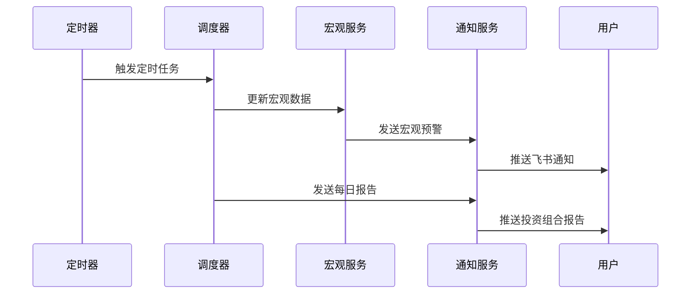
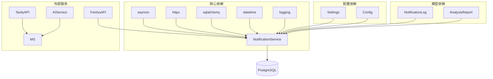

# 旧通知系统

<cite>
**本文档引用的文件**
- [backend/app/services/notification_service.py](file://backend/app/services/notification_service.py)
- [backend/app/models/notification.py](file://backend/app/models/notification.py)
- [backend/app/api/v1/endpoints/notifications.py](file://backend/app/api/v1/endpoints/notifications.py)
- [backend/app/services/scheduler.py](file://backend/app/services/scheduler.py)
- [backend/app/services/macro_service.py](file://backend/app/services/macro_service.py)
- [backend/app/core/config.py](file://backend/app/core/config.py)
- [backend/app/api/v1/api.py](file://backend/app/api/v1/api.py)
- [backend/app/main.py](file://backend/app/main.py)
- [backend/tests/test_feishu_notifications.py](file://backend/tests/test_feishu_notifications.py)
</cite>

## 目录
1. [简介](#简介)
2. [项目结构](#项目结构)
3. [核心组件](#核心组件)
4. [架构概览](#架构概览)
5. [详细组件分析](#详细组件分析)
6. [依赖分析](#依赖分析)
7. [性能考虑](#性能考虑)
8. [故障排除指南](#故障排除指南)
9. [结论](#结论)

## 简介

旧通知系统是AI股票顾问项目中的一个关键组件，负责通过飞书机器人推送各种类型的市场通知和提醒。该系统实现了完整的通知生命周期管理，包括通知生成、去重控制、发送和历史记录存储。

系统支持多种通知类型，包括宏观预警、价格提醒、每日报告、策略变更通知等，为用户提供及时的市场洞察和投资建议。通知系统采用异步架构设计，确保在高并发场景下的稳定性和性能。

## 项目结构

通知系统主要分布在以下几个核心模块中：

```mermaid
graph TB
subgraph "通知系统架构"
NS[NotificationService<br/>通知服务]
NL[NotificationLog<br/>通知日志模型]
API[Notifications API<br/>历史查询接口]
SCH[Scheduler<br/>调度器]
MS[MacroService<br/>宏观服务]
CFG[Config<br/>配置管理]
end
subgraph "外部集成"
FS[Feishu Bot<br/>飞书机器人]
DB[(Database)<br/>数据库]
end
NS --> NL
NS --> FS
NS --> DB
SCH --> NS
MS --> NS
API --> NL
CFG --> NS
```

**图表来源**
- [backend/app/services/notification_service.py:14-410](file://backend/app/services/notification_service.py#L14-L410)
- [backend/app/models/notification.py:6-23](file://backend/app/models/notification.py#L6-L23)

**章节来源**
- [backend/app/services/notification_service.py:1-410](file://backend/app/services/notification_service.py#L1-L410)
- [backend/app/models/notification.py:1-23](file://backend/app/models/notification.py#L1-L23)

## 核心组件

### 通知服务 (NotificationService)

通知服务是整个系统的核心，提供了统一的通知发送接口和去重机制。它支持多种通知类型，包括：

- **宏观预警通知**：基于市场热点事件的实时预警
- **价格提醒通知**：基于技术分析的目标价位提醒
- **每日报告通知**：个人投资组合的健康状况报告
- **策略变更通知**：AI分析策略的重大调整提醒
- **每小时新闻摘要**：市场动态的定时汇总

### 通知日志模型 (NotificationLog)

通知日志模型负责持久化所有发送的通知，提供历史查询和去重控制功能。模型包含以下关键字段：

- `id`: 唯一标识符
- `user_id`: 归属用户ID
- `ticker`: 关联的股票代码
- `type`: 通知类型
- `title`: 通知标题
- `content`: 通知内容
- `card_payload`: 飞书卡片JSON载荷
- `status`: 发送状态
- `created_at`: 创建时间

### 通知历史API

提供RESTful接口查询通知历史记录，支持分页和排序功能，便于前端展示"提醒流"。

**章节来源**
- [backend/app/services/notification_service.py:14-410](file://backend/app/services/notification_service.py#L14-L410)
- [backend/app/models/notification.py:6-23](file://backend/app/models/notification.py#L6-L23)
- [backend/app/api/v1/endpoints/notifications.py:25-36](file://backend/app/api/v1/endpoints/notifications.py#L25-L36)

## 架构概览

通知系统采用分层架构设计，实现了清晰的关注点分离：



**图表来源**
- [backend/app/services/scheduler.py:294-302](file://backend/app/services/scheduler.py#L294-L302)
- [backend/app/services/macro_service.py:209-229](file://backend/app/services/macro_service.py#L209-L229)
- [backend/app/services/notification_service.py:28-128](file://backend/app/services/notification_service.py#L28-L128)

系统的关键特性包括：

1. **异步通知发送**：使用async/await模式提高并发性能
2. **智能去重机制**：基于时间窗口和用户维度的去重控制
3. **容错处理**：数据库故障不影响通知发送
4. **飞书集成**：完整的飞书Webhook和签名验证支持

## 详细组件分析

### 通知服务类分析



**图表来源**
- [backend/app/services/notification_service.py:14-410](file://backend/app/services/notification_service.py#L14-L410)
- [backend/app/models/notification.py:6-23](file://backend/app/models/notification.py#L6-L23)
- [backend/app/core/config.py:4-36](file://backend/app/core/config.py#L4-L36)

#### 去重机制流程

通知系统实现了智能去重机制，防止重复通知：



**图表来源**
- [backend/app/services/notification_service.py:42-74](file://backend/app/services/notification_service.py#L42-L74)

#### 通知类型详解

系统支持以下通知类型：

1. **MACRO_ALERT**: 宏观预警通知
   - 基于市场热点事件的实时预警
   - 支持热度评分和颜色分级
   - 自动跳过24小时去重

2. **PRICE_ALERT**: 价格提醒通知
   - 基于技术分析的目标价位提醒
   - 区分止盈和止损两种场景
   - 支持币种自动识别

3. **DAILY_REPORT**: 每日报告通知
   - 个人投资组合健康状况报告
   - AI生成的综合分析报告
   - 每日定时发送

4. **STRATEGY_CHANGE**: 策略变更通知
   - AI分析策略的重大调整
   - 详细的变更原因说明
   - 级别化的重要程度标记

**章节来源**
- [backend/app/services/notification_service.py:130-410](file://backend/app/services/notification_service.py#L130-L410)

### 调度器集成

通知系统与调度器紧密集成，实现了定时通知功能：



**图表来源**
- [backend/app/services/scheduler.py:566-643](file://backend/app/services/scheduler.py#L566-L643)
- [backend/app/services/macro_service.py:209-229](file://backend/app/services/macro_service.py#L209-L229)

**章节来源**
- [backend/app/services/scheduler.py:294-356](file://backend/app/services/scheduler.py#L294-L356)
- [backend/app/services/macro_service.py:21-236](file://backend/app/services/macro_service.py#L21-L236)

## 依赖分析

通知系统的主要依赖关系如下：



**图表来源**
- [backend/app/services/notification_service.py:1-12](file://backend/app/services/notification_service.py#L1-L12)
- [backend/app/core/config.py:4-36](file://backend/app/core/config.py#L4-L36)

**章节来源**
- [backend/app/services/notification_service.py:1-410](file://backend/app/services/notification_service.py#L1-L410)
- [backend/app/core/config.py:1-36](file://backend/app/core/config.py#L1-L36)

## 性能考虑

通知系统在设计时充分考虑了性能优化：

### 异步架构
- 使用async/await模式提高并发处理能力
- 异步HTTP客户端减少I/O等待时间
- 事件循环优化资源利用率

### 缓存策略
- 数据库查询结果缓存
- 飞书Webhook URL缓存
- 通知模板预编译

### 去重优化
- 基于时间窗口的智能去重
- 数据库存储的高效查询
- 内存中的临时缓存

### 错误处理
- 超时控制和重试机制
- 数据库连接池管理
- 异常隔离和恢复

## 故障排除指南

### 常见问题及解决方案

1. **飞书Webhook配置问题**
   - 检查FEISHU_WEBHOOK_URL环境变量
   - 验证Webhook URL的有效性
   - 确认网络连通性

2. **通知发送失败**
   - 查看日志中的错误信息
   - 检查API响应状态码
   - 验证签名生成逻辑

3. **去重机制异常**
   - 检查数据库连接状态
   - 验证时间窗口计算逻辑
   - 确认用户ID和股票代码匹配

4. **性能问题**
   - 监控异步任务执行时间
   - 检查数据库查询性能
   - 优化批量操作

**章节来源**
- [backend/tests/test_feishu_notifications.py:10-41](file://backend/tests/test_feishu_notifications.py#L10-L41)

## 结论

旧通知系统是一个设计精良的异步通知平台，具有以下特点：

1. **完整性**：支持多种通知类型和复杂的业务逻辑
2. **可靠性**：完善的错误处理和容错机制
3. **可扩展性**：模块化的架构设计便于功能扩展
4. **性能**：异步架构和优化策略确保高并发处理能力

系统通过飞书机器人的集成，为用户提供了及时、准确的市场通知服务，是AI股票顾问项目的重要组成部分。未来可以考虑进一步优化去重算法、增加通知模板系统、实现通知统计分析等功能。