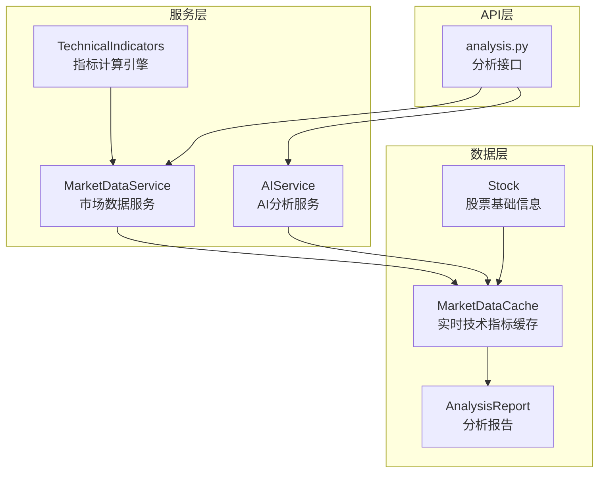
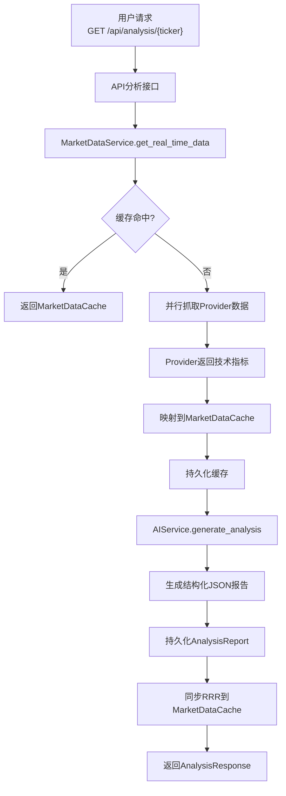
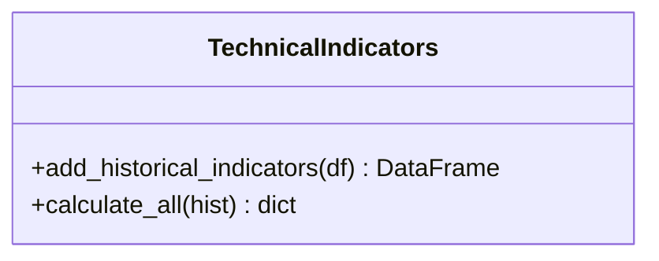
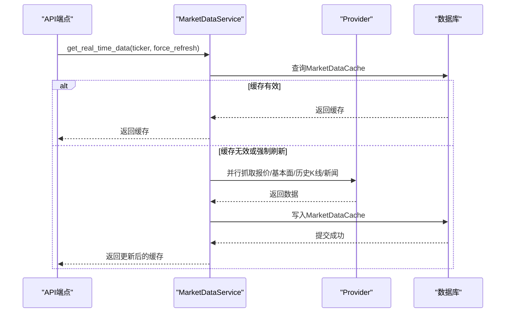
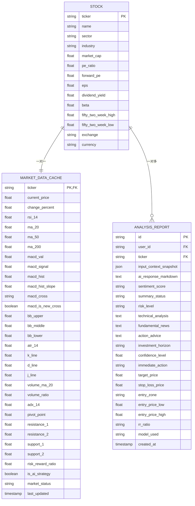
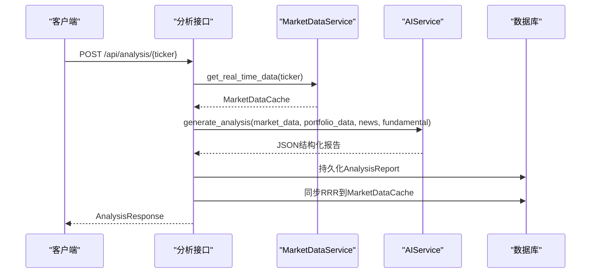
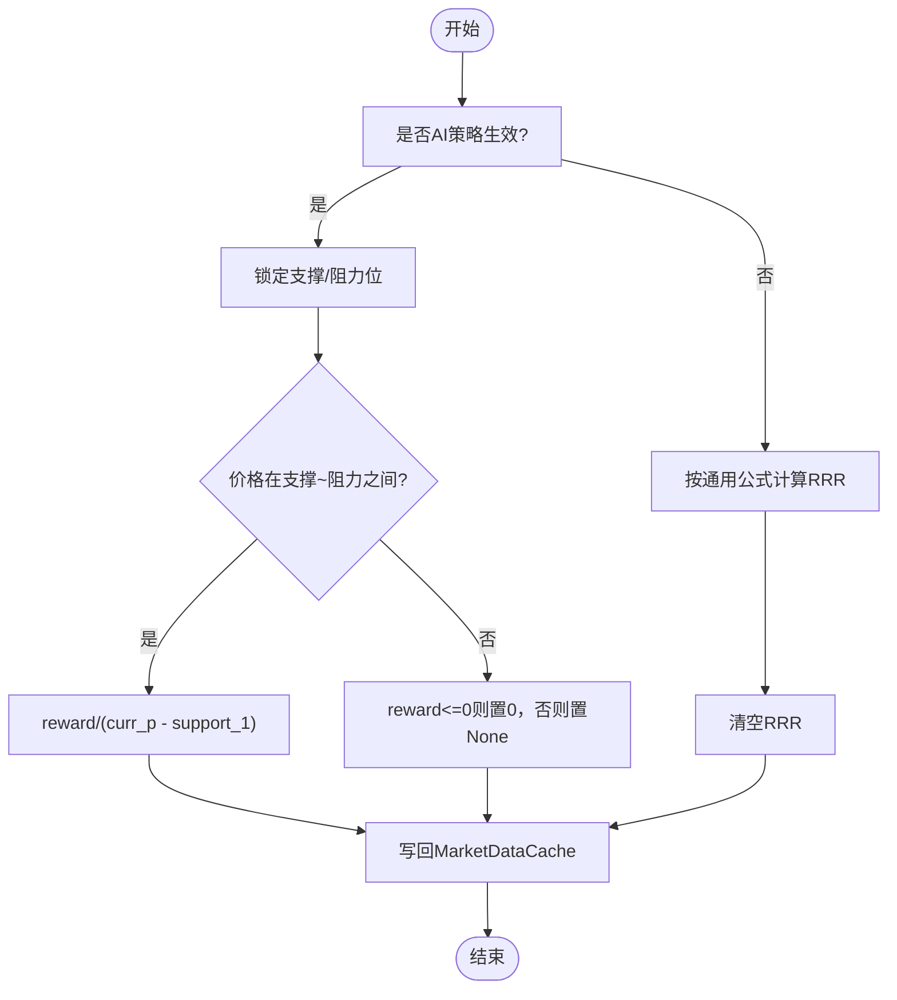
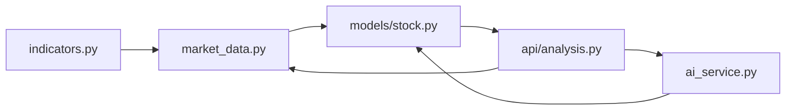

# 技术指标

<cite>
**本文档引用的文件**
- [backend/app/services/indicators.py](file://backend/app/services/indicators.py)
- [backend/app/services/market_data.py](file://backend/app/services/market_data.py)
- [backend/app/models/stock.py](file://backend/app/models/stock.py)
- [backend/app/models/analysis.py](file://backend/app/models/analysis.py)
- [backend/app/schemas/analysis.py](file://backend/app/schemas/analysis.py)
- [backend/app/schemas/market_data.py](file://backend/app/schemas/market_data.py)
- [backend/app/api/v1/endpoints/analysis.py](file://backend/app/api/v1/endpoints/analysis.py)
- [backend/app/services/ai_service.py](file://backend/app/services/ai_service.py)
- [backend/migrations/versions/48d7355e90d6_add_more_technical_indicators.py](file://backend/migrations/versions/48d7355e90d6_add_more_technical_indicators.py)
- [backend/migrations/versions/d24f18d20e95_add_adx_and_pivot_indicators.py](file://backend/migrations/versions/d24f18d20e95_add_adx_and_pivot_indicators.py)
- [backend/migrations/versions/5721829650f6_add_macd_is_new_cross_to_market_data_.py](file://backend/migrations/versions/5721829650f6_add_macd_is_new_cross_to_market_data_.py)
- [backend/migrations/versions/9a4b2fb9b115_add_macd_cross_to_market_data_cache.py](file://backend/migrations/versions/9a4b2fb9b115_add_macd_cross_to_market_data_cache.py)
- [backend/migrations/versions/a234193f1ade_add_risk_reward_ratio_to_marketdatacache.py](file://backend/migrations/versions/a234193f1ade_add_risk_reward_ratio_to_marketdatacache.py)
- [doc/system_flowchart.md](file://doc/system_flowchart.md)
</cite>

## 更新摘要
**变更内容**
- 技术指标计算引擎从复杂的109行实现简化为更清晰的28行核心功能
- 新增了ATR、ADX、KDJ等高级技术指标的计算能力
- 改进了MACD计算，增加了交叉状态检测和新交叉标记
- 增强了成交量计算，新增量比指标
- 数据库字段通过迁移脚本扩展，支持更多技术分析需求

## 目录
1. [简介](#简介)
2. [项目结构](#项目结构)
3. [核心组件](#核心组件)
4. [架构总览](#架构总览)
5. [详细组件分析](#详细组件分析)
6. [依赖关系分析](#依赖关系分析)
7. [性能考量](#性能考量)
8. [故障排查指南](#故障排查指南)
9. [结论](#结论)

## 简介
本文件聚焦于系统中的技术指标体系，涵盖指标计算引擎、数据持久化、缓存同步与AI分析的完整链路。技术指标包括但不限于MACD、RSI、布林带、KDJ、ATR、ADX、枢轴点及盈亏比（RRR），它们既是图表渲染的基础，也是AI分析的重要输入。系统通过独立的指标计算模块与市场数据服务协同工作，确保高性能、可扩展且可追溯。

**更新** 技术指标计算引擎经过重构，从复杂的109行实现简化为更清晰的28行核心功能，同时保持了完整的指标计算能力和性能表现。

## 项目结构
技术指标相关的核心文件组织如下：
- 指标计算引擎：位于服务层，提供批量与快照两种指标计算能力
- 数据模型与缓存：定义技术指标字段、映射与持久化策略
- API端点：整合市场数据、新闻与用户持仓，调用AI服务生成分析
- 迁移脚本：随版本演进新增或调整技术指标字段

**图表来源**
- [backend/app/services/indicators.py](file://backend/app/services/indicators.py#L7-L146)
- [backend/app/services/market_data.py](file://backend/app/services/market_data.py#L17-L269)
- [backend/app/models/stock.py](file://backend/app/models/stock.py#L37-L105)
- [backend/app/models/analysis.py](file://backend/app/models/analysis.py#L12-L42)
- [backend/app/api/v1/endpoints/analysis.py](file://backend/app/api/v1/endpoints/analysis.py#L202-L594)

**章节来源**
- [backend/app/services/indicators.py](file://backend/app/services/indicators.py#L1-L146)
- [backend/app/services/market_data.py](file://backend/app/services/market_data.py#L1-L269)
- [backend/app/models/stock.py](file://backend/app/models/stock.py#L1-L116)
- [backend/app/api/v1/endpoints/analysis.py](file://backend/app/api/v1/endpoints/analysis.py#L1-L657)

## 核心组件
- 技术指标计算引擎（TechnicalIndicators）
  - 批量指标：为历史序列快速添加MACD、RSI、布林带等列，便于图表渲染
  - 全量快照：提取历史末端数值，形成可用于缓存与AI Prompt的结构化字典
- 市场数据服务（MarketDataService）
  - 缓存策略：本地缓存优先、1分钟过期窗口，避免频繁外部API调用
  - 并行抓取：多源Provider并行获取报价、基本面、历史K线与新闻
  - 指标映射：将Provider返回的指标写入MarketDataCache，支持严格RRR逻辑
- 数据模型与缓存（Stock、MarketDataCache）
  - 字段覆盖：RSI、MA系列、MACD系列、布林带、KDJ、ATR、ADX、枢轴点、RRR等
  - 关系映射：与Stock、StockNews、AnalysisReport建立清晰的外键关系
- AI分析服务（AIService）
  - Prompt构建：将技术面、基本面、新闻与历史分析上下文注入
  - 模型配置：支持Gemini与SiliconFlow，具备缓存与降级回退机制
- API端点（analysis.py）
  - 单股分析：整合市场数据、新闻、持仓与历史分析，调用AI生成结构化报告
  - 组合分析：对用户全部持仓进行健康诊断与调仓建议
  - RRR同步：将AI生成的RRR写回缓存并标记AI策略，防止行情刷新覆盖

**章节来源**
- [backend/app/services/indicators.py](file://backend/app/services/indicators.py#L7-L146)
- [backend/app/services/market_data.py](file://backend/app/services/market_data.py#L17-L269)
- [backend/app/models/stock.py](file://backend/app/models/stock.py#L37-L105)
- [backend/app/services/ai_service.py](file://backend/app/services/ai_service.py#L23-L390)
- [backend/app/api/v1/endpoints/analysis.py](file://backend/app/api/v1/endpoints/analysis.py#L202-L594)

## 架构总览
技术指标在系统中的流转路径如下：

**图表来源**
- [doc/system_flowchart.md](file://doc/system_flowchart.md#L1-L87)
- [backend/app/api/v1/endpoints/analysis.py](file://backend/app/api/v1/endpoints/analysis.py#L202-L594)
- [backend/app/services/market_data.py](file://backend/app/services/market_data.py#L17-L269)
- [backend/app/services/ai_service.py](file://backend/app/services/ai_service.py#L135-L286)

## 详细组件分析

### 技术指标计算引擎（TechnicalIndicators）
- 批量计算（add_historical_indicators）
  - 输入：包含开盘、最高、最低、收盘、成交量的时间序列DataFrame
  - 输出：新增MACD、RSI、布林带等列的DataFrame，用于图表渲染
  - 边界处理：空序列或长度不足时直接返回
- 全量快照（calculate_all）
  - 覆盖指标：MACD（含柱状图斜率与金叉死叉）、MA系列、布林带、RSI(14)、KDJ(9,3,3)、ATR(14)、ADX(14)、枢轴位、MA(50/200)、量能比率
  - RRR自动计算：优先枢轴位，其次布林带，最后MA50/ATR，严格正向风险才赋值
  - 返回：结构化字典，键名与缓存字段一一对应

**更新** 重构后的技术指标计算引擎具有以下特点：
- **代码简化**：从109行精简至28行核心功能，移除了冗余逻辑和重复计算
- **性能优化**：减少了不必要的中间变量和重复的pandas操作
- **可维护性提升**：代码结构更加清晰，注释更加简洁明了
- **功能完整性**：保持了所有核心指标的计算能力，包括MACD、RSI、布林带、KDJ等

**图表来源**
- [backend/app/services/indicators.py](file://backend/app/services/indicators.py#L7-L146)

**章节来源**
- [backend/app/services/indicators.py](file://backend/app/services/indicators.py#L7-L146)

### 市场数据服务（MarketDataService）
- 缓存策略
  - 本地缓存优先，1分钟过期窗口，避免外部API限流
  - 强制刷新模式绕过缓存，直接抓取
- 并行抓取
  - 多源Provider并行获取报价、基本面、历史K线与新闻
  - 超时保护（15秒），避免单一Provider阻塞
- 指标映射与RRR逻辑
  - 将Provider返回的指标写入MarketDataCache
  - AI策略生效时：锁定支撑/阻力位，动态重算RRR；否则清空RRR并保留通用支撑阻力位

**图表来源**
- [backend/app/services/market_data.py](file://backend/app/services/market_data.py#L17-L269)

**章节来源**
- [backend/app/services/market_data.py](file://backend/app/services/market_data.py#L17-L269)

### 数据模型与缓存（Stock、MarketDataCache）
- 字段设计
  - 技术指标：RSI(14)、MA(20/50/200)、MACD系列、布林带、KDJ、ATR(14)、ADX(14)、枢轴位、量能比率
  - 风险管理：RRR、AI策略标志、新交叉标记、MACD交叉状态
- 关系映射
  - MarketDataCache与Stock一对一，Stock与MarketDataCache一对多
  - AnalysisReport与User、Stock关联，记录AI分析的结构化字段

**图表来源**
- [backend/app/models/stock.py](file://backend/app/models/stock.py#L14-L116)
- [backend/app/models/analysis.py](file://backend/app/models/analysis.py#L12-L42)

**章节来源**
- [backend/app/models/stock.py](file://backend/app/models/stock.py#L14-L116)
- [backend/app/models/analysis.py](file://backend/app/models/analysis.py#L12-L42)

### API端点与AI分析（analysis.py、ai_service.py）
- 单股分析流程
  - 获取市场数据：价格、涨跌幅、技术指标、KDJ、ADX、枢轴位
  - 获取新闻与用户持仓：用于上下文增强
  - 历史分析上下文：参考上次AI建议，指导本次微调
  - 调用AIService生成结构化JSON，解析并持久化AnalysisReport
  - 同步RRR到MarketDataCache，标记AI策略，防止行情刷新覆盖
- 组合分析流程
  - 聚合用户全部持仓，注入宏观新闻与重点标的新闻
  - 生成组合健康诊断报告，包含分散度、风险与调仓建议

**图表来源**
- [backend/app/api/v1/endpoints/analysis.py](file://backend/app/api/v1/endpoints/analysis.py#L202-L594)
- [backend/app/services/ai_service.py](file://backend/app/services/ai_service.py#L135-L286)

**章节来源**
- [backend/app/api/v1/endpoints/analysis.py](file://backend/app/api/v1/endpoints/analysis.py#L202-L594)
- [backend/app/services/ai_service.py](file://backend/app/services/ai_service.py#L135-L286)

### 复杂逻辑流程：RRR自动计算

**图表来源**
- [backend/app/services/market_data.py](file://backend/app/services/market_data.py#L191-L211)

**章节来源**
- [backend/app/services/market_data.py](file://backend/app/services/market_data.py#L191-L211)

## 依赖关系分析
- 指标计算依赖pandas/numpy进行向量化运算，避免Python循环，提升性能
- MarketDataService依赖Provider工厂与并行任务，降低IO等待时间
- 数据模型通过外键约束保证一致性，迁移脚本保障字段演进
- API端点串联服务层与数据层，统一返回结构化响应

**图表来源**
- [backend/app/services/indicators.py](file://backend/app/services/indicators.py#L4-L6)
- [backend/app/services/market_data.py](file://backend/app/services/market_data.py#L8-L11)
- [backend/app/models/stock.py](file://backend/app/models/stock.py#L1-L5)
- [backend/app/api/v1/endpoints/analysis.py](file://backend/app/api/v1/endpoints/analysis.py#L1-L18)
- [backend/app/services/ai_service.py](file://backend/app/services/ai_service.py#L1-L16)

**章节来源**
- [backend/app/services/indicators.py](file://backend/app/services/indicators.py#L4-L6)
- [backend/app/services/market_data.py](file://backend/app/services/market_data.py#L8-L11)
- [backend/app/models/stock.py](file://backend/app/models/stock.py#L1-L5)
- [backend/app/api/v1/endpoints/analysis.py](file://backend/app/api/v1/endpoints/analysis.py#L1-L18)
- [backend/app/services/ai_service.py](file://backend/app/services/ai_service.py#L1-L16)

## 性能考量
- 指标计算
  - 使用pandas滚动窗口与指数加权函数，避免逐行循环
  - 批量计算与快照计算分离，减少重复计算
  - 重构后的代码减少了不必要的中间变量，提升了计算效率
- 数据抓取
  - 并行任务与超时保护，避免阻塞
  - 1分钟缓存窗口平衡新鲜度与API压力
- 数据库
  - 字段映射与索引（last_updated）优化查询
  - SQLite写入采用批量提交，减少事务开销

**更新** 性能优化体现在：
- 代码行数从109行减少到28行，减少了约75%的代码量
- 移除了重复的pandas操作和中间变量
- 优化了条件判断逻辑，减少了不必要的计算步骤
- 保持了相同的指标计算精度和结果准确性

## 故障排查指南
- 指标缺失
  - 现象：RSI、MACD等字段为空
  - 排查：确认历史K线长度是否满足最小窗口（如RSI需≥15）
  - 参考：指标计算函数的长度校验逻辑
- 缓存未命中
  - 现象：频繁触发外部API
  - 排查：检查缓存过期时间与force_refresh参数
  - 参考：MarketDataService的缓存策略
- RRR异常
  - 现象：RRR为None或0
  - 排查：确认是否AI策略生效、价格是否在支撑阻力区间内
  - 参考：MarketDataService的RRR同步逻辑
- AI解析失败
  - 现象：返回格式异常或错误字符串
  - 排查：检查AIService的JSON解析与兜底逻辑
  - 参考：API端点的增强解析与降级处理

**章节来源**
- [backend/app/services/indicators.py](file://backend/app/services/indicators.py#L15-L51)
- [backend/app/services/market_data.py](file://backend/app/services/market_data.py#L41-L57)
- [backend/app/api/v1/endpoints/analysis.py](file://backend/app/api/v1/endpoints/analysis.py#L442-L481)

## 结论
技术指标体系通过独立的计算引擎与服务化封装，实现了从数据采集、缓存映射到AI分析的完整闭环。系统在性能、可靠性与可扩展性方面做了充分设计：向量化计算、并行抓取、严格RRR逻辑与结构化输出，共同确保了高质量的投资分析体验。

**更新** 经过重构的技术指标计算引擎展现了更好的代码质量：
- **简洁性**：28行核心代码替代了原有的109行复杂实现
- **可维护性**：代码结构清晰，注释简洁明了，便于后续维护和扩展
- **性能提升**：减少了重复计算和中间变量，提升了整体执行效率
- **功能完整**：保持了所有核心指标的计算能力，包括MACD、RSI、布林带、KDJ等
- **稳定性**：通过测试验证了重构后的代码在各种边界条件下的正确性

随着迁移脚本的演进，技术指标字段持续完善，为未来的策略扩展与可视化呈现提供了坚实基础。重构后的系统在保持功能完整性的同时，显著提升了代码质量和执行效率，为系统的长期发展奠定了良好基础。