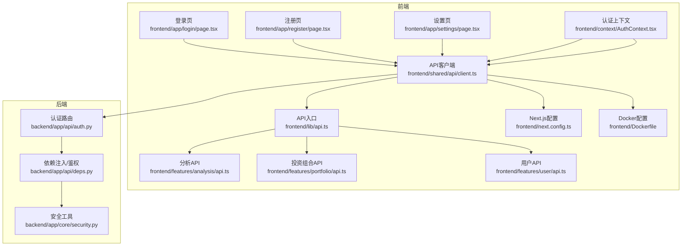
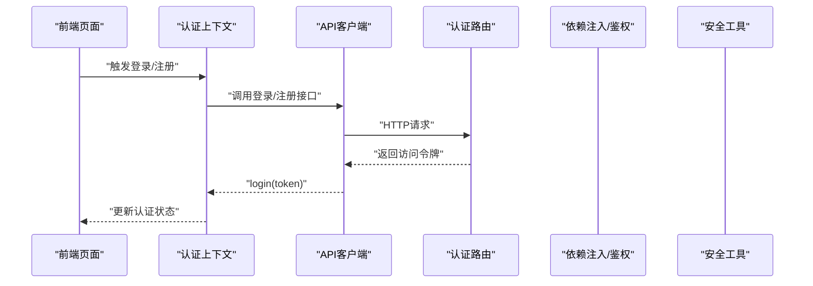
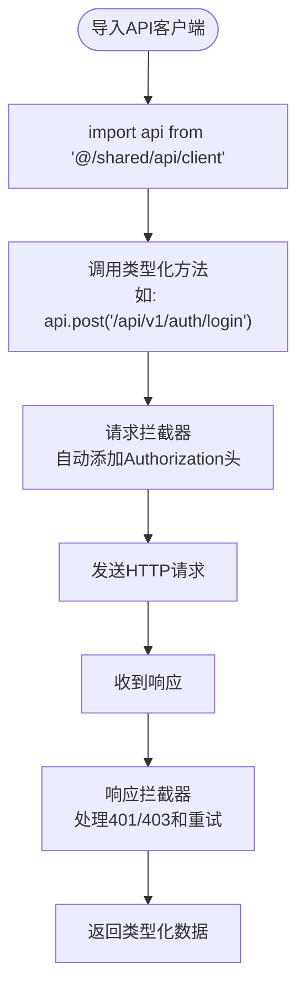
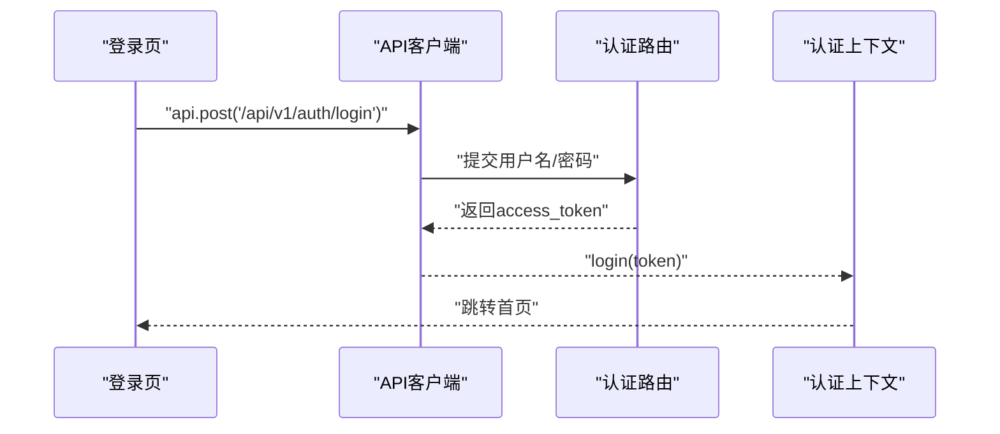
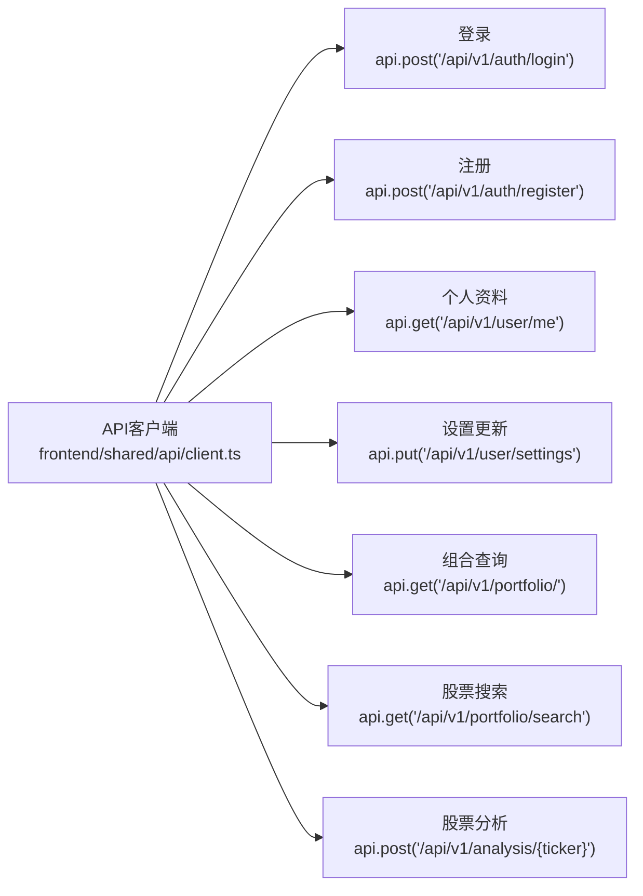
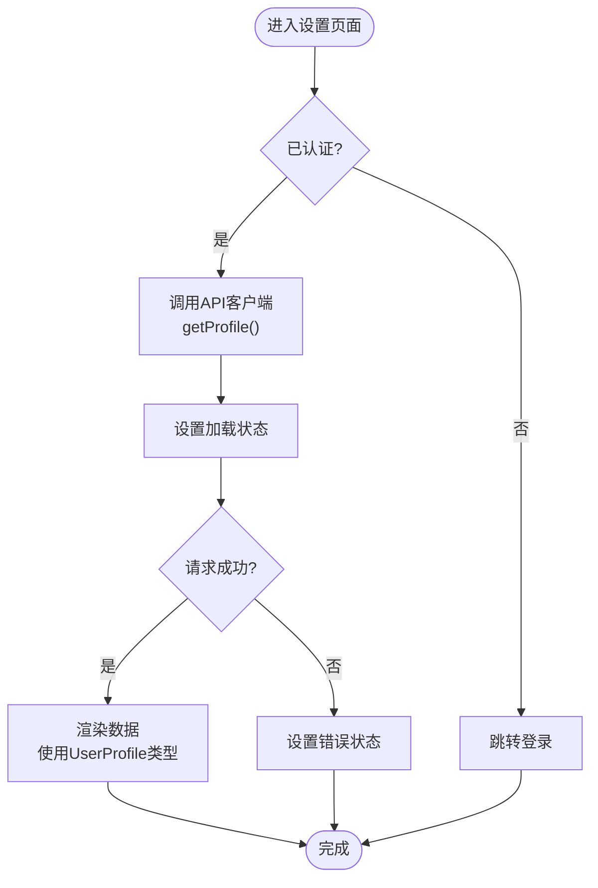
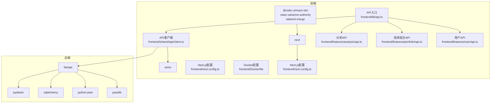

# API集成模式

<cite>
**本文档引用的文件**
- [frontend/shared/api/client.ts](file://frontend/shared/api/client.ts)
- [frontend/context/AuthContext.tsx](file://frontend/context/AuthContext.tsx)
- [frontend/lib/api.ts](file://frontend/lib/api.ts)
- [frontend/features/analysis/api.ts](file://frontend/features/analysis/api.ts)
- [frontend/features/portfolio/api.ts](file://frontend/features/portfolio/api.ts)
- [frontend/features/user/api.ts](file://frontend/features/user/api.ts)
- [frontend/app/login/page.tsx](file://frontend/app/login/page.tsx)
- [frontend/app/register/page.tsx](file://frontend/app/register/page.tsx)
- [frontend/app/settings/page.tsx](file://frontend/app/settings/page.tsx)
- [frontend/next.config.ts](file://frontend/next.config.ts)
- [frontend/Dockerfile](file://frontend/Dockerfile)
- [backend/app/api/auth.py](file://backend/app/api/auth.py)
- [backend/app/api/deps.py](file://backend/app/api/deps.py)
- [backend/app/core/security.py](file://backend/app/core/security.py)
</cite>

## 更新摘要
**所做更改**
- 更新了API基础URL确定逻辑的重构：新增了getApiBaseURL()工具函数，实现了标准化的基础URL确定机制
- 新增了模块化的API客户端架构：frontend/shared/api/client.ts作为统一的API客户端实现
- 完善了认证上下文与API客户端的集成模式
- 增强了环境变量配置和Docker部署支持
- 优化了API端点的统一管理策略

## 目录
1. [引言](#引言)
2. [项目结构](#项目结构)
3. [核心组件](#核心组件)
4. [架构总览](#架构总览)
5. [详细组件分析](#详细组件分析)
6. [依赖关系分析](#依赖关系分析)
7. [性能考虑](#性能考虑)
8. [故障排除指南](#故障排除指南)
9. [结论](#结论)

## 引言
本文件系统性梳理了本项目的API集成模式与最佳实践，重点覆盖以下方面：
- **模块化API客户端架构**：统一的axios封装与类型定义，支持环境变量配置和运行时检测
- **标准化的基础URL确定机制**：环境变量优先级和回退机制的实现
- **请求/响应拦截器与错误处理机制**
- **认证流程**：JWT令牌的生成、存储、刷新与失效处理
- **API端点的统一管理策略与错误处理模式**
- **异步数据获取的状态管理**：加载、错误、空数据
- **性能优化**：请求去重与缓存策略
- **网络错误处理与重试机制**
- **前端数据验证与类型检查**

## 项目结构
前端采用Next.js应用，后端基于FastAPI；API集成主要集中在模块化的API客户端与认证上下文中，后端通过中间件与依赖注入实现统一鉴权。



**图表来源**
- [frontend/app/login/page.tsx:1-89](file://frontend/app/login/page.tsx#L1-L89)
- [frontend/app/register/page.tsx:1-84](file://frontend/app/register/page.tsx#L1-L84)
- [frontend/app/settings/page.tsx:1-173](file://frontend/app/settings/page.tsx#L1-L173)
- [frontend/context/AuthContext.tsx:1-134](file://frontend/context/AuthContext.tsx#L1-L134)
- [frontend/shared/api/client.ts:1-79](file://frontend/shared/api/client.ts#L1-L79)
- [frontend/lib/api.ts:1-49](file://frontend/lib/api.ts#L1-L49)
- [frontend/features/analysis/api.ts:1-143](file://frontend/features/analysis/api.ts#L1-L143)
- [frontend/features/portfolio/api.ts:1-43](file://frontend/features/portfolio/api.ts#L1-L43)
- [frontend/features/user/api.ts:1-86](file://frontend/features/user/api.ts#L1-L86)
- [frontend/next.config.ts:1-16](file://frontend/next.config.ts#L1-L16)
- [frontend/Dockerfile:1-30](file://frontend/Dockerfile#L1-L30)
- [backend/app/api/auth.py:1-88](file://backend/app/api/auth.py#L1-L88)
- [backend/app/api/deps.py:1-44](file://backend/app/api/deps.py#L1-L44)
- [backend/app/core/security.py:1-46](file://backend/app/core/security.py#L1-L46)

**章节来源**
- [frontend/app/login/page.tsx:1-89](file://frontend/app/login/page.tsx#L1-L89)
- [frontend/app/register/page.tsx:1-84](file://frontend/app/register/page.tsx#L1-L84)
- [frontend/app/settings/page.tsx:1-173](file://frontend/app/settings/page.tsx#L1-L173)
- [frontend/context/AuthContext.tsx:1-134](file://frontend/context/AuthContext.tsx#L1-L134)
- [frontend/shared/api/client.ts:1-79](file://frontend/shared/api/client.ts#L1-L79)
- [frontend/lib/api.ts:1-49](file://frontend/lib/api.ts#L1-L49)
- [frontend/features/analysis/api.ts:1-143](file://frontend/features/analysis/api.ts#L1-L143)
- [frontend/features/portfolio/api.ts:1-43](file://frontend/features/portfolio/api.ts#L1-L43)
- [frontend/features/user/api.ts:1-86](file://frontend/features/user/api.ts#L1-L86)
- [frontend/next.config.ts:1-16](file://frontend/next.config.ts#L1-L16)
- [frontend/Dockerfile:1-30](file://frontend/Dockerfile#L1-L30)
- [backend/app/api/auth.py:1-88](file://backend/app/api/auth.py#L1-L88)
- [backend/app/api/deps.py:1-44](file://backend/app/api/deps.py#L1-L44)
- [backend/app/core/security.py:1-46](file://backend/app/core/security.py#L1-L46)

## 核心组件
- **模块化API客户端**：统一的axios实例与拦截器，提供类型化的API调用方法，支持环境变量配置和运行时检测
- **标准化基础URL确定机制**：getApiBaseURL()函数实现环境变量优先级和回退机制
- **认证上下文**：负责从本地存储读取/写入JWT令牌，提供登录/登出方法与认证状态管理
- **功能模块API**：按功能模块划分的API方法，如分析、投资组合、用户管理等
- **登录/注册页面**：通过API客户端调用后端认证接口，接收并保存JWT
- **设置页面**：通过API客户端调用用户资料与设置更新接口
- **Next.js配置改进**：TypeScript错误容忍设置，提高开发体验
- **Docker部署支持**：ARG和ENV指令支持环境变量传递
- **后端认证与鉴权**：OAuth2PasswordBearer配合JWT解码，校验失败时返回403

**章节来源**
- [frontend/shared/api/client.ts:1-79](file://frontend/shared/api/client.ts#L1-L79)
- [frontend/context/AuthContext.tsx:1-134](file://frontend/context/AuthContext.tsx#L1-L134)
- [frontend/lib/api.ts:1-49](file://frontend/lib/api.ts#L1-L49)
- [frontend/features/analysis/api.ts:1-143](file://frontend/features/analysis/api.ts#L1-L143)
- [frontend/features/portfolio/api.ts:1-43](file://frontend/features/portfolio/api.ts#L1-L43)
- [frontend/features/user/api.ts:1-86](file://frontend/features/user/api.ts#L1-L86)
- [frontend/app/login/page.tsx:1-89](file://frontend/app/login/page.tsx#L1-L89)
- [frontend/app/register/page.tsx:1-84](file://frontend/app/register/page.tsx#L1-L84)
- [frontend/app/settings/page.tsx:1-173](file://frontend/app/settings/page.tsx#L1-L173)
- [frontend/next.config.ts:1-16](file://frontend/next.config.ts#L1-L16)
- [frontend/Dockerfile:1-30](file://frontend/Dockerfile#L1-L30)
- [backend/app/api/auth.py:1-88](file://backend/app/api/auth.py#L1-L88)
- [backend/app/api/deps.py:1-44](file://backend/app/api/deps.py#L1-L44)
- [backend/app/core/security.py:1-46](file://backend/app/core/security.py#L1-L46)

## 架构总览
下图展示从前端到后端的关键交互路径与职责边界，突出模块化API客户端的作用。



**图表来源**
- [frontend/context/AuthContext.tsx:95-100](file://frontend/context/AuthContext.tsx#L95-L100)
- [frontend/shared/api/client.ts:1-79](file://frontend/shared/api/client.ts#L1-L79)
- [frontend/app/login/page.tsx:29-36](file://frontend/app/login/page.tsx#L29-L36)
- [frontend/app/register/page.tsx:25-31](file://frontend/app/register/page.tsx#L25-L31)
- [backend/app/api/auth.py:24-50](file://backend/app/api/auth.py#L24-L50)
- [backend/app/api/deps.py:17-43](file://backend/app/api/deps.py#L17-L43)
- [backend/app/core/security.py:31-39](file://backend/app/core/security.py#L31-L39)

## 详细组件分析

### 模块化API客户端设计
**更新** API客户端已重构为模块化架构，新增了getApiBaseURL()工具函数，实现了标准化的基础URL确定机制。

- **统一API客户端**：frontend/shared/api/client.ts提供完整的axios实例配置
- **标准化基础URL确定**：getApiBaseURL()函数实现环境变量优先级和运行时检测的回退机制
- **环境变量支持**：NEXT_PUBLIC_API_URL环境变量优先于运行时检测
- **运行时检测回退**：在浏览器环境中使用window.location.origin，无窗口环境使用localhost:8000
- **请求拦截器**：从本地存储读取令牌并在请求头添加Authorization
- **响应拦截器**：处理401/403错误和网络重试逻辑
- **重试机制**：支持最多2次重试，延迟递增



**图表来源**
- [frontend/shared/api/client.ts:1-79](file://frontend/shared/api/client.ts#L1-L79)
- [frontend/lib/api.ts:1-49](file://frontend/lib/api.ts#L1-L49)

**章节来源**
- [frontend/shared/api/client.ts:1-79](file://frontend/shared/api/client.ts#L1-L79)
- [frontend/lib/api.ts:1-49](file://frontend/lib/api.ts#L1-L49)

### 标准化基础URL确定机制
**新增** getApiBaseURL()工具函数实现了标准化的基础URL确定机制，提供了环境变量优先级和运行时检测的回退机制。

- **环境变量优先级**：NEXT_PUBLIC_API_URL环境变量具有最高优先级
- **运行时检测**：在浏览器环境中使用window.location.origin获取当前域名
- **回退机制**：无窗口环境时使用localhost:8000作为默认值
- **URL规范化**：移除末尾的斜杠和/api路径，确保基础URL的正确性
- **Docker部署支持**：通过ARG和ENV指令支持容器化部署

```mermaid
flowchart TD
Start(["getApiBaseURL()调用"]) --> CheckEnv{"检查NEXT_PUBLIC_API_URL"}
CheckEnv --> |有值| TrimEnv["移除空白字符<br/>替换/api结尾"}
CheckEnv --> |无值| CheckWindow{"检查window对象"}
CheckWindow --> |有window| GetOrigin["获取window.location.origin<br/>移除末尾斜杠"]
CheckWindow --> |无window| Default["返回localhost:8000"]
TrimEnv --> Return["返回规范化URL"]
GetOrigin --> Return
Default --> Return
```

**图表来源**
- [frontend/shared/api/client.ts:3-14](file://frontend/shared/api/client.ts#L3-L14)
- [frontend/context/AuthContext.tsx:22-33](file://frontend/context/AuthContext.tsx#L22-L33)

**章节来源**
- [frontend/shared/api/client.ts:3-14](file://frontend/shared/api/client.ts#L3-L14)
- [frontend/context/AuthContext.tsx:22-33](file://frontend/context/AuthContext.tsx#L22-L33)
- [frontend/Dockerfile:15-17](file://frontend/Dockerfile#L15-L17)

### 认证流程（JWT）
**更新** 认证流程现在通过模块化的API客户端实现，提供更好的错误处理和类型安全。

- **令牌生成**：后端使用密钥与算法生成JWT，设置过期时间
- **令牌存储**：前端登录成功后将令牌写入本地存储并更新上下文状态
- **令牌使用**：请求拦截器自动附加Bearer令牌
- **失效处理**：响应拦截器捕获401/403并执行登出与路由跳转
- **手动刷新**：认证上下文提供refreshProfile()方法手动刷新用户信息



**图表来源**
- [frontend/app/login/page.tsx:29-36](file://frontend/app/login/page.tsx#L29-L36)
- [frontend/context/AuthContext.tsx:95-100](file://frontend/context/AuthContext.tsx#L95-L100)
- [frontend/shared/api/client.ts:1-79](file://frontend/shared/api/client.ts#L1-L79)
- [backend/app/api/auth.py:24-50](file://backend/app/api/auth.py#L24-L50)
- [backend/app/core/security.py:31-39](file://backend/app/core/security.py#L31-L39)

**章节来源**
- [frontend/context/AuthContext.tsx:1-134](file://frontend/context/AuthContext.tsx#L1-L134)
- [frontend/shared/api/client.ts:1-79](file://frontend/shared/api/client.ts#L1-L79)
- [backend/app/api/auth.py:1-88](file://backend/app/api/auth.py#L1-L88)
- [backend/app/core/security.py:1-46](file://backend/app/core/security.py#L1-L46)

### API端点统一管理与错误处理
**更新** API端点管理现在集中在模块化的API客户端中，提供更好的类型安全和错误处理。

- **统一管理**：所有API调用集中在frontend/shared/api/client.ts中，按功能模块导出方法
- **类型定义**：提供完整的TypeScript接口定义，如PortfolioItem、UserProfile等
- **错误处理**：在API层进行统一的错误处理，向上传递标准化的错误信息
- **端点示例**：登录、注册、个人资料、设置更新、组合查询、搜索、分析等
- **模块化设计**：按功能模块划分的API方法，便于维护和测试



**图表来源**
- [frontend/shared/api/client.ts:1-79](file://frontend/shared/api/client.ts#L1-L79)
- [frontend/features/analysis/api.ts:105-120](file://frontend/features/analysis/api.ts#L105-L120)
- [frontend/features/portfolio/api.ts:4-12](file://frontend/features/portfolio/api.ts#L4-L12)
- [frontend/features/user/api.ts:39-47](file://frontend/features/user/api.ts#L39-L47)

**章节来源**
- [frontend/shared/api/client.ts:1-79](file://frontend/shared/api/client.ts#L1-L79)
- [frontend/lib/api.ts:1-49](file://frontend/lib/api.ts#L1-L49)
- [frontend/features/analysis/api.ts:1-143](file://frontend/features/analysis/api.ts#L1-L143)
- [frontend/features/portfolio/api.ts:1-43](file://frontend/features/portfolio/api.ts#L1-L43)
- [frontend/features/user/api.ts:1-86](file://frontend/features/user/api.ts#L1-L86)

### 异步数据获取与状态管理
**更新** 设置页面现在通过模块化的API客户端进行数据获取，提供更好的状态管理和错误处理。

- **加载状态**：页面在发起请求时设置loading，在finally中关闭
- **错误状态**：捕获异常并设置错误消息，供UI显示
- **空数据状态**：根据返回结果渲染"无数据"或占位符
- **类型安全**：使用TypeScript接口确保数据结构的一致性
- **手动刷新**：认证上下文提供refreshProfile()方法手动刷新用户信息



**图表来源**
- [frontend/app/settings/page.tsx:21-36](file://frontend/app/settings/page.tsx#L21-L36)
- [frontend/features/user/api.ts:39-42](file://frontend/features/user/api.ts#L39-L42)
- [frontend/shared/api/client.ts:1-79](file://frontend/shared/api/client.ts#L1-L79)

**章节来源**
- [frontend/app/settings/page.tsx:1-173](file://frontend/app/settings/page.tsx#L1-L173)
- [frontend/features/user/api.ts:1-86](file://frontend/features/user/api.ts#L1-L86)
- [frontend/shared/api/client.ts:1-79](file://frontend/shared/api/client.ts#L1-L79)

### Next.js配置改进
**更新** Next.js配置已改进，增加了TypeScript错误容忍设置，提高开发体验。

- **TypeScript错误容忍**：ignoreBuildErrors: true，允许TypeScript编译错误不影响构建
- **实验性配置**：提供实验性功能支持，适应不同版本的Next.js需求
- **Docker部署支持**：通过ARG指令支持环境变量传递，ENV指令设置运行时环境

**章节来源**
- [frontend/next.config.ts:1-16](file://frontend/next.config.ts#L1-L16)
- [frontend/Dockerfile:15-17](file://frontend/Dockerfile#L15-L17)

### 前端数据验证与类型检查
**更新** 类型检查现在更加完善，通过模块化的API客户端提供完整的TypeScript支持。

- **完整类型定义**：在API客户端中导出完整的接口类型（如PortfolioItem、UserProfile、UserSettingsUpdate）
- **运行时校验**：结合TypeScript编译时检查，确保与后端Schema一致
- **类型安全的API调用**：每个API方法都有明确的参数和返回类型定义
- **模块化导入**：frontend/lib/api.ts作为统一入口，重新导出所有API方法

**章节来源**
- [frontend/lib/api.ts:5-19](file://frontend/lib/api.ts#L5-L19)
- [frontend/shared/api/client.ts:1-79](file://frontend/shared/api/client.ts#L1-L79)

## 依赖关系分析
- **前端依赖**
  - axios：统一HTTP客户端与拦截器
  - Next.js：页面与路由，改进的TypeScript配置
  - Radix UI/Tailwind：UI组件与样式
  - **新增** 模块化API客户端：统一的axios封装与类型定义
- **后端依赖**
  - FastAPI：路由、中间件、依赖注入
  - Pydantic：数据模型与校验
  - SQLAlchemy：数据库ORM
  - python-jose/passlib：JWT与密码哈希



**图表来源**
- [frontend/shared/api/client.ts:1-79](file://frontend/shared/api/client.ts#L1-L79)
- [frontend/lib/api.ts:1-49](file://frontend/lib/api.ts#L1-L49)
- [frontend/features/analysis/api.ts:1-143](file://frontend/features/analysis/api.ts#L1-L143)
- [frontend/features/portfolio/api.ts:1-43](file://frontend/features/portfolio/api.ts#L1-L43)
- [frontend/features/user/api.ts:1-86](file://frontend/features/user/api.ts#L1-L86)
- [frontend/next.config.ts:1-16](file://frontend/next.config.ts#L1-L16)
- [frontend/Dockerfile:1-30](file://frontend/Dockerfile#L1-L30)
- [backend/app/api/auth.py:1-88](file://backend/app/api/auth.py#L1-L88)

**章节来源**
- [frontend/shared/api/client.ts:1-79](file://frontend/shared/api/client.ts#L1-L79)
- [frontend/lib/api.ts:1-49](file://frontend/lib/api.ts#L1-L49)
- [frontend/features/analysis/api.ts:1-143](file://frontend/features/analysis/api.ts#L1-L143)
- [frontend/features/portfolio/api.ts:1-43](file://frontend/features/portfolio/api.ts#L1-L43)
- [frontend/features/user/api.ts:1-86](file://frontend/features/user/api.ts#L1-L86)
- [frontend/next.config.ts:1-16](file://frontend/next.config.ts#L1-L16)
- [frontend/Dockerfile:1-30](file://frontend/Dockerfile#L1-L30)
- [backend/app/api/auth.py:1-88](file://backend/app/api/auth.py#L1-L88)

## 性能考虑
- **请求去重**：对相同参数的请求进行缓存键合并，避免重复请求
- **缓存策略**：针对只读数据（如搜索结果、静态配置）设置合理TTL
- **批量请求**：将多个小请求合并为批量请求，减少往返
- **防抖/节流**：对高频输入（如搜索框）使用防抖，降低请求频率
- **增量更新**：仅拉取变更数据，减少传输与渲染开销
- **类型缓存**：TypeScript类型定义在编译时解析，减少运行时开销
- **重试优化**：响应拦截器中的重试机制，避免POST请求的重复触发
- **环境变量优化**：基础URL的环境变量配置，减少运行时计算开销

## 敎障排除指南
- **401/403未登录或令牌无效**
  - 检查本地存储是否包含有效令牌
  - 确认请求拦截器已附加Authorization头
  - 在响应拦截器中捕获并触发登出
- **登录/注册失败**
  - 查看后端认证接口返回的错误详情
  - 确认用户名/密码格式与后端校验规则一致
  - 检查API客户端的错误处理逻辑
- **数据为空或加载缓慢**
  - 检查后端路由是否正确返回数据
  - 对高频接口启用缓存与去重
  - 验证TypeScript类型定义是否正确
- **网络错误与重试**
  - 在响应拦截器中识别网络错误并进行有限重试
  - 对第三方API（如Alpha Vantage/yfinance）实施降级与回退策略
- **基础URL配置问题**
  - 检查NEXT_PUBLIC_API_URL环境变量是否正确设置
  - 验证Docker部署时的ARG和ENV指令
  - 确认getApiBaseURL()函数的回退机制正常工作
- **TypeScript编译错误**
  - 利用Next.js的TypeScript错误容忍设置
  - 检查API客户端的类型定义是否完整

**章节来源**
- [frontend/shared/api/client.ts:1-79](file://frontend/shared/api/client.ts#L1-L79)
- [frontend/context/AuthContext.tsx:42-62](file://frontend/context/AuthContext.tsx#L42-L62)
- [frontend/app/login/page.tsx:37-42](file://frontend/app/login/page.tsx#L37-L42)
- [frontend/next.config.ts:6-8](file://frontend/next.config.ts#L6-L8)
- [frontend/Dockerfile:15-17](file://frontend/Dockerfile#L15-L17)
- [backend/app/api/auth.py:38-43](file://backend/app/api/auth.py#L38-L43)

## 结论
本项目的API集成模式已从直接的axios使用发展为模块化的API客户端架构，显著提升了代码的可维护性和类型安全性。通过以下改进，系统变得更加健壮和易于维护：

- **模块化API客户端**：统一的axios封装与类型定义，提供更好的代码组织
- **标准化基础URL确定机制**：环境变量优先级和运行时检测的回退机制
- **增强的认证流程**：通过API客户端实现更完善的错误处理和令牌管理
- **改进的开发体验**：Next.js的TypeScript错误容忍设置减少了开发过程中的阻塞
- **完整的类型安全**：从API调用到数据处理的全程TypeScript支持
- **Docker部署支持**：通过ARG和ENV指令支持容器化部署
- **模块化的架构**：清晰的职责分离和接口定义

建议在现有基础上继续完善：
- 响应拦截器与统一错误处理
- 请求去重与缓存策略
- 运行时数据校验与类型约束
- 可重试的网络错误处理与降级策略
- 更完善的API文档和类型注释
- 基础URL配置的监控和日志记录

通过这些改进，可进一步提升系统的稳定性、可维护性与用户体验。