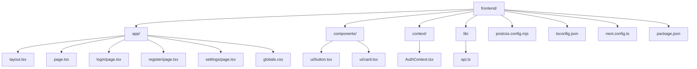
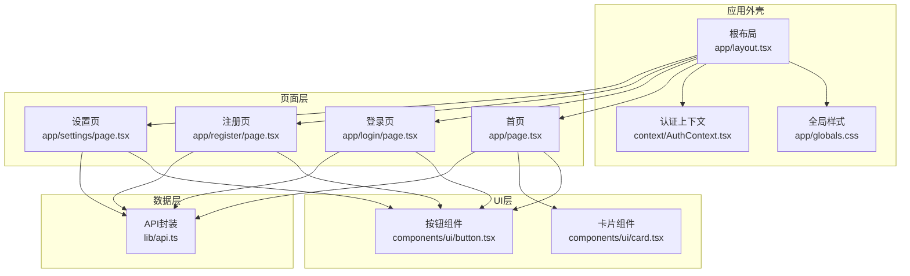
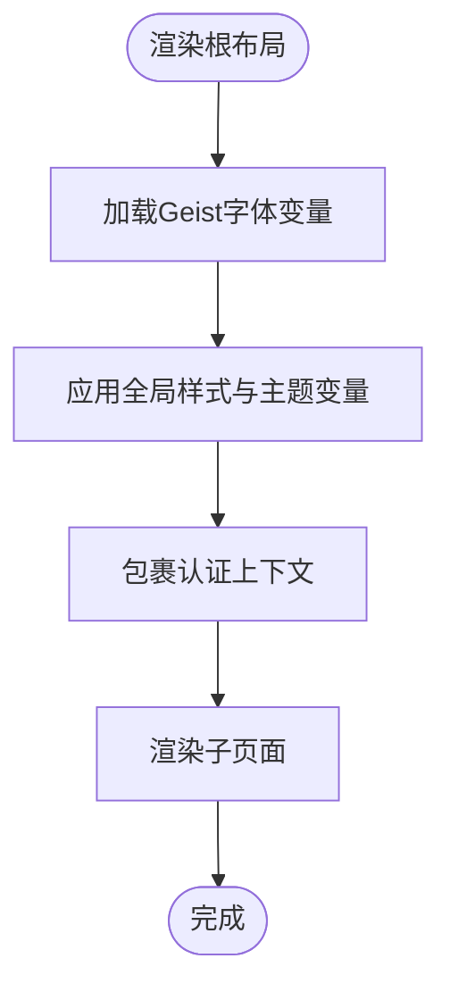
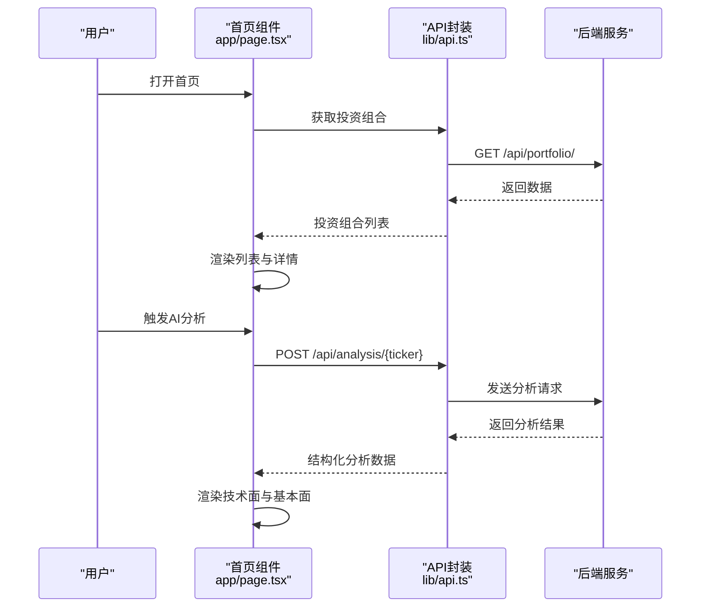
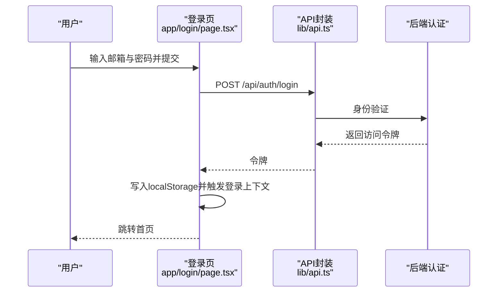
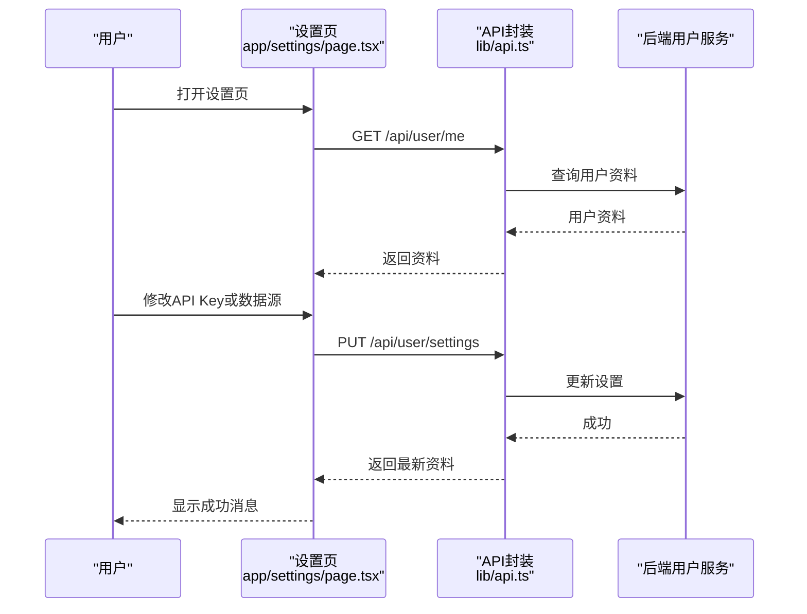
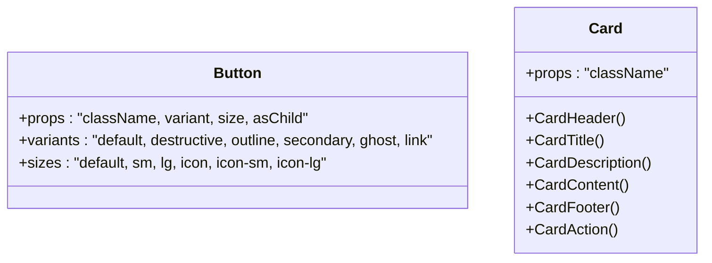
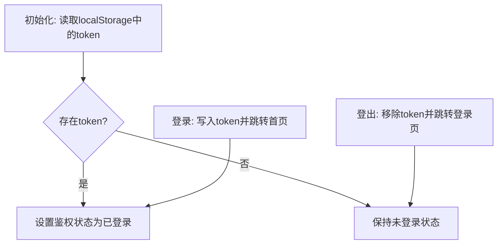
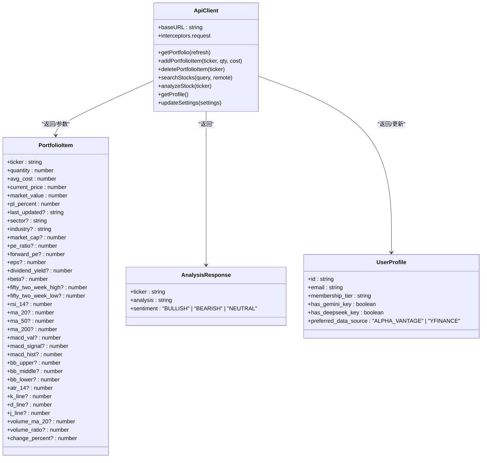
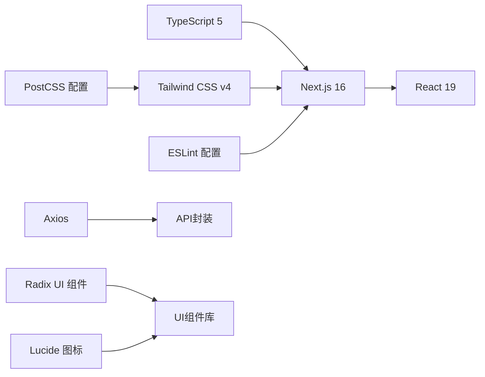

# Next.js应用架构

<cite>
**本文档引用的文件**
- [package.json](file://frontend/package.json)
- [next.config.ts](file://frontend/next.config.ts)
- [tsconfig.json](file://frontend/tsconfig.json)
- [app/layout.tsx](file://frontend/app/layout.tsx)
- [app/globals.css](file://frontend/app/globals.css)
- [app/page.tsx](file://frontend/app/page.tsx)
- [context/AuthContext.tsx](file://frontend/context/AuthContext.tsx)
- [components/ui/button.tsx](file://frontend/components/ui/button.tsx)
- [components/ui/card.tsx](file://frontend/components/ui/card.tsx)
- [app/login/page.tsx](file://frontend/app/login/page.tsx)
- [app/register/page.tsx](file://frontend/app/register/page.tsx)
- [app/settings/page.tsx](file://frontend/app/settings/page.tsx)
- [lib/api.ts](file://frontend/lib/api.ts)
- [postcss.config.mjs](file://frontend/postcss.config.mjs)
- [eslint.config.mjs](file://frontend/eslint.config.mjs)
- [next-env.d.ts](file://frontend/next-env.d.ts)
- [components.json](file://frontend/components.json)
</cite>

## 目录
1. [简介](#简介)
2. [项目结构](#项目结构)
3. [核心组件](#核心组件)
4. [架构总览](#架构总览)
5. [详细组件分析](#详细组件分析)
6. [依赖关系分析](#依赖关系分析)
7. [性能考虑](#性能考虑)
8. [故障排查指南](#故障排查指南)
9. [结论](#结论)
10. [附录](#附录)

## 简介
本文件面向Next.js 16应用的前端工程，系统性阐述基于App Router的文件系统路由机制与应用布局结构，详解根布局组件、全局样式管理与页面组织方式；同时文档化TypeScript配置与类型安全策略，解释构建配置选项（性能优化、代码分割、静态生成策略），并提供开发服务器与生产构建流程说明。最后总结性能监控与错误边界处理的最佳实践，并对比与其他前端框架的差异与优势。

## 项目结构
前端工程位于frontend目录，采用Next.js App Router约定式文件系统路由，页面按路径自动注册为路由。应用通过根布局统一注入全局样式与上下文，页面组件负责业务逻辑与UI交互。

图表来源
- [package.json](file://frontend/package.json#L1-L43)
- [next.config.ts](file://frontend/next.config.ts#L1-L8)
- [tsconfig.json](file://frontend/tsconfig.json#L1-L43)
- [app/layout.tsx](file://frontend/app/layout.tsx#L1-L39)
- [app/globals.css](file://frontend/app/globals.css#L1-L141)
- [app/page.tsx](file://frontend/app/page.tsx#L1-L686)
- [context/AuthContext.tsx](file://frontend/context/AuthContext.tsx#L1-L60)
- [components/ui/button.tsx](file://frontend/components/ui/button.tsx#L1-L63)
- [components/ui/card.tsx](file://frontend/components/ui/card.tsx#L1-L93)
- [lib/api.ts](file://frontend/lib/api.ts#L1-L130)

章节来源
- [package.json](file://frontend/package.json#L1-L43)
- [next.config.ts](file://frontend/next.config.ts#L1-L8)
- [tsconfig.json](file://frontend/tsconfig.json#L1-L43)

## 核心组件
- 根布局与全局样式：根布局负责注入字体变量、全局样式与认证上下文，确保所有页面共享一致的主题与状态。
- 页面组件：首页作为主面板，登录页与注册页负责用户认证，设置页用于配置API密钥与数据源偏好。
- UI组件库：基于Radix UI与Tailwind CSS的可变性组件，提供按钮、卡片等基础UI能力。
- 认证上下文：提供token存储、登录登出与鉴权状态管理。
- API封装：集中处理后端接口调用、请求拦截器与类型定义。

章节来源
- [app/layout.tsx](file://frontend/app/layout.tsx#L1-L39)
- [app/globals.css](file://frontend/app/globals.css#L1-L141)
- [app/page.tsx](file://frontend/app/page.tsx#L1-L686)
- [app/login/page.tsx](file://frontend/app/login/page.tsx#L1-L89)
- [app/register/page.tsx](file://frontend/app/register/page.tsx#L1-L84)
- [app/settings/page.tsx](file://frontend/app/settings/page.tsx#L1-L173)
- [components/ui/button.tsx](file://frontend/components/ui/button.tsx#L1-L63)
- [components/ui/card.tsx](file://frontend/components/ui/card.tsx#L1-L93)
- [context/AuthContext.tsx](file://frontend/context/AuthContext.tsx#L1-L60)
- [lib/api.ts](file://frontend/lib/api.ts#L1-L130)

## 架构总览
Next.js 16采用App Router，以文件系统为路由定义来源。根布局作为应用外壳，注入全局样式与认证上下文；页面组件按路径映射，使用客户端指令实现交互。UI组件遵循可变性设计，支持主题切换与多尺寸变体。API层统一处理认证令牌与后端通信。

图表来源
- [app/layout.tsx](file://frontend/app/layout.tsx#L1-L39)
- [app/globals.css](file://frontend/app/globals.css#L1-L141)
- [context/AuthContext.tsx](file://frontend/context/AuthContext.tsx#L1-L60)
- [app/page.tsx](file://frontend/app/page.tsx#L1-L686)
- [app/login/page.tsx](file://frontend/app/login/page.tsx#L1-L89)
- [app/register/page.tsx](file://frontend/app/register/page.tsx#L1-L84)
- [app/settings/page.tsx](file://frontend/app/settings/page.tsx#L1-L173)
- [components/ui/button.tsx](file://frontend/components/ui/button.tsx#L1-L63)
- [components/ui/card.tsx](file://frontend/components/ui/card.tsx#L1-L93)
- [lib/api.ts](file://frontend/lib/api.ts#L1-L130)

## 详细组件分析

### 根布局与全局样式
- 字体与主题：通过Next Font加载Geist系列字体，注入CSS变量以支持主题切换；全局样式使用Tailwind与自定义变量，覆盖暗色模式与组件基线。
- 全局上下文：在根布局内包裹认证上下文，使所有子路由共享鉴权状态与跳转能力。
- 元数据：根布局提供站点标题与描述，便于SEO与分享预览。

图表来源
- [app/layout.tsx](file://frontend/app/layout.tsx#L1-L39)
- [app/globals.css](file://frontend/app/globals.css#L1-L141)

章节来源
- [app/layout.tsx](file://frontend/app/layout.tsx#L1-L39)
- [app/globals.css](file://frontend/app/globals.css#L1-L141)

### 首页仪表盘（主页面）
- 功能概览：展示用户投资组合、市场状态、搜索与添加股票、AI深度分析等。
- 数据流：通过API封装获取数据，本地状态驱动UI更新；支持排序、筛选与编辑。
- 交互细节：使用日期工具格式化时间、对话框组件进行搜索与添加、Markdown渲染分析结果。
- 安全与鉴权：未登录时重定向至登录页；分析受限时提示配置API Key。

图表来源
- [app/page.tsx](file://frontend/app/page.tsx#L1-L686)
- [lib/api.ts](file://frontend/lib/api.ts#L1-L130)

章节来源
- [app/page.tsx](file://frontend/app/page.tsx#L1-L686)
- [lib/api.ts](file://frontend/lib/api.ts#L1-L130)

### 登录与注册页面
- 登录流程：表单提交用户名与密码，调用后端认证接口获取访问令牌，写入本地存储并通过上下文登录。
- 注册流程：提交邮箱与密码，创建账户并自动登录。
- 错误处理：捕获后端返回的错误信息并展示。

图表来源
- [app/login/page.tsx](file://frontend/app/login/page.tsx#L1-L89)
- [lib/api.ts](file://frontend/lib/api.ts#L1-L130)

章节来源
- [app/login/page.tsx](file://frontend/app/login/page.tsx#L1-L89)
- [lib/api.ts](file://frontend/lib/api.ts#L1-L130)

### 设置页面
- 功能：配置AI API Key与数据源偏好（Alpha Vantage或Yahoo Finance）。
- 流程：加载用户资料，保存设置并反馈状态；支持切换数据源并自动回退。

图表来源
- [app/settings/page.tsx](file://frontend/app/settings/page.tsx#L1-L173)
- [lib/api.ts](file://frontend/lib/api.ts#L1-L130)

章节来源
- [app/settings/page.tsx](file://frontend/app/settings/page.tsx#L1-L173)
- [lib/api.ts](file://frontend/lib/api.ts#L1-L130)

### UI组件体系
- 按钮组件：支持多种变体与尺寸，基于可变性类库实现风格统一与可扩展。
- 卡片组件：提供头部、标题、描述、内容与底部的标准卡片结构，适配不同布局场景。

图表来源
- [components/ui/button.tsx](file://frontend/components/ui/button.tsx#L1-L63)
- [components/ui/card.tsx](file://frontend/components/ui/card.tsx#L1-L93)

章节来源
- [components/ui/button.tsx](file://frontend/components/ui/button.tsx#L1-L63)
- [components/ui/card.tsx](file://frontend/components/ui/card.tsx#L1-L93)

### 认证上下文
- 能力：在客户端存储与读取令牌，提供登录、登出与鉴权状态查询。
- 行为：登录后跳转首页，登出后跳转登录页；组件通过Hook使用鉴权状态。

图表来源
- [context/AuthContext.tsx](file://frontend/context/AuthContext.tsx#L1-L60)

章节来源
- [context/AuthContext.tsx](file://frontend/context/AuthContext.tsx#L1-L60)

### API封装与类型安全
- 基础配置：统一的baseURL、请求拦截器自动附加Authorization头。
- 类型定义：对投资组合、分析响应、用户资料等进行强类型约束，提升开发体验与运行时安全性。
- 接口方法：封装获取投资组合、搜索股票、添加/删除条目、分析股票、获取/更新用户资料等。

图表来源
- [lib/api.ts](file://frontend/lib/api.ts#L1-L130)

章节来源
- [lib/api.ts](file://frontend/lib/api.ts#L1-L130)

## 依赖关系分析
- 构建与运行：Next.js 16、React 19、TypeScript 5、Tailwind CSS v4。
- UI生态：Radix UI组件、Lucide图标、class-variance-authority与clsx。
- 开发工具：ESLint配置基于eslint-config-next，PostCSS集成Tailwind插件。
- 路由与上下文：App Router文件系统路由，客户端上下文提供鉴权状态。

图表来源
- [package.json](file://frontend/package.json#L1-L43)
- [postcss.config.mjs](file://frontend/postcss.config.mjs#L1-L8)
- [eslint.config.mjs](file://frontend/eslint.config.mjs#L1-L19)
- [lib/api.ts](file://frontend/lib/api.ts#L1-L130)

章节来源
- [package.json](file://frontend/package.json#L1-L43)
- [postcss.config.mjs](file://frontend/postcss.config.mjs#L1-L8)
- [eslint.config.mjs](file://frontend/eslint.config.mjs#L1-L19)

## 性能考虑
- 代码分割与懒加载：利用Next.js的路由与组件懒加载特性，减少首屏体积；将重型分析逻辑与第三方依赖按需引入。
- 构建优化：启用增量编译与严格模式，避免不必要的运行时检查；在生产环境使用最小化与压缩。
- 样式与字体：预加载关键字体变量，避免FOIT；使用Tailwind原子类减少重复样式。
- 缓存策略：在API层合理缓存静态数据，对实时数据采用条件刷新；在客户端使用本地存储维持会话。
- 图像与资源：使用Next/image优化图片加载；对非关键资源延迟加载。
- 分析限制：当AI分析达到配额时，引导用户配置自有API Key，避免阻塞用户体验。

## 故障排查指南
- 鉴权问题：确认localStorage中存在token；检查登录流程是否正确写入；查看认证上下文提供的状态。
- 网络请求：检查API封装中的baseURL与拦截器是否生效；确认后端接口可用与跨域配置。
- 类型错误：核对tsconfig严格模式与路径别名；确保类型定义与后端返回结构一致。
- 样式异常：确认全局样式导入顺序与Tailwind配置；检查深色模式变量是否正确注入。
- 开发与构建：使用脚本命令启动开发服务器与生产构建；若ESLint报错，参考eslint配置规则进行修复。

章节来源
- [context/AuthContext.tsx](file://frontend/context/AuthContext.tsx#L1-L60)
- [lib/api.ts](file://frontend/lib/api.ts#L1-L130)
- [tsconfig.json](file://frontend/tsconfig.json#L1-L43)
- [app/globals.css](file://frontend/app/globals.css#L1-L141)
- [package.json](file://frontend/package.json#L5-L10)

## 结论
该Next.js 16应用通过App Router实现了清晰的文件系统路由与布局结构，结合全局样式与认证上下文，提供了统一的主题与状态管理。页面组件围绕投资组合与AI分析展开，配合可复用的UI组件与强类型API封装，形成高内聚低耦合的前端架构。通过合理的性能优化与故障排查策略，能够稳定支撑业务需求并具备良好的扩展性。

## 附录
- TypeScript配置要点：严格模式、模块解析bundler、路径别名、插件启用等。
- 构建与运行脚本：开发、构建、启动与代码质量检查。
- PostCSS与Tailwind：v4插件与CSS变量主题系统。
- ESLint：基于eslint-config-next的规则集与忽略项。

章节来源
- [tsconfig.json](file://frontend/tsconfig.json#L1-L43)
- [package.json](file://frontend/package.json#L5-L10)
- [postcss.config.mjs](file://frontend/postcss.config.mjs#L1-L8)
- [eslint.config.mjs](file://frontend/eslint.config.mjs#L1-L19)
- [components.json](file://frontend/components.json#L1-L23)
- [next-env.d.ts](file://frontend/next-env.d.ts#L1-L7)