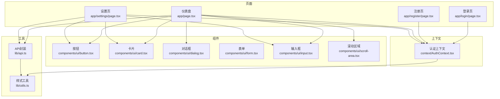
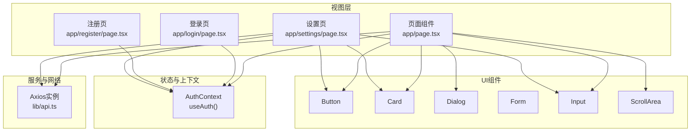
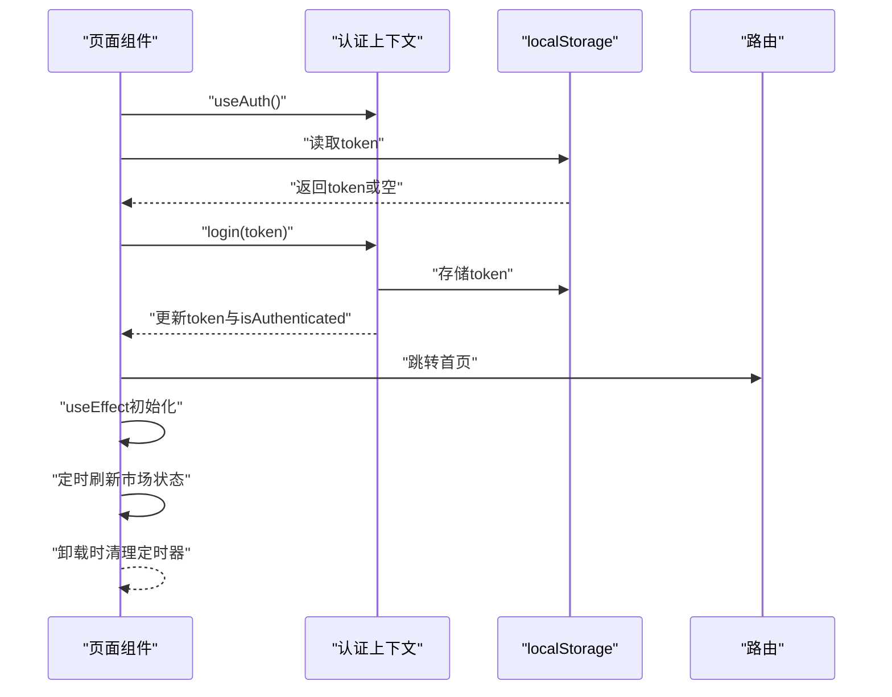
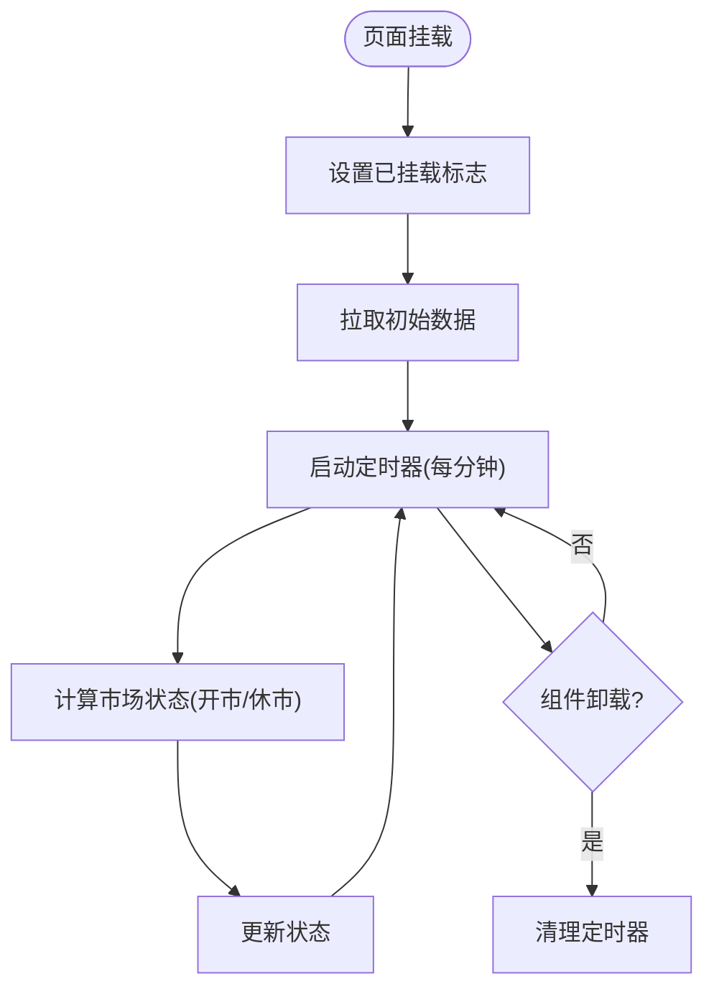
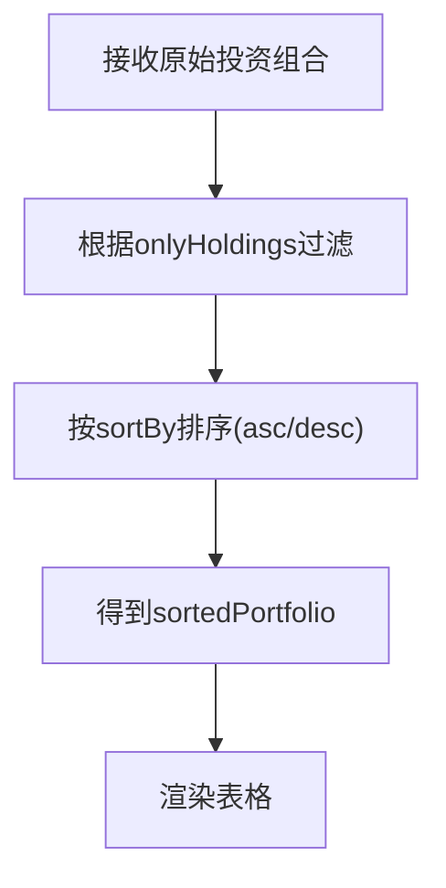
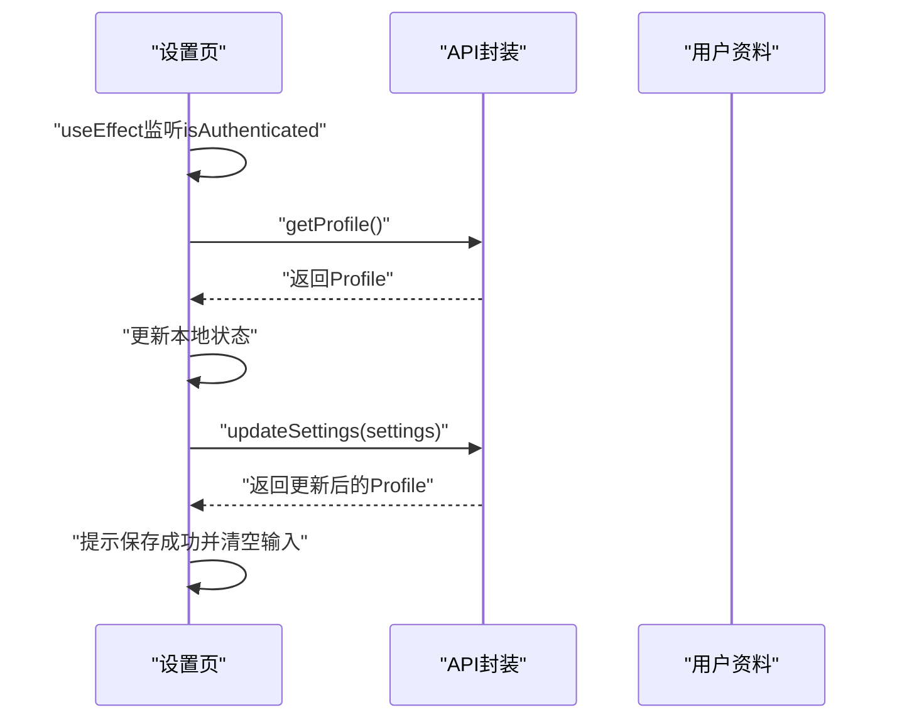
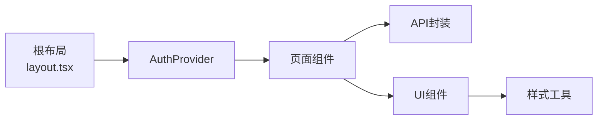

# Hooks使用模式

<cite>
**本文引用的文件**
- [frontend/app/layout.tsx](file://frontend/app/layout.tsx)
- [frontend/context/AuthContext.tsx](file://frontend/context/AuthContext.tsx)
- [frontend/app/page.tsx](file://frontend/app/page.tsx)
- [frontend/lib/api.ts](file://frontend/lib/api.ts)
- [frontend/app/login/page.tsx](file://frontend/app/login/page.tsx)
- [frontend/app/register/page.tsx](file://frontend/app/register/page.tsx)
- [frontend/app/settings/page.tsx](file://frontend/app/settings/page.tsx)
- [frontend/components/ui/button.tsx](file://frontend/components/ui/button.tsx)
- [frontend/components/ui/card.tsx](file://frontend/components/ui/card.tsx)
- [frontend/components/ui/dialog.tsx](file://frontend/components/ui/dialog.tsx)
- [frontend/components/ui/form.tsx](file://frontend/components/ui/form.tsx)
- [frontend/components/ui/input.tsx](file://frontend/components/ui/input.tsx)
- [frontend/components/ui/scroll-area.tsx](file://frontend/components/ui/scroll-area.tsx)
- [frontend/lib/utils.ts](file://frontend/lib/utils.ts)
- [frontend/package.json](file://frontend/package.json)
</cite>

## 目录
1. [简介](#简介)
2. [项目结构](#项目结构)
3. [核心组件](#核心组件)
4. [架构总览](#架构总览)
5. [详细组件分析](#详细组件分析)
6. [依赖关系分析](#依赖关系分析)
7. [性能考虑](#性能考虑)
8. [故障排查指南](#故障排查指南)
9. [结论](#结论)
10. [附录](#附录)

## 简介
本指南围绕React Hooks在本项目的实际使用进行系统性梳理，重点覆盖以下主题：
- 核心Hooks：useState、useEffect、useMemo（在页面中体现）、useCallback（在组件中体现）
- 状态管理策略：本地状态、全局状态（认证上下文）、服务器状态（API封装）
- 副作用处理：数据获取、定时器与清理、条件跳转
- 性能优化：useMemo的合理使用、避免不必要重渲染、依赖数组配置
- 自定义Hooks开发：逻辑复用与测试策略

本指南以“页面级组件 + UI组件 + 上下文 + 工具模块”的分层视角展开，结合真实代码路径帮助读者建立可迁移的最佳实践。

## 项目结构
前端采用Next.js应用结构，按功能域组织：
- 页面：登录、注册、仪表盘、设置
- 组件：UI基础组件（按钮、卡片、对话框、滚动区域、表单）
- 上下文：认证上下文（全局状态）
- 工具：API封装、通用样式工具
- 根布局：注入全局Provider

图表来源
- [frontend/app/layout.tsx](file://frontend/app/layout.tsx#L20-L35)
- [frontend/context/AuthContext.tsx](file://frontend/context/AuthContext.tsx#L15-L51)
- [frontend/app/page.tsx](file://frontend/app/page.tsx#L1-L686)
- [frontend/app/settings/page.tsx](file://frontend/app/settings/page.tsx#L1-L173)
- [frontend/lib/api.ts](file://frontend/lib/api.ts#L1-L130)
- [frontend/components/ui/button.tsx](file://frontend/components/ui/button.tsx#L1-L63)
- [frontend/components/ui/card.tsx](file://frontend/components/ui/card.tsx#L1-L93)
- [frontend/components/ui/dialog.tsx](file://frontend/components/ui/dialog.tsx#L1-L144)
- [frontend/components/ui/form.tsx](file://frontend/components/ui/form.tsx#L1-L168)
- [frontend/components/ui/input.tsx](file://frontend/components/ui/input.tsx#L1-L22)
- [frontend/components/ui/scroll-area.tsx](file://frontend/components/ui/scroll-area.tsx#L1-L59)
- [frontend/lib/utils.ts](file://frontend/lib/utils.ts#L1-L7)

章节来源
- [frontend/app/layout.tsx](file://frontend/app/layout.tsx#L1-L39)
- [frontend/package.json](file://frontend/package.json#L1-L43)

## 核心组件
本节聚焦Hooks在页面与组件中的典型用法与最佳实践。

- useState
  - 本地状态：页面内用于控制UI状态（加载、选中项、排序、搜索、编辑表单等）
  - 认证上下文中用于保存token与鉴权状态
  - 设置页中用于用户配置项的本地状态
- useEffect
  - 初始化挂载与数据获取
  - 定时器与清理（市场状态定时刷新）
  - 条件跳转（未登录自动跳转）
- useMemo
  - 在页面中对复杂计算结果进行缓存（排序后的投资组合）
- useCallback
  - 在组件中通过回调稳定化事件处理器，减少子组件重渲染（例如排序、搜索、编辑）

章节来源
- [frontend/app/page.tsx](file://frontend/app/page.tsx#L30-L90)
- [frontend/context/AuthContext.tsx](file://frontend/context/AuthContext.tsx#L15-L51)
- [frontend/app/settings/page.tsx](file://frontend/app/settings/page.tsx#L13-L72)

## 架构总览
本项目采用“页面组件 + UI组件库 + 上下文 + API封装”的分层架构。页面组件负责状态与副作用；UI组件提供可复用的视觉与交互能力；上下文提供跨树的认证状态；API封装统一处理请求与响应。

图表来源
- [frontend/app/page.tsx](file://frontend/app/page.tsx#L1-L686)
- [frontend/app/login/page.tsx](file://frontend/app/login/page.tsx#L1-L89)
- [frontend/app/register/page.tsx](file://frontend/app/register/page.tsx#L1-L84)
- [frontend/app/settings/page.tsx](file://frontend/app/settings/page.tsx#L1-L173)
- [frontend/context/AuthContext.tsx](file://frontend/context/AuthContext.tsx#L1-L60)
- [frontend/lib/api.ts](file://frontend/lib/api.ts#L1-L130)
- [frontend/components/ui/button.tsx](file://frontend/components/ui/button.tsx#L1-L63)
- [frontend/components/ui/card.tsx](file://frontend/components/ui/card.tsx#L1-L93)
- [frontend/components/ui/dialog.tsx](file://frontend/components/ui/dialog.tsx#L1-L144)
- [frontend/components/ui/form.tsx](file://frontend/components/ui/form.tsx#L1-L168)
- [frontend/components/ui/input.tsx](file://frontend/components/ui/input.tsx#L1-L22)
- [frontend/components/ui/scroll-area.tsx](file://frontend/components/ui/scroll-area.tsx#L1-L59)

## 详细组件分析

### 认证上下文与页面生命周期
- 认证上下文提供token、登录、登出与鉴权状态；页面在挂载时读取localStorage恢复token，并在登录后写入localStorage
- 页面在依赖变化时触发数据拉取；未登录时进行条件跳转
- 页面使用定时器每分钟刷新市场状态，并在卸载时清理

图表来源
- [frontend/context/AuthContext.tsx](file://frontend/context/AuthContext.tsx#L15-L51)
- [frontend/app/page.tsx](file://frontend/app/page.tsx#L95-L163)

章节来源
- [frontend/context/AuthContext.tsx](file://frontend/context/AuthContext.tsx#L1-L60)
- [frontend/app/page.tsx](file://frontend/app/page.tsx#L95-L163)

### 页面副作用与数据流
- 首次挂载设置“已挂载”标志并拉取初始数据
- 依赖isAuthenticated在鉴权状态变化时重新拉取
- 依赖selectedTicker在切换股票时重置AI分析结果
- 使用定时器每分钟计算并更新市场状态（开市/休市、倒计时）
- 登录页与注册页通过API发起登录/注册请求，成功后调用上下文登录方法

图表来源
- [frontend/app/page.tsx](file://frontend/app/page.tsx#L95-L153)

章节来源
- [frontend/app/page.tsx](file://frontend/app/page.tsx#L95-L153)
- [frontend/app/login/page.tsx](file://frontend/app/login/page.tsx#L19-L42)
- [frontend/app/register/page.tsx](file://frontend/app/register/page.tsx#L19-L37)

### 排序与性能优化（useMemo与依赖数组）
- 页面对投资组合进行过滤与排序，使用本地状态控制排序键与顺序
- 将排序结果作为纯计算产物，避免每次渲染都重复计算
- 依赖数组包含所有影响排序的变量，确保在排序键或顺序变化时才重新计算

图表来源
- [frontend/app/page.tsx](file://frontend/app/page.tsx#L63-L90)

章节来源
- [frontend/app/page.tsx](file://frontend/app/page.tsx#L63-L90)

### 设置页与表单（useEffect与状态同步）
- 设置页在鉴权状态变化时加载用户资料
- 提供API Key与数据源偏好设置，保存后重新加载资料
- 表单状态与UI状态保持一致，提交时进行必要的校验与反馈

图表来源
- [frontend/app/settings/page.tsx](file://frontend/app/settings/page.tsx#L21-L58)
- [frontend/lib/api.ts](file://frontend/lib/api.ts#L119-L127)

章节来源
- [frontend/app/settings/page.tsx](file://frontend/app/settings/page.tsx#L13-L72)
- [frontend/lib/api.ts](file://frontend/lib/api.ts#L119-L127)

### UI组件与样式工具
- UI组件通过统一的样式工具函数合并类名，保证一致性与可维护性
- 对话框、卡片、按钮、输入框等组件在页面中被广泛复用，形成稳定的交互基线

章节来源
- [frontend/components/ui/button.tsx](file://frontend/components/ui/button.tsx#L1-L63)
- [frontend/components/ui/card.tsx](file://frontend/components/ui/card.tsx#L1-L93)
- [frontend/components/ui/dialog.tsx](file://frontend/components/ui/dialog.tsx#L1-L144)
- [frontend/components/ui/input.tsx](file://frontend/components/ui/input.tsx#L1-L22)
- [frontend/components/ui/scroll-area.tsx](file://frontend/components/ui/scroll-area.tsx#L1-L59)
- [frontend/lib/utils.ts](file://frontend/lib/utils.ts#L1-L7)

## 依赖关系分析
- 页面组件依赖认证上下文与API封装，实现登录态与数据获取
- UI组件依赖样式工具，保证主题与类名的一致性
- 根布局注入Provider，使全局状态在整个应用树可用

图表来源
- [frontend/app/layout.tsx](file://frontend/app/layout.tsx#L20-L35)
- [frontend/context/AuthContext.tsx](file://frontend/context/AuthContext.tsx#L15-L51)
- [frontend/app/page.tsx](file://frontend/app/page.tsx#L1-L686)
- [frontend/lib/api.ts](file://frontend/lib/api.ts#L1-L130)
- [frontend/lib/utils.ts](file://frontend/lib/utils.ts#L1-L7)

章节来源
- [frontend/app/layout.tsx](file://frontend/app/layout.tsx#L1-L39)
- [frontend/package.json](file://frontend/package.json#L11-L29)

## 性能考虑
- 合理使用useMemo
  - 将昂贵的计算（如排序）结果缓存，仅在依赖变化时重新计算
  - 依赖数组应包含所有参与计算的变量，避免遗漏导致缓存失效
- 避免不必要重渲染
  - 将事件处理器与回调稳定化（useCallback），减少子组件因引用变化而重渲染
  - 将UI状态与业务状态分离，尽量缩小状态作用域
- 依赖数组配置
  - useEffect的依赖数组必须完整，否则可能导致副作用执行时机错误或资源泄漏
  - 清理函数需返回，确保定时器、订阅等资源被及时释放
- 服务器状态与本地状态
  - 服务器状态通过API封装统一管理，本地状态仅用于UI交互与临时状态
  - 在鉴权状态变化时，优先刷新本地状态，再触发数据拉取

## 故障排查指南
- 未登录自动跳转
  - 现象：访问受保护页面时被重定向至登录页
  - 排查：确认鉴权上下文是否正确提供isAuthenticated；检查路由守卫逻辑
- 市场状态定时器异常
  - 现象：定时器未按预期刷新或存在内存泄漏
  - 排查：确认定时器在useEffect清理函数中被正确清除；检查依赖数组是否遗漏
- 分析接口限流
  - 现象：AI分析返回限流提示
  - 处理：引导用户前往设置页配置自有API Key；在页面中捕获HTTP状态码并提示
- 表单状态不同步
  - 现象：设置页保存后UI未更新
  - 排查：确认保存成功后重新加载资料；检查状态更新流程与错误提示

章节来源
- [frontend/app/page.tsx](file://frontend/app/page.tsx#L155-L163)
- [frontend/app/page.tsx](file://frontend/app/page.tsx#L230-L237)
- [frontend/app/settings/page.tsx](file://frontend/app/settings/page.tsx#L38-L58)

## 结论
本项目在实践中体现了现代React Hooks的最佳实践：以页面组件为核心的状态与副作用管理、以UI组件为基础的可复用交互、以上下文提供的全局状态以及以API封装统一的数据访问。遵循本文的依赖数组配置、useMemo与useCallback的使用原则，能够有效提升性能与可维护性。同时，通过清晰的页面职责划分与错误处理机制，有助于构建稳定可靠的金融类应用。

## 附录
- 自定义Hooks开发建议
  - 逻辑复用：将可复用的副作用与状态封装为自定义Hook，暴露简洁的接口
  - 测试策略：为自定义Hook编写单元测试，验证状态变更、副作用执行与清理行为
  - 文档与类型：为自定义Hook提供清晰的类型定义与使用示例，便于团队协作