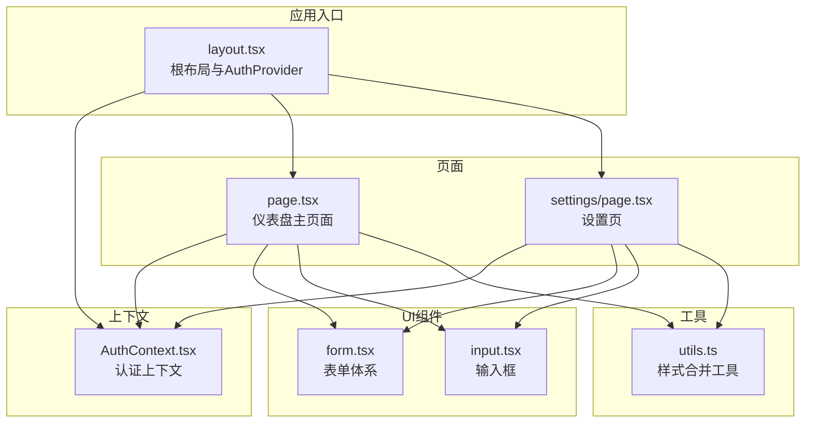
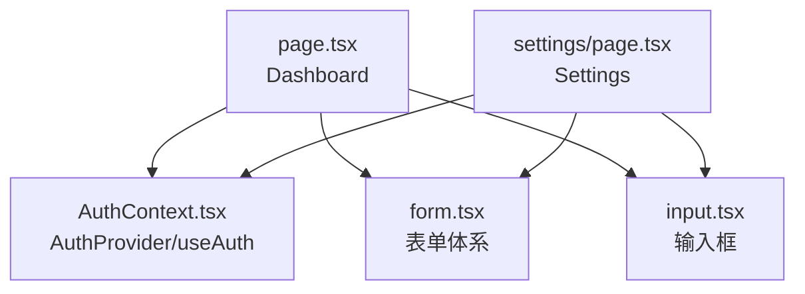
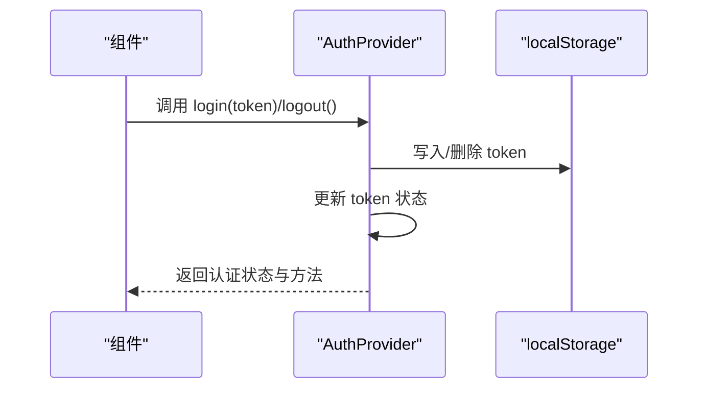
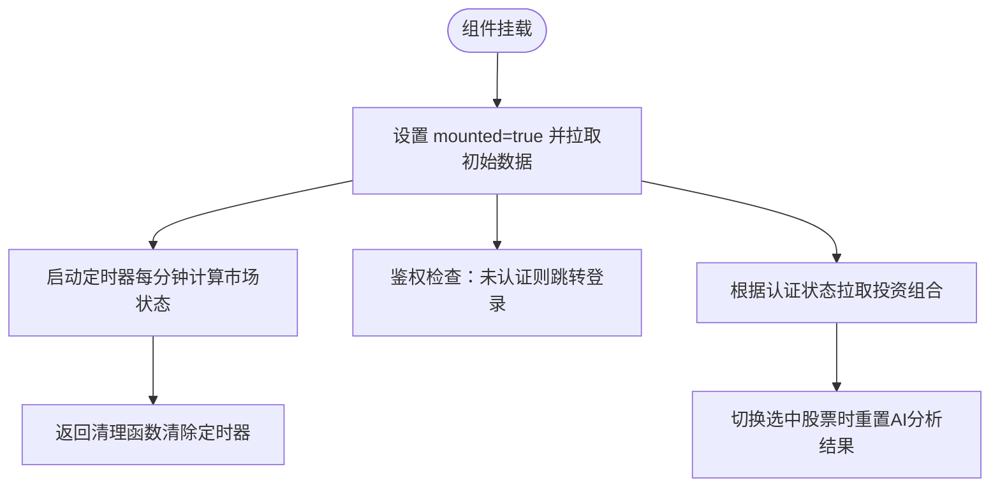
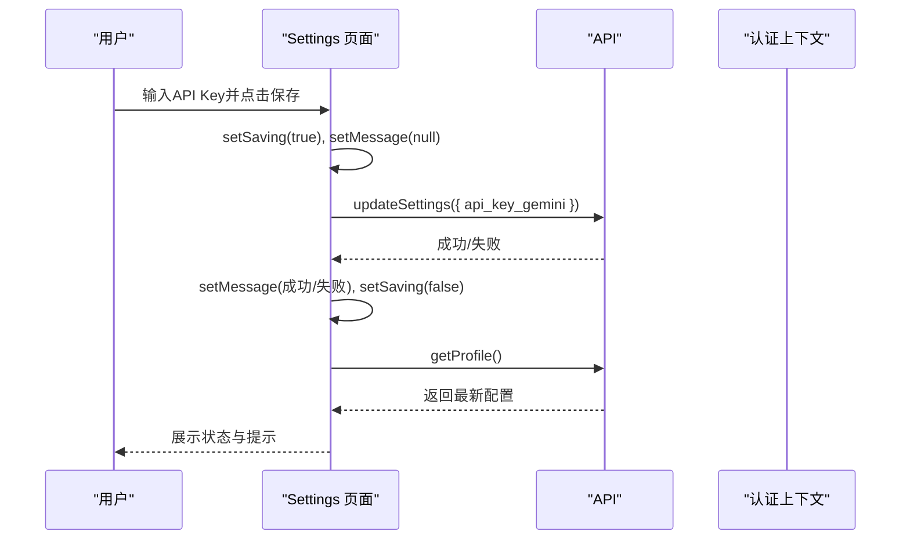
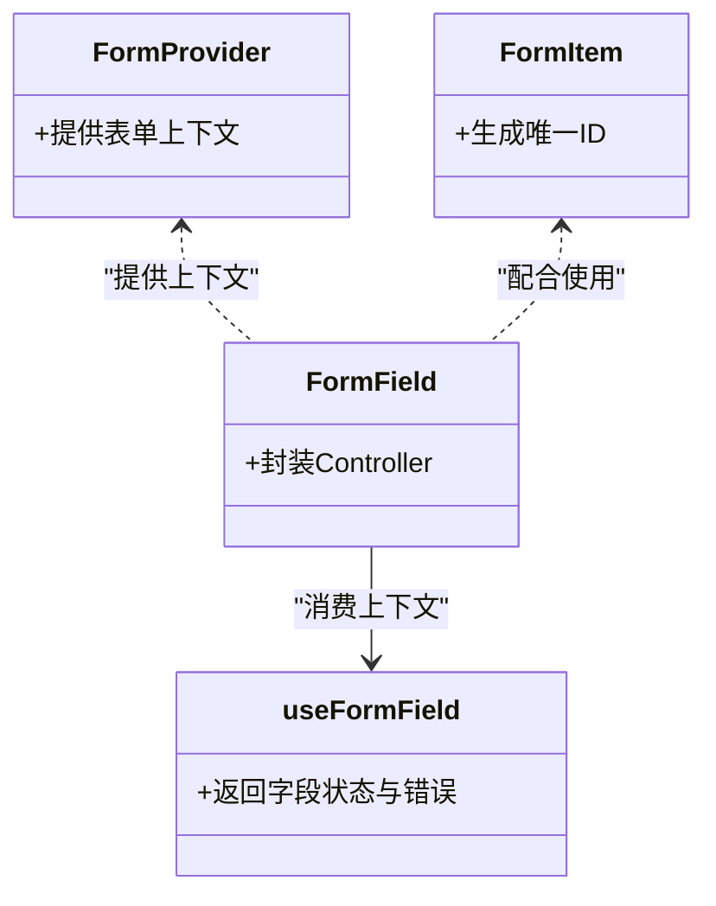

# 核心Hooks实践

<cite>
**本文引用的文件**
- [frontend/app/layout.tsx](file://frontend/app/layout.tsx)
- [frontend/context/AuthContext.tsx](file://frontend/context/AuthContext.tsx)
- [frontend/app/page.tsx](file://frontend/app/page.tsx)
- [frontend/components/ui/form.tsx](file://frontend/components/ui/form.tsx)
- [frontend/components/ui/input.tsx](file://frontend/components/ui/input.tsx)
- [frontend/app/settings/page.tsx](file://frontend/app/settings/page.tsx)
- [frontend/lib/utils.ts](file://frontend/lib/utils.ts)
- [frontend/package.json](file://frontend/package.json)
</cite>

## 目录
1. [引言](#引言)
2. [项目结构](#项目结构)
3. [核心组件](#核心组件)
4. [架构总览](#架构总览)
5. [详细组件分析](#详细组件分析)
6. [依赖分析](#依赖分析)
7. [性能考虑](#性能考虑)
8. [故障排查指南](#故障排查指南)
9. [结论](#结论)
10. [附录](#附录)

## 引言
本技术指南围绕前端React Hooks在实际业务中的最佳实践展开，结合项目现有代码，系统讲解以下主题：
- useState：简单状态、复杂状态对象与状态更新函数的正确使用方式
- useEffect：副作用处理模式（数据获取、订阅管理、清理函数）
- useMemo与useCallback：性能优化策略（依赖数组、缓存与引用稳定性）
- 状态提升与状态下沉的设计原则
- 避免常见陷阱与内存泄漏问题

目标是帮助读者在真实场景中写出可维护、高性能且安全的Hooks代码。

## 项目结构
前端采用Next.js应用结构，页面级组件集中于app目录，UI组件位于components/ui，全局上下文通过context目录提供，工具函数位于lib目录。整体组织遵循“按功能分层”的思路，便于Hooks在页面与组件间复用与协作。

图表来源
- [frontend/app/layout.tsx](file://frontend/app/layout.tsx#L20-L35)
- [frontend/context/AuthContext.tsx](file://frontend/context/AuthContext.tsx#L15-L50)
- [frontend/app/page.tsx](file://frontend/app/page.tsx#L30-L685)
- [frontend/app/settings/page.tsx](file://frontend/app/settings/page.tsx#L13-L172)
- [frontend/components/ui/form.tsx](file://frontend/components/ui/form.tsx#L1-L168)
- [frontend/components/ui/input.tsx](file://frontend/components/ui/input.tsx#L1-L22)
- [frontend/lib/utils.ts](file://frontend/lib/utils.ts#L1-L7)

章节来源
- [frontend/app/layout.tsx](file://frontend/app/layout.tsx#L1-L39)
- [frontend/package.json](file://frontend/package.json#L1-L43)

## 核心组件
本节聚焦于项目中Hooks的实际使用点，总结最佳实践要点与注意事项。

- 认证上下文（AuthContext）：演示了useState与useEffect在登录态持久化与路由跳转中的典型用法；同时展示了Provider与自定义Hook的组合写法。
- 主页面（Dashboard）：涵盖多种状态类型（简单布尔、字符串、对象、数组）、副作用（定时器、鉴权检查、数据拉取）、条件渲染与交互逻辑。
- 设置页：展示受控表单状态管理与异步保存流程。
- 表单体系：基于react-hook-form的上下文封装，体现状态提升与子组件解耦。

章节来源
- [frontend/context/AuthContext.tsx](file://frontend/context/AuthContext.tsx#L15-L59)
- [frontend/app/page.tsx](file://frontend/app/page.tsx#L30-L242)
- [frontend/app/settings/page.tsx](file://frontend/app/settings/page.tsx#L13-L71)
- [frontend/components/ui/form.tsx](file://frontend/components/ui/form.tsx#L1-L168)

## 架构总览
下图展示了页面、上下文与UI组件之间的交互关系，以及Hooks在其中的作用位置。

图表来源
- [frontend/context/AuthContext.tsx](file://frontend/context/AuthContext.tsx#L15-L59)
- [frontend/app/page.tsx](file://frontend/app/page.tsx#L30-L685)
- [frontend/app/settings/page.tsx](file://frontend/app/settings/page.tsx#L13-L172)
- [frontend/components/ui/form.tsx](file://frontend/components/ui/form.tsx#L1-L168)
- [frontend/components/ui/input.tsx](file://frontend/components/ui/input.tsx#L1-L22)

## 详细组件分析

### 认证上下文（AuthContext）与Hooks最佳实践
- 状态设计
  - 使用简单状态存储token，并通过派生状态表达是否已认证
  - 登录/登出时同步本地存储与状态，确保跨刷新一致
- 副作用处理
  - 在挂载阶段从本地存储恢复token，避免重复请求
  - 清理函数用于移除本地存储后重置状态并跳转
- 自定义Hook
  - 将Provider值封装为useAuth，统一错误处理与调用边界

图表来源
- [frontend/context/AuthContext.tsx](file://frontend/context/AuthContext.tsx#L19-L37)

章节来源
- [frontend/context/AuthContext.tsx](file://frontend/context/AuthContext.tsx#L15-L59)

### 主页面（Dashboard）中的Hooks实战
- 多类状态管理
  - 简单状态：加载、挂载、搜索开关、分析状态等
  - 复杂对象状态：市场状态（包含状态枚举、文本与倒计时）
  - 复杂数组状态：投资组合、搜索结果、编辑表单
- 副作用模式
  - 定时器：每分钟更新市场状态，返回清理函数清除interval
  - 鉴权检查：延迟判断未认证用户跳转登录页
  - 数据获取：根据认证状态触发初始数据拉取
  - 选择切换：切换选中股票时重置AI分析结果
- 性能与可读性
  - 使用本地排序逻辑，避免在渲染中进行昂贵计算
  - 条件渲染与占位符，提升交互体验

图表来源
- [frontend/app/page.tsx](file://frontend/app/page.tsx#L95-L163)

章节来源
- [frontend/app/page.tsx](file://frontend/app/page.tsx#L30-L242)

### 设置页（Settings）中的表单与状态
- 受控表单
  - 使用受控输入管理API Key与偏好设置
  - 提交时进行异步保存，期间显示加载状态与消息提示
- 状态提升
  - 将“首选数据源”等设置提升至页面级状态，便于跨组件共享与统一更新
- 错误处理
  - 保存失败时显示错误消息，成功后清空输入并重新加载配置

图表来源
- [frontend/app/settings/page.tsx](file://frontend/app/settings/page.tsx#L38-L71)

章节来源
- [frontend/app/settings/page.tsx](file://frontend/app/settings/page.tsx#L13-L71)

### 表单体系（react-hook-form）与状态提升
- 上下文封装
  - 通过Form、FormField、FormControl等组件将表单状态与验证逻辑解耦
  - useFormField提供字段级状态与错误信息，便于子组件消费
- 设计原则
  - 将表单状态提升至页面或容器组件，子组件仅负责展示与事件回调
  - 保持子组件无状态，减少不必要的重渲染

图表来源
- [frontend/components/ui/form.tsx](file://frontend/components/ui/form.tsx#L19-L88)

章节来源
- [frontend/components/ui/form.tsx](file://frontend/components/ui/form.tsx#L1-L168)

## 依赖分析
- React版本：19.2.3
- Next.js版本：16.1.2
- UI与工具库：@radix-ui、lucide-react、date-fns、clsx/tailwind-merge等
- 表单库：react-hook-form

这些依赖为Hooks实践提供了基础能力，例如：
- @radix-ui系列组件与事件钩子有助于构建可访问性友好的交互
- date-fns用于日期格式化与计算，适合在副作用中使用
- react-hook-form提供强大的表单状态管理，便于实现状态提升与子组件解耦

章节来源
- [frontend/package.json](file://frontend/package.json#L11-L29)

## 性能考虑
- 依赖数组的正确配置
  - useEffect的依赖数组应包含所有在回调中使用的外部变量，避免闭包陷阱
  - 对于频繁变化但不需要触发副作用的变量，考虑使用ref或回调ref
- 计算结果缓存
  - 对昂贵的计算或派生数据，优先使用useMemo缓存结果，避免每次渲染都重新计算
  - 注意依赖数组的完整性，避免缓存失效过早或过晚
- 函数引用稳定性
  - 将传递给子组件的回调函数使用useCallback包裹，防止因引用变化导致子组件不必要重渲染
  - 仅在子组件对引用敏感（如useMemo/useEffect依赖）时才使用useCallback
- 清理函数与资源释放
  - 所有定时器、订阅、事件监听器都应在cleanup中释放，避免内存泄漏
- 本地状态与远程状态分离
  - 本地状态用于UI交互（如搜索开关、编辑表单），远程状态由API驱动，避免混用导致抖动

## 故障排查指南
- 常见问题一：未在依赖数组中声明变量
  - 现象：副作用回调读取到过期状态或变量
  - 解决：将所有在回调中使用的变量加入依赖数组
  - 参考路径：[frontend/app/page.tsx](file://frontend/app/page.tsx#L96-L163)
- 常见问题二：未清理定时器/订阅
  - 现象：组件卸载后仍执行定时任务，引发内存泄漏或错误
  - 解决：在cleanup中清除interval/timeout/订阅
  - 参考路径：[frontend/app/page.tsx](file://frontend/app/page.tsx#L150-L153)
- 常见问题三：状态更新顺序导致的竞态
  - 现象：异步操作中状态被覆盖
  - 解决：使用基于前一次状态的更新函数，或在finally中统一收尾
  - 参考路径：[frontend/app/page.tsx](file://frontend/app/page.tsx#L179-L194)
- 常见问题四：useCallback滥用导致过度优化
  - 现象：子组件因引用不变而无法响应预期更新
  - 解决：仅在子组件对引用敏感时使用useCallback，并确保依赖数组最小化
  - 参考路径：[frontend/app/page.tsx](file://frontend/app/page.tsx#L30-L90)

章节来源
- [frontend/app/page.tsx](file://frontend/app/page.tsx#L95-L163)

## 结论
通过对认证上下文、仪表盘页面、设置页与表单体系的Hooks实践分析，可以总结出以下关键经验：
- 将状态分为“本地UI状态”和“远程数据状态”，明确职责边界
- 在useEffect中严格管理副作用与清理，避免内存泄漏
- 合理使用useMemo与useCallback，以依赖数组为准则，平衡性能与可读性
- 通过状态提升与上下文封装，实现组件间的松耦合与高内聚

## 附录
- 最佳实践清单
  - 明确状态粒度：简单状态用useState，复杂对象用对象状态，数组用数组状态
  - 依赖数组完整：确保useEffect/useMemo/useCallback依赖齐全
  - 清理函数必须：定时器、订阅、事件监听器一律清理
  - 状态提升：共享状态上移，子组件保持无状态
  - 错误处理：统一捕获与提示，避免静默失败