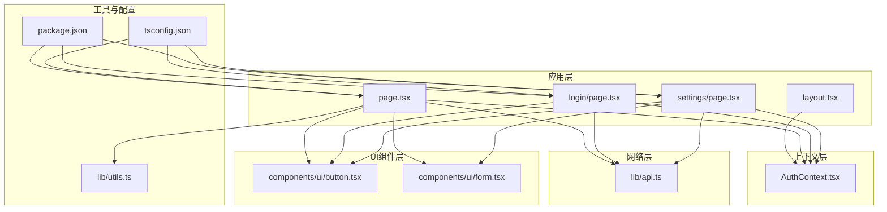
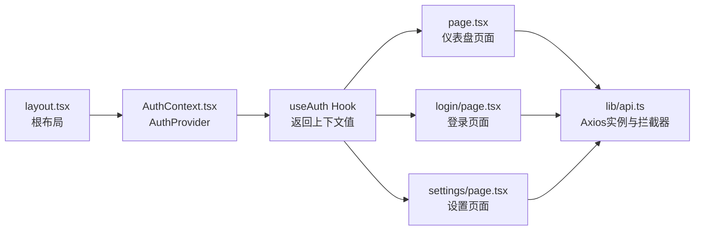
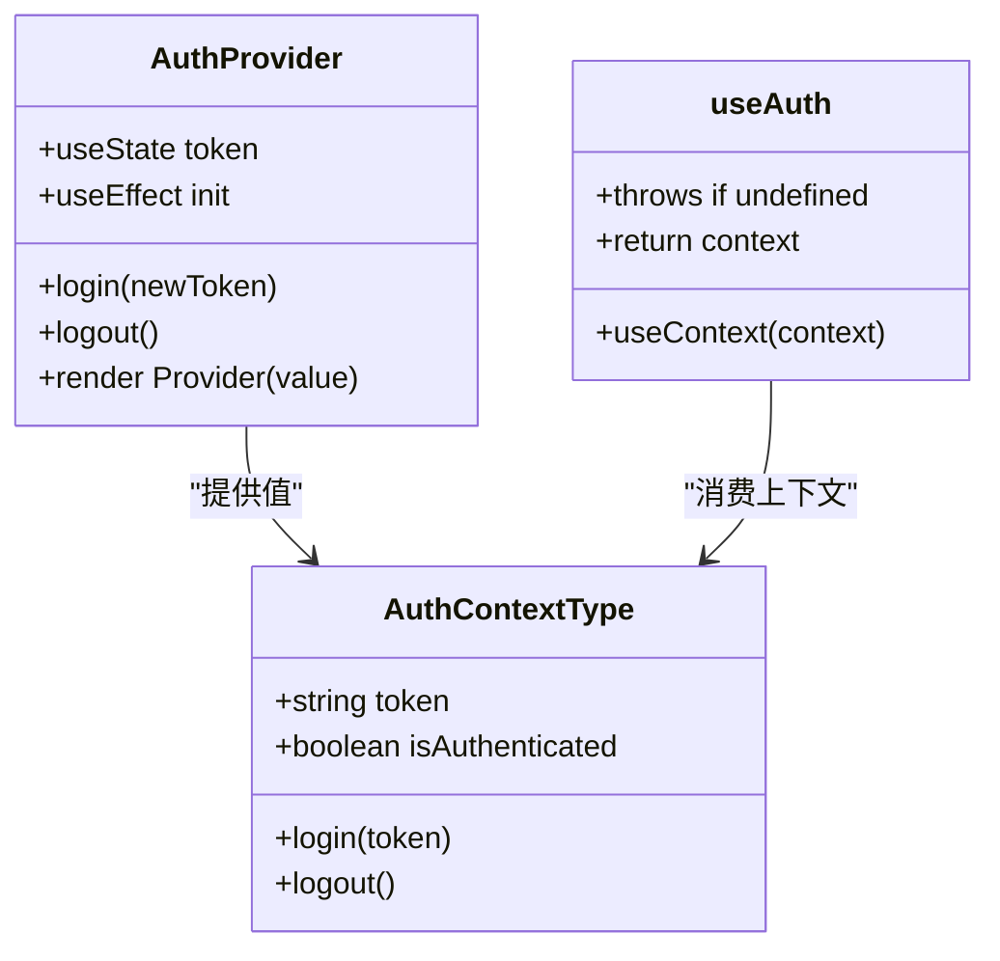
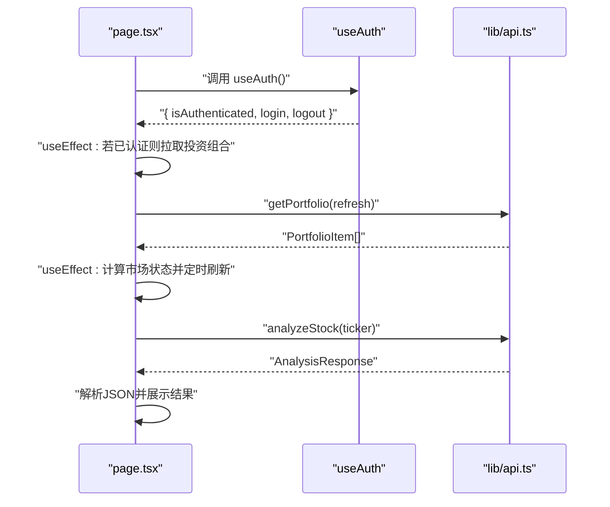
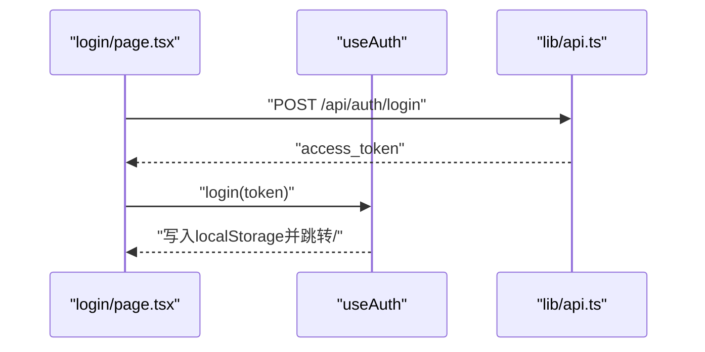
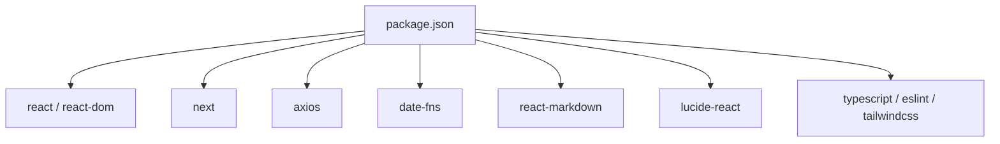

# 自定义Hooks开发

<cite>
**本文引用的文件**
- [AuthContext.tsx](file://frontend/context/AuthContext.tsx)
- [layout.tsx](file://frontend/app/layout.tsx)
- [page.tsx](file://frontend/app/page.tsx)
- [login/page.tsx](file://frontend/app/login/page.tsx)
- [settings/page.tsx](file://frontend/app/settings/page.tsx)
- [api.ts](file://frontend/lib/api.ts)
- [button.tsx](file://frontend/components/ui/button.tsx)
- [form.tsx](file://frontend/components/ui/form.tsx)
- [utils.ts](file://frontend/lib/utils.ts)
- [package.json](file://frontend/package.json)
- [tsconfig.json](file://frontend/tsconfig.json)
- [README.md](file://README.md)
</cite>

## 目录
1. [简介](#简介)
2. [项目结构](#项目结构)
3. [核心组件](#核心组件)
4. [架构总览](#架构总览)
5. [详细组件分析](#详细组件分析)
6. [依赖分析](#依赖分析)
7. [性能考虑](#性能考虑)
8. [故障排查指南](#故障排查指南)
9. [结论](#结论)
10. [附录](#附录)

## 简介
本指南面向在本项目前端（Next.js）中开发与使用自定义Hooks的工程师，目标是帮助你系统地掌握以下内容：
- 自定义Hooks的设计原则与命名约定：逻辑复用、关注点分离、可测试性
- AuthContext 的实现模式：Provider 设计、上下文值传递、Hook 封装策略
- 自定义Hooks的开发流程：需求分析、接口设计、实现细节、错误处理
- 测试策略：单元测试、集成测试与模拟依赖的最佳实践
- 性能优化技巧与常见反模式的规避

本项目已提供认证上下文与页面级使用示例，可作为自定义Hooks开发的参考范式。

## 项目结构
前端采用 Next.js 应用程序目录结构，核心认证上下文位于 context 目录，页面组件位于 app 目录，通用 UI 组件位于 components/ui 目录，网络请求封装位于 lib 目录。

图表来源
- [layout.tsx](file://frontend/app/layout.tsx#L20-L35)
- [AuthContext.tsx](file://frontend/context/AuthContext.tsx#L15-L51)
- [page.tsx](file://frontend/app/page.tsx#L1-L686)
- [login/page.tsx](file://frontend/app/login/page.tsx#L1-L89)
- [settings/page.tsx](file://frontend/app/settings/page.tsx#L1-L173)
- [api.ts](file://frontend/lib/api.ts#L1-L130)
- [button.tsx](file://frontend/components/ui/button.tsx#L1-L63)
- [form.tsx](file://frontend/components/ui/form.tsx#L1-L56)
- [utils.ts](file://frontend/lib/utils.ts#L1-L7)
- [package.json](file://frontend/package.json#L1-L43)
- [tsconfig.json](file://frontend/tsconfig.json#L1-L43)

章节来源
- [README.md](file://README.md#L45-L49)
- [layout.tsx](file://frontend/app/layout.tsx#L20-L35)

## 核心组件
- 认证上下文与Hook：提供 token 状态、登录/登出行为与认证状态判断，并通过 useAuth Hook 暴露给子组件使用。
- 页面级使用：仪表盘页面、登录页、设置页均通过 useAuth 获取认证状态或执行登录/登出。
- 网络层封装：统一创建 Axios 实例、注入鉴权头、导出业务 API 方法，便于在自定义Hooks中复用。
- UI 组件：按钮、表单等组件遵循可复用与可测试的设计，适合在自定义Hooks中配合使用。

章节来源
- [AuthContext.tsx](file://frontend/context/AuthContext.tsx#L6-L11)
- [AuthContext.tsx](file://frontend/context/AuthContext.tsx#L15-L59)
- [page.tsx](file://frontend/app/page.tsx#L92-L93)
- [login/page.tsx](file://frontend/app/login/page.tsx#L16-L42)
- [settings/page.tsx](file://frontend/app/settings/page.tsx#L14-L36)
- [api.ts](file://frontend/lib/api.ts#L1-L18)
- [button.tsx](file://frontend/components/ui/button.tsx#L1-L63)
- [form.tsx](file://frontend/components/ui/form.tsx#L1-L56)

## 架构总览
下图展示了认证上下文在应用中的装配与使用路径，体现 Provider 装配、Hook 封装与页面消费的典型模式。

图表来源
- [layout.tsx](file://frontend/app/layout.tsx#L20-L35)
- [AuthContext.tsx](file://frontend/context/AuthContext.tsx#L15-L59)
- [page.tsx](file://frontend/app/page.tsx#L92-L93)
- [login/page.tsx](file://frontend/app/login/page.tsx#L16-L42)
- [settings/page.tsx](file://frontend/app/settings/page.tsx#L14-L36)
- [api.ts](file://frontend/lib/api.ts#L1-L18)

## 详细组件分析

### 认证上下文（AuthContext）与 Provider 模式
- 设计要点
  - 使用 React createContext 定义上下文类型，确保类型安全。
  - 在 AuthProvider 中管理 token 状态，初始化时从本地存储读取；登录/登出分别持久化与清除 token，并进行路由跳转。
  - useAuth Hook 负责校验上下文是否在 Provider 内使用，避免误用。
- 关注点分离
  - 状态管理（token、isAuthenticated）与副作用（localStorage、router）集中在 Provider 内部。
  - 页面仅通过 useAuth 获取状态与动作，不关心实现细节。
- 可测试性
  - 可通过自定义渲染器或测试工具包装 Provider，注入 mock 上下文值，验证页面行为。

图表来源
- [AuthContext.tsx](file://frontend/context/AuthContext.tsx#L6-L11)
- [AuthContext.tsx](file://frontend/context/AuthContext.tsx#L15-L59)

章节来源
- [AuthContext.tsx](file://frontend/context/AuthContext.tsx#L6-L11)
- [AuthContext.tsx](file://frontend/context/AuthContext.tsx#L15-L59)

### 页面级 Hook 使用流程（以仪表盘为例）
- 需求分析：需要根据认证状态控制数据加载与页面跳转；需要在组件挂载后拉取投资组合数据。
- 接口设计：useAuth 返回 token、login、logout、isAuthenticated；页面直接消费。
- 实现细节：仪表盘页面在 effect 中根据 isAuthenticated 触发数据拉取；同时对市场状态进行定时计算。
- 错误处理：对分析接口返回的状态码进行分支处理，引导用户前往设置页配置密钥。

图表来源
- [page.tsx](file://frontend/app/page.tsx#L92-L93)
- [page.tsx](file://frontend/app/page.tsx#L156-L163)
- [page.tsx](file://frontend/app/page.tsx#L179-L194)
- [page.tsx](file://frontend/app/page.tsx#L206-L240)
- [api.ts](file://frontend/lib/api.ts#L74-L102)

章节来源
- [page.tsx](file://frontend/app/page.tsx#L92-L93)
- [page.tsx](file://frontend/app/page.tsx#L156-L163)
- [page.tsx](file://frontend/app/page.tsx#L179-L194)
- [page.tsx](file://frontend/app/page.tsx#L206-L240)
- [api.ts](file://frontend/lib/api.ts#L74-L102)

### 登录页与设置页中的上下文交互
- 登录页：通过 useAuth.login(token) 写入 token 并跳转首页；表单提交时调用后端登录接口获取 token。
- 设置页：通过 useAuth.isAuthenticated 控制加载与保存操作；调用用户资料与设置更新接口。

图表来源
- [login/page.tsx](file://frontend/app/login/page.tsx#L19-L42)
- [AuthContext.tsx](file://frontend/context/AuthContext.tsx#L27-L31)
- [api.ts](file://frontend/lib/api.ts#L1-L18)

章节来源
- [login/page.tsx](file://frontend/app/login/page.tsx#L16-L42)
- [AuthContext.tsx](file://frontend/context/AuthContext.tsx#L27-L31)

### UI 组件与工具函数的协作
- Button 与 Form 组件提供一致的样式与行为规范，便于在自定义 Hooks 中复用。
- utils.ts 提供类名合并工具，减少样式拼接复杂度，提升可维护性。

章节来源
- [button.tsx](file://frontend/components/ui/button.tsx#L1-L63)
- [form.tsx](file://frontend/components/ui/form.tsx#L1-L56)
- [utils.ts](file://frontend/lib/utils.ts#L1-L7)

## 依赖分析
- 运行时依赖
  - react、react-dom：React 版本与 DOM 渲染支持
  - next：Next.js 应用框架
  - axios：HTTP 客户端，用于封装 API 请求与鉴权拦截
  - date-fns：日期格式化与计算
  - lucide-react、react-markdown：UI 图标与 Markdown 渲染
- 开发依赖
  - TypeScript、ESLint、TailwindCSS：类型检查、代码质量与样式工具链

图表来源
- [package.json](file://frontend/package.json#L11-L29)
- [package.json](file://frontend/package.json#L31-L41)

章节来源
- [package.json](file://frontend/package.json#L11-L29)
- [package.json](file://frontend/package.json#L31-L41)

## 性能考虑
- 状态最小化与局部化
  - 将与 UI 展示强相关的状态（如排序、筛选、弹窗开关）保留在组件内部，减少跨组件共享带来的重渲染。
- 副作用隔离
  - 将副作用（如定时器、localStorage、路由跳转）收敛在 Provider 或页面 effect 中，避免在纯函数 Hook 中产生副作用。
- 请求与缓存
  - 在网络层统一注入鉴权头，避免在多个 Hook 中重复处理 token；对频繁调用的接口采用防抖/节流或缓存策略。
- 渲染优化
  - 使用 useMemo/useCallback 对昂贵计算与回调进行缓存；合理拆分组件，避免不必要的重渲染。
- 类型安全
  - 通过 tsconfig.json 启用严格模式，结合组件类型约束，降低运行时错误概率。

## 故障排查指南
- useAuth 必须在 AuthProvider 内使用
  - 若在 Provider 外调用 useAuth，会抛出错误提示，需检查布局装配顺序。
- 登录后无法跳转或状态异常
  - 检查 AuthProvider 的登录逻辑是否正确写入 localStorage 并触发路由跳转。
- 分析接口限流
  - 当接口返回特定状态码时，引导用户前往设置页配置 API Key；确认设置页的保存流程与后端接口一致。
- 本地存储与鉴权头
  - 确认 axios 拦截器在浏览器环境下从 localStorage 读取 token 并注入 Authorization 头。

章节来源
- [AuthContext.tsx](file://frontend/context/AuthContext.tsx#L53-L59)
- [AuthContext.tsx](file://frontend/context/AuthContext.tsx#L27-L37)
- [page.tsx](file://frontend/app/page.tsx#L230-L237)
- [api.ts](file://frontend/lib/api.ts#L10-L18)

## 结论
本项目的 AuthContext 与页面使用模式为自定义 Hooks 的开发提供了清晰范式：通过 Provider 聚合状态与副作用，通过 Hook 封装上下文值，通过页面消费实现关注点分离与可测试性。在此基础上，你可以按需扩展更多业务场景的自定义 Hooks，遵循统一的接口设计、错误处理与性能优化策略，持续提升代码质量与开发效率。

## 附录

### 自定义Hooks开发流程（模板）
- 需求分析
  - 明确要复用的逻辑边界、输入输出、副作用来源与错误场景。
- 接口设计
  - 设计 Hook 的输入参数、返回值结构与类型约束；尽量保持单一职责。
- 实现细节
  - 将状态与副作用收敛在 Hook 内部；必要时暴露受控的 setter 或动作函数。
- 错误处理
  - 对外部依赖（网络、本地存储）进行容错与降级；提供明确的错误标识与回退策略。
- 测试策略
  - 单元测试：Mock 外部依赖，验证 Hook 的返回值与副作用调用次数。
  - 集成测试：在真实 Provider 包裹下验证页面行为与状态一致性。
  - 模拟依赖：使用测试工具（如自定义渲染器）注入 mock 上下文值与服务实现。

### 常见反模式与规避
- 在 Hook 中直接访问全局状态或外部模块：将副作用收敛至 Provider 或页面 effect。
- 将 UI 逻辑与业务逻辑混合：通过 Hook 抽象业务逻辑，保持组件纯粹。
- 忽视错误处理与边界条件：对空值、失败、限流等场景进行显式处理。
- 缺乏类型约束：利用 TypeScript 严格模式与组件类型，确保接口稳定。