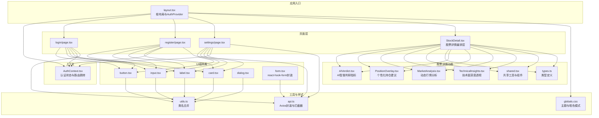
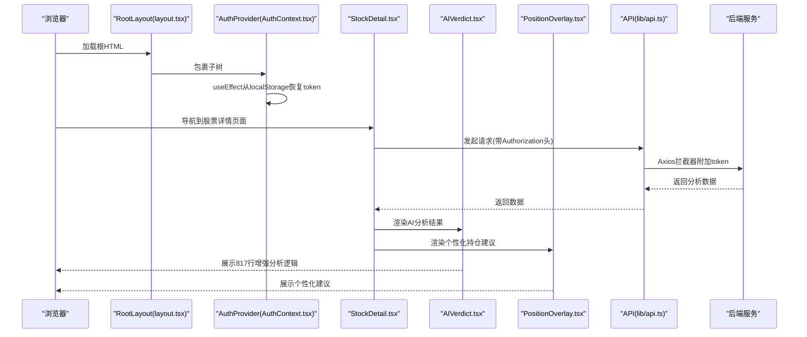
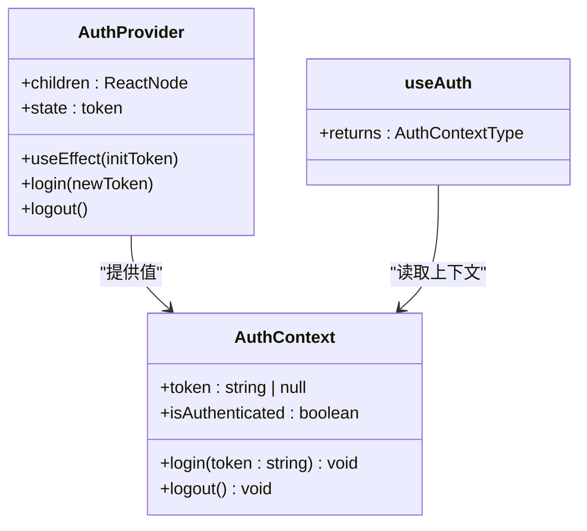
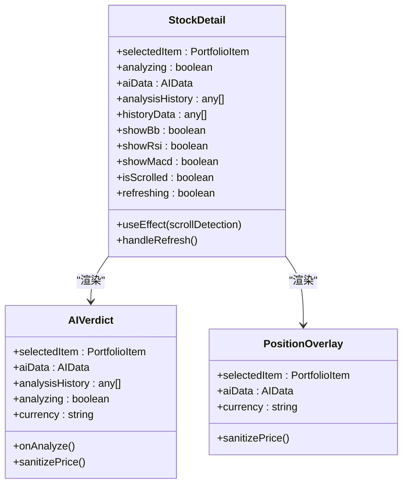
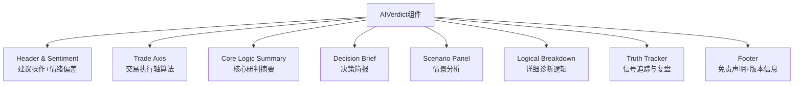
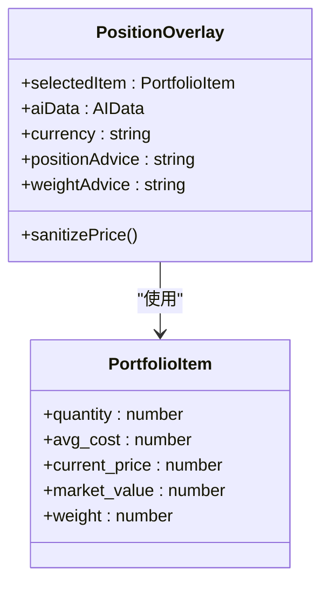
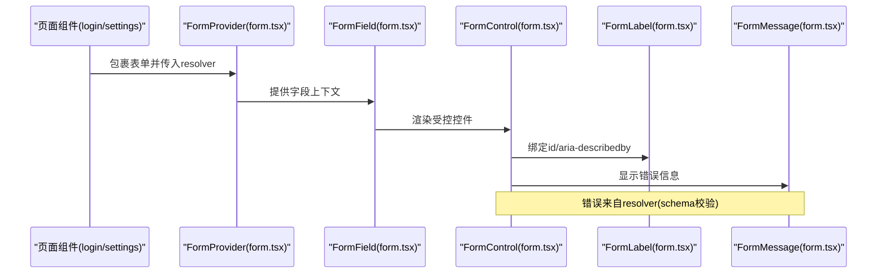
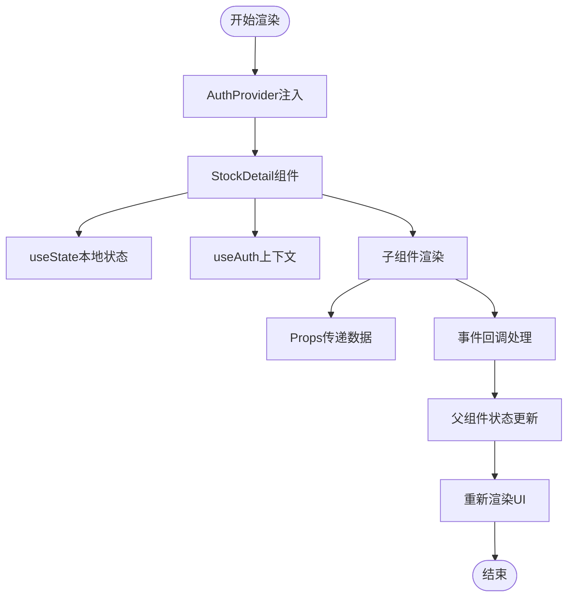
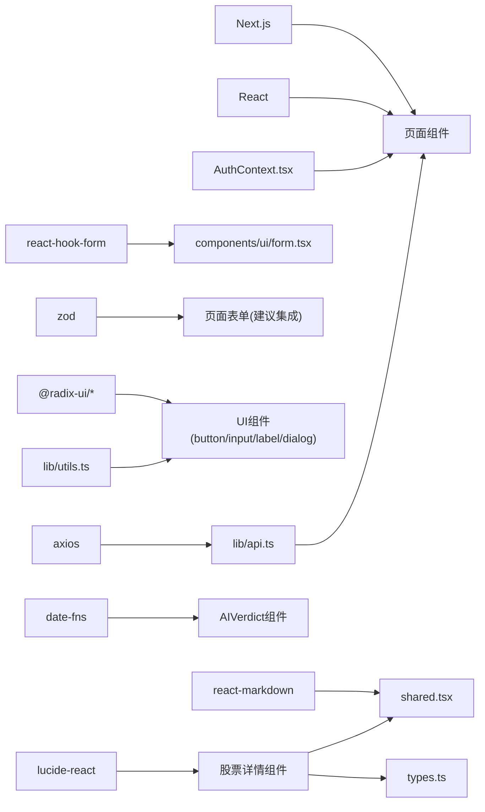

# React组件设计

<cite>
**本文档引用的文件**
- [package.json](file://frontend/package.json)
- [tsconfig.json](file://frontend/tsconfig.json)
- [layout.tsx](file://frontend/app/layout.tsx)
- [AuthContext.tsx](file://frontend/context/AuthContext.tsx)
- [button.tsx](file://frontend/components/ui/button.tsx)
- [form.tsx](file://frontend/components/ui/form.tsx)
- [input.tsx](file://frontend/components/ui/input.tsx)
- [label.tsx](file://frontend/components/ui/label.tsx)
- [card.tsx](file://frontend/components/ui/card.tsx)
- [dialog.tsx](file://frontend/components/ui/dialog.tsx)
- [page.tsx（登录）](file://frontend/app/login/page.tsx)
- [page.tsx（注册）](file://frontend/app/register/page.tsx)
- [page.tsx（设置）](file://frontend/app/settings/page.tsx)
- [StockDetail.tsx](file://frontend/components/features/StockDetail.tsx)
- [AIVerdict.tsx](file://frontend/components/features/stock-detail/AIVerdict.tsx)
- [PositionOverlay.tsx](file://frontend/components/features/stock-detail/PositionOverlay.tsx)
- [shared.tsx](file://frontend/components/features/stock-detail/shared.tsx)
- [types.ts](file://frontend/components/features/stock-detail/types.ts)
- [MarketAnalysis.tsx](file://frontend/components/features/stock-detail/MarketAnalysis.tsx)
- [TechnicalInsights.tsx](file://frontend/components/features/stock-detail/TechnicalInsights.tsx)
- [api.ts](file://frontend/lib/api.ts)
- [globals.css](file://frontend/app/globals.css)
- [utils.ts](file://frontend/lib/utils.ts)
</cite>

## 目录
1. [简介](#简介)
2. [项目结构](#项目结构)
3. [核心组件](#核心组件)
4. [架构总览](#架构总览)
5. [详细组件分析](#详细组件分析)
6. [依赖关系分析](#依赖关系分析)
7. [性能考虑](#性能考虑)
8. [故障排查指南](#故障排查指南)
9. [结论](#结论)
10. [附录](#附录)

## 简介
本指南面向React组件设计与开发，结合当前仓库的前端实现，系统讲解函数组件与Hooks的使用模式、组件设计原则、表单处理（含react-hook-form与Zod）、组件间通信、生命周期管理与性能优化、测试策略与调试方法，以及TypeScript类型在组件中的应用。内容以实际代码为依据，辅以可视化图示帮助不同技术背景的读者快速上手。

**更新** 本版本特别关注股票详情界面的增强，包括新增PositionOverlay组件和扩展的AIVerdict组件，展现了复杂金融分析界面的组件化设计模式。

## 项目结构
前端采用Next.js 16应用，按功能模块组织：页面路由位于app目录，UI组件位于components/ui，股票详情功能位于components/features/stock-detail，全局样式与主题变量位于app/globals.css，上下文与工具函数位于context与lib目录。整体采用"按功能分层"的组织方式，便于维护与扩展。

**图表来源**
- [layout.tsx:20-38](file://frontend/app/layout.tsx#L20-L38)
- [AuthContext.tsx:15-51](file://frontend/context/AuthContext.tsx#L15-L51)
- [StockDetail.tsx:1-197](file://frontend/components/features/StockDetail.tsx#L1-L197)
- [AIVerdict.tsx:1-817](file://frontend/components/features/stock-detail/AIVerdict.tsx#L1-L817)
- [PositionOverlay.tsx:1-114](file://frontend/components/features/stock-detail/PositionOverlay.tsx#L1-L114)
- [shared.tsx:1-151](file://frontend/components/features/stock-detail/shared.tsx#L1-L151)
- [types.ts:1-116](file://frontend/components/features/stock-detail/types.ts#L1-L116)

**章节来源**
- [layout.tsx:1-39](file://frontend/app/layout.tsx#L1-L39)
- [package.json:1-43](file://frontend/package.json#L1-L43)

## 核心组件
本节聚焦于与组件设计密切相关的核心模块：认证上下文、UI基础组件、表单体系、页面组件以及新增的股票详情功能组件。

- 认证上下文（AuthContext）
  - 提供token存储、登录登出、认证状态判断与路由跳转能力，通过useEffect在客户端挂载时从localStorage恢复token。
  - 使用useAuth自定义Hook在子组件中安全访问上下文值，并在越界使用时抛出明确错误。

- UI基础组件
  - 按钮（button.tsx）：基于cva实现变体与尺寸组合，支持asChild透传，统一视觉与交互。
  - 输入框（input.tsx）：统一样式与无障碍属性，支持aria-invalid状态。
  - 标签（label.tsx）：与表单控件配合，提升可访问性。
  - 卡片（card.tsx）：语义化容器，支持头部、标题、描述、内容、底部等区域。
  - 对话框（dialog.tsx）：基于Radix UI，提供门户、覆盖层、内容区与关闭按钮等结构。

- 表单体系（form.tsx）
  - 基于react-hook-form封装FormProvider、FormField、FormLabel、FormControl、FormMessage等，提供useFormField钩子简化字段状态读取与无障碍属性绑定。
  - 支持表单项上下文（FormItemContext）与字段上下文（FormFieldContext），确保标签、描述、错误信息与控件正确关联。

- 页面组件
  - 登录页（login/page.tsx）：演示useState、useEffect、useAuth、axios调用与表单提交流程。
  - 注册页（register/page.tsx）：与登录页类似，展示注册流程。
  - 设置页（settings/page.tsx）：演示useEffect加载用户资料、更新设置、消息提示与数据源切换。

- 股票详情功能组件
  - StockDetail（StockDetail.tsx）：作为L1编排容器，负责管理全局状态、协调数据请求并将渲染职责委托给各板块子组件。
  - AIVerdict（AIVerdict.tsx）：扩展至817行，提供AI智能判研指标展示，包含建议操作、情绪偏差、交易执行轴、诊断研判逻辑、信号追踪与复盘等功能。
  - PositionOverlay（PositionOverlay.tsx）：新增组件，提供个性化持仓管理建议，基于实际持仓成本与仓位对公共分析结果进行个性化管理补充。
  - MarketAnalysis（MarketAnalysis.tsx）：展示K线图+图层切换控制（布林带/RSI/MACD）。
  - TechnicalInsights（TechnicalInsights.tsx）：展示6个技术指标卡片矩阵+AI智能分析结论。

**章节来源**
- [AuthContext.tsx:1-60](file://frontend/context/AuthContext.tsx#L1-L60)
- [button.tsx:1-63](file://frontend/components/ui/button.tsx#L1-L63)
- [input.tsx:1-22](file://frontend/components/ui/input.tsx#L1-L22)
- [label.tsx:1-25](file://frontend/components/ui/label.tsx#L1-L25)
- [card.tsx:1-93](file://frontend/components/ui/card.tsx#L1-L93)
- [dialog.tsx:1-144](file://frontend/components/ui/dialog.tsx#L1-L144)
- [form.tsx:1-168](file://frontend/components/ui/form.tsx#L1-L168)
- [page.tsx（登录）:1-89](file://frontend/app/login/page.tsx#L1-L89)
- [page.tsx（注册）:1-84](file://frontend/app/register/page.tsx#L1-L84)
- [page.tsx（设置）:1-173](file://frontend/app/settings/page.tsx#L1-L173)
- [StockDetail.tsx:1-197](file://frontend/components/features/StockDetail.tsx#L1-L197)
- [AIVerdict.tsx:1-817](file://frontend/components/features/stock-detail/AIVerdict.tsx#L1-L817)
- [PositionOverlay.tsx:1-114](file://frontend/components/features/stock-detail/PositionOverlay.tsx#L1-L114)
- [MarketAnalysis.tsx:1-83](file://frontend/components/features/stock-detail/MarketAnalysis.tsx#L1-L83)
- [TechnicalInsights.tsx:1-363](file://frontend/components/features/stock-detail/TechnicalInsights.tsx#L1-L363)

## 架构总览
下图展示了应用启动到页面渲染的关键路径：根布局注入AuthProvider，页面组件通过useAuth消费认证状态，API请求通过lib/api.ts的Axios实例与拦截器自动携带token。股票详情界面通过StockDetail组件编排多个专业分析板块。

**图表来源**
- [layout.tsx:20-38](file://frontend/app/layout.tsx#L20-L38)
- [AuthContext.tsx:19-37](file://frontend/context/AuthContext.tsx#L19-L37)
- [StockDetail.tsx:44-196](file://frontend/components/features/StockDetail.tsx#L44-L196)
- [AIVerdict.tsx:29-91](file://frontend/components/features/stock-detail/AIVerdict.tsx#L29-L91)
- [PositionOverlay.tsx:19-113](file://frontend/components/features/stock-detail/PositionOverlay.tsx#L19-L113)
- [api.ts:10-18](file://frontend/lib/api.ts#L10-L18)

## 详细组件分析

### 认证上下文（AuthContext）
- 设计要点
  - 客户端侧use client，避免在服务端渲染时访问localStorage。
  - 通过useEffect在挂载时从localStorage恢复token，保证SSR与CSR一致。
  - login/logout分别持久化与移除token，并进行路由跳转，保持用户体验一致性。
  - useAuth提供受保护的上下文访问，强制在Provider内部使用。

**图表来源**
- [AuthContext.tsx:6-59](file://frontend/context/AuthContext.tsx#L6-L59)

**章节来源**
- [AuthContext.tsx:1-60](file://frontend/context/AuthContext.tsx#L1-L60)

### UI组件库（Button/Input/Label/Card/Dialog/Form）
- 组件设计原则
  - 单一职责：每个组件只负责一个UI原子单元。
  - 可复用性：通过变体、尺寸、透传属性与上下文组合，适配多种场景。
  - 可访问性：为输入与标签绑定id/for，支持aria-invalid与屏幕阅读器。
  - 类名合并：统一使用utils.ts的cn函数，确保Tailwind与条件类名正确合并。

**图表来源**
- [button.tsx:7-37](file://frontend/components/ui/button.tsx#L7-L37)
- [input.tsx:5-18](file://frontend/components/ui/input.tsx#L5-L18)
- [label.tsx:8-21](file://frontend/components/ui/label.tsx#L8-L21)
- [card.tsx:5-82](file://frontend/components/ui/card.tsx#L5-L82)
- [dialog.tsx:9-81](file://frontend/components/ui/dialog.tsx#L9-L81)
- [form.tsx:19-167](file://frontend/components/ui/form.tsx#L19-L167)
- [utils.ts:4-6](file://frontend/lib/utils.ts#L4-L6)

**章节来源**
- [button.tsx:1-63](file://frontend/components/ui/button.tsx#L1-L63)
- [input.tsx:1-22](file://frontend/components/ui/input.tsx#L1-L22)
- [label.tsx:1-25](file://frontend/components/ui/label.tsx#L1-L25)
- [card.tsx:1-93](file://frontend/components/ui/card.tsx#L1-L93)
- [dialog.tsx:1-144](file://frontend/components/ui/dialog.tsx#L1-L144)
- [form.tsx:1-168](file://frontend/components/ui/form.tsx#L1-L168)
- [utils.ts:1-7](file://frontend/lib/utils.ts#L1-L7)

### 股票详情功能组件

#### StockDetail编排层
- 设计要点
  - 作为L1编排容器，负责管理全局状态（图层开关、滚动检测、数据加载）。
  - 协调数据请求（K线历史、AI分析历史）。
  - 将渲染职责委托给各板块子组件，实现清晰的层次结构。

**图表来源**
- [StockDetail.tsx:44-196](file://frontend/components/features/StockDetail.tsx#L44-L196)
- [AIVerdict.tsx:29-91](file://frontend/components/features/stock-detail/AIVerdict.tsx#L29-L91)
- [PositionOverlay.tsx:19-113](file://frontend/components/features/stock-detail/PositionOverlay.tsx#L19-L113)

#### AIVerdict增强分析组件
- 设计要点
  - 扩展至817行，提供完整的AI智能判研指标展示。
  - 包含建议操作+情绪偏差、交易执行轴、诊断研判逻辑、信号追踪与复盘等功能。
  - 支持模拟交易功能，允许用户基于AI建议进行纸面交易。
  - 实现复杂的交易轴算法，将止损/建仓/目标价映射到线性坐标轴。

**图表来源**
- [AIVerdict.tsx:137-522](file://frontend/components/features/stock-detail/AIVerdict.tsx#L137-L522)

#### PositionOverlay个性化建议组件
- 设计要点
  - 新增组件，提供个性化持仓管理建议。
  - 基于实际持仓成本与仓位对公共分析结果进行个性化管理补充。
  - 包含仓位动作建议和仓位约束两个核心功能区域。

**图表来源**
- [PositionOverlay.tsx:8-113](file://frontend/components/features/stock-detail/PositionOverlay.tsx#L8-L113)

#### Shared工具函数与组件
- 设计要点
  - 提供跨板块复用的工具函数，如价格清洗、货币符号判断、RSI颜色映射等。
  - 实现引用高亮系统，支持Markdown渲染器与引用标签解析。
  - 提供通用的组件如ReferenceCitation、MarkdownWithRefs等。

**章节来源**
- [StockDetail.tsx:1-197](file://frontend/components/features/StockDetail.tsx#L1-L197)
- [AIVerdict.tsx:1-817](file://frontend/components/features/stock-detail/AIVerdict.tsx#L1-L817)
- [PositionOverlay.tsx:1-114](file://frontend/components/features/stock-detail/PositionOverlay.tsx#L1-L114)
- [shared.tsx:1-151](file://frontend/components/features/stock-detail/shared.tsx#L1-L151)
- [types.ts:1-116](file://frontend/components/features/stock-detail/types.ts#L1-L116)

### 表单处理（react-hook-form封装与Zod集成建议）
- 当前实现
  - form.tsx基于react-hook-form提供FormProvider、FormField、FormLabel、FormControl、FormMessage等，useFormField统一读取字段状态与无障碍属性。
  - 页面组件（如登录页）直接使用原生表单与useState控制输入，未显式集成Zod验证器。

- 集成Zod建议
  - 在页面级或表单组件中引入resolver，将schema作为参数传入useForm，实现声明式验证与错误传播。
  - 将useFormField返回的error.message映射到UI，保持与现有FormMessage一致的展示逻辑。

**图表来源**
- [form.tsx:19-167](file://frontend/components/ui/form.tsx#L19-L167)
- [page.tsx（登录）:12-42](file://frontend/app/login/page.tsx#L12-L42)

**章节来源**
- [form.tsx:1-168](file://frontend/components/ui/form.tsx#L1-L168)
- [page.tsx（登录）:1-89](file://frontend/app/login/page.tsx#L1-L89)

### 组件间通信模式
- Props传递
  - 页面组件通过props接收children（如Card、Button等），并在事件处理器中更新本地状态。
  - 股票详情组件通过props传递selectedItem、aiData、analysisHistory等数据给各个子组件。
- Context共享
  - AuthProvider向子树提供认证状态与方法；页面组件通过useAuth消费。
- 事件冒泡
  - 表单onSubmit阻止默认行为，使用异步请求与状态管理，避免默认刷新与页面跳转。
  - 股票详情组件通过onAnalyze、onRefresh等回调函数向上层传递事件。

**图表来源**
- [AuthContext.tsx:15-51](file://frontend/context/AuthContext.tsx#L15-L51)
- [StockDetail.tsx:72-86](file://frontend/components/features/StockDetail.tsx#L72-L86)
- [AIVerdict.tsx:47-58](file://frontend/components/features/stock-detail/AIVerdict.tsx#L47-L58)

**章节来源**
- [AuthContext.tsx:1-60](file://frontend/context/AuthContext.tsx#L1-L60)
- [StockDetail.tsx:1-197](file://frontend/components/features/StockDetail.tsx#L1-L197)
- [AIVerdict.tsx:1-817](file://frontend/components/features/stock-detail/AIVerdict.tsx#L1-L817)

### 生命周期管理与性能优化
- 生命周期
  - 客户端侧：useEffect用于初始化（如恢复token）、副作用清理（如取消请求、清理定时器）。
  - 页面级：useEffect根据isAuthenticated加载用户资料，避免无意义请求。
  - 股票详情组件：useEffect用于滚动检测、数据加载、状态管理。
- 性能优化
  - 使用React.memo或useMemo缓存昂贵计算（如格式化数据）。
  - 使用useCallback稳定回调，减少子组件重渲染。
  - 合理拆分组件，避免不必要的整体重渲染。
  - 使用Suspense与动态导入（按需加载）提升首屏性能。
  - Tailwind类名合并与CSS变量减少运行时样式计算。
  - AIVerdict组件使用React.memo进行性能优化。

**章节来源**
- [AuthContext.tsx:19-25](file://frontend/context/AuthContext.tsx#L19-L25)
- [StockDetail.tsx:72-86](file://frontend/components/features/StockDetail.tsx#L72-L86)
- [AIVerdict.tsx:29-91](file://frontend/components/features/stock-detail/AIVerdict.tsx#L29-L91)
- [globals.css:1-141](file://frontend/app/globals.css#L1-L141)

### TypeScript类型定义在组件中的应用
- 类型严格性
  - tsconfig启用严格模式，确保类型安全。
  - API模块导出接口（如UserProfile、UserSettingsUpdate、PortfolioItem等），页面与工具函数按接口消费数据。
  - 股票详情组件使用专门的类型定义，确保Props接口契约。
- 组件类型
  - UI组件通过React.ComponentProps与VariantProps约束属性，确保变体与尺寸合法。
  - 表单组件通过泛型约束FieldValues与FieldPath，保障字段类型安全。
  - 股票详情组件通过AIData、PortfolioItem等接口确保数据结构一致性。

**章节来源**
- [tsconfig.json:11-12](file://frontend/tsconfig.json#L11-L12)
- [types.ts:1-116](file://frontend/components/features/stock-detail/types.ts#L1-L116)
- [button.tsx:45-48](file://frontend/components/ui/button.tsx#L45-L48)

## 依赖关系分析
- 外部依赖
  - react、react-dom、next：框架与运行时。
  - react-hook-form、@hookform/resolvers：表单状态与验证。
  - zod：类型与验证schema（建议在页面或表单组件中集成）。
  - @radix-ui/react-*：无障碍对话框、标签、滚动区域等。
  - axios：HTTP客户端，配合lib/api.ts拦截器统一鉴权。
  - lucide-react：图标库，用于金融分析界面的可视化。
  - date-fns：日期格式化，支持中文本地化。
  - react-markdown、remark-gfm：Markdown渲染与表格支持。
- 内部依赖
  - layout.tsx依赖AuthContext提供认证上下文。
  - 页面组件依赖UI组件与API模块。
  - 股票详情组件依赖shared工具函数与types类型定义。
  - UI组件依赖utils.ts进行类名合并。

**图表来源**
- [package.json:11-29](file://frontend/package.json#L11-L29)
- [api.ts:1-130](file://frontend/lib/api.ts#L1-L130)
- [form.tsx:1-168](file://frontend/components/ui/form.tsx#L1-L168)
- [utils.ts:1-7](file://frontend/lib/utils.ts#L1-L7)
- [AuthContext.tsx:1-60](file://frontend/context/AuthContext.tsx#L1-L60)
- [layout.tsx:20-38](file://frontend/app/layout.tsx#L20-L38)
- [StockDetail.tsx:14-31](file://frontend/components/features/StockDetail.tsx#L14-L31)
- [AIVerdict.tsx:13-27](file://frontend/components/features/stock-detail/AIVerdict.tsx#L13-L27)

**章节来源**
- [package.json:1-43](file://frontend/package.json#L1-L43)
- [api.ts:1-130](file://frontend/lib/api.ts#L1-L130)

## 性能考虑
- 渲染层面
  - 将不随状态变化的静态元素提取为常量，避免重复创建。
  - 使用React.useMemo缓存计算结果，useCallback稳定回调。
  - 股票详情组件广泛使用React.memo进行性能优化。
- 网络层面
  - 合理使用请求去抖与节流，避免频繁刷新。
  - 利用Axios拦截器统一处理鉴权与错误，减少重复逻辑。
- 样式与主题
  - CSS变量与Tailwind类名合并降低运行时开销，暗色模式切换流畅。
- 资源加载
  - 动态导入重型组件，按需加载页面资源。
  - 股票详情组件按需渲染不同的分析板块。

## 故障排查指南
- 认证相关
  - useAuth必须在AuthProvider内部使用，否则会抛出错误。检查layout.tsx是否包裹了AuthProvider。
  - 登录成功后未跳转或token未持久化：确认login方法是否写入localStorage并触发路由跳转。
- 表单相关
  - useFormField必须在FormField内部使用，否则会抛出错误。检查表单结构是否正确嵌套。
  - 错误信息未显示：确认FormMessage是否被useFormField关联的id引用。
- 股票详情相关
  - AIVerdict组件显示空白：检查aiData数据结构是否正确，确保必需字段存在。
  - PositionOverlay不显示：确认selectedItem包含有效持仓数据，quantity必须大于0。
  - 价格格式化错误：检查sanitizePrice函数是否正确处理null/undefined值。
- 请求相关
  - 401/403：确认Axios拦截器已附加Authorization头；检查localStorage中的token是否存在且有效。
  - CORS/跨域：确认后端CORS配置与代理设置。
- 样式与主题
  - 暗色模式不生效：检查根节点是否包含dark类，CSS变量是否正确覆盖。

**章节来源**
- [AuthContext.tsx:53-59](file://frontend/context/AuthContext.tsx#L53-L59)
- [form.tsx:52-54](file://frontend/components/ui/form.tsx#L52-L54)
- [AIVerdict.tsx:64-77](file://frontend/components/features/stock-detail/AIVerdict.tsx#L64-L77)
- [PositionOverlay.tsx:25-27](file://frontend/components/features/stock-detail/PositionOverlay.tsx#L25-L27)
- [api.ts:10-18](file://frontend/lib/api.ts#L10-L18)
- [layout.tsx:28-37](file://frontend/app/layout.tsx#L28-L37)

## 结论
本项目以清晰的分层与可复用的UI组件为基础，结合上下文与Axios拦截器实现了认证与网络层的统一。通过react-hook-form封装，表单处理具备良好的可访问性与可维护性。股票详情界面的增强展现了复杂金融分析场景下的组件化设计模式，包括新增的PositionOverlay组件和扩展的AIVerdict组件，提供了完整的AI智能判研指标展示和个性化持仓管理建议。

建议后续在页面级集成Zod验证器，进一步强化类型安全与错误体验。遵循单一职责、可复用性与可测试性的设计原则，配合性能优化与完善的故障排查流程，可构建高质量的React组件体系。

## 附录
- 开发环境与脚本
  - dev/build/start/lint脚本由package.json定义，便于本地开发与质量检查。
- 主题与样式
  - globals.css定义了CSS变量与暗色模式规则，配合utils.ts的类名合并，形成一致的视觉语言。
- 股票详情组件特色
  - 支持复杂的交易轴算法，提供直观的价格区间可视化。
  - 实现完整的AI分析报告渲染，包含Markdown格式化与引用解析。
  - 提供模拟交易功能，增强用户体验与互动性。

**章节来源**
- [package.json:5-10](file://frontend/package.json#L5-L10)
- [globals.css:1-141](file://frontend/app/globals.css#L1-L141)
- [StockDetail.tsx:1-197](file://frontend/components/features/StockDetail.tsx#L1-L197)
- [AIVerdict.tsx:1-817](file://frontend/components/features/stock-detail/AIVerdict.tsx#L1-L817)
- [PositionOverlay.tsx:1-114](file://frontend/components/features/stock-detail/PositionOverlay.tsx#L1-L114)