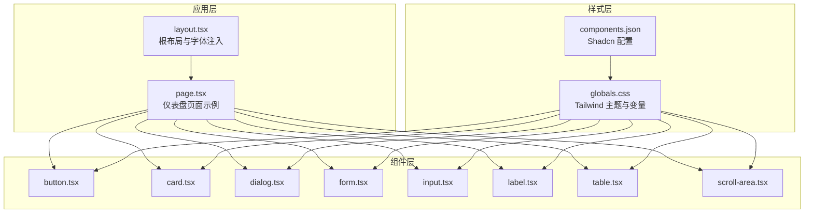
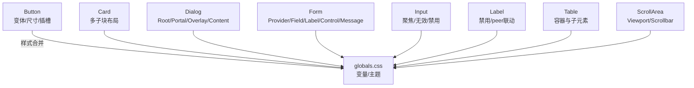
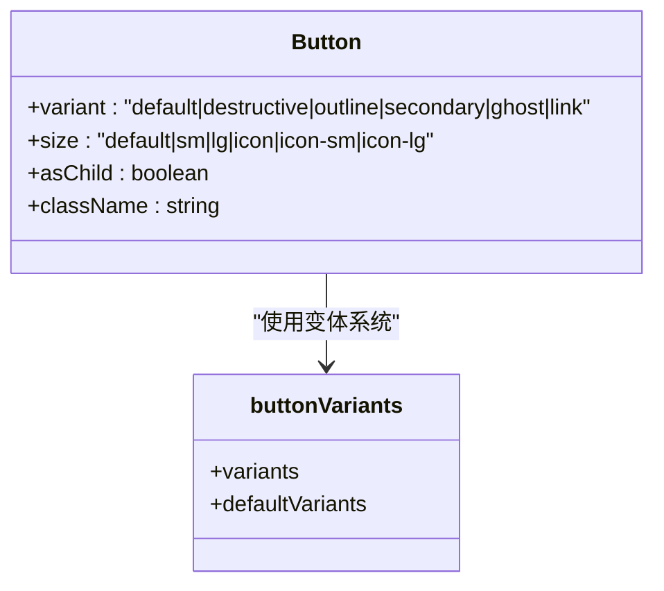
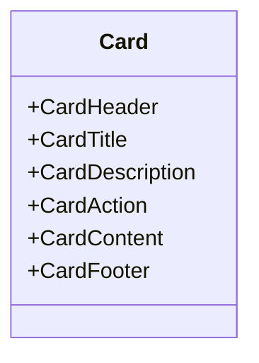
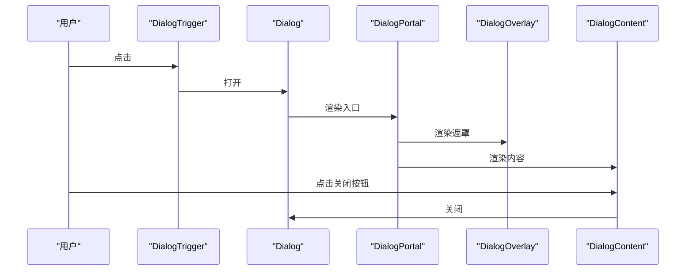
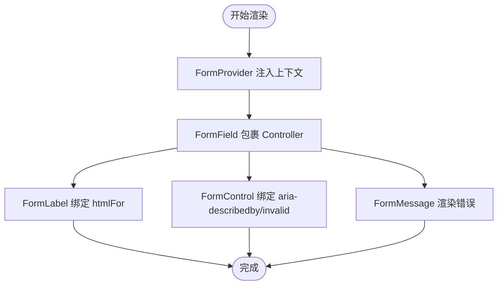
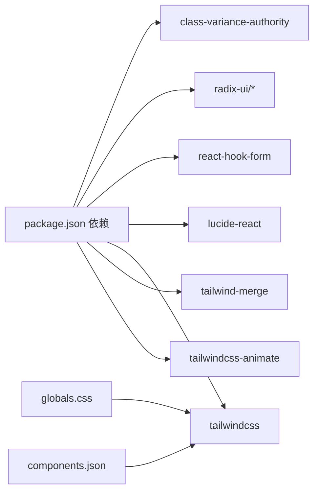

# UI组件库

<cite>
**本文引用的文件**
- [button.tsx](file://frontend/components/ui/button.tsx)
- [card.tsx](file://frontend/components/ui/card.tsx)
- [dialog.tsx](file://frontend/components/ui/dialog.tsx)
- [form.tsx](file://frontend/components/ui/form.tsx)
- [input.tsx](file://frontend/components/ui/input.tsx)
- [label.tsx](file://frontend/components/ui/label.tsx)
- [table.tsx](file://frontend/components/ui/table.tsx)
- [scroll-area.tsx](file://frontend/components/ui/scroll-area.tsx)
- [globals.css](file://frontend/app/globals.css)
- [layout.tsx](file://frontend/app/layout.tsx)
- [page.tsx](file://frontend/app/page.tsx)
- [components.json](file://frontend/components.json)
- [package.json](file://frontend/package.json)
</cite>

## 目录
1. [简介](#简介)
2. [项目结构](#项目结构)
3. [核心组件](#核心组件)
4. [架构总览](#架构总览)
5. [详细组件分析](#详细组件分析)
6. [依赖关系分析](#依赖关系分析)
7. [性能考量](#性能考量)
8. [故障排查指南](#故障排查指南)
9. [结论](#结论)
10. [附录](#附录)

## 简介
本指南面向使用基于 Shadcn/UI 的组件体系的开发者与设计师，覆盖 Button、Card、Dialog、Form、Input、Label、Table、ScrollArea 等核心组件的功能、属性、变体、尺寸与样式定制方法；阐述组件组合使用模式（布局与表单协同）、可访问性与键盘导航支持；提供主题定制（颜色、字体、间距）与响应式/移动端适配策略。

## 项目结构
前端采用 Next.js 应用，组件位于 components/ui 下，样式通过 Tailwind CSS 与自定义变量在 app/globals.css 中集中管理，页面示例位于 app 下，展示组件在真实场景中的组合使用。

图表来源
- [layout.tsx](file://frontend/app/layout.tsx#L22-L38)
- [page.tsx](file://frontend/app/page.tsx#L1-L686)
- [button.tsx](file://frontend/components/ui/button.tsx#L1-L63)
- [card.tsx](file://frontend/components/ui/card.tsx#L1-L93)
- [dialog.tsx](file://frontend/components/ui/dialog.tsx#L1-L144)
- [form.tsx](file://frontend/components/ui/form.tsx#L1-L168)
- [input.tsx](file://frontend/components/ui/input.tsx#L1-L22)
- [label.tsx](file://frontend/components/ui/label.tsx#L1-L25)
- [table.tsx](file://frontend/components/ui/table.tsx#L1-L117)
- [scroll-area.tsx](file://frontend/components/ui/scroll-area.tsx#L1-L59)
- [globals.css](file://frontend/app/globals.css#L1-L141)
- [components.json](file://frontend/components.json#L1-L23)

章节来源
- [layout.tsx](file://frontend/app/layout.tsx#L22-L38)
- [page.tsx](file://frontend/app/page.tsx#L1-L686)
- [globals.css](file://frontend/app/globals.css#L1-L141)
- [components.json](file://frontend/components.json#L1-L23)

## 核心组件
- Button：支持多种变体（默认、破坏性、描边、次级、幽灵、链接）与尺寸（默认、小、大、图标等），具备聚焦环、禁用态与 SVG 内嵌优化。
- Card：卡片容器及其头部、标题、描述、内容、底部、操作区域，支持网格布局与响应式容器。
- Dialog：对话框根、触发器、入口、覆盖层、内容、页眉、页脚、标题、描述，支持关闭按钮与动画。
- Form：基于 react-hook-form 的表单上下文、字段、标签、控件、描述与错误消息，自动同步 aria-* 属性。
- Input：输入框基础样式，包含聚焦环、无效态、禁用态与占位符/选区样式。
- Label：标签组件，支持禁用态与 peer 失效联动。
- Table：表格容器与子元素（头、体、尾、行、单元格、标题、摘要），支持悬停与选中态。
- ScrollArea：滚动区域根与滚动条，支持水平/垂直方向与焦点环。

章节来源
- [button.tsx](file://frontend/components/ui/button.tsx#L7-L37)
- [card.tsx](file://frontend/components/ui/card.tsx#L5-L92)
- [dialog.tsx](file://frontend/components/ui/dialog.tsx#L9-L143)
- [form.tsx](file://frontend/components/ui/form.tsx#L19-L167)
- [input.tsx](file://frontend/components/ui/input.tsx#L5-L21)
- [label.tsx](file://frontend/components/ui/label.tsx#L8-L24)
- [table.tsx](file://frontend/components/ui/table.tsx#L7-L116)
- [scroll-area.tsx](file://frontend/components/ui/scroll-area.tsx#L8-L58)

## 架构总览
组件遵循“原子化样式 + 变体系统 + 上下文/插槽”的设计模式：
- 使用 class-variance-authority 定义变体与默认值，结合 tailwind-merge 合并类名。
- 使用 Radix UI 提供无障碍语义与键盘交互（Dialog、ScrollArea、Label 等）。
- 表单通过 react-hook-form 提供受控状态与验证，Form 组件自动注入 aria-* 与错误提示。

图表来源
- [button.tsx](file://frontend/components/ui/button.tsx#L7-L37)
- [card.tsx](file://frontend/components/ui/card.tsx#L5-L92)
- [dialog.tsx](file://frontend/components/ui/dialog.tsx#L9-L143)
- [form.tsx](file://frontend/components/ui/form.tsx#L19-L167)
- [input.tsx](file://frontend/components/ui/input.tsx#L5-L21)
- [label.tsx](file://frontend/components/ui/label.tsx#L8-L24)
- [table.tsx](file://frontend/components/ui/table.tsx#L7-L116)
- [scroll-area.tsx](file://frontend/components/ui/scroll-area.tsx#L8-L58)
- [globals.css](file://frontend/app/globals.css#L6-L47)

## 详细组件分析

### Button 组件
- 功能要点
  - 变体：default、destructive、outline、secondary、ghost、link
  - 尺寸：default、sm、lg、icon、icon-sm、icon-lg
  - 插槽：asChild 支持将 Button 渲染为任意元素（如 Link）
  - 焦点与无效态：聚焦环、无效态边框/背景色
- 使用建议
  - 图标按钮优先使用 icon/icon-sm/icon-lg 尺寸
  - 表单提交使用 default 或 destructive，配合禁用态控制提交流程
- 可访问性
  - 自动设置 data-slot、aria-invalid 等属性，便于测试与样式映射

图表来源
- [button.tsx](file://frontend/components/ui/button.tsx#L7-L37)

章节来源
- [button.tsx](file://frontend/components/ui/button.tsx#L7-L37)

### Card 组件
- 功能要点
  - CardHeader 支持带操作区域的网格布局
  - CardTitle/Description 控制排版与层级
  - CardContent/CardFooter 提供内容与底部对齐
- 使用建议
  - 在主从布局中作为详情面板容器，搭配 Table/ScrollArea 实现复杂信息展示
  - 使用 @container 指令实现响应式子布局

图表来源
- [card.tsx](file://frontend/components/ui/card.tsx#L5-L92)

章节来源
- [card.tsx](file://frontend/components/ui/card.tsx#L5-L92)

### Dialog 组件
- 功能要点
  - Portal/Overlay/Content 组合实现模态与遮罩
  - 支持 showCloseButton 控制关闭按钮显示
  - 内置动画与键盘交互（Tab/Escape）
- 使用建议
  - 与 Form 联动时，将表单置于 DialogContent 内，确保焦点管理与可访问性
  - 关闭按钮包含 sr-only 文本，提升屏幕阅读器体验

图表来源
- [dialog.tsx](file://frontend/components/ui/dialog.tsx#L9-L81)

章节来源
- [dialog.tsx](file://frontend/components/ui/dialog.tsx#L9-L81)

### Form 组件（表单上下文）
- 功能要点
  - FormProvider 提供上下文
  - FormField 包裹 Controller，注入字段名称
  - useFormField 自动读取 id、aria-*、错误消息 ID
  - FormLabel、FormControl、FormMessage 自动绑定
- 使用建议
  - 与 Input/Label 组合，确保 htmlFor、aria-describedby、aria-invalid 正确传递
  - 错误消息仅在存在错误或 children 时渲染

图表来源
- [form.tsx](file://frontend/components/ui/form.tsx#L19-L167)

章节来源
- [form.tsx](file://frontend/components/ui/form.tsx#L19-L167)

### Input/Label/Table/ScrollArea
- Input：统一的输入框样式，支持聚焦环、无效态、禁用态
- Label：支持禁用态与 peer 失效联动
- Table：表格容器与子元素，支持悬停与选中态
- ScrollArea：滚动区域与滚动条，支持水平/垂直方向

章节来源
- [input.tsx](file://frontend/components/ui/input.tsx#L5-L21)
- [label.tsx](file://frontend/components/ui/label.tsx#L8-L24)
- [table.tsx](file://frontend/components/ui/table.tsx#L7-L116)
- [scroll-area.tsx](file://frontend/components/ui/scroll-area.tsx#L8-L58)

## 依赖关系分析
- 组件依赖
  - class-variance-authority：变体系统
  - radix-ui：无障碍语义与键盘交互（Dialog、Label、ScrollArea）
  - react-hook-form：表单上下文与字段状态
  - lucide-react：图标库
- 样式依赖
  - Tailwind CSS v4、tailwind-merge、tw-animate-css
  - 自定义变量与暗色主题在 globals.css 中集中管理

图表来源
- [package.json](file://frontend/package.json#L11-L29)
- [components.json](file://frontend/components.json#L6-L12)
- [globals.css](file://frontend/app/globals.css#L1-L4)

章节来源
- [package.json](file://frontend/package.json#L11-L29)
- [components.json](file://frontend/components.json#L6-L12)
- [globals.css](file://frontend/app/globals.css#L1-L4)

## 性能考量
- 类名合并：使用 tailwind-merge 合并类名，避免重复样式导致的重绘
- 变体系统：cva 生成稳定类名，减少运行时计算
- 动画与滚动：Dialog/ScrollArea 使用轻量动画与原生滚动，避免额外开销
- 按需引入：仅在页面中使用到的组件按需导入，降低首屏体积

## 故障排查指南
- 表单错误未显示
  - 检查是否在 FormField 内部使用 FormMessage
  - 确认 useFormField 返回的 formMessageId 是否正确
- 焦点环不生效
  - 确保 Button/Input 等组件未被覆盖样式隐藏 outline
  - 检查 globals.css 中的 outline-ring/聚焦环变量
- 对话框无法关闭
  - 确认 DialogTrigger/DialogClose 的事件绑定
  - 检查 Portal/Overlay 渲染是否正确
- 滚动条不可见
  - 确认 ScrollArea/ScrollBar 的方向与容器高度
  - 检查自定义滚动条样式是否被覆盖

章节来源
- [form.tsx](file://frontend/components/ui/form.tsx#L138-L156)
- [button.tsx](file://frontend/components/ui/button.tsx#L7-L37)
- [dialog.tsx](file://frontend/components/ui/dialog.tsx#L9-L81)
- [scroll-area.tsx](file://frontend/components/ui/scroll-area.tsx#L8-L58)

## 结论
该组件库以 Shadcn/UI 为基础，结合 Radix UI 与 react-hook-form，形成一致的可访问性与可组合性体验。通过集中式主题变量与变体系统，实现风格统一与扩展灵活。建议在实际项目中遵循组件职责边界、保持上下文一致性，并充分利用表单与对话框的可访问性能力。

## 附录

### 组件属性与变体速查
- Button
  - 变体：default、destructive、outline、secondary、ghost、link
  - 尺寸：default、sm、lg、icon、icon-sm、icon-lg
  - 关键属性：variant、size、asChild、className
- Card
  - 子组件：CardHeader、CardTitle、CardDescription、CardAction、CardContent、CardFooter
- Dialog
  - 子组件：Dialog、DialogTrigger、DialogPortal、DialogOverlay、DialogContent、DialogHeader、DialogFooter、DialogTitle、DialogDescription、DialogClose
  - 关键属性：open、onOpenChange、showCloseButton
- Form
  - 子组件：Form、FormField、FormItem、FormLabel、FormControl、FormDescription、FormMessage
  - 关键钩子：useFormField
- Input/Label/Table/ScrollArea
  - Input：type、className
  - Label：className
  - Table：容器与子元素，支持 hover/selected 状态
  - ScrollArea：children、orientation（vertical/horizontal）

章节来源
- [button.tsx](file://frontend/components/ui/button.tsx#L7-L37)
- [card.tsx](file://frontend/components/ui/card.tsx#L5-L92)
- [dialog.tsx](file://frontend/components/ui/dialog.tsx#L9-L143)
- [form.tsx](file://frontend/components/ui/form.tsx#L19-L167)
- [input.tsx](file://frontend/components/ui/input.tsx#L5-L21)
- [label.tsx](file://frontend/components/ui/label.tsx#L8-L24)
- [table.tsx](file://frontend/components/ui/table.tsx#L7-L116)
- [scroll-area.tsx](file://frontend/components/ui/scroll-area.tsx#L8-L58)

### 主题定制指南
- 颜色系统
  - 在 globals.css 中通过 CSS 变量定义背景、前景、主色、次色、强调色、边框、输入、环等
  - 暗色主题通过 .dark 伪变体覆盖变量，确保对比度与可读性
- 字体
  - 通过 layout.tsx 注入 Geist Sans/Mono 字体变量，全局使用 --font-geist-sans/--font-geist-mono
- 间距与圆角
  - 通过 --radius-* 变量控制圆角，配合组件内部的尺寸变体
- Tailwind 配置
  - components.json 指定 tailwind.css 路径、基础色、CSS 变量开关与别名

章节来源
- [globals.css](file://frontend/app/globals.css#L6-L47)
- [globals.css](file://frontend/app/globals.css#L49-L116)
- [layout.tsx](file://frontend/app/layout.tsx#L5-L13)
- [components.json](file://frontend/components.json#L6-L12)

### 响应式与移动端适配
- 组件层面
  - Card 使用 @container 指令实现子布局响应
  - Dialog 内容在小屏下限制最大宽度，使用 sm 断点以上调整
  - Table 容器支持横向滚动，避免布局破坏
- 样式层面
  - 使用 sm 及以上断点进行布局升级，移动端优先保证可读性与触控可达性
  - 滚动区域在移动端提供自然滚动与自定义滚动条

章节来源
- [card.tsx](file://frontend/components/ui/card.tsx#L23-L25)
- [dialog.tsx](file://frontend/components/ui/dialog.tsx#L62-L65)
- [table.tsx](file://frontend/components/ui/table.tsx#L9-L19)
- [scroll-area.tsx](file://frontend/components/ui/scroll-area.tsx#L13-L28)

### 组件组合使用模式
- 布局组件
  - 页面采用两栏/三栏网格布局，左侧列表 + 右侧详情，Card 作为详情容器
  - ScrollArea 用于长列表与搜索结果滚动
- 表单组件
  - Dialog 内嵌表单，Form 与 Input/Label 协同，FormControl 自动绑定 aria 属性
  - 表单提交后刷新页面数据，保持状态一致

章节来源
- [page.tsx](file://frontend/app/page.tsx#L276-L681)
- [form.tsx](file://frontend/components/ui/form.tsx#L19-L167)
- [input.tsx](file://frontend/components/ui/input.tsx#L5-L21)
- [dialog.tsx](file://frontend/components/ui/dialog.tsx#L49-L81)