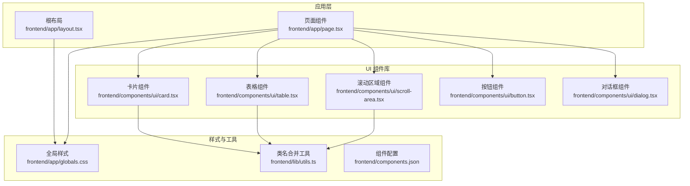
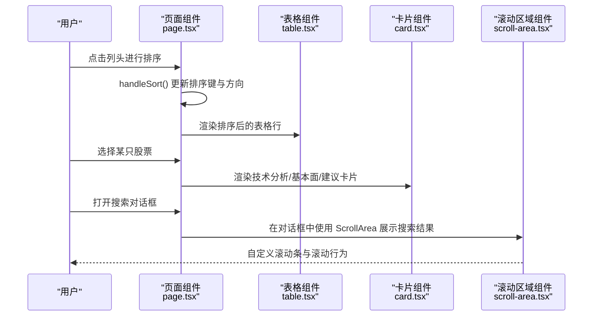
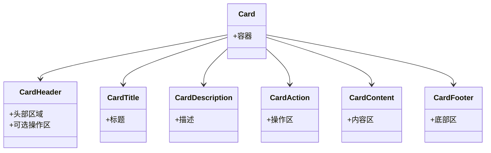
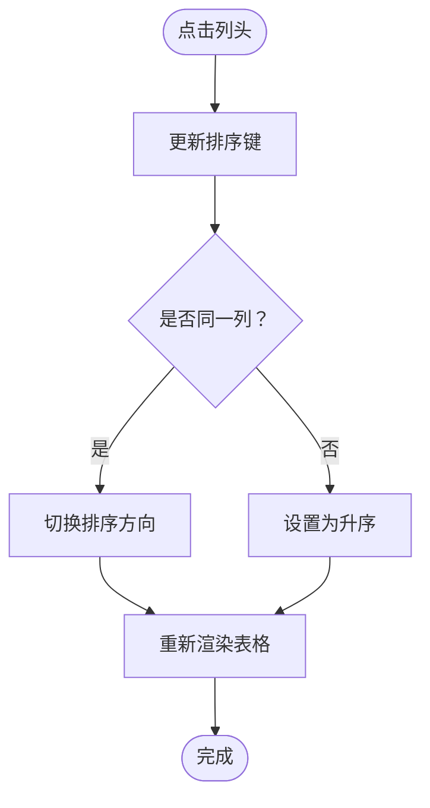
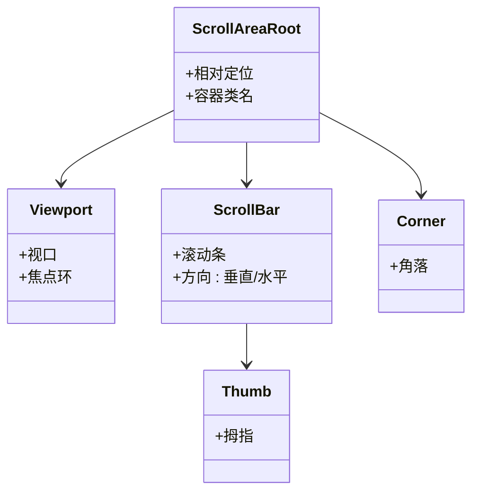
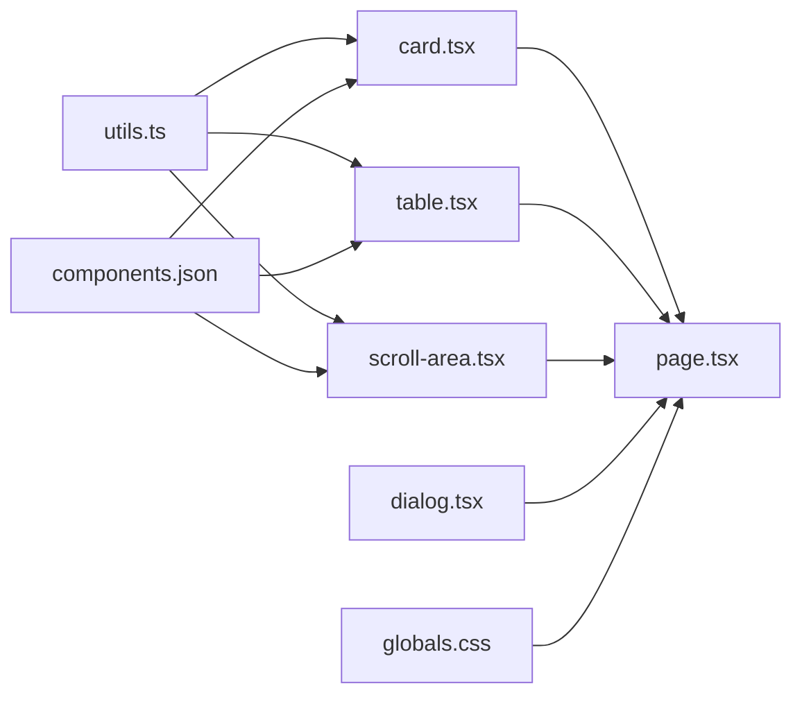

# 布局组件

<cite>
**本文引用的文件**
- [card.tsx](file://frontend/components/ui/card.tsx)
- [table.tsx](file://frontend/components/ui/table.tsx)
- [scroll-area.tsx](file://frontend/components/ui/scroll-area.tsx)
- [page.tsx](file://frontend/app/page.tsx)
- [globals.css](file://frontend/app/globals.css)
- [utils.ts](file://frontend/lib/utils.ts)
- [layout.tsx](file://frontend/app/layout.tsx)
- [button.tsx](file://frontend/components/ui/button.tsx)
- [dialog.tsx](file://frontend/components/ui/dialog.tsx)
- [components.json](file://frontend/components.json)
</cite>

## 目录
1. [简介](#简介)
2. [项目结构](#项目结构)
3. [核心组件](#核心组件)
4. [架构总览](#架构总览)
5. [组件详解与使用指南](#组件详解与使用指南)
6. [依赖关系分析](#依赖关系分析)
7. [性能考量](#性能考量)
8. [故障排查指南](#故障排查指南)
9. [结论](#结论)
10. [附录](#附录)

## 简介
本指南聚焦于前端布局组件的使用与最佳实践，覆盖以下主题：
- 卡片布局组件（Card）：头部、主体、底部区域的组织方式与可选操作区。
- 数据表格组件（Table）：表头、表体、表脚的结构化渲染与排序交互。
- 滚动区域组件（ScrollArea）：自定义滚动条与内容溢出管理。
- 响应式布局策略：网格系统与弹性布局在不同屏幕尺寸下的适配。
- 组件嵌套与布局约束：在主页面中的组合使用模式与约束条件。
- 不同屏幕尺寸下的表现与适配方案。

## 项目结构
本项目采用 Next.js 应用程序，UI 组件位于 frontend/components/ui 下，全局样式位于 frontend/app/globals.css，并通过 cn 工具函数统一合并类名。页面入口位于 frontend/app/page.tsx，演示了 Card、Table、ScrollArea 的典型组合使用。

**图表来源**
- [page.tsx](file://frontend/app/page.tsx#L1-L686)
- [card.tsx](file://frontend/components/ui/card.tsx#L1-L93)
- [table.tsx](file://frontend/components/ui/table.tsx#L1-L117)
- [scroll-area.tsx](file://frontend/components/ui/scroll-area.tsx#L1-L59)
- [button.tsx](file://frontend/components/ui/button.tsx#L1-L63)
- [dialog.tsx](file://frontend/components/ui/dialog.tsx#L1-L144)
- [globals.css](file://frontend/app/globals.css#L1-L141)
- [utils.ts](file://frontend/lib/utils.ts#L1-L7)
- [layout.tsx](file://frontend/app/layout.tsx#L1-L39)
- [components.json](file://frontend/components.json#L1-L23)

**章节来源**
- [page.tsx](file://frontend/app/page.tsx#L1-L686)
- [layout.tsx](file://frontend/app/layout.tsx#L1-L39)
- [globals.css](file://frontend/app/globals.css#L1-L141)
- [utils.ts](file://frontend/lib/utils.ts#L1-L7)
- [components.json](file://frontend/components.json#L1-L23)

## 核心组件
本节概述三个核心布局组件的职责与协作方式：
- Card：提供卡片容器及其头部、标题、描述、操作区、内容区、底部区等子组件，用于模块化展示信息区块。
- Table：提供表格容器与表头、表体、表脚、行、单元格、表头单元格、表注等子组件，支持横向滚动容器与基础交互态。
- ScrollArea：提供可定制滚动条的滚动区域，封装 Radix UI 的滚动区域原语，便于统一滚动体验与视觉风格。

**章节来源**
- [card.tsx](file://frontend/components/ui/card.tsx#L1-L93)
- [table.tsx](file://frontend/components/ui/table.tsx#L1-L117)
- [scroll-area.tsx](file://frontend/components/ui/scroll-area.tsx#L1-L59)

## 架构总览
下图展示了页面中三大组件的协作关系与数据流向：页面负责状态管理与排序逻辑，Card 用于分块展示分析结果，Table 用于展示股票列表与排序交互，ScrollArea 用于在对话框与侧边栏中提供一致的滚动体验。

**图表来源**
- [page.tsx](file://frontend/app/page.tsx#L60-L90)
- [table.tsx](file://frontend/components/ui/table.tsx#L1-L117)
- [card.tsx](file://frontend/components/ui/card.tsx#L1-L93)
- [scroll-area.tsx](file://frontend/components/ui/scroll-area.tsx#L1-L59)

## 组件详解与使用指南

### 卡片组件（Card）
- 组件构成
  - 卡片容器：提供背景色、圆角、阴影、边框与纵向间距的基础容器。
  - 头部区域：支持可选操作区，当存在操作区时，头部会自动采用双列网格布局以容纳标题与操作。
  - 标题与描述：用于展示卡片的语义标题与辅助说明文本。
  - 内容区：卡片的主要内容区域，常用于放置网格或列表。
  - 底部区：用于放置操作按钮组或统计摘要。
- 使用要点
  - 头部与操作区：通过 data-slot 标记与网格类配合，实现标题与操作的并排布局；当存在操作区时，头部会自动调整为两列布局。
  - 内容与底部：内容区与底部区分别承担“信息展示”和“操作控制”的职责，保持清晰的层次。
  - 边框与分隔线：通过边框与分隔线类名控制上/下分隔线的显示，确保视觉连贯性。
- 实战示例
  - 页面中多处使用 Card 包裹“基本面数据”“技术指标”“AI 建议”等信息块，结合响应式网格实现多列展示。

**图表来源**
- [card.tsx](file://frontend/components/ui/card.tsx#L1-L93)

**章节来源**
- [card.tsx](file://frontend/components/ui/card.tsx#L1-L93)
- [page.tsx](file://frontend/app/page.tsx#L495-L588)

### 表格组件（Table）
- 组件构成
  - 容器：外层容器提供相对定位与横向溢出滚动能力，内部承载 table 元素。
  - 表头、表体、表脚：分别对应 thead、tbody、tfoot，提供边框与悬停态。
  - 行与单元格：tr、th、td 提供悬停高亮与选中态，表头单元格包含复选框时的对齐处理。
  - 表注：caption 用于表格说明文字。
- 排序功能
  - 页面中实现了基于状态的排序逻辑：点击列头更新排序键与方向，重新计算排序后的列表并渲染。
  - 支持按“代码”“价格”“涨幅”三列进行升/降序切换。
- 使用要点
  - 横向滚动：容器提供 overflow-x-auto，适合宽表格场景。
  - 交互态：hover 与选中态通过过渡类名实现平滑反馈。
  - 表头对齐：表头单元格在包含复选框时自动处理右侧内边距与垂直居中。
- 实战示例
  - 页面左侧“股票列表”使用自定义的三列网格与点击事件模拟排序；右侧详情页使用 Card 包裹表格样式的统计网格。

**图表来源**
- [page.tsx](file://frontend/app/page.tsx#L60-L90)

**章节来源**
- [table.tsx](file://frontend/components/ui/table.tsx#L1-L117)
- [page.tsx](file://frontend/app/page.tsx#L306-L317)
- [page.tsx](file://frontend/app/page.tsx#L60-L90)

### 滚动区域组件（ScrollArea）
- 组件构成
  - 根节点：提供相对定位与容器类名，承载视口与滚动条。
  - 视口：承载子内容，支持焦点环与轮廓样式。
  - 滚动条：支持垂直/水平两种方向，滚动条拇指根据方向设置不同的边框与尺寸。
  - 角部：角落元素，用于增强滚动区域的视觉完整性。
- 自定义滚动条
  - 通过 Tailwind 类名控制滚动条宽度、边框与透明度，拇指使用相对定位与圆角。
  - 全局 CSS 中提供了 WebKit 滚动条的自定义样式类，可在需要时直接应用。
- 使用要点
  - 与对话框组合：在 Dialog 的内容区域中使用 ScrollArea，确保对话框内的长列表具备一致的滚动体验。
  - 高度限制：通过容器高度与 overflow-y-auto 控制可视区域，避免内容溢出影响布局。
- 实战示例
  - 页面中的“添加自选股”对话框使用 ScrollArea 展示搜索结果列表，保证在小屏设备上的可读性与可用性。

**图表来源**
- [scroll-area.tsx](file://frontend/components/ui/scroll-area.tsx#L1-L59)

**章节来源**
- [scroll-area.tsx](file://frontend/components/ui/scroll-area.tsx#L1-L59)
- [page.tsx](file://frontend/app/page.tsx#L633-L678)
- [globals.css](file://frontend/app/globals.css#L126-L140)

### 响应式布局策略
- 网格系统
  - 页面采用 12 列网格划分左右两栏：左侧占 3/12，右侧占 9/12，形成经典的“侧栏 + 主内容”布局。
  - 卡片内的统计网格使用响应式断点：在不同屏幕尺寸下切换列数，确保信息密度与可读性的平衡。
- 弹性布局
  - 页面根容器使用 flex-column 与 flex-1，使主内容区域占据剩余空间并隐藏溢出。
  - 对话框内容区域使用网格与弹性布局组合，保证在不同窗口尺寸下的良好呈现。
- 滚动与溢出
  - 侧栏与详情区均使用 overflow-y-auto 与自定义滚动条类，确保长列表在窄屏设备上仍可顺畅滚动。
- 断点与适配
  - 基于 Tailwind 断点（sm、md、lg 等）在卡片网格中动态调整列数，兼顾桌面端与移动端的信息密度。
- 实战示例
  - 左侧列表与右侧详情区的滚动条样式统一，对话框内的滚动区域也遵循相同的视觉规范。

**章节来源**
- [page.tsx](file://frontend/app/page.tsx#L276-L280)
- [page.tsx](file://frontend/app/page.tsx#L495-L588)
- [globals.css](file://frontend/app/globals.css#L126-L140)

### 组件嵌套与布局约束
- 嵌套模式
  - 页面中将 Card 作为主要容器，内部再嵌套网格与文本内容；Table 组件用于展示列表数据；ScrollArea 用于包裹对话框中的长列表。
  - Dialog 与 ScrollArea 的组合在“添加自选股”场景中实现弹窗内滚动与内容隔离。
- 布局约束
  - 顶部导航固定高度，主内容区域使用 grid 与 flex 混合布局，确保侧栏与详情区的高度一致且可滚动。
  - 卡片的头部与内容区通过边框与分隔线类名控制视觉边界，避免信息块之间产生视觉混淆。
- 实战示例
  - “添加自选股”对话框中，ScrollArea 包裹列表项，每个列表项内部再次使用 flex 与网格布局组织信息。

**章节来源**
- [page.tsx](file://frontend/app/page.tsx#L495-L588)
- [dialog.tsx](file://frontend/components/ui/dialog.tsx#L1-L144)
- [scroll-area.tsx](file://frontend/components/ui/scroll-area.tsx#L1-L59)

## 依赖关系分析
- 组件间依赖
  - Card、Table、ScrollArea 均依赖 cn 工具函数进行类名合并，确保样式一致性与可维护性。
  - 页面组件依赖上述 UI 组件以构建完整的布局与交互。
- 外部依赖
  - ScrollArea 依赖 Radix UI 的滚动区域原语，提供无障碍与可访问性支持。
  - 全局样式依赖 Tailwind 与自定义变量，提供深浅色主题与颜色体系。
- 配置与别名
  - 组件配置文件定义了样式风格、Tailwind 配置路径与别名映射，便于统一管理组件别名与工具函数路径。

**图表来源**
- [utils.ts](file://frontend/lib/utils.ts#L1-L7)
- [card.tsx](file://frontend/components/ui/card.tsx#L1-L93)
- [table.tsx](file://frontend/components/ui/table.tsx#L1-L117)
- [scroll-area.tsx](file://frontend/components/ui/scroll-area.tsx#L1-L59)
- [page.tsx](file://frontend/app/page.tsx#L1-L686)
- [dialog.tsx](file://frontend/components/ui/dialog.tsx#L1-L144)
- [globals.css](file://frontend/app/globals.css#L1-L141)
- [components.json](file://frontend/components.json#L1-L23)

**章节来源**
- [utils.ts](file://frontend/lib/utils.ts#L1-L7)
- [components.json](file://frontend/components.json#L1-L23)

## 性能考量
- 渲染优化
  - 表格排序在客户端进行，建议在大数据量场景下考虑服务端排序或虚拟滚动以降低重排成本。
  - 卡片网格使用响应式断点，避免在小屏设备上渲染过多列导致布局抖动。
- 滚动性能
  - ScrollArea 使用原生滚动与轻量级滚动条，避免引入重型滚动库带来的额外开销。
  - 对话框中的滚动区域仅在打开时渲染，减少不必要的 DOM 节点数量。
- 样式与主题
  - 全局 CSS 中的颜色变量与深浅色主题切换通过 CSS 变量实现，避免频繁重绘。
- 工具函数
  - cn 工具函数合并类名时使用 tailwind-merge，减少重复与冲突类名，提升样式计算效率。

## 故障排查指南
- 卡片头部布局异常
  - 现象：操作区未正确显示在右侧。
  - 排查：确认头部容器是否包含 data-slot="card-action"，并检查网格类名是否生效。
  - 参考路径：[card.tsx](file://frontend/components/ui/card.tsx#L18-L29)
- 表格横向滚动无效
  - 现象：表格超出容器宽度后被裁剪。
  - 排查：确认表格容器是否包含 overflow-x-auto，表头/单元格是否设置了必要的对齐与内边距类名。
  - 参考路径：[table.tsx](file://frontend/components/ui/table.tsx#L7-L20)
- 滚动条样式不生效
  - 现象：滚动条样式与预期不符。
  - 排查：确认是否正确应用了 ScrollArea 的滚动条类名，以及全局 CSS 中的 WebKit 滚动条样式类是否启用。
  - 参考路径：[scroll-area.tsx](file://frontend/components/ui/scroll-area.tsx#L31-L56)，[globals.css](file://frontend/app/globals.css#L126-L140)
- 响应式网格错位
  - 现象：在小屏设备上网格列数异常。
  - 排查：确认断点类名（如 md:、lg:）是否正确拼接，以及父容器是否具备正确的网格属性。
  - 参考路径：[page.tsx](file://frontend/app/page.tsx#L504-L505)

**章节来源**
- [card.tsx](file://frontend/components/ui/card.tsx#L18-L29)
- [table.tsx](file://frontend/components/ui/table.tsx#L7-L20)
- [scroll-area.tsx](file://frontend/components/ui/scroll-area.tsx#L31-L56)
- [globals.css](file://frontend/app/globals.css#L126-L140)
- [page.tsx](file://frontend/app/page.tsx#L504-L505)

## 结论
本指南围绕 Card、Table、ScrollArea 三大布局组件，系统阐述了它们在项目中的组织方式、交互流程与响应式适配策略。通过 cn 工具函数统一类名管理、借助全局样式与断点实现跨设备一致体验，并在页面中以组合方式实现“侧栏 + 主内容 + 弹窗”的复杂布局。建议在后续迭代中进一步引入虚拟滚动与服务端排序，以提升大列表场景下的性能与交互体验。

## 附录
- 组件别名与配置
  - 组件别名与工具函数路径已在组件配置中定义，便于在项目中统一引用。
- 最佳实践清单
  - 使用 data-slot 标记关键节点，便于样式与测试定位。
  - 在卡片与表格中合理使用边框与分隔线类名，保持视觉层级清晰。
  - 在对话框与侧栏中统一滚动条样式，确保一致的交互体验。
  - 在小屏设备上优先保证内容可读性，必要时减少列数或折叠次要信息。

**章节来源**
- [components.json](file://frontend/components.json#L1-L23)