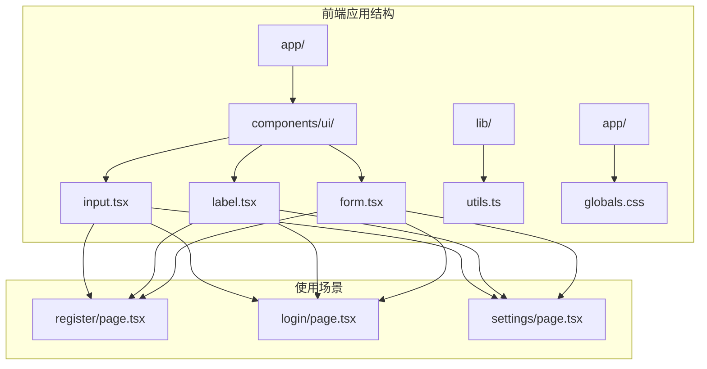
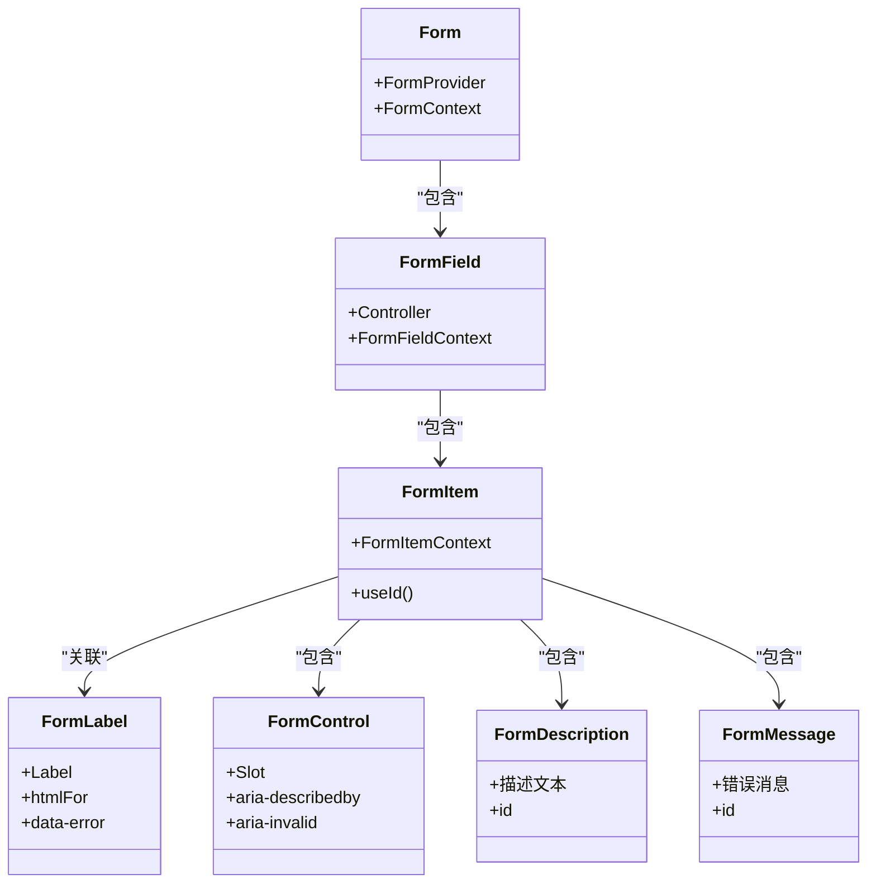
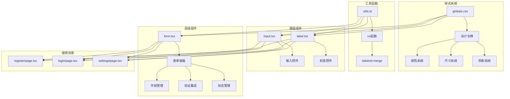
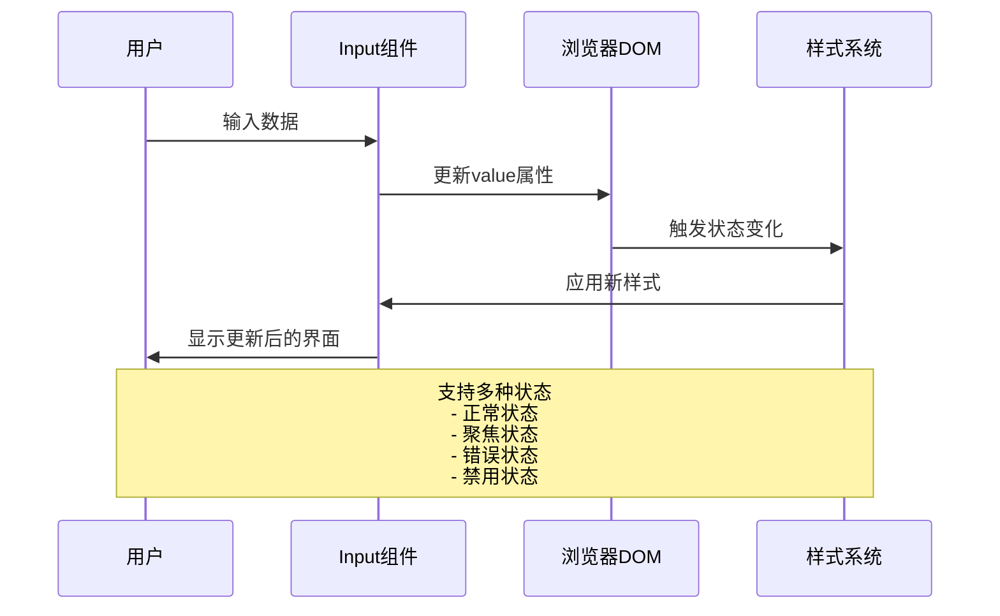
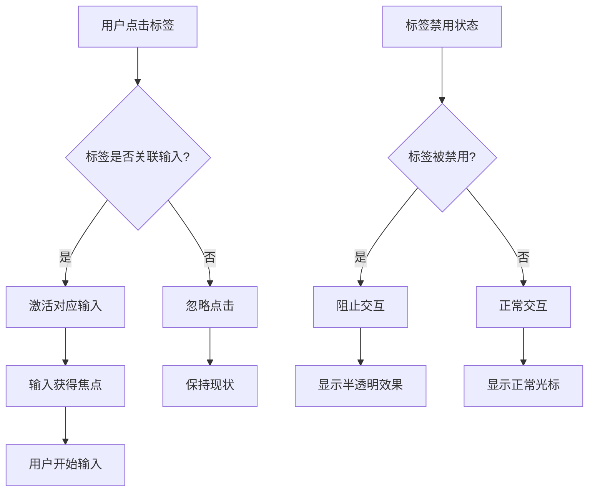
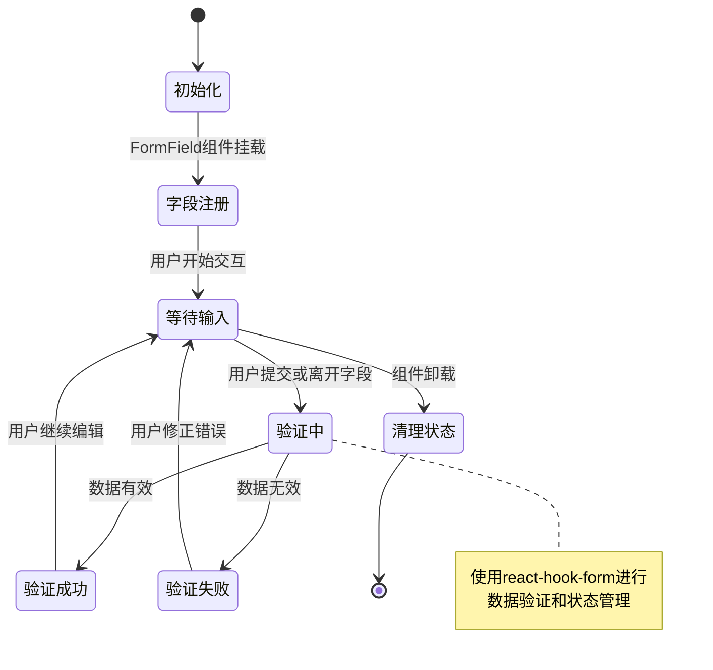
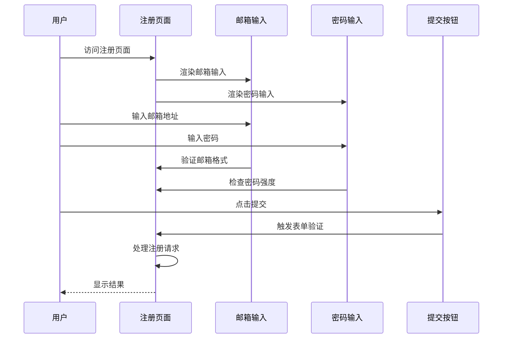

# 输入组件

<cite>
**本文档引用的文件**
- [input.tsx](file://frontend/components/ui/input.tsx)
- [label.tsx](file://frontend/components/ui/label.tsx)
- [form.tsx](file://frontend/components/ui/form.tsx)
- [globals.css](file://frontend/app/globals.css)
- [utils.ts](file://frontend/lib/utils.ts)
- [register/page.tsx](file://frontend/app/register/page.tsx)
- [login/page.tsx](file://frontend/app/login/page.tsx)
- [settings/page.tsx](file://frontend/app/settings/page.tsx)
- [button.tsx](file://frontend/components/ui/button.tsx)
- [card.tsx](file://frontend/components/ui/card.tsx)
- [package.json](file://frontend/package.json)
</cite>

## 目录
1. [简介](#简介)
2. [项目结构](#项目结构)
3. [核心组件](#核心组件)
4. [架构概览](#架构概览)
5. [详细组件分析](#详细组件分析)
6. [依赖关系分析](#依赖关系分析)
7. [性能考虑](#性能考虑)
8. [故障排除指南](#故障排除指南)
9. [结论](#结论)

## 简介

输入组件是现代Web应用中最重要的UI元素之一，负责收集用户数据并提供实时反馈。本项目中的输入组件系统基于React构建，集成了现代化的设计系统和无障碍访问标准，提供了完整的表单处理能力。

该输入组件系统包含三个核心组件：
- **Input组件**：基础输入控件，支持多种输入类型
- **Label组件**：标签关联机制，确保良好的用户体验
- **Form组件系统**：完整的表单管理框架，集成验证和状态管理

## 项目结构

前端项目采用模块化的组件架构，输入组件位于UI组件库中，与全局样式和工具函数紧密集成。



**图表来源**
- [input.tsx](file://frontend/components/ui/input.tsx#L1-L22)
- [label.tsx](file://frontend/components/ui/label.tsx#L1-L25)
- [form.tsx](file://frontend/components/ui/form.tsx#L1-L168)

**章节来源**
- [input.tsx](file://frontend/components/ui/input.tsx#L1-L22)
- [label.tsx](file://frontend/components/ui/label.tsx#L1-L25)
- [form.tsx](file://frontend/components/ui/form.tsx#L1-L168)

## 核心组件

### Input组件

Input组件是整个输入系统的核心，提供了基础的输入功能和丰富的样式定制选项。

#### 主要特性
- **多输入类型支持**：文本、密码、邮箱、数字等HTML5原生输入类型
- **响应式设计**：自适应不同屏幕尺寸和设备
- **无障碍访问**：完整的ARIA属性支持
- **状态管理**：自动处理禁用、错误、聚焦等状态
- **样式定制**：灵活的CSS类名组合系统

#### 关键属性
- `className`：自定义CSS类名
- `type`：HTML输入类型（text、email、password等）
- `data-slot`：用于样式系统的槽位标识
- `aria-invalid`：错误状态的无障碍属性

**章节来源**
- [input.tsx](file://frontend/components/ui/input.tsx#L5-L19)

### Label组件

Label组件实现了语义化的标签关联机制，确保用户可以通过点击标签激活对应的输入控件。

#### 设计特点
- **语义化HTML**：基于Radix UI的Label原语
- **标签关联**：通过for属性与输入控件建立关联
- **禁用状态**：自动处理禁用状态下的交互行为
- **样式系统**：集成到整体的设计系统中

**章节来源**
- [label.tsx](file://frontend/components/ui/label.tsx#L8-L22)

### Form组件系统

Form组件系统提供了完整的表单管理解决方案，集成了验证、状态管理和无障碍访问。

#### 组件层次结构


**图表来源**
- [form.tsx](file://frontend/components/ui/form.tsx#L19-L167)

**章节来源**
- [form.tsx](file://frontend/components/ui/form.tsx#L21-L167)

## 架构概览

输入组件系统采用分层架构设计，从基础组件到高级表单管理形成了完整的生态系统。



**图表来源**
- [globals.css](file://frontend/app/globals.css#L6-L47)
- [utils.ts](file://frontend/lib/utils.ts#L4-L6)
- [input.tsx](file://frontend/components/ui/input.tsx#L3-L3)
- [label.tsx](file://frontend/components/ui/label.tsx#L6-L6)
- [form.tsx](file://frontend/components/ui/form.tsx#L16-L16)

## 详细组件分析

### Input组件深度分析

#### 实现架构
Input组件采用了简洁而强大的设计模式，通过条件渲染和动态类名组合实现了高度可定制的输入控件。



**图表来源**
- [input.tsx](file://frontend/components/ui/input.tsx#L5-L19)

#### 样式系统集成
Input组件深度集成了Tailwind CSS和自定义设计令牌系统：

| 样式类别 | 属性 | 值 | 作用 |
|---------|------|-----|------|
| 颜色系统 | `text-foreground` | 设计令牌 | 文本颜色 |
| 颜色系统 | `placeholder:text-muted-foreground` | 设计令牌 | 占位符颜色 |
| 颜色系统 | `selection:bg-primary` | 设计令牌 | 选中文本背景 |
| 边框系统 | `border-input` | 设计令牌 | 输入边框颜色 |
| 尺寸系统 | `h-9` | 固定高度 | 标准高度 |
| 尺寸系统 | `px-3 py-1` | 内边距 | 标准内边距 |
| 状态系统 | `focus-visible:border-ring` | 动态 | 聚焦边框 |
| 状态系统 | `aria-invalid:border-destructive` | 动态 | 错误边框 |

**章节来源**
- [input.tsx](file://frontend/components/ui/input.tsx#L10-L15)

### Label组件分析

#### 标签关联机制
Label组件实现了语义化的标签关联，这是现代Web开发的重要无障碍访问特性。



**图表来源**
- [label.tsx](file://frontend/components/ui/label.tsx#L8-L22)

#### 无障碍访问特性
- **语义化结构**：使用语义化的HTML标签
- **键盘导航**：支持Tab键导航
- **屏幕阅读器**：完整的ARIA属性支持
- **视觉反馈**：清晰的状态指示

**章节来源**
- [label.tsx](file://frontend/components/ui/label.tsx#L12-L21)

### Form组件系统分析

#### 表单状态管理
Form组件系统提供了完整的表单状态管理，包括字段状态、验证状态和用户交互状态。



**图表来源**
- [form.tsx](file://frontend/components/ui/form.tsx#L45-L66)

#### 验证集成机制
Form组件系统与react-hook-form深度集成，提供了强大的验证能力：

| 验证类型 | 实现方式 | 特点 |
|---------|----------|------|
| 必填验证 | HTML5 required属性 | 原生浏览器支持 |
| 格式验证 | Zod模式验证 | 强类型验证 |
| 自定义验证 | 函数式验证器 | 灵活扩展 |
| 实时验证 | 变更时触发 | 即时反馈 |

**章节来源**
- [form.tsx](file://frontend/components/ui/form.tsx#L90-L123)

### 使用场景分析

#### 注册页面集成
在注册页面中，输入组件展示了完整的用户注册流程：



**图表来源**
- [register/page.tsx](file://frontend/app/register/page.tsx#L49-L69)

**章节来源**
- [register/page.tsx](file://frontend/app/register/page.tsx#L49-L69)

#### 设置页面集成
设置页面展示了密码输入的特殊处理：

| 输入类型 | 处理方式 | 安全考虑 |
|---------|----------|----------|
| 密码输入 | 类型设置为password | 隐藏输入内容 |
| API密钥 | 类型设置为password | 隐藏敏感信息 |
| 数字输入 | 类型设置为number | 限制数字输入 |
| 文本输入 | 类型默认为text | 自由文本输入 |

**章节来源**
- [settings/page.tsx](file://frontend/app/settings/page.tsx#L107-L114)

## 依赖关系分析

### 核心依赖关系

```mermaid
graph LR
subgraph "外部依赖"
A[react]
B[react-hook-form]
C[@radix-ui/react-label]
D[@radix-ui/react-slot]
E[tailwindcss]
F[clsx]
G[tailwind-merge]
end
subgraph "内部组件"
H[input.tsx]
I[label.tsx]
J[form.tsx]
K[utils.ts]
end
subgraph "样式系统"
L[globals.css]
end
A --> H
A --> I
A --> J
B --> J
C --> I
D --> J
E --> L
F --> K
G --> K
H --> K
I --> K
J --> K
L --> H
L --> I
L --> J
```

**图表来源**
- [package.json](file://frontend/package.json#L11-L29)
- [input.tsx](file://frontend/components/ui/input.tsx#L1-L3)
- [label.tsx](file://frontend/components/ui/label.tsx#L3-L4)
- [form.tsx](file://frontend/components/ui/form.tsx#L3-L14)

### 版本兼容性

| 依赖包 | 当前版本 | 最小版本 | 兼容性 |
|-------|---------|---------|--------|
| react | 19.2.3 | 18.0.0 | ✅ 完全兼容 |
| react-hook-form | 7.71.1 | 7.0.0 | ✅ 完全兼容 |
| @radix-ui/react-label | 2.1.8 | 2.0.0 | ✅ 完全兼容 |
| @radix-ui/react-slot | 1.2.4 | 1.0.0 | ✅ 完全兼容 |
| tailwindcss | 4.0.0 | 3.0.0 | ⚠️ 部分特性需要适配 |
| zod | 4.3.5 | 4.0.0 | ✅ 完全兼容 |

**章节来源**
- [package.json](file://frontend/package.json#L11-L29)

## 性能考虑

### 样式优化策略

1. **类名合并优化**
   - 使用`twMerge`避免重复样式类
   - 条件渲染减少不必要的样式计算
   - 动态类名缓存机制

2. **渲染性能**
   - React.memo包装避免不必要的重渲染
   - 条件渲染只在状态变化时更新
   - 合理的组件拆分减少渲染范围

3. **内存管理**
   - 事件处理器绑定优化
   - 参照引用避免对象创建
   - 清理定时器和订阅

### 加载性能

- **按需加载**：组件懒加载减少初始包大小
- **代码分割**：路由级别的代码分割
- **资源压缩**：生产环境自动压缩

## 故障排除指南

### 常见问题及解决方案

#### 输入验证问题
**问题**：输入验证不生效
**原因**：缺少适当的属性或事件处理
**解决方案**：
- 确保使用正确的输入类型
- 添加必要的验证属性
- 检查事件处理器绑定

#### 样式冲突问题
**问题**：自定义样式覆盖默认样式
**原因**：CSS优先级问题
**解决方案**：
- 使用`!important`谨慎处理
- 检查Tailwind配置
- 避免内联样式的过度使用

#### 无障碍访问问题
**问题**：屏幕阅读器无法正确读取
**原因**：缺少ARIA属性
**解决方案**：
- 添加适当的ARIA属性
- 确保语义化HTML结构
- 测试辅助技术兼容性

**章节来源**
- [input.tsx](file://frontend/components/ui/input.tsx#L10-L15)
- [label.tsx](file://frontend/components/ui/label.tsx#L12-L18)

### 调试技巧

1. **开发者工具检查**
   - 检查元素属性和类名
   - 查看计算样式
   - 监听事件触发

2. **控制台调试**
   - 输出组件状态
   - 检查props传递
   - 跟踪函数调用

3. **网络监控**
   - 检查API请求
   - 监控表单提交
   - 分析错误响应

## 结论

输入组件系统展现了现代React应用的最佳实践，通过精心设计的架构和完善的工具链，提供了强大而灵活的表单处理能力。

### 主要优势

1. **模块化设计**：清晰的组件边界和职责分离
2. **无障碍访问**：完整的无障碍支持和最佳实践
3. **样式系统**：统一的设计令牌和灵活的定制选项
4. **验证集成**：强大的表单验证和状态管理
5. **性能优化**：经过优化的渲染和内存管理

### 技术特色

- **TypeScript支持**：完整的类型安全保证
- **Tailwind集成**：现代化的CSS框架
- **Radix UI**：可靠的无障碍UI组件库
- **react-hook-form**：高性能的表单管理
- **Zod验证**：强类型的验证系统

这个输入组件系统为开发者提供了一个坚实的基础，可以在此基础上构建复杂的表单应用，同时保持代码的可维护性和可扩展性。