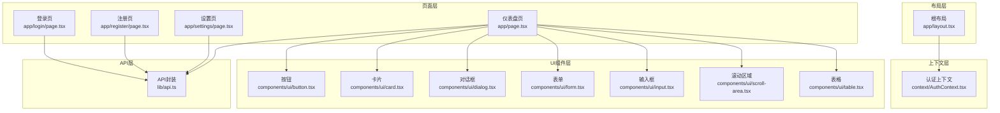
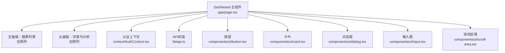
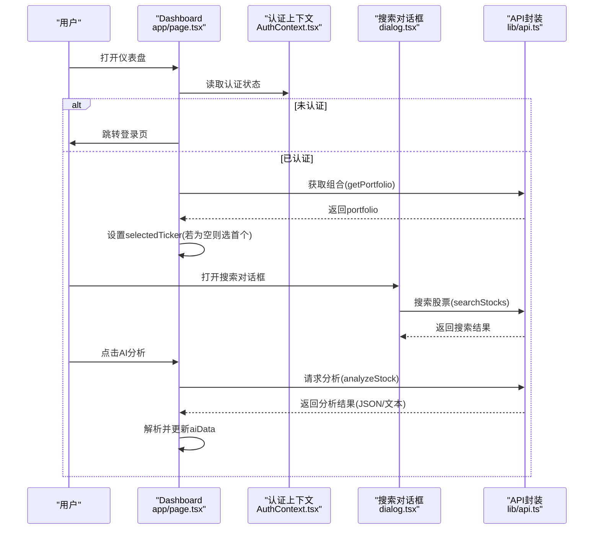
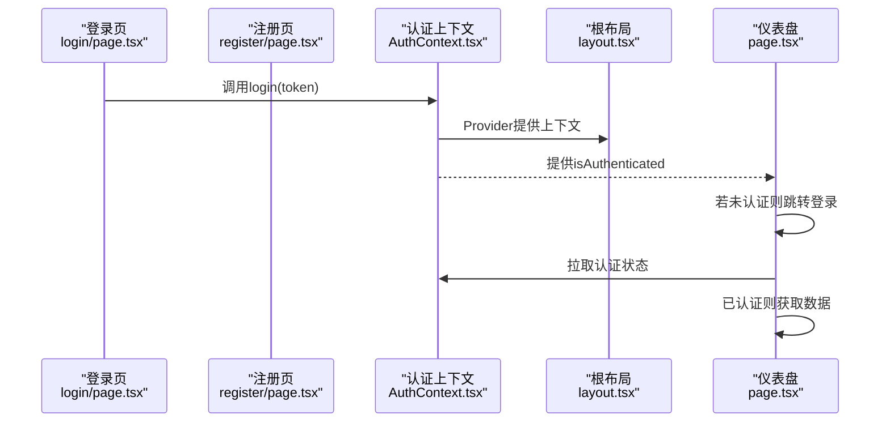
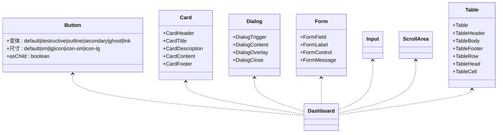
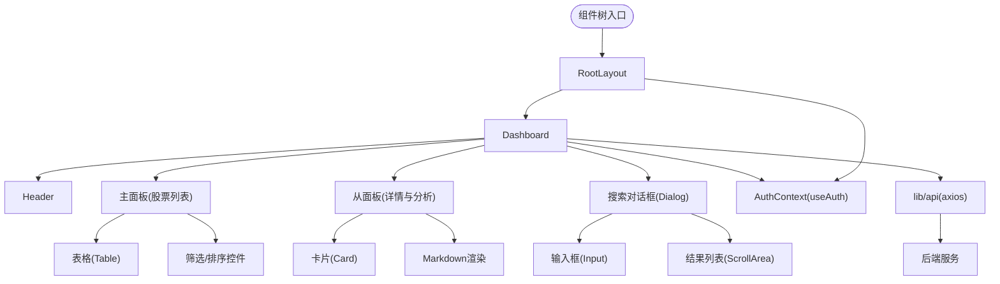
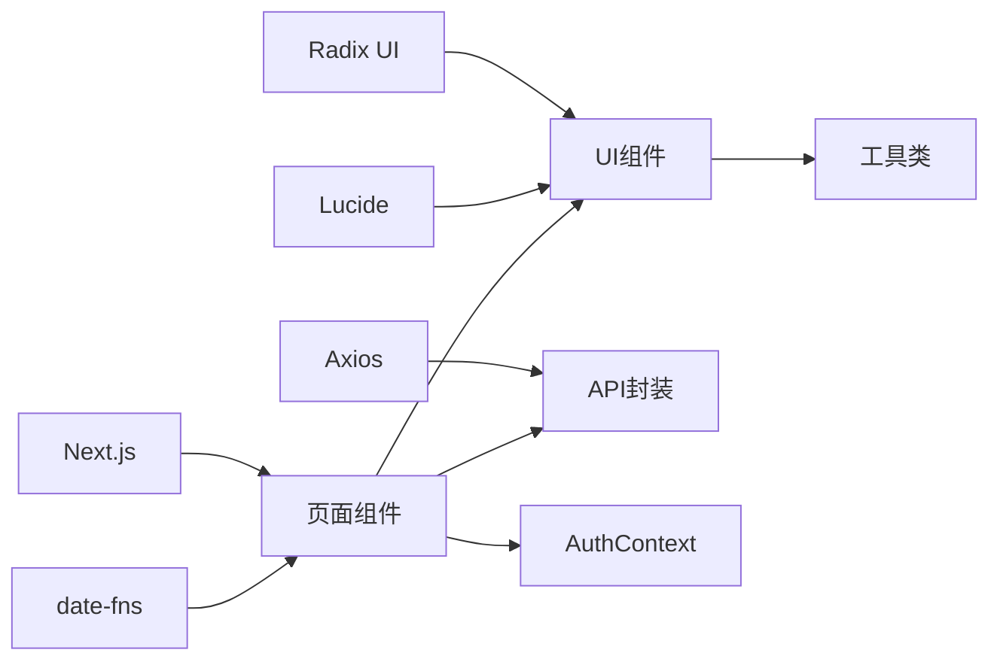

# 组件架构设计

<cite>
**本文引用的文件**
- [frontend/app/layout.tsx](file://frontend/app/layout.tsx)
- [frontend/app/page.tsx](file://frontend/app/page.tsx)
- [frontend/context/AuthContext.tsx](file://frontend/context/AuthContext.tsx)
- [frontend/lib/api.ts](file://frontend/lib/api.ts)
- [frontend/components/ui/button.tsx](file://frontend/components/ui/button.tsx)
- [frontend/components/ui/card.tsx](file://frontend/components/ui/card.tsx)
- [frontend/components/ui/dialog.tsx](file://frontend/components/ui/dialog.tsx)
- [frontend/components/ui/form.tsx](file://frontend/components/ui/form.tsx)
- [frontend/components/ui/input.tsx](file://frontend/components/ui/input.tsx)
- [frontend/components/ui/scroll-area.tsx](file://frontend/components/ui/scroll-area.tsx)
- [frontend/components/ui/table.tsx](file://frontend/components/ui/table.tsx)
- [frontend/app/login/page.tsx](file://frontend/app/login/page.tsx)
- [frontend/app/register/page.tsx](file://frontend/app/register/page.tsx)
- [frontend/app/settings/page.tsx](file://frontend/app/settings/page.tsx)
- [frontend/package.json](file://frontend/package.json)
</cite>

## 目录
1. [简介](#简介)
2. [项目结构](#项目结构)
3. [核心组件](#核心组件)
4. [架构总览](#架构总览)
5. [组件详细分析](#组件详细分析)
6. [依赖关系分析](#依赖关系分析)
7. [性能考量](#性能考量)
8. [故障排查指南](#故障排查指南)
9. [结论](#结论)
10. [附录](#附录)

## 简介
本技术文档聚焦于前端组件架构设计，系统阐述页面级组件、布局组件与UI组件的设计原则；深入解析Dashboard主组件的“主-从”布局模式、状态管理策略与组件间通信机制；总结职责分离、单一职责与可复用性的实现方法；梳理组件树构建方式（父子、兄弟、跨层级）；并提供性能优化、内存管理与渲染优化的最佳实践。

## 项目结构
前端采用Next.js应用结构，按功能域组织页面与通用UI组件：
- 页面层：登录、注册、设置、仪表盘等页面组件位于app目录下
- 布局层：根布局负责全局样式与上下文提供
- UI组件层：components/ui目录提供可复用的基础UI组件
- 上下文层：认证上下文提供全局认证状态
- API封装：lib/api集中封装后端接口调用

图表来源
- [frontend/app/layout.tsx](file://frontend/app/layout.tsx#L20-L38)
- [frontend/context/AuthContext.tsx](file://frontend/context/AuthContext.tsx#L15-L51)
- [frontend/app/page.tsx](file://frontend/app/page.tsx#L11-L28)
- [frontend/lib/api.ts](file://frontend/lib/api.ts#L74-L102)
- [frontend/components/ui/button.tsx](file://frontend/components/ui/button.tsx#L39-L60)
- [frontend/components/ui/card.tsx](file://frontend/components/ui/card.tsx#L5-L16)
- [frontend/components/ui/dialog.tsx](file://frontend/components/ui/dialog.tsx#L9-L81)
- [frontend/components/ui/form.tsx](file://frontend/components/ui/form.tsx#L19-L43)
- [frontend/components/ui/input.tsx](file://frontend/components/ui/input.tsx#L5-L18)
- [frontend/components/ui/scroll-area.tsx](file://frontend/components/ui/scroll-area.tsx#L8-L29)
- [frontend/components/ui/table.tsx](file://frontend/components/ui/table.tsx#L7-L20)

章节来源
- [frontend/app/layout.tsx](file://frontend/app/layout.tsx#L1-L39)
- [frontend/package.json](file://frontend/package.json#L1-L43)

## 核心组件
- 根布局RootLayout：注入全局样式与认证Provider，作为所有页面的容器
- 认证上下文AuthContext：提供token、登录、登出与认证状态，供页面与组件使用
- API封装lib/api：统一处理请求头、拦截器与接口定义
- Dashboard主组件：实现“主-从”布局、状态管理与组件间通信
- UI基础组件：Button、Card、Dialog、Form、Input、ScrollArea、Table等

章节来源
- [frontend/app/layout.tsx](file://frontend/app/layout.tsx#L20-L38)
- [frontend/context/AuthContext.tsx](file://frontend/context/AuthContext.tsx#L15-L59)
- [frontend/lib/api.ts](file://frontend/lib/api.ts#L10-L18)
- [frontend/app/page.tsx](file://frontend/app/page.tsx#L30-L686)
- [frontend/components/ui/button.tsx](file://frontend/components/ui/button.tsx#L39-L60)
- [frontend/components/ui/card.tsx](file://frontend/components/ui/card.tsx#L5-L16)
- [frontend/components/ui/dialog.tsx](file://frontend/components/ui/dialog.tsx#L9-L81)
- [frontend/components/ui/form.tsx](file://frontend/components/ui/form.tsx#L19-L43)
- [frontend/components/ui/input.tsx](file://frontend/components/ui/input.tsx#L5-L18)
- [frontend/components/ui/scroll-area.tsx](file://frontend/components/ui/scroll-area.tsx#L8-L29)
- [frontend/components/ui/table.tsx](file://frontend/components/ui/table.tsx#L7-L20)

## 架构总览
Dashboard采用“主-从”双栏布局：左侧为股票列表（主），右侧为选中股票的详情与AI分析（从）。通过状态驱动渲染，组件间通过props与上下文传递数据，API封装统一处理网络请求。

图表来源
- [frontend/app/page.tsx](file://frontend/app/page.tsx#L244-L685)
- [frontend/context/AuthContext.tsx](file://frontend/context/AuthContext.tsx#L15-L59)
- [frontend/lib/api.ts](file://frontend/lib/api.ts#L74-L102)
- [frontend/components/ui/button.tsx](file://frontend/components/ui/button.tsx#L39-L60)
- [frontend/components/ui/card.tsx](file://frontend/components/ui/card.tsx#L5-L16)
- [frontend/components/ui/dialog.tsx](file://frontend/components/ui/dialog.tsx#L9-L81)
- [frontend/components/ui/input.tsx](file://frontend/components/ui/input.tsx#L5-L18)
- [frontend/components/ui/scroll-area.tsx](file://frontend/components/ui/scroll-area.tsx#L8-L29)

## 组件详细分析

### Dashboard 主组件架构
- 布局模式：网格两列布局，左侧3/12，右侧9/12，形成主-从结构
- 状态管理：
  - 股票组合：portfolio
  - 选中标的：selectedTicker
  - 分析结果：aiData
  - 搜索：isSearchOpen、searchQuery、searchResults、searching
  - 编辑：editingTicker、editForm
  - 过滤与排序：onlyHoldings、sortBy、sortOrder
  - 市场状态：marketStatus
  - 加载与挂载：loading、mounted
- 组件间通信：
  - 通过useState与useEffect在组件内协调
  - 通过useAuth获取认证状态，控制路由跳转
  - 通过lib/api进行远程数据同步
  - 通过Dialog、Button、Input等UI组件实现用户交互
- 关键流程：
  - 首次挂载与认证状态变化时拉取数据
  - 切换标的时重置AI分析结果
  - 触发AI分析时解析返回的JSON或回退为纯文本
  - 添加/删除/编辑组合项后刷新列表与选中项

图表来源
- [frontend/app/page.tsx](file://frontend/app/page.tsx#L92-L198)
- [frontend/context/AuthContext.tsx](file://frontend/context/AuthContext.tsx#L53-L59)
- [frontend/components/ui/dialog.tsx](file://frontend/components/ui/dialog.tsx#L9-L81)
- [frontend/lib/api.ts](file://frontend/lib/api.ts#L74-L102)

章节来源
- [frontend/app/page.tsx](file://frontend/app/page.tsx#L30-L686)

### 认证上下文与页面导航
- AuthContext提供token、登录、登出与isAuthenticated
- RootLayout包裹AuthProvider，确保全局可用
- 登录/注册页通过API调用完成认证，成功后写入localStorage并跳转首页
- Dashboard根据isAuthenticated决定是否拉取数据与跳转登录

图表来源
- [frontend/app/login/page.tsx](file://frontend/app/login/page.tsx#L19-L42)
- [frontend/app/register/page.tsx](file://frontend/app/register/page.tsx#L19-L37)
- [frontend/context/AuthContext.tsx](file://frontend/context/AuthContext.tsx#L15-L59)
- [frontend/app/layout.tsx](file://frontend/app/layout.tsx#L20-L38)
- [frontend/app/page.tsx](file://frontend/app/page.tsx#L92-L163)

章节来源
- [frontend/context/AuthContext.tsx](file://frontend/context/AuthContext.tsx#L15-L59)
- [frontend/app/layout.tsx](file://frontend/app/layout.tsx#L20-L38)
- [frontend/app/login/page.tsx](file://frontend/app/login/page.tsx#L19-L42)
- [frontend/app/register/page.tsx](file://frontend/app/register/page.tsx#L19-L37)
- [frontend/app/page.tsx](file://frontend/app/page.tsx#L92-L163)

### UI组件体系与复用性
- Button：支持多种变体与尺寸，统一外观与交互
- Card：提供头部、标题、描述、内容、底部等语义化结构
- Dialog：基于Radix UI，支持触发、内容、关闭等子组件
- Form：基于react-hook-form，提供表单字段、标签、控制与错误展示
- Input：统一输入样式与焦点态
- ScrollArea：提供可定制滚动条
- Table：提供表格容器与行、单元格等结构

图表来源
- [frontend/components/ui/button.tsx](file://frontend/components/ui/button.tsx#L39-L60)
- [frontend/components/ui/card.tsx](file://frontend/components/ui/card.tsx#L5-L92)
- [frontend/components/ui/dialog.tsx](file://frontend/components/ui/dialog.tsx#L9-L143)
- [frontend/components/ui/form.tsx](file://frontend/components/ui/form.tsx#L19-L167)
- [frontend/components/ui/input.tsx](file://frontend/components/ui/input.tsx#L5-L21)
- [frontend/components/ui/scroll-area.tsx](file://frontend/components/ui/scroll-area.tsx#L8-L58)
- [frontend/components/ui/table.tsx](file://frontend/components/ui/table.tsx#L7-L116)

章节来源
- [frontend/components/ui/button.tsx](file://frontend/components/ui/button.tsx#L39-L60)
- [frontend/components/ui/card.tsx](file://frontend/components/ui/card.tsx#L5-L92)
- [frontend/components/ui/dialog.tsx](file://frontend/components/ui/dialog.tsx#L9-L143)
- [frontend/components/ui/form.tsx](file://frontend/components/ui/form.tsx#L19-L167)
- [frontend/components/ui/input.tsx](file://frontend/components/ui/input.tsx#L5-L21)
- [frontend/components/ui/scroll-area.tsx](file://frontend/components/ui/scroll-area.tsx#L8-L58)
- [frontend/components/ui/table.tsx](file://frontend/components/ui/table.tsx#L7-L116)

### 组件树构建与交互
- 父子关系：RootLayout -> Dashboard；Dashboard包含Header、主面板、从面板、搜索对话框等
- 兄弟组件：主面板与从面板同级，通过selectedTicker建立弱耦合关联
- 跨层级通信：通过AuthContext向下传递认证状态；通过lib/api向上游抽象网络层
- 事件流：用户操作（点击、输入、提交）通过回调函数驱动状态更新，进而触发重新渲染

图表来源
- [frontend/app/layout.tsx](file://frontend/app/layout.tsx#L20-L38)
- [frontend/app/page.tsx](file://frontend/app/page.tsx#L244-L685)
- [frontend/context/AuthContext.tsx](file://frontend/context/AuthContext.tsx#L53-L59)
- [frontend/lib/api.ts](file://frontend/lib/api.ts#L3-L18)

章节来源
- [frontend/app/layout.tsx](file://frontend/app/layout.tsx#L20-L38)
- [frontend/app/page.tsx](file://frontend/app/page.tsx#L244-L685)

## 依赖关系分析
- 外部依赖：Next.js、Radix UI、Axios、date-fns、Lucide等
- 内部依赖：页面组件依赖UI组件、上下文与API封装
- 耦合度：UI组件低耦合、API封装集中、上下文提供全局状态

图表来源
- [frontend/package.json](file://frontend/package.json#L11-L29)
- [frontend/app/page.tsx](file://frontend/app/page.tsx#L1-L29)
- [frontend/lib/api.ts](file://frontend/lib/api.ts#L1-L8)

章节来源
- [frontend/package.json](file://frontend/package.json#L11-L29)

## 性能考量
- 渲染优化
  - 使用useMemo对复杂计算进行缓存（如排序后的组合）
  - 条件渲染与骨架屏占位，减少首屏压力
  - 受控组件与防抖/节流（如搜索输入）降低频繁请求
- 内存管理
  - 合理清理定时器与副作用（如市场状态定时器）
  - 在组件卸载时清理订阅与轮询
- 网络优化
  - 统一拦截器处理鉴权头，避免重复逻辑
  - 合理的错误提示与降级策略（如AI分析失败回退）
- UI性能
  - 使用虚拟滚动或分页处理长列表
  - 将不随状态变化的静态内容抽离为常量
  - 控制不必要的重渲染，合理拆分组件

## 故障排查指南
- 认证问题
  - 检查localStorage中的token是否存在
  - 确认AuthContext的login/logout逻辑与路由跳转
- 网络请求
  - 核对API baseURL与Authorization头
  - 捕获429限流并引导用户前往设置页配置API Key
- UI交互
  - 对话框打开/关闭状态由父组件控制
  - 表单校验与错误信息通过Form组件体系输出
- 市场状态
  - 定时器每分钟更新一次，注意时区转换与周末/节假日逻辑

章节来源
- [frontend/context/AuthContext.tsx](file://frontend/context/AuthContext.tsx#L19-L37)
- [frontend/lib/api.ts](file://frontend/lib/api.ts#L10-L18)
- [frontend/app/page.tsx](file://frontend/app/page.tsx#L230-L237)
- [frontend/components/ui/dialog.tsx](file://frontend/components/ui/dialog.tsx#L9-L81)
- [frontend/components/ui/form.tsx](file://frontend/components/ui/form.tsx#L138-L156)

## 结论
该前端组件架构以“页面-布局-上下文-UI-数据”五层清晰分层，Dashboard采用“主-从”布局与集中式状态管理，结合可复用UI组件与统一API封装，实现了职责分离与高内聚低耦合。通过合理的性能与故障排查策略，可在保证用户体验的同时提升系统的稳定性与可维护性。

## 附录
- 最佳实践清单
  - 单一职责：每个组件专注单一功能，避免过度聚合
  - 可复用性：UI组件通过变体与尺寸参数化，减少重复实现
  - 状态下沉：将共享状态置于最近公共祖先或上下文中
  - 事件冒泡与受控组件：避免直接修改DOM，统一通过状态驱动
  - 错误边界与降级：在网络异常或AI分析失败时提供明确提示
  - 渲染优化：使用memo、条件渲染与懒加载减少重绘