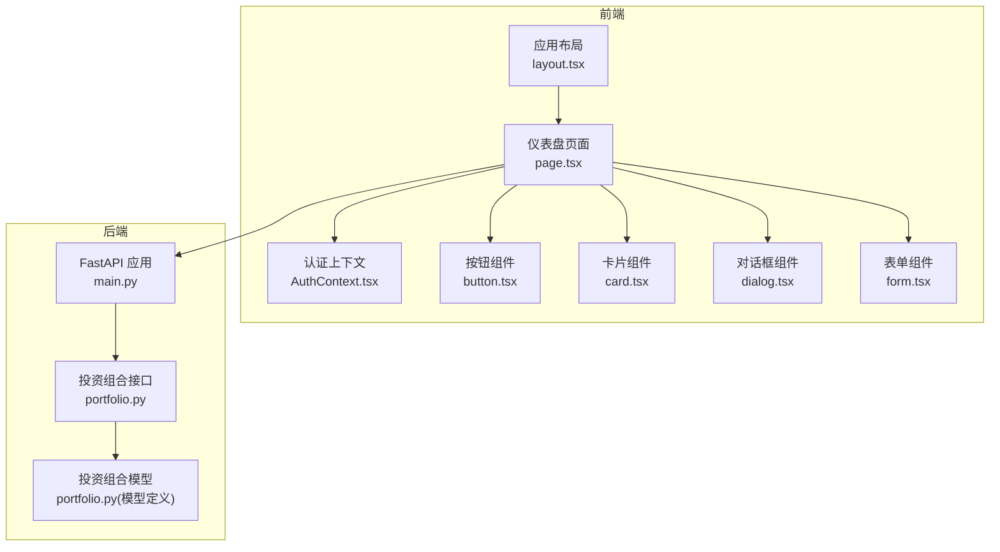
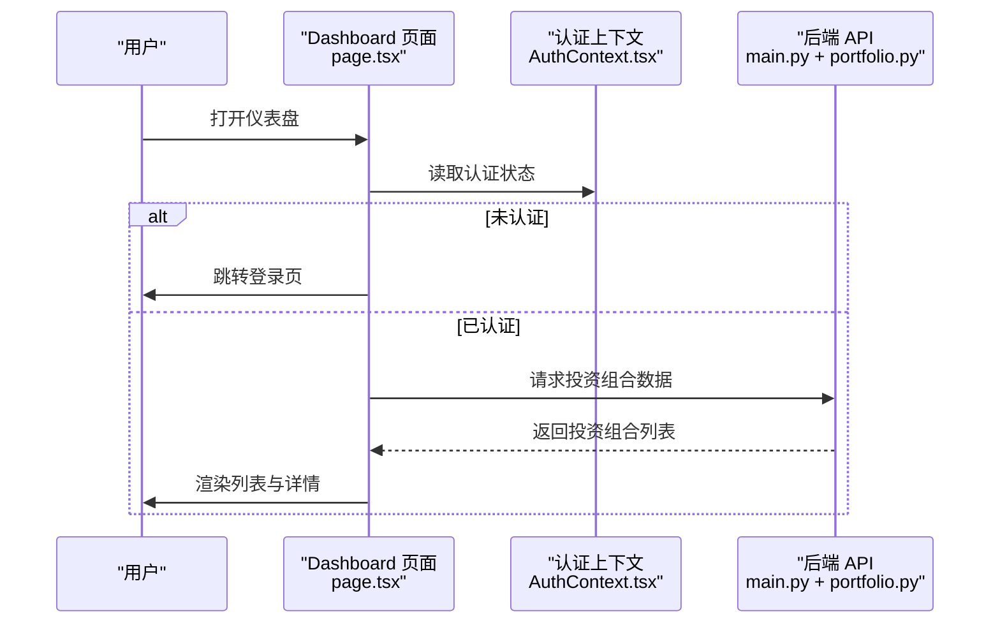
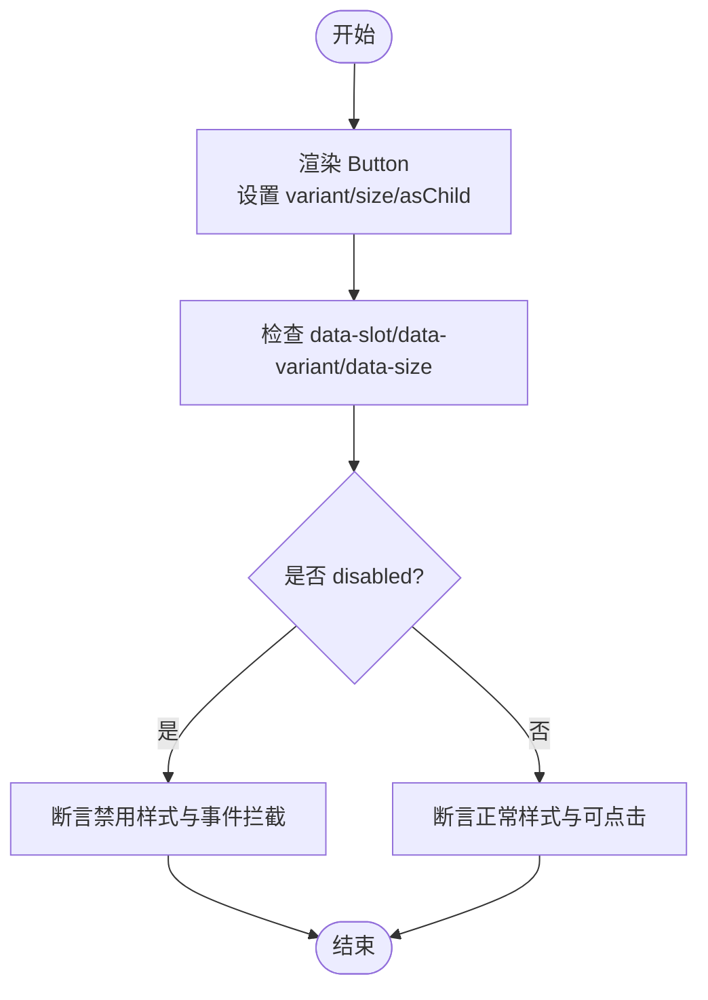
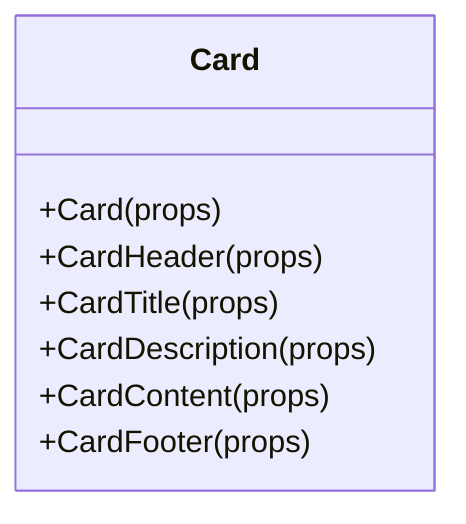
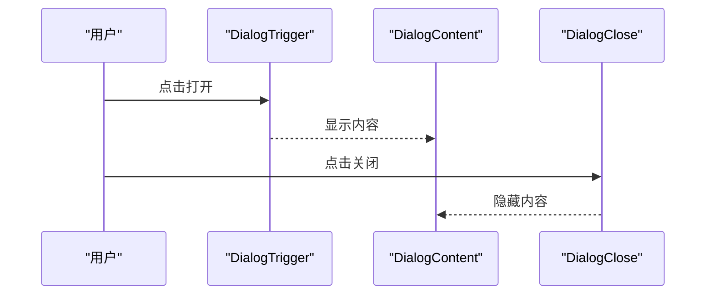
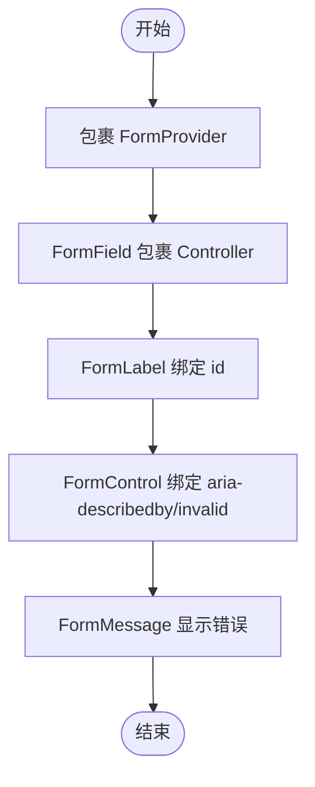
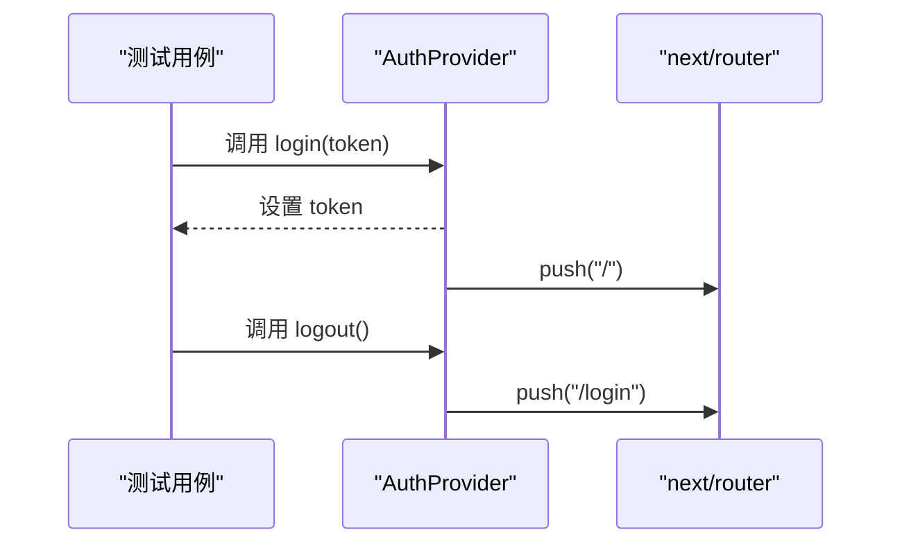
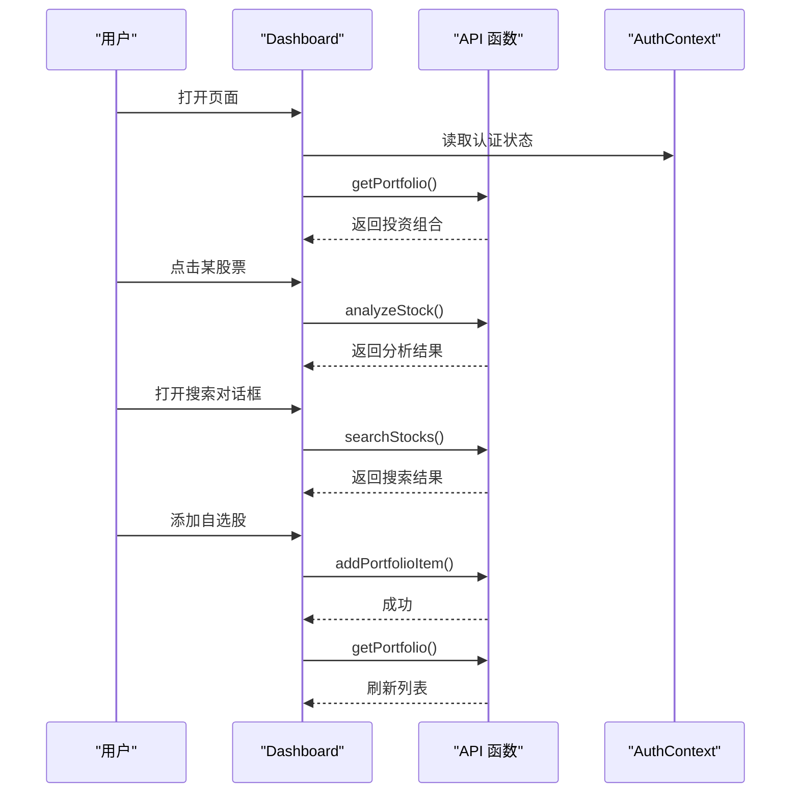
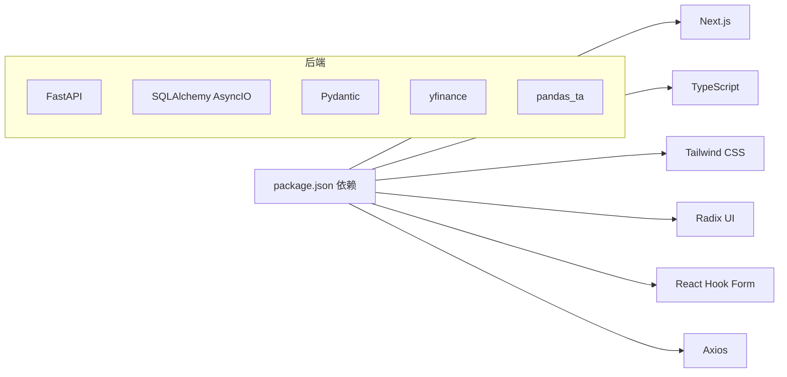

# 组件测试

<cite>
**本文引用的文件**
- [package.json](file://frontend/package.json)
- [tsconfig.json](file://frontend/tsconfig.json)
- [next.config.ts](file://frontend/next.config.ts)
- [button.tsx](file://frontend/components/ui/button.tsx)
- [card.tsx](file://frontend/components/ui/card.tsx)
- [dialog.tsx](file://frontend/components/ui/dialog.tsx)
- [form.tsx](file://frontend/components/ui/form.tsx)
- [AuthContext.tsx](file://frontend/context/AuthContext.tsx)
- [layout.tsx](file://frontend/app/layout.tsx)
- [page.tsx](file://frontend/app/page.tsx)
- [main.py](file://backend/app/main.py)
- [portfolio.py](file://backend/app/api/portfolio.py)
- [portfolio模型.py](file://backend/app/models/portfolio.py)
- [README.md](file://README.md)
- [tech_stack.md](file://doc/tech_stack.md)
</cite>

## 目录
1. [引言](#引言)
2. [项目结构](#项目结构)
3. [核心组件](#核心组件)
4. [架构总览](#架构总览)
5. [详细组件分析](#详细组件分析)
6. [依赖关系分析](#依赖关系分析)
7. [性能考量](#性能考量)
8. [故障排查指南](#故障排查指南)
9. [结论](#结论)
10. [附录](#附录)

## 引言
本指南面向组件测试，系统阐述单元测试、集成测试与端到端测试的差异与适用场景；给出测试工具选型（如 Jest、React Testing Library）与配置要点；总结组件测试最佳实践（测试用例设计、Mock 策略、断言技巧）；提供组件交互测试方法（用户操作模拟、事件触发、状态验证）；说明测试覆盖率评估与持续集成配置；解释测试数据准备与测试环境隔离策略。结合本项目前端 Next.js 应用与后端 FastAPI 接口的实际代码，给出可落地的测试策略。

## 项目结构
前端采用 Next.js App Router 目录结构，组件位于 components/ui 下，页面逻辑集中在 app 目录；后端使用 FastAPI 提供 REST API。整体呈现“前端组件 + 上下文 + 页面容器 + 后端接口”的分层架构。

图表来源
- [layout.tsx](file://frontend/app/layout.tsx#L20-L38)
- [page.tsx](file://frontend/app/page.tsx#L30-L686)
- [AuthContext.tsx](file://frontend/context/AuthContext.tsx#L15-L51)
- [button.tsx](file://frontend/components/ui/button.tsx#L39-L60)
- [card.tsx](file://frontend/components/ui/card.tsx#L5-L92)
- [dialog.tsx](file://frontend/components/ui/dialog.tsx#L9-L81)
- [form.tsx](file://frontend/components/ui/form.tsx#L19-L167)
- [main.py](file://backend/app/main.py#L20-L87)
- [portfolio.py](file://backend/app/api/portfolio.py#L13-L297)
- [portfolio模型.py](file://backend/app/models/portfolio.py#L7-L26)

章节来源
- [README.md](file://README.md#L45-L50)
- [tech_stack.md](file://doc/tech_stack.md#L11-L30)

## 核心组件
- 按钮 Button：支持变体与尺寸的变体函数、Slot 渲染、数据属性标注，适合用于交互按钮与图标按钮。
- 卡片 Card：包含头部、标题、描述、内容、底部与操作区域，便于构建信息面板。
- 对话框 Dialog：基于 Radix UI，提供触发器、内容、覆盖层、关闭按钮等，支持 Portal 渲染。
- 表单 Form：基于 React Hook Form 的表单上下文与字段封装，提供标签、控制、描述与错误消息。
- 认证上下文 AuthContext：提供登录、登出、token 状态管理与路由跳转，是页面鉴权与导航的基础。

章节来源
- [button.tsx](file://frontend/components/ui/button.tsx#L7-L37)
- [card.tsx](file://frontend/components/ui/card.tsx#L5-L92)
- [dialog.tsx](file://frontend/components/ui/dialog.tsx#L9-L81)
- [form.tsx](file://frontend/components/ui/form.tsx#L19-L167)
- [AuthContext.tsx](file://frontend/context/AuthContext.tsx#L15-L51)

## 架构总览
前端页面通过 React 组件与上下文协作，调用后端 API 获取数据并渲染。页面中包含搜索、对话框、编辑、排序、市场状态等复杂交互，需要分别进行单元与集成测试以保证稳定性。

图表来源
- [page.tsx](file://frontend/app/page.tsx#L92-L163)
- [AuthContext.tsx](file://frontend/context/AuthContext.tsx#L15-L51)
- [main.py](file://backend/app/main.py#L75-L78)
- [portfolio.py](file://backend/app/api/portfolio.py#L143-L224)

## 详细组件分析

### 按钮组件 Button 测试策略
- 单元测试目标
  - 变体与尺寸渲染正确性
  - Slot 渲染与原生 button 属性透传
  - 数据属性 data-slot、data-variant、data-size 的存在与值
  - 禁用态样式与事件拦截
- Mock 策略
  - 使用 React Testing Library 渲染组件，不需额外 Mock
  - 如需测试点击事件，使用 userEvent 或 fireEvent 触发
- 断言技巧
  - 使用 getByRole/findByTestId 定位元素
  - 断言类名包含预期变体与尺寸
  - 断言 data-* 属性值
- 复杂度与性能
  - 渲染逻辑简单，测试成本低，覆盖率高

图表来源
- [button.tsx](file://frontend/components/ui/button.tsx#L39-L60)

章节来源
- [button.tsx](file://frontend/components/ui/button.tsx#L7-L37)

### 卡片组件 Card 测试策略
- 单元测试目标
  - CardHeader、CardTitle、CardDescription、CardContent、CardFooter 的渲染与布局
  - data-slot 标注与组合使用
- Mock 策略
  - 直接渲染子组件，无需外部依赖
- 断言技巧
  - 通过 data-slot 验证结构
  - 断言文本内容与容器类名

图表来源
- [card.tsx](file://frontend/components/ui/card.tsx#L5-L92)

章节来源
- [card.tsx](file://frontend/components/ui/card.tsx#L5-L92)

### 对话框组件 Dialog 测试策略
- 单元测试目标
  - 触发器、内容、覆盖层、关闭按钮的渲染与交互
  - Portal 渲染与键盘事件处理
  - showCloseButton 控制关闭按钮显示
- Mock 策略
  - 使用 @testing-library/react 的 render，确保 Portal DOM 存在
- 断言技巧
  - 打开状态下断言内容可见
  - 关闭按钮点击后状态变化

图表来源
- [dialog.tsx](file://frontend/components/ui/dialog.tsx#L9-L81)

章节来源
- [dialog.tsx](file://frontend/components/ui/dialog.tsx#L9-L81)

### 表单组件 Form 测试策略
- 单元测试目标
  - Form、FormField、FormItem 的上下文传递
  - FormLabel、FormControl、FormMessage 的关联与错误展示
- Mock 策略
  - 使用 ReactHookForm 的默认 Provider 包裹测试
- 断言技巧
  - 通过 useFormField 获取字段状态
  - 断言 aria-invalid 与错误消息可见性

图表来源
- [form.tsx](file://frontend/components/ui/form.tsx#L19-L167)

章节来源
- [form.tsx](file://frontend/components/ui/form.tsx#L19-L167)

### 认证上下文 AuthContext 测试策略
- 单元测试目标
  - 登录时写入 localStorage 并跳转首页
  - 登出时移除 token 并跳转登录页
  - 初始加载从 localStorage 读取 token
- Mock 策略
  - Mock useRouter 的 push 方法
  - Mock localStorage 行为
- 断言技巧
  - 断言 localStorage.setItem/removeItem 调用
  - 断言 router.push 调用次数与参数

图表来源
- [AuthContext.tsx](file://frontend/context/AuthContext.tsx#L15-L51)

章节来源
- [AuthContext.tsx](file://frontend/context/AuthContext.tsx#L15-L51)

### 页面组件 Dashboard 交互测试策略
- 集成测试目标
  - 投资组合列表渲染与排序
  - 选择股票后详情区渲染
  - 搜索对话框打开与远程搜索
  - 添加/删除自选股
  - 市场状态定时器与 UI 更新
- Mock 策略
  - Mock 页面中使用的 API 函数（getPortfolio、searchStocks、addPortfolioItem、deletePortfolioItem）
  - Mock useAuth 返回值与 router
- 断言技巧
  - 断言列表项数量与排序结果
  - 断言详情区文本与 Markdown 渲染
  - 断言对话框打开/关闭状态
  - 断言本地存储与路由行为

图表来源
- [page.tsx](file://frontend/app/page.tsx#L92-L240)
- [AuthContext.tsx](file://frontend/context/AuthContext.tsx#L15-L51)

章节来源
- [page.tsx](file://frontend/app/page.tsx#L92-L240)

## 依赖关系分析
- 前端依赖
  - Next.js 16、TypeScript、Tailwind CSS、Radix UI、Lucide React、React Hook Form、Axios
- 组件间耦合
  - 页面依赖上下文与 UI 组件
  - UI 组件之间低耦合，职责清晰
- 后端依赖
  - FastAPI、SQLAlchemy AsyncIO、Pydantic、yfinance、pandas_ta

图表来源
- [package.json](file://frontend/package.json#L11-L30)
- [tech_stack.md](file://doc/tech_stack.md#L11-L50)

章节来源
- [package.json](file://frontend/package.json#L11-L30)
- [tech_stack.md](file://doc/tech_stack.md#L11-L50)

## 性能考量
- 测试执行性能
  - 尽量减少真实网络请求，优先使用 Mock
  - 对异步逻辑使用 fake timers 或 Promise 解析顺序控制
- 组件渲染性能
  - 对复杂列表使用虚拟滚动或分页
  - 对频繁更新的状态使用 useMemo/useCallback
- API 调用优化
  - 合理缓存与去抖（debounce）搜索请求
  - 后台任务避免阻塞主线程

## 故障排查指南
- 常见问题
  - 对话框无法关闭：检查 Portal 是否挂载、关闭按钮事件绑定
  - 表单错误不显示：检查 useFormField 的上下文与 aria-invalid
  - 认证状态异常：检查 localStorage 读写与 router.push 调用
  - 页面未渲染：检查 useAuth 返回值与路由重定向逻辑
- 排查步骤
  - 使用 React DevTools 检查组件树与 props
  - 在测试中打印中间状态与调用栈
  - 分模块隔离测试，逐步定位问题范围

章节来源
- [dialog.tsx](file://frontend/components/ui/dialog.tsx#L9-L81)
- [form.tsx](file://frontend/components/ui/form.tsx#L19-L167)
- [AuthContext.tsx](file://frontend/context/AuthContext.tsx#L15-L51)
- [page.tsx](file://frontend/app/page.tsx#L92-L163)

## 结论
组件测试应遵循“先单元、再集成、最后端到端”的金字塔策略。针对本项目，建议优先完善 UI 组件与上下文的单元测试，再围绕页面交互进行集成测试，最后补充端到端测试覆盖关键业务流程。通过合理的 Mock 与断言策略，结合覆盖率与 CI 配置，可显著提升代码质量与交付效率。

## 附录

### 测试工具选型与配置要点
- 单元测试与 DOM 测试
  - Jest：默认测试运行器
  - React Testing Library：推荐用于组件测试
  - 配置要点：ts-jest、@testing-library/jest-native（如需）、setupFilesAfterEnv
- 类型安全
  - TypeScript 严格模式，确保类型推导准确
- 构建与脚本
  - 使用 Next.js 默认配置，按需扩展 next.config.ts
- 覆盖率与 CI
  - 使用 Jest 覆盖率报告，结合 GitHub Actions 或其他 CI 平台
  - 建议对关键路径（UI 组件、上下文、页面交互）设置阈值

章节来源
- [tsconfig.json](file://frontend/tsconfig.json#L11-L18)
- [next.config.ts](file://frontend/next.config.ts#L3-L5)
- [package.json](file://frontend/package.json#L5-L10)

### 测试数据准备与环境隔离
- 测试数据
  - 使用固定示例数据，避免依赖真实数据库
  - 对 API Mock 返回稳定结构，便于断言
- 环境隔离
  - 使用独立的测试数据库或内存数据库
  - 通过环境变量切换开发/测试/生产配置
- 前端隔离
  - 使用 jest-environment-jsdom
  - 对全局对象（如 localStorage、router）进行 Mock

章节来源
- [AuthContext.tsx](file://frontend/context/AuthContext.tsx#L15-L51)
- [page.tsx](file://frontend/app/page.tsx#L92-L163)