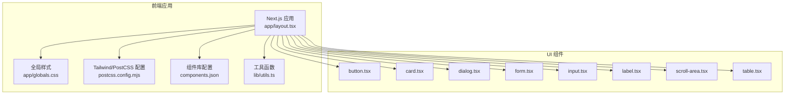
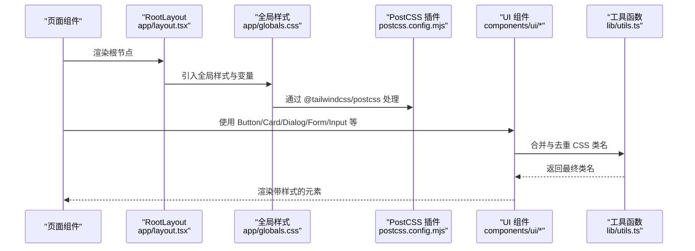
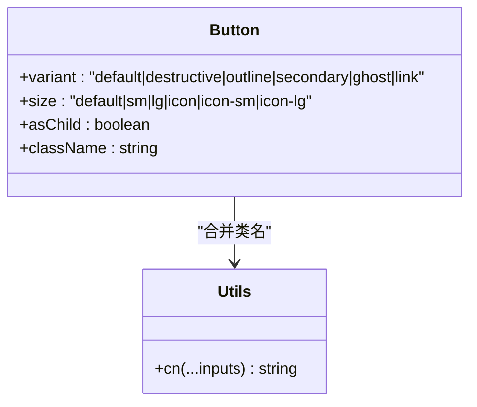
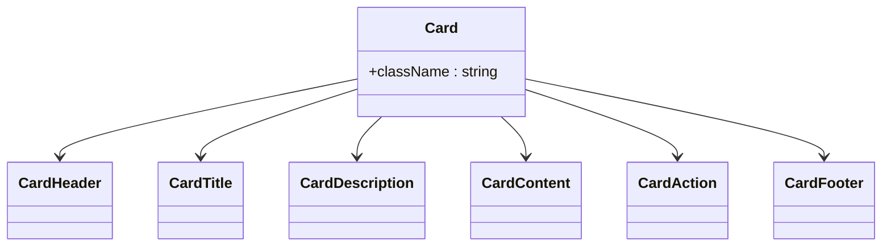
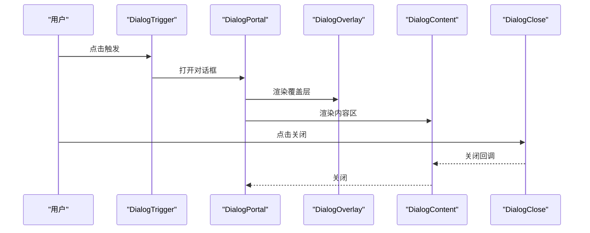
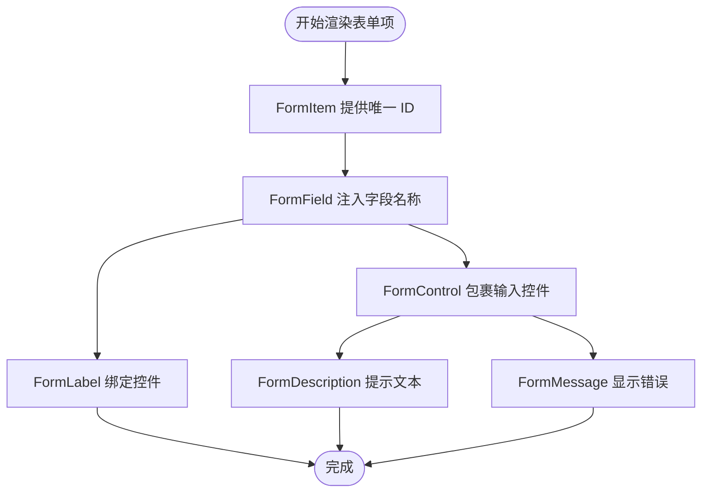
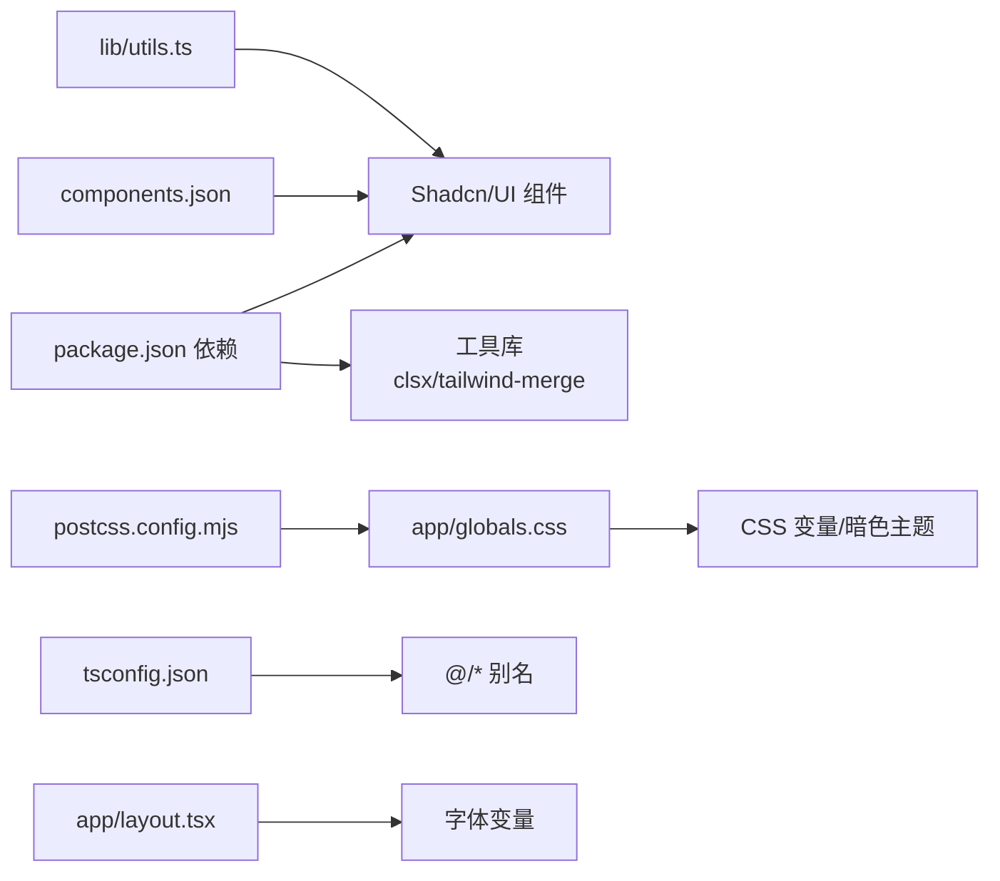

# UI组件库使用

<cite>
**本文引用的文件**
- [package.json](file://frontend/package.json)
- [components.json](file://frontend/components.json)
- [globals.css](file://frontend/app/globals.css)
- [postcss.config.mjs](file://frontend/postcss.config.mjs)
- [tsconfig.json](file://frontend/tsconfig.json)
- [button.tsx](file://frontend/components/ui/button.tsx)
- [card.tsx](file://frontend/components/ui/card.tsx)
- [dialog.tsx](file://frontend/components/ui/dialog.tsx)
- [form.tsx](file://frontend/components/ui/form.tsx)
- [input.tsx](file://frontend/components/ui/input.tsx)
- [label.tsx](file://frontend/components/ui/label.tsx)
- [scroll-area.tsx](file://frontend/components/ui/scroll-area.tsx)
- [table.tsx](file://frontend/components/ui/table.tsx)
- [layout.tsx](file://frontend/app/layout.tsx)
- [utils.ts](file://frontend/lib/utils.ts)
</cite>

## 目录
1. [简介](#简介)
2. [项目结构](#项目结构)
3. [核心组件](#核心组件)
4. [架构总览](#架构总览)
5. [组件详解与使用指南](#组件详解与使用指南)
6. [依赖关系分析](#依赖关系分析)
7. [性能与可维护性建议](#性能与可维护性建议)
8. [故障排查指南](#故障排查指南)
9. [结论](#结论)
10. [附录：安装与配置步骤](#附录安装与配置步骤)

## 简介
本指南面向在 Next.js 前端中使用 Shadcn/UI 组件库的开发者，系统讲解安装配置、定制方法、核心组件功能与属性、样式与 Tailwind 集成规范、组件组合与布局技巧、响应式与移动端适配、主题与品牌化、以及无障碍访问（a11y）最佳实践。文中所有技术细节均基于仓库中的实际实现文件进行归纳总结。

## 项目结构
前端采用 Next.js 应用，UI 组件集中于 components/ui 目录，通过 Shadcn/UI 的官方配置文件 components.json 进行统一管理；样式由 app/globals.css 引入 Tailwind 并定义 CSS 变量与暗色主题；PostCSS 使用 @tailwindcss/postcss 插件；TypeScript 路径别名与编译配置位于 tsconfig.json。

图表来源
- [layout.tsx](file://frontend/app/layout.tsx#L1-L39)
- [globals.css](file://frontend/app/globals.css#L1-L141)
- [postcss.config.mjs](file://frontend/postcss.config.mjs#L1-L8)
- [components.json](file://frontend/components.json#L1-L23)
- [utils.ts](file://frontend/lib/utils.ts#L1-L7)
- [button.tsx](file://frontend/components/ui/button.tsx#L1-L63)
- [card.tsx](file://frontend/components/ui/card.tsx#L1-L93)
- [dialog.tsx](file://frontend/components/ui/dialog.tsx#L1-L144)
- [form.tsx](file://frontend/components/ui/form.tsx#L1-L168)
- [input.tsx](file://frontend/components/ui/input.tsx#L1-L22)
- [label.tsx](file://frontend/components/ui/label.tsx#L1-L25)
- [scroll-area.tsx](file://frontend/components/ui/scroll-area.tsx#L1-L59)
- [table.tsx](file://frontend/components/ui/table.tsx#L1-L117)

章节来源
- [layout.tsx](file://frontend/app/layout.tsx#L1-L39)
- [globals.css](file://frontend/app/globals.css#L1-L141)
- [postcss.config.mjs](file://frontend/postcss.config.mjs#L1-L8)
- [components.json](file://frontend/components.json#L1-L23)
- [tsconfig.json](file://frontend/tsconfig.json#L1-L43)

## 核心组件
本项目已内置以下核心 UI 组件，均通过 Shadcn/UI 官方风格与变体系统实现，并结合 Radix UI、Lucide 图标与 Tailwind CSS 变量体系：

- 按钮 Button：支持多种变体与尺寸，具备焦点态与禁用态样式，支持作为容器渲染。
- 卡片 Card：包含头部、标题、描述、内容、操作与底部区域，网格布局与响应式断点。
- 对话框 Dialog：基于 Radix UI，支持覆盖层、内容区、标题、描述与关闭按钮。
- 表单 Form：与 react-hook-form 集成，提供字段上下文、标签、控制、描述与错误信息。
- 输入 Input：基础输入框，聚焦态与无效态样式，支持选择态高亮。
- 标签 Label：与表单控件关联，支持禁用态与错误态视觉反馈。
- 滚动区域 ScrollArea：自定义滚动条，支持水平/垂直方向。
- 表格 Table：容器+表格+表头/体/脚+行/单元格/标题/说明，支持悬停与选中态。

章节来源
- [button.tsx](file://frontend/components/ui/button.tsx#L1-L63)
- [card.tsx](file://frontend/components/ui/card.tsx#L1-L93)
- [dialog.tsx](file://frontend/components/ui/dialog.tsx#L1-L144)
- [form.tsx](file://frontend/components/ui/form.tsx#L1-L168)
- [input.tsx](file://frontend/components/ui/input.tsx#L1-L22)
- [label.tsx](file://frontend/components/ui/label.tsx#L1-L25)
- [scroll-area.tsx](file://frontend/components/ui/scroll-area.tsx#L1-L59)
- [table.tsx](file://frontend/components/ui/table.tsx#L1-L117)

## 架构总览
下图展示从页面到组件再到样式系统的调用链路与数据流。

图表来源
- [layout.tsx](file://frontend/app/layout.tsx#L1-L39)
- [globals.css](file://frontend/app/globals.css#L1-L141)
- [postcss.config.mjs](file://frontend/postcss.config.mjs#L1-L8)
- [utils.ts](file://frontend/lib/utils.ts#L1-L7)
- [button.tsx](file://frontend/components/ui/button.tsx#L1-L63)
- [card.tsx](file://frontend/components/ui/card.tsx#L1-L93)
- [dialog.tsx](file://frontend/components/ui/dialog.tsx#L1-L144)
- [form.tsx](file://frontend/components/ui/form.tsx#L1-L168)
- [input.tsx](file://frontend/components/ui/input.tsx#L1-L22)

## 组件详解与使用指南

### Button（按钮）
- 功能特性
  - 支持多种变体（默认、破坏性、描边、次级、幽灵、链接）与尺寸（默认、小、大、图标、图标-小、图标-大）。
  - 焦点态与环形光晕、禁用态透明度与事件拦截、SVG 内联尺寸自动适配。
  - 支持 asChild 将自身渲染为子节点容器，便于语义化与可访问性。
- 属性与行为
  - 关键属性：variant、size、asChild、className。
  - 数据槽：data-slot="button"、data-variant、data-size。
  - 错误态：通过 aria-invalid 与 destructiv e相关样式联动。
- 使用场景
  - 主要操作（提交、确认）、次要操作（取消、返回）、危险操作（删除、清空）。
  - 图标按钮用于工具栏、折叠面板触发器等。
- 样式定制
  - 通过变体与尺寸参数快速切换外观。
  - 自定义 className 时，优先使用工具函数合并类名以避免冲突。

图表来源
- [button.tsx](file://frontend/components/ui/button.tsx#L1-L63)
- [utils.ts](file://frontend/lib/utils.ts#L1-L7)

章节来源
- [button.tsx](file://frontend/components/ui/button.tsx#L1-L63)
- [utils.ts](file://frontend/lib/utils.ts#L1-L7)

### Card（卡片）
- 功能特性
  - 卡片容器、头部、标题、描述、内容、操作、底部区域。
  - 头部网格布局，支持右侧操作区与标题/描述两行自适应。
  - 边框、阴影、圆角、内间距统一由 Tailwind 变量驱动。
- 属性与行为
  - 关键子组件：CardHeader、CardTitle、CardDescription、CardContent、CardAction、CardFooter。
  - 数据槽：各子组件均设置 data-slot。
- 使用场景
  - 信息展示卡片、设置项卡片、分析结果面板。
- 样式定制
  - 通过 className 扩展布局或间距；颜色与背景由 CSS 变量控制。

图表来源
- [card.tsx](file://frontend/components/ui/card.tsx#L1-L93)

章节来源
- [card.tsx](file://frontend/components/ui/card.tsx#L1-L93)

### Dialog（对话框）
- 功能特性
  - 基于 Radix UI 的可访问性对话框，支持门户渲染、覆盖层动画、居中内容区。
  - 可选关闭按钮，支持键盘交互与焦点管理。
- 属性与行为
  - 关键子组件：DialogOverlay、DialogContent、DialogTitle、DialogDescription、DialogFooter、DialogHeader、DialogTrigger、DialogClose、DialogPortal。
  - 数据槽：各子组件均设置 data-slot。
  - 动画：开合状态通过 data-state 控制，配合淡入/淡出与缩放动画。
- 使用场景
  - 确认弹窗、模态设置、详情查看、引导提示。
- 样式定制
  - 通过 className 调整尺寸、圆角、阴影；关闭按钮可按需隐藏。

图表来源
- [dialog.tsx](file://frontend/components/ui/dialog.tsx#L1-L144)

章节来源
- [dialog.tsx](file://frontend/components/ui/dialog.tsx#L1-L144)

### Form（表单）
- 功能特性
  - 与 react-hook-form 深度集成，提供字段上下文、标签、控制、描述与错误信息。
  - 自动管理 aria-* 属性，提升可访问性。
- 属性与行为
  - 关键组件：Form、FormField、FormItem、FormLabel、FormControl、FormDescription、FormMessage。
  - 上下文：FormFieldContext、FormItemContext。
  - 可访问性：自动生成 id、aria-describedby、aria-invalid。
- 使用场景
  - 登录/注册、设置更新、数据录入、批量编辑。
- 样式定制
  - 通过 className 控制布局与间距；错误态由数据槽与颜色变量驱动。

图表来源
- [form.tsx](file://frontend/components/ui/form.tsx#L1-L168)

章节来源
- [form.tsx](file://frontend/components/ui/form.tsx#L1-L168)

### Input（输入框）
- 功能特性
  - 基础输入框，支持类型、占位符、选择态高亮。
  - 焦点态环形光晕、禁用态、无效态样式。
- 属性与行为
  - 关键属性：type、className。
  - 数据槽：data-slot="input"。
- 使用场景
  - 文本输入、搜索、密码、数字输入等。
- 样式定制
  - 通过 className 扩展尺寸与对齐；颜色与边框由 CSS 变量控制。

章节来源
- [input.tsx](file://frontend/components/ui/input.tsx#L1-L22)

### Label（标签）
- 功能特性
  - 与表单控件关联，支持禁用态与错误态视觉反馈。
- 属性与行为
  - 关键属性：className。
  - 数据槽：data-slot="label"。
- 使用场景
  - 表单字段标题、分组标题、说明文字。
- 样式定制
  - 通过 className 控制字体大小与对齐。

章节来源
- [label.tsx](file://frontend/components/ui/label.tsx#L1-L25)

### ScrollArea（滚动区域）
- 功能特性
  - 自定义滚动条，支持水平/垂直滚动。
  - 焦点态环形光晕与轮廓。
- 属性与行为
  - 关键组件：ScrollArea、ScrollBar。
  - 数据槽：根容器与滚动条/拇指均设置 data-slot。
- 使用场景
  - 下拉列表、侧边栏、长内容面板。
- 样式定制
  - 通过 className 调整滚动条宽度与颜色。

章节来源
- [scroll-area.tsx](file://frontend/components/ui/scroll-area.tsx#L1-L59)

### Table（表格）
- 功能特性
  - 容器+表格+表头/体/脚+行/单元格/标题/说明，支持悬停与选中态。
  - 横向溢出滚动容器。
- 属性与行为
  - 关键组件：Table、TableHeader、TableBody、TableFooter、TableRow、TableHead、TableCell、TableCaption。
  - 数据槽：各子组件均设置 data-slot。
- 使用场景
  - 列表展示、数据报表、交易记录、持仓明细。
- 样式定制
  - 通过 className 控制对齐、间距与边框。

章节来源
- [table.tsx](file://frontend/components/ui/table.tsx#L1-L117)

## 依赖关系分析
- 组件库与工具
  - Shadcn/UI 配置：components.json 指定风格、TSX、Tailwind 配置、别名与图标库。
  - 工具函数：lib/utils.ts 使用 clsx 与 tailwind-merge 合并类名，确保样式不冲突。
- 样式与主题
  - app/globals.css 引入 Tailwind 与动画插件，定义 CSS 变量与深色主题映射，提供暗色变体。
  - PostCSS 配置：postcss.config.mjs 加载 @tailwindcss/postcss 插件。
- 字体与全局
  - app/layout.tsx 引入 Geist/Geist Mono 字体变量，设置 html 语言与防抖水合。
- TypeScript 路径别名
  - tsconfig.json 配置 baseUrl 与 @/* 路径映射，简化导入路径。

图表来源
- [package.json](file://frontend/package.json#L1-L43)
- [components.json](file://frontend/components.json#L1-L23)
- [utils.ts](file://frontend/lib/utils.ts#L1-L7)
- [globals.css](file://frontend/app/globals.css#L1-L141)
- [postcss.config.mjs](file://frontend/postcss.config.mjs#L1-L8)
- [tsconfig.json](file://frontend/tsconfig.json#L1-L43)
- [layout.tsx](file://frontend/app/layout.tsx#L1-L39)

章节来源
- [package.json](file://frontend/package.json#L1-L43)
- [components.json](file://frontend/components.json#L1-L23)
- [utils.ts](file://frontend/lib/utils.ts#L1-L7)
- [globals.css](file://frontend/app/globals.css#L1-L141)
- [postcss.config.mjs](file://frontend/postcss.config.mjs#L1-L8)
- [tsconfig.json](file://frontend/tsconfig.json#L1-L43)
- [layout.tsx](file://frontend/app/layout.tsx#L1-L39)

## 性能与可维护性建议
- 类名合并
  - 使用 lib/utils.ts 的 cn 函数合并类名，避免重复与冲突，减少样式覆盖复杂度。
- 变体与尺寸
  - 优先通过组件提供的 variant/size 参数切换外观，减少自定义样式数量。
- 动画与交互
  - 对话框与按钮的动画由 Tailwind 动画扩展提供，保持一致的过渡效果。
- 暗色主题
  - 全局 CSS 变量与深色类名组合，确保组件在不同主题下表现一致。
- 可访问性
  - 表单组件自动注入 aria-* 属性；对话框使用 Radix UI，具备键盘导航与焦点管理。

[本节为通用建议，无需特定文件引用]

## 故障排查指南
- 样式未生效
  - 检查 app/globals.css 是否被正确引入；确认 PostCSS 插件加载顺序。
  - 确认 components.json 中 Tailwind 配置路径与 CSS 变量开关。
- 类名冲突
  - 使用 lib/utils.ts 的 cn 合并类名，避免重复覆盖。
- 暗色主题异常
  - 检查 :root 与 .dark 块中的 CSS 变量是否完整；确认 html 或根节点存在暗色类名。
- 表单可访问性问题
  - 确保 FormLabel 与 FormControl 正确绑定；检查 aria-describedby 与 aria-invalid 是否生成。
- 对话框无法关闭
  - 确认 DialogClose 的点击事件与 Portal 渲染；检查 showCloseButton 传参。

章节来源
- [globals.css](file://frontend/app/globals.css#L1-L141)
- [postcss.config.mjs](file://frontend/postcss.config.mjs#L1-L8)
- [components.json](file://frontend/components.json#L1-L23)
- [utils.ts](file://frontend/lib/utils.ts#L1-L7)
- [form.tsx](file://frontend/components/ui/form.tsx#L1-L168)
- [dialog.tsx](file://frontend/components/ui/dialog.tsx#L1-L144)

## 结论
本项目基于 Shadcn/UI 的官方配置与组件实现，结合 Radix UI 与 Lucide 图标，构建了统一的 UI 组件体系。通过 CSS 变量与暗色主题、Tailwind 类名与工具函数合并、以及 react-hook-form 的可访问性集成，实现了高一致性、可定制与易维护的前端界面。遵循本文档的安装配置、使用方法与最佳实践，可在保证可访问性的前提下高效完成业务页面的搭建与迭代。

[本节为总结，无需特定文件引用]

## 附录：安装与配置步骤
- 安装依赖
  - 在前端目录执行安装命令，确保 Next.js、Radix UI、Lucide、Tailwind 与相关工具均已就绪。
- 初始化 Shadcn/UI
  - 使用 components.json 中的配置，设置风格、TSX、Tailwind 路径、别名与图标库。
- 集成 Tailwind 与 PostCSS
  - 在 app/globals.css 中引入 Tailwind 与动画插件；在 postcss.config.mjs 中启用 @tailwindcss/postcss 插件。
- 定义主题变量
  - 在 app/globals.css 中定义 CSS 变量与 :root/.dark 块，确保组件颜色与圆角等变量一致。
- 路径别名与编译
  - 在 tsconfig.json 中配置 baseUrl 与 @/* 别名，简化组件导入路径。
- 开发与验证
  - 启动开发服务器，验证组件渲染、样式与交互；检查暗色主题与可访问性属性。

章节来源
- [package.json](file://frontend/package.json#L1-L43)
- [components.json](file://frontend/components.json#L1-L23)
- [globals.css](file://frontend/app/globals.css#L1-L141)
- [postcss.config.mjs](file://frontend/postcss.config.mjs#L1-L8)
- [tsconfig.json](file://frontend/tsconfig.json#L1-L43)