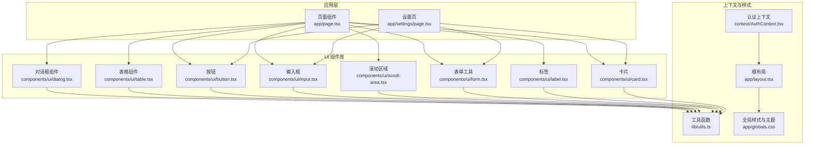
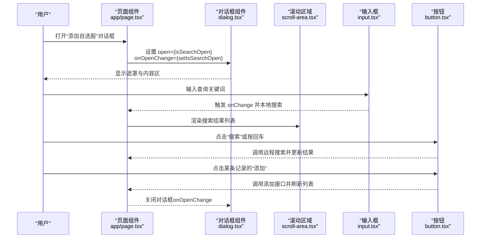
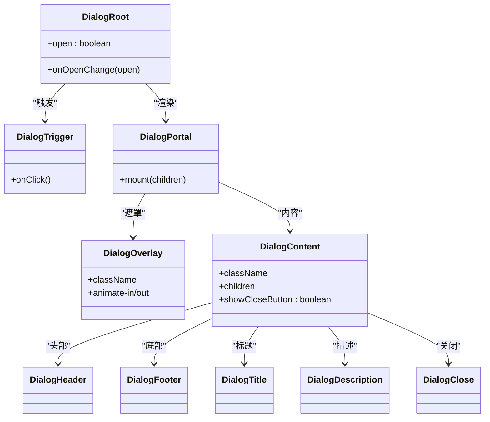
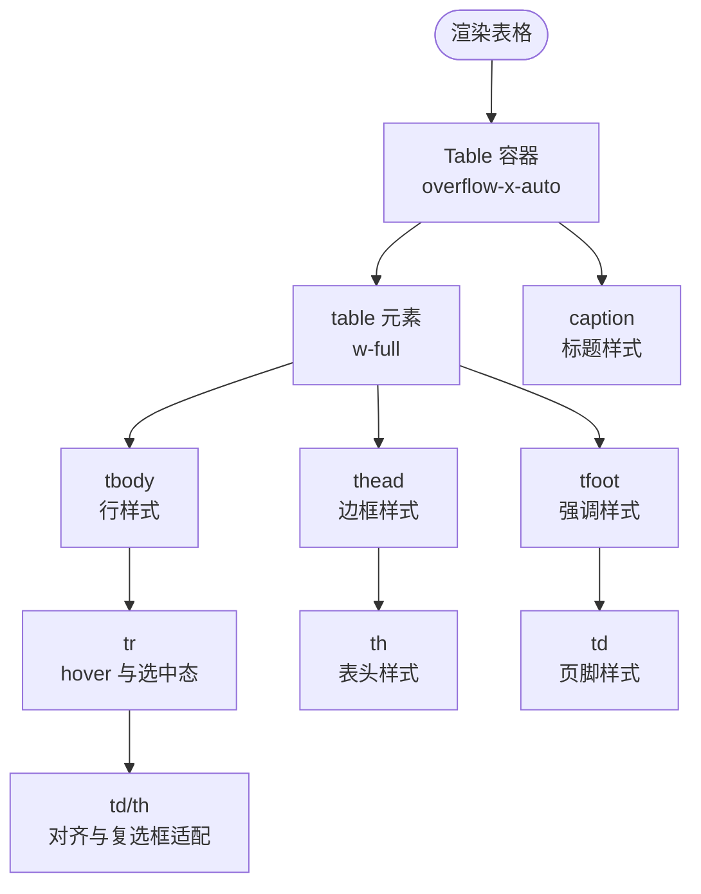
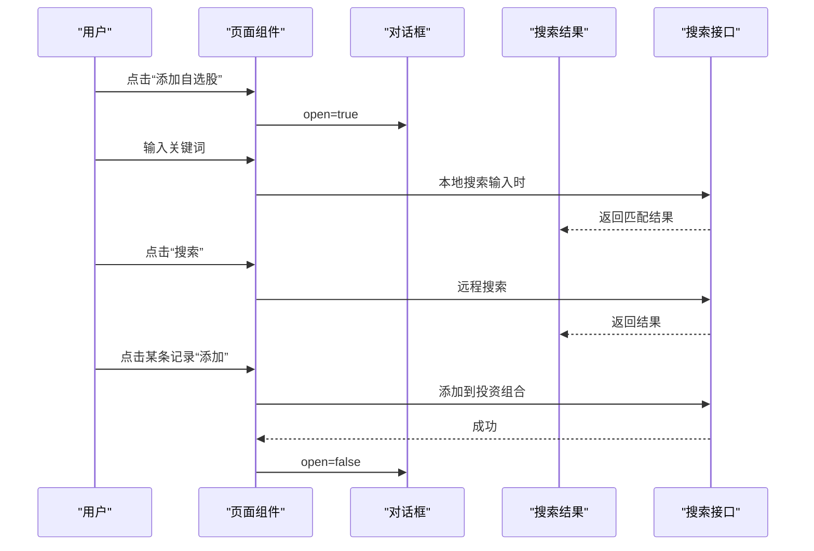
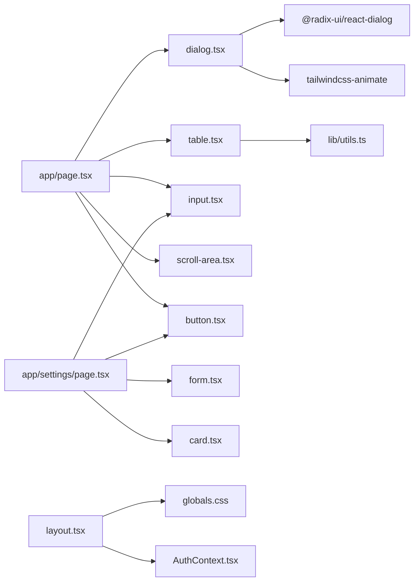

# 对话框与模态组件

<cite>
**本文引用的文件**
- [frontend/components/ui/dialog.tsx](file://frontend/components/ui/dialog.tsx)
- [frontend/components/ui/table.tsx](file://frontend/components/ui/table.tsx)
- [frontend/app/page.tsx](file://frontend/app/page.tsx)
- [frontend/app/settings/page.tsx](file://frontend/app/settings/page.tsx)
- [frontend/components/ui/button.tsx](file://frontend/components/ui/button.tsx)
- [frontend/components/ui/input.tsx](file://frontend/components/ui/input.tsx)
- [frontend/components/ui/scroll-area.tsx](file://frontend/components/ui/scroll-area.tsx)
- [frontend/components/ui/form.tsx](file://frontend/components/ui/form.tsx)
- [frontend/components/ui/label.tsx](file://frontend/components/ui/label.tsx)
- [frontend/components/ui/card.tsx](file://frontend/components/ui/card.tsx)
- [frontend/context/AuthContext.tsx](file://frontend/context/AuthContext.tsx)
- [frontend/app/layout.tsx](file://frontend/app/layout.tsx)
- [frontend/lib/utils.ts](file://frontend/lib/utils.ts)
- [frontend/app/globals.css](file://frontend/app/globals.css)
- [frontend/package.json](file://frontend/package.json)
</cite>

## 目录
1. [简介](#简介)
2. [项目结构](#项目结构)
3. [核心组件](#核心组件)
4. [架构总览](#架构总览)
5. [详细组件分析](#详细组件分析)
6. [依赖关系分析](#依赖关系分析)
7. [性能考量](#性能考量)
8. [故障排查指南](#故障排查指南)
9. [结论](#结论)
10. [附录](#附录)

## 简介
本指南聚焦于对话框与模态组件（Dialog）及表格组件（Table）在前端中的设计与使用，涵盖以下关键主题：
- 对话框的打开/关闭控制、背景遮罩处理、键盘事件响应与无障碍支持
- 表格的数据展示能力与交互特性
- 组件状态管理、事件处理与生命周期控制
- 模态框的嵌套使用与多步骤流程的实现思路
- 样式定制与主题适配
- 无障碍访问与键盘导航支持
- 实际应用场景与最佳实践

## 项目结构
本项目采用 Next.js 应用结构，UI 组件位于 frontend/components/ui 下，页面逻辑位于 frontend/app 中，全局样式与主题变量位于 frontend/app/globals.css。

图表来源
- [frontend/app/page.tsx](file://frontend/app/page.tsx#L1-L686)
- [frontend/app/settings/page.tsx](file://frontend/app/settings/page.tsx#L1-L173)
- [frontend/components/ui/dialog.tsx](file://frontend/components/ui/dialog.tsx#L1-L144)
- [frontend/components/ui/table.tsx](file://frontend/components/ui/table.tsx#L1-L117)
- [frontend/context/AuthContext.tsx](file://frontend/context/AuthContext.tsx#L1-L60)
- [frontend/app/layout.tsx](file://frontend/app/layout.tsx#L1-L39)
- [frontend/lib/utils.ts](file://frontend/lib/utils.ts#L1-L7)
- [frontend/app/globals.css](file://frontend/app/globals.css#L1-L141)

章节来源
- [frontend/app/page.tsx](file://frontend/app/page.tsx#L1-L686)
- [frontend/app/settings/page.tsx](file://frontend/app/settings/page.tsx#L1-L173)
- [frontend/components/ui/dialog.tsx](file://frontend/components/ui/dialog.tsx#L1-L144)
- [frontend/components/ui/table.tsx](file://frontend/components/ui/table.tsx#L1-L117)
- [frontend/context/AuthContext.tsx](file://frontend/context/AuthContext.tsx#L1-L60)
- [frontend/app/layout.tsx](file://frontend/app/layout.tsx#L1-L39)
- [frontend/lib/utils.ts](file://frontend/lib/utils.ts#L1-L7)
- [frontend/app/globals.css](file://frontend/app/globals.css#L1-L141)

## 核心组件
- 对话框组件（Dialog）
  - 提供根容器、触发器、入口、关闭按钮、覆盖层、内容区、标题、描述与页脚等子组件
  - 使用 Radix UI 的对话框原语，结合动画与可访问性属性
  - 支持通过 showCloseButton 控制是否渲染关闭按钮
- 表格组件（Table）
  - 提供容器、表头、表体、表尾、行、单元格、表头单元格与标题等子组件
  - 内置悬停与选中态样式，支持复选框对齐与可访问性属性

章节来源
- [frontend/components/ui/dialog.tsx](file://frontend/components/ui/dialog.tsx#L9-L143)
- [frontend/components/ui/table.tsx](file://frontend/components/ui/table.tsx#L7-L116)

## 架构总览
下图展示了页面如何使用对话框与表格组件，并结合滚动区域、输入框、按钮等构建交互流程。

图表来源
- [frontend/app/page.tsx](file://frontend/app/page.tsx#L594-L681)
- [frontend/components/ui/dialog.tsx](file://frontend/components/ui/dialog.tsx#L49-L81)
- [frontend/components/ui/scroll-area.tsx](file://frontend/components/ui/scroll-area.tsx#L8-L29)
- [frontend/components/ui/input.tsx](file://frontend/components/ui/input.tsx#L5-L18)
- [frontend/components/ui/button.tsx](file://frontend/components/ui/button.tsx#L39-L60)

## 详细组件分析

### 对话框组件（Dialog）详解
- 组件族
  - Root：根容器，承载状态与控制
  - Trigger：触发器，用于打开/关闭
  - Portal：传送门，确保内容挂载到 DOM 顶层
  - Close：关闭按钮
  - Overlay：背景遮罩，内置淡入淡出动画
  - Content：内容区，居中定位、阴影与动画
  - Header/Footer/Title/Description：布局与语义化
- 状态与生命周期
  - 通过 open/onOpenChange 双向绑定控制显示/隐藏
  - 使用 Portal 将内容挂载至文档根部，避免层级与溢出问题
  - Overlay 在打开时触发动画类，关闭时过渡到透明
- 键盘事件与无障碍
  - 内置可访问性属性，焦点管理由 Radix UI 处理
  - 关闭按钮包含不可见文本（sr-only），提升屏幕阅读器体验
- 样式与主题
  - 使用 Tailwind 类合并工具，支持传入自定义 className
  - 主题变量由全局 CSS 定义，深色/浅色模式自动切换

图表来源
- [frontend/components/ui/dialog.tsx](file://frontend/components/ui/dialog.tsx#L9-L143)

章节来源
- [frontend/components/ui/dialog.tsx](file://frontend/components/ui/dialog.tsx#L9-L143)

### 表格组件（Table）详解
- 组件族
  - Table：外层容器，提供横向滚动
  - TableHeader/TableBody/TableFooter：表头/主体/页脚
  - TableRow：行，支持悬停与选中态
  - TableHead/TableCell：表头与单元格，内置对齐与复选框适配
  - TableCaption：标题
- 数据展示与交互
  - 行悬停高亮与选中态，便于在主从视图中标识当前项
  - 单元格内支持复选框，自动对齐与间距优化
- 样式与主题
  - 使用 Tailwind 类合并工具，支持传入自定义 className
  - 与全局主题变量一致，深色/浅色模式下保持一致性

图表来源
- [frontend/components/ui/table.tsx](file://frontend/components/ui/table.tsx#L7-L116)

章节来源
- [frontend/components/ui/table.tsx](file://frontend/components/ui/table.tsx#L7-L116)

### 页面中的对话框与表格使用案例
- “添加自选股”对话框
  - 打开/关闭：通过页面状态 isSearchOpen 控制
  - 搜索流程：本地搜索（输入时）+ 远程搜索（点击或回车）
  - 结果展示：使用 ScrollArea 展示搜索结果，逐条提供“添加”按钮
  - 关闭行为：添加成功后自动刷新并关闭对话框
- 表格在主从视图中的角色
  - 左侧列表作为“主”，右侧详情作为“从”
  - 表格行支持悬停与选中态，便于用户在主视图中选择目标

图表来源
- [frontend/app/page.tsx](file://frontend/app/page.tsx#L594-L681)

章节来源
- [frontend/app/page.tsx](file://frontend/app/page.tsx#L594-L681)

### 表单与输入在设置页的应用
- 设置页使用表单工具与输入组件，配合按钮与卡片展示配置项
- 表单工具提供可访问性属性与错误状态映射，输入组件支持无效状态下的视觉反馈

章节来源
- [frontend/app/settings/page.tsx](file://frontend/app/settings/page.tsx#L1-L173)
- [frontend/components/ui/form.tsx](file://frontend/components/ui/form.tsx#L1-L168)
- [frontend/components/ui/input.tsx](file://frontend/components/ui/input.tsx#L1-L22)
- [frontend/components/ui/button.tsx](file://frontend/components/ui/button.tsx#L1-L63)
- [frontend/components/ui/card.tsx](file://frontend/components/ui/card.tsx#L1-L93)
- [frontend/components/ui/label.tsx](file://frontend/components/ui/label.tsx#L1-L25)

## 依赖关系分析
- 组件依赖
  - Dialog 依赖 Radix UI 的对话框原语与动画库
  - 表格组件依赖工具函数进行类名合并
  - 页面组件依赖多个 UI 组件以构建复杂交互
- 样式与主题
  - 全局 CSS 定义了主题变量与深色/浅色模式
  - 组件通过 Tailwind 类与变量保持一致风格

图表来源
- [frontend/components/ui/dialog.tsx](file://frontend/components/ui/dialog.tsx#L1-L144)
- [frontend/components/ui/table.tsx](file://frontend/components/ui/table.tsx#L1-L117)
- [frontend/lib/utils.ts](file://frontend/lib/utils.ts#L1-L7)
- [frontend/app/page.tsx](file://frontend/app/page.tsx#L1-L686)
- [frontend/app/settings/page.tsx](file://frontend/app/settings/page.tsx#L1-L173)
- [frontend/app/layout.tsx](file://frontend/app/layout.tsx#L1-L39)
- [frontend/context/AuthContext.tsx](file://frontend/context/AuthContext.tsx#L1-L60)
- [frontend/package.json](file://frontend/package.json#L11-L29)

章节来源
- [frontend/package.json](file://frontend/package.json#L11-L29)

## 性能考量
- 对话框
  - 使用 Portal 避免层级与溢出问题，减少重排
  - 动画类仅在状态切换时生效，避免不必要的计算
- 表格
  - 横向滚动容器仅在宽度过大时启用，降低渲染压力
  - 行级悬停与选中态使用 CSS 过渡，避免复杂 JS 计算
- 页面交互
  - 搜索采用本地搜索与远程搜索分层，减少网络请求频率
  - 添加操作使用禁用态与加载指示，避免重复提交

## 故障排查指南
- 对话框无法关闭
  - 检查 open/onOpenChange 是否正确绑定
  - 确认关闭按钮是否被禁用或事件被阻止
- 遮罩点击无效
  - Overlay 默认拦截点击，确认未覆盖到内容区
- 表格滚动异常
  - 确认容器宽度与内容宽度关系，避免过度缩放
- 深色/浅色主题不一致
  - 检查全局 CSS 变量是否正确注入，确认根元素类名
- 表单错误状态未显示
  - 确认表单工具提供的错误映射与 aria 属性是否正确设置

章节来源
- [frontend/components/ui/dialog.tsx](file://frontend/components/ui/dialog.tsx#L33-L81)
- [frontend/components/ui/table.tsx](file://frontend/components/ui/table.tsx#L7-L116)
- [frontend/app/globals.css](file://frontend/app/globals.css#L1-L141)
- [frontend/components/ui/form.tsx](file://frontend/components/ui/form.tsx#L125-L156)

## 结论
本项目通过模块化的 UI 组件与清晰的页面交互，实现了对话框与表格在真实业务场景中的高效使用。Dialog 提供了完善的可访问性与动画支持，Table 则在数据展示与交互上提供了良好的基础。结合全局主题与工具函数，组件具备良好的扩展性与一致性。

## 附录
- 最佳实践
  - 对话框：始终使用 Portal；合理控制 showCloseButton；为关闭按钮提供可读文本
  - 表格：为每一行提供稳定 key；在大量数据时考虑虚拟滚动；为关键列提供排序与筛选入口
  - 表单：为每个字段提供标签与描述；利用表单工具的错误映射与 aria 属性
  - 主题：统一使用全局变量；深色/浅色模式下保持对比度与可读性
- 可访问性建议
  - 对话框：确保首次焦点进入内容区；Esc 关闭；避免焦点丢失
  - 表格：提供表头语义；为交互元素提供键盘可达性
  - 表单：错误提示与输入关联；键盘导航顺畅