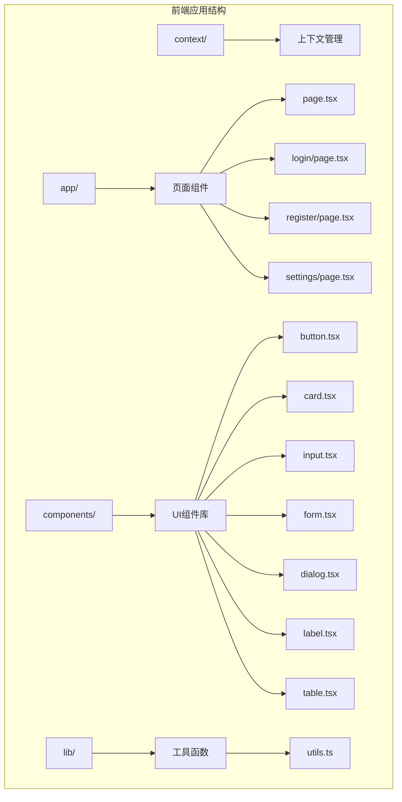
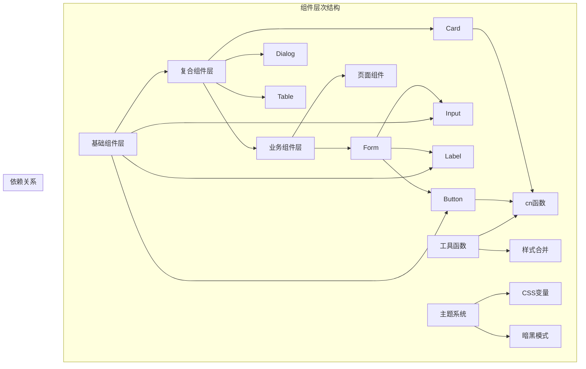
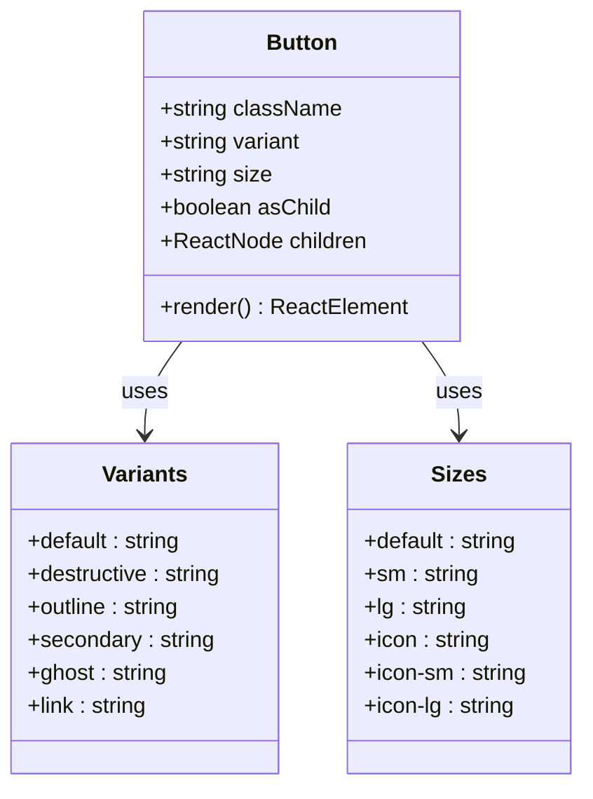
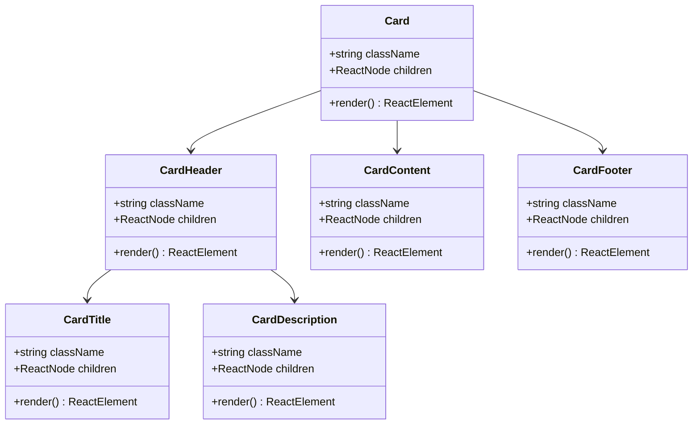
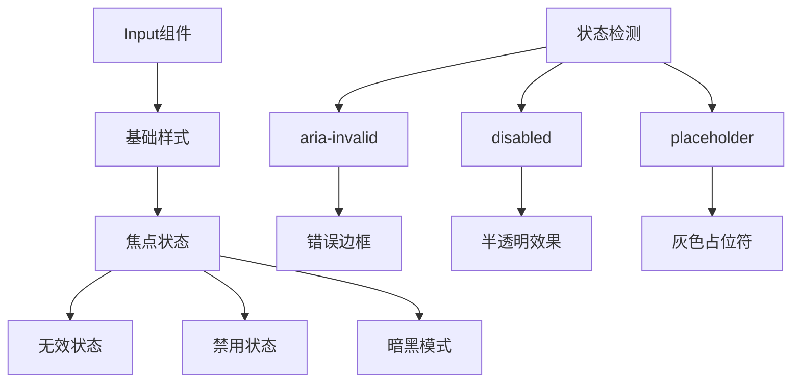
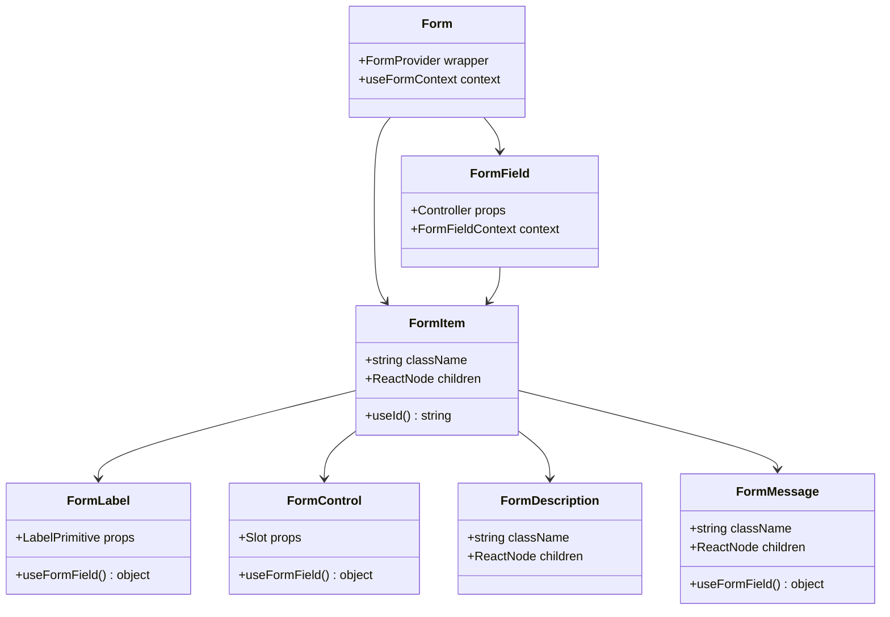
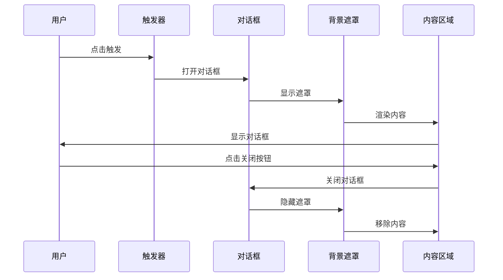

# 核心UI组件

<cite>
**本文档引用的文件**
- [frontend/components/ui/button.tsx](file://frontend/components/ui/button.tsx)
- [frontend/components/ui/card.tsx](file://frontend/components/ui/card.tsx)
- [frontend/components/ui/input.tsx](file://frontend/components/ui/input.tsx)
- [frontend/components/ui/form.tsx](file://frontend/components/ui/form.tsx)
- [frontend/components/ui/dialog.tsx](file://frontend/components/ui/dialog.tsx)
- [frontend/components/ui/label.tsx](file://frontend/components/ui/label.tsx)
- [frontend/components/ui/table.tsx](file://frontend/components/ui/table.tsx)
- [frontend/lib/utils.ts](file://frontend/lib/utils.ts)
- [frontend/app/globals.css](file://frontend/app/globals.css)
- [frontend/app/page.tsx](file://frontend/app/page.tsx)
- [frontend/app/login/page.tsx](file://frontend/app/login/page.tsx)
- [frontend/app/register/page.tsx](file://frontend/app/register/page.tsx)
- [frontend/app/settings/page.tsx](file://frontend/app/settings/page.tsx)
- [frontend/package.json](file://frontend/package.json)
</cite>

## 目录
1. [简介](#简介)
2. [项目结构](#项目结构)
3. [核心组件](#核心组件)
4. [架构概览](#架构概览)
5. [详细组件分析](#详细组件分析)
6. [依赖分析](#依赖分析)
7. [性能考虑](#性能考虑)
8. [故障排除指南](#故障排除指南)
9. [结论](#结论)
10. [附录](#附录)

## 简介

本项目是一个基于Next.js构建的AI股票顾问应用，采用现代化的前端技术栈。核心UI组件库基于Tailwind CSS和Radix UI构建，提供了完整的组件生态系统，支持暗黑模式、响应式设计和无障碍访问。

该组件库的核心特性包括：
- 基于CSS变量的主题系统
- 完整的暗黑模式支持
- 响应式设计和移动端适配
- 无障碍访问支持
- 组件状态管理
- 表单验证集成

## 项目结构

前端项目采用模块化的组件架构，核心UI组件位于`frontend/components/ui/`目录下，每个组件都是独立的、可复用的模块。



**图表来源**
- [frontend/app/page.tsx](file://frontend/app/page.tsx#L1-L686)
- [frontend/components/ui/button.tsx](file://frontend/components/ui/button.tsx#L1-L63)
- [frontend/lib/utils.ts](file://frontend/lib/utils.ts#L1-L7)

**章节来源**
- [frontend/package.json](file://frontend/package.json#L1-L43)
- [frontend/app/globals.css](file://frontend/app/globals.css#L1-L141)

## 核心组件

本项目的核心UI组件库包含以下主要组件：

### 组件分类与功能

| 组件类型 | 组件名称 | 主要功能 | 使用场景 |
|---------|----------|----------|----------|
| 基础组件 | Button | 按钮交互 | 表单提交、导航、操作按钮 |
| 布局组件 | Card | 内容容器 | 信息展示、数据卡片 |
| 输入组件 | Input | 文本输入 | 表单字段、搜索框 |
| 表单组件 | Form | 表单管理 | 用户注册、登录、设置 |
| 弹窗组件 | Dialog | 对话框 | 模态对话、确认框 |
| 标签组件 | Label | 标签文本 | 表单标签、说明文字 |
| 表格组件 | Table | 数据表格 | 股票列表、数据展示 |

**章节来源**
- [frontend/components/ui/button.tsx](file://frontend/components/ui/button.tsx#L1-L63)
- [frontend/components/ui/card.tsx](file://frontend/components/ui/card.tsx#L1-L93)
- [frontend/components/ui/input.tsx](file://frontend/components/ui/input.tsx#L1-L22)
- [frontend/components/ui/form.tsx](file://frontend/components/ui/form.tsx#L1-L168)
- [frontend/components/ui/dialog.tsx](file://frontend/components/ui/dialog.tsx#L1-L144)

## 架构概览

组件库采用分层架构设计，通过清晰的职责分离实现了高度的模块化和可维护性。



**图表来源**
- [frontend/components/ui/button.tsx](file://frontend/components/ui/button.tsx#L1-L63)
- [frontend/components/ui/card.tsx](file://frontend/components/ui/card.tsx#L1-L93)
- [frontend/lib/utils.ts](file://frontend/lib/utils.ts#L1-L7)

## 详细组件分析

### Button组件

Button组件是项目中最基础且重要的交互组件，提供了丰富的变体和尺寸选项。

#### 组件特性



**图表来源**
- [frontend/components/ui/button.tsx](file://frontend/components/ui/button.tsx#L7-L37)

#### 属性配置

| 属性名 | 类型 | 默认值 | 描述 |
|--------|------|--------|------|
| variant | enum | "default" | 按钮外观变体 |
| size | enum | "default" | 按钮尺寸大小 |
| asChild | boolean | false | 是否作为子元素渲染 |
| className | string | - | 自定义样式类名 |
| disabled | boolean | - | 禁用状态 |

#### 变体类型详解

| 变体类型 | 用途 | 样式特点 |
|----------|------|----------|
| default | 主要操作按钮 | 主色调背景，白色文字 |
| destructive | 危险操作按钮 | 红色背景，强调删除/取消 |
| outline | 边框按钮 | 透明背景，边框装饰 |
| secondary | 次要操作按钮 | 次要颜色，轻量级操作 |
| ghost | 幽灵按钮 | 透明背景，悬停时显示效果 |
| link | 链接按钮 | 无背景，下划线装饰 |

#### 尺寸规格

| 尺寸 | 高度 | 内边距 | 图标尺寸 |
|------|------|--------|----------|
| default | 36px | 16px 8px | 16px |
| sm | 32px | 12px 8px | 14px |
| lg | 40px | 24px 8px | 18px |
| icon | 36px | - | 16px |
| icon-sm | 32px | - | 14px |
| icon-lg | 40px | - | 18px |

**章节来源**
- [frontend/components/ui/button.tsx](file://frontend/components/ui/button.tsx#L1-L63)

### Card组件

Card组件提供了完整的卡片布局结构，支持头部、标题、描述、内容和底部区域。

#### 组件结构



**图表来源**
- [frontend/components/ui/card.tsx](file://frontend/components/ui/card.tsx#L5-L92)

#### 使用场景

Card组件广泛应用于数据展示场景，特别是在主页面的分析结果展示中：

- **基本面数据卡片**：展示股票的基本财务信息
- **技术指标卡片**：显示各种技术分析指标
- **AI分析建议卡片**：突出显示AI给出的投资建议

**章节来源**
- [frontend/components/ui/card.tsx](file://frontend/components/ui/card.tsx#L1-L93)

### Input组件

Input组件是表单输入的基础组件，提供了完整的样式系统和状态反馈。

#### 样式系统



**图表来源**
- [frontend/components/ui/input.tsx](file://frontend/components/ui/input.tsx#L5-L19)

#### 状态管理

| 状态 | 样式类 | 触发条件 | 视觉效果 |
|------|--------|----------|----------|
| 正常 | 默认样式 | 无特殊状态 | 标准边框和背景 |
| 焦点 | focus-visible | 获得焦点 | 蓝色边框和发光效果 |
| 无效 | aria-invalid | 验证失败 | 红色边框和阴影 |
| 禁用 | disabled | disabled属性 | 半透明，不可交互 |
| 暗黑 | dark: | 暗黑模式 | 深色背景 |

**章节来源**
- [frontend/components/ui/input.tsx](file://frontend/components/ui/input.tsx#L1-L22)

### Form组件

Form组件基于react-hook-form构建，提供了完整的表单管理解决方案。

#### 组件体系



**图表来源**
- [frontend/components/ui/form.tsx](file://frontend/components/ui/form.tsx#L19-L167)

#### 表单状态管理

| 组件 | 功能 | 关键属性 |
|------|------|----------|
| Form | 表单容器 | FormProvider包装器 |
| FormField | 字段容器 | Controller包装器 |
| FormItem | 表单项 | useId()生成唯一ID |
| FormLabel | 标签组件 | htmlFor绑定字段 |
| FormControl | 控制器 | Slot包装器 |
| FormDescription | 描述文本 | aria-describedby关联 |
| FormMessage | 错误消息 | aria-invalid标记 |

**章节来源**
- [frontend/components/ui/form.tsx](file://frontend/components/ui/form.tsx#L1-L168)

### Dialog组件

Dialog组件基于@radix-ui/react-dialog构建，提供了完整的模态对话框解决方案。

#### 对话框结构



**图表来源**
- [frontend/components/ui/dialog.tsx](file://frontend/components/ui/dialog.tsx#L9-L81)

#### 对话框状态

| 状态 | 动画效果 | 视觉表现 |
|------|----------|----------|
| 打开中 | fade-in + zoom-in | 淡入+缩放进入 |
| 关闭中 | fade-out + zoom-out | 淡出+缩放退出 |
| 打开 | visible | 完全可见 |
| 关闭 | hidden | 完全隐藏 |

**章节来源**
- [frontend/components/ui/dialog.tsx](file://frontend/components/ui/dialog.tsx#L1-L144)

## 依赖分析

组件库的依赖关系体现了清晰的模块化设计原则。

```mermaid
graph TB
subgraph "核心依赖"
A[react] --> B[组件基础]
C[tailwindcss] --> D[样式系统]
E[clsx] --> F[类名合并]
G[tailwind-merge] --> H[样式冲突解决]
end
subgraph "UI工具"
I[@radix-ui/react-slot] --> J[元素包装]
K[class-variance-authority] --> L[变体系统]
end
subgraph "表单处理"
M[react-hook-form] --> N[表单状态]
O[@hookform/resolvers] --> P[验证器]
Q[zod] --> R[类型验证]
end
subgraph "图标系统"
S[lucide-react] --> T[SVG图标]
end
subgraph "辅助库"
U[date-fns] --> V[日期处理]
W[axios] --> X[HTTP请求]
Y[react-markdown] --> Z[Markdown渲染]
end
```

**图表来源**
- [frontend/package.json](file://frontend/package.json#L11-L29)

### 核心依赖说明

| 依赖包 | 版本 | 用途 | 关键特性 |
|--------|------|------|----------|
| react | ^19.2.3 | 核心框架 | 组件系统、状态管理 |
| tailwindcss | ^4 | 样式框架 | 原子化CSS、响应式设计 |
| class-variance-authority | ^0.7.1 | 变体系统 | 组件变体管理 |
| @radix-ui/react-slot | ^1.2.4 | 元素包装 | 渲染灵活性 |
| react-hook-form | ^7.71.1 | 表单管理 | 高性能表单处理 |
| lucide-react | ^0.562.0 | 图标库 | SVG图标、可定制 |

**章节来源**
- [frontend/package.json](file://frontend/package.json#L1-L43)

## 性能考虑

组件库在设计时充分考虑了性能优化，采用了多种策略来提升用户体验。

### 性能优化策略

1. **懒加载和按需导入**
   - 组件按需加载，减少初始包体积
   - 图标组件使用动态导入

2. **样式优化**
   - 使用Tailwind原子化CSS，避免重复样式
   - CSS变量统一管理主题色彩

3. **状态管理优化**
   - React.memo用于纯组件
   - 合理的useState和useEffect使用

4. **渲染优化**
   - Fragment减少DOM节点
   - 条件渲染避免不必要的计算

### 性能监控指标

| 指标 | 目标值 | 实现方式 |
|------|--------|----------|
| 首屏加载时间 | < 2秒 | 代码分割、资源压缩 |
| 交互延迟 | < 100ms | 事件委托、防抖节流 |
| 内存使用 | < 50MB | 组件卸载清理 |
| GPU加速 | 启用 | transform、opacity过渡 |

## 故障排除指南

### 常见问题及解决方案

#### 样式不生效

**问题症状**：组件样式异常或主题不正确

**可能原因**：
1. Tailwind配置问题
2. CSS变量未正确设置
3. 样式优先级冲突

**解决方案**：
1. 检查globals.css中的CSS变量定义
2. 确认Tailwind配置文件正确
3. 使用开发者工具检查样式来源

#### 组件状态异常

**问题症状**：按钮状态不正确或表单验证失效

**可能原因**：
1. React状态管理问题
2. 表单上下文丢失
3. 事件处理器错误

**解决方案**：
1. 检查组件的useState/useEffect调用
2. 确保Form组件正确包装
3. 验证事件处理器参数传递

#### 无障碍访问问题

**问题症状**：屏幕阅读器无法正确读取组件

**可能原因**：
1. 缺少ARIA属性
2. 标签关联错误
3. 焦点管理问题

**解决方案**：
1. 添加适当的aria-*属性
2. 确保label htmlFor正确绑定
3. 实现键盘导航支持

**章节来源**
- [frontend/app/globals.css](file://frontend/app/globals.css#L1-L141)

## 结论

本项目的核心UI组件库展现了现代前端开发的最佳实践，通过精心设计的组件架构、完善的样式系统和强大的功能特性，为AI股票顾问应用提供了坚实的技术基础。

### 主要优势

1. **模块化设计**：每个组件都是独立的、可复用的模块
2. **主题一致性**：基于CSS变量的统一主题系统
3. **无障碍支持**：完整的ARIA属性和键盘导航
4. **响应式设计**：全面的移动端适配
5. **性能优化**：高效的渲染和状态管理

### 技术亮点

- 基于Tailwind CSS的原子化样式系统
- Radix UI提供的可靠UI抽象
- React Hook Form实现的高性能表单管理
- 完整的暗黑模式支持
- 无障碍访问的完整实现

该组件库不仅满足了当前项目的需求，也为未来的功能扩展奠定了良好的基础。

## 附录

### 组件使用最佳实践

#### 基本用法示例

**按钮组件**
```typescript
// 基础按钮
<Button>点击我</Button>

// 主要操作按钮
<Button variant="default">提交</Button>

// 删除操作按钮
<Button variant="destructive">删除</Button>

// 图标按钮
<Button variant="ghost" size="icon">
  <SettingsIcon />
</Button>
```

**卡片组件**
```typescript
<Card>
  <CardHeader>
    <CardTitle>标题</CardTitle>
    <CardDescription>描述文本</CardDescription>
  </CardHeader>
  <CardContent>
    <p>卡片内容</p>
  </CardContent>
  <CardFooter>
    <Button>操作按钮</Button>
  </CardFooter>
</Card>
```

**输入组件**
```typescript
<Input
  type="email"
  placeholder="请输入邮箱地址"
  value={email}
  onChange={(e) => setEmail(e.target.value)}
/>
```

**表单组件**
```typescript
<Form {...formMethods}>
  <FormField
    name="email"
    render={({ field }) => (
      <FormItem>
        <FormLabel>邮箱</FormLabel>
        <FormControl>
          <Input {...field} type="email" />
        </FormControl>
        <FormDescription>请输入有效的邮箱地址</FormDescription>
        <FormMessage />
      </FormItem>
    )}
  />
</Form>
```

#### 高级配置技巧

**主题定制**
```css
/* 自定义CSS变量 */
:root {
  --primary: #0ea5e9;
  --secondary: #8b5cf6;
  --destructive: #ef4444;
}

.dark {
  --primary: #0284c7;
  --secondary: #a855f7;
  --destructive: #dc2626;
}
```

**响应式设计**
```typescript
// 移动端适配
<div className="grid grid-cols-1 md:grid-cols-2 lg:grid-cols-3 gap-4">
  <Card>内容1</Card>
  <Card>内容2</Card>
  <Card>内容3</Card>
</div>
```

**无障碍访问增强**
```typescript
<Input
  id="email"
  aria-describedby="email-description"
  aria-invalid={!!error}
  required
/>
<FormMessage id="email-error">{error}</FormMessage>
```

**章节来源**
- [frontend/app/page.tsx](file://frontend/app/page.tsx#L1-L686)
- [frontend/app/login/page.tsx](file://frontend/app/login/page.tsx#L1-L89)
- [frontend/app/register/page.tsx](file://frontend/app/register/page.tsx#L1-L84)
- [frontend/app/settings/page.tsx](file://frontend/app/settings/page.tsx#L1-L173)