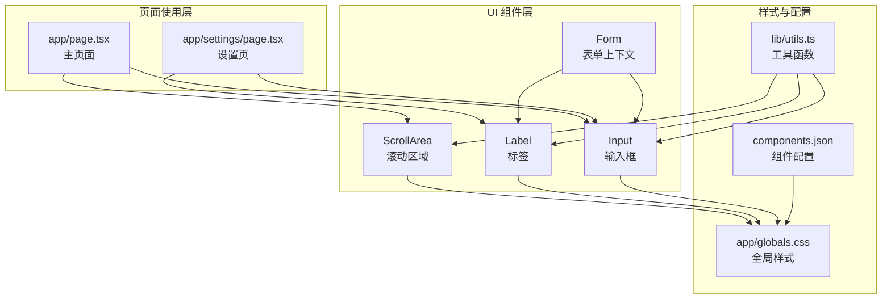
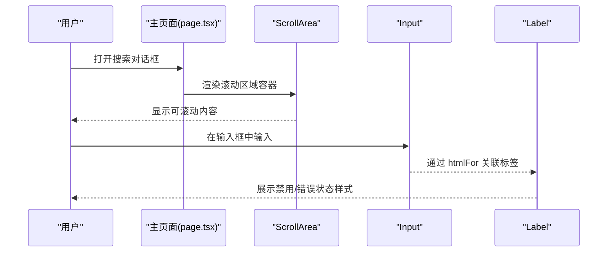
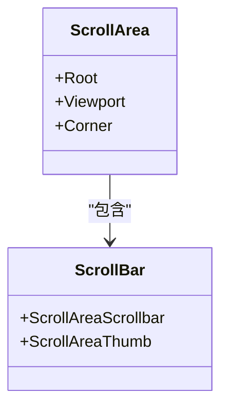
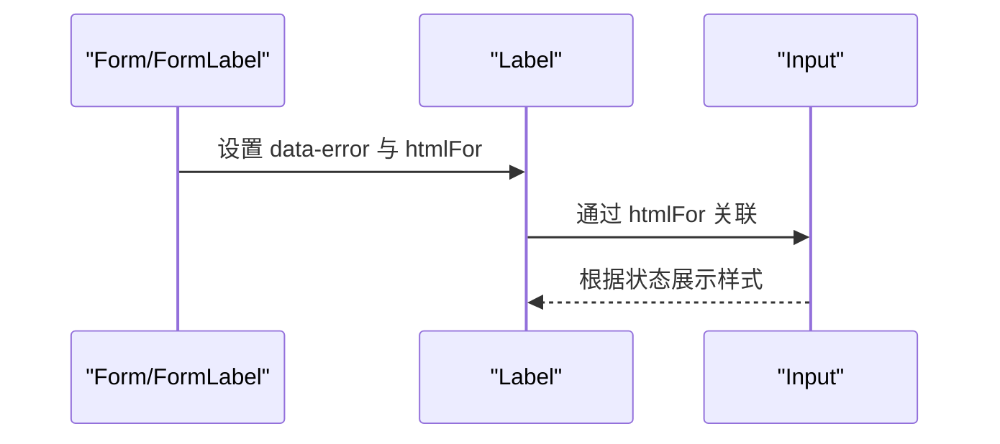
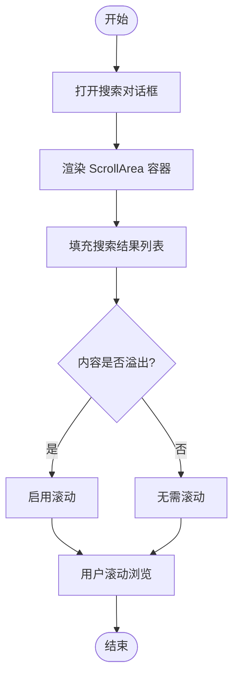
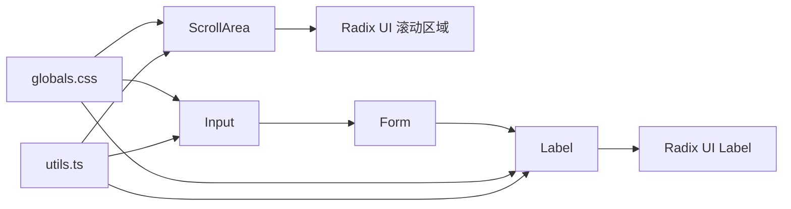

# 滚动区域与标签组件

<cite>
**本文档引用的文件**
- [frontend/components/ui/scroll-area.tsx](file://frontend/components/ui/scroll-area.tsx)
- [frontend/components/ui/label.tsx](file://frontend/components/ui/label.tsx)
- [frontend/components/ui/form.tsx](file://frontend/components/ui/form.tsx)
- [frontend/components/ui/input.tsx](file://frontend/components/ui/input.tsx)
- [frontend/app/page.tsx](file://frontend/app/page.tsx)
- [frontend/app/settings/page.tsx](file://frontend/app/settings/page.tsx)
- [frontend/app/globals.css](file://frontend/app/globals.css)
- [frontend/components.json](file://frontend/components.json)
- [frontend/lib/utils.ts](file://frontend/lib/utils.ts)
</cite>

## 目录
1. [简介](#简介)
2. [项目结构](#项目结构)
3. [核心组件](#核心组件)
4. [架构总览](#架构总览)
5. [详细组件分析](#详细组件分析)
6. [依赖关系分析](#依赖关系分析)
7. [性能考量](#性能考量)
8. [故障排查指南](#故障排查指南)
9. [结论](#结论)
10. [附录](#附录)

## 简介
本指南聚焦两个前端 UI 组件：滚动区域（ScrollArea）与标签（Label）。我们将深入讲解：
- 滚动区域的滚动行为控制与自定义滚动条实现方式
- 标签组件在表单中的角色、与输入组件的关联使用
- 尺寸控制、滚动触发条件与视觉反馈机制
- 复杂布局下的嵌套滚动区域实践
- 可访问性特性与表单验证集成
- 样式定制与主题适配方法
- 实际使用场景与用户体验优化技巧

## 项目结构
本项目采用 Next.js + Tailwind CSS + shadcn/ui 风格的组件体系。滚动区域与标签组件位于统一的 UI 组件目录下，并通过全局样式与工具函数进行统一的样式合并与主题变量管理。

图表来源
- [frontend/components/ui/scroll-area.tsx](file://frontend/components/ui/scroll-area.tsx#L1-L59)
- [frontend/components/ui/label.tsx](file://frontend/components/ui/label.tsx#L1-L25)
- [frontend/components/ui/form.tsx](file://frontend/components/ui/form.tsx#L1-L168)
- [frontend/components/ui/input.tsx](file://frontend/components/ui/input.tsx#L1-L22)
- [frontend/app/page.tsx](file://frontend/app/page.tsx#L633-L678)
- [frontend/app/settings/page.tsx](file://frontend/app/settings/page.tsx#L104-L122)
- [frontend/app/globals.css](file://frontend/app/globals.css#L1-L141)
- [frontend/components.json](file://frontend/components.json#L1-L23)
- [frontend/lib/utils.ts](file://frontend/lib/utils.ts#L1-L7)

章节来源
- [frontend/components/ui/scroll-area.tsx](file://frontend/components/ui/scroll-area.tsx#L1-L59)
- [frontend/components/ui/label.tsx](file://frontend/components/ui/label.tsx#L1-L25)
- [frontend/components/ui/form.tsx](file://frontend/components/ui/form.tsx#L1-L168)
- [frontend/components/ui/input.tsx](file://frontend/components/ui/input.tsx#L1-L22)
- [frontend/app/page.tsx](file://frontend/app/page.tsx#L633-L678)
- [frontend/app/settings/page.tsx](file://frontend/app/settings/page.tsx#L104-L122)
- [frontend/app/globals.css](file://frontend/app/globals.css#L1-L141)
- [frontend/components.json](file://frontend/components.json#L1-L23)
- [frontend/lib/utils.ts](file://frontend/lib/utils.ts#L1-L7)

## 核心组件
- 滚动区域（ScrollArea）
  - 提供受控的滚动容器，内置视口（Viewport）、滚动条（Scrollbar/Thumb）与角落（Corner），支持垂直与水平方向滚动。
  - 默认使用 Tailwind 类名与主题变量，结合 Radix UI 的原生滚动行为，确保跨浏览器一致性。
- 标签（Label）
  - 用于描述输入控件，支持禁用态、焦点态与可访问性属性（如 htmlFor），并与表单上下文联动以实现错误状态提示。

章节来源
- [frontend/components/ui/scroll-area.tsx](file://frontend/components/ui/scroll-area.tsx#L8-L56)
- [frontend/components/ui/label.tsx](file://frontend/components/ui/label.tsx#L8-L22)

## 架构总览
滚动区域与标签组件在页面中的典型交互流程如下：

图表来源
- [frontend/app/page.tsx](file://frontend/app/page.tsx#L633-L678)
- [frontend/components/ui/scroll-area.tsx](file://frontend/components/ui/scroll-area.tsx#L19-L26)
- [frontend/components/ui/input.tsx](file://frontend/components/ui/input.tsx#L5-L17)
- [frontend/components/ui/label.tsx](file://frontend/components/ui/label.tsx#L12-L21)

## 详细组件分析

### 滚动区域组件（ScrollArea）
- 结构组成
  - Root：根容器，负责包裹视口与滚动条
  - Viewport：滚动视口，承载子内容，支持键盘焦点环样式
  - ScrollAreaScrollbar：滚动条容器，支持 vertical/horizontal 两种方向
  - ScrollAreaThumb：滚动条滑块，呈现当前滚动进度
  - Corner：右下角角落，避免滚动条遮挡
- 行为与样式
  - 使用 cn 合并类名，结合主题变量（如 border、ring）实现一致外观
  - 视口支持焦点环样式，提升可访问性
  - 滚动条宽度与边框在不同方向上差异化处理
- 尺寸控制与触发条件
  - 容器高度由父级布局决定；当内容超出容器时触发滚动
  - 垂直滚动条在纵向溢出时显示；水平滚动条在横向溢出时显示
- 自定义滚动条
  - 通过 ScrollAreaScrollbar/Thumb 的类名控制外观
  - 全局 CSS 中提供自定义滚动条样式（适用于非 Radix 滚动条的场景）

图表来源
- [frontend/components/ui/scroll-area.tsx](file://frontend/components/ui/scroll-area.tsx#L8-L56)

章节来源
- [frontend/components/ui/scroll-area.tsx](file://frontend/components/ui/scroll-area.tsx#L8-L56)
- [frontend/app/globals.css](file://frontend/app/globals.css#L126-L140)

### 标签组件（Label）与表单集成
- 角色与职责
  - 作为输入控件的语义化标签，提升可访问性
  - 与表单上下文（Form/FormLabel）配合，根据字段状态动态切换样式
- 与输入组件的关联
  - 通过 htmlFor 与输入控件 id 对应，点击标签可聚焦输入
  - 支持禁用态与错误态样式，便于表单验证反馈
- 错误状态与可访问性
  - 表单标签在存在错误时自动应用破坏性颜色
  - 输入控件通过 aria-invalid 与 aria-describedby 提升屏幕阅读器体验

图表来源
- [frontend/components/ui/form.tsx](file://frontend/components/ui/form.tsx#L90-L105)
- [frontend/components/ui/label.tsx](file://frontend/components/ui/label.tsx#L8-L22)
- [frontend/components/ui/input.tsx](file://frontend/components/ui/input.tsx#L5-L17)

章节来源
- [frontend/components/ui/form.tsx](file://frontend/components/ui/form.tsx#L90-L105)
- [frontend/components/ui/label.tsx](file://frontend/components/ui/label.tsx#L8-L22)
- [frontend/components/ui/input.tsx](file://frontend/components/ui/input.tsx#L5-L17)

### 实际使用场景与嵌套滚动
- 主页面中的搜索对话框
  - 在对话框内容区使用 ScrollArea 包裹搜索结果列表，限定最大高度并启用滚动
  - 列表项通过 Flex/Gap 布局排列，滚动区域确保内容完整可见
- 设置页中的表单
  - 使用 Label 与 Input 组合，配合表单上下文实现错误状态与可访问性
- 嵌套滚动区域
  - 在复杂布局中，可在不同层级分别设置滚动区域，避免滚动冲突
  - 注意控制容器尺寸与 overflow 行为，确保滚动优先级清晰

图表来源
- [frontend/app/page.tsx](file://frontend/app/page.tsx#L633-L678)

章节来源
- [frontend/app/page.tsx](file://frontend/app/page.tsx#L633-L678)
- [frontend/app/settings/page.tsx](file://frontend/app/settings/page.tsx#L104-L122)

## 依赖关系分析
- 组件依赖
  - ScrollArea 依赖 Radix UI 的滚动区域原语，内部组合 Viewport、Scrollbar、Thumb、Corner
  - Label 依赖 Radix UI 的 Label 原语，结合 cn 工具函数生成最终类名
  - Form 与 Label 协作，通过上下文传递字段 id 与错误状态
- 样式与主题
  - 全局 CSS 定义主题变量与暗色模式，组件通过变量实现一致风格
  - utils/cn 负责类名合并与冲突修复，保证样式叠加正确

图表来源
- [frontend/components/ui/scroll-area.tsx](file://frontend/components/ui/scroll-area.tsx#L3-L6)
- [frontend/components/ui/label.tsx](file://frontend/components/ui/label.tsx#L3-L6)
- [frontend/components/ui/form.tsx](file://frontend/components/ui/form.tsx#L16-L17)
- [frontend/app/globals.css](file://frontend/app/globals.css#L6-L47)
- [frontend/lib/utils.ts](file://frontend/lib/utils.ts#L4-L6)

章节来源
- [frontend/components/ui/scroll-area.tsx](file://frontend/components/ui/scroll-area.tsx#L3-L6)
- [frontend/components/ui/label.tsx](file://frontend/components/ui/label.tsx#L3-L6)
- [frontend/components/ui/form.tsx](file://frontend/components/ui/form.tsx#L16-L17)
- [frontend/app/globals.css](file://frontend/app/globals.css#L6-L47)
- [frontend/lib/utils.ts](file://frontend/lib/utils.ts#L4-L6)

## 性能考量
- 滚动区域
  - 控制容器尺寸，避免不必要的重排与重绘
  - 在长列表中仅渲染可见项，减少 DOM 节点数量
- 标签与表单
  - 使用 htmlFor 与 id 关联，避免 JavaScript 动态绑定带来的性能损耗
  - 错误状态样式切换尽量使用 CSS 变量与 data 属性，降低计算成本

## 故障排查指南
- 滚动条不可见或不生效
  - 检查容器是否设置了明确的高度或最大高度
  - 确认内容是否确实溢出，否则不会触发滚动
  - 查看全局滚动条样式是否被覆盖
- 标签无法聚焦输入
  - 确认 Label 的 htmlFor 与 Input 的 id 是否一致
  - 检查禁用态与错误态样式是否导致事件被阻止
- 表单验证无反馈
  - 确认 Form/FormLabel 是否正确包裹 Label 与 Input
  - 检查错误状态是否通过上下文传递

章节来源
- [frontend/components/ui/scroll-area.tsx](file://frontend/components/ui/scroll-area.tsx#L19-L26)
- [frontend/components/ui/label.tsx](file://frontend/components/ui/label.tsx#L12-L21)
- [frontend/components/ui/form.tsx](file://frontend/components/ui/form.tsx#L90-L105)

## 结论
- 滚动区域与标签组件在本项目中提供了稳定且可定制的滚动与可访问性基础能力
- 通过全局样式与工具函数，实现了主题一致与类名合并的工程化实践
- 在复杂布局中，合理使用滚动区域与表单上下文，能够显著提升用户体验与可维护性

## 附录
- 样式定制与主题适配
  - 通过主题变量与暗色模式规则，统一调整颜色与圆角等视觉元素
  - 使用 cn 合并类名，确保自定义样式与默认样式协同工作
- 组件配置
  - components.json 定义了样式风格、Tailwind 配置与别名映射，便于扩展与迁移

章节来源
- [frontend/app/globals.css](file://frontend/app/globals.css#L6-L116)
- [frontend/components.json](file://frontend/components.json#L1-L23)
- [frontend/lib/utils.ts](file://frontend/lib/utils.ts#L4-L6)