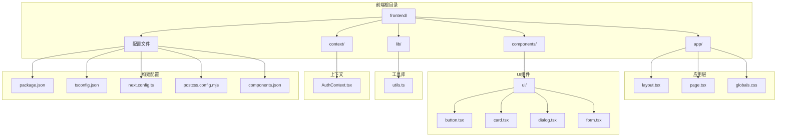
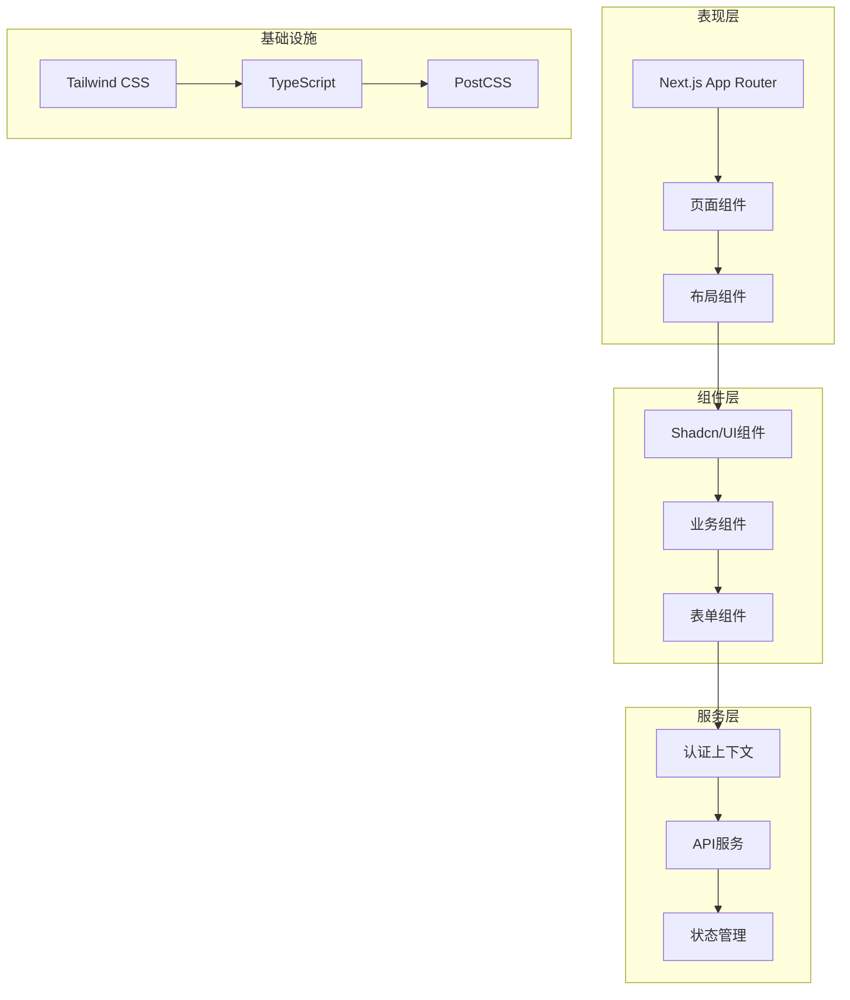
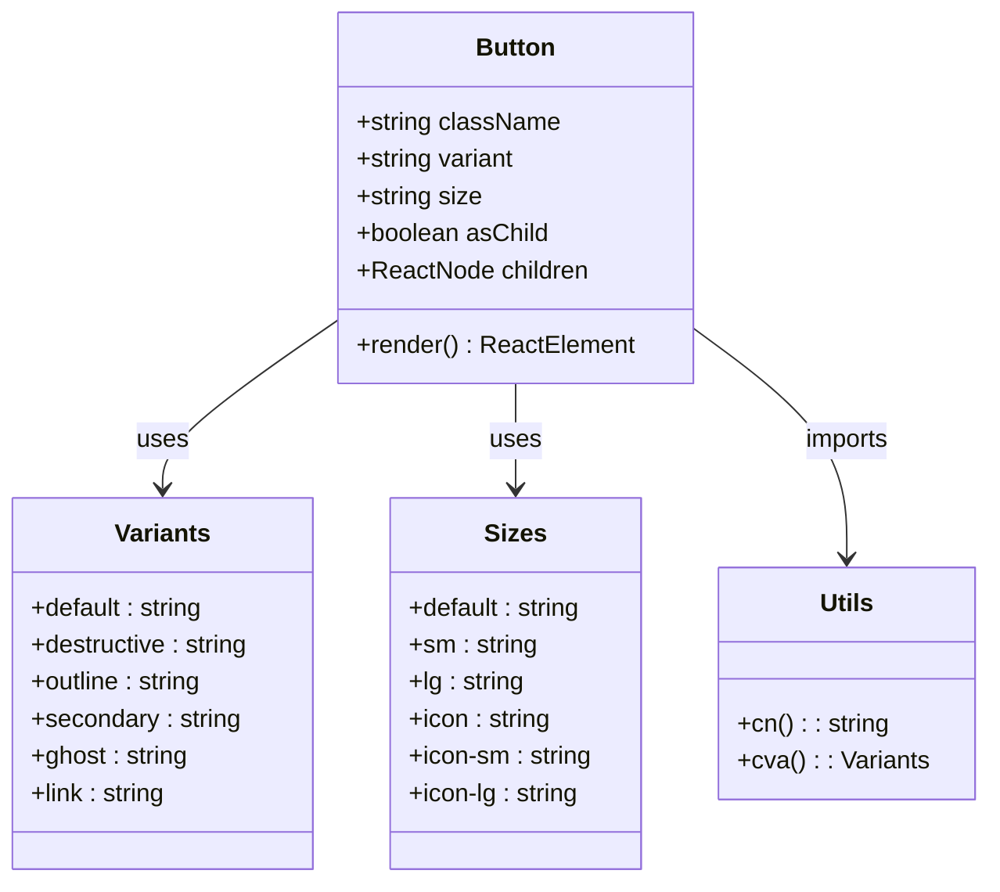
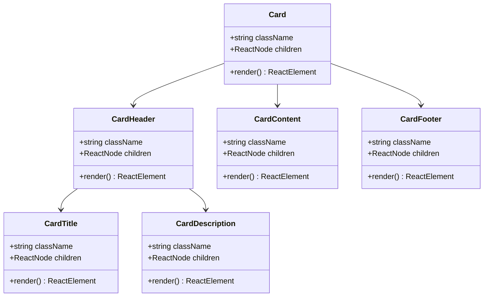
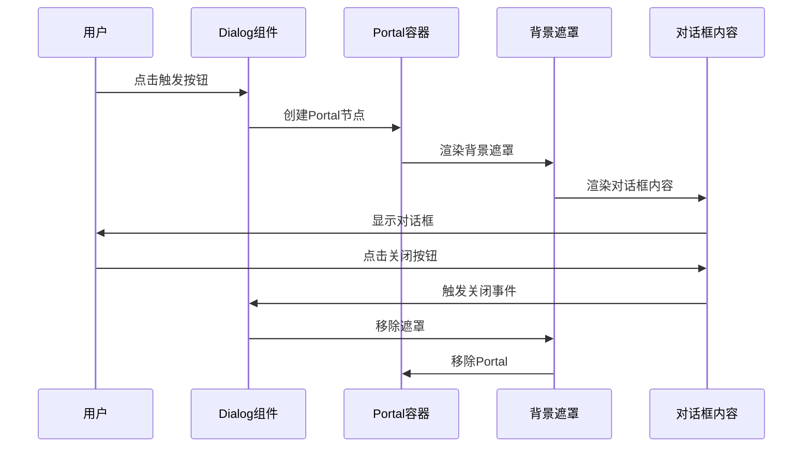
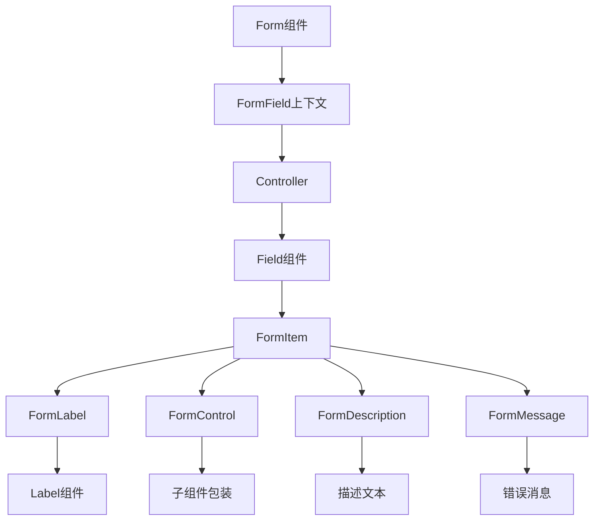
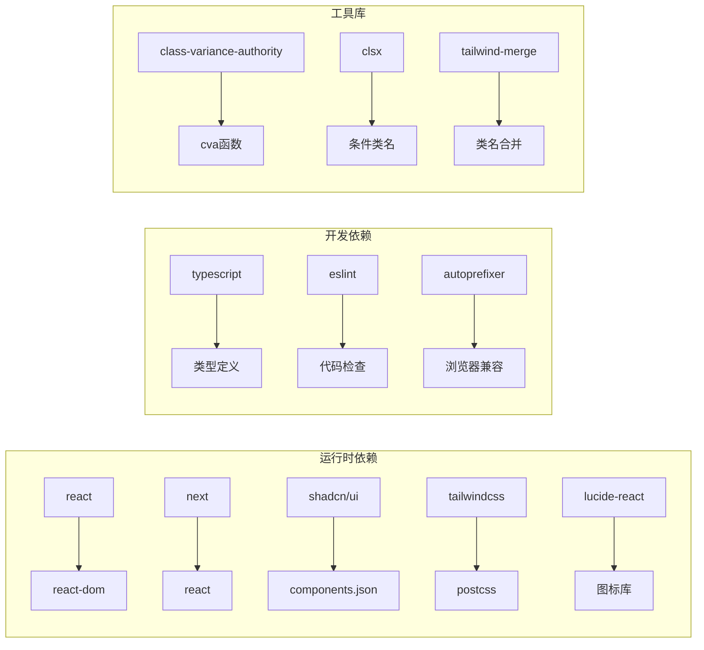

# 组件安装与配置

<cite>
**本文档引用的文件**
- [package.json](file://frontend/package.json)
- [components.json](file://frontend/components.json)
- [next.config.ts](file://frontend/next.config.ts)
- [postcss.config.mjs](file://frontend/postcss.config.mjs)
- [tsconfig.json](file://frontend/tsconfig.json)
- [globals.css](file://frontend/app/globals.css)
- [layout.tsx](file://frontend/app/layout.tsx)
- [page.tsx](file://frontend/app/page.tsx)
- [button.tsx](file://frontend/components/ui/button.tsx)
- [card.tsx](file://frontend/components/ui/card.tsx)
- [dialog.tsx](file://frontend/components/ui/dialog.tsx)
- [form.tsx](file://frontend/components/ui/form.tsx)
- [utils.ts](file://frontend/lib/utils.ts)
- [AuthContext.tsx](file://frontend/context/AuthContext.tsx)
</cite>

## 目录
1. [简介](#简介)
2. [项目结构](#项目结构)
3. [核心组件](#核心组件)
4. [架构概览](#架构概览)
5. [详细组件分析](#详细组件分析)
6. [依赖关系分析](#依赖关系分析)
7. [性能考虑](#性能考虑)
8. [故障排除指南](#故障排除指南)
9. [结论](#结论)
10. [附录](#附录)

## 简介

本指南专注于Next.js前端项目中的组件安装与配置，特别是Shadcn/UI的集成实现。项目采用现代化的前端技术栈，包括Next.js 16、TypeScript、Tailwind CSS v4以及Radix UI组件库。系统通过components.json配置文件管理UI组件的生成和定制，实现了高度可定制的主题系统和组件别名映射。

## 项目结构

前端项目采用模块化架构，主要目录结构如下：



**图表来源**
- [package.json](file://frontend/package.json#L1-L43)
- [components.json](file://frontend/components.json#L1-L23)
- [tsconfig.json](file://frontend/tsconfig.json#L1-L43)

**章节来源**
- [package.json](file://frontend/package.json#L1-L43)
- [components.json](file://frontend/components.json#L1-L23)
- [tsconfig.json](file://frontend/tsconfig.json#L1-L43)

## 核心组件

### Shadcn/UI 配置系统

项目使用Shadcn/UI作为核心UI组件库，通过components.json进行统一配置管理。该配置文件定义了组件库的样式主题、集成选项和别名映射。

#### 核心配置参数详解

| 参数 | 类型 | 默认值 | 描述 |
|------|------|--------|------|
| `$schema` | string | - | JSON模式定义，确保配置文件的有效性 |
| `style` | string | `"new-york"` | 主题样式风格，支持多种预设主题 |
| `rsc` | boolean | `true` | 启用React Server Components支持 |
| `tsx` | boolean | `true` | 启用TypeScript JSX支持 |
| `tailwind.config` | string | `""` | Tailwind CSS配置文件路径 |
| `tailwind.css` | string | `"app/globals.css"` | 全局CSS文件路径 |
| `tailwind.baseColor` | string | `"neutral"` | 基础颜色主题 |
| `tailwind.cssVariables` | boolean | `true` | 启用CSS变量支持 |
| `tailwind.prefix` | string | `""` | CSS类名前缀 |

#### Tailwind CSS集成配置

项目采用Tailwind CSS v4的现代特性，通过PostCSS插件系统实现编译处理：

```mermaid
flowchart TD
A[Tailwind CSS v4] --> B[PostCSS编译器]
B --> C[@tailwindcss/postcss插件]
C --> D[CSS变量处理]
D --> E[主题变量生成]
E --> F[全局样式应用]
G[components.json] --> H[tailwind配置]
H --> I[baseColor: neutral]
H --> J[cssVariables: true]
H --> K[prefix: ""]
```

**图表来源**
- [components.json](file://frontend/components.json#L6-L12)
- [postcss.config.mjs](file://frontend/postcss.config.mjs#L1-L8)

**章节来源**
- [components.json](file://frontend/components.json#L1-L23)
- [postcss.config.mjs](file://frontend/postcss.config.mjs#L1-L8)

### TypeScript配置体系

项目使用严格的TypeScript配置，支持现代JavaScript特性和模块解析：

#### 关键TypeScript配置

| 配置项 | 值 | 作用 |
|--------|----|----|
| `target` | ES2017 | 编译目标版本 |
| `module` | esnext | 模块系统 |
| `moduleResolution` | bundler | 模块解析策略 |
| `baseUrl` | "." | 基础路径 |
| `jsx` | react-jsx | JSX处理方式 |
| `strict` | true | 启用严格模式 |
| `skipLibCheck` | true | 跳过库类型检查 |

**章节来源**
- [tsconfig.json](file://frontend/tsconfig.json#L1-L43)

## 架构概览

系统采用分层架构设计，各层职责明确，耦合度低：



**图表来源**
- [layout.tsx](file://frontend/app/layout.tsx#L1-L39)
- [page.tsx](file://frontend/app/page.tsx#L1-L686)
- [AuthContext.tsx](file://frontend/context/AuthContext.tsx#L1-L60)

## 详细组件分析

### Button组件分析

Button组件是Shadcn/UI的核心组件之一，实现了灵活的变体和尺寸系统：



**图表来源**
- [button.tsx](file://frontend/components/ui/button.tsx#L1-L63)
- [utils.ts](file://frontend/lib/utils.ts#L1-L7)

#### Button组件特性

1. **变体系统**: 支持6种不同的视觉变体
2. **尺寸系统**: 提供标准和图标专用的尺寸选项
3. **Slot模式**: 支持asChild属性实现语义化渲染
4. **CSS变量**: 使用Tailwind CSS变量实现主题一致性

**章节来源**
- [button.tsx](file://frontend/components/ui/button.tsx#L1-L63)
- [utils.ts](file://frontend/lib/utils.ts#L1-L7)

### Card组件分析

Card组件提供了卡片式布局的基础结构：



**图表来源**
- [card.tsx](file://frontend/components/ui/card.tsx#L1-L93)

**章节来源**
- [card.tsx](file://frontend/components/ui/card.tsx#L1-L93)

### Dialog组件分析

Dialog组件基于Radix UI实现，提供模态对话框功能：



**图表来源**
- [dialog.tsx](file://frontend/components/ui/dialog.tsx#L1-L144)

**章节来源**
- [dialog.tsx](file://frontend/components/ui/dialog.tsx#L1-L144)

### Form组件系统

Form组件系统集成了React Hook Form，提供完整的表单处理能力：



**图表来源**
- [form.tsx](file://frontend/components/ui/form.tsx#L1-L168)

**章节来源**
- [form.tsx](file://frontend/components/ui/form.tsx#L1-L168)

## 依赖关系分析

项目依赖关系清晰，主要外部依赖包括：



**图表来源**
- [package.json](file://frontend/package.json#L11-L29)
- [package.json](file://frontend/package.json#L31-L41)

**章节来源**
- [package.json](file://frontend/package.json#L1-L43)

## 性能考虑

### 构建优化

1. **Tree Shaking**: 通过ES模块导入实现按需加载
2. **代码分割**: Next.js自动进行路由级别的代码分割
3. **懒加载**: 图标和第三方库采用动态导入

### 运行时优化

1. **CSS变量**: 使用CSS变量减少样式计算开销
2. **Tailwind实用类**: 避免自定义CSS，提高样式复用效率
3. **组件缓存**: React组件自动缓存机制

## 故障排除指南

### 常见配置问题

#### 组件导入错误
**问题**: 导入Shadcn/UI组件时报错
**解决方案**: 
1. 确认components.json中的别名配置正确
2. 检查tsconfig.json中的路径映射
3. 验证组件是否已通过shadcn/cli生成

#### Tailwind样式不生效
**问题**: Tailwind类名无法识别
**解决方案**:
1. 检查globals.css中是否正确导入tailwindcss
2. 确认postcss.config.mjs配置正确
3. 验证tailwind.config.js中的content路径

#### TypeScript类型错误
**问题**: TypeScript编译报错
**解决方案**:
1. 检查tsconfig.json中的strict模式设置
2. 确认所有组件都有正确的类型声明
3. 验证模块解析配置

**章节来源**
- [components.json](file://frontend/components.json#L14-L20)
- [tsconfig.json](file://frontend/tsconfig.json#L26-L30)

## 结论

本项目成功集成了Shadcn/UI组件库，通过components.json实现了统一的配置管理。系统采用现代化的技术栈，具备良好的可维护性和扩展性。通过合理的架构设计和配置优化，为后续的功能扩展奠定了坚实基础。

## 附录

### 安装验证步骤

1. **依赖检查**: 确认所有依赖包已正确安装
2. **配置验证**: 检查components.json配置文件
3. **样式测试**: 验证Tailwind CSS样式生效
4. **组件测试**: 测试关键组件的功能完整性

### 新组件集成流程

1. 通过shadcn/cli生成新组件
2. 在components.json中配置别名映射
3. 更新tsconfig.json中的路径映射
4. 测试组件在项目中的集成效果