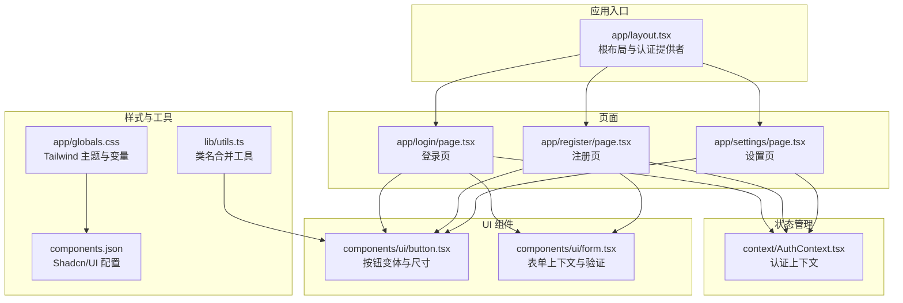
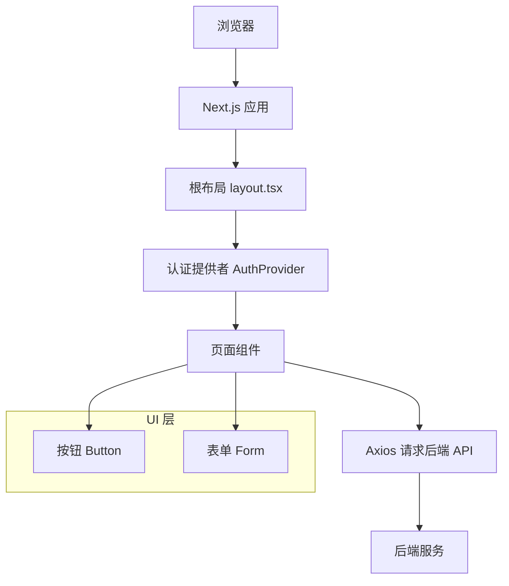
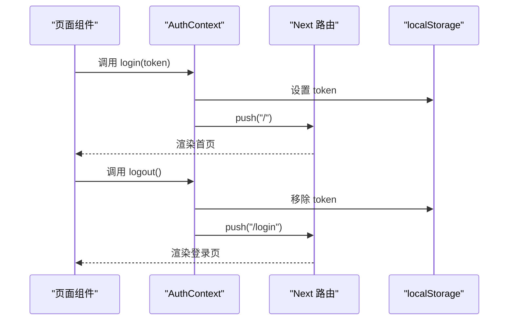
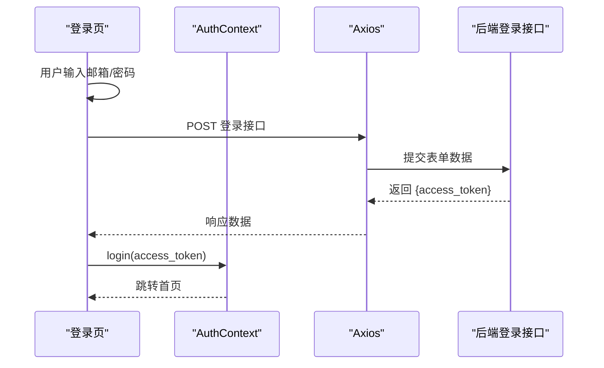
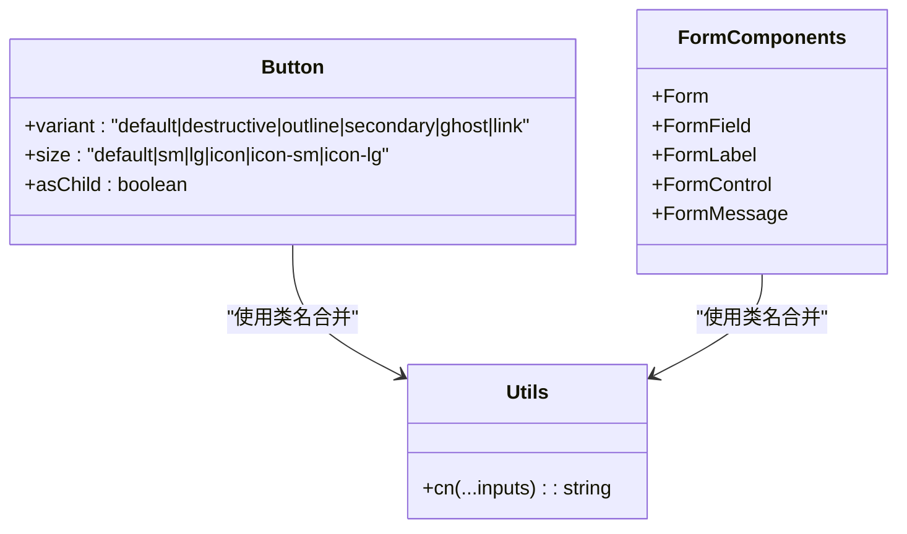
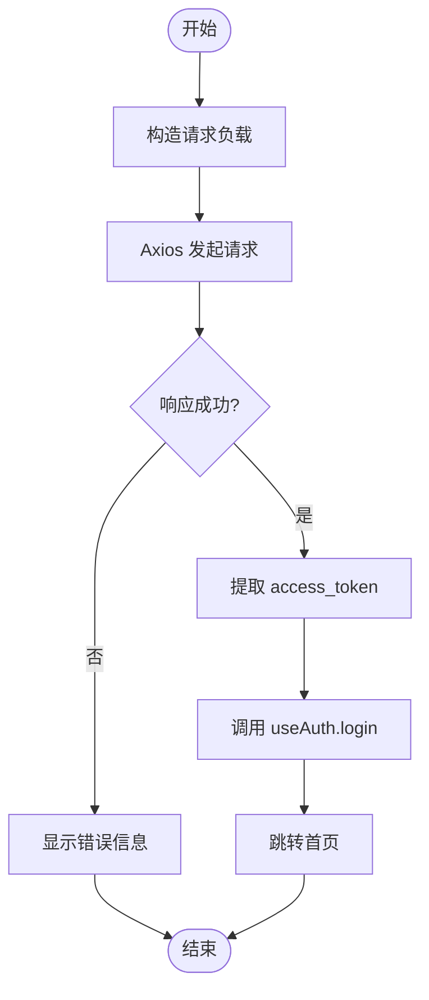
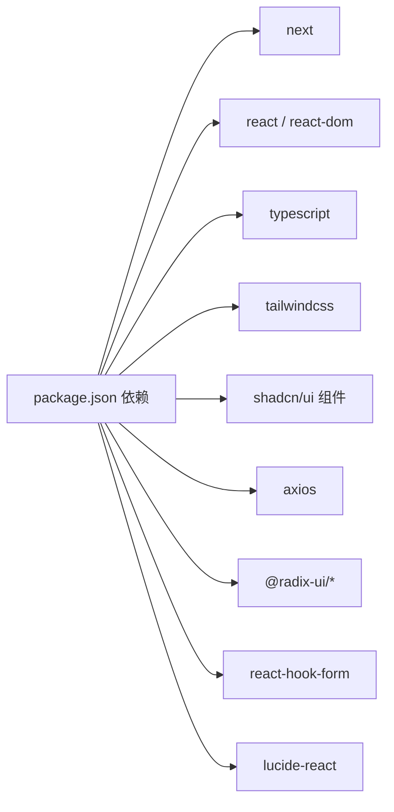

# 前端开发指南

<cite>
**本文档引用的文件**
- [package.json](file://frontend/package.json)
- [next.config.ts](file://frontend/next.config.ts)
- [tsconfig.json](file://frontend/tsconfig.json)
- [layout.tsx](file://frontend/app/layout.tsx)
- [AuthContext.tsx](file://frontend/context/AuthContext.tsx)
- [button.tsx](file://frontend/components/ui/button.tsx)
- [form.tsx](file://frontend/components/ui/form.tsx)
- [globals.css](file://frontend/app/globals.css)
- [utils.ts](file://frontend/lib/utils.ts)
- [components.json](file://frontend/components.json)
- [page.tsx（登录）](file://frontend/app/login/page.tsx)
- [page.tsx（注册）](file://frontend/app/register/page.tsx)
- [page.tsx（设置）](file://frontend/app/settings/page.tsx)
- [eslint.config.mjs](file://frontend/eslint.config.mjs)
- [postcss.config.mjs](file://frontend/postcss.config.mjs)
- [api.ts（用户）](file://frontend/features/user/api.ts)
- [index.ts（类型）](file://frontend/types/index.ts)
- [schema.d.ts（类型）](file://frontend/types/schema.d.ts)
</cite>

## 更新摘要
**变更内容**
- 新增Tavily API密钥管理功能，增强用户凭证配置体验
- 更新设置页面的AI配置部分，增加Tavily搜索API密钥管理
- 扩展用户凭证类型定义，支持动态提供者配置
- 增强设置页面的用户凭证管理功能

## 目录
1. [简介](#简介)
2. [项目结构](#项目结构)
3. [核心组件](#核心组件)
4. [架构总览](#架构总览)
5. [详细组件分析](#详细组件分析)
6. [依赖关系分析](#依赖关系分析)
7. [性能考量](#性能考量)
8. [故障排除指南](#故障排除指南)
9. [结论](#结论)
10. [附录](#附录)

## 简介
本指南面向前端开发者，系统讲解基于 Next.js 的前端应用架构与 React 组件设计模式，涵盖状态管理（Context API 与认证）、UI 组件库（Shadcn/UI）的定制与扩展、路由与页面导航、API 集成（Axios 封装与错误处理）、组件开发最佳实践（响应式与可访问性）、构建配置与部署流程、以及开发工具（ESLint、Prettier、TypeScript）的使用与调试技巧。

## 项目结构
前端采用 Next.js App Router 结构，根布局负责全局样式与认证上下文注入；页面位于 app 下按功能模块组织；UI 组件位于 components/ui；通用工具函数位于 lib；Shadcn/UI 配置位于 components.json。

**图表来源**
- [layout.tsx:20-38](file://frontend/app/layout.tsx#L20-L38)
- [AuthContext.tsx:15-51](file://frontend/context/AuthContext.tsx#L15-L51)
- [button.tsx:39-60](file://frontend/components/ui/button.tsx#L39-L60)
- [form.tsx:19-88](file://frontend/components/ui/form.tsx#L19-L88)
- [globals.css:1-141](file://frontend/app/globals.css#L1-L141)
- [utils.ts:4-6](file://frontend/lib/utils.ts#L4-L6)
- [components.json:1-23](file://frontend/components.json#L1-L23)

**章节来源**
- [layout.tsx:1-39](file://frontend/app/layout.tsx#L1-L39)
- [components.json:1-23](file://frontend/components.json#L1-L23)

## 核心组件
- 认证上下文：提供 token 存取、登录登出与认证状态判断，结合本地存储与路由跳转。
- UI 组件库：基于 Shadcn/UI 的按钮与表单组件，支持变体、尺寸与可组合性。
- 全局样式：Tailwind 与自定义 CSS 变量，支持明暗主题切换与滚动条定制。
- 工具函数：类名合并工具，简化变体与条件样式的拼接。

**章节来源**
- [AuthContext.tsx:1-60](file://frontend/context/AuthContext.tsx#L1-L60)
- [button.tsx:1-63](file://frontend/components/ui/button.tsx#L1-L63)
- [form.tsx:1-168](file://frontend/components/ui/form.tsx#L1-L168)
- [globals.css:1-141](file://frontend/app/globals.css#L1-L141)
- [utils.ts:1-7](file://frontend/lib/utils.ts#L1-L7)

## 架构总览
Next.js 应用通过根布局注入认证提供者，所有页面共享认证状态；页面内通过 Axios 调用后端接口，完成用户认证与设置更新；UI 组件统一风格并通过 Shadcn/UI 配置进行定制。

**图表来源**
- [layout.tsx:20-38](file://frontend/app/layout.tsx#L20-L38)
- [AuthContext.tsx:15-51](file://frontend/context/AuthContext.tsx#L15-L51)
- [page.tsx（登录）:19-42](file://frontend/app/login/page.tsx#L19-L42)
- [page.tsx（设置）:27-58](file://frontend/app/settings/page.tsx#L27-L58)

## 详细组件分析

### 认证上下文（AuthContext）
- 设计要点
  - 使用 React Context 暴露 token、login、logout 与 isAuthenticated。
  - 初始化时从本地存储恢复 token。
  - 登录成功写入本地存储并跳转首页；登出清理并跳转登录页。
- 数据流
  - 页面调用 useAuth 获取上下文，触发登录/登出。
  - 上下文内部维护状态并驱动路由跳转。
- 错误处理
  - 若未在 AuthProvider 内使用 useAuth，抛出明确错误提示。

**图表来源**
- [AuthContext.tsx:27-37](file://frontend/context/AuthContext.tsx#L27-L37)
- [layout.tsx:32-34](file://frontend/app/layout.tsx#L32-L34)

**章节来源**
- [AuthContext.tsx:1-60](file://frontend/context/AuthContext.tsx#L1-L60)

### 登录页（App Router 页面）
- 功能概述
  - 表单收集邮箱与密码，提交到后端登录接口。
  - 成功后从响应中提取 token 并通过 useAuth 登录。
  - 失败时显示后端返回的错误信息。
- 技术要点
  - 使用 Card、Button、Input、Label 组合 UI。
  - Axios 发送表单数据，设置 Content-Type 为 application/x-www-form-urlencoded。
  - 加载态与错误态控制。

**图表来源**
- [page.tsx（登录）:19-42](file://frontend/app/login/page.tsx#L19-L42)
- [AuthContext.tsx:27-31](file://frontend/context/AuthContext.tsx#L27-L31)

**章节来源**
- [page.tsx（登录）:1-89](file://frontend/app/login/page.tsx#L1-L89)

### 注册页（App Router 页面）
- 功能概述
  - 表单提交邮箱与密码到后端注册接口。
  - 成功后自动登录并跳转首页。
- 技术要点
  - Axios 以 JSON 形式发送数据。
  - 错误信息展示与加载态控制。

**章节来源**
- [page.tsx（注册）:1-84](file://frontend/app/register/page.tsx#L1-L84)

### 设置页（App Router 页面）
- 功能概述
  - 加载用户资料，支持保存 Gemini API Key 与选择数据源偏好。
  - 支持回退机制：若首选源失败则自动切换另一个。
  - **新增**：Tavily API密钥管理功能，支持保存和管理Tavily搜索API密钥。
- 技术要点
  - 通过自定义 API 方法（getProfile、updateSettings）与后端交互。
  - 使用图标与卡片布局提升可读性与可用性。
  - **新增**：动态提供者配置支持，允许用户管理不同服务的API密钥。

**更新** 新增Tavily API密钥管理功能，用户可以在设置页面中保存和管理Tavily搜索API密钥，支持密钥状态显示和覆盖更新。

**章节来源**
- [page.tsx（设置）:1-898](file://frontend/app/settings/page.tsx#L1-L898)

### 用户凭证管理（新增功能）
- 功能概述
  - 支持动态提供者配置，包括Tavily、DeepSeek、SiliconFlow等API密钥管理。
  - 提供密钥状态检测和显示功能。
  - 支持密钥的保存、清空和状态切换。
- 技术要点
  - 使用provider_credentials字段管理不同服务的凭证。
  - 通过hasSavedTavilyKey状态跟踪密钥保存状态。
  - 支持密钥的密码输入和安全显示。

**章节来源**
- [page.tsx（设置）:102-122](file://frontend/app/settings/page.tsx#L102-L122)
- [page.tsx（设置）:401-425](file://frontend/app/settings/page.tsx#L401-L425)
- [index.ts（类型）:63-78](file://frontend/types/index.ts#L63-L78)

### UI 组件库（Shadcn/UI）与定制
- 组件设计
  - Button：支持多种变体与尺寸，使用 class-variance-authority 与 cn 合并类名。
  - Form：提供 Form、FormField、FormLabel、FormControl、FormMessage 等上下文组件，配合 react-hook-form 实现受控表单与验证。
- 定制与扩展
  - 通过 components.json 配置主题风格、Tailwind 路径、CSS 变量开关与别名。
  - 在 globals.css 中定义 CSS 变量与明暗主题映射，实现主题一致性。

**图表来源**
- [button.tsx:7-37](file://frontend/components/ui/button.tsx#L7-L37)
- [form.tsx:19-167](file://frontend/components/ui/form.tsx#L19-L167)
- [utils.ts:4-6](file://frontend/lib/utils.ts#L4-L6)
- [components.json:1-23](file://frontend/components.json#L1-L23)

**章节来源**
- [button.tsx:1-63](file://frontend/components/ui/button.tsx#L1-L63)
- [form.tsx:1-168](file://frontend/components/ui/form.tsx#L1-L168)
- [utils.ts:1-7](file://frontend/lib/utils.ts#L1-L7)
- [components.json:1-23](file://frontend/components.json#L1-L23)

### 全局样式与主题
- Tailwind 配置
  - 使用 CSS 变量定义颜色与圆角等主题变量。
  - 明暗主题通过 :root 与 .dark 选择器切换。
  - 自定义滚动条样式，适配浅色/深色背景。
- 样式层
  - base 层应用基础边框与文本颜色。
  - utilities 层提供可复用的滚动条样式类。

**章节来源**
- [globals.css:1-141](file://frontend/app/globals.css#L1-L141)

### 路由与页面导航
- 根布局
  - 在根布局中注入 AuthProvider，确保所有子页面共享认证状态。
  - 引入字体资源与全局样式。
- 页面跳转
  - 登录/登出通过 Next 路由 push 进行页面跳转。
  - 页面内使用 Link 组件进行客户端导航。

**章节来源**
- [layout.tsx:1-39](file://frontend/app/layout.tsx#L1-L39)
- [AuthContext.tsx:30-37](file://frontend/context/AuthContext.tsx#L30-L37)

### API 集成与错误处理
- Axios 封装
  - 登录页使用表单编码提交，设置 Content-Type。
  - 注册页直接传递对象，由 Axios 自动序列化。
  - 设置页通过自定义方法封装 getProfile 与 updateSettings。
- 错误处理
  - 统一捕获异常，读取后端返回的 detail 字段作为错误消息。
  - 提供加载态与错误态 UI 反馈。

**图表来源**
- [page.tsx（登录）:24-42](file://frontend/app/login/page.tsx#L24-L42)
- [page.tsx（注册）:24-37](file://frontend/app/register/page.tsx#L24-L37)
- [page.tsx（设置）:38-58](file://frontend/app/settings/page.tsx#L38-L58)

**章节来源**
- [page.tsx（登录）:1-89](file://frontend/app/login/page.tsx#L1-L89)
- [page.tsx（注册）:1-84](file://frontend/app/register/page.tsx#L1-L84)
- [page.tsx（设置）:1-898](file://frontend/app/settings/page.tsx#L1-L898)

## 依赖关系分析
- 依赖概览
  - Next.js 16、React 19、TypeScript、Tailwind CSS v4、Shadcn/UI、Axios、Radix UI、Hook Form、Lucide Icons 等。
- 关键依赖链
  - UI 组件依赖 class-variance-authority、clsx、tailwind-merge。
  - 表单组件依赖 react-hook-form 与 @radix-ui/react-label、@radix-ui/react-slot。
  - 样式系统依赖 Tailwind 与自定义 CSS 变量。

**图表来源**
- [package.json:11-41](file://frontend/package.json#L11-L41)

**章节来源**
- [package.json:1-43](file://frontend/package.json#L1-L43)

## 性能考量
- 构建与运行
  - 使用 Next.js 开发服务器与生产构建脚本，充分利用增量编译与类型检查。
- 样式与渲染
  - Tailwind CSS 变量与明暗主题切换避免重复计算，减少运行时开销。
  - 组件变体与尺寸通过 class-variance-authority 预编译，降低运行时判断成本。
- 网络请求
  - 合理使用加载态与错误态，避免不必要的重复请求。
  - 对于高频设置更新，可在前端做简单校验后再发起请求。

## 故障排除指南
- 认证相关
  - useAuth 必须在 AuthProvider 内使用，否则会抛出错误。请确认根布局已注入 AuthProvider。
  - 登录后未跳转：检查路由 push 是否被拦截或重定向逻辑是否覆盖。
- 样式问题
  - 主题不生效：检查 CSS 变量是否正确注入，以及明暗类是否添加到 html/body。
  - 组件样式错乱：确认 class-variance-authority 与 cn 的使用顺序与参数。
- API 调用
  - 登录/注册失败：查看后端返回的 detail 字段，确认用户名/密码格式与网络连通性。
  - 设置保存无反馈：检查 message 状态与按钮禁用逻辑。
- **新增**：Tavily API密钥管理问题
  - 密钥保存失败：检查API密钥格式和有效性，确认网络连接正常。
  - 密钥状态显示异常：检查hasSavedTavilyKey状态更新逻辑。
  - 密钥覆盖更新：确认输入框占位符和状态提示信息正确显示。

**章节来源**
- [AuthContext.tsx:53-59](file://frontend/context/AuthContext.tsx#L53-L59)
- [layout.tsx:28-36](file://frontend/app/layout.tsx#L28-L36)
- [page.tsx（登录）:37-42](file://frontend/app/login/page.tsx#L37-L42)
- [page.tsx（设置）:98-102](file://frontend/app/settings/page.tsx#L98-L102)

## 结论
本项目采用现代前端技术栈，通过 Next.js App Router、Context API、Shadcn/UI 组件库与 Tailwind CSS 实现了清晰的架构与一致的 UI 风格。认证状态集中管理，API 调用封装明确，开发工具链完善。遵循本文档的最佳实践，可高效迭代功能并保持代码质量与用户体验。

**更新** 最新的认证界面改进包括Tavily API密钥管理功能，显著增强了用户凭证配置体验，支持动态提供者配置和安全的密钥管理。

## 附录

### 开发工具配置
- TypeScript
  - 编译选项启用严格模式、ESNext 模块解析、路径别名与增量编译。
- ESLint
  - 基于 eslint-config-next 的规则，自定义忽略目录与全局规则。
- PostCSS/Tailwind
  - 使用 @tailwindcss/postcss 插件，CSS 变量与明暗主题在全局样式中集中管理。

**章节来源**
- [tsconfig.json:1-43](file://frontend/tsconfig.json#L1-L43)
- [eslint.config.mjs:1-19](file://frontend/eslint.config.mjs#L1-L19)
- [postcss.config.mjs:1-8](file://frontend/postcss.config.mjs#L1-L8)

### 类型定义扩展
- **新增**：UserProviderCredentialInput和UserProviderCredentialResponse类型
  - 支持动态提供者配置，包括api_key、base_url和is_enabled字段。
  - UserProfile类型扩展，支持provider_credentials字段管理用户凭证。
  - UserSettingsUpdate类型扩展，支持provider_credentials字段更新用户设置。

**章节来源**
- [index.ts（类型）:63-78](file://frontend/types/index.ts#L63-L78)
- [schema.d.ts（类型）:875-942](file://frontend/types/schema.d.ts#L875-L942)