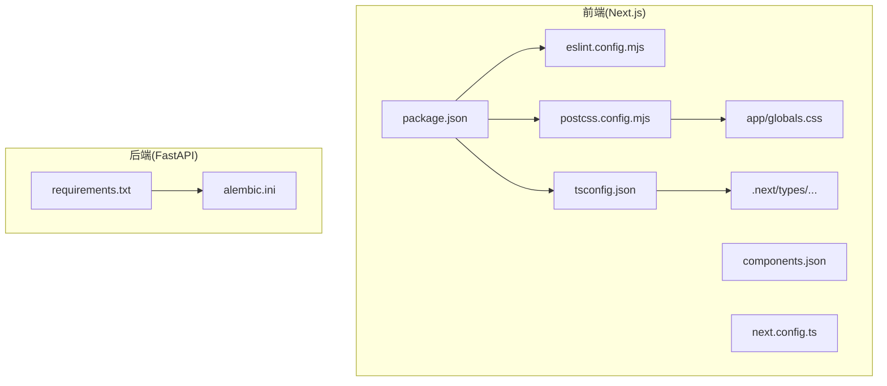
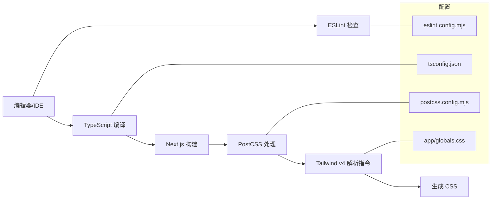
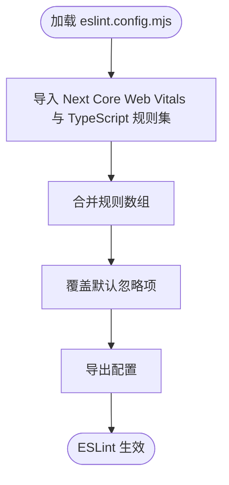
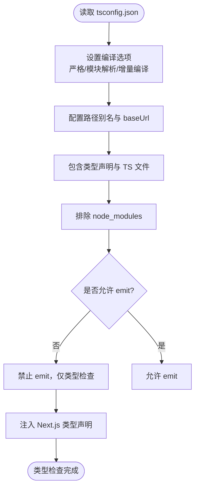
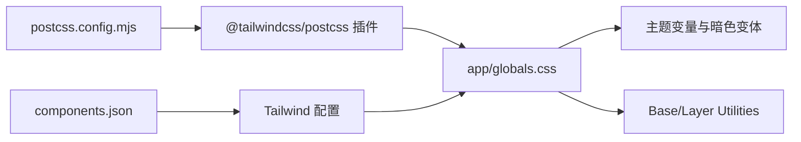
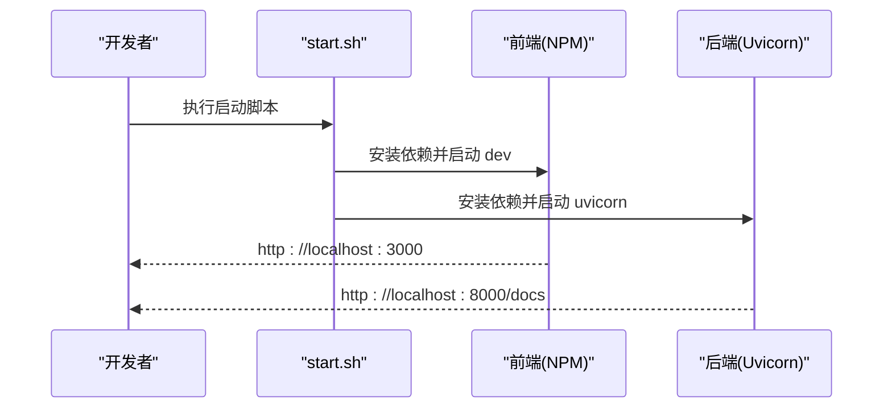
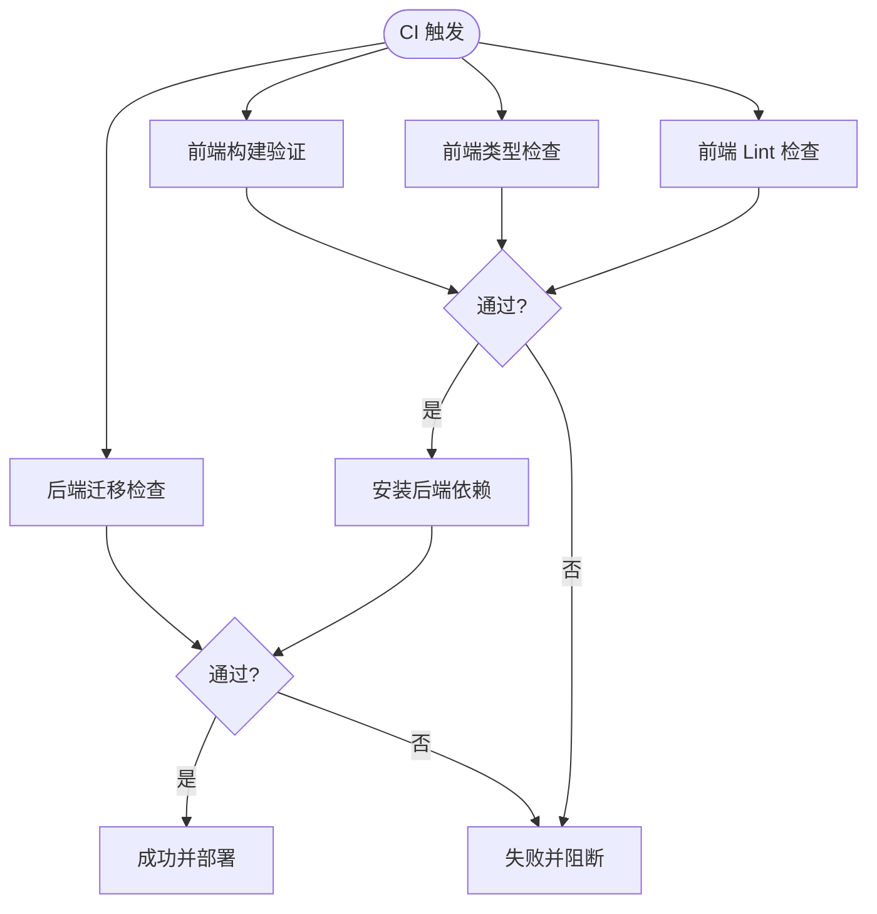
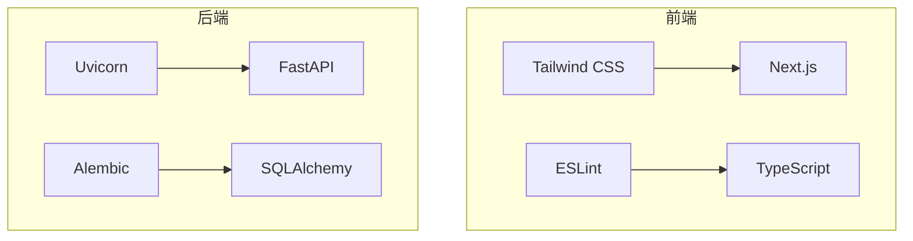

# 开发工具配置

<cite>
**本文引用的文件**
- [package.json](file://frontend/package.json)
- [eslint.config.mjs](file://frontend/eslint.config.mjs)
- [postcss.config.mjs](file://frontend/postcss.config.mjs)
- [tsconfig.json](file://frontend/tsconfig.json)
- [components.json](file://frontend/components.json)
- [next.config.ts](file://frontend/next.config.ts)
- [globals.css](file://frontend/app/globals.css)
- [next-env.d.ts](file://frontend/next-env.d.ts)
- [.gitignore](file://frontend/.gitignore)
- [start.sh](file://start.sh)
- [requirements.txt](file://backend/requirements.txt)
- [alembic.ini](file://backend/alembic.ini)
- [README.md](file://README.md)
- [tech_stack.md](file://doc/tech_stack.md)
- [PRD.md](file://doc/PRD.md)
- [Database Schema & Data Flow Specification.md](file://doc/Database Schema & Data Flow Specification.md)
</cite>

## 目录
1. [简介](#简介)
2. [项目结构](#项目结构)
3. [核心组件](#核心组件)
4. [架构总览](#架构总览)
5. [详细组件分析](#详细组件分析)
6. [依赖分析](#依赖分析)
7. [性能考量](#性能考量)
8. [故障排查指南](#故障排查指南)
9. [结论](#结论)
10. [附录](#附录)

## 简介
本指南面向开发团队，系统化梳理前端开发工具链的配置与最佳实践，覆盖 ESLint 语法检查、TypeScript 类型检查、Prettier 格式化、PostCSS 与 Tailwind CSS 集成、Git 钩子与提交规范、本地开发与调试、以及持续集成与代码质量保障。文档以仓库现有配置为基础，结合 Next.js 16、Tailwind CSS v4、TypeScript 5 与 Python 后端技术栈，给出可操作的设置步骤与优化建议。

## 项目结构
前端采用 Next.js App Router 目录结构，关键配置集中在 frontend 目录；后端使用 FastAPI + Alembic 进行数据库迁移与版本控制。整体通过启动脚本统一拉起前后端服务，便于本地联调。

**图表来源**
- [package.json](file://frontend/package.json#L1-L43)
- [eslint.config.mjs](file://frontend/eslint.config.mjs#L1-L19)
- [tsconfig.json](file://frontend/tsconfig.json#L1-L43)
- [postcss.config.mjs](file://frontend/postcss.config.mjs#L1-L8)
- [globals.css](file://frontend/app/globals.css#L1-L141)
- [components.json](file://frontend/components.json#L1-L23)
- [next.config.ts](file://frontend/next.config.ts#L1-L8)
- [next-env.d.ts](file://frontend/next-env.d.ts#L1-L7)
- [requirements.txt](file://backend/requirements.txt#L1-L75)
- [alembic.ini](file://backend/alembic.ini#L1-L148)

**章节来源**
- [README.md](file://README.md#L1-L50)
- [tech_stack.md](file://doc/tech_stack.md#L1-L51)

## 核心组件
- ESLint 配置：基于 Next.js 推荐配置，启用 Core Web Vitals 与 TypeScript 支持，并自定义忽略项。
- TypeScript 编译配置：严格模式、隔离模块、路径别名、增量编译等，确保类型安全与构建性能。
- PostCSS/Tailwind CSS：Tailwind v4 与 PostCSS 集成，全局样式与暗色主题变量。
- 组件库与工具：shadcn/ui 配置、clsx/tailwind-merge、lucide-react 图标。
- 启动与运行：统一启动脚本，分别安装依赖并启动前端与后端服务。

**章节来源**
- [package.json](file://frontend/package.json#L1-L43)
- [eslint.config.mjs](file://frontend/eslint.config.mjs#L1-L19)
- [tsconfig.json](file://frontend/tsconfig.json#L1-L43)
- [postcss.config.mjs](file://frontend/postcss.config.mjs#L1-L8)
- [globals.css](file://frontend/app/globals.css#L1-L141)
- [components.json](file://frontend/components.json#L1-L23)
- [next.config.ts](file://frontend/next.config.ts#L1-L8)
- [next-env.d.ts](file://frontend/next-env.d.ts#L1-L7)
- [start.sh](file://start.sh#L1-L44)

## 架构总览
下图展示前端开发工具链与样式管线的关键交互：编辑器触发 ESLint/TS 检查，构建时由 PostCSS 处理 Tailwind 指令，最终输出带类名与主题变量的 CSS。

**图表来源**
- [eslint.config.mjs](file://frontend/eslint.config.mjs#L1-L19)
- [tsconfig.json](file://frontend/tsconfig.json#L1-L43)
- [postcss.config.mjs](file://frontend/postcss.config.mjs#L1-L8)
- [globals.css](file://frontend/app/globals.css#L1-L141)

## 详细组件分析

### ESLint 配置与规则定制
- 配置入口：使用模块化配置导出，组合 Next.js Core Web Vitals 与 TypeScript 规则集。
- 忽略项覆盖：显式重写默认忽略列表，确保构建产物与类型声明参与检查。
- 与 Next.js 集成：通过 Next.js 内置规则集保证 App Router 场景下的最佳实践。

**图表来源**
- [eslint.config.mjs](file://frontend/eslint.config.mjs#L1-L19)

**章节来源**
- [eslint.config.mjs](file://frontend/eslint.config.mjs#L1-L19)
- [package.json](file://frontend/package.json#L36-L37)

### TypeScript 编译配置与类型检查最佳实践
- 严格模式：开启严格类型检查，提升类型安全性。
- 模块解析：使用 Bundler 解析策略，适配 App Router 与路径别名。
- 路径别名：配置 baseUrl 与 paths，简化导入路径。
- 增量编译：启用增量编译，缩短开发时编译时间。
- 仅类型检查：构建阶段禁止 emit，避免产出 JS，保持纯类型检查流程。
- Next 类型注入：通过 next-env.d.ts 注入 Next.js 类型声明。

**图表来源**
- [tsconfig.json](file://frontend/tsconfig.json#L1-L43)
- [next-env.d.ts](file://frontend/next-env.d.ts#L1-L7)

**章节来源**
- [tsconfig.json](file://frontend/tsconfig.json#L1-L43)
- [next-env.d.ts](file://frontend/next-env.d.ts#L1-L7)

### Prettier 代码格式化与自动化流程
- 作用定位：本项目未提供 Prettier 配置文件，建议在团队内统一格式化策略，避免与 ESLint 规则冲突。
- 推荐实践：
  - 使用编辑器插件在保存时自动格式化。
  - 在 CI 中增加格式化检查步骤，确保提交代码风格一致。
  - 若引入 Prettier，请将其规则与 ESLint 配置对齐，避免重复检查。

[本节为通用指导，不直接分析具体文件，故无“章节来源”]

### PostCSS 与 Tailwind CSS 集成
- PostCSS 插件：通过 @tailwindcss/postcss 插件启用 Tailwind v4 指令解析。
- 全局样式：在 app/globals.css 中引入 tailwindcss 与 tw-animate-css，并定义暗色主题变量与自定义层。
- 组件库：shadcn/ui 通过 components.json 配置 Tailwind、CSS 变量、前缀与别名，确保组件样式一致性。

**图表来源**
- [postcss.config.mjs](file://frontend/postcss.config.mjs#L1-L8)
- [globals.css](file://frontend/app/globals.css#L1-L141)
- [components.json](file://frontend/components.json#L1-L23)

**章节来源**
- [postcss.config.mjs](file://frontend/postcss.config.mjs#L1-L8)
- [globals.css](file://frontend/app/globals.css#L1-L141)
- [components.json](file://frontend/components.json#L1-L23)

### Git 钩子与提交规范
- 当前状态：仓库未包含 husky、lint-staged、commitlint 等 Git 钩子相关配置。
- 建议方案：
  - 提交前检查：使用 lint-staged 对暂存文件执行 ESLint/TS 检查与格式化。
  - 提交信息：引入 conventional commits 并在 CI 中校验提交信息格式。
  - 与 CI 集成：在流水线中加入 lint、type-check、test 步骤，确保主干稳定。

[本节为通用指导，不直接分析具体文件，故无“章节来源”]

### 本地开发与调试工具
- 统一启动：使用 start.sh 同时启动前端与后端服务，自动安装依赖并打印访问地址。
- 前端开发：通过 npm run dev 启动 Next.js 开发服务器，支持热更新与类型检查。
- 后端开发：通过 uvicorn 启动 FastAPI 应用，支持热重载与 API 文档。

**图表来源**
- [start.sh](file://start.sh#L1-L44)
- [README.md](file://README.md#L14-L43)

**章节来源**
- [start.sh](file://start.sh#L1-L44)
- [README.md](file://README.md#L14-L43)
- [package.json](file://frontend/package.json#L5-L10)

### 代码质量检查与持续集成建议
- 前端质量门禁：
  - Lint：npm run lint（基于 ESLint 配置）。
  - 类型检查：TypeScript 编译配置禁止 emit，CI 中单独执行类型检查。
  - 构建验证：next build 通过后再进行部署。
- 后端质量门禁：
  - 依赖安装：pip install -r requirements.txt。
  - 数据库迁移：使用 Alembic 进行迁移与版本控制，可在 CI 中执行迁移以验证变更。
  - 日志级别：根据 alembic.ini 设置日志级别，便于问题定位。

**图表来源**
- [package.json](file://frontend/package.json#L9-L9)
- [tsconfig.json](file://frontend/tsconfig.json#L11-L12)
- [alembic.ini](file://backend/alembic.ini#L84-L87)

**章节来源**
- [package.json](file://frontend/package.json#L9-L9)
- [tsconfig.json](file://frontend/tsconfig.json#L11-L12)
- [alembic.ini](file://backend/alembic.ini#L84-L87)

### 开发效率工具与快捷键
- 编辑器插件：
  - ESLint/TypeScript 插件：实时错误与类型提示。
  - Tailwind CSS 插件：智能类名补全与预览。
  - shadcn/ui 插件：一键安装与配置组件。
- 快捷键建议：
  - 保存即格式化：在编辑器中配置保存时自动格式化。
  - 快速修复：利用 ESLint 的自动修复能力减少手工修改。
  - 组件生成：通过 shadcn/ui CLI 快速生成符合设计系统的组件。

[本节为通用指导，不直接分析具体文件，故无“章节来源”]

## 依赖分析
- 前端依赖：Next.js 16、TypeScript 5、Tailwind CSS v4、shadcn/ui、React 生态等。
- 后端依赖：FastAPI、Uvicorn、SQLAlchemy、Alembic、Pydantic 等。
- 配置耦合：前端 ESLint/TS/Prettier 与构建管线紧密耦合；Tailwind 与 PostCSS 影响样式输出；后端 Alembic 与数据库迁移流程决定数据演进路径。

**图表来源**
- [package.json](file://frontend/package.json#L11-L41)
- [requirements.txt](file://backend/requirements.txt#L1-L75)

**章节来源**
- [package.json](file://frontend/package.json#L11-L41)
- [requirements.txt](file://backend/requirements.txt#L1-L75)

## 性能考量
- 增量编译：TypeScript 启用增量编译，缩短开发时编译时间。
- 构建产物：严格模式下禁止 emit，确保仅做类型检查，减少构建开销。
- 样式管线：Tailwind v4 指令在构建时解析，建议配合 Purge/Tree-shaking 优化产物体积。
- 依赖安装：统一使用 NPM/Yarn/Pip，避免多包管理器造成的缓存与版本差异。

[本节为通用指导，不直接分析具体文件，故无“章节来源”]

## 故障排查指南
- 启动失败：
  - 检查 Node.js 与 Python3 是否安装，查看 start.sh 的依赖检测输出。
  - 前端依赖：在 frontend 目录执行安装命令，确认网络与缓存正常。
  - 后端依赖：在 backend 目录执行安装命令，确认虚拟环境与权限。
- 类型错误：
  - 在本地执行类型检查，定位问题文件与行号，逐步缩小范围。
  - 检查 tsconfig.json 的 include/exclude 与路径别名配置。
- 样式异常：
  - 确认 app/globals.css 中 Tailwind 指令与主题变量正确。
  - 检查 components.json 的 Tailwind 配置与别名映射。
- ESLint 报错：
  - 查看 eslint.config.mjs 的规则合并与忽略项覆盖，必要时调整规则或忽略路径。

**章节来源**
- [start.sh](file://start.sh#L8-L17)
- [tsconfig.json](file://frontend/tsconfig.json#L32-L42)
- [globals.css](file://frontend/app/globals.css#L1-L141)
- [components.json](file://frontend/components.json#L6-L12)
- [eslint.config.mjs](file://frontend/eslint.config.mjs#L8-L16)

## 结论
本项目已具备完善的前端开发工具链基础：ESLint、TypeScript、Tailwind CSS v4 与 Next.js 16。建议在现有基础上补充 Prettier 统一格式化、Git 钩子与提交规范、以及 CI 中的类型检查与构建验证，形成从本地到远端的一致质量门禁，进一步提升开发效率与代码稳定性。

## 附录
- 术语说明：
  - App Router：Next.js 13+ 的应用路由结构，强调目录即路由与流式渲染。
  - Core Web Vitals：Google 定义的用户体验指标，ESLint 集成用于约束性能与体验。
  - Tailwind v4：新一代 Tailwind 指令解析与主题系统，需配合 PostCSS 插件使用。
- 参考文档：
  - Next.js 技术栈与开发指南：参见技术栈文档。
  - 产品需求与数据库设计：参见 PRD 与数据库文档，有助于理解前端组件与数据流。

**章节来源**
- [tech_stack.md](file://doc/tech_stack.md#L11-L30)
- [PRD.md](file://doc/PRD.md#L91-L98)
- [Database Schema & Data Flow Specification.md](file://doc/Database Schema & Data Flow Specification.md#L1-L108)