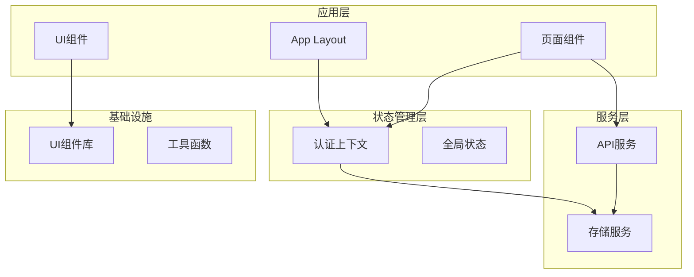
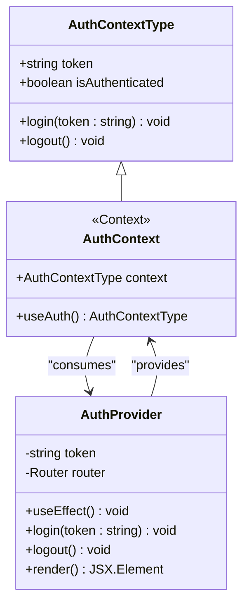
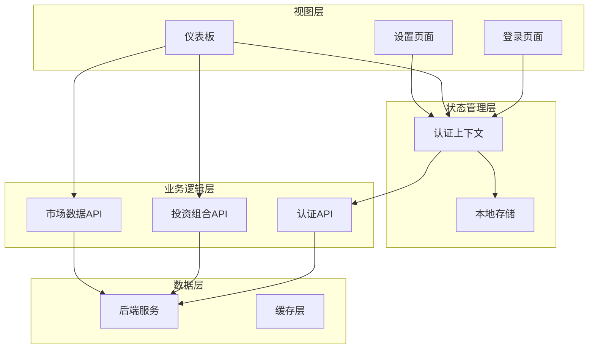
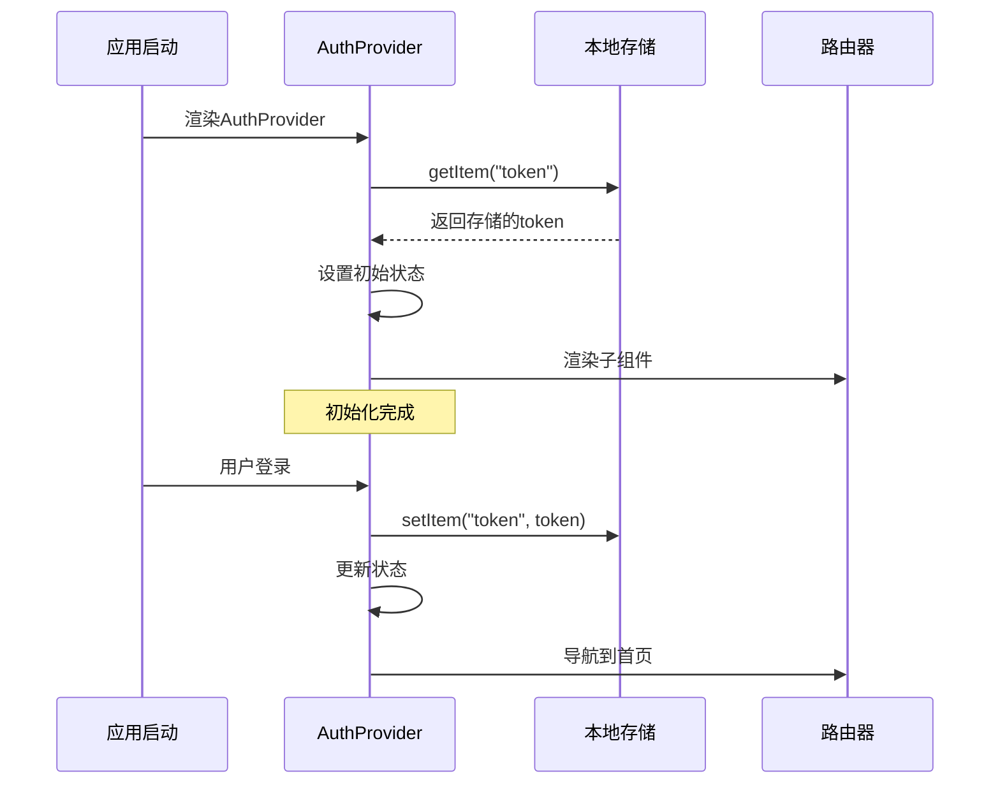
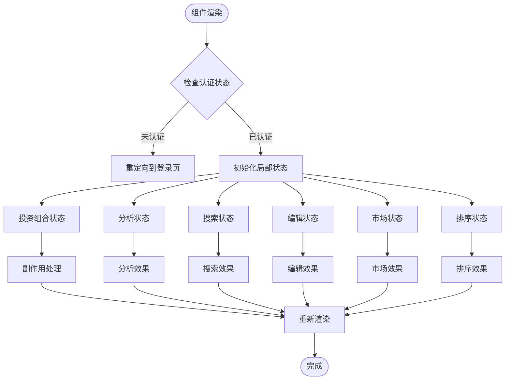
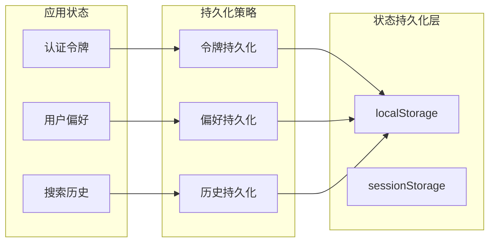
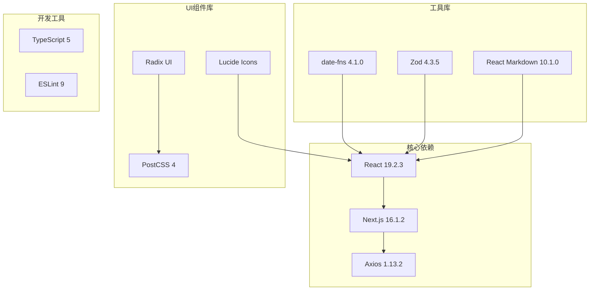
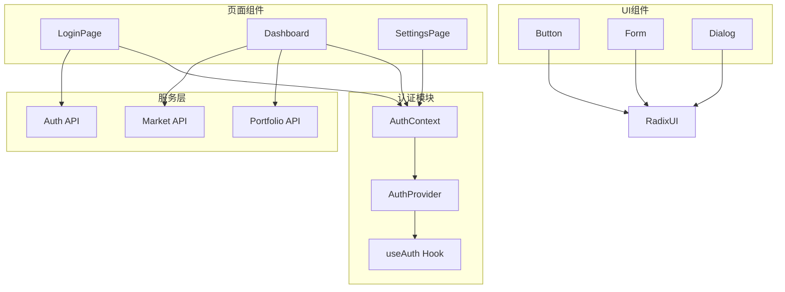

# 状态管理策略

<cite>
**本文档引用的文件**
- [AuthContext.tsx](file://frontend/context/AuthContext.tsx)
- [layout.tsx](file://frontend/app/layout.tsx)
- [page.tsx](file://frontend/app/page.tsx)
- [login/page.tsx](file://frontend/app/login/page.tsx)
- [settings/page.tsx](file://frontend/app/settings/page.tsx)
- [button.tsx](file://frontend/components/ui/button.tsx)
- [form.tsx](file://frontend/components/ui/form.tsx)
- [package.json](file://frontend/package.json)
- [README.md](file://README.md)
</cite>

## 目录
1. [引言](#引言)
2. [项目结构](#项目结构)
3. [核心组件](#核心组件)
4. [架构概览](#架构概览)
5. [详细组件分析](#详细组件分析)
6. [依赖关系分析](#依赖关系分析)
7. [性能考虑](#性能考虑)
8. [故障排除指南](#故障排除指南)
9. [结论](#结论)
10. [附录](#附录)

## 引言

本指南深入解析了基于React Context API构建的状态管理系统，特别聚焦于认证状态管理（AuthContext）的设计与实现。该系统采用最小化但功能完整的状态管理模式，通过Context API实现了全局状态共享，同时保持了良好的性能表现和可维护性。

该项目是一个AI驱动的股票分析平台，前端采用Next.js框架，后端使用FastAPI，形成了完整的全栈应用架构。状态管理策略体现了现代React应用的最佳实践，包括状态提升、状态下沉的决策原则，以及持久化方案的选择。

## 项目结构

前端项目采用Next.js的应用程序目录结构，主要分为以下几个层次：



**图表来源**
- [layout.tsx](file://frontend/app/layout.tsx#L20-L35)
- [AuthContext.tsx](file://frontend/context/AuthContext.tsx#L15-L51)

**章节来源**
- [layout.tsx](file://frontend/app/layout.tsx#L1-L39)
- [package.json](file://frontend/package.json#L1-L43)

## 核心组件

### 认证上下文（AuthContext）

AuthContext是整个状态管理系统的核心，实现了用户认证状态的全局管理。其设计遵循了React Context的最佳实践，提供了类型安全的接口和完善的错误处理机制。



**图表来源**
- [AuthContext.tsx](file://frontend/context/AuthContext.tsx#L6-L13)
- [AuthContext.tsx](file://frontend/context/AuthContext.tsx#L15-L51)

### 全局状态管理

系统中的全局状态主要包括：
- **认证状态**：用户登录状态和访问令牌
- **市场状态**：实时市场开闭状态和倒计时
- **应用配置**：用户偏好设置和API密钥

**章节来源**
- [AuthContext.tsx](file://frontend/context/AuthContext.tsx#L1-L60)
- [page.tsx](file://frontend/app/page.tsx#L30-L90)

## 架构概览

系统采用分层架构设计，每层都有明确的职责分工：



**图表来源**
- [login/page.tsx](file://frontend/app/login/page.tsx#L12-L42)
- [page.tsx](file://frontend/app/page.tsx#L179-L194)
- [settings/page.tsx](file://frontend/app/settings/page.tsx#L13-L36)

## 详细组件分析

### 认证上下文实现

AuthContext采用了完整的Context API模式，实现了以下关键特性：

#### 状态初始化与持久化



**图表来源**
- [AuthContext.tsx](file://frontend/context/AuthContext.tsx#L19-L31)

#### 登录流程

登录流程体现了状态提升和状态下沉的平衡策略：

1. **状态提升**：登录成功后的token状态提升到全局Context
2. **状态下沉**：具体的UI组件通过useAuth钩子消费状态
3. **持久化**：token自动保存到localStorage确保会话持久化

**章节来源**
- [AuthContext.tsx](file://frontend/context/AuthContext.tsx#L27-L31)
- [login/page.tsx](file://frontend/app/login/page.tsx#L19-L42)

### 页面级状态管理

Dashboard页面展示了复杂的状态管理场景，包含了多种不同类型的状态：

#### 局部状态划分原则



**图表来源**
- [page.tsx](file://frontend/app/page.tsx#L30-L90)

#### 状态分类与职责

| 状态类型 | 状态名称 | 职责 | 生命周期 |
|---------|----------|------|----------|
| 全局状态 | token, isAuthenticated | 认证状态管理 | 应用级 |
| 局部状态 | portfolio | 投资组合数据 | 组件级 |
| 局部状态 | aiData | AI分析结果 | 组件级 |
| 局部状态 | searchResults | 搜索结果 | 组件级 |
| 局部状态 | marketStatus | 市场状态 | 组件级 |
| 局部状态 | sortState | 排序配置 | 组件级 |

**章节来源**
- [page.tsx](file://frontend/app/page.tsx#L31-L61)

### 状态持久化策略

系统实现了多层次的状态持久化方案：

#### 本地存储集成



**图表来源**
- [AuthContext.tsx](file://frontend/context/AuthContext.tsx#L21-L24)
- [page.tsx](file://frontend/app/page.tsx#L179-L180)

**章节来源**
- [AuthContext.tsx](file://frontend/context/AuthContext.tsx#L27-L37)

## 依赖关系分析

### 外部依赖与集成

系统依赖关系清晰，主要外部依赖包括：



**图表来源**
- [package.json](file://frontend/package.json#L11-L29)

### 内部模块依赖



**图表来源**
- [layout.tsx](file://frontend/app/layout.tsx#L20-L35)
- [login/page.tsx](file://frontend/app/login/page.tsx#L12-L16)

**章节来源**
- [package.json](file://frontend/package.json#L1-L43)

## 性能考虑

### React.memo与useMemo优化

虽然当前代码中没有显式的React.memo使用，但在大型组件中可以考虑以下优化策略：

#### 计算结果缓存

对于昂贵的计算操作，应该使用useMemo进行缓存：

```typescript
// 示例：排序和过滤操作的优化
const sortedPortfolio = useMemo(() => {
    return [...portfolio]
        .filter(item => !onlyHoldings || item.quantity > 0)
        .sort((a, b) => {
            // 排序逻辑
        });
}, [portfolio, onlyHoldings, sortBy, sortOrder]);
```

#### 回调函数优化

使用useCallback优化传递给子组件的回调函数：

```typescript
// 示例：事件处理器的优化
const handleSort = useCallback((key: SortKey) => {
    if (sortBy === key) {
        setSortOrder(sortOrder === "asc" ? "desc" : "asc");
    } else {
        setSortBy(key);
        setSortOrder("asc");
    }
}, [sortBy, sortOrder]);
```

### 渲染性能优化

#### 条件渲染

利用条件渲染减少不必要的DOM节点创建：

```typescript
// 只在需要时渲染复杂的组件
{isAuthenticated && <ComplexComponent />}
```

#### 列表优化

对于大型列表，使用虚拟化或分页策略：

```typescript
// 使用React.lazy延迟加载重型组件
const LazyHeavyComponent = React.lazy(() => import('./HeavyComponent'));
```

### 状态更新优化

#### 批量状态更新

避免多次独立的状态更新，使用批量更新：

```typescript
// 合并多个状态更新
setPortfolio(prev => {
    const updated = [...prev];
    updated[index] = { ...updated[index], quantity: newQuantity };
    return updated;
});
```

## 故障排除指南

### 常见问题诊断

#### 认证状态不一致

**问题症状**：用户已登录但界面显示未登录状态

**诊断步骤**：
1. 检查localStorage中是否存在token
2. 验证AuthContext的初始化过程
3. 确认useAuth钩子的正确使用

**解决方案**：
```typescript
// 在组件中添加调试信息
useEffect(() => {
    console.log('Token:', localStorage.getItem('token'));
    console.log('isAuthenticated:', isAuthenticated);
}, [isAuthenticated]);
```

#### 状态更新延迟

**问题症状**：状态更新后UI没有及时反映变化

**诊断步骤**：
1. 检查状态更新是否在正确的生命周期中执行
2. 验证状态提升的正确性
3. 确认组件重新渲染的触发条件

**解决方案**：
```typescript
// 确保状态更新在正确的时机执行
useEffect(() => {
    if (isAuthenticated) {
        fetchData().finally(() => setLoading(false));
    }
}, [isAuthenticated]);
```

### 开发者调试工具

#### React DevTools

推荐使用React DevTools进行状态检查：
1. 安装React DevTools浏览器扩展
2. 检查组件树和状态变化
3. 监控渲染次数和性能指标

#### 浏览器开发者工具

利用浏览器的Application面板检查：
1. localStorage中的token状态
2. 网络请求的认证头信息
3. 控制台中的错误信息

**章节来源**
- [AuthContext.tsx](file://frontend/context/AuthContext.tsx#L53-L59)
- [page.tsx](file://frontend/app/page.tsx#L155-L163)

## 结论

本状态管理策略展现了基于Context API的现代化React应用架构。通过合理的状态划分、持久化策略和性能优化，实现了功能完整且易于维护的状态管理系统。

### 主要优势

1. **简单易用**：Context API提供了直观的状态共享机制
2. **类型安全**：完整的TypeScript支持确保类型安全
3. **性能优化**：合理的状态管理和渲染优化策略
4. **可维护性**：清晰的组件职责分离和状态管理

### 改进建议

1. **引入useMemo/useCallback**：对昂贵的计算和回调函数进行优化
2. **状态模块化**：将大型状态拆分为更小的Context
3. **错误边界**：添加错误边界组件处理异常情况
4. **测试覆盖**：增加状态管理相关的单元测试

## 附录

### 状态管理决策矩阵

| 场景 | 决策 | 原因 |
|------|------|------|
| 用户认证状态 | 全局Context | 需要在所有页面共享 |
| 投资组合数据 | 组件级状态 | 仅在Dashboard使用 |
| 搜索结果 | 组件级状态 | 临时性数据，不需要持久化 |
| 排序配置 | 组件级状态 | 用户偏好，可持久化但非必需 |
| 市场状态 | 组件级状态 | 实时数据，不需要持久化 |

### 最佳实践清单

1. **状态提升原则**：将共享状态提升到最近的共同祖先
2. **状态下沉原则**：只向需要的组件提供必要的状态
3. **持久化策略**：区分需要持久化的状态和临时状态
4. **性能优化**：使用useMemo、useCallback避免不必要的重渲染
5. **错误处理**：为Context提供适当的错误边界和降级策略