# AI分析流程诊断脚本

<cite>
**本文档引用的文件**
- [diagnose_ai_flow.py](file://scripts/diagnose_ai_flow.py)
- [main.py](file://backend/app/main.py)
- [api.py](file://backend/app/api/v1/api.py)
- [analyze_stock.py](file://backend/app/application/analysis/analyze_stock.py)
- [ai_service.py](file://backend/app/services/ai_service.py)
- [prompts.py](file://backend/app/core/prompts.py)
- [analysis_repository.py](file://backend/app/infrastructure/db/repositories/analysis_repository.py)
- [analysis.py](file://backend/app/models/analysis.py)
- [analysis_endpoints.py](file://backend/app/api/v1/endpoints/analysis.py)
- [ai_response_parser.py](file://backend/app/utils/ai_response_parser.py)
- [config.py](file://backend/app/core/config.py)
- [json_logger.py](file://backend/app/utils/json_logger.py)
- [requirements.txt](file://backend/requirements.txt)
- [docker-compose.yml](file://docker-compose.yml)
- [start.sh](file://scripts/start.sh)
- [diagnostic_connectivity.py](file://backend/scripts/dev/diagnostics/diagnostic_connectivity.py)
- [diagnostic_tencent_kline.py](file://backend/scripts/dev/diagnostics/diagnostic_tencent_kline.py)
- [diagnostic_us_premarket.py](file://backend/scripts/dev/diagnostics/diagnostic_us_premarket.py)
- [diagnostic_us_premarket_v2.py](file://backend/scripts/dev/diagnostics/diagnostic_us_premarket_v2.py)
- [diagnostic_us_premarket_v3.py](file://backend/scripts/dev/diagnostics/diagnostic_us_premarket_v3.py)
- [diagnostic_us_premarket_v4.py](file://backend/scripts/dev/diagnostics/diagnostic_us_premarket_v4.py)
- [verify_a_fix.py](file://backend/scripts/dev/diagnostics/verify_a_fix.py)
- [verify_ashare_refresh.py](file://backend/scripts/dev/diagnostics/verify_ashare_refresh.py)
- [verify_fallback_direct.py](file://backend/scripts/dev/diagnostics/verify_fallback_direct.py)
- [verify_history.py](file://backend/scripts/dev/diagnostics/verify_history.py)
- [akshare.py](file://backend/app/services/market_providers/akshare.py)
- [README.md](file://backend/scripts/README.md)
</cite>

## 更新摘要
**所做更改**
- 新增专业诊断工具章节，详细介绍新增的多个诊断脚本
- 更新项目结构图，包含新的dev/diagnostics目录
- 增加网络连接性测试、市场数据诊断等专业工具说明
- 扩展故障排除指南，涵盖新增诊断工具的使用方法
- 更新架构概览，反映诊断工具与现有系统的集成

## 目录
1. [项目概述](#项目概述)
2. [项目结构](#项目结构)
3. [核心组件](#核心组件)
4. [专业诊断工具](#专业诊断工具)
5. [架构概览](#架构概览)
6. [详细组件分析](#详细组件分析)
7. [依赖关系分析](#依赖关系分析)
8. [性能考虑](#性能考虑)
9. [故障排除指南](#故障排除指南)
10. [结论](#结论)

## 项目概述

AI分析流程诊断脚本是一个专门用于诊断和调试AI股票分析流程的工具。该脚本能够模拟完整的AI分析流程，从数据获取到最终的AI响应生成，帮助开发者和运维人员快速定位问题。

该系统采用现代化的微服务架构，集成了多个AI供应商（Google Gemini、SiliconFlow、DeepSeek等），支持异步数据处理和并行计算，具备完善的日志记录和监控机制。

**更新** 新增了专业的诊断工具集合，包括网络连接性测试、市场数据诊断、美股盘前数据验证等多个专用工具，提供更精细的问题排查能力。

## 项目结构

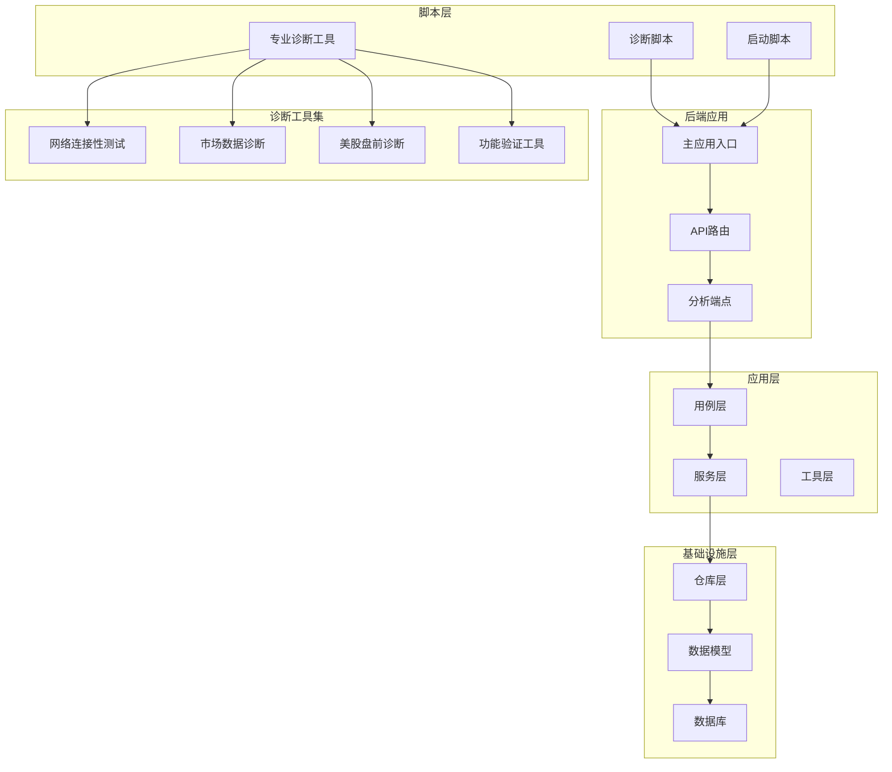

**图表来源**
- [main.py:1-170](file://backend/app/main.py#L1-L170)
- [api.py:1-33](file://backend/app/api/v1/api.py#L1-L33)
- [diagnose_ai_flow.py:1-169](file://scripts/diagnose_ai_flow.py#L1-L169)
- [README.md:1-21](file://backend/scripts/README.md#L1-L21)

**章节来源**
- [main.py:1-170](file://backend/app/main.py#L1-L170)
- [api.py:1-33](file://backend/app/api/v1/api.py#L1-L33)
- [diagnose_ai_flow.py:1-169](file://scripts/diagnose_ai_flow.py#L1-L169)
- [README.md:1-21](file://backend/scripts/README.md#L1-L21)

## 核心组件

### 诊断脚本核心功能

诊断脚本提供了完整的AI分析流程诊断能力：

1. **数据获取诊断**：验证市场数据、新闻数据、宏观数据的获取状态
2. **AI调用诊断**：测试不同AI供应商的连接性和响应质量
3. **性能监控**：统计各环节耗时，识别性能瓶颈
4. **错误追踪**：提供详细的错误信息和解决方案

### 专业诊断工具集

**新增** 系统现在包含一个完整的专业诊断工具集：

- **网络连接性测试**：验证API连接、代理配置、HTTP/HTTPS兼容性
- **市场数据诊断**：测试特定数据源的可用性和数据格式
- **美股盘前诊断**：专门针对美股盘前市场的数据获取和解析
- **功能验证工具**：验证特定功能的正确性和回退机制

### 应用架构组件

系统采用分层架构设计：

- **表现层**：FastAPI API路由和端点
- **应用层**：用例模式（AnalyzeStockUseCase等）
- **服务层**：AI服务、市场数据服务、宏观服务
- **基础设施层**：数据库仓库、数据模型
- **工具层**：日志记录、响应解析、配置管理

**章节来源**
- [diagnose_ai_flow.py:33-169](file://scripts/diagnose_ai_flow.py#L33-L169)
- [analyze_stock.py:37-543](file://backend/app/application/analysis/analyze_stock.py#L37-L543)

## 专业诊断工具

### 网络连接性测试工具

**diagnostic_connectivity.py** 提供了全面的网络连接性测试：

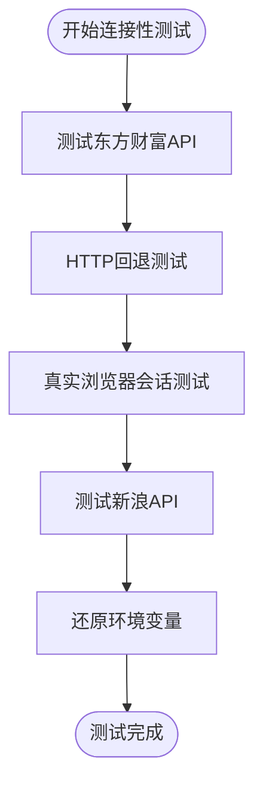

**图表来源**
- [diagnostic_connectivity.py:1-70](file://backend/scripts/dev/diagnostics/diagnostic_connectivity.py#L1-L70)

#### 功能特性

- **代理环境清理**：自动清理HTTP_PROXY、HTTPS_PROXY等环境变量
- **HTTP/HTTPS双重测试**：验证HTTP和HTTPS连接的可用性
- **真实浏览器头测试**：模拟真实浏览器请求头进行测试
- **多API源测试**：同时测试东方财富和新浪等多家数据源

### 市场数据诊断工具

**diagnostic_tencent_kline.py** 专门用于腾讯K线数据的诊断：

#### K线数据获取测试

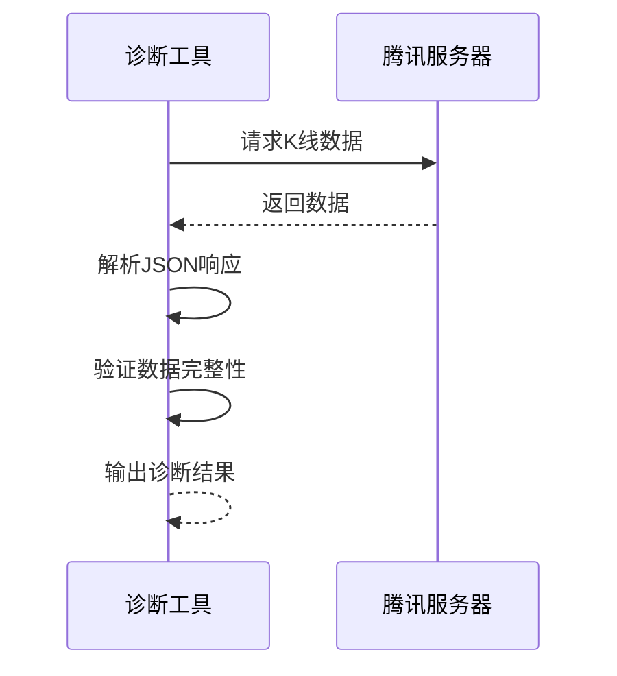

**图表来源**
- [diagnostic_tencent_kline.py:1-47](file://backend/scripts/dev/diagnostics/diagnostic_tencent_kline.py#L1-L47)

#### 诊断能力

- **数据格式验证**：检查返回数据的JSON格式正确性
- **数据完整性检查**：验证K线数据的完整性和准确性
- **代理环境隔离**：确保测试不受系统代理影响

### 美股盘前诊断工具

**diagnostic_us_premarket.py** 及其增强版本提供了完整的美股盘前数据诊断：

#### 多源数据对比测试

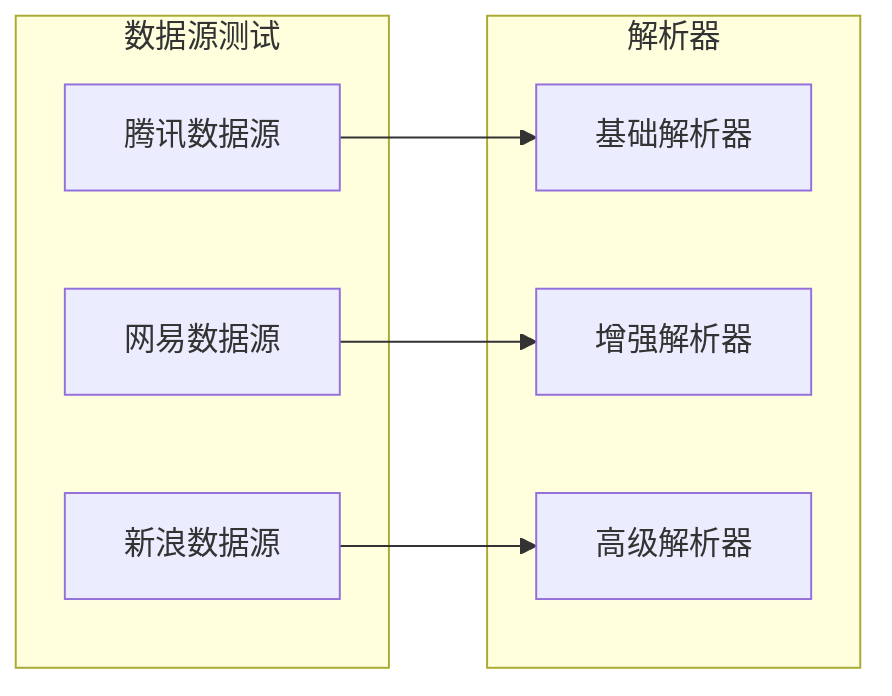

**图表来源**
- [diagnostic_us_premarket.py:1-73](file://backend/scripts/dev/diagnostics/diagnostic_us_premarket.py#L1-L73)
- [diagnostic_us_premarket_v2.py:1-60](file://backend/scripts/dev/diagnostics/diagnostic_us_premarket_v2.py#L1-L60)
- [diagnostic_us_premarket_v3.py:1-59](file://backend/scripts/dev/diagnostics/diagnostic_us_premarket_v3.py#L1-L59)
- [diagnostic_us_premarket_v4.py:1-73](file://backend/scripts/dev/diagnostics/diagnostic_us_premarket_v4.py#L1-L73)

#### 诊断范围

- **多数据源支持**：同时测试腾讯、网易、新浪等多个数据源
- **盘前数据识别**：专门识别和解析盘前交易数据
- **数据格式兼容**：适配不同数据源的响应格式差异
- **错误处理机制**：优雅处理各种网络和解析错误

### 功能验证工具

**verify_a_fix.py**、**verify_ashare_refresh.py** 等工具专注于特定功能的验证：

#### A股数据获取验证

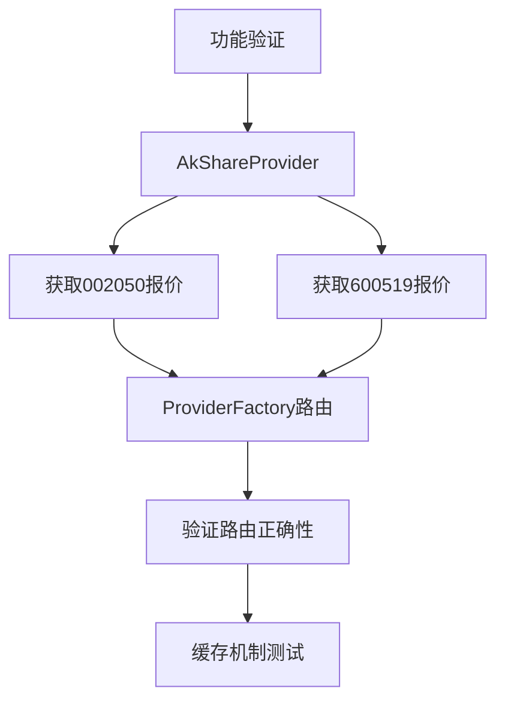

**图表来源**
- [verify_a_fix.py:1-33](file://backend/scripts/dev/diagnostics/verify_a_fix.py#L1-L33)
- [verify_ashare_refresh.py:1-34](file://backend/scripts/dev/diagnostics/verify_ashare_refresh.py#L1-L34)
- [verify_fallback_direct.py:1-39](file://backend/scripts/dev/diagnostics/verify_fallback_direct.py#L1-L39)

#### 验证功能

- **数据源路由验证**：验证ProviderFactory的路由逻辑
- **缓存机制测试**：测试数据缓存的有效性和一致性
- **回退机制验证**：验证代理不可用时的回退逻辑
- **历史数据获取**：验证历史数据接口的可用性

**章节来源**
- [diagnostic_connectivity.py:1-70](file://backend/scripts/dev/diagnostics/diagnostic_connectivity.py#L1-L70)
- [diagnostic_tencent_kline.py:1-47](file://backend/scripts/dev/diagnostics/diagnostic_tencent_kline.py#L1-L47)
- [diagnostic_us_premarket.py:1-73](file://backend/scripts/dev/diagnostics/diagnostic_us_premarket.py#L1-L73)
- [diagnostic_us_premarket_v2.py:1-60](file://backend/scripts/dev/diagnostics/diagnostic_us_premarket_v2.py#L1-L60)
- [diagnostic_us_premarket_v3.py:1-59](file://backend/scripts/dev/diagnostics/diagnostic_us_premarket_v3.py#L1-L59)
- [diagnostic_us_premarket_v4.py:1-73](file://backend/scripts/dev/diagnostics/diagnostic_us_premarket_v4.py#L1-L73)
- [verify_a_fix.py:1-33](file://backend/scripts/dev/diagnostics/verify_a_fix.py#L1-L33)
- [verify_ashare_refresh.py:1-34](file://backend/scripts/dev/diagnostics/verify_ashare_refresh.py#L1-L34)
- [verify_fallback_direct.py:1-39](file://backend/scripts/dev/diagnostics/verify_fallback_direct.py#L1-L39)
- [verify_history.py:1-22](file://backend/scripts/dev/diagnostics/verify_history.py#L1-L22)

## 架构概览

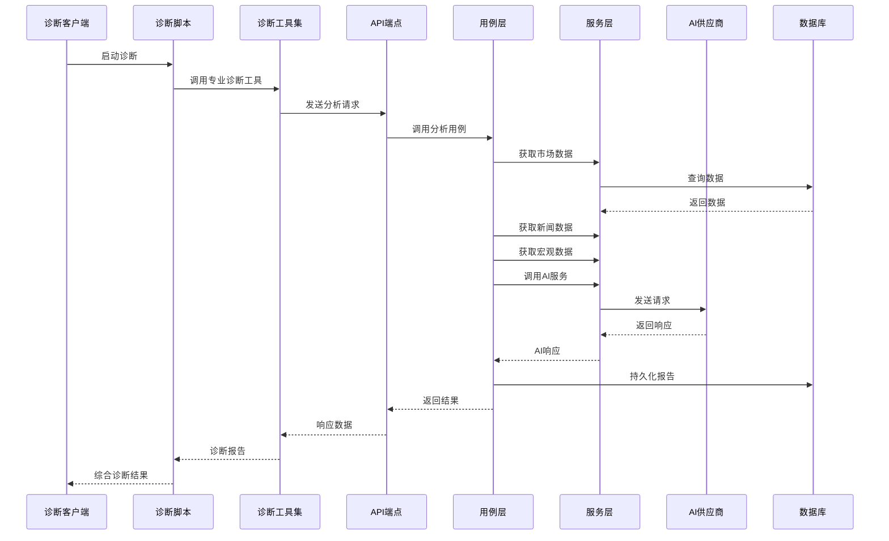

**图表来源**
- [diagnose_ai_flow.py:33-169](file://scripts/diagnose_ai_flow.py#L33-L169)
- [analyze_stock.py:43-214](file://backend/app/application/analysis/analyze_stock.py#L43-L214)

## 详细组件分析

### 诊断脚本实现

诊断脚本实现了完整的AI分析流程自动化诊断：

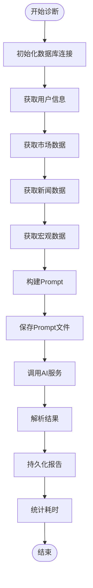

**图表来源**
- [diagnose_ai_flow.py:33-169](file://scripts/diagnose_ai_flow.py#L33-L169)

#### 核心诊断流程

诊断脚本按照以下步骤执行：

1. **用户验证**：通过邮箱查询用户信息
2. **数据获取**：并行获取市场数据、新闻数据、宏观数据
3. **Prompt构建**：整合所有数据构建AI分析Prompt
4. **AI调用**：调用AI服务生成分析结果
5. **结果处理**：解析AI响应并持久化报告
6. **性能统计**：记录各环节耗时

**章节来源**
- [diagnose_ai_flow.py:33-169](file://scripts/diagnose_ai_flow.py#L33-L169)

### AI服务层架构

AI服务层提供了统一的AI供应商抽象：

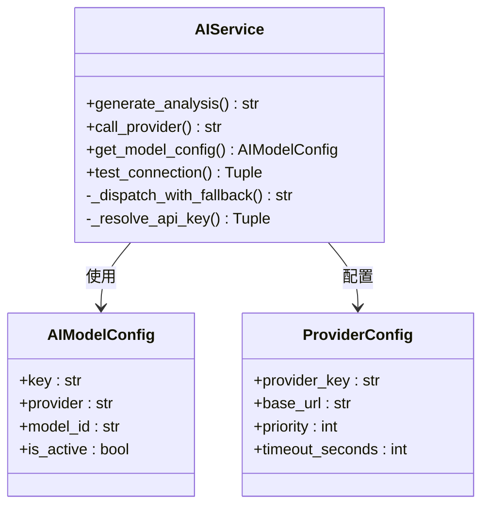

**图表来源**
- [ai_service.py:32-594](file://backend/app/services/ai_service.py#L32-L594)

#### AI供应商支持

系统支持多种AI供应商：

- **Google Gemini**：主要AI供应商，支持JSON响应格式
- **SiliconFlow**：高性能推理平台
- **DeepSeek**：开源模型支持
- **DashScope**：阿里云通义实验室

### 数据模型设计

系统采用清晰的数据模型层次：

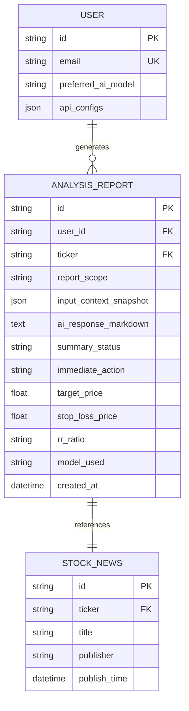

**图表来源**
- [analysis.py:17-93](file://backend/app/models/analysis.py#L17-L93)

### 日志记录系统

系统实现了多层次的日志记录机制：

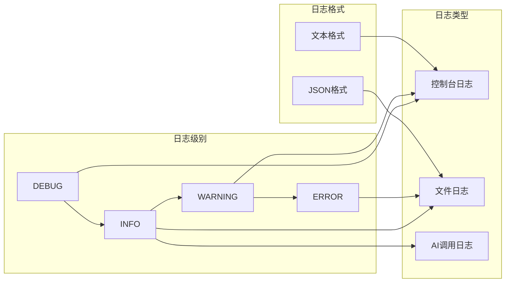

**图表来源**
- [json_logger.py:11-202](file://backend/app/utils/json_logger.py#L11-L202)

## 依赖关系分析

### 外部依赖

系统依赖的关键外部组件：

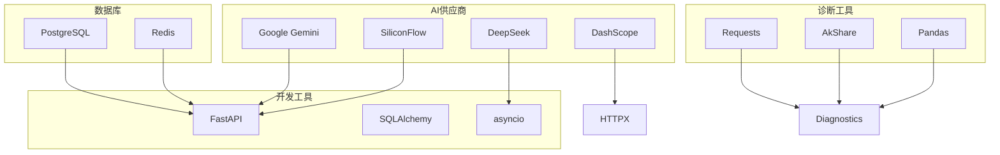

**图表来源**
- [requirements.txt:1-77](file://backend/requirements.txt#L1-L77)
- [docker-compose.yml:1-139](file://docker-compose.yml#L1-L139)

### 内部模块依赖

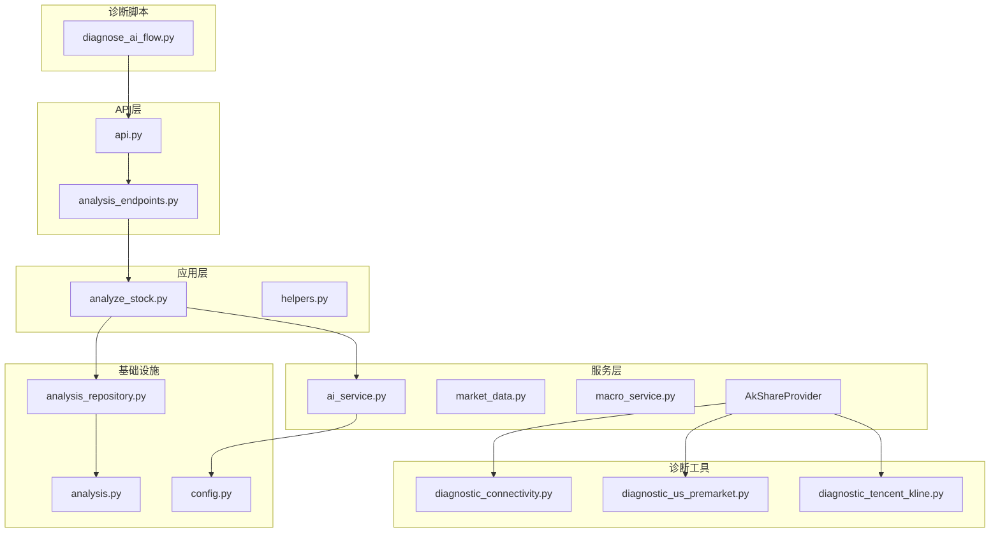

**图表来源**
- [diagnose_ai_flow.py:1-169](file://scripts/diagnose_ai_flow.py#L1-L169)
- [api.py:1-33](file://backend/app/api/v1/api.py#L1-L33)

**章节来源**
- [requirements.txt:1-77](file://backend/requirements.txt#L1-L77)
- [docker-compose.yml:1-139](file://docker-compose.yml#L1-L139)

## 性能考虑

### 并行处理优化

系统采用了多处并行处理机制：

1. **并行数据获取**：使用`asyncio.gather()`并行获取市场数据、新闻数据、宏观数据
2. **异步数据库操作**：使用SQLAlchemy异步引擎
3. **并发AI调用**：支持多个AI供应商的并发调用

### 缓存策略

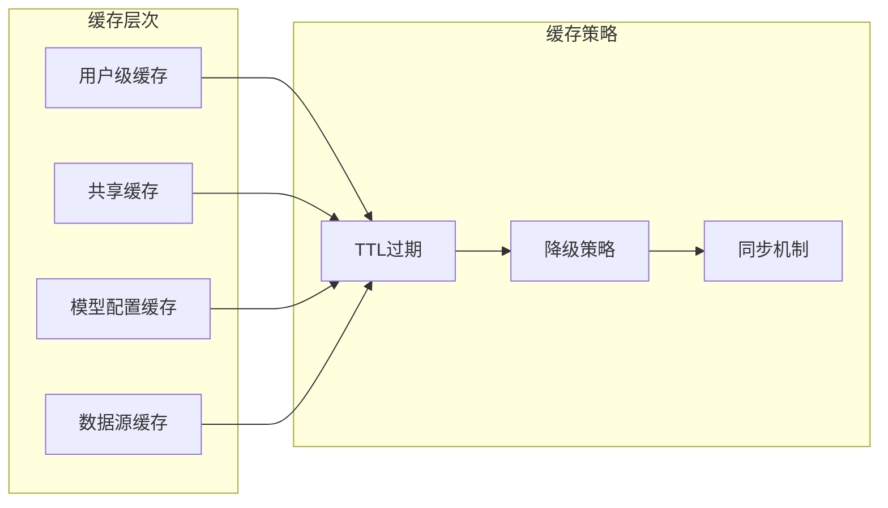

**图表来源**
- [analyze_stock.py:312-342](file://backend/app/application/analysis/analyze_stock.py#L312-L342)

### 性能监控

系统提供了全面的性能监控：

- **耗时统计**：每个环节的执行时间记录
- **错误追踪**：详细的错误信息和堆栈跟踪
- **资源使用**：数据库连接池使用情况
- **AI调用监控**：供应商响应时间和成功率

## 故障排除指南

### 常见问题诊断

#### 数据获取问题

**症状**：市场数据获取失败
**排查步骤**：
1. 检查网络连接和代理设置
2. 验证API密钥配置
3. 确认数据源可用性
4. 查看日志文件获取详细错误信息

#### AI调用问题

**症状**：AI服务响应超时或失败
**排查步骤**：
1. 测试AI供应商连接性
2. 检查API密钥有效性
3. 验证模型配置
4. 监控供应商负载情况

#### 数据库连接问题

**症状**：数据库操作失败
**排查步骤**：
1. 检查数据库连接字符串
2. 验证数据库服务状态
3. 查看连接池配置
4. 监控数据库性能

### 专业诊断工具使用指南

**新增** 利用专业诊断工具进行精细化问题排查：

#### 网络连接性问题

使用 **diagnostic_connectivity.py** 进行网络诊断：

1. **代理环境清理**：自动清理系统代理环境变量
2. **HTTP/HTTPS测试**：验证两种协议的可用性
3. **真实浏览器头**：模拟真实浏览器请求头
4. **多API源测试**：同时测试多个数据源的可用性

#### 市场数据获取问题

使用 **diagnostic_tencent_kline.py** 进行K线数据诊断：

1. **数据格式验证**：检查JSON响应格式
2. **数据完整性检查**：验证K线数据的完整性
3. **代理隔离**：确保测试不受系统代理影响
4. **错误处理**：捕获并报告解析错误

#### 美股盘前数据问题

使用 **diagnostic_us_premarket.py** 及其增强版本：

1. **多数据源对比**：同时测试腾讯、网易、新浪数据源
2. **盘前数据识别**：专门识别盘前交易数据
3. **数据格式适配**：处理不同数据源的格式差异
4. **错误优雅处理**：处理网络和解析异常

#### 功能验证问题

使用 **verify_a_fix.py** 等功能验证工具：

1. **数据源路由验证**：验证ProviderFactory的路由逻辑
2. **缓存机制测试**：测试数据缓存的有效性
3. **回退机制验证**：验证代理不可用时的回退逻辑
4. **历史数据获取**：验证历史数据接口的可用性

### 日志分析

系统提供了详细的日志分析能力：

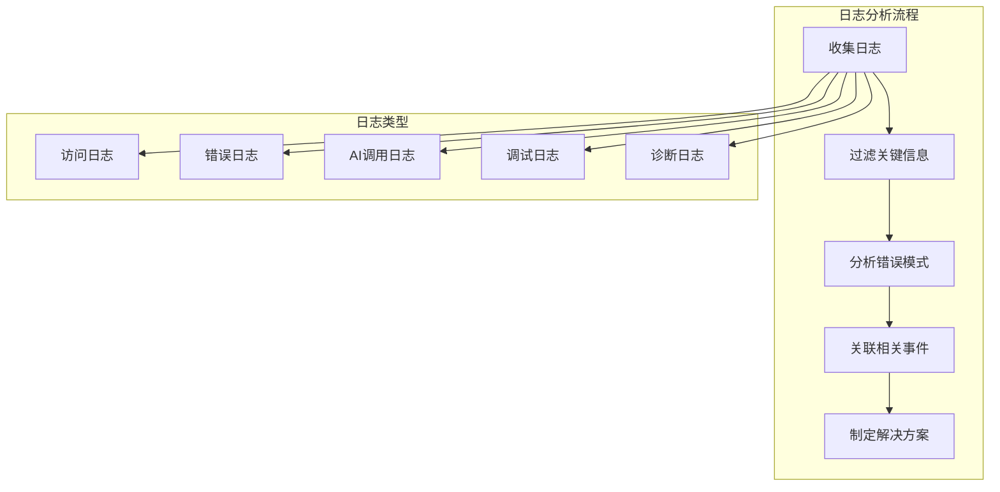

**图表来源**
- [json_logger.py:104-202](file://backend/app/utils/json_logger.py#L104-L202)

**章节来源**
- [json_logger.py:104-202](file://backend/app/utils/json_logger.py#L104-L202)

## 结论

AI分析流程诊断脚本为整个AI股票分析系统提供了强大的诊断和调试能力。通过模块化的架构设计、完善的日志记录系统和全面的性能监控，该脚本能够帮助开发者快速定位和解决问题。

**更新** 新增的专业诊断工具集进一步增强了系统的诊断能力，提供了从网络连接性到具体功能验证的全方位诊断支持。这些工具不仅提高了问题排查的效率，还为系统的稳定性和可靠性提供了重要保障。

### 主要优势

1. **完整性**：覆盖整个AI分析流程的各个环节
2. **易用性**：提供简单直观的命令行接口
3. **可扩展性**：支持多种AI供应商和数据源
4. **可观测性**：全面的日志记录和性能监控
5. **可靠性**：完善的错误处理和降级机制
6. **专业性**：专门的诊断工具集，提供精细化问题排查

### 未来发展

建议在未来版本中增加：
- 更详细的性能基准测试
- 自动化故障恢复机制
- 更丰富的监控指标
- 增强的错误预测和预防能力
- 更多专业诊断工具的扩展