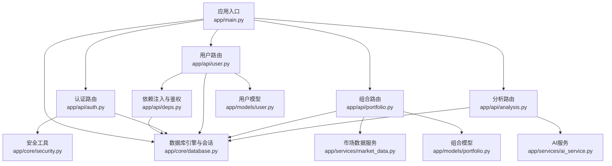
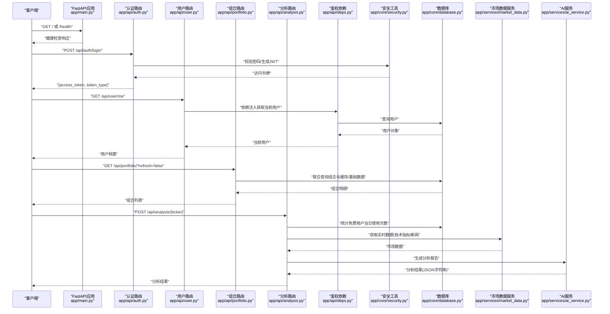
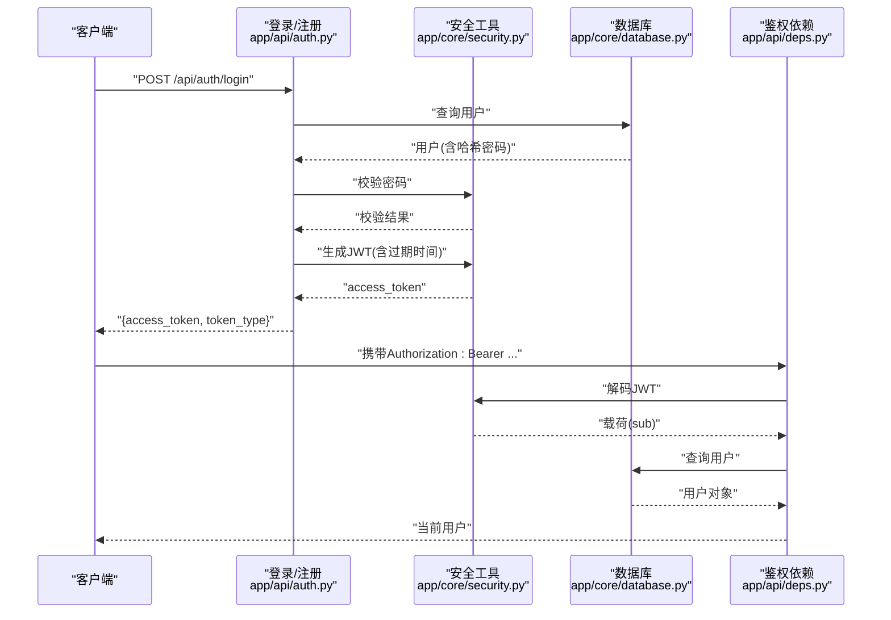
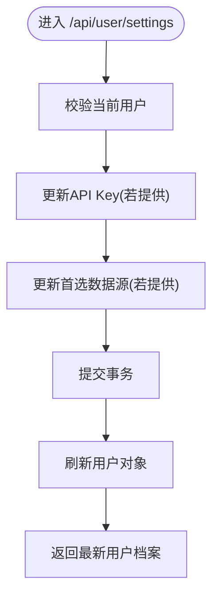
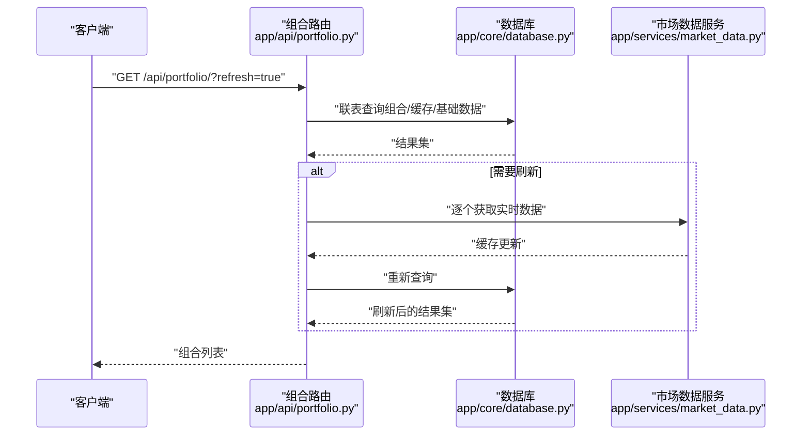
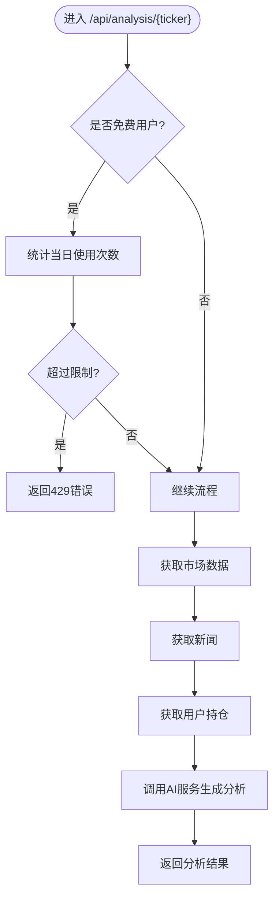
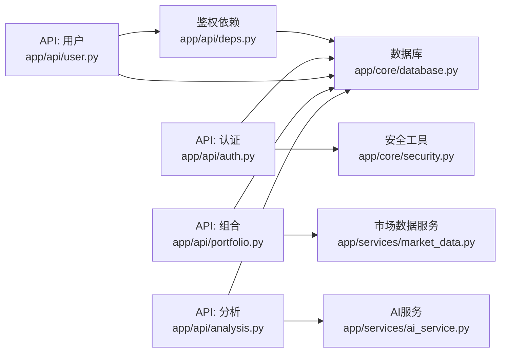

# API开发规范

<cite>
**本文引用的文件**
- [backend/app/main.py](file://backend/app/main.py)
- [backend/app/api/auth.py](file://backend/app/api/auth.py)
- [backend/app/api/user.py](file://backend/app/api/user.py)
- [backend/app/api/portfolio.py](file://backend/app/api/portfolio.py)
- [backend/app/api/analysis.py](file://backend/app/api/analysis.py)
- [backend/app/api/deps.py](file://backend/app/api/deps.py)
- [backend/app/core/security.py](file://backend/app/core/security.py)
- [backend/app/core/config.py](file://backend/app/core/config.py)
- [backend/app/core/database.py](file://backend/app/core/database.py)
- [backend/app/models/user.py](file://backend/app/models/user.py)
- [backend/app/models/portfolio.py](file://backend/app/models/portfolio.py)
- [backend/app/schemas/user_settings.py](file://backend/app/schemas/user_settings.py)
- [backend/app/services/ai_service.py](file://backend/app/services/ai_service.py)
- [backend/app/services/market_data.py](file://backend/app/services/market_data.py)
- [backend/requirements.txt](file://backend/requirements.txt)
- [README.md](file://README.md)
</cite>

## 目录
1. [简介](#简介)
2. [项目结构](#项目结构)
3. [核心组件](#核心组件)
4. [架构总览](#架构总览)
5. [详细组件分析](#详细组件分析)
6. [依赖关系分析](#依赖关系分析)
7. [性能考虑](#性能考虑)
8. [故障排查指南](#故障排查指南)
9. [结论](#结论)
10. [附录](#附录)

## 简介
本规范面向本项目的API开发，基于现有FastAPI后端实现，系统性地总结RESTful设计原则、资源命名与HTTP方法使用、状态码规范、请求/响应数据结构与校验、认证与授权（JWT）、权限控制、API版本管理策略、错误处理与异常管理、API文档自动生成与维护、性能优化（缓存与限流）、以及测试驱动开发方法。目标是帮助开发者在保持一致性的同时提升可维护性与可扩展性。

## 项目结构
后端采用FastAPI框架，按功能模块组织API路由，核心目录与职责如下：
- 应用入口与路由挂载：app/main.py
- API层：app/api/ 下按领域拆分（auth、user、portfolio、analysis）
- 核心基础设施：app/core/（安全、配置、数据库）
- 数据模型：app/models/（用户、组合、股票等）
- 数据传输对象：app/schemas/（用户设置等）
- 业务服务：app/services/（AI分析、市场数据）

图表来源
- [backend/app/main.py](file://backend/app/main.py#L1-L38)
- [backend/app/api/auth.py](file://backend/app/api/auth.py#L1-L88)
- [backend/app/api/user.py](file://backend/app/api/user.py#L1-L48)
- [backend/app/api/portfolio.py](file://backend/app/api/portfolio.py#L1-L297)
- [backend/app/api/analysis.py](file://backend/app/api/analysis.py#L1-L124)
- [backend/app/api/deps.py](file://backend/app/api/deps.py#L1-L44)
- [backend/app/core/security.py](file://backend/app/core/security.py#L1-L26)
- [backend/app/core/database.py](file://backend/app/core/database.py#L1-L24)
- [backend/app/models/user.py](file://backend/app/models/user.py#L1-L31)
- [backend/app/models/portfolio.py](file://backend/app/models/portfolio.py#L1-L26)
- [backend/app/services/market_data.py](file://backend/app/services/market_data.py#L1-L370)
- [backend/app/services/ai_service.py](file://backend/app/services/ai_service.py#L1-L112)

章节来源
- [backend/app/main.py](file://backend/app/main.py#L1-L38)
- [README.md](file://README.md#L1-L50)

## 核心组件
- 应用入口与CORS：统一挂载路由并配置跨域策略，便于前后端联调。
- 认证与授权：OAuth2密码模式，JWT令牌签发与校验，依赖注入获取当前用户。
- 用户与设置：个人信息查询与设置更新，支持切换首选数据源与保存第三方API Key。
- 组合管理：搜索股票、查询/新增/删除用户持有的组合项；支持刷新与后台拉取技术指标。
- 分析服务：整合市场数据、新闻与用户持仓，调用AI服务生成分析报告；内置免费层级使用限制。
- 市场数据服务：多数据源（yfinance、Alpha Vantage）回退与缓存，技术指标计算与新闻入库。
- AI服务：基于Gemini模型生成中文分析内容，具备降级与错误兜底。

章节来源
- [backend/app/main.py](file://backend/app/main.py#L1-L38)
- [backend/app/api/auth.py](file://backend/app/api/auth.py#L1-L88)
- [backend/app/api/user.py](file://backend/app/api/user.py#L1-L48)
- [backend/app/api/portfolio.py](file://backend/app/api/portfolio.py#L1-L297)
- [backend/app/api/analysis.py](file://backend/app/api/analysis.py#L1-L124)
- [backend/app/api/deps.py](file://backend/app/api/deps.py#L1-L44)
- [backend/app/services/market_data.py](file://backend/app/services/market_data.py#L1-L370)
- [backend/app/services/ai_service.py](file://backend/app/services/ai_service.py#L1-L112)

## 架构总览
下图展示API请求从客户端到服务端的典型流程，涵盖鉴权、路由、业务服务与外部数据源交互。

图表来源
- [backend/app/main.py](file://backend/app/main.py#L24-L37)
- [backend/app/api/auth.py](file://backend/app/api/auth.py#L24-L50)
- [backend/app/api/user.py](file://backend/app/api/user.py#L11-L20)
- [backend/app/api/portfolio.py](file://backend/app/api/portfolio.py#L143-L224)
- [backend/app/api/analysis.py](file://backend/app/api/analysis.py#L13-L123)
- [backend/app/api/deps.py](file://backend/app/api/deps.py#L17-L43)
- [backend/app/core/security.py](file://backend/app/core/security.py#L11-L19)
- [backend/app/core/database.py](file://backend/app/core/database.py#L21-L23)
- [backend/app/services/market_data.py](file://backend/app/services/market_data.py#L14-L170)
- [backend/app/services/ai_service.py](file://backend/app/services/ai_service.py#L43-L111)

## 详细组件分析

### 认证与授权（JWT）
- 登录：使用OAuth2密码模式，校验邮箱与密码，签发JWT访问令牌。
- 注册：检查邮箱唯一性，创建用户并返回访问令牌。
- 鉴权：通过依赖注入获取当前用户，校验JWT签名与有效期。
- 安全参数：算法、密钥、过期时间由配置管理。

图表来源
- [backend/app/api/auth.py](file://backend/app/api/auth.py#L24-L87)
- [backend/app/core/security.py](file://backend/app/core/security.py#L11-L25)
- [backend/app/api/deps.py](file://backend/app/api/deps.py#L17-L43)
- [backend/app/core/database.py](file://backend/app/core/database.py#L21-L23)

章节来源
- [backend/app/api/auth.py](file://backend/app/api/auth.py#L1-L88)
- [backend/app/core/security.py](file://backend/app/core/security.py#L1-L26)
- [backend/app/api/deps.py](file://backend/app/api/deps.py#L1-L44)
- [backend/app/core/config.py](file://backend/app/core/config.py#L1-L24)

### 用户与设置
- 个人信息：返回用户标识、邮箱、会员等级、是否配置第三方Key、首选数据源。
- 设置更新：支持更新Gemini/DeepSeek Key与首选数据源，提交后立即生效。

图表来源
- [backend/app/api/user.py](file://backend/app/api/user.py#L22-L47)
- [backend/app/schemas/user_settings.py](file://backend/app/schemas/user_settings.py#L1-L16)

章节来源
- [backend/app/api/user.py](file://backend/app/api/user.py#L1-L48)
- [backend/app/schemas/user_settings.py](file://backend/app/schemas/user_settings.py#L1-L16)
- [backend/app/models/user.py](file://backend/app/models/user.py#L1-L31)

### 组合管理
- 搜索股票：本地模糊匹配，必要时远程快速校验并写入缓存。
- 查询组合：一次性联表查询组合、缓存与基础数据，支持强制刷新。
- 新增组合：去重合并，必要时异步拉取技术指标。
- 删除组合：按用户与股票过滤，不存在则返回未找到。

图表来源
- [backend/app/api/portfolio.py](file://backend/app/api/portfolio.py#L143-L224)
- [backend/app/services/market_data.py](file://backend/app/services/market_data.py#L14-L170)

章节来源
- [backend/app/api/portfolio.py](file://backend/app/api/portfolio.py#L1-L297)
- [backend/app/models/portfolio.py](file://backend/app/models/portfolio.py#L1-L26)

### 分析服务
- 免费层级限制：未配置Gemini Key的用户按日统计使用次数，超过阈值返回限流错误。
- 数据准备：获取实时价格、涨跌幅、技术指标、新闻与用户持仓。
- AI生成：调用Gemini模型生成中文分析，返回JSON字符串或降级文本。

图表来源
- [backend/app/api/analysis.py](file://backend/app/api/analysis.py#L13-L123)
- [backend/app/services/market_data.py](file://backend/app/services/market_data.py#L14-L170)
- [backend/app/services/ai_service.py](file://backend/app/services/ai_service.py#L43-L111)

章节来源
- [backend/app/api/analysis.py](file://backend/app/api/analysis.py#L1-L124)
- [backend/app/services/ai_service.py](file://backend/app/services/ai_service.py#L1-L112)

### 错误处理与异常管理
- 统一异常：登录失败、注册重复、鉴权失败、资源未找到、使用次数超限等场景返回明确状态码与错误信息。
- 限流：免费用户日配额达到上限返回429。
- 外部依赖失败：市场数据服务对429进行指数退避重试，最终失败抛出异常。

章节来源
- [backend/app/api/auth.py](file://backend/app/api/auth.py#L38-L50)
- [backend/app/api/user.py](file://backend/app/api/user.py#L28-L32)
- [backend/app/api/portfolio.py](file://backend/app/api/portfolio.py#L291-L292)
- [backend/app/api/analysis.py](file://backend/app/api/analysis.py#L46-L50)
- [backend/app/services/market_data.py](file://backend/app/services/market_data.py#L303-L318)

## 依赖关系分析
- 组件耦合：API层依赖依赖注入与安全工具；服务层依赖配置与数据库；模型用于ORM映射。
- 外部依赖：yfinance、Alpha Vantage、Google Generative AI、SQLAlchemy、Pydantic等。
- 关键依赖路径：API路由 → 依赖注入/安全 → 数据库 → 服务层 → 外部数据源。

图表来源
- [backend/app/api/auth.py](file://backend/app/api/auth.py#L1-L88)
- [backend/app/api/user.py](file://backend/app/api/user.py#L1-L48)
- [backend/app/api/portfolio.py](file://backend/app/api/portfolio.py#L1-L297)
- [backend/app/api/analysis.py](file://backend/app/api/analysis.py#L1-L124)
- [backend/app/api/deps.py](file://backend/app/api/deps.py#L1-L44)
- [backend/app/core/security.py](file://backend/app/core/security.py#L1-L26)
- [backend/app/core/database.py](file://backend/app/core/database.py#L1-L24)
- [backend/app/services/market_data.py](file://backend/app/services/market_data.py#L1-L370)
- [backend/app/services/ai_service.py](file://backend/app/services/ai_service.py#L1-L112)

章节来源
- [backend/requirements.txt](file://backend/requirements.txt#L1-L75)

## 性能考虑
- 缓存策略
  - 组合详情：一次联表查询返回所有所需字段，减少多次往返。
  - 市场数据：缓存1分钟内有效，优先读取缓存，必要时回源刷新。
  - 新闻：SQLite Upsert避免重复写入。
- 并发与阻塞
  - SQLite并发限制：顺序刷新避免会话冲突。
  - 异步执行：后台任务触发技术指标拉取，不阻塞主响应。
- 限流与退避
  - yfinance 429：指数退避+抖动，降低触发频率。
  - 免费用户日配额：防止滥用，保障服务稳定性。
- 数据源选择
  - 优先首选数据源，失败自动回退至备选，保证可用性。

章节来源
- [backend/app/api/portfolio.py](file://backend/app/api/portfolio.py#L162-L174)
- [backend/app/services/market_data.py](file://backend/app/services/market_data.py#L14-L170)
- [backend/app/api/analysis.py](file://backend/app/api/analysis.py#L46-L50)

## 故障排查指南
- 认证失败
  - 确认用户名/密码正确，检查JWT签名算法与密钥配置。
  - 查看依赖注入链路是否正确传递令牌。
- 资源未找到
  - 检查用户ID与资源ID是否匹配，确认数据库连接与事务提交。
- 429限流
  - 免费用户已达日配额；或外部数据源触发限流。
  - 建议引导用户配置自有API Key或等待冷却。
- 外部数据源异常
  - yfinance/Alpha Vantage网络问题或配额耗尽。
  - 检查代理配置与超时设置，观察重试日志。

章节来源
- [backend/app/api/auth.py](file://backend/app/api/auth.py#L38-L43)
- [backend/app/api/analysis.py](file://backend/app/api/analysis.py#L46-L50)
- [backend/app/services/market_data.py](file://backend/app/services/market_data.py#L303-L318)

## 结论
本规范以现有FastAPI实现为基础，明确了RESTful设计原则、数据结构与校验、认证授权、权限控制、错误处理与性能优化策略。建议在后续迭代中进一步完善API版本管理、自动化测试与文档生成流程，持续提升系统的可维护性与可扩展性。

## 附录

### RESTful设计原则与规范
- 资源命名
  - 使用名词复数形式，语义清晰，例如“/api/user”、“/api/portfolio”。
- HTTP方法
  - GET：查询资源（如获取组合列表、用户信息）。
  - POST：创建资源（如登录、注册、新增组合）。
  - PUT：更新资源（如更新用户设置）。
  - DELETE：删除资源（如删除组合项）。
- 状态码
  - 200：成功。
  - 201：创建成功。
  - 400：请求参数错误或业务校验失败。
  - 401：未认证。
  - 403：禁止访问。
  - 404：资源不存在。
  - 429：请求过于频繁。
  - 500：服务器内部错误。

章节来源
- [backend/app/api/auth.py](file://backend/app/api/auth.py#L38-L50)
- [backend/app/api/user.py](file://backend/app/api/user.py#L28-L32)
- [backend/app/api/portfolio.py](file://backend/app/api/portfolio.py#L291-L292)
- [backend/app/api/analysis.py](file://backend/app/api/analysis.py#L46-L50)

### 请求与响应数据结构设计
- 用户档案（UserProfile）
  - 字段：id、email、membership_tier、has_gemini_key、has_deepseek_key、preferred_data_source。
- 用户设置（UserSettingsUpdate）
  - 字段：api_key_gemini、api_key_deepseek、preferred_data_source。
- 组合项（PortfolioItem）
  - 字段：ticker、quantity、avg_cost、current_price、market_value、unrealized_pl、pl_percent、last_updated、sector、industry、market_cap、pe_ratio、forward_pe、eps、dividend_yield、beta、52周最高/最低、RSI、MA系列、MACD系列、布林带、ATR、KDJ、量能相关、涨跌幅等。
- 登录响应（Token）
  - 字段：access_token、token_type。

章节来源
- [backend/app/schemas/user_settings.py](file://backend/app/schemas/user_settings.py#L1-L16)
- [backend/app/api/portfolio.py](file://backend/app/api/portfolio.py#L15-L54)
- [backend/app/api/auth.py](file://backend/app/api/auth.py#L20-L23)

### 认证与授权机制
- JWT令牌处理
  - 签发：基于用户ID与过期时间生成JWT。
  - 校验：解码JWT，验证算法与密钥，查询用户是否存在。
- 权限控制
  - 通过依赖注入获取当前用户，确保每个受保护路由均需有效令牌。
- 密钥与算法
  - 算法：HS256；密钥与过期时间来自配置。

章节来源
- [backend/app/core/security.py](file://backend/app/core/security.py#L11-L25)
- [backend/app/api/deps.py](file://backend/app/api/deps.py#L17-L43)
- [backend/app/core/config.py](file://backend/app/core/config.py#L8-L11)

### API版本管理策略
- 建议方案
  - URL前缀版本化：/api/v1/...，便于向后兼容与平滑迁移。
  - 文档与变更日志：每次版本发布同步更新OpenAPI文档与变更记录。
  - 废弃策略：对即将废弃的端点提供过渡期与替代方案提示。
- 当前现状
  - 当前路由未显式版本化，建议在后续迭代中引入版本前缀。

章节来源
- [backend/app/main.py](file://backend/app/main.py#L26-L29)

### 错误处理与异常管理最佳实践
- 明确错误码与消息
  - 对常见错误（认证失败、资源未找到、429限流）定义稳定的状态码与消息格式。
- 统一日志
  - 记录关键错误堆栈与上下文，便于定位问题。
- 优雅降级
  - 在外部依赖不可用时提供模拟数据或简化的回退路径。

章节来源
- [backend/app/api/auth.py](file://backend/app/api/auth.py#L38-L43)
- [backend/app/api/analysis.py](file://backend/app/api/analysis.py#L46-L50)
- [backend/app/services/market_data.py](file://backend/app/services/market_data.py#L67-L85)

### API文档自动生成与维护
- 自动生成
  - FastAPI内置Swagger UI与ReDoc，访问路径见启动说明。
- 维护要点
  - 保持路由注释与Pydantic模型同步，确保文档准确反映实现。
  - 对复杂流程（如分析流程）补充说明与示例。

章节来源
- [README.md](file://README.md#L28-L31)

### 性能优化技巧
- 缓存策略
  - 市场数据缓存1分钟；组合查询一次性联表返回。
- 并发与阻塞
  - SQLite顺序刷新；后台任务异步拉取技术指标。
- 限流机制
  - 免费用户日配额；外部数据源429退避重试。
- 数据源选择
  - 优先首选数据源，失败自动回退。

章节来源
- [backend/app/api/portfolio.py](file://backend/app/api/portfolio.py#L162-L174)
- [backend/app/services/market_data.py](file://backend/app/services/market_data.py#L14-L170)
- [backend/app/api/analysis.py](file://backend/app/api/analysis.py#L46-L50)

### 测试驱动开发方法
- 单元测试
  - 针对服务层（AI服务、市场数据服务）编写独立测试，覆盖正常与异常分支。
- 集成测试
  - 使用测试数据库与模拟外部依赖，验证端到端流程（鉴权→路由→服务→数据库）。
- 建议工具
  - Pytest、HTTPX、pytest-asyncio、模拟器（如pytest-mock）。

章节来源
- [backend/requirements.txt](file://backend/requirements.txt#L1-L75)