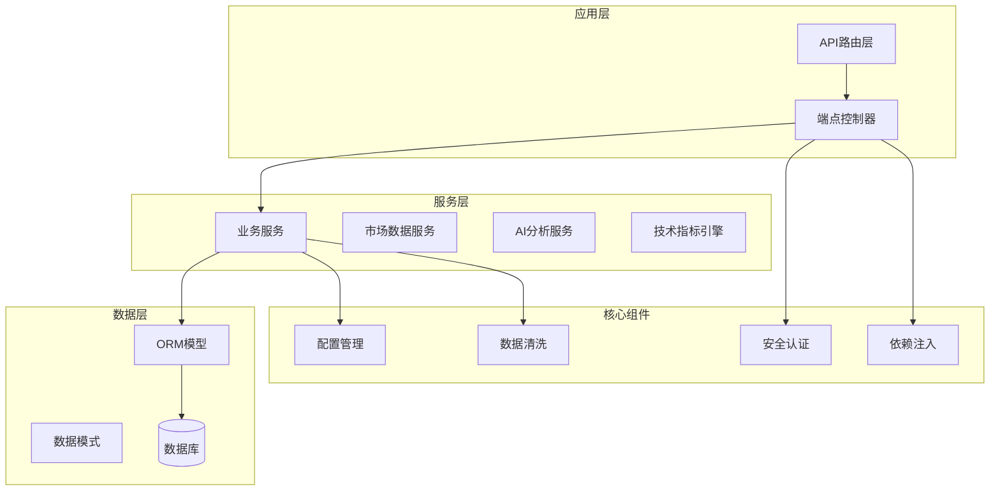
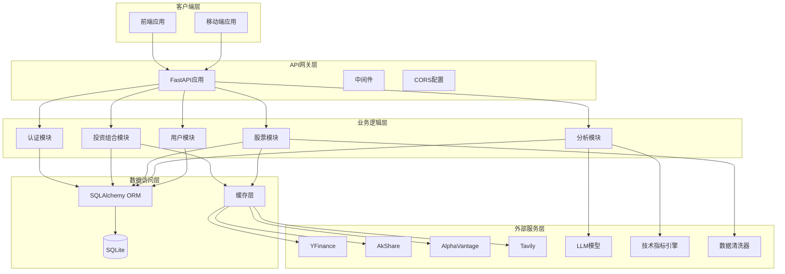
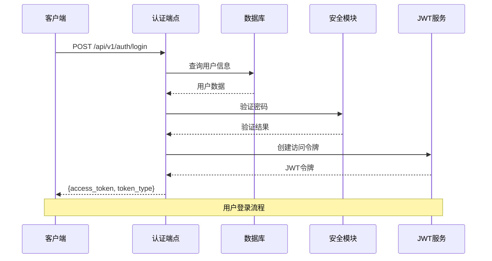
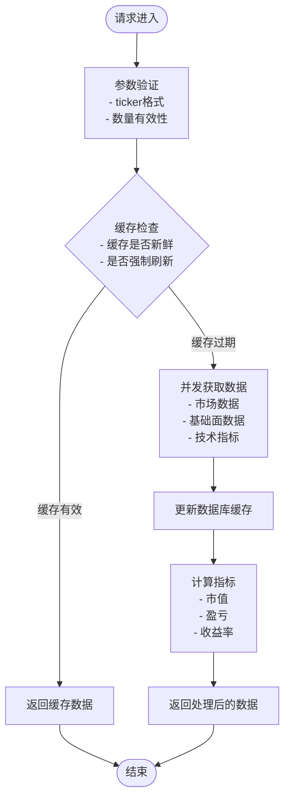
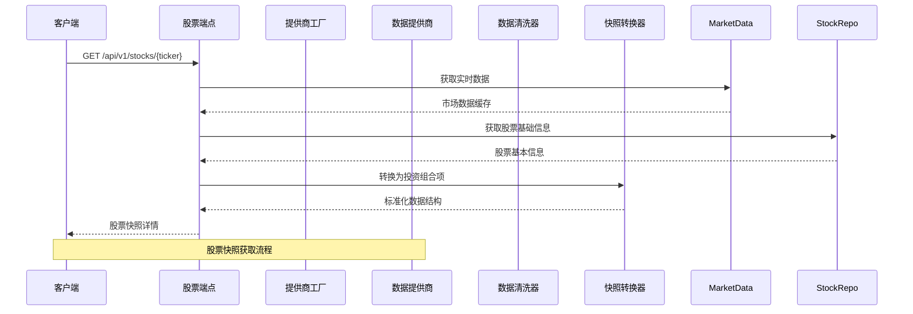
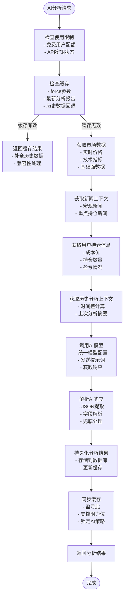
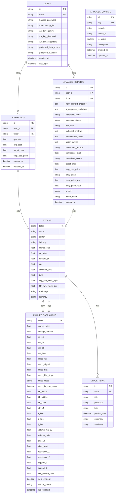
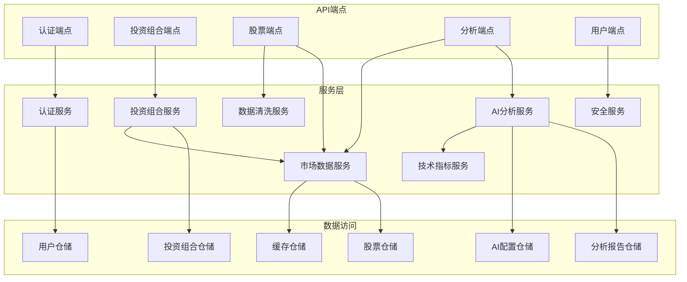

# V1 API端点架构

<cite>
**本文档引用的文件**
- [backend/app/api/v1/api.py](file://backend/app/api/v1/api.py)
- [backend/app/main.py](file://backend/app/main.py)
- [backend/app/api/v1/endpoints/auth.py](file://backend/app/api/v1/endpoints/auth.py)
- [backend/app/api/v1/endpoints/portfolio.py](file://backend/app/api/v1/endpoints/portfolio.py)
- [backend/app/api/v1/endpoints/stock.py](file://backend/app/api/v1/endpoints/stock.py)
- [backend/app/api/v1/endpoints/analysis.py](file://backend/app/api/v1/endpoints/analysis.py)
- [backend/app/api/v1/endpoints/user.py](file://backend/app/api/v1/endpoints/user.py)
- [backend/app/api/deps.py](file://backend/app/api/deps.py)
- [backend/app/core/security.py](file://backend/app/core/security.py)
- [backend/app/core/config.py](file://backend/app/core/config.py)
- [backend/app/models/user.py](file://backend/app/models/user.py)
- [backend/app/models/portfolio.py](file://backend/app/models/portfolio.py)
- [backend/app/models/stock.py](file://backend/app/models/stock.py)
- [backend/app/models/analysis.py](file://backend/app/models/analysis.py)
- [backend/app/models/ai_config.py](file://backend/app/models/ai_config.py)
- [backend/app/schemas/portfolio.py](file://backend/app/schemas/portfolio.py)
- [backend/app/schemas/market_data.py](file://backend/app/schemas/market_data.py)
- [backend/app/services/market_data.py](file-layer)
- [backend/app/services/ai_service.py](file://backend/app/services/ai_service.py)
- [backend/app/services/indicators.py](file://backend/app/services/indicators.py)
</cite>

## 更新摘要
**变更内容**
- 新增股票快照端点，支持非持有股票的详细信息获取
- 增强数据 sanitization 功能，新增批量OHLCV数据清洗机制
- 扩展技术指标处理能力，支持更多量化指标计算
- 优化快照到投资组合项的转换逻辑，提升数据一致性

## 目录
1. [项目概述](#项目概述)
2. [项目结构](#项目结构)
3. [核心组件](#核心组件)
4. [架构总览](#架构总览)
5. [详细端点分析](#详细端点分析)
6. [依赖关系分析](#依赖关系分析)
7. [性能考虑](#性能考虑)
8. [故障排除指南](#故障排除指南)
9. [结论](#结论)

## 项目概述
本项目是一个基于FastAPI构建的AI智能投资顾问后端，采用RESTful架构设计，通过版本化API（v1）提供完整的股票投资组合管理、实时行情获取、AI分析等功能。系统集成了多数据源（YFinance、AkShare、AlphaVantage等）和多模型（Gemini、DeepSeek、SiliconFlow等），为用户提供智能化的投资决策支持。

## 项目结构
后端采用模块化分层架构，主要目录结构如下：

**图表来源**
- [backend/app/api/v1/api.py:1-33](file://backend/app/api/v1/api.py#L1-L33)
- [backend/app/main.py:1-129](file://backend/app/main.py#L1-L129)

**章节来源**
- [backend/app/api/v1/api.py:1-33](file://backend/app/api/v1/api.py#L1-L33)
- [backend/app/main.py:1-129](file://backend/app/main.py#L1-L129)

## 核心组件
系统的核心组件包括：

### 1. API路由管理器
- **职责**：统一管理v1版本的所有API端点
- **特点**：支持按功能模块挂载子路由，提供清晰的API分类
- **版本控制**：通过URL前缀实现API版本化，保证向后兼容性

### 2. 认证与授权系统
- **JWT令牌**：基于HS256算法的JSON Web Token
- **OAuth2密码流**：支持标准的用户名密码认证
- **用户权限**：基于Bearer Token的访问控制

### 3. 数据服务层
- **市场数据服务**：统一管理多数据源的实时数据获取
- **AI分析服务**：集成多种LLM模型提供智能分析，支持统一的模型配置缓存
- **技术指标引擎**：提供全面的技术分析指标计算能力
- **缓存机制**：智能缓存策略确保数据新鲜度和性能

### 4. 数据模型层
- **用户模型**：包含API密钥加密存储和偏好设置
- **投资组合模型**：管理用户的持仓和自选股
- **市场数据模型**：存储实时行情和技术指标
- **分析报告模型**：统一管理AI分析结果和缓存

### 5. 数据清洗系统
- **数值清洗器**：防止NaN和Inf导致JSON序列化崩溃
- **批量数据清洗**：支持OHLCV数据集的批量处理
- **动态指标处理**：自动识别和处理动态技术指标字段

**章节来源**
- [backend/app/api/v1/api.py:1-33](file://backend/app/api/v1/api.py#L1-L33)
- [backend/app/core/security.py:30-45](file://backend/app/core/security.py#L30-L45)
- [backend/app/models/user.py:1-41](file://backend/app/models/user.py#L1-L41)

## 架构总览
系统采用分层架构设计，实现了清晰的关注点分离：

**图表来源**
- [backend/app/main.py:27-129](file://backend/app/main.py#L27-L129)
- [backend/app/api/v1/api.py:1-33](file://backend/app/api/v1/api.py#L1-L33)

## 详细端点分析

### 认证端点 (Auth)
提供用户身份验证和会话管理功能：

**图表来源**
- [backend/app/api/v1/endpoints/auth.py:24-50](file://backend/app/api/v1/endpoints/auth.py#L24-L50)
- [backend/app/core/security.py:31-45](file://backend/app/core/security.py#L31-L45)

**端点概览**：
- `POST /api/v1/auth/login` - 用户登录获取访问令牌
- `POST /api/v1/auth/register` - 用户注册并自动登录

**章节来源**
- [backend/app/api/v1/endpoints/auth.py:1-88](file://backend/app/api/v1/endpoints/auth.py#L1-L88)

### 投资组合端点 (Portfolio)
管理用户的自选股和持仓信息：

**图表来源**
- [backend/app/api/v1/endpoints/portfolio.py:159-264](file://backend/app/api/v1/endpoints/portfolio.py#L159-L264)

**核心功能**：
- `GET /api/v1/portfolio/search` - 股票搜索（支持本地和远程）
- `GET /api/v1/portfolio/summary` - 投资组合汇总
- `GET /api/v1/portfolio` - 获取投资组合列表
- `POST /api/v1/portfolio` - 添加或更新持仓
- `DELETE /api/v1/portfolio/{ticker}` - 删除持仓
- `POST /api/v1/portfolio/{ticker}/refresh` - 手动刷新单个股票
- `GET /api/v1/portfolio/{ticker}/news` - 获取股票新闻

**章节来源**
- [backend/app/api/v1/endpoints/portfolio.py:1-403](file://backend/app/api/v1/endpoints/portfolio.py#L1-L403)

### 股票端点 (Stock)
提供股票历史数据和批量刷新功能，现已新增股票快照端点：

**图表来源**
- [backend/app/api/v1/endpoints/stock.py:112-135](file://backend/app/api/v1/endpoints/stock.py#L112-L135)
- [backend/app/services/market_data.py:23-54](file://backend/app/services/market_data.py#L23-L54)

**新增功能**：
- `GET /api/v1/stocks/{ticker}` - 获取股票详情快照（支持非持有股票）

**核心功能**：
- `GET /api/v1/stocks/{ticker}/history` - 获取股票历史数据
- `POST /api/v1/stocks/refresh_all` - 批量刷新所有持仓股票

**更新** 股票端点现在包含增强的数据清洗功能：
- 批量OHLCV数据清洗：支持同时清洗多个技术指标字段
- 动态指标处理：自动识别和处理动态生成的技术指标
- 核心字段默认值：OHLC核心字段默认0.0，技术指标默认None

**章节来源**
- [backend/app/api/v1/endpoints/stock.py:1-217](file://backend/app/api/v1/endpoints/stock.py#L1-L217)

### AI分析端点 (Analysis)
提供智能投资分析和组合健康检查，现已实现统一的分析检索机制：

**图表来源**
- [backend/app/api/v1/endpoints/analysis.py:198-664](file://backend/app/api/v1/endpoints/analysis.py#L198-L664)

**核心功能**：
- `POST /api/v1/analysis/portfolio` - 全量持仓健康分析
- `GET /api/v1/analysis/portfolio` - 获取最近的组合分析（保留端点）
- `POST /api/v1/analysis/{ticker}` - 单股票AI分析
- `GET /api/v1/analysis/{ticker}` - 获取最新分析记录

**更新** 分析端点现在实现了统一的分析检索机制，包括：
- 缓存优先策略：支持force参数控制缓存使用
- 历史数据回退：自动补全历史分析报告的数值字段
- 统一缓存同步：将AI分析结果同步到市场数据缓存中
- 兼容性处理：支持旧格式分析报告的自动转换

**章节来源**
- [backend/app/api/v1/endpoints/analysis.py:1-664](file://backend/app/api/v1/endpoints/analysis.py#L1-L664)

### 用户端点 (User)
管理用户个人信息和设置：

**端点功能**：
- `GET /api/v1/user/me` - 获取当前用户信息
- `PUT /api/v1/user/password` - 修改密码
- `PUT /api/v1/user/settings` - 更新用户设置

**章节来源**
- [backend/app/api/v1/endpoints/user.py:1-75](file://backend/app/api/v1/endpoints/user.py#L1-L75)

## 依赖关系分析

### 数据模型关系
系统采用ORM模型设计，实现了清晰的数据关系映射：

**图表来源**
- [backend/app/models/user.py:22-41](file://backend/app/models/user.py#L22-L41)
- [backend/app/models/portfolio.py:9-32](file://backend/app/models/portfolio.py#L9-L32)
- [backend/app/models/stock.py:15-105](file://backend/app/models/stock.py#L15-L105)
- [backend/app/models/analysis.py:12-42](file://backend/app/models/analysis.py#L12-L42)
- [backend/app/models/ai_config.py:6-21](file://backend/app/models/ai_config.py#L6-L21)

### 服务依赖关系
系统的服务层实现了松耦合的设计：

**图表来源**
- [backend/app/api/v1/endpoints/auth.py:1-88](file://backend/app/api/v1/endpoints/auth.py#L1-L88)
- [backend/app/api/v1/endpoints/portfolio.py:1-403](file://backend/app/api/v1/endpoints/portfolio.py#L1-L403)
- [backend/app/services/market_data.py:17-266](file://backend/app/services/market_data.py#L17-L266)
- [backend/app/services/ai_service.py:18-390](file://backend/app/services/ai_service.py#L18-L390)
- [backend/app/services/indicators.py:1-146](file://backend/app/services/indicators.py#L1-L146)

**章节来源**
- [backend/app/models/user.py:1-41](file://backend/app/models/user.py#L1-L41)
- [backend/app/models/portfolio.py:1-32](file://backend/app/models/portfolio.py#L1-L32)
- [backend/app/models/stock.py:1-105](file://backend/app/models/stock.py#L1-L105)

## 性能考虑
系统在设计时充分考虑了性能优化，特别是在分析端点的性能优化方面：

### 1. 统一分析检索机制
- **缓存优先策略**：分析端点现在支持force参数控制缓存使用，避免不必要的AI调用
- **历史数据回退**：自动补全历史分析报告的数值字段，提高兼容性
- **智能缓存同步**：将AI分析结果同步到市场数据缓存中，确保全系统统一

### 2. 模型配置缓存优化
- **内存缓存层**：AI服务现在使用内存缓存机制，减少数据库查询频率
- **统一模型管理**：移除了复杂的模型过滤逻辑，采用统一的模型配置缓存
- **TTL控制**：模型配置缓存具有5分钟TTL，平衡性能和准确性

### 3. 缓存策略
- **智能缓存**：市场数据默认1分钟缓存，避免频繁外部API调用
- **失效策略**：支持强制刷新和条件更新
- **内存优化**：使用异步IO和连接池

### 4. 并发处理
- **批量操作**：支持并发获取多个股票数据
- **后台任务**：异步执行数据补全任务
- **限流控制**：通过信号量限制并发数量

### 5. 数据优化
- **懒加载**：按需加载关联数据
- **索引优化**：关键字段建立数据库索引
- **查询优化**：使用JOIN减少查询次数

### 6. 数据清洗优化
- **批量处理**：新增批量OHLCV数据清洗，提升处理效率
- **动态字段识别**：自动识别和处理动态生成的技术指标
- **默认值策略**：核心字段和指标字段采用不同的默认值策略

### 7. 技术指标优化
- **全量计算**：提供完整的技术指标计算能力
- **增量更新**：支持基于历史数据的增量指标计算
- **性能优化**：使用向量化操作提升计算效率

## 故障排除指南

### 常见问题及解决方案

**1. 认证失败**
- 检查JWT密钥配置
- 验证用户凭据
- 确认令牌格式正确

**2. 数据获取超时**
- 检查网络连接
- 验证API密钥有效性
- 调整超时参数

**3. 缓存数据陈旧**
- 检查缓存过期时间
- 确认强制刷新参数
- 验证数据库连接

**4. AI分析失败**
- 检查LLM API密钥
- 验证模型可用性
- 查看错误日志
- 检查模型配置缓存

**5. 分析端点性能问题**
- 检查缓存配置
- 验证force参数使用
- 确认历史数据回退逻辑
- 查看AI模型配置缓存状态

**6. 股票快照获取失败**
- 检查市场数据缓存状态
- 验证股票基础信息是否存在
- 确认数据清洗器正常工作
- 查看快照转换逻辑

**7. 数据清洗异常**
- 检查数值清洗器配置
- 验证输入数据格式
- 确认默认值策略设置
- 查看批量清洗逻辑

**8. 技术指标计算错误**
- 检查历史数据完整性
- 验证指标计算逻辑
- 确认数据类型正确性
- 查看边界条件处理

**章节来源**
- [backend/app/main.py:33-47](file://backend/app/main.py#L33-L47)
- [backend/app/services/market_data.py:237-266](file://backend/app/services/market_data.py#L237-L266)
- [backend/app/services/ai_service.py:24-77](file://backend/app/services/ai_service.py#L24-L77)
- [backend/app/core/security.py:30-45](file://backend/app/core/security.py#L30-L45)

## 结论
V1 API端点架构展现了现代Web应用的最佳实践，通过清晰的分层设计、完善的错误处理机制和高性能的并发处理，为用户提供了一个稳定可靠的AI投资顾问平台。系统的设计充分考虑了可扩展性和维护性，为未来的功能扩展奠定了坚实的基础。

**更新** 最新的架构改进包括统一的分析检索机制、优化的模型配置缓存、增强的数据清洗功能和全面的技术指标处理能力。新增的股票快照端点显著提升了用户体验，使用户能够获取非持有股票的详细信息。这些改进不仅提升了系统的响应速度和可靠性，还增强了数据一致性和处理能力，同时保持了良好的向后兼容性。