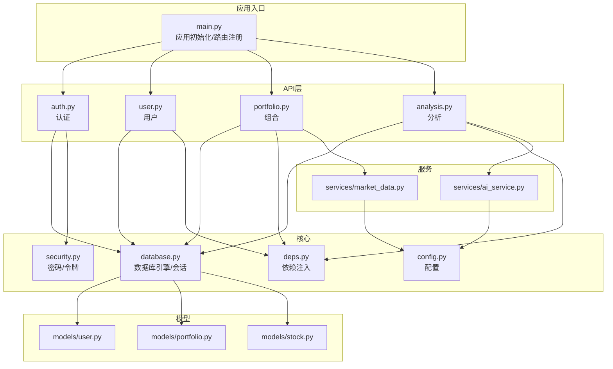
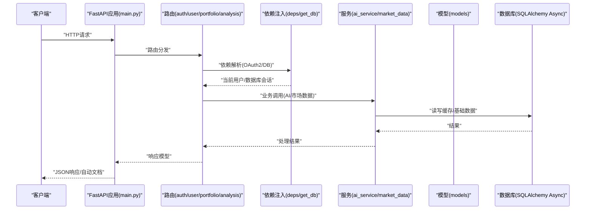
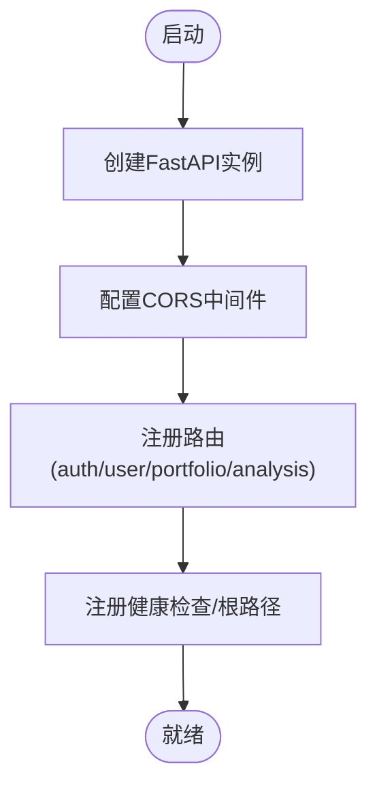
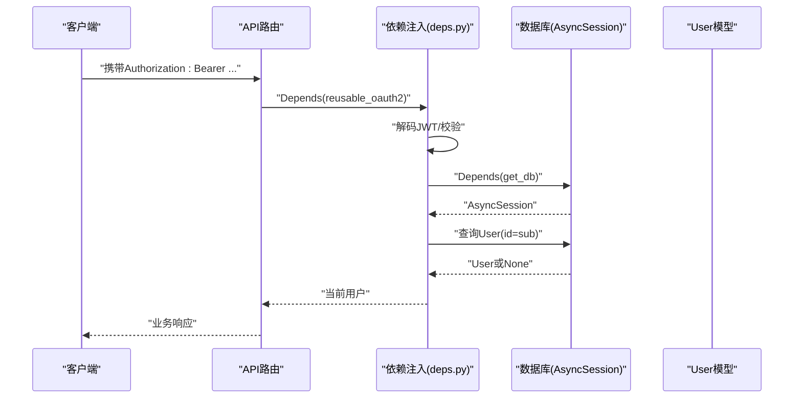
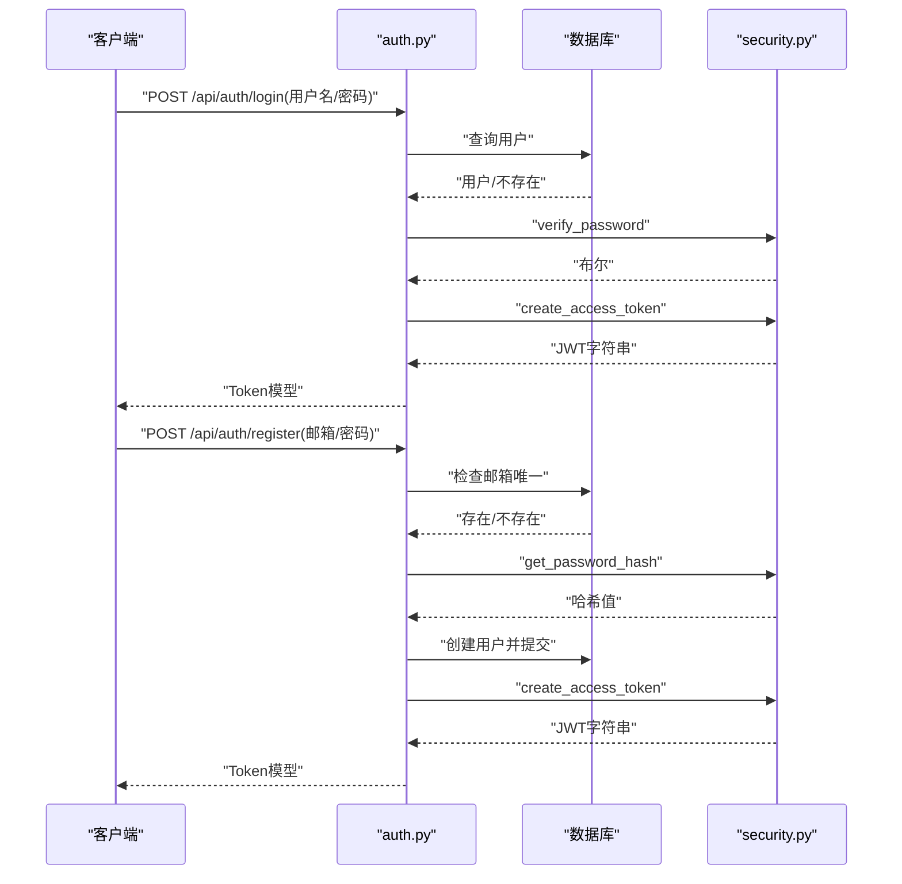
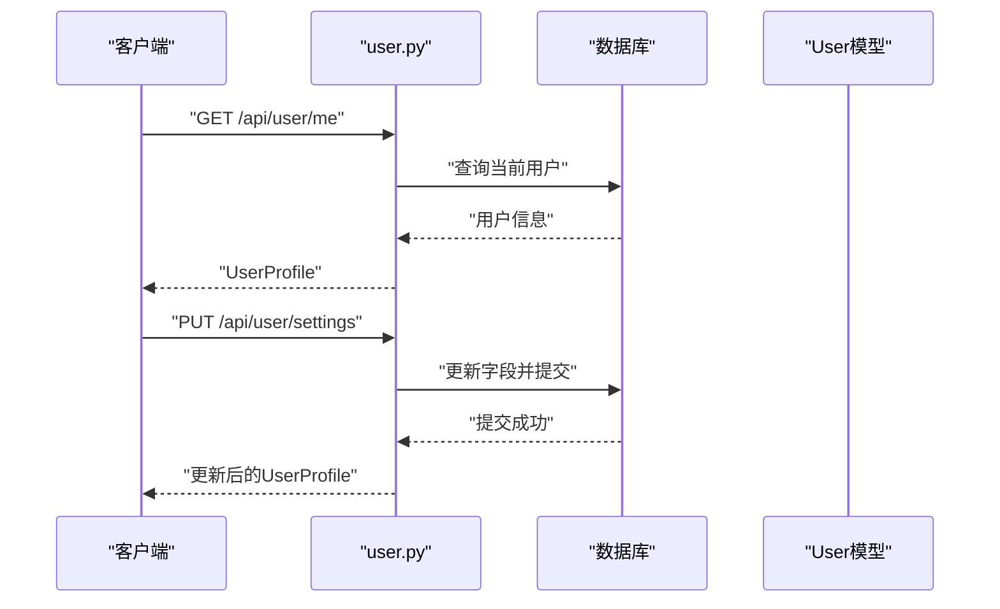
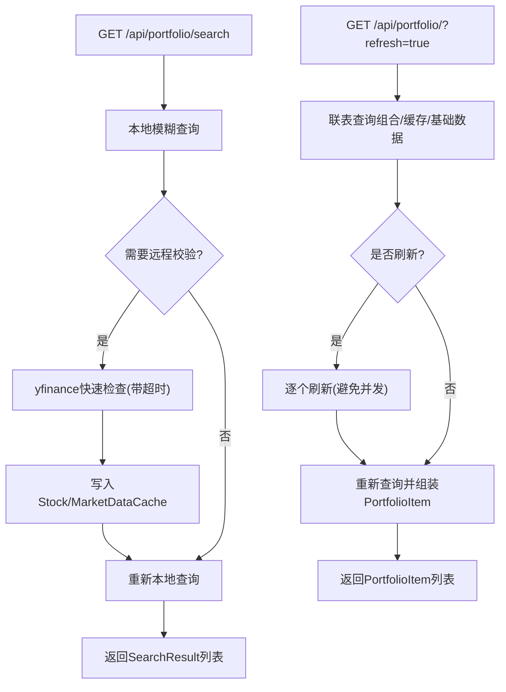
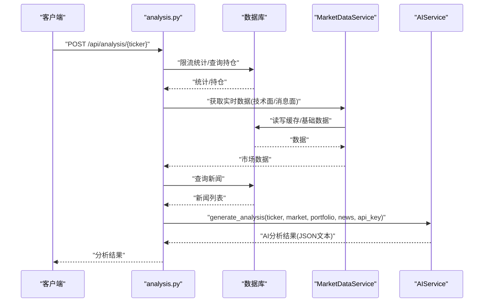
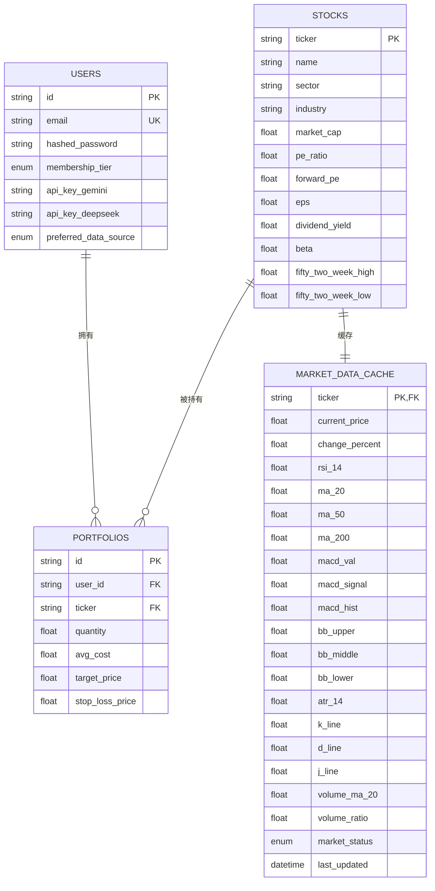
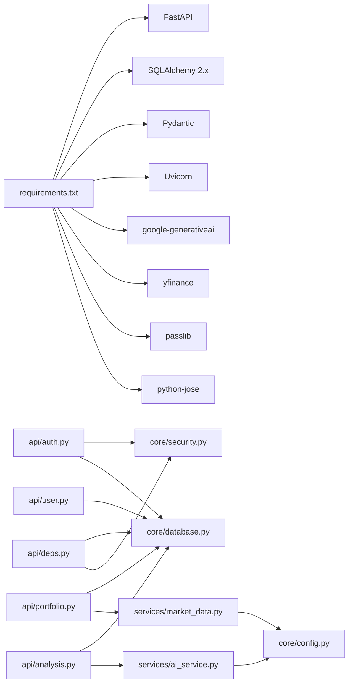

# FastAPI框架详解

<cite>
**本文档引用的文件**
- [backend/app/main.py](file://backend/app/main.py)
- [backend/app/core/config.py](file://backend/app/core/config.py)
- [backend/app/core/database.py](file://backend/app/core/database.py)
- [backend/app/core/security.py](file://backend/app/core/security.py)
- [backend/app/api/deps.py](file://backend/app/api/deps.py)
- [backend/app/api/auth.py](file://backend/app/api/auth.py)
- [backend/app/api/user.py](file://backend/app/api/user.py)
- [backend/app/api/portfolio.py](file://backend/app/api/portfolio.py)
- [backend/app/api/analysis.py](file://backend/app/api/analysis.py)
- [backend/app/models/user.py](file://backend/app/models/user.py)
- [backend/app/models/portfolio.py](file://backend/app/models/portfolio.py)
- [backend/app/models/stock.py](file://backend/app/models/stock.py)
- [backend/app/services/ai_service.py](file://backend/app/services/ai_service.py)
- [backend/app/services/market_data.py](file://backend/app/services/market_data.py)
- [backend/requirements.txt](file://backend/requirements.txt)
</cite>

## 目录
1. [简介](#简介)
2. [项目结构](#项目结构)
3. [核心组件](#核心组件)
4. [架构总览](#架构总览)
5. [详细组件分析](#详细组件分析)
6. [依赖关系分析](#依赖关系分析)
7. [性能考虑](#性能考虑)
8. [故障排除指南](#故障排除指南)
9. [结论](#结论)
10. [附录](#附录)

## 简介
本指南面向希望在本项目中使用FastAPI构建高性能、强类型、自动生成文档的Python后端服务的开发者。文档围绕以下主题展开：
- FastAPI核心特性：自动文档生成、类型提示支持、异步处理能力
- 应用初始化：CORS配置、中间件设置、路由注册
- 依赖注入系统：数据库连接管理、安全验证
- 路由设计：路径参数、查询参数、请求体处理
- 异步编程最佳实践：async/await、并发处理策略
- 错误处理与异常捕获
- 性能优化与生产部署要点

## 项目结构
后端采用分层与按功能模块组织的结构：
- 应用入口与路由：backend/app/main.py
- 核心配置与基础设施：backend/app/core/config.py、backend/app/core/database.py、backend/app/core/security.py
- API层：backend/app/api/auth.py、backend/app/api/user.py、backend/app/api/portfolio.py、backend/app/api/analysis.py、backend/app/api/deps.py
- 数据模型：backend/app/models/user.py、backend/app/models/portfolio.py、backend/app/models/stock.py
- 服务层：backend/app/services/ai_service.py、backend/app/services/market_data.py
- 依赖声明：backend/requirements.txt

图表来源
- [backend/app/main.py](file://backend/app/main.py#L1-L38)
- [backend/app/core/config.py](file://backend/app/core/config.py#L1-L24)
- [backend/app/core/database.py](file://backend/app/core/database.py#L1-L24)
- [backend/app/core/security.py](file://backend/app/core/security.py#L1-L26)
- [backend/app/api/deps.py](file://backend/app/api/deps.py#L1-L44)
- [backend/app/api/auth.py](file://backend/app/api/auth.py#L1-L88)
- [backend/app/api/user.py](file://backend/app/api/user.py#L1-L48)
- [backend/app/api/portfolio.py](file://backend/app/api/portfolio.py#L1-L297)
- [backend/app/api/analysis.py](file://backend/app/api/analysis.py#L1-L124)
- [backend/app/models/user.py](file://backend/app/models/user.py#L1-L31)
- [backend/app/models/portfolio.py](file://backend/app/models/portfolio.py#L1-L26)
- [backend/app/models/stock.py](file://backend/app/models/stock.py#L1-L85)
- [backend/app/services/ai_service.py](file://backend/app/services/ai_service.py#L1-L112)
- [backend/app/services/market_data.py](file://backend/app/services/market_data.py#L1-L370)

章节来源
- [backend/app/main.py](file://backend/app/main.py#L1-L38)
- [backend/requirements.txt](file://backend/requirements.txt#L1-L75)

## 核心组件
- 应用实例与自动文档：通过FastAPI构造函数创建应用实例，自动启用交互式文档（Swagger/OpenAPI）
- 配置中心：集中管理数据库URL、密钥、算法、外部API密钥与代理等
- 数据库与会话：基于SQLAlchemy 2.x异步引擎与AsyncSession，提供依赖注入的数据库会话
- 安全与认证：基于JWT的访问令牌生成与校验，密码哈希与比较
- 依赖注入：OAuth2密码流、当前用户解析、数据库会话提供器
- API路由：认证、用户、组合、分析四大模块，统一前缀与标签

章节来源
- [backend/app/main.py](file://backend/app/main.py#L1-L38)
- [backend/app/core/config.py](file://backend/app/core/config.py#L1-L24)
- [backend/app/core/database.py](file://backend/app/core/database.py#L1-L24)
- [backend/app/core/security.py](file://backend/app/core/security.py#L1-L26)
- [backend/app/api/deps.py](file://backend/app/api/deps.py#L1-L44)

## 架构总览
下图展示了从客户端到服务层与数据层的整体调用链路。

图表来源
- [backend/app/main.py](file://backend/app/main.py#L1-L38)
- [backend/app/api/auth.py](file://backend/app/api/auth.py#L1-L88)
- [backend/app/api/user.py](file://backend/app/api/user.py#L1-L48)
- [backend/app/api/portfolio.py](file://backend/app/api/portfolio.py#L1-L297)
- [backend/app/api/analysis.py](file://backend/app/api/analysis.py#L1-L124)
- [backend/app/api/deps.py](file://backend/app/api/deps.py#L1-L44)
- [backend/app/core/database.py](file://backend/app/core/database.py#L1-L24)
- [backend/app/services/ai_service.py](file://backend/app/services/ai_service.py#L1-L112)
- [backend/app/services/market_data.py](file://backend/app/services/market_data.py#L1-L370)
- [backend/app/models/stock.py](file://backend/app/models/stock.py#L1-L85)

## 详细组件分析

### 应用初始化与CORS配置
- 应用实例：创建FastAPI实例并设置标题
- CORS中间件：允许本地开发的多个前端端口，支持凭据、通配符方法与头
- 路由注册：按模块include_router，统一前缀与标签，便于自动文档分类
- 健康检查：根路径与健康检查接口

图表来源
- [backend/app/main.py](file://backend/app/main.py#L1-L38)

章节来源
- [backend/app/main.py](file://backend/app/main.py#L1-L38)

### 依赖注入系统
- OAuth2密码流：定义tokenUrl，供依赖注入获取令牌
- 当前用户解析：解码JWT，校验算法与载荷，查询用户并返回
- 数据库会话：异步上下文管理器，确保会话生命周期与事务控制

图表来源
- [backend/app/api/deps.py](file://backend/app/api/deps.py#L1-L44)
- [backend/app/core/database.py](file://backend/app/core/database.py#L1-L24)
- [backend/app/models/user.py](file://backend/app/models/user.py#L1-L31)

章节来源
- [backend/app/api/deps.py](file://backend/app/api/deps.py#L1-L44)
- [backend/app/core/database.py](file://backend/app/core/database.py#L1-L24)
- [backend/app/models/user.py](file://backend/app/models/user.py#L1-L31)

### 认证与安全
- 登录流程：OAuth2密码表单校验，匹配用户与哈希密码，签发JWT
- 注册流程：邮箱唯一性检查，密码哈希存储，自动签发令牌
- 密码与令牌：bcrypt哈希、JWT编码/解码、算法常量

图表来源
- [backend/app/api/auth.py](file://backend/app/api/auth.py#L1-L88)
- [backend/app/core/security.py](file://backend/app/core/security.py#L1-L26)
- [backend/app/core/database.py](file://backend/app/core/database.py#L1-L24)

章节来源
- [backend/app/api/auth.py](file://backend/app/api/auth.py#L1-L88)
- [backend/app/core/security.py](file://backend/app/core/security.py#L1-L26)

### 用户与设置
- 个人信息：返回用户标识、邮箱、会员等级、API密钥状态与首选数据源
- 设置更新：支持更新Gemini/DeepSeek密钥与首选数据源，持久化并返回最新状态

图表来源
- [backend/app/api/user.py](file://backend/app/api/user.py#L1-L48)
- [backend/app/models/user.py](file://backend/app/models/user.py#L1-L31)

章节来源
- [backend/app/api/user.py](file://backend/app/api/user.py#L1-L48)
- [backend/app/models/user.py](file://backend/app/models/user.py#L1-L31)

### 投资组合与市场数据
- 搜索股票：本地模糊搜索；可选远程快速校验并写入缓存
- 组合列表：一次性联表查询缓存与基础数据，支持刷新；刷新时顺序拉取避免并发问题
- 新增/删除组合：幂等更新或删除，必要时后台异步拉取技术指标

图表来源
- [backend/app/api/portfolio.py](file://backend/app/api/portfolio.py#L1-L297)
- [backend/app/services/market_data.py](file://backend/app/services/market_data.py#L1-L370)
- [backend/app/models/stock.py](file://backend/app/models/stock.py#L1-L85)

章节来源
- [backend/app/api/portfolio.py](file://backend/app/api/portfolio.py#L1-L297)
- [backend/app/services/market_data.py](file://backend/app/services/market_data.py#L1-L370)
- [backend/app/models/stock.py](file://backend/app/models/stock.py#L1-L85)

### 股票分析与AI服务
- 分析流程：限流检查（免费用户每日上限）、获取市场数据、抓取新闻、拼接用户持仓、调用AI生成报告
- AI服务：优先使用用户自有密钥，否则回退至配置中的密钥；失败时提供降级文本

图表来源
- [backend/app/api/analysis.py](file://backend/app/api/analysis.py#L1-L124)
- [backend/app/services/ai_service.py](file://backend/app/services/ai_service.py#L1-L112)
- [backend/app/services/market_data.py](file://backend/app/services/market_data.py#L1-L370)

章节来源
- [backend/app/api/analysis.py](file://backend/app/api/analysis.py#L1-L124)
- [backend/app/services/ai_service.py](file://backend/app/services/ai_service.py#L1-L112)
- [backend/app/services/market_data.py](file://backend/app/services/market_data.py#L1-L370)

### 数据模型与关系
- 用户：邮箱唯一、密码哈希、会员等级、API密钥与首选数据源
- 股票：基础财务信息与一对一同步的市场数据缓存
- 组合：用户与股票的多维约束，记录数量与成本

图表来源
- [backend/app/models/user.py](file://backend/app/models/user.py#L1-L31)
- [backend/app/models/stock.py](file://backend/app/models/stock.py#L1-L85)
- [backend/app/models/portfolio.py](file://backend/app/models/portfolio.py#L1-L26)

章节来源
- [backend/app/models/user.py](file://backend/app/models/user.py#L1-L31)
- [backend/app/models/stock.py](file://backend/app/models/stock.py#L1-L85)
- [backend/app/models/portfolio.py](file://backend/app/models/portfolio.py#L1-L26)

## 依赖关系分析
- 外部依赖：FastAPI、SQLAlchemy 2.x、Pydantic、Uvicorn、Google Generative AI、yfinance、passlib、python-jose等
- 内部耦合：API层依赖依赖注入与数据库；服务层依赖配置与模型；路由间通过依赖共享当前用户

图表来源
- [backend/requirements.txt](file://backend/requirements.txt#L1-L75)
- [backend/app/api/auth.py](file://backend/app/api/auth.py#L1-L88)
- [backend/app/api/user.py](file://backend/app/api/user.py#L1-L48)
- [backend/app/api/portfolio.py](file://backend/app/api/portfolio.py#L1-L297)
- [backend/app/api/analysis.py](file://backend/app/api/analysis.py#L1-L124)
- [backend/app/api/deps.py](file://backend/app/api/deps.py#L1-L44)
- [backend/app/core/security.py](file://backend/app/core/security.py#L1-L26)
- [backend/app/core/database.py](file://backend/app/core/database.py#L1-L24)
- [backend/app/services/ai_service.py](file://backend/app/services/ai_service.py#L1-L112)
- [backend/app/services/market_data.py](file://backend/app/services/market_data.py#L1-L370)
- [backend/app/core/config.py](file://backend/app/core/config.py#L1-L24)

章节来源
- [backend/requirements.txt](file://backend/requirements.txt#L1-L75)

## 性能考虑
- 异步数据库：使用AsyncSession与异步引擎，减少阻塞
- 缓存策略：1分钟内复用缓存，避免重复外部请求
- 并发与限流：yfinance重试与指数退避，避免429；组合刷新顺序执行以规避SQLite并发问题
- 轻量化响应：仅返回所需字段，避免大对象序列化
- 生产部署：使用Uvicorn作为ASGI服务器，合理设置worker与uvloop；数据库连接池与超时配置

[本节为通用指导，无需特定文件来源]

## 故障排除指南
- 认证失败：检查Authorization头格式与JWT签名算法；确认密钥一致
- 数据库连接：确认DATABASE_URL与驱动可用；SQLite在多线程场景需正确配置
- 外部API限流：yfinance可能触发429，检查重试与代理配置；Alpha Vantage注意额度
- 健康检查：访问/health确认服务可用

章节来源
- [backend/app/api/deps.py](file://backend/app/api/deps.py#L1-L44)
- [backend/app/core/database.py](file://backend/app/core/database.py#L1-L24)
- [backend/app/services/market_data.py](file://backend/app/services/market_data.py#L1-L370)
- [backend/app/main.py](file://backend/app/main.py#L1-L38)

## 结论
本项目完整展示了如何利用FastAPI的类型安全、异步与自动生成文档能力，结合依赖注入与清晰的分层架构，构建一个具备认证、用户管理、投资组合与AI分析能力的金融应用后端。通过合理的缓存、限流与并发策略，可在生产环境中获得稳定与高性能的表现。

[本节为总结，无需特定文件来源]

## 附录
- 开发与运行：安装依赖后，使用Uvicorn启动应用；在开发环境可直接访问交互式文档
- 配置项：数据库URL、JWT密钥与算法、外部API密钥、代理等均通过配置中心集中管理

章节来源
- [backend/requirements.txt](file://backend/requirements.txt#L1-L75)
- [backend/app/core/config.py](file://backend/app/core/config.py#L1-L24)
- [backend/app/main.py](file://backend/app/main.py#L1-L38)