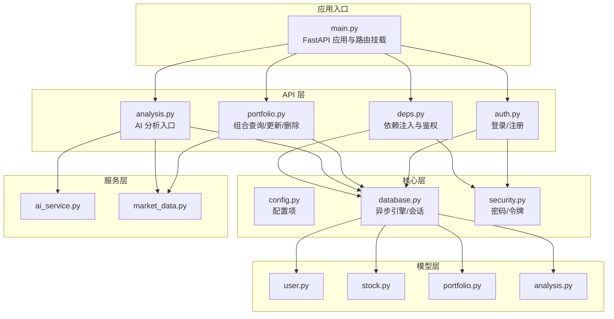
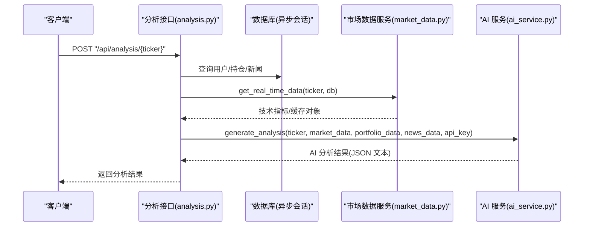
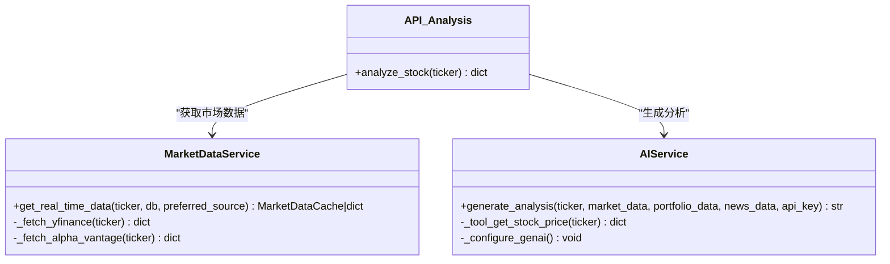
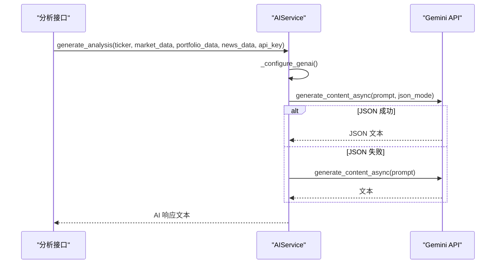
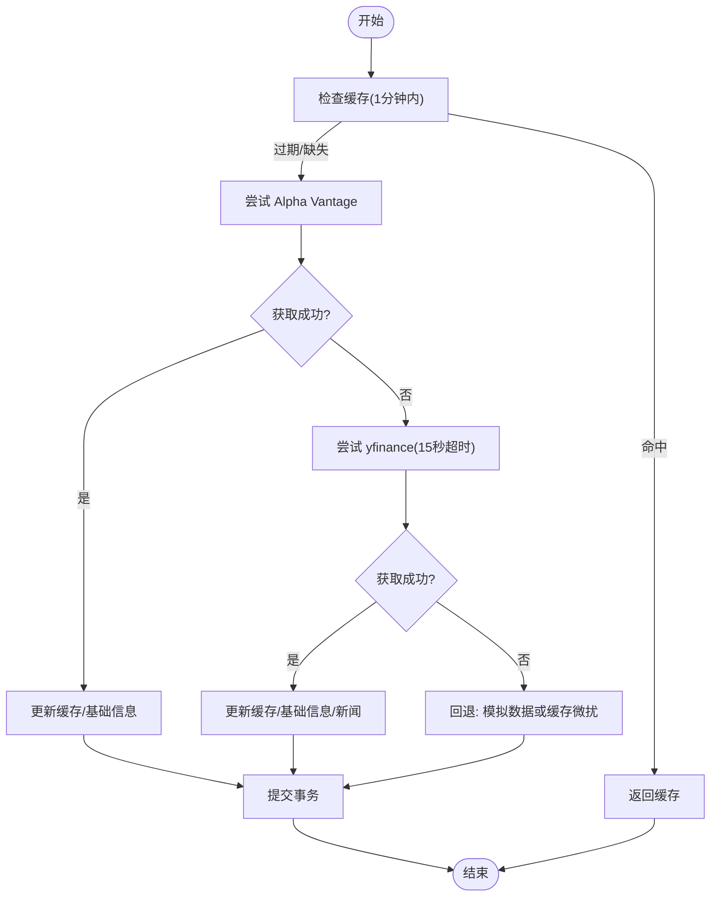
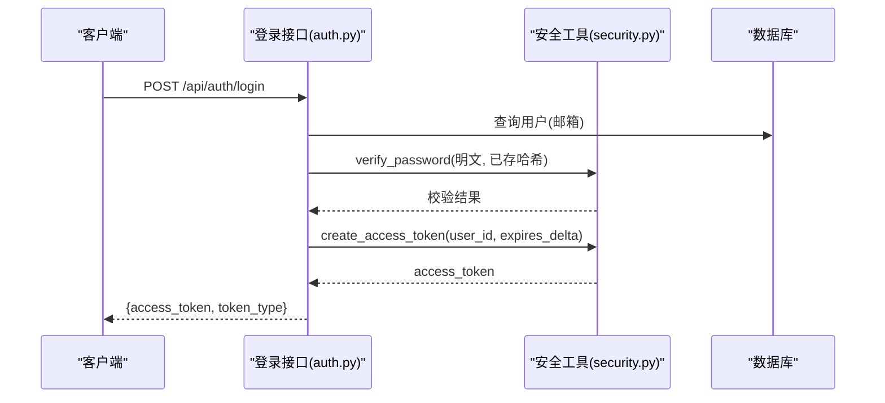
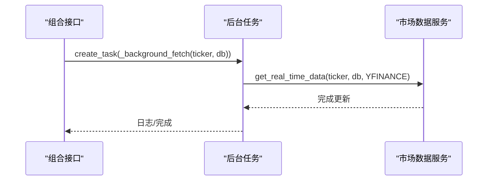
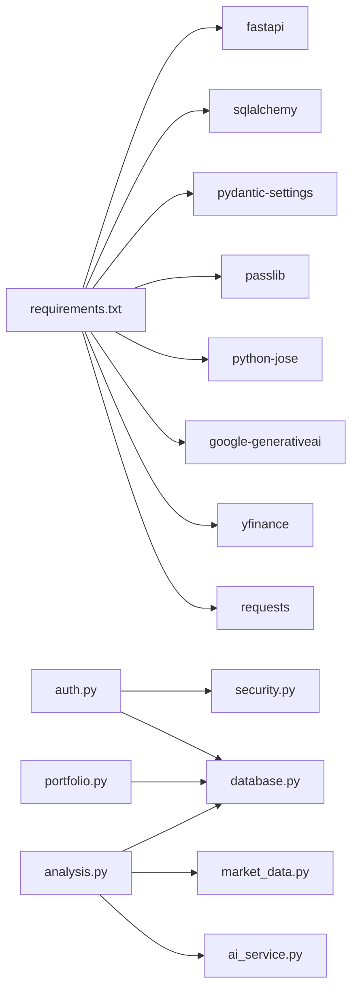
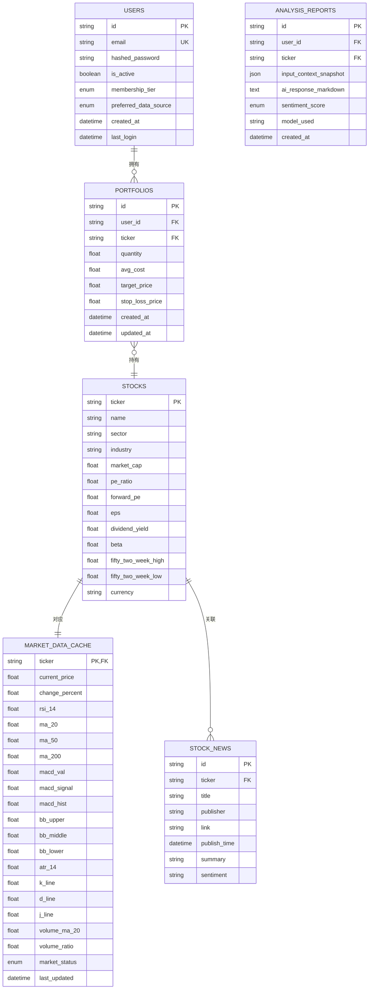

# 业务服务实现

<cite>
**本文引用的文件**
- [backend/app/main.py](file://backend/app/main.py)
- [backend/app/api/auth.py](file://backend/app/api/auth.py)
- [backend/app/api/deps.py](file://backend/app/api/deps.py)
- [backend/app/api/portfolio.py](file://backend/app/api/portfolio.py)
- [backend/app/api/analysis.py](file://backend/app/api/analysis.py)
- [backend/app/core/config.py](file://backend/app/core/config.py)
- [backend/app/core/database.py](file://backend/app/core/database.py)
- [backend/app/core/security.py](file://backend/app/core/security.py)
- [backend/app/models/user.py](file://backend/app/models/user.py)
- [backend/app/models/stock.py](file://backend/app/models/stock.py)
- [backend/app/models/portfolio.py](file://backend/app/models/portfolio.py)
- [backend/app/models/analysis.py](file://backend/app/models/analysis.py)
- [backend/app/services/ai_service.py](file://backend/app/services/ai_service.py)
- [backend/app/services/market_data.py](file://backend/app/services/market_data.py)
- [backend/requirements.txt](file://backend/requirements.txt)
</cite>

## 目录
1. [简介](#简介)
2. [项目结构](#项目结构)
3. [核心组件](#核心组件)
4. [架构总览](#架构总览)
5. [组件详解](#组件详解)
6. [依赖关系分析](#依赖关系分析)
7. [性能考量](#性能考量)
8. [故障排查指南](#故障排查指南)
9. [结论](#结论)
10. [附录](#附录)

## 简介
本指南面向后端服务开发者，系统性阐述业务服务层的设计与实现，覆盖以下主题：
- 服务层设计模式：接口抽象、实现策略与依赖注入
- AI 服务集成：Gemini API 的调用与响应处理
- 市场数据服务：数据获取、缓存策略与错误处理
- 安全服务：密码加密、JWT 令牌生成与校验
- 服务间通信：依赖注入、路由与服务组合
- 异步任务：后台任务调度与队列管理
- 监控与日志：日志记录与健康检查
- 性能优化：连接池与资源复用
- 测试方法：模拟对象与集成测试

## 项目结构
后端采用 FastAPI + SQLAlchemy Async 架构，按功能模块划分：
- API 层：路由与控制器，负责请求接入与鉴权
- 核心层：配置、数据库、安全工具
- 模型层：ORM 映射与枚举
- 服务层：AI 与市场数据服务
- 运行入口：应用启动与路由挂载

图表来源
- [backend/app/main.py](file://backend/app/main.py#L24-L29)
- [backend/app/api/auth.py](file://backend/app/api/auth.py#L14-L14)
- [backend/app/api/deps.py](file://backend/app/api/deps.py#L17-L43)
- [backend/app/api/portfolio.py](file://backend/app/api/portfolio.py#L13-L13)
- [backend/app/api/analysis.py](file://backend/app/api/analysis.py#L11-L11)
- [backend/app/core/database.py](file://backend/app/core/database.py#L5-L23)
- [backend/app/core/security.py](file://backend/app/core/security.py#L1-L26)
- [backend/app/models/user.py](file://backend/app/models/user.py#L15-L31)
- [backend/app/models/stock.py](file://backend/app/models/stock.py#L13-L85)
- [backend/app/models/portfolio.py](file://backend/app/models/portfolio.py#L7-L26)
- [backend/app/models/analysis.py](file://backend/app/models/analysis.py#L12-L25)
- [backend/app/services/ai_service.py](file://backend/app/services/ai_service.py#L8-L112)
- [backend/app/services/market_data.py](file://backend/app/services/market_data.py#L13-L370)

章节来源
- [backend/app/main.py](file://backend/app/main.py#L1-L38)
- [backend/app/core/database.py](file://backend/app/core/database.py#L1-L24)

## 核心组件
- 配置中心：集中管理密钥、算法、过期时间与外部 API 凭据
- 数据库层：异步 SQLAlchemy 引擎与会话工厂
- 安全工具：密码哈希、JWT 编解码
- 服务层：
  - MarketDataService：实时行情获取、缓存与技术指标计算
  - AIService：Gemini 接口封装与提示工程
- API 控制器：鉴权、用户管理、组合管理、分析入口

章节来源
- [backend/app/core/config.py](file://backend/app/core/config.py#L4-L23)
- [backend/app/core/database.py](file://backend/app/core/database.py#L5-L23)
- [backend/app/core/security.py](file://backend/app/core/security.py#L1-L26)
- [backend/app/services/market_data.py](file://backend/app/services/market_data.py#L13-L171)
- [backend/app/services/ai_service.py](file://backend/app/services/ai_service.py#L8-L112)
- [backend/app/api/auth.py](file://backend/app/api/auth.py#L24-L50)
- [backend/app/api/portfolio.py](file://backend/app/api/portfolio.py#L143-L224)
- [backend/app/api/analysis.py](file://backend/app/api/analysis.py#L13-L123)

## 架构总览
服务层通过依赖注入在 API 层被消费，数据访问统一由异步会话完成，AI 与市场数据服务分别承担“智能决策”和“数据供给”的职责。

图表来源
- [backend/app/api/analysis.py](file://backend/app/api/analysis.py#L13-L123)
- [backend/app/services/market_data.py](file://backend/app/services/market_data.py#L15-L170)
- [backend/app/services/ai_service.py](file://backend/app/services/ai_service.py#L43-L111)

## 组件详解

### 服务层设计模式与依赖注入
- 设计模式
  - 服务类封装：MarketDataService、AIService 以静态方法或类方法形式暴露纯函数式能力，便于测试与复用
  - 依赖注入：API 控制器通过 FastAPI 的 Depends 获取数据库会话与当前用户，避免硬编码耦合
- 实现策略
  - 会话生命周期：get_db 提供异步上下文，确保事务边界清晰
  - 鉴权中间件：OAuth2PasswordBearer + JWT 解码，get_current_user 从令牌提取用户并查询数据库
- 服务组合
  - 分析接口串联：鉴权 -> 市场数据 -> 新闻 -> 持仓 -> AI 生成 -> 返回

图表来源
- [backend/app/services/market_data.py](file://backend/app/services/market_data.py#L13-L370)
- [backend/app/services/ai_service.py](file://backend/app/services/ai_service.py#L8-L112)
- [backend/app/api/analysis.py](file://backend/app/api/analysis.py#L13-L123)

章节来源
- [backend/app/api/deps.py](file://backend/app/api/deps.py#L17-L43)
- [backend/app/core/database.py](file://backend/app/core/database.py#L21-L23)
- [backend/app/api/analysis.py](file://backend/app/api/analysis.py#L13-L123)

### AI 服务集成（Gemini）
- 调用流程
  - 配置：若首次使用，按需配置 Gemini API Key；支持传入临时 Key
  - 初始化：指定模型名称，启用 JSON 响应格式
  - 提示工程：将用户持仓、技术指标、新闻整合为中文提示
  - 错误处理：JSON 模式失败时回退到普通文本模式
- 响应处理
  - 返回 AI 生成的 JSON 文本片段（去除代码块标记），便于前端渲染
  - 失败场景：记录日志并返回可读错误信息

图表来源
- [backend/app/services/ai_service.py](file://backend/app/services/ai_service.py#L43-L111)

章节来源
- [backend/app/services/ai_service.py](file://backend/app/services/ai_service.py#L8-L112)

### 市场数据服务
- 数据获取
  - 优先级：Alpha Vantage（若可用）-> yfinance（超时控制）
  - 代理：支持通过环境变量设置 HTTP_PROXY/HTTPS_PROXY
- 缓存策略
  - 缓存表：MarketDataCache，1 分钟内命中直接返回
  - 更新：缺失或过期时拉取并写入缓存；同时更新 Stock 基础信息
- 技术指标计算
  - MACD、布林带、RSI、ATR、KDJ、量能均值与比率等
- 错误处理
  - 429 限流：指数退避 + 随机抖动
  - 回退：无可用数据时返回半真实模拟数据或使用缓存微扰
- 新闻同步
  - 仅 yfinance 来源抓取新闻，SQLite upsert 去重

图表来源
- [backend/app/services/market_data.py](file://backend/app/services/market_data.py#L15-L170)

章节来源
- [backend/app/services/market_data.py](file://backend/app/services/market_data.py#L13-L370)

### 安全服务（密码与 JWT）
- 密码加密与校验：bcrypt 上下文，统一 hash 与 verify 接口
- JWT 令牌：HS256 算法，支持自定义过期时间，默认 24 小时
- 鉴权流程：OAuth2PasswordBearer 获取令牌，解码校验后查询用户

图表来源
- [backend/app/api/auth.py](file://backend/app/api/auth.py#L24-L50)
- [backend/app/core/security.py](file://backend/app/core/security.py#L11-L25)

章节来源
- [backend/app/core/security.py](file://backend/app/core/security.py#L1-L26)
- [backend/app/api/auth.py](file://backend/app/api/auth.py#L24-L50)
- [backend/app/api/deps.py](file://backend/app/api/deps.py#L17-L43)

### 服务间通信与依赖注入
- 依赖注入
  - get_db：提供 AsyncSession
  - reusable_oauth2：OAuth2PasswordBearer
  - get_current_user：基于令牌解析用户
- 服务组合
  - 分析接口组合：鉴权 -> 市场数据 -> 新闻 -> 持仓 -> AI
  - 组合接口：一次性查询组合并按需刷新，支持后台任务补充技术指标

章节来源
- [backend/app/api/deps.py](file://backend/app/api/deps.py#L17-L43)
- [backend/app/api/portfolio.py](file://backend/app/api/portfolio.py#L143-L224)
- [backend/app/api/analysis.py](file://backend/app/api/analysis.py#L13-L123)

### 异步任务与队列管理
- 背景任务：新增组合条目后，立即创建后台任务拉取完整技术指标，不阻塞主流程
- 任务调度：使用 asyncio.create_task 触发，内部再次调用 MarketDataService 完成数据补全

图表来源
- [backend/app/api/portfolio.py](file://backend/app/api/portfolio.py#L266-L278)
- [backend/app/services/market_data.py](file://backend/app/services/market_data.py#L15-L170)

章节来源
- [backend/app/api/portfolio.py](file://backend/app/api/portfolio.py#L266-L278)

### 监控与日志
- 健康检查：根路径与 /health 返回服务状态
- 日志记录：AI 服务对 Gemini 调用异常进行错误日志记录
- 数据库回显：异步引擎初始化时开启 echo（开发环境）

章节来源
- [backend/app/main.py](file://backend/app/main.py#L31-L37)
- [backend/app/services/ai_service.py](file://backend/app/services/ai_service.py#L103-L111)
- [backend/app/core/database.py](file://backend/app/core/database.py#L7-L8)

## 依赖关系分析
- 外部依赖
  - FastAPI、SQLAlchemy Async、Pydantic Settings、Passlib、python-jose、google-generativeai、yfinance、requests
- 内部依赖
  - API 层依赖核心层与模型层；服务层依赖配置与数据库；分析接口串联市场数据与 AI 服务

图表来源
- [backend/requirements.txt](file://backend/requirements.txt#L1-L75)
- [backend/app/api/auth.py](file://backend/app/api/auth.py#L1-L14)
- [backend/app/api/analysis.py](file://backend/app/api/analysis.py#L1-L11)
- [backend/app/services/market_data.py](file://backend/app/services/market_data.py#L1-L11)
- [backend/app/services/ai_service.py](file://backend/app/services/ai_service.py#L1-L2)

章节来源
- [backend/requirements.txt](file://backend/requirements.txt#L1-L75)

## 性能考量
- 连接池与资源复用
  - 异步引擎：复用连接，减少线程开销
  - 会话工厂：AsyncSession 默认关闭过期提交，降低锁竞争
- 网络与限流
  - yfinance 429 时指数退避 + 抖动；超时控制；代理支持
- 缓存与回退
  - 1 分钟缓存窗口；无数据时半真实模拟或缓存微扰，保证用户体验
- 并发与顺序
  - SQLite 并发限制下，批量刷新采用顺序执行并加延时，避免 429

章节来源
- [backend/app/core/database.py](file://backend/app/core/database.py#L5-L23)
- [backend/app/services/market_data.py](file://backend/app/services/market_data.py#L15-L170)
- [backend/app/api/portfolio.py](file://backend/app/api/portfolio.py#L162-L174)

## 故障排查指南
- Gemini API 未配置
  - 现象：AI 分析返回“缺少密钥”的提示
  - 处理：在用户设置中配置 Gemini API Key 或在调用时传入
- yfinance 429 限流
  - 现象：频繁报错或延迟明显
  - 处理：增加延时、使用 Alpha Vantage、配置代理
- 缓存未更新
  - 现象：技术指标为空
  - 处理：触发刷新或等待后台任务完成
- JWT 校验失败
  - 现象：403 无法验证凭据
  - 处理：确认令牌签名算法一致、密钥正确、未过期

章节来源
- [backend/app/services/ai_service.py](file://backend/app/services/ai_service.py#L47-L48)
- [backend/app/services/market_data.py](file://backend/app/services/market_data.py#L305-L316)
- [backend/app/api/deps.py](file://backend/app/api/deps.py#L28-L33)

## 结论
本项目以清晰的服务层划分与依赖注入为基础，结合缓存与限流策略，实现了稳定高效的市场数据与 AI 分析能力。通过统一的安全工具与鉴权流程，保障了用户认证与数据访问安全。建议在生产环境中进一步完善：
- 增强 AI 响应解析与日志归档
- 引入速率限制与配额管理
- 使用连接池参数调优与数据库索引优化
- 补充单元测试与集成测试覆盖率

## 附录

### 数据模型关系

图表来源
- [backend/app/models/user.py](file://backend/app/models/user.py#L15-L31)
- [backend/app/models/stock.py](file://backend/app/models/stock.py#L13-L85)
- [backend/app/models/portfolio.py](file://backend/app/models/portfolio.py#L7-L26)
- [backend/app/models/analysis.py](file://backend/app/models/analysis.py#L12-L25)