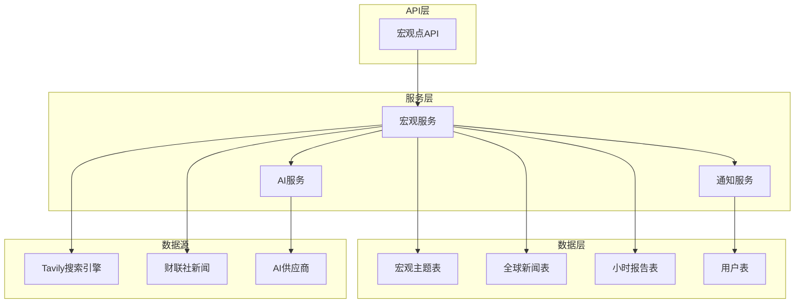
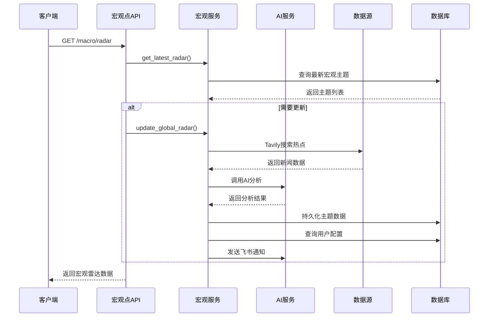
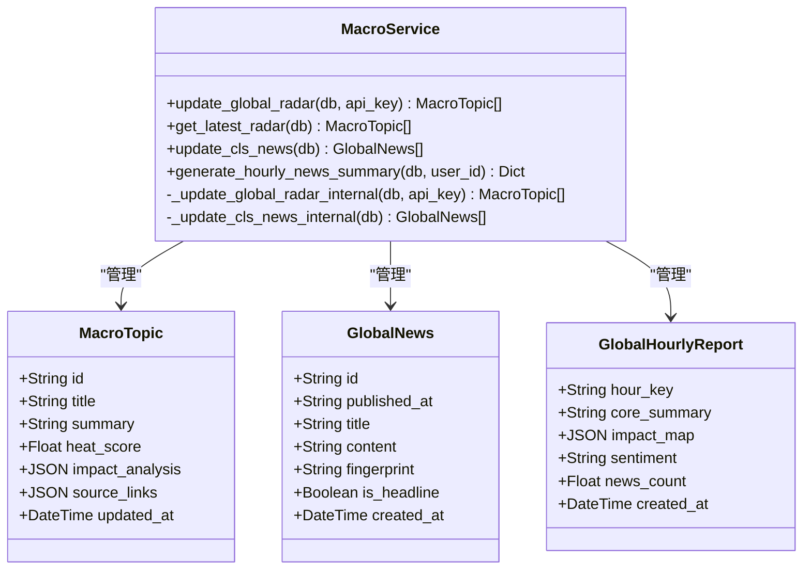
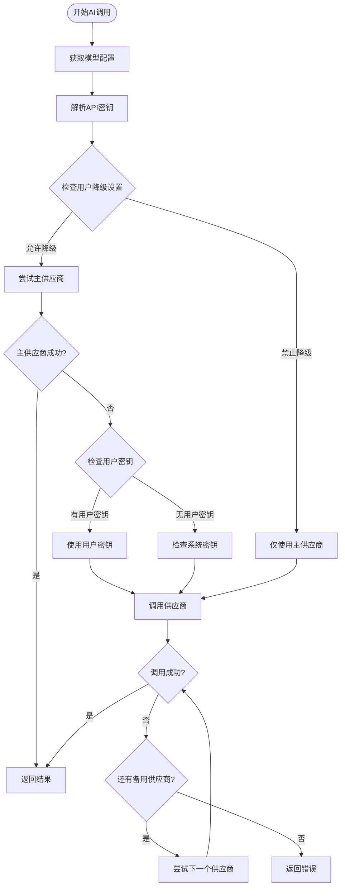
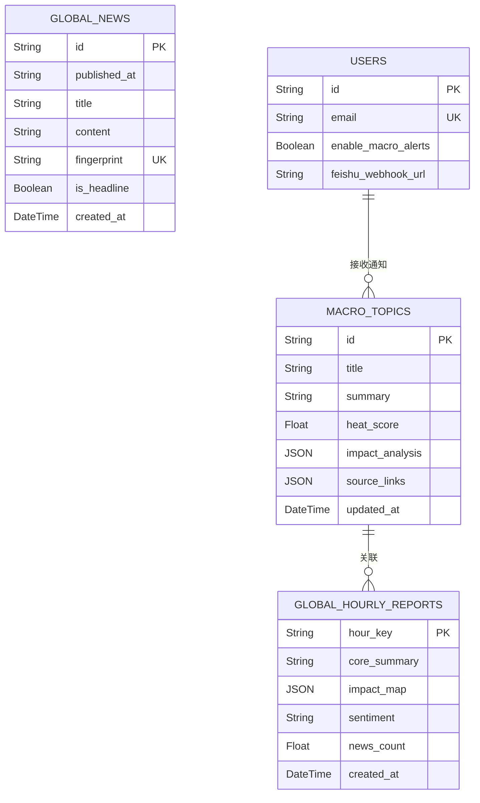
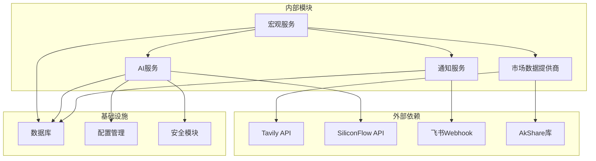

# 宏观分析服务

<cite>
**本文档引用的文件**
- [backend/app/services/macro_service.py](file://backend/app/services/macro_service.py)
- [backend/app/api/v1/endpoints/macro.py](file://backend/app/api/v1/endpoints/macro.py)
- [backend/app/models/macro.py](file://backend/app/models/macro.py)
- [backend/app/services/ai_service.py](file://backend/app/services/ai_service.py)
- [backend/app/services/notification_service.py](file://backend/app/services/notification_service.py)
- [backend/app/services/market_providers/tavily.py](file://backend/app/services/market_providers/tavily.py)
- [backend/app/models/user.py](file://backend/app/models/user.py)
- [backend/app/api/v1/api.py](file://backend/app/api/v1/api.py)
- [backend/app/core/config.py](file://backend/app/core/config.py)
- [backend/app/models/ai_config.py](file://backend/app/models/ai_config.py)
- [backend/app/models/provider_config.py](file://backend/app/models/provider_config.py)
</cite>

## 目录
1. [简介](#简介)
2. [项目结构](#项目结构)
3. [核心组件](#核心组件)
4. [架构概览](#架构概览)
5. [详细组件分析](#详细组件分析)
6. [依赖关系分析](#依赖关系分析)
7. [性能考虑](#性能考虑)
8. [故障排除指南](#故障排除指南)
9. [结论](#结论)

## 简介

宏观分析服务是AI股票顾问系统的核心功能模块之一，负责提供全球宏观市场洞察和实时新闻分析。该服务通过整合多个数据源，包括Tavily AI搜索引擎、财联社全球快讯、以及AI智能分析引擎，为用户提供宏观层面的投资决策支持。

该服务的主要功能包括：
- 全球宏观热点雷达扫描
- 实时新闻聚合与分析
- AI驱动的宏观影响评估
- 个性化投资建议推送
- 多维度市场情绪分析

## 项目结构

宏观分析服务在项目中的组织结构如下：

**图表来源**
- [backend/app/api/v1/endpoints/macro.py:1-79](file://backend/app/api/v1/endpoints/macro.py#L1-L79)
- [backend/app/services/macro_service.py:1-442](file://backend/app/services/macro_service.py#L1-L442)

**章节来源**
- [backend/app/api/v1/endpoints/macro.py:1-79](file://backend/app/api/v1/endpoints/macro.py#L1-L79)
- [backend/app/services/macro_service.py:1-442](file://backend/app/services/macro_service.py#L1-L442)

## 核心组件

宏观分析服务由以下核心组件构成：

### 1. 宏观服务 (MacroService)
负责整个宏观分析流程的协调和执行，包括数据抓取、AI分析、数据持久化和通知推送。

### 2. AI服务 (AIService)
提供统一的AI供应商调用接口，支持多种AI模型和供应商的故障转移机制。

### 3. 通知服务 (NotificationService)
负责将宏观分析结果通过飞书机器人推送给用户，支持多种通知类型和去重机制。

### 4. 数据模型
包括宏观主题、全球新闻、小时报告等数据结构，支撑完整的数据分析和存储需求。

**章节来源**
- [backend/app/services/macro_service.py:21-442](file://backend/app/services/macro_service.py#L21-L442)
- [backend/app/services/ai_service.py:22-254](file://backend/app/services/ai_service.py#L22-L254)
- [backend/app/models/macro.py:1-61](file://backend/app/models/macro.py#L1-L61)

## 架构概览

宏观分析服务采用分层架构设计，实现了清晰的关注点分离：

**图表来源**
- [backend/app/api/v1/endpoints/macro.py:15-39](file://backend/app/api/v1/endpoints/macro.py#L15-L39)
- [backend/app/services/macro_service.py:23-236](file://backend/app/services/macro_service.py#L23-L236)

该架构具有以下特点：
- **异步处理**：支持非阻塞的后台更新
- **缓存机制**：避免重复的AI调用
- **故障转移**：多供应商支持和降级策略
- **通知集成**：实时推送分析结果

## 详细组件分析

### 宏观服务 (MacroService)

宏观服务是整个系统的核心协调者，负责管理完整的宏观分析流程。

#### 主要功能模块

**图表来源**
- [backend/app/services/macro_service.py:21-442](file://backend/app/services/macro_service.py#L21-L442)
- [backend/app/models/macro.py:6-61](file://backend/app/models/macro.py#L6-L61)

#### 数据处理流程

宏观服务采用"热点扫描-AI分析-持久化-通知"的完整流程：

1. **数据采集阶段**：使用Tavily搜索引擎获取全球宏观热点
2. **降级机制**：当API受限时，回退到本地新闻数据
3. **AI分析阶段**：调用SiliconFlow进行主题聚类和影响分析
4. **数据持久化**：实现UPSERT逻辑，保持数据新鲜度
5. **通知推送**：向配置了的用户发送实时提醒

**章节来源**
- [backend/app/services/macro_service.py:32-236](file://backend/app/services/macro_service.py#L32-L236)

### AI服务 (AIService)

AI服务提供了统一的AI供应商调用接口，支持灵活的供应商管理和故障转移：

**图表来源**
- [backend/app/services/ai_service.py:162-211](file://backend/app/services/ai_service.py#L162-L211)

**章节来源**
- [backend/app/services/ai_service.py:22-254](file://backend/app/services/ai_service.py#L22-L254)

### 通知服务 (NotificationService)

通知服务实现了完整的飞书机器人集成，支持多种通知类型和智能去重：

#### 通知类型分类

| 通知类型 | 用途 | 去重策略 |
|---------|------|----------|
| MACRO_ALERT | 宏观热点预警 | 24小时严格去重 |
| MACRO_SUMMARY | 宏观扫描汇总 | 30分钟窗口去重 |
| HOURLY_NEWS_SUMMARY | 每小时新闻摘要 | 30分钟窗口去重 |
| PRICE_ALERT | 价格预警 | 24小时严格去重 |
| STRATEGY_CHANGE | 策略调整 | 24小时严格去重 |

**章节来源**
- [backend/app/services/notification_service.py:14-410](file://backend/app/services/notification_service.py#L14-L410)

### 数据模型设计

宏观分析服务使用了三个核心数据表来支撑完整的分析流程：

**图表来源**
- [backend/app/models/macro.py:6-61](file://backend/app/models/macro.py#L6-L61)
- [backend/app/models/user.py:29-80](file://backend/app/models/user.py#L29-L80)

**章节来源**
- [backend/app/models/macro.py:1-61](file://backend/app/models/macro.py#L1-L61)
- [backend/app/models/user.py:1-80](file://backend/app/models/user.py#L1-L80)

## 依赖关系分析

宏观分析服务的依赖关系呈现清晰的分层结构：

**图表来源**
- [backend/app/services/macro_service.py:12-18](file://backend/app/services/macro_service.py#L12-L18)
- [backend/app/services/ai_service.py:3-17](file://backend/app/services/ai_service.py#L3-L17)

### 关键依赖特性

1. **异步并发控制**：使用信号量限制Tavily API的并发请求
2. **配置驱动**：通过Settings类集中管理所有外部服务配置
3. **安全加密**：用户API密钥采用加密存储和传输
4. **故障转移**：多供应商支持和智能降级策略

**章节来源**
- [backend/app/services/market_providers/tavily.py:17-25](file://backend/app/services/market_providers/tavily.py#L17-L25)
- [backend/app/core/config.py:4-36](file://backend/app/core/config.py#L4-L36)

## 性能考虑

宏观分析服务在设计时充分考虑了性能优化：

### 缓存策略
- **模型配置缓存**：5分钟TTL的AI模型配置缓存
- **供应商列表缓存**：10分钟TTL的供应商配置缓存
- **热点数据缓存**：基于updated_at的时间戳缓存

### 异步处理
- **后台更新**：使用BackgroundTasks进行非阻塞的数据更新
- **并发控制**：Tavily API使用信号量限制并发请求
- **批量操作**：数据库操作使用批量提交减少IO开销

### 降级机制
- **API配额降级**：当Tavily配额不足时回退到本地数据
- **供应商故障转移**：多供应商支持自动故障转移
- **智能刷新策略**：基于数据新鲜度的条件更新

## 故障排除指南

### 常见问题及解决方案

#### 1. Tavily API配置问题
**症状**：宏观雷达更新失败，日志显示API key未配置
**解决方案**：
- 检查`.env`文件中的`TAVILY_API_KEY`配置
- 验证API key的有效性和配额状态
- 确认网络连接正常

#### 2. AI服务调用失败
**症状**：AI分析返回错误信息
**解决方案**：
- 检查`SILICONFLOW_API_KEY`配置
- 验证AI模型配置是否正确
- 查看供应商故障转移日志

#### 3. 通知推送失败
**症状**：飞书机器人无法接收消息
**解决方案**：
- 验证`FEISHU_WEBHOOK_URL`配置
- 检查飞书应用的权限设置
- 查看通知去重机制是否阻止了消息

#### 4. 数据库连接问题
**症状**：宏观数据无法持久化
**解决方案**：
- 检查`DATABASE_URL`配置
- 验证数据库服务状态
- 查看迁移脚本执行情况

**章节来源**
- [backend/app/services/macro_service.py:38-40](file://backend/app/services/macro_service.py#L38-L40)
- [backend/app/services/ai_service.py:140-159](file://backend/app/services/ai_service.py#L140-L159)
- [backend/app/services/notification_service.py:77-79](file://backend/app/services/notification_service.py#L77-L79)

## 结论

宏观分析服务通过精心设计的架构和完善的组件协作，为用户提供了一个强大而可靠的全球宏观市场分析平台。该服务的主要优势包括：

1. **全面的数据覆盖**：整合多个数据源，确保信息的准确性和时效性
2. **智能的AI分析**：利用先进的AI模型进行深度分析和预测
3. **灵活的通知机制**：支持多种通知方式和个性化配置
4. **健壮的系统设计**：具备完善的错误处理和故障转移能力
5. **优秀的性能表现**：通过缓存和异步处理确保系统的高效运行

该服务为AI股票顾问系统提供了坚实的宏观分析基础，能够帮助用户更好地理解和应对复杂的市场变化，做出更加明智的投资决策。