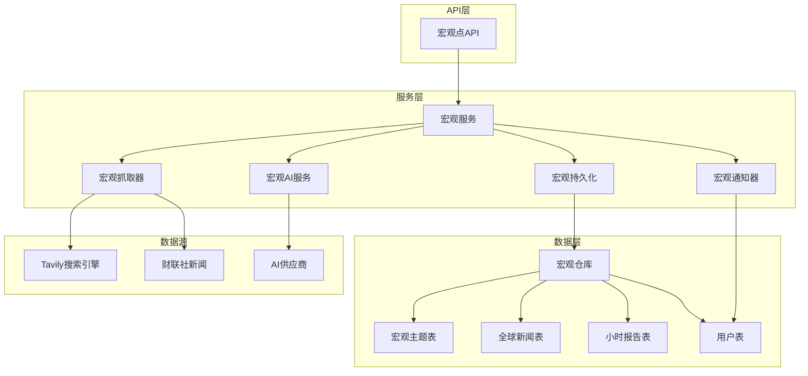
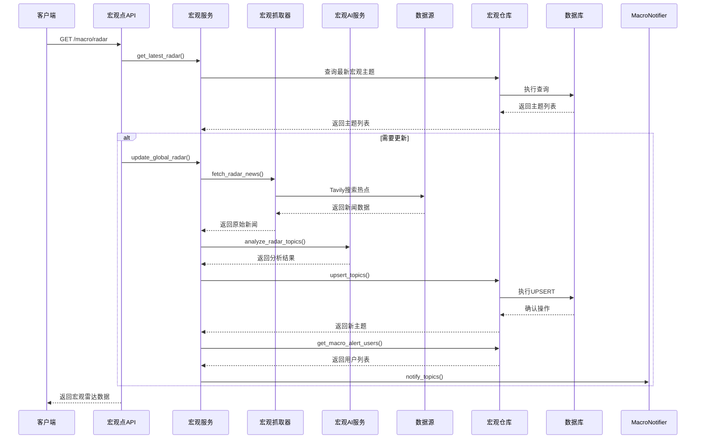
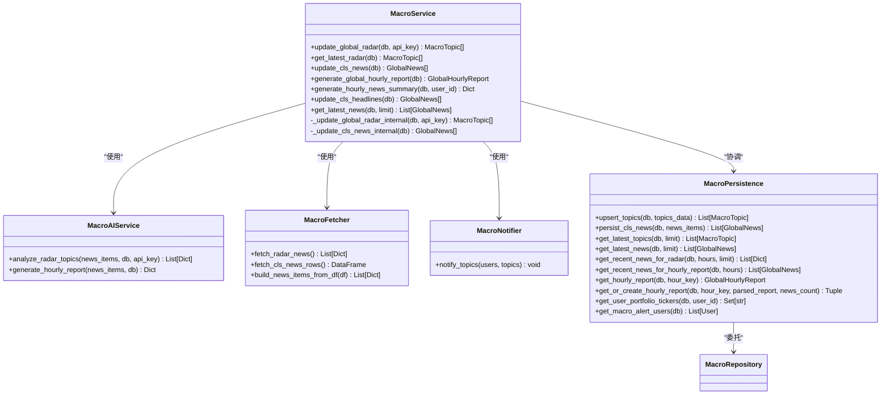
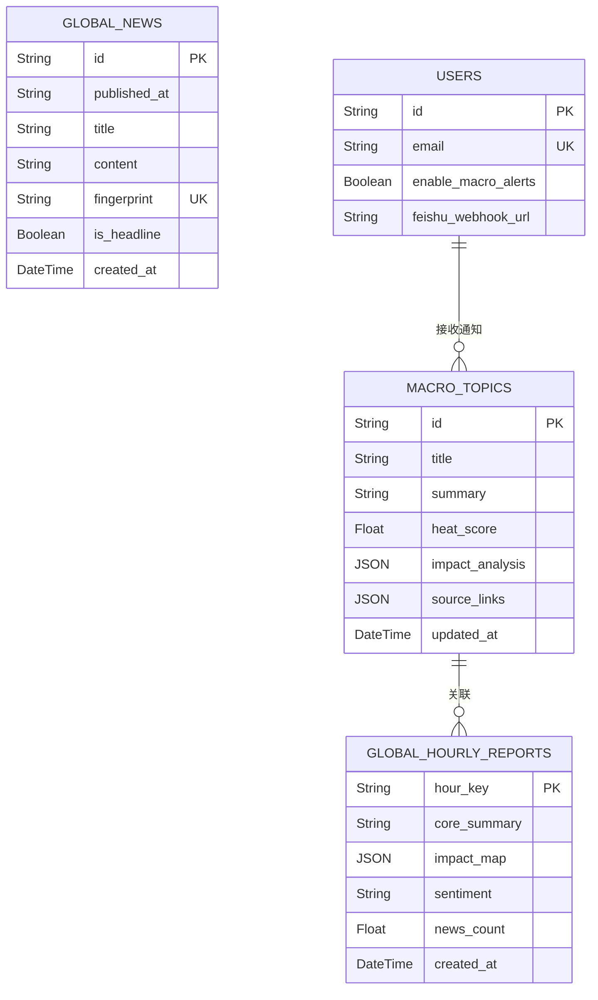
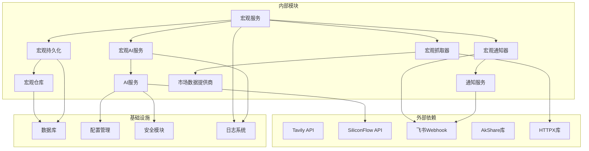

# 宏观分析服务

<cite>
**本文档引用的文件**
- [backend/app/services/macro_service.py](file://backend/app/services/macro_service.py)
- [backend/app/services/macro_ai_service.py](file://backend/app/services/macro_ai_service.py)
- [backend/app/services/macro_fetcher.py](file://backend/app/services/macro_fetcher.py)
- [backend/app/services/macro_notifier.py](file://backend/app/services/macro_notifier.py)
- [backend/app/infrastructure/db/repositories/macro_repository.py](file://backend/app/infrastructure/db/repositories/macro_repository.py)
- [backend/app/api/v1/endpoints/macro.py](file://backend/app/api/v1/endpoints/macro.py)
- [backend/app/models/macro.py](file://backend/app/models/macro.py)
- [backend/app/models/user.py](file://backend/app/models/user.py)
- [backend/app/services/ai_service.py](file://backend/app/services/ai_service.py)
- [backend/app/services/notification_service.py](file://backend/app/services/notification_service.py)
- [backend/app/services/market_providers/tavily.py](file://backend/app/services/market_providers/tavily.py)
- [backend/app/api/v1/api.py](file://backend/app/api/v1/api.py)
- [backend/app/core/config.py](file://backend/app/core/config.py)
</cite>

## 更新摘要
**所做更改**
- 更新了数据获取和处理逻辑的详细分析
- 增强了AI分析服务的功能描述
- 完善了数据持久化和通知机制的说明
- 添加了新的架构组件和服务模块

## 目录
1. [简介](#简介)
2. [项目结构](#项目结构)
3. [核心组件](#核心组件)
4. [架构概览](#架构概览)
5. [详细组件分析](#详细组件分析)
6. [依赖关系分析](#依赖关系分析)
7. [性能考虑](#性能考虑)
8. [故障排除指南](#故障排除指南)
9. [结论](#结论)

## 简介

宏观分析服务是AI股票顾问系统的核心功能模块之一，负责提供全球宏观市场洞察和实时新闻分析。该服务通过整合多个数据源，包括Tavily AI搜索引擎、财联社全球快讯、以及AI智能分析引擎，为用户提供宏观层面的投资决策支持。

该服务的主要功能包括：
- 全球宏观热点雷达扫描
- 实时新闻聚合与分析
- AI驱动的宏观影响评估
- 个性化投资建议推送
- 多维度市场情绪分析
- 每小时整点精要报告生成
- 持仓穿透分析功能

## 项目结构

宏观分析服务在项目中的组织结构如下：

**图表来源**
- [backend/app/api/v1/endpoints/macro.py:1-79](file://backend/app/api/v1/endpoints/macro.py#L1-L79)
- [backend/app/services/macro_service.py:16-216](file://backend/app/services/macro_service.py#L16-L216)

**章节来源**
- [backend/app/api/v1/endpoints/macro.py:1-79](file://backend/app/api/v1/endpoints/macro.py#L1-L79)
- [backend/app/services/macro_service.py:16-216](file://backend/app/services/macro_service.py#L16-L216)

## 核心组件

宏观分析服务由以下核心组件构成：

### 1. 宏观服务 (MacroService)
负责整个宏观分析流程的协调和执行，包括数据抓取、AI分析、数据持久化和通知推送。

### 2. 宏观AI服务 (MacroAIService)
专门处理宏观层面的AI分析任务，包括雷达主题提炼和整点报告生成。

### 3. 宏观抓取器 (MacroFetcher)
负责从多个数据源获取原始新闻和宏观事件数据。

### 4. 宏观通知器 (MacroNotifier)
负责将宏观分析结果通过飞书机器人推送给用户。

### 5. 宏观持久化 (MacroPersistence)
作为业务逻辑层与数据访问层之间的中转站，协调数据库操作。

### 6. 宏观仓库 (MacroRepository)
提供数据访问和持久化操作的具体实现。

**章节来源**
- [backend/app/services/macro_service.py:16-216](file://backend/app/services/macro_service.py#L16-L216)
- [backend/app/services/macro_ai_service.py:12-135](file://backend/app/services/macro_ai_service.py#L12-L135)
- [backend/app/services/macro_fetcher.py:11-113](file://backend/app/services/macro_fetcher.py#L11-L113)
- [backend/app/services/macro_notifier.py:9-58](file://backend/app/services/macro_notifier.py#L9-L58)
- [backend/app/services/macro_persistence.py:7-67](file://backend/app/services/macro_persistence.py#L7-L67)
- [backend/app/infrastructure/db/repositories/macro_repository.py:12-162](file://backend/app/infrastructure/db/repositories/macro_repository.py#L12-L162)

## 架构概览

宏观分析服务采用分层架构设计，实现了清晰的关注点分离：

**图表来源**
- [backend/app/api/v1/endpoints/macro.py:15-39](file://backend/app/api/v1/endpoints/macro.py#L15-L39)
- [backend/app/services/macro_service.py:31-87](file://backend/app/services/macro_service.py#L31-L87)

该架构具有以下特点：
- **异步处理**：支持非阻塞的后台更新
- **缓存机制**：避免重复的AI调用
- **故障转移**：多供应商支持和降级策略
- **通知集成**：实时推送分析结果
- **幂等性保证**：防止重复生成和存储

## 详细组件分析

### 宏观服务 (MacroService)

宏观服务是整个系统的核心协调者，负责管理完整的宏观分析流程。

#### 主要功能模块

**图表来源**
- [backend/app/services/macro_service.py:16-216](file://backend/app/services/macro_service.py#L16-L216)
- [backend/app/services/macro_ai_service.py:12-135](file://backend/app/services/macro_ai_service.py#L12-L135)
- [backend/app/services/macro_fetcher.py:11-113](file://backend/app/services/macro_fetcher.py#L11-L113)
- [backend/app/services/macro_notifier.py:9-58](file://backend/app/services/macro_notifier.py#L9-L58)
- [backend/app/services/macro_persistence.py:7-67](file://backend/app/services/macro_persistence.py#L7-L67)

#### 数据处理流程

宏观服务采用"热点扫描-AI分析-持久化-通知"的完整流程：

1. **数据采集阶段**：使用Tavily搜索引擎获取全球宏观热点
2. **降级机制**：当API受限时，回退到本地新闻数据
3. **AI分析阶段**：调用SiliconFlow进行主题聚类和影响分析
4. **数据持久化**：实现UPSERT逻辑，保持数据新鲜度
5. **通知推送**：向配置了的用户发送实时提醒

**章节来源**
- [backend/app/services/macro_service.py:43-87](file://backend/app/services/macro_service.py#L43-L87)

### 宏观AI服务 (MacroAIService)

宏观AI服务提供了专门的宏观分析能力，支持两种核心分析模式：

#### 雷达主题分析
- **输入**：通过搜索或聚合得到的近期新闻
- **输出**：3个核心宏观主题，包含逻辑链条、利好/利空标的定位
- **AI模型**：DeepSeek-V3
- **分析维度**：核心逻辑、利好标的、利空标的、热度评分

#### 整点报告生成
- **输入**：过去一小时的快讯标题
- **输出**：带情绪评估和标的影响图谱的JSON
- **分析维度**：全局综述、影响图谱、整体情绪定调

**章节来源**
- [backend/app/services/macro_ai_service.py:21-88](file://backend/app/services/macro_ai_service.py#L21-L88)
- [backend/app/services/macro_ai_service.py:91-134](file://backend/app/services/macro_ai_service.py#L91-L134)

### 宏观抓取器 (MacroFetcher)

宏观抓取器负责从多个数据源获取原始数据：

#### 全球宏观雷达数据
- **Tavily搜索**：针对三大垂直维度的定向搜索
  - 全球宏观层面事件
  - 地缘政治冲突
  - 联储货币政策
- **并发控制**：使用信号量限制API并发请求
- **错误处理**：HTTP 432状态码时直接降级

#### 财联社快讯数据
- **异步封装**：使用线程池执行阻塞的AkShare调用
- **数据清洗**：计算MD5指纹进行去重
- **格式标准化**：转换为统一的字典结构

**章节来源**
- [backend/app/services/macro_fetcher.py:18-67](file://backend/app/services/macro_fetcher.py#L18-L67)
- [backend/app/services/macro_fetcher.py:69-112](file://backend/app/services/macro_fetcher.py#L69-L112)

### 宏观通知器 (MacroNotifier)

通知器实现了智能的通知分发机制：

#### 通知策略
- **紧急雷达**：热度≥90的重大事件单独推送
- **常规精要**：每日/定期的全局主题汇总
- **异步推送**：避免单个用户失败影响整体推送

#### 用户分发
- **用户筛选**：只向开启宏观数字的用户推送
- **并发控制**：异步任务确保推送不阻塞主线程
- **错误处理**：单个用户推送失败不影响其他用户

**章节来源**
- [backend/app/services/macro_notifier.py:17-57](file://backend/app/services/macro_notifier.py#L17-L57)

### 宏观持久化 (MacroPersistence)

宏观点持久化作为业务层与数据层的中转站：

#### 核心功能
- **主题管理**：更新或插入宏观雷达主题
- **新闻持久化**：将抓取到的财联社快讯存储到数据库
- **查询接口**：提供各种数据查询方法
- **报告管理**：管理整点报告的创建和检索

#### 幂等性保证
- **时间戳检查**：防止多节点部署导致的重复生成
- **指纹去重**：确保新闻数据的唯一性
- **UPSERT逻辑**：保持数据新鲜度的同时避免重复

**章节来源**
- [backend/app/services/macro_persistence.py:18-66](file://backend/app/services/macro_persistence.py#L18-L66)

### 宏观仓库 (MacroRepository)

宏观仓库提供具体的数据访问实现：

#### 数据模型支持
- **MacroTopic**：宏观主题实体，包含热度评分和影响分析
- **GlobalNews**：全球新闻实体，支持指纹去重
- **GlobalHourlyReport**：小时报告实体，包含影响图谱

#### 高级查询功能
- **时间范围查询**：支持按时间范围获取新闻
- **用户持仓查询**：获取用户当前持仓标的
- **报告生成控制**：确保整点报告的幂等性

**章节来源**
- [backend/app/infrastructure/db/repositories/macro_repository.py:24-161](file://backend/app/infrastructure/db/repositories/macro_repository.py#L24-L161)

### 数据模型设计

宏观分析服务使用了三个核心数据表来支撑完整的分析流程：

**图表来源**
- [backend/app/models/macro.py:6-61](file://backend/app/models/macro.py#L6-L61)
- [backend/app/models/user.py:28-78](file://backend/app/models/user.py#L28-L78)

**章节来源**
- [backend/app/models/macro.py:1-61](file://backend/app/models/macro.py#L1-L61)
- [backend/app/models/user.py:1-78](file://backend/app/models/user.py#L1-L78)

## 依赖关系分析

宏观分析服务的依赖关系呈现清晰的分层结构：

**图表来源**
- [backend/app/services/macro_service.py:8-12](file://backend/app/services/macro_service.py#L8-L12)
- [backend/app/services/ai_service.py:3-25](file://backend/app/services/ai_service.py#L3-L25)

### 关键依赖特性

1. **异步并发控制**：使用信号量限制Tavily API的并发请求
2. **配置驱动**：通过Settings类集中管理所有外部服务配置
3. **安全加密**：用户API密钥采用加密存储和传输
4. **故障转移**：多供应商支持和智能降级策略
5. **幂等性保证**：防止重复操作和数据不一致

**章节来源**
- [backend/app/services/market_providers/tavily.py:17-25](file://backend/app/services/market_providers/tavily.py#L17-L25)
- [backend/app/core/config.py:4-36](file://backend/app/core/config.py#L4-L36)

## 性能考虑

宏观分析服务在设计时充分考虑了性能优化：

### 缓存策略
- **模型配置缓存**：5分钟TTL的AI模型配置缓存
- **供应商列表缓存**：10分钟TTL的供应商配置缓存
- **热点数据缓存**：基于updated_at的时间戳缓存

### 异步处理
- **后台更新**：使用BackgroundTasks进行非阻塞的数据更新
- **并发控制**：Tavily API使用信号量限制并发请求
- **批量操作**：数据库操作使用批量提交减少IO开销
- **线程池**：使用线程池处理阻塞的AkShare调用

### 降级机制
- **API配额降级**：当Tavily配额不足时回退到本地数据
- **供应商故障转移**：多供应商支持自动故障转移
- **智能刷新策略**：基于数据新鲜度的条件更新
- **幂等性保证**：防止重复生成和存储

### 错误处理
- **异常隔离**：单个组件失败不影响整体系统
- **资源清理**：确保数据库事务的正确回滚
- **日志记录**：详细的错误日志便于调试和监控

## 故障排除指南

### 常见问题及解决方案

#### 1. Tavily API配置问题
**症状**：宏观雷达更新失败，日志显示API key未配置
**解决方案**：
- 检查`.env`文件中的`TAVILY_API_KEY`配置
- 验证API key的有效性和配额状态
- 确认网络连接正常

#### 2. AI服务调用失败
**症状**：AI分析返回错误信息
**解决方案**：
- 检查`SILICONFLOW_API_KEY`配置
- 验证AI模型配置是否正确
- 查看供应商故障转移日志

#### 3. 通知推送失败
**症状**：飞书机器人无法接收消息
**解决方案**：
- 验证`FEISHU_WEBHOOK_URL`配置
- 检查飞书应用的权限设置
- 查看通知去重机制是否阻止了消息

#### 4. 数据库连接问题
**症状**：宏观数据无法持久化
**解决方案**：
- 检查`DATABASE_URL`配置
- 验证数据库服务状态
- 查看迁移脚本执行情况

#### 5. 并发控制问题
**症状**：Tavily API请求被限流
**解决方案**：
- 检查信号量配置
- 调整并发请求限制
- 查看API配额使用情况

**章节来源**
- [backend/app/services/macro_service.py:84-87](file://backend/app/services/macro_service.py#L84-L87)
- [backend/app/services/macro_fetcher.py:58-66](file://backend/app/services/macro_fetcher.py#L58-L66)
- [backend/app/services/macro_notifier.py:43-44](file://backend/app/services/macro_notifier.py#L43-L44)

## 结论

宏观分析服务通过精心设计的架构和完善的组件协作，为用户提供了一个强大而可靠的全球宏观市场分析平台。该服务的主要优势包括：

1. **全面的数据覆盖**：整合多个数据源，确保信息的准确性和时效性
2. **智能的AI分析**：利用先进的AI模型进行深度分析和预测
3. **灵活的通知机制**：支持多种通知方式和个性化配置
4. **健壮的系统设计**：具备完善的错误处理和故障转移能力
5. **优秀的性能表现**：通过缓存和异步处理确保系统的高效运行
6. **幂等性保证**：防止重复操作和数据不一致
7. **智能降级机制**：在网络不稳定时仍能提供基本功能

该服务为AI股票顾问系统提供了坚实的宏观分析基础，能够帮助用户更好地理解和应对复杂的市场变化，做出更加明智的投资决策。新增的整点精要报告和持仓穿透分析功能进一步增强了服务的实用性和智能化水平。